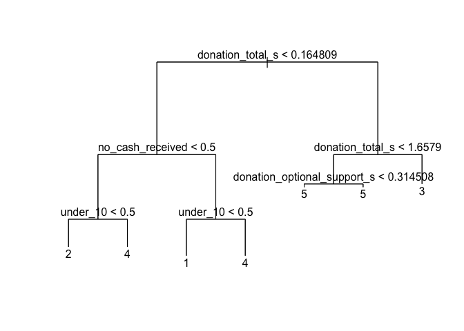
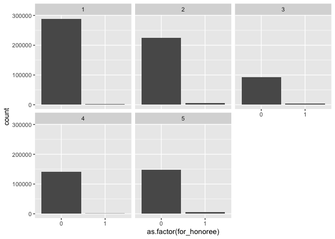

Donations - Final Project
================
Nicole An
2022-12-18

# load libraries / install packages

``` r
options(scipen = 999)
options(yardstick.event_first = FALSE)

library(tidyverse)
library(tidymodels)
library(tidytext)
library(janitor)
library(skimr)
library(kableExtra)
library(GGally)
library(kableExtra) 
library(vip)        
library(fastshap)   
library(MASS)
library(ISLR)
library(tree)
library(dplyr)
library(ggplot2)
library(imputeMissings)

#install.packages("factoextra")
library(factoextra)

library(lubridate)
```

# Read Data

``` r
donors1 <- read_csv("donations.csv") %>% clean_names()

# Remove rows with missing values & outlier which has donation_total = $100,000
donors <- donors1 %>% subset(!is.na(donation_total))
```

# Explanatory Analysis

## Skim

``` r
donors %>% skim()
```

<table style="width: auto;" class="table table-condensed">
<caption>
Data summary
</caption>
<tbody>
<tr>
<td style="text-align:left;">
Name
</td>
<td style="text-align:left;">
Piped data
</td>
</tr>
<tr>
<td style="text-align:left;">
Number of rows
</td>
<td style="text-align:left;">
1048567
</td>
</tr>
<tr>
<td style="text-align:left;">
Number of columns
</td>
<td style="text-align:left;">
21
</td>
</tr>
<tr>
<td style="text-align:left;">
\_\_\_\_\_\_\_\_\_\_\_\_\_\_\_\_\_\_\_\_\_\_\_
</td>
<td style="text-align:left;">
</td>
</tr>
<tr>
<td style="text-align:left;">
Column type frequency:
</td>
<td style="text-align:left;">
</td>
</tr>
<tr>
<td style="text-align:left;">
character
</td>
<td style="text-align:left;">
9
</td>
</tr>
<tr>
<td style="text-align:left;">
logical
</td>
<td style="text-align:left;">
8
</td>
</tr>
<tr>
<td style="text-align:left;">
numeric
</td>
<td style="text-align:left;">
4
</td>
</tr>
<tr>
<td style="text-align:left;">
\_\_\_\_\_\_\_\_\_\_\_\_\_\_\_\_\_\_\_\_\_\_\_\_
</td>
<td style="text-align:left;">
</td>
</tr>
<tr>
<td style="text-align:left;">
Group variables
</td>
<td style="text-align:left;">
None
</td>
</tr>
</tbody>
</table>

**Variable type: character**

<table>
<thead>
<tr>
<th style="text-align:left;">
skim_variable
</th>
<th style="text-align:right;">
n_missing
</th>
<th style="text-align:right;">
complete_rate
</th>
<th style="text-align:right;">
min
</th>
<th style="text-align:right;">
max
</th>
<th style="text-align:right;">
empty
</th>
<th style="text-align:right;">
n_unique
</th>
<th style="text-align:right;">
whitespace
</th>
</tr>
</thead>
<tbody>
<tr>
<td style="text-align:left;">
donationid
</td>
<td style="text-align:right;">
0
</td>
<td style="text-align:right;">
1.00
</td>
<td style="text-align:right;">
32
</td>
<td style="text-align:right;">
32
</td>
<td style="text-align:right;">
0
</td>
<td style="text-align:right;">
1048567
</td>
<td style="text-align:right;">
0
</td>
</tr>
<tr>
<td style="text-align:left;">
projectid
</td>
<td style="text-align:right;">
0
</td>
<td style="text-align:right;">
1.00
</td>
<td style="text-align:right;">
32
</td>
<td style="text-align:right;">
32
</td>
<td style="text-align:right;">
0
</td>
<td style="text-align:right;">
177220
</td>
<td style="text-align:right;">
0
</td>
</tr>
<tr>
<td style="text-align:left;">
donor_acctid
</td>
<td style="text-align:right;">
0
</td>
<td style="text-align:right;">
1.00
</td>
<td style="text-align:right;">
32
</td>
<td style="text-align:right;">
32
</td>
<td style="text-align:right;">
0
</td>
<td style="text-align:right;">
535334
</td>
<td style="text-align:right;">
0
</td>
</tr>
<tr>
<td style="text-align:left;">
donor_city
</td>
<td style="text-align:right;">
680107
</td>
<td style="text-align:right;">
0.35
</td>
<td style="text-align:right;">
1
</td>
<td style="text-align:right;">
49
</td>
<td style="text-align:right;">
0
</td>
<td style="text-align:right;">
13989
</td>
<td style="text-align:right;">
0
</td>
</tr>
<tr>
<td style="text-align:left;">
donor_state
</td>
<td style="text-align:right;">
221515
</td>
<td style="text-align:right;">
0.79
</td>
<td style="text-align:right;">
2
</td>
<td style="text-align:right;">
2
</td>
<td style="text-align:right;">
0
</td>
<td style="text-align:right;">
59
</td>
<td style="text-align:right;">
0
</td>
</tr>
<tr>
<td style="text-align:left;">
donation_timestamp
</td>
<td style="text-align:right;">
0
</td>
<td style="text-align:right;">
1.00
</td>
<td style="text-align:right;">
7
</td>
<td style="text-align:right;">
16
</td>
<td style="text-align:right;">
0
</td>
<td style="text-align:right;">
53536
</td>
<td style="text-align:right;">
0
</td>
</tr>
<tr>
<td style="text-align:left;">
dollar_amount
</td>
<td style="text-align:right;">
0
</td>
<td style="text-align:right;">
1.00
</td>
<td style="text-align:right;">
8
</td>
<td style="text-align:right;">
10
</td>
<td style="text-align:right;">
0
</td>
<td style="text-align:right;">
3
</td>
<td style="text-align:right;">
0
</td>
</tr>
<tr>
<td style="text-align:left;">
payment_method
</td>
<td style="text-align:right;">
0
</td>
<td style="text-align:right;">
1.00
</td>
<td style="text-align:right;">
5
</td>
<td style="text-align:right;">
24
</td>
<td style="text-align:right;">
0
</td>
<td style="text-align:right;">
8
</td>
<td style="text-align:right;">
0
</td>
</tr>
<tr>
<td style="text-align:left;">
donation_message
</td>
<td style="text-align:right;">
270818
</td>
<td style="text-align:right;">
0.74
</td>
<td style="text-align:right;">
1
</td>
<td style="text-align:right;">
12477
</td>
<td style="text-align:right;">
0
</td>
<td style="text-align:right;">
356172
</td>
<td style="text-align:right;">
0
</td>
</tr>
</tbody>
</table>

**Variable type: logical**

<table>
<thead>
<tr>
<th style="text-align:left;">
skim_variable
</th>
<th style="text-align:right;">
n_missing
</th>
<th style="text-align:right;">
complete_rate
</th>
<th style="text-align:right;">
mean
</th>
<th style="text-align:left;">
count
</th>
</tr>
</thead>
<tbody>
<tr>
<td style="text-align:left;">
is_teacher_acct
</td>
<td style="text-align:right;">
0
</td>
<td style="text-align:right;">
1
</td>
<td style="text-align:right;">
0.12
</td>
<td style="text-align:left;">
FAL: 927315, TRU: 121252
</td>
</tr>
<tr>
<td style="text-align:left;">
donation_included_optional_support
</td>
<td style="text-align:right;">
0
</td>
<td style="text-align:right;">
1
</td>
<td style="text-align:right;">
0.90
</td>
<td style="text-align:left;">
TRU: 943037, FAL: 105530
</td>
</tr>
<tr>
<td style="text-align:left;">
payment_included_acct_credit
</td>
<td style="text-align:right;">
0
</td>
<td style="text-align:right;">
1
</td>
<td style="text-align:right;">
0.11
</td>
<td style="text-align:left;">
FAL: 937361, TRU: 111206
</td>
</tr>
<tr>
<td style="text-align:left;">
payment_included_campaign_gift_card
</td>
<td style="text-align:right;">
0
</td>
<td style="text-align:right;">
1
</td>
<td style="text-align:right;">
0.33
</td>
<td style="text-align:left;">
FAL: 698155, TRU: 350412
</td>
</tr>
<tr>
<td style="text-align:left;">
payment_included_web_purchased_gift_card
</td>
<td style="text-align:right;">
0
</td>
<td style="text-align:right;">
1
</td>
<td style="text-align:right;">
0.05
</td>
<td style="text-align:left;">
FAL: 991618, TRU: 56949
</td>
</tr>
<tr>
<td style="text-align:left;">
payment_was_promo_matched
</td>
<td style="text-align:right;">
0
</td>
<td style="text-align:right;">
1
</td>
<td style="text-align:right;">
0.08
</td>
<td style="text-align:left;">
FAL: 961898, TRU: 86669
</td>
</tr>
<tr>
<td style="text-align:left;">
via_giving_page
</td>
<td style="text-align:right;">
0
</td>
<td style="text-align:right;">
1
</td>
<td style="text-align:right;">
0.33
</td>
<td style="text-align:left;">
FAL: 702061, TRU: 346506
</td>
</tr>
<tr>
<td style="text-align:left;">
for_honoree
</td>
<td style="text-align:right;">
0
</td>
<td style="text-align:right;">
1
</td>
<td style="text-align:right;">
0.02
</td>
<td style="text-align:left;">
FAL: 1027049, TRU: 21518
</td>
</tr>
</tbody>
</table>

**Variable type: numeric**

<table>
<thead>
<tr>
<th style="text-align:left;">
skim_variable
</th>
<th style="text-align:right;">
n_missing
</th>
<th style="text-align:right;">
complete_rate
</th>
<th style="text-align:right;">
mean
</th>
<th style="text-align:right;">
sd
</th>
<th style="text-align:right;">
p0
</th>
<th style="text-align:right;">
p25
</th>
<th style="text-align:right;">
p50
</th>
<th style="text-align:right;">
p75
</th>
<th style="text-align:right;">
p100
</th>
<th style="text-align:left;">
hist
</th>
</tr>
</thead>
<tbody>
<tr>
<td style="text-align:left;">
donor_zip
</td>
<td style="text-align:right;">
580546
</td>
<td style="text-align:right;">
0.45
</td>
<td style="text-align:right;">
50667.01
</td>
<td style="text-align:right;">
33285.41
</td>
<td style="text-align:right;">
0.00
</td>
<td style="text-align:right;">
20003.0
</td>
<td style="text-align:right;">
46902.00
</td>
<td style="text-align:right;">
89135.00
</td>
<td style="text-align:right;">
99999
</td>
<td style="text-align:left;">
▇▆▂▅▇
</td>
</tr>
<tr>
<td style="text-align:left;">
donation_to_project
</td>
<td style="text-align:right;">
0
</td>
<td style="text-align:right;">
1.00
</td>
<td style="text-align:right;">
65.75
</td>
<td style="text-align:right;">
215.43
</td>
<td style="text-align:right;">
-11.80
</td>
<td style="text-align:right;">
10.0
</td>
<td style="text-align:right;">
21.25
</td>
<td style="text-align:right;">
50.00
</td>
<td style="text-align:right;">
85000
</td>
<td style="text-align:left;">
▇▁▁▁▁
</td>
</tr>
<tr>
<td style="text-align:left;">
donation_optional_support
</td>
<td style="text-align:right;">
0
</td>
<td style="text-align:right;">
1.00
</td>
<td style="text-align:right;">
10.70
</td>
<td style="text-align:right;">
32.97
</td>
<td style="text-align:right;">
-0.02
</td>
<td style="text-align:right;">
1.5
</td>
<td style="text-align:right;">
3.75
</td>
<td style="text-align:right;">
7.50
</td>
<td style="text-align:right;">
15000
</td>
<td style="text-align:left;">
▇▁▁▁▁
</td>
</tr>
<tr>
<td style="text-align:left;">
donation_total
</td>
<td style="text-align:right;">
0
</td>
<td style="text-align:right;">
1.00
</td>
<td style="text-align:right;">
76.45
</td>
<td style="text-align:right;">
243.75
</td>
<td style="text-align:right;">
-11.80
</td>
<td style="text-align:right;">
10.0
</td>
<td style="text-align:right;">
25.00
</td>
<td style="text-align:right;">
56.47
</td>
<td style="text-align:right;">
100000
</td>
<td style="text-align:left;">
▇▁▁▁▁
</td>
</tr>
</tbody>
</table>

## Categorical & Numerical overview

``` r
donors_cat <- donors %>%
  dplyr::select(!c(donationid,projectid,donor_acctid,donor_city,donation_timestamp,donation_message)) %>%
  mutate(across(is.character,as.factor)) %>%
  mutate(across(is.logical,as.factor))
```

    ## Warning: Use of bare predicate functions was deprecated in tidyselect 1.1.0.
    ## ℹ Please use wrap predicates in `where()` instead.
    ##   # Was:
    ##   data %>% select(is.character)
    ## 
    ##   # Now:
    ##   data %>% select(where(is.character))

    ## Warning: Use of bare predicate functions was deprecated in tidyselect 1.1.0.
    ## ℹ Please use wrap predicates in `where()` instead.
    ##   # Was:
    ##   data %>% select(is.logical)
    ## 
    ##   # Now:
    ##   data %>% select(where(is.logical))

``` r
# Categorical 
donors_cat %>%
  pivot_longer(cols = where(is.factor), names_to = "column", values_to="value") %>%
  dplyr::select(column, value) %>%
  group_by(column, value) %>%
  summarise(count=n()) %>%
  ggplot(aes(x = reorder_within(value, -count, count), y = count, fill = as.factor(value))) +
  theme(axis.text.x = element_text(angle = 90,size = 5.5)) +
  geom_col(show.legend = FALSE) +
  labs(title = "Categorical Variable Frequency Distribution", x = "value", y = "count") +
  facet_wrap(~column, ncol = 5,scales = "free") +
  scale_x_reordered()
```

    ## `summarise()` has grouped output by 'column'. You can override using the
    ## `.groups` argument.

<!-- -->

``` r
# Numerical
donors_cat %>%
  pivot_longer(cols = where(is.numeric), names_to = "column", values_to="value") %>%
  dplyr::select(column, value) %>%
  group_by(column) %>%
  summarise(count = n(),
            n_miss = sum(is.na(value)),
            n_distinct = n_distinct(value),
            mean = mean(value, na.rm = TRUE),
            median = median(value, na.rm = TRUE),
            min = min(value, na.rm = TRUE),
            max = max(value, na.rm = TRUE),
            sd = sd(value, na.rm = TRUE),
            )
```

    ## # A tibble: 4 × 9
    ##   column                 count n_miss n_dis…¹   mean median    min    max     sd
    ##   <chr>                  <int>  <int>   <int>  <dbl>  <dbl>  <dbl>  <dbl>  <dbl>
    ## 1 donation_optional_su… 1.05e6      0   16977 1.07e1 3.75e0  -0.02  15000 3.30e1
    ## 2 donation_to_project   1.05e6      0   52271 6.58e1 2.12e1 -11.8   85000 2.15e2
    ## 3 donation_total        1.05e6      0   57427 7.64e1 2.5 e1 -11.8  100000 2.44e2
    ## 4 donor_zip             1.05e6 580546   18021 5.07e4 4.69e4   0     99999 3.33e4
    ## # … with abbreviated variable name ¹​n_distinct

## Plots

``` r
for (c in names(donors_cat)) {
  if (c %in% names(donors_cat %>% dplyr::select(where(is.factor)))) {
    # -- for each character column create a chart
    print( donors_cat %>%
             ggplot(., aes(!!as.name(c))) + 
             geom_bar()  +labs(title = c) + theme(axis.text.x = element_text(angle = 45, hjust=1)))
  } else {
    # -- comparative boxplots
    print(ggplot(donors_cat, aes(x=!!as.name(c)))+ geom_histogram(bins = 100) +labs(title = c) + theme(axis.text.x = element_text(angle = 45, hjust=1)))
  }
}
```

<!-- -->

    ## Warning: Removed 580546 rows containing non-finite values (stat_bin).

<!-- --><!-- --><!-- --><!-- --><!-- --><!-- --><!-- --><!-- --><!-- --><!-- --><!-- --><!-- --><!-- --><!-- -->

### How much donations are made using different payment methods?

``` r
donors %>%
  group_by(payment_method) %>%
  summarise(donation_median = median(donation_total)) %>%
  ggplot(aes(x = reorder(payment_method,-donation_median),y=donation_median)) + geom_col() + labs(title = "Donations made with Different Payment Methods", x = "Payment Method") + theme(axis.text.x = element_text(angle = 45, hjust=1))
```

<!-- -->

### How much donations are given using a giving/campaign page?

``` r
donors %>%
  ggplot(aes(x = via_giving_page,y=donation_total)) + geom_boxplot()
```

<!-- -->
\# Clustering Model

## Data Preperation for Clustering

``` r
donors %>% ggplot(aes(donation_total)) + geom_histogram(bins=200)
```

<!-- -->

``` r
donors %>% arrange(desc(donation_total))
```

    ## # A tibble: 1,048,567 × 21
    ##    donationid    proje…¹ donor…² donor…³ donor…⁴ donor…⁵ is_te…⁶ donat…⁷ donat…⁸
    ##    <chr>         <chr>   <chr>   <chr>   <chr>     <dbl> <lgl>   <chr>     <dbl>
    ##  1 c71f833b9d26… dc106a… dd3831… New Yo… NY        10001 FALSE   33:52.4  85000 
    ##  2 8731fe0e534c… b13aaa… 774cba… Anahola HI        96703 FALSE   25:57.8  60000 
    ##  3 2a9e7bf2ce74… c1476d… f88363… <NA>    NY           NA FALSE   10:27.5  36833.
    ##  4 0ee455b42d2c… dc106a… 8fc3f6… <NA>    NY           NA FALSE   47:59.2  33475.
    ##  5 bac53805448e… ba5b7f… 8fc3f6… <NA>    NY           NA FALSE   07:17.6  31875.
    ##  6 3c017dd0c893… ad1953… 92e05c… Palo A… CA        94303 FALSE   09:13.7  26369.
    ##  7 4367e69b4d75… dc106a… 89f8dd… New Yo… NY        10001 FALSE   42:23.5  21250 
    ##  8 8cb97adbdd06… e45cbc… 4c413c… New Yo… NY        10019 FALSE   40:23.0  20717 
    ##  9 3822b87e18f9… c434c0… 13b791… <NA>    LA           NA FALSE   54:02.0  22990 
    ## 10 88ffa0453dad… dcd8bb… 33a41b… San Fr… CA        94102 FALSE   58:05.2  17000 
    ## # … with 1,048,557 more rows, 12 more variables:
    ## #   donation_optional_support <dbl>, donation_total <dbl>, dollar_amount <chr>,
    ## #   donation_included_optional_support <lgl>, payment_method <chr>,
    ## #   payment_included_acct_credit <lgl>,
    ## #   payment_included_campaign_gift_card <lgl>,
    ## #   payment_included_web_purchased_gift_card <lgl>,
    ## #   payment_was_promo_matched <lgl>, via_giving_page <lgl>, …

``` r
donors %>% summarise(m=mean(donation_total))
```

    ## # A tibble: 1 × 1
    ##       m
    ##   <dbl>
    ## 1  76.4

``` r
outliers <- boxplot(donors$donation_total, plot=FALSE)$out

donors_outliers <- donors[which(donors$donation_total %in% outliers),]
donors_no_outlier <- donors[-which(donors$donation_total %in% outliers),]

donors_no_outlier %>% ggplot(aes(donation_total)) + geom_histogram(bins=20)
```

<!-- -->

``` r
# How much donations are given using a giving/campaign page?
donors_no_outlier %>% ggplot(aes(x = via_giving_page,y=donation_total)) + geom_boxplot()
```

<!-- -->

``` r
# Outliers are removed because it is too significant and influence the model performance, but we will come back to it during the analysis. 
donors <- donors_no_outlier
```

## Recipe building

``` r
# transform logical to binary numerical 
donors <- donors %>%
  mutate(across(where(is.logical),function(x) 1*x))


# create dummy variables for education and marital status

donors_prep <- donors %>%
  mutate(under_10 = ifelse(dollar_amount == "under_10",1,0)) %>%
  mutate(f_10_to_100 = ifelse(dollar_amount == "10_to_100",1,0)) %>%
  mutate(f_100_and_up = ifelse(dollar_amount == "100_and_up",1,0)) %>%
  mutate(   no_cash_received = ifelse(payment_method == "no_cash_received",1,0)) %>%
  mutate(creditcard = ifelse(payment_method == "creditcard",1,0)) %>%
  mutate(   paypal = ifelse(payment_method == "paypal",1,0)) %>%
  mutate(amazon = ifelse(payment_method == "amazon",1,0)) %>%
  mutate(   check = ifelse(payment_method == "check",1,0)) %>%
  mutate(double_your_impact_match = ifelse(payment_method == "double_your_impact_match",1,0)) %>%
  mutate(   almost_home_match = ifelse(payment_method == "almost_home_match",1,0)) %>%
  mutate(promo_code_match = ifelse(payment_method == "promo_code_match",1,0))


#standardize numeric variables

donors_prep <- donors_prep %>%
    mutate(donation_to_project_s = scale(donation_to_project),
           donation_optional_support_s = scale(donation_optional_support),
           donation_total_s = scale(donation_total))
  
head(donors_prep)
```

    ## # A tibble: 6 × 35
    ##   donationid     proje…¹ donor…² donor…³ donor…⁴ donor…⁵ is_te…⁶ donat…⁷ donat…⁸
    ##   <chr>          <chr>   <chr>   <chr>   <chr>     <dbl>   <dbl> <chr>     <dbl>
    ## 1 431d720bc3dfd… ffffac… 22cbc9… Peacht… GA        30269       0 27:34.8   42.5 
    ## 2 fcfedba1c8a0b… ffffac… 521f18… <NA>    GA           NA       0 54:21.6   26.8 
    ## 3 3fa95d29986aa… ffffac… 1e0a63… Rockvi… MD        20853       0 53:53.0   55.4 
    ## 4 020ad6bd5e88a… ffffac… 1d4acb… Salem   IN        47167       0 54:01.1    8.5 
    ## 5 4b44b03f304d6… ffffac… 59c3c3… anonym… <NA>          0       0 21:00.0   20   
    ## 6 9be4b22432cae… ffffac… 2215e4… <NA>    <NA>         NA       0 59:09.4    4.25
    ## # … with 26 more variables: donation_optional_support <dbl>,
    ## #   donation_total <dbl>, dollar_amount <chr>,
    ## #   donation_included_optional_support <dbl>, payment_method <chr>,
    ## #   payment_included_acct_credit <dbl>,
    ## #   payment_included_campaign_gift_card <dbl>,
    ## #   payment_included_web_purchased_gift_card <dbl>,
    ## #   payment_was_promo_matched <dbl>, via_giving_page <dbl>, …

``` r
# remove redundant and rejected variables
donorsfin1 = subset(donors_prep, select= -c(donationid,projectid,donor_acctid,donor_city,donor_state,dollar_amount,payment_method,donation_timestamp,donation_message,donor_zip,donation_to_project,donation_optional_support,donation_total)) 
                                    


# sample 10% of data for choosing cluster
samp <- sample(nrow(donorsfin1),0.01*nrow(donorsfin1))

donorsfin <- donorsfin1[samp,]

donorsfin %>% skim()
```

<table style="width: auto;" class="table table-condensed">
<caption>
Data summary
</caption>
<tbody>
<tr>
<td style="text-align:left;">
Name
</td>
<td style="text-align:left;">
Piped data
</td>
</tr>
<tr>
<td style="text-align:left;">
Number of rows
</td>
<td style="text-align:left;">
9127
</td>
</tr>
<tr>
<td style="text-align:left;">
Number of columns
</td>
<td style="text-align:left;">
22
</td>
</tr>
<tr>
<td style="text-align:left;">
\_\_\_\_\_\_\_\_\_\_\_\_\_\_\_\_\_\_\_\_\_\_\_
</td>
<td style="text-align:left;">
</td>
</tr>
<tr>
<td style="text-align:left;">
Column type frequency:
</td>
<td style="text-align:left;">
</td>
</tr>
<tr>
<td style="text-align:left;">
numeric
</td>
<td style="text-align:left;">
22
</td>
</tr>
<tr>
<td style="text-align:left;">
\_\_\_\_\_\_\_\_\_\_\_\_\_\_\_\_\_\_\_\_\_\_\_\_
</td>
<td style="text-align:left;">
</td>
</tr>
<tr>
<td style="text-align:left;">
Group variables
</td>
<td style="text-align:left;">
None
</td>
</tr>
</tbody>
</table>

**Variable type: numeric**

<table>
<thead>
<tr>
<th style="text-align:left;">
skim_variable
</th>
<th style="text-align:right;">
n_missing
</th>
<th style="text-align:right;">
complete_rate
</th>
<th style="text-align:right;">
mean
</th>
<th style="text-align:right;">
sd
</th>
<th style="text-align:right;">
p0
</th>
<th style="text-align:right;">
p25
</th>
<th style="text-align:right;">
p50
</th>
<th style="text-align:right;">
p75
</th>
<th style="text-align:right;">
p100
</th>
<th style="text-align:left;">
hist
</th>
</tr>
</thead>
<tbody>
<tr>
<td style="text-align:left;">
is_teacher_acct
</td>
<td style="text-align:right;">
0
</td>
<td style="text-align:right;">
1
</td>
<td style="text-align:right;">
0.13
</td>
<td style="text-align:right;">
0.33
</td>
<td style="text-align:right;">
0.00
</td>
<td style="text-align:right;">
0.00
</td>
<td style="text-align:right;">
0.00
</td>
<td style="text-align:right;">
0.00
</td>
<td style="text-align:right;">
1.00
</td>
<td style="text-align:left;">
▇▁▁▁▁
</td>
</tr>
<tr>
<td style="text-align:left;">
donation_included_optional_support
</td>
<td style="text-align:right;">
0
</td>
<td style="text-align:right;">
1
</td>
<td style="text-align:right;">
0.90
</td>
<td style="text-align:right;">
0.30
</td>
<td style="text-align:right;">
0.00
</td>
<td style="text-align:right;">
1.00
</td>
<td style="text-align:right;">
1.00
</td>
<td style="text-align:right;">
1.00
</td>
<td style="text-align:right;">
1.00
</td>
<td style="text-align:left;">
▁▁▁▁▇
</td>
</tr>
<tr>
<td style="text-align:left;">
payment_included_acct_credit
</td>
<td style="text-align:right;">
0
</td>
<td style="text-align:right;">
1
</td>
<td style="text-align:right;">
0.09
</td>
<td style="text-align:right;">
0.29
</td>
<td style="text-align:right;">
0.00
</td>
<td style="text-align:right;">
0.00
</td>
<td style="text-align:right;">
0.00
</td>
<td style="text-align:right;">
0.00
</td>
<td style="text-align:right;">
1.00
</td>
<td style="text-align:left;">
▇▁▁▁▁
</td>
</tr>
<tr>
<td style="text-align:left;">
payment_included_campaign_gift_card
</td>
<td style="text-align:right;">
0
</td>
<td style="text-align:right;">
1
</td>
<td style="text-align:right;">
0.37
</td>
<td style="text-align:right;">
0.48
</td>
<td style="text-align:right;">
0.00
</td>
<td style="text-align:right;">
0.00
</td>
<td style="text-align:right;">
0.00
</td>
<td style="text-align:right;">
1.00
</td>
<td style="text-align:right;">
1.00
</td>
<td style="text-align:left;">
▇▁▁▁▅
</td>
</tr>
<tr>
<td style="text-align:left;">
payment_included_web_purchased_gift_card
</td>
<td style="text-align:right;">
0
</td>
<td style="text-align:right;">
1
</td>
<td style="text-align:right;">
0.05
</td>
<td style="text-align:right;">
0.22
</td>
<td style="text-align:right;">
0.00
</td>
<td style="text-align:right;">
0.00
</td>
<td style="text-align:right;">
0.00
</td>
<td style="text-align:right;">
0.00
</td>
<td style="text-align:right;">
1.00
</td>
<td style="text-align:left;">
▇▁▁▁▁
</td>
</tr>
<tr>
<td style="text-align:left;">
payment_was_promo_matched
</td>
<td style="text-align:right;">
0
</td>
<td style="text-align:right;">
1
</td>
<td style="text-align:right;">
0.09
</td>
<td style="text-align:right;">
0.29
</td>
<td style="text-align:right;">
0.00
</td>
<td style="text-align:right;">
0.00
</td>
<td style="text-align:right;">
0.00
</td>
<td style="text-align:right;">
0.00
</td>
<td style="text-align:right;">
1.00
</td>
<td style="text-align:left;">
▇▁▁▁▁
</td>
</tr>
<tr>
<td style="text-align:left;">
via_giving_page
</td>
<td style="text-align:right;">
0
</td>
<td style="text-align:right;">
1
</td>
<td style="text-align:right;">
0.32
</td>
<td style="text-align:right;">
0.47
</td>
<td style="text-align:right;">
0.00
</td>
<td style="text-align:right;">
0.00
</td>
<td style="text-align:right;">
0.00
</td>
<td style="text-align:right;">
1.00
</td>
<td style="text-align:right;">
1.00
</td>
<td style="text-align:left;">
▇▁▁▁▃
</td>
</tr>
<tr>
<td style="text-align:left;">
for_honoree
</td>
<td style="text-align:right;">
0
</td>
<td style="text-align:right;">
1
</td>
<td style="text-align:right;">
0.02
</td>
<td style="text-align:right;">
0.14
</td>
<td style="text-align:right;">
0.00
</td>
<td style="text-align:right;">
0.00
</td>
<td style="text-align:right;">
0.00
</td>
<td style="text-align:right;">
0.00
</td>
<td style="text-align:right;">
1.00
</td>
<td style="text-align:left;">
▇▁▁▁▁
</td>
</tr>
<tr>
<td style="text-align:left;">
under_10
</td>
<td style="text-align:right;">
0
</td>
<td style="text-align:right;">
1
</td>
<td style="text-align:right;">
0.16
</td>
<td style="text-align:right;">
0.36
</td>
<td style="text-align:right;">
0.00
</td>
<td style="text-align:right;">
0.00
</td>
<td style="text-align:right;">
0.00
</td>
<td style="text-align:right;">
0.00
</td>
<td style="text-align:right;">
1.00
</td>
<td style="text-align:left;">
▇▁▁▁▂
</td>
</tr>
<tr>
<td style="text-align:left;">
f_10_to_100
</td>
<td style="text-align:right;">
0
</td>
<td style="text-align:right;">
1
</td>
<td style="text-align:right;">
0.75
</td>
<td style="text-align:right;">
0.43
</td>
<td style="text-align:right;">
0.00
</td>
<td style="text-align:right;">
1.00
</td>
<td style="text-align:right;">
1.00
</td>
<td style="text-align:right;">
1.00
</td>
<td style="text-align:right;">
1.00
</td>
<td style="text-align:left;">
▂▁▁▁▇
</td>
</tr>
<tr>
<td style="text-align:left;">
f_100_and_up
</td>
<td style="text-align:right;">
0
</td>
<td style="text-align:right;">
1
</td>
<td style="text-align:right;">
0.09
</td>
<td style="text-align:right;">
0.29
</td>
<td style="text-align:right;">
0.00
</td>
<td style="text-align:right;">
0.00
</td>
<td style="text-align:right;">
0.00
</td>
<td style="text-align:right;">
0.00
</td>
<td style="text-align:right;">
1.00
</td>
<td style="text-align:left;">
▇▁▁▁▁
</td>
</tr>
<tr>
<td style="text-align:left;">
no_cash_received
</td>
<td style="text-align:right;">
0
</td>
<td style="text-align:right;">
1
</td>
<td style="text-align:right;">
0.49
</td>
<td style="text-align:right;">
0.50
</td>
<td style="text-align:right;">
0.00
</td>
<td style="text-align:right;">
0.00
</td>
<td style="text-align:right;">
0.00
</td>
<td style="text-align:right;">
1.00
</td>
<td style="text-align:right;">
1.00
</td>
<td style="text-align:left;">
▇▁▁▁▇
</td>
</tr>
<tr>
<td style="text-align:left;">
creditcard
</td>
<td style="text-align:right;">
0
</td>
<td style="text-align:right;">
1
</td>
<td style="text-align:right;">
0.30
</td>
<td style="text-align:right;">
0.46
</td>
<td style="text-align:right;">
0.00
</td>
<td style="text-align:right;">
0.00
</td>
<td style="text-align:right;">
0.00
</td>
<td style="text-align:right;">
1.00
</td>
<td style="text-align:right;">
1.00
</td>
<td style="text-align:left;">
▇▁▁▁▃
</td>
</tr>
<tr>
<td style="text-align:left;">
paypal
</td>
<td style="text-align:right;">
0
</td>
<td style="text-align:right;">
1
</td>
<td style="text-align:right;">
0.09
</td>
<td style="text-align:right;">
0.28
</td>
<td style="text-align:right;">
0.00
</td>
<td style="text-align:right;">
0.00
</td>
<td style="text-align:right;">
0.00
</td>
<td style="text-align:right;">
0.00
</td>
<td style="text-align:right;">
1.00
</td>
<td style="text-align:left;">
▇▁▁▁▁
</td>
</tr>
<tr>
<td style="text-align:left;">
amazon
</td>
<td style="text-align:right;">
0
</td>
<td style="text-align:right;">
1
</td>
<td style="text-align:right;">
0.03
</td>
<td style="text-align:right;">
0.18
</td>
<td style="text-align:right;">
0.00
</td>
<td style="text-align:right;">
0.00
</td>
<td style="text-align:right;">
0.00
</td>
<td style="text-align:right;">
0.00
</td>
<td style="text-align:right;">
1.00
</td>
<td style="text-align:left;">
▇▁▁▁▁
</td>
</tr>
<tr>
<td style="text-align:left;">
check
</td>
<td style="text-align:right;">
0
</td>
<td style="text-align:right;">
1
</td>
<td style="text-align:right;">
0.00
</td>
<td style="text-align:right;">
0.06
</td>
<td style="text-align:right;">
0.00
</td>
<td style="text-align:right;">
0.00
</td>
<td style="text-align:right;">
0.00
</td>
<td style="text-align:right;">
0.00
</td>
<td style="text-align:right;">
1.00
</td>
<td style="text-align:left;">
▇▁▁▁▁
</td>
</tr>
<tr>
<td style="text-align:left;">
double_your_impact_match
</td>
<td style="text-align:right;">
0
</td>
<td style="text-align:right;">
1
</td>
<td style="text-align:right;">
0.01
</td>
<td style="text-align:right;">
0.08
</td>
<td style="text-align:right;">
0.00
</td>
<td style="text-align:right;">
0.00
</td>
<td style="text-align:right;">
0.00
</td>
<td style="text-align:right;">
0.00
</td>
<td style="text-align:right;">
1.00
</td>
<td style="text-align:left;">
▇▁▁▁▁
</td>
</tr>
<tr>
<td style="text-align:left;">
almost_home_match
</td>
<td style="text-align:right;">
0
</td>
<td style="text-align:right;">
1
</td>
<td style="text-align:right;">
0.00
</td>
<td style="text-align:right;">
0.02
</td>
<td style="text-align:right;">
0.00
</td>
<td style="text-align:right;">
0.00
</td>
<td style="text-align:right;">
0.00
</td>
<td style="text-align:right;">
0.00
</td>
<td style="text-align:right;">
1.00
</td>
<td style="text-align:left;">
▇▁▁▁▁
</td>
</tr>
<tr>
<td style="text-align:left;">
promo_code_match
</td>
<td style="text-align:right;">
0
</td>
<td style="text-align:right;">
1
</td>
<td style="text-align:right;">
0.09
</td>
<td style="text-align:right;">
0.28
</td>
<td style="text-align:right;">
0.00
</td>
<td style="text-align:right;">
0.00
</td>
<td style="text-align:right;">
0.00
</td>
<td style="text-align:right;">
0.00
</td>
<td style="text-align:right;">
1.00
</td>
<td style="text-align:left;">
▇▁▁▁▁
</td>
</tr>
<tr>
<td style="text-align:left;">
donation_to_project_s
</td>
<td style="text-align:right;">
0
</td>
<td style="text-align:right;">
1
</td>
<td style="text-align:right;">
0.02
</td>
<td style="text-align:right;">
1.02
</td>
<td style="text-align:right;">
-1.07
</td>
<td style="text-align:right;">
-0.73
</td>
<td style="text-align:right;">
-0.23
</td>
<td style="text-align:right;">
0.62
</td>
<td style="text-align:right;">
3.93
</td>
<td style="text-align:left;">
▇▂▁▁▁
</td>
</tr>
<tr>
<td style="text-align:left;">
donation_optional_support_s
</td>
<td style="text-align:right;">
0
</td>
<td style="text-align:right;">
1
</td>
<td style="text-align:right;">
0.02
</td>
<td style="text-align:right;">
1.02
</td>
<td style="text-align:right;">
-0.95
</td>
<td style="text-align:right;">
-0.62
</td>
<td style="text-align:right;">
-0.29
</td>
<td style="text-align:right;">
0.38
</td>
<td style="text-align:right;">
4.90
</td>
<td style="text-align:left;">
▇▂▁▁▁
</td>
</tr>
<tr>
<td style="text-align:left;">
donation_total_s
</td>
<td style="text-align:right;">
0
</td>
<td style="text-align:right;">
1
</td>
<td style="text-align:right;">
0.02
</td>
<td style="text-align:right;">
1.02
</td>
<td style="text-align:right;">
-1.07
</td>
<td style="text-align:right;">
-0.73
</td>
<td style="text-align:right;">
-0.21
</td>
<td style="text-align:right;">
0.65
</td>
<td style="text-align:right;">
3.26
</td>
<td style="text-align:left;">
▇▂▁▁▁
</td>
</tr>
</tbody>
</table>

## Visually choose number of clusters

``` r
# how many clusters

fviz_nbclust(donorsfin, kmeans, method="wss")
```

<!-- -->

## Build clusters

``` r
set.seed(1002)

clusters5 <- kmeans(donorsfin1, 5, iter.max = 200, nstart = 5)

# visualize clusters

fviz_cluster(clusters5,donorsfin1,ellipse.type="norm",geom="point")
```

<!-- -->

## Explore clusters

``` r
cluster <- as.factor(clusters5$cluster)

clusters5
```

    ## K-means clustering with 5 clusters of sizes 290154, 230141, 96857, 142455, 153122
    ## 
    ## Cluster means:
    ##   is_teacher_acct donation_included_optional_support
    ## 1      0.10635042                          0.8876355
    ## 2      0.08703360                          0.8999570
    ## 3      0.07734082                          0.9080707
    ## 4      0.31489944                          0.8590713
    ## 5      0.08608169                          0.9254908
    ##   payment_included_acct_credit payment_included_campaign_gift_card
    ## 1                   0.11426691                           0.8329439
    ## 2                   0.01200134                           0.0116320
    ## 3                   0.09798982                           0.1957938
    ## 4                   0.13953880                           0.3517672
    ## 5                   0.09789580                           0.1704458
    ##   payment_included_web_purchased_gift_card payment_was_promo_matched
    ## 1                              0.056776746             0.00005858958
    ## 2                              0.001494736             0.18722435377
    ## 3                              0.061193306             0.10256357310
    ## 4                              0.099147099             0.09192376540
    ## 5                              0.068605426             0.11360222568
    ##   via_giving_page for_honoree     under_10 f_10_to_100  f_100_and_up
    ## 1       0.1142393 0.009098617 0.0000000000   1.0000000 0.00000000000
    ## 2       0.4966564 0.023881012 0.0000000000   1.0000000 0.00000000000
    ## 3       0.3421436 0.036094449 0.0000103245   0.1946478 0.80534189578
    ## 4       0.4407287 0.004991050 1.0000000000   0.0000000 0.00000000000
    ## 5       0.3323167 0.032621047 0.0000000000   0.9999935 0.00000653074
    ##   no_cash_received creditcard      paypal       amazon        check
    ## 1        0.9969671  0.0000000 0.002329797 0.0006203602 0.0000827147
    ## 2        0.0000000  0.5698985 0.191239284 0.0616230919 0.0061614402
    ## 3        0.3191406  0.4036466 0.070185944 0.0280310148 0.0139690472
    ## 4        0.5753536  0.1968692 0.110729704 0.0310975396 0.0012284581
    ## 5        0.2881885  0.4408968 0.104563681 0.0408367184 0.0080850564
    ##   double_your_impact_match almost_home_match promo_code_match
    ## 1           0.000000000000     0.00000000000       0.00000000
    ## 2           0.000000000000     0.00027374523       0.17080399
    ## 3           0.059489763259     0.00470797155       0.10082906
    ## 4           0.000007019761     0.00008423713       0.08463023
    ## 5           0.001874322436     0.00146288580       0.11409203
    ##   donation_to_project_s donation_optional_support_s donation_total_s
    ## 1            -0.4245163                  -0.3961869       -0.4289988
    ## 2            -0.3649413                  -0.3427928       -0.3691283
    ## 3             2.3638422                   2.1651052        2.3823778
    ## 4            -0.9520679                  -0.8541274       -0.9567949
    ## 5             0.7434284                   0.6910505        0.7508884
    ## 
    ## Clustering vector:
    ##     [1] 5 2 5 2 1 4 5 2 2 2 5 3 3 3 1 3 2 5 2 5 5 1 4 1 1 2 5 2 1 1 2 2 2 4 1 1
    ##    [37] 3 2 5 5 2 1 1 1 3 2 5 2 2 2 3 2 2 2 2 2 2 5 4 4 2 4 4 4 4 4 4 4 1 4 4 4
    ##    [73] 2 4 1 4 4 4 4 3 1 4 1 4 4 4 4 4 4 4 1 1 4 4 4 4 4 4 4 4 4 4 2 4 4 4 4 4
    ##   [109] 4 4 4 4 4 4 2 4 2 4 4 4 4 4 1 4 4 4 4 4 4 4 4 4 4 4 4 4 4 4 4 4 4 4 4 1
    ##   [145] 1 1 1 1 1 5 3 5 1 1 2 4 2 2 2 1 4 2 2 2 3 1 5 5 3 5 2 1 1 2 1 2 2 2 1 1
    ##   [181] 1 5 3 2 5 2 5 5 2 1 3 5 3 3 5 5 3 1 2 2 2 5 1 1 5 5 1 1 1 1 1 2 1 1 1 1
    ##   [217] 2 2 2 2 2 2 5 5 2 2 5 2 1 5 1 5 2 1 3 5 3 2 2 1 4 4 1 5 5 1 5 2 5 1 5 1
    ##   [253] 1 5 2 5 2 3 2 5 2 2 5 5 2 2 2 5 2 2 2 2 5 4 5 2 5 5 4 2 5 4 5 4 5 1 4 1
    ##   [289] 1 2 3 4 5 4 1 1 1 4 5 1 1 1 4 4 3 1 1 4 1 3 2 1 1 1 1 1 1 1 1 1 1 1 1 1
    ##   [325] 5 1 5 3 5 5 1 1 1 1 1 1 1 1 1 1 1 1 1 1 1 1 1 1 4 1 1 1 4 1 5 5 5 5 3 5
    ##   [361] 2 5 5 5 2 5 1 1 1 5 1 1 4 4 3 1 3 3 3 1 5 2 1 1 4 1 5 1 4 1 2 1 2 1 1 2
    ##   [397] 4 4 4 4 5 4 4 3 4 4 4 4 4 2 1 2 2 5 2 3 5 5 3 2 5 2 3 4 3 5 3 1 1 1 1 1
    ##   [433] 1 1 1 1 3 1 1 1 4 1 1 1 1 1 1 1 1 1 1 1 1 1 2 3 1 1 1 1 4 1 4 1 1 5 3 3
    ##   [469] 3 3 2 2 3 2 5 2 3 2 5 3 3 2 1 3 1 5 4 2 1 4 2 1 5 2 5 2 3 3 1 3 1 1 5 1
    ##   [505] 3 1 1 1 1 1 1 1 1 1 4 1 1 1 1 4 1 1 1 1 2 5 1 5 1 1 2 3 3 3 1 2 5 5 1 2
    ##   [541] 1 3 5 1 5 2 1 1 1 1 1 2 5 5 3 3 1 5 5 2 5 2 5 3 2 5 1 1 2 4 2 2 4 4 2 4
    ##   [577] 2 2 1 4 2 5 5 2 5 5 2 2 2 5 1 3 5 5 2 4 5 2 4 5 1 2 4 1 1 1 2 2 2 2 2 5
    ##   [613] 5 2 5 5 3 1 2 3 5 5 2 2 2 3 2 2 5 5 2 2 4 2 5 2 5 2 5 5 5 1 1 1 1 1 1 1
    ##   [649] 2 1 1 1 1 1 4 1 1 1 1 1 1 1 1 1 1 1 1 1 1 1 1 1 1 1 1 1 1 5 4 2 2 1 1 1
    ##   [685] 1 1 1 1 3 3 2 1 1 1 1 1 1 2 1 1 1 1 4 1 1 1 1 1 1 1 1 1 1 1 1 5 2 5 5 3
    ##   [721] 5 1 5 3 5 1 1 1 1 1 1 1 1 1 1 1 1 1 1 1 1 1 1 1 1 1 1 1 1 1 1 1 1 1 2 2
    ##   [757] 2 2 2 2 4 4 1 1 4 4 4 4 4 4 4 4 4 1 5 4 3 4 4 4 4 4 4 4 4 4 4 2 4 4 4 1
    ##   [793] 4 4 4 4 2 4 4 5 5 3 4 5 3 4 1 1 2 2 2 3 2 5 2 2 2 2 2 5 5 2 2 2 1 2 5 5
    ##   [829] 2 5 3 3 3 2 5 3 5 2 2 5 2 2 5 3 2 3 2 5 5 3 4 2 1 5 1 5 2 4 1 4 1 1 1 1
    ##   [865] 1 2 1 1 1 1 1 1 1 1 1 1 1 1 1 1 1 1 1 1 1 2 1 1 1 5 1 1 1 1 1 1 1 4 1 1
    ##   [901] 1 1 1 1 1 1 5 1 5 1 1 1 1 1 1 1 5 4 5 1 3 1 5 5 3 3 3 3 3 5 5 1 1 1 5 1
    ##   [937] 4 1 4 2 1 5 5 3 1 2 1 1 1 2 1 1 1 4 5 5 2 5 1 2 3 1 5 1 3 3 5 2 2 5 2 3
    ##   [973] 5 1 5 2 2 3 2 1 1 5 5 2 3 2 1 3 5 5 5 1 2 4 4 1 5 4 2 2 2 2 2 2 5 2 2 2
    ##  [1009] 5 2 4 4 5 3 1 4 2 3 1 2 1 4 1 4 3 2 4 2 2 4 2 4 4 3 2 2 4 4 5 2 2 4 3 1
    ##  [1045] 1 1 1 5 3 3 2 3 1 1 2 2 2 5 4 4 4 4 1 4 4 4 1 1 4 4 4 4 4 5 4 4 4 4 4 4
    ##  [1081] 4 4 4 4 2 4 2 4 4 4 5 4 4 4 4 1 4 2 3 1 2 2 4 2 2 2 5 3 5 5 3 1 1 2 1 1
    ##  [1117] 5 1 4 1 2 1 5 1 1 2 1 1 3 2 2 2 2 2 2 3 1 1 4 4 4 4 2 2 1 5 5 2 5 1 3 5
    ##  [1153] 2 2 2 3 2 3 2 2 5 1 5 5 5 3 3 5 3 4 4 4 4 4 4 1 1 5 1 5 5 4 2 4 5 5 5 1
    ##  [1189] 2 2 2 2 1 1 4 1 2 1 4 1 1 1 1 1 1 1 4 1 1 1 1 1 1 1 5 1 1 1 1 1 1 1 1 1
    ##  [1225] 5 3 3 5 5 5 5 1 5 3 5 5 5 5 2 2 2 2 1 5 2 2 5 2 2 4 2 1 2 5 3 2 1 1 1 1
    ##  [1261] 3 1 1 2 5 5 1 2 5 2 5 2 2 2 5 2 4 4 4 4 4 2 2 5 2 2 2 2 2 2 2 2 2 2 2 2
    ##  [1297] 2 2 2 4 5 2 2 2 2 4 1 5 2 3 2 2 4 1 5 1 5 2 2 2 5 5 5 3 2 5 3 1 5 4 3 3
    ##  [1333] 2 5 1 2 5 2 2 3 2 2 1 1 5 5 5 5 3 1 1 1 2 1 1 2 4 1 4 1 2 1 1 1 1 4 1 1
    ##  [1369] 1 1 1 1 1 1 1 1 1 4 1 1 1 1 1 1 1 1 1 1 1 2 1 1 1 1 4 3 5 2 1 3 2 1 1 1
    ##  [1405] 2 2 2 5 3 2 2 2 2 1 2 4 1 1 1 1 2 1 1 2 1 1 1 2 1 2 1 1 1 4 2 2 2 1 2 5
    ##  [1441] 1 1 3 1 1 3 1 1 3 3 2 5 1 1 5 1 1 1 1 1 1 5 2 5 4 1 4 4 4 4 4 4 4 4 4 4
    ##  [1477] 4 4 4 4 4 4 4 4 4 4 4 4 4 4 4 4 4 4 4 4 4 4 4 4 4 4 3 4 4 2 3 2 2 4 2 2
    ##  [1513] 5 4 2 2 4 5 5 5 3 2 2 1 4 2 3 2 3 4 1 4 5 1 2 1 1 5 5 2 1 2 5 2 5 3 3 1
    ##  [1549] 2 2 5 2 2 2 3 3 2 2 2 2 2 5 2 1 1 1 4 2 1 1 2 1 1 1 2 1 1 4 1 1 1 1 2 2
    ##  [1585] 4 4 5 2 2 2 2 2 2 2 2 2 2 4 4 1 1 1 2 5 5 1 2 1 2 3 5 5 3 1 5 2 2 5 2 3
    ##  [1621] 5 1 1 4 4 4 4 4 4 4 4 5 5 5 5 1 5 1 1 1 1 5 1 2 5 2 5 1 2 2 2 5 5 2 1 2
    ##  [1657] 1 4 5 1 3 5 2 2 1 1 1 1 1 1 1 1 1 1 4 1 1 1 1 1 1 1 1 1 1 1 1 1 4 2 4 2
    ##  [1693] 2 2 2 2 2 5 5 2 5 2 2 2 5 2 5 2 2 2 2 2 2 5 4 5 4 4 4 4 4 4 4 4 4 4 4 4
    ##  [1729] 4 4 5 1 3 1 3 2 5 5 5 5 2 5 5 4 4 4 5 5 5 2 3 2 2 2 5 3 5 2 5 4 1 5 5 4
    ##  [1765] 5 5 2 2 1 1 2 5 3 3 1 5 5 2 2 1 2 1 3 1 1 2 2 5 5 3 3 5 1 1 2 2 5 5 1 2
    ##  [1801] 1 2 2 2 2 1 1 5 4 2 1 5 1 1 4 4 4 3 2 5 3 4 2 4 1 3 3 1 3 5 3 1 2 5 5 5
    ##  [1837] 5 5 5 2 5 2 2 4 4 1 5 5 2 5 2 3 1 3 2 1 1 4 5 2 5 3 4 2 5 4 4 2 1 2 5 1
    ##  [1873] 4 4 1 4 4 4 4 1 5 1 1 1 4 4 4 3 2 4 5 1 5 3 3 3 5 3 4 4 1 2 2 5 2 1 1 1
    ##  [1909] 1 1 1 1 1 1 1 1 1 1 2 1 1 2 2 1 1 1 2 1 1 1 1 5 5 1 1 5 1 4 1 1 1 1 1 1
    ##  [1945] 4 1 1 5 1 1 1 2 5 1 5 1 1 1 1 1 1 1 2 1 1 1 1 1 1 5 1 4 5 1 1 1 5 4 2 2
    ##  [1981] 2 2 5 2 5 2 2 2 3 3 3 3 5 3 5 1 5 5 3 1 2 2 5 2 2 2 1 1 1 1 1 1 1 1 1 1
    ##  [2017] 1 1 1 5 1 1 1 1 1 1 1 1 1 1 1 1 1 1 1 1 1 1 1 1 1 1 1 4 2 1 2 4 1 3 5 1
    ##  [2053] 1 1 2 5 4 5 5 5 4 5 2 2 5 5 2 1 5 1 1 2 1 5 2 5 2 5 1 5 2 2 5 5 1 5 1 5
    ##  [2089] 1 1 1 1 1 1 1 1 1 1 1 1 1 1 1 5 1 1 1 1 1 1 4 2 4 5 4 5 4 1 1 2 2 3 5 4
    ##  [2125] 2 4 4 3 2 5 5 2 2 5 2 3 3 2 2 3 3 2 1 4 3 1 1 2 4 2 1 5 4 1 1 2 2 4 4 2
    ##  [2161] 4 2 5 4 1 4 4 5 1 2 1 1 5 2 1 1 1 3 4 5 2 2 1 2 3 1 1 2 5 5 5 2 3 2 5 2
    ##  [2197] 5 2 5 4 1 3 4 3 1 1 5 1 3 2 5 5 1 5 5 5 2 1 3 4 4 4 2 2 2 2 5 1 5 5 3 3
    ##  [2233] 5 2 5 5 5 5 3 5 2 4 4 1 1 3 1 1 1 1 1 1 5 1 1 3 5 1 1 2 5 2 5 2 1 5 2 2
    ##  [2269] 5 4 5 2 2 2 2 1 5 4 5 4 4 3 3 2 2 2 2 2 2 5 5 2 3 2 2 1 3 5 2 5 1 1 1 2
    ##  [2305] 2 2 2 2 5 2 5 2 5 2 2 2 5 5 2 3 1 1 3 2 1 3 5 2 2 1 2 4 2 2 5 5 5 1 5 5
    ##  [2341] 1 3 1 4 3 2 1 1 1 3 3 1 3 4 5 5 1 3 5 5 4 5 2 2 5 2 2 1 3 1 1 2 3 2 3 5
    ##  [2377] 3 3 2 1 4 1 5 5 4 1 2 1 2 2 3 5 1 5 1 5 3 3 2 2 3 1 1 1 4 2 4 4 4 4 2 4
    ##  [2413] 2 4 1 4 5 5 4 4 4 4 4 4 5 3 1 1 1 4 5 1 3 5 2 5 3 3 4 1 4 1 5 3 1 5 1 1
    ##  [2449] 1 1 5 4 2 2 2 2 2 2 5 2 5 5 3 1 5 2 2 2 1 1 5 1 1 1 3 1 2 1 1 4 4 4 2 4
    ##  [2485] 2 4 4 2 4 2 5 3 2 5 4 1 5 5 5 5 5 5 5 5 5 4 4 1 1 4 4 5 1 1 5 3 4 5 3 1
    ##  [2521] 3 3 2 2 3 5 4 4 2 2 5 2 1 1 5 2 2 2 2 3 1 3 5 5 3 2 2 5 2 2 2 5 5 2 2 2
    ##  [2557] 2 3 2 2 2 2 3 4 5 2 4 2 4 3 2 2 1 2 1 2 5 1 2 3 3 5 3 5 1 1 3 1 3 5 3 5
    ##  [2593] 2 2 2 2 2 2 2 2 2 2 2 2 2 5 4 4 2 2 2 2 2 1 2 5 1 2 2 3 5 3 5 2 1 1 2 5
    ##  [2629] 3 1 3 3 5 1 5 3 1 5 5 5 1 3 4 4 1 4 1 1 1 2 4 4 2 3 1 3 5 5 3 2 2 5 1 2
    ##  [2665] 2 2 2 2 3 4 5 1 2 2 3 1 3 5 2 4 2 2 2 2 2 3 2 5 5 2 2 2 2 5 2 2 2 2 2 2
    ##  [2701] 2 2 2 2 3 2 2 2 5 2 2 2 3 2 2 2 2 2 2 2 2 2 2 2 2 2 2 2 2 2 3 2 2 5 2 2
    ##  [2737] 2 2 2 2 2 2 3 2 2 2 5 3 3 2 2 2 2 2 2 2 2 2 2 2 1 1 2 5 1 1 1 1 1 1 4 1
    ##  [2773] 1 1 1 1 1 1 1 1 1 1 1 1 1 1 1 1 1 1 1 1 1 1 1 1 1 1 1 1 1 1 1 1 1 1 2 1
    ##  [2809] 2 5 2 2 2 5 2 2 2 2 1 5 5 4 4 4 3 5 4 4 4 4 4 4 1 4 1 1 4 3 1 1 5 3 5 3
    ##  [2845] 5 5 1 2 3 5 1 4 5 5 1 1 1 1 5 2 3 2 2 5 2 2 2 2 2 2 2 2 1 4 1 5 1 1 1 1
    ##  [2881] 5 2 3 1 3 3 5 5 5 4 1 1 2 1 2 3 3 1 1 1 5 1 5 2 4 1 2 1 1 4 2 1 3 5 2 1
    ##  [2917] 4 3 2 3 1 3 5 2 1 1 1 1 1 1 4 1 1 1 1 1 1 1 1 1 1 1 1 1 1 1 1 2 3 4 1 4
    ##  [2953] 2 2 4 3 3 3 3 5 1 2 2 5 5 2 5 3 5 3 3 3 3 3 1 1 4 3 2 1 3 3 3 3 2 2 5 2
    ##  [2989] 2 2 5 2 2 2 5 2 5 1 2 1 3 1 4 1 5 2 2 2 2 2 2 2 5 2 2 1 5 1 4 4 4 4 4 4
    ##  [3025] 1 3 5 2 1 3 3 5 4 2 2 1 2 2 2 2 2 2 3 3 3 3 1 5 3 1 5 3 5 5 2 5 1 2 3 2
    ##  [3061] 5 2 2 5 2 2 5 5 5 5 2 2 5 2 2 1 5 2 1 1 4 2 1 1 1 5 1 1 1 1 1 5 2 2 1 1
    ##  [3097] 1 1 1 1 1 1 1 1 1 1 4 1 1 1 1 1 1 1 4 1 1 1 1 1 2 1 1 1 3 5 3 3 3 3 5 3
    ##  [3133] 3 3 3 5 3 5 2 2 2 5 1 1 1 1 1 1 1 5 1 1 1 5 3 3 1 4 5 1 1 2 1 3 3 4 2 3
    ##  [3169] 3 2 5 1 2 1 5 1 1 1 2 5 1 1 5 4 3 1 1 5 5 2 5 3 3 2 5 2 1 2 1 2 2 2 4 2
    ##  [3205] 2 2 5 3 2 1 1 2 1 2 2 5 1 2 1 3 5 5 2 1 1 5 1 5 1 1 1 1 1 1 1 1 4 1 1 1
    ##  [3241] 1 1 1 1 1 1 1 1 1 1 2 1 3 2 2 5 1 2 5 5 3 1 5 2 2 3 3 2 2 2 1 3 1 5 5 2
    ##  [3277] 5 2 3 3 1 2 2 3 1 5 4 1 3 5 3 1 2 2 2 2 2 5 2 3 5 3 2 2 4 2 2 5 2 2 2 1
    ##  [3313] 1 4 2 3 2 2 2 2 5 1 2 4 2 3 1 4 2 2 5 5 3 1 1 1 1 1 1 1 1 1 1 1 1 1 1 1
    ##  [3349] 2 1 1 1 1 1 1 1 3 5 1 1 1 1 1 1 1 1 1 1 1 1 1 1 5 1 1 1 1 1 1 5 1 5 5 5
    ##  [3385] 2 3 3 3 2 5 2 5 2 5 2 1 1 1 1 1 1 1 1 1 1 1 5 1 1 1 1 1 2 1 1 1 1 1 1 1
    ##  [3421] 1 2 1 1 1 1 1 4 1 1 2 2 2 4 5 2 1 2 2 5 1 2 1 2 5 1 3 1 2 2 1 4 4 5 2 4
    ##  [3457] 4 1 1 1 5 5 1 1 4 1 1 2 1 4 5 2 2 2 5 1 3 1 5 1 1 5 2 2 2 2 2 2 2 2 5 2
    ##  [3493] 5 2 2 2 2 3 3 4 1 2 1 3 4 5 5 4 2 3 1 1 2 4 4 2 2 2 4 2 4 5 4 1 1 3 2 3
    ##  [3529] 3 3 2 1 3 2 4 2 4 4 2 2 4 2 1 5 2 5 2 3 3 2 2 2 1 1 5 1 2 1 1 4 1 1 1 1
    ##  [3565] 1 2 1 4 1 2 2 4 4 4 4 4 1 1 1 1 1 1 1 1 1 1 1 1 1 1 1 1 1 1 1 1 1 1 1 4
    ##  [3601] 4 4 2 3 4 2 1 4 2 3 5 2 2 5 1 3 2 1 5 2 3 2 1 5 5 1 5 3 3 5 4 1 2 5 3 1
    ##  [3637] 3 3 2 2 5 5 5 1 4 1 5 2 2 2 2 2 2 3 1 1 1 1 1 1 1 1 1 2 1 1 1 1 5 1 3 1
    ##  [3673] 4 3 2 2 2 2 1 4 3 3 5 3 4 4 4 4 4 4 4 4 4 4 4 4 4 4 4 4 4 4 4 4 4 3 4 4
    ##  [3709] 4 4 4 4 4 4 2 4 4 4 4 4 4 4 4 4 4 4 4 4 1 4 4 4 1 4 4 4 4 4 4 4 4 4 4 4
    ##  [3745] 3 4 4 4 4 4 3 4 4 4 4 4 4 4 4 4 4 4 4 4 4 4 2 4 4 4 1 1 5 3 5 1 1 1 1 1
    ##  [3781] 1 1 1 1 1 1 1 1 1 1 1 1 5 1 1 1 1 1 1 1 1 2 2 2 2 4 4 2 3 1 4 1 5 2 2 2
    ##  [3817] 4 1 2 2 5 2 2 5 5 5 3 2 5 3 3 3 2 5 5 3 5 5 5 2 2 2 2 3 2 3 3 4 1 1 3 5
    ##  [3853] 1 4 1 1 1 1 1 1 1 1 1 5 1 1 1 1 1 1 1 1 4 1 1 2 3 1 3 3 2 1 2 2 5 3 3 3
    ##  [3889] 5 3 5 1 1 1 2 2 1 1 2 5 1 1 2 1 5 2 1 1 1 2 4 2 1 2 2 5 5 2 2 2 5 1 5 2
    ##  [3925] 3 5 1 3 2 3 2 5 4 5 4 1 3 1 4 2 1 5 2 2 5 1 2 2 2 2 5 5 2 2 2 4 2 5 2 2
    ##  [3961] 2 2 5 5 5 2 5 5 5 5 2 4 4 4 4 4 4 1 4 4 4 4 5 4 1 4 4 4 4 4 4 4 4 4 4 4
    ##  [3997] 4 4 4 4 4 4 4 4 4 4 4 2 4 4 2 4 4 4 4 4 4 2 4 4 4 2 4 2 4 4 4 4 4 4 2 4
    ##  [4033] 5 4 4 4 4 4 2 4 4 2 4 4 4 4 4 4 4 4 2 4 4 4 4 4 4 1 1 4 4 4 4 4 4 4 4 2
    ##  [4069] 4 4 1 4 4 4 4 4 4 4 4 4 4 2 4 4 4 4 4 4 4 4 4 4 5 3 1 3 5 4 5 2 4 4 5 1
    ##  [4105] 1 4 3 2 4 3 1 4 5 5 3 3 3 1 5 3 4 2 1 4 4 1 2 3 1 2 4 4 2 4 2 1 5 2 1 4
    ##  [4141] 1 1 3 2 5 3 1 5 1 3 1 1 4 2 1 2 4 1 4 4 4 4 4 4 4 4 4 5 4 1 1 2 2 1 1 5
    ##  [4177] 1 1 1 5 1 1 2 2 2 2 3 1 2 1 5 5 1 1 1 2 5 1 5 1 3 4 2 1 3 5 2 1 1 5 2 2
    ##  [4213] 2 2 4 4 4 4 4 4 4 4 4 4 5 4 4 4 4 4 4 4 4 4 4 4 4 4 4 3 4 4 4 4 4 4 4 4
    ##  [4249] 4 4 4 4 4 4 4 4 4 4 4 4 4 1 4 4 4 4 4 4 4 4 4 4 4 4 5 4 4 4 4 4 1 4 1 4
    ##  [4285] 2 4 4 4 4 4 4 4 4 4 4 4 4 4 4 4 4 4 4 4 4 4 4 4 4 4 1 4 4 4 4 4 4 4 4 1
    ##  [4321] 4 4 4 4 4 4 4 4 4 4 4 4 4 5 4 4 4 2 4 4 4 4 4 4 4 4 4 4 1 5 4 2 4 4 4 4
    ##  [4357] 4 4 4 4 1 1 1 1 1 5 1 1 1 1 1 1 1 1 1 2 1 2 2 4 3 1 2 1 1 1 1 1 1 1 1 3
    ##  [4393] 1 2 1 1 2 1 4 1 2 1 1 5 2 1 2 1 1 1 1 5 3 1 3 3 5 2 2 5 2 2 1 5 5 3 2 3
    ##  [4429] 5 5 3 3 3 2 2 3 3 3 1 1 5 5 1 2 2 5 2 5 2 5 5 5 1 1 5 3 2 5 2 2 2 2 4 2
    ##  [4465] 2 2 2 1 3 5 3 4 1 5 5 2 4 1 1 5 5 3 1 3 3 5 5 3 2 1 1 1 1 3 1 5 5 1 1 1
    ##  [4501] 2 2 2 3 5 1 4 4 4 4 4 4 4 4 4 4 4 4 4 2 4 4 4 4 4 4 4 4 4 4 4 4 4 4 4 4
    ##  [4537] 4 4 3 5 5 2 2 2 5 2 3 3 2 5 5 3 2 5 3 3 1 1 1 1 4 1 1 1 1 5 3 1 2 1 1 1
    ##  [4573] 1 1 1 4 1 1 2 3 3 3 2 4 4 4 4 4 2 4 4 5 4 4 4 5 2 2 4 2 4 4 4 2 2 5 3 3
    ##  [4609] 1 4 1 1 2 5 2 2 1 2 5 2 4 3 2 2 2 2 5 1 1 1 3 5 5 4 5 1 1 2 2 2 2 2 2 1
    ##  [4645] 1 2 2 3 3 2 5 3 3 1 2 1 2 2 1 1 5 2 2 2 5 2 2 2 5 2 5 2 2 3 1 2 3 4 4 5
    ##  [4681] 1 1 2 1 1 3 2 3 5 5 5 1 5 1 1 1 1 1 4 1 1 1 1 1 1 1 1 5 3 5 1 1 1 1 1 1
    ##  [4717] 1 1 1 1 1 1 1 1 1 1 1 1 4 1 1 1 1 1 1 1 1 1 1 1 1 1 1 1 1 1 4 1 1 1 1 1
    ##  [4753] 1 1 1 1 1 1 1 1 1 5 1 3 2 5 1 3 1 1 1 3 3 1 1 4 3 3 3 3 2 5 1 1 1 3 1 1
    ##  [4789] 1 2 2 4 4 2 1 2 2 4 4 4 4 2 4 4 4 4 1 4 4 4 4 4 4 4 1 4 2 1 4 4 4 4 4 5
    ##  [4825] 5 1 1 5 3 2 2 2 2 5 5 3 3 4 1 1 1 1 1 1 1 1 1 1 1 1 1 1 1 1 1 1 1 1 1 5
    ##  [4861] 1 1 5 1 1 1 1 1 1 1 2 2 3 2 2 2 2 4 4 1 1 1 2 5 3 5 1 2 5 2 3 2 4 4 4 1
    ##  [4897] 3 5 5 3 4 3 3 3 3 3 2 5 5 1 2 1 3 3 4 2 4 2 2 1 2 2 1 1 1 1 2 4 2 2 1 1
    ##  [4933] 1 3 2 2 3 5 3 5 2 4 5 2 2 4 2 4 2 2 1 1 5 2 1 2 1 2 2 2 3 3 5 2 5 3 3 3
    ##  [4969] 3 3 3 3 3 5 1 1 1 1 1 1 4 1 1 1 1 5 1 5 1 1 1 1 1 1 2 4 4 1 1 2 1 1 5 5
    ##  [5005] 1 1 1 5 1 4 2 1 4 2 3 3 2 3 2 2 2 3 2 2 5 3 2 3 1 1 2 4 3 1 1 2 1 1 3 2
    ##  [5041] 2 1 2 3 4 5 3 1 5 2 2 1 2 3 2 2 4 2 4 5 2 2 2 2 2 2 1 1 1 3 5 2 5 1 1 3
    ##  [5077] 5 5 3 3 2 2 1 1 5 5 1 1 1 1 1 1 1 1 1 1 1 1 1 1 1 1 1 3 5 5 2 2 5 5 1 1
    ##  [5113] 1 1 1 1 5 1 1 4 3 2 2 3 3 3 3 2 5 2 5 2 2 1 5 3 1 3 1 1 4 1 2 2 2 1 5 4
    ##  [5149] 1 5 2 1 2 2 4 2 3 2 2 2 2 2 4 2 3 1 5 3 3 3 1 2 1 1 2 4 5 1 4 1 1 1 1 2
    ##  [5185] 1 4 2 2 5 5 5 1 3 5 2 2 2 3 2 4 4 3 4 3 2 1 1 2 5 1 3 2 5 5 2 4 4 5 2 2
    ##  [5221] 4 4 1 1 3 3 3 4 4 4 1 4 4 2 4 4 4 2 2 5 3 5 2 3 1 1 1 1 1 1 1 1 1 1 1 1
    ##  [5257] 1 1 4 1 1 4 1 1 1 1 1 1 1 1 1 1 5 2 2 2 5 2 5 5 3 2 2 3 3 1 2 1 5 2 2 3
    ##  [5293] 1 1 2 5 2 1 1 1 1 1 5 1 1 1 5 3 2 3 5 2 1 2 1 2 2 2 5 2 5 2 3 2 3 3 1 2
    ##  [5329] 5 2 3 5 2 2 2 1 2 2 3 1 5 3 2 3 5 2 1 4 2 4 1 4 1 1 1 1 1 1 1 4 1 2 4 4
    ##  [5365] 1 1 1 1 4 1 5 1 1 1 1 1 1 3 3 1 1 2 3 3 3 5 3 5 3 3 5 3 5 3 1 5 1 1 1 1
    ##  [5401] 4 1 1 1 2 2 1 3 1 2 5 4 1 1 1 3 3 1 1 3 1 1 1 3 4 2 1 2 5 2 3 5 5 2 1 5
    ##  [5437] 2 5 5 2 2 2 2 2 2 2 1 1 5 1 5 5 5 3 3 5 5 2 1 5 2 2 5 2 2 3 5 1 2 5 2 1
    ##  [5473] 2 2 5 5 5 2 2 2 2 1 4 5 5 5 1 3 5 1 1 4 4 1 2 1 2 2 1 1 1 2 1 2 1 4 4 4
    ##  [5509] 1 1 5 3 1 1 3 3 2 5 1 5 1 5 1 1 5 5 1 4 3 3 3 3 2 3 2 5 2 5 5 5 2 3 1 2
    ##  [5545] 1 3 1 4 1 1 2 1 5 4 1 2 5 2 2 2 2 2 3 2 4 2 2 2 2 2 2 1 2 4 2 2 4 3 3 2
    ##  [5581] 2 2 2 2 4 2 5 2 5 2 2 5 2 4 2 2 1 2 2 2 3 2 3 5 5 5 3 2 2 2 2 5 5 5 1 1
    ##  [5617] 2 1 1 5 1 1 2 3 1 5 5 1 1 1 1 2 1 1 1 5 1 5 1 2 1 1 1 2 1 1 1 2 1 1 1 2
    ##  [5653] 2 1 3 1 1 2 2 3 4 5 5 1 1 1 1 1 4 1 5 1 1 4 1 2 1 1 1 1 4 1 1 1 1 1 4 1
    ##  [5689] 1 2 1 4 1 1 1 2 3 3 4 2 2 2 2 5 2 2 1 5 2 1 4 5 2 2 1 2 5 2 5 2 1 5 5 1
    ##  [5725] 5 5 5 3 5 5 2 2 2 2 5 2 2 2 3 5 5 2 5 5 3 3 3 2 5 1 1 1 5 5 5 3 5 1 2 4
    ##  [5761] 2 2 4 5 2 1 2 4 2 2 2 4 2 1 4 1 3 2 2 2 2 5 1 3 5 5 2 4 4 1 1 5 2 3 5 1
    ##  [5797] 1 1 1 3 5 3 5 2 2 1 3 2 1 1 1 1 5 5 3 1 4 5 5 2 5 1 1 5 1 2 4 1 4 5 4 1
    ##  [5833] 3 3 4 4 4 5 3 3 3 2 5 5 5 2 2 2 2 3 3 1 5 2 2 2 5 5 2 2 2 5 1 1 3 4 4 3
    ##  [5869] 4 2 5 1 5 1 1 4 1 1 1 1 4 1 5 1 1 1 1 2 1 5 1 1 1 5 1 2 5 1 3 4 4 4 4 4
    ##  [5905] 2 4 4 3 4 4 4 4 4 2 4 4 2 2 4 4 2 1 2 5 1 2 5 5 1 1 3 3 2 4 3 5 3 1 5 1
    ##  [5941] 1 5 5 1 1 1 4 1 1 1 5 2 5 2 4 1 2 1 1 3 1 5 5 1 1 1 1 1 4 4 3 4 5 4 1 4
    ##  [5977] 4 4 4 4 4 1 1 4 4 1 2 2 2 5 1 1 2 1 2 4 1 1 1 1 2 1 4 1 2 1 2 2 3 5 4 3
    ##  [6013] 2 2 1 2 5 5 3 2 2 2 2 2 1 1 1 1 1 4 2 3 3 5 3 2 5 3 3 1 1 4 2 5 5 1 1 1
    ##  [6049] 1 2 1 5 5 1 5 4 1 2 4 3 3 2 5 1 5 5 2 3 2 2 3 2 5 5 1 2 2 5 5 5 2 5 1 2
    ##  [6085] 1 2 5 3 2 5 2 4 1 2 3 2 2 2 2 2 2 2 2 2 2 5 2 2 2 1 5 2 2 3 1 2 2 3 5 2
    ##  [6121] 2 5 3 3 2 2 5 3 2 5 2 5 2 5 5 2 2 2 2 5 1 2 2 5 5 5 2 2 2 1 5 3 5 5 2 5
    ##  [6157] 2 2 5 2 2 2 2 2 1 1 1 1 1 1 1 3 1 1 1 1 1 1 1 1 1 1 3 1 1 1 1 1 1 5 1 1
    ##  [6193] 1 1 1 1 1 1 1 2 1 1 1 1 1 1 1 1 1 1 4 2 1 1 1 1 1 5 1 1 1 1 1 3 1 1 1 3
    ##  [6229] 2 5 1 2 3 4 2 4 1 1 4 3 3 5 2 5 2 5 2 5 2 2 2 5 2 2 2 2 3 2 2 4 5 2 1 2
    ##  [6265] 1 5 2 1 1 1 1 1 1 1 1 1 1 1 1 1 1 1 1 1 1 1 1 1 1 1 1 1 3 4 4 1 4 5 2 4
    ##  [6301] 5 1 4 4 4 4 2 5 5 2 2 5 2 2 1 1 5 4 5 5 2 2 2 5 2 1 2 5 2 2 2 3 5 2 4 4
    ##  [6337] 5 3 1 2 5 1 5 4 5 1 2 3 2 2 4 2 5 2 2 3 3 4 2 2 1 3 3 3 1 3 5 3 3 2 3 3
    ##  [6373] 2 2 2 2 2 1 2 2 5 2 5 5 1 3 3 3 1 5 5 1 1 5 2 1 4 4 4 4 4 4 4 4 4 1 2 2
    ##  [6409] 4 1 3 3 2 5 4 2 5 2 1 1 1 2 4 4 4 4 4 2 3 3 3 3 3 3 3 3 5 2 5 5 2 5 5 2
    ##  [6445] 4 4 4 4 1 4 4 4 4 4 2 4 4 4 4 2 2 2 2 2 2 2 1 5 2 5 2 5 2 1 1 1 1 1 2 1
    ##  [6481] 2 2 1 2 1 1 3 1 5 5 1 5 5 5 2 2 2 1 2 5 5 2 5 3 1 1 4 5 1 1 2 5 3 3 1 2
    ##  [6517] 1 1 5 4 5 1 2 2 4 5 4 5 3 5 5 5 5 4 5 2 2 4 3 3 1 1 5 1 1 3 3 2 5 2 2 5
    ##  [6553] 2 2 2 5 1 1 1 1 1 5 3 5 5 2 3 2 1 2 2 5 5 5 5 2 2 5 5 2 5 3 3 1 1 2 2 2
    ##  [6589] 3 3 3 1 4 4 5 2 2 5 2 2 5 2 2 5 3 1 2 5 5 1 2 2 5 3 1 5 1 3 1 5 5 5 5 1
    ##  [6625] 1 1 1 4 1 1 1 1 1 1 1 1 1 1 1 1 5 3 2 5 5 5 1 5 5 5 1 1 1 1 1 1 1 1 1 1
    ##  [6661] 5 5 4 2 2 5 3 4 2 1 5 5 1 1 5 1 5 3 2 1 5 5 4 5 1 4 1 3 5 1 1 2 5 5 5 4
    ##  [6697] 4 3 5 3 1 4 2 5 5 2 2 2 1 2 2 3 4 1 3 1 2 1 3 3 2 3 3 2 1 2 3 2 3 1 1 1
    ##  [6733] 1 1 1 1 1 1 1 1 1 1 1 1 1 5 1 3 2 5 1 4 1 1 1 1 4 2 4 1 1 1 4 4 4 1 1 4
    ##  [6769] 1 1 2 4 2 1 1 4 1 1 1 1 3 1 5 1 5 1 2 1 3 3 4 2 5 5 3 2 5 4 5 1 1 2 1 1
    ##  [6805] 1 1 1 5 5 3 1 1 1 1 3 2 1 2 3 2 4 1 3 4 2 1 3 5 5 5 2 1 5 2 2 2 1 3 1 2
    ##  [6841] 2 2 2 3 5 1 5 5 5 3 4 2 1 4 1 1 1 1 1 2 4 4 1 1 1 2 5 5 2 1 1 3 5 1 5 1
    ##  [6877] 2 4 5 5 2 4 4 4 5 5 2 5 2 2 2 2 2 5 2 1 2 5 5 1 1 4 1 2 4 5 1 2 5 2 5 5
    ##  [6913] 5 5 2 2 5 5 2 2 2 2 2 2 2 2 5 2 5 2 5 2 5 4 3 3 2 5 5 2 2 2 5 2 1 2 5 1
    ##  [6949] 1 1 5 4 2 5 5 2 4 2 2 2 4 3 1 2 2 1 4 5 4 5 2 2 1 5 1 2 2 2 5 5 5 2 2 2
    ##  [6985] 2 2 2 2 2 2 2 2 2 2 2 1 1 1 1 1 1 1 1 1 1 1 1 1 1 2 1 1 1 1 1 1 1 1 1 1
    ##  [7021] 1 1 1 3 1 1 1 1 1 1 1 1 1 1 1 1 1 1 3 1 1 1 4 1 1 1 1 5 3 1 1 1 1 2 5 5
    ##  [7057] 4 2 2 2 3 2 5 1 2 5 2 5 2 2 5 5 3 5 5 2 5 3 5 2 5 4 5 2 2 2 2 4 2 2 2 1
    ##  [7093] 2 4 4 2 4 2 4 2 2 2 1 2 4 2 4 4 4 2 2 3 2 3 2 3 3 5 5 2 5 4 5 4 1 2 1 1
    ##  [7129] 1 1 1 1 1 1 1 1 1 1 1 1 1 1 1 1 1 1 1 1 4 5 5 4 1 5 5 4 5 2 2 2 5 1 5 2
    ##  [7165] 2 5 5 3 2 5 2 2 4 3 2 2 5 2 5 2 5 1 1 1 1 1 2 4 1 4 2 4 1 1 4 3 4 1 5 4
    ##  [7201] 2 5 2 2 3 2 2 5 1 2 3 5 1 1 1 1 5 3 5 2 2 2 3 3 2 3 5 1 1 1 1 2 1 2 1 1
    ##  [7237] 3 2 1 1 1 1 1 4 2 1 1 3 1 1 2 3 3 2 1 5 1 5 3 5 3 3 3 2 3 3 3 3 3 3 3 3
    ##  [7273] 3 3 3 3 5 2 3 3 3 3 3 2 3 3 3 3 3 3 2 3 3 3 3 3 3 3 4 2 1 2 4 2 2 2 2 2
    ##  [7309] 2 2 2 1 1 3 1 1 3 2 1 5 2 2 5 5 3 5 3 2 2 5 5 5 2 5 2 4 2 2 2 3 3 1 5 2
    ##  [7345] 2 3 2 5 3 5 5 2 2 2 1 5 1 1 2 1 4 1 1 2 1 1 1 1 2 1 1 1 1 1 1 1 1 3 3 4
    ##  [7381] 3 3 2 1 3 1 1 3 3 3 1 2 3 3 4 4 2 5 5 1 1 5 1 5 2 3 5 3 3 3 5 1 3 5 1 3
    ##  [7417] 5 5 5 1 5 3 1 3 4 1 3 3 1 1 1 1 1 1 1 1 1 1 2 1 2 1 1 1 1 1 1 1 1 1 1 1
    ##  [7453] 1 2 4 4 4 4 4 4 4 5 1 4 4 1 1 5 5 5 4 2 2 2 2 1 2 1 1 1 1 1 1 1 1 1 2 1
    ##  [7489] 1 1 1 1 1 1 1 1 5 2 2 1 5 1 2 2 2 5 2 2 2 3 1 1 1 1 1 1 1 1 1 1 1 1 1 1
    ##  [7525] 4 1 1 2 2 4 4 4 4 4 4 1 2 4 5 2 1 5 2 2 4 4 4 4 3 4 4 4 5 4 4 4 4 4 4 5
    ##  [7561] 3 1 1 2 3 1 1 1 1 1 1 2 1 1 1 1 1 1 1 1 1 4 1 4 1 1 1 2 1 1 4 1 1 1 4 1
    ##  [7597] 1 4 1 1 1 1 1 1 1 2 1 1 1 1 1 1 1 1 1 1 1 2 1 1 1 1 1 4 1 1 1 1 1 2 1 1
    ##  [7633] 1 2 1 1 1 4 4 1 1 5 1 2 1 1 1 1 1 1 1 1 1 1 1 2 2 5 3 2 2 1 1 5 2 5 1 5
    ##  [7669] 5 2 5 5 2 2 2 2 3 2 5 2 2 3 4 4 4 2 4 4 3 4 4 4 2 4 4 4 4 4 5 4 3 2 5 2
    ##  [7705] 4 4 4 4 4 4 4 4 4 4 4 4 4 2 4 2 4 4 2 4 4 2 4 2 4 4 4 4 4 4 4 4 2 4 4 4
    ##  [7741] 4 4 4 4 4 4 4 4 4 2 1 3 1 5 5 1 2 2 5 3 5 1 1 1 5 2 2 4 2 2 4 2 2 2 2 1
    ##  [7777] 1 1 3 4 4 4 2 4 5 4 4 4 4 4 1 1 1 1 3 1 1 1 1 1 1 1 1 1 1 1 1 3 3 3 5 3
    ##  [7813] 3 4 4 2 4 4 4 4 1 4 2 4 1 1 4 4 2 2 5 4 4 4 4 4 4 4 5 2 5 2 5 2 1 5 1 1
    ##  [7849] 3 1 1 2 2 2 2 5 2 2 2 2 2 2 2 5 2 2 3 5 2 3 2 3 5 2 2 5 5 3 3 2 5 1 1 2
    ##  [7885] 5 5 5 3 2 3 2 3 5 4 4 3 3 1 1 3 5 1 1 5 1 3 1 1 1 1 1 1 1 1 1 1 1 1 1 1
    ##  [7921] 1 3 1 1 1 1 1 1 1 1 1 2 1 1 5 1 1 1 2 1 3 1 1 1 1 3 5 3 4 1 4 4 5 5 5 5
    ##  [7957] 5 2 5 1 4 1 5 5 1 4 1 4 5 1 5 1 1 2 2 5 1 2 3 2 1 1 1 1 1 2 1 5 4 5 5 1
    ##  [7993] 4 3 2 2 5 1 4 5 4 1 4 4 2 1 2 5 1 2 2 2 2 2 4 2 2 4 2 4 2 4 2 2 2 2 4 4
    ##  [8029] 2 2 3 4 2 3 1 3 3 3 2 5 2 5 5 5 3 3 1 2 1 1 4 5 4 1 1 4 4 1 1 1 1 1 1 3
    ##  [8065] 1 1 1 5 5 1 2 1 4 2 2 4 1 3 5 5 2 4 4 4 4 4 4 4 4 4 3 1 2 1 5 5 2 5 1 1
    ##  [8101] 5 5 4 2 1 1 3 1 3 3 3 5 4 1 3 5 3 5 1 2 1 2 1 5 4 1 1 2 5 2 5 2 5 5 4 2
    ##  [8137] 5 1 1 1 4 2 1 5 4 5 1 3 1 1 1 5 3 1 1 4 1 1 1 1 1 1 1 1 1 1 1 1 2 2 2 5
    ##  [8173] 5 1 5 2 3 2 3 5 3 5 5 2 5 5 5 1 2 3 5 2 3 2 3 2 5 2 2 5 3 2 1 4 2 4 2 2
    ##  [8209] 2 1 2 2 3 5 3 5 5 2 5 3 5 2 2 2 3 3 2 5 5 5 2 2 2 2 5 3 2 5 5 5 3 2 5 4
    ##  [8245] 2 1 4 1 4 2 4 4 4 1 4 4 1 1 1 2 1 4 1 1 2 3 1 5 4 3 4 4 4 4 4 1 1 3 5 3
    ##  [8281] 1 2 1 4 1 1 5 2 2 1 3 3 1 1 1 1 1 1 3 1 1 1 1 1 1 1 1 1 1 1 1 2 1 2 1 1
    ##  [8317] 2 5 4 3 2 4 5 1 5 1 4 1 2 2 1 3 1 2 5 2 4 2 2 4 4 1 5 4 4 4 4 5 5 2 4 5
    ##  [8353] 1 1 4 4 5 4 2 3 5 5 1 3 3 1 1 3 5 4 2 2 2 3 4 1 3 3 4 2 5 4 5 5 5 2 2 5
    ##  [8389] 5 1 1 5 1 1 1 3 3 3 5 3 2 3 5 2 2 2 2 5 5 2 2 3 2 2 5 2 2 5 4 2 2 4 4 1
    ##  [8425] 1 4 4 4 4 1 4 1 4 4 4 4 1 4 4 2 4 1 1 4 1 4 1 4 4 4 5 5 4 1 4 4 4 4 4 4
    ##  [8461] 4 4 4 1 1 4 4 1 4 4 4 4 2 4 1 4 3 5 5 3 5 3 5 5 3 5 1 1 1 5 5 3 3 3 3 3
    ##  [8497] 2 3 3 5 5 5 5 5 3 1 5 4 4 3 2 2 4 3 2 4 2 2 4 2 1 1 2 5 3 3 2 2 2 3 2 3
    ##  [8533] 4 3 4 1 1 1 1 5 3 1 1 3 1 1 5 4 4 2 4 4 4 5 4 4 2 5 2 2 5 2 2 2 1 2 2 1
    ##  [8569] 1 1 5 5 4 1 2 5 3 5 5 2 2 5 1 1 1 4 1 1 1 4 2 1 2 2 1 1 4 1 1 1 1 2 1 1
    ##  [8605] 2 2 3 1 3 5 1 5 3 3 3 3 5 5 2 2 1 5 5 1 4 5 2 5 2 2 2 2 2 1 2 5 5 2 4 1
    ##  [8641] 1 1 1 3 5 3 3 1 2 5 2 5 3 4 1 1 3 3 5 5 4 4 4 4 4 4 4 5 4 4 4 2 2 2 5 3
    ##  [8677] 4 5 1 2 5 2 5 5 5 5 1 3 1 1 4 1 1 1 3 3 2 2 2 2 3 2 2 5 2 2 3 2 5 5 3 1
    ##  [8713] 5 3 5 3 3 4 2 1 1 1 3 3 3 3 5 5 4 4 3 3 4 1 1 1 5 1 2 1 5 1 3 4 1 1 4 3
    ##  [8749] 2 1 1 5 5 1 1 1 1 1 1 3 5 2 3 1 5 5 5 1 4 4 2 1 4 3 3 1 5 3 5 5 2 5 5 4
    ##  [8785] 5 5 5 3 4 4 3 4 1 3 2 1 5 3 5 4 2 2 2 2 2 5 3 5 2 1 2 2 1 1 2 1 3 3 2 5
    ##  [8821] 1 2 2 2 2 2 2 5 1 5 2 1 5 4 3 3 4 4 5 2 1 5 1 5 2 5 5 3 3 2 2 2 5 1 2 1
    ##  [8857] 1 1 5 2 2 2 4 2 4 2 3 2 5 2 4 4 2 2 2 4 1 1 1 1 4 1 1 1 2 2 5 3 5 2 3 1
    ##  [8893] 4 5 4 1 4 4 1 1 4 1 4 4 5 2 2 2 3 2 2 2 3 2 2 2 2 4 1 1 5 4 4 4 5 5 1 4
    ##  [8929] 1 1 5 5 2 5 2 5 2 2 5 2 5 3 2 2 5 2 5 2 2 5 5 2 2 5 2 1 5 1 5 1 3 5 5 3
    ##  [8965] 1 1 5 1 3 3 1 2 4 1 1 2 3 1 1 5 4 1 5 3 1 2 5 5 2 2 5 2 2 2 2 2 2 5 5 5
    ##  [9001] 2 3 2 1 3 1 2 2 5 1 4 1 4 2 4 1 2 1 2 1 1 1 2 1 1 1 1 1 1 2 1 1 1 1 1 1
    ##  [9037] 1 1 1 1 1 1 1 1 1 1 1 1 1 1 1 1 1 1 3 5 2 5 2 5 3 2 2 2 2 1 1 3 5 1 5 3
    ##  [9073] 5 1 1 3 2 2 2 2 5 2 2 3 2 5 3 5 2 2 2 2 2 4 2 5 5 2 5 5 2 2 2 2 2 2 4 2
    ##  [9109] 2 2 2 2 2 5 2 2 2 1 2 2 2 2 2 2 2 5 2 2 2 2 2 5 2 5 2 5 2 5 5 2 2 5 3 5
    ##  [9145] 2 2 4 4 4 4 4 2 4 3 3 4 4 4 4 4 4 4 4 4 4 4 4 4 4 4 3 4 2 4 2 4 4 4 4 4
    ##  [9181] 1 2 4 1 2 2 4 4 1 1 4 5 4 4 4 4 1 4 1 4 4 4 4 1 2 4 4 4 5 4 4 1 4 4 4 1
    ##  [9217] 1 4 4 4 1 4 4 1 4 4 4 1 1 4 4 4 1 4 4 4 4 2 1 2 4 4 4 4 4 4 2 4 1 1 5 4
    ##  [9253] 5 4 2 4 1 1 2 1 1 2 4 2 2 4 5 2 2 5 5 5 2 1 2 2 2 2 2 5 4 2 4 4 4 2 2 4
    ##  [9289] 2 2 4 4 4 5 2 2 2 2 4 4 5 5 2 2 4 2 4 5 3 2 4 2 4 5 3 5 5 2 1 2 1 1 1 2
    ##  [9325] 5 3 2 4 5 4 4 3 2 5 4 5 4 2 2 2 1 2 4 5 5 2 2 4 3 5 2 1 4 1 3 5 2 2 5 3
    ##  [9361] 2 2 2 2 5 2 1 2 1 1 1 5 1 1 1 5 4 2 4 2 2 2 1 1 1 5 1 2 4 2 5 2 2 4 1 4
    ##  [9397] 2 4 1 1 2 1 2 3 2 2 2 3 2 2 3 5 5 1 1 1 3 1 3 3 3 5 5 5 2 5 5 3 5 3 5 2
    ##  [9433] 2 2 5 5 1 1 3 5 2 5 2 3 3 5 5 2 2 5 2 5 1 5 2 3 3 1 5 2 1 5 5 1 1 5 5 5
    ##  [9469] 1 4 1 5 1 5 1 1 1 1 1 1 1 1 1 1 1 1 5 2 3 5 2 4 1 5 3 3 5 1 1 1 1 5 2 5
    ##  [9505] 1 1 1 1 5 4 5 2 2 1 1 1 1 2 1 2 5 1 1 2 5 5 4 2 4 2 3 1 2 2 1 4 2 2 5 2
    ##  [9541] 1 4 3 2 4 5 2 5 4 2 1 3 5 1 3 1 4 1 1 1 4 2 1 2 1 2 2 2 5 4 5 2 4 2 1 1
    ##  [9577] 1 2 2 2 2 2 5 2 2 2 2 5 5 5 2 4 5 3 3 5 2 5 3 5 3 2 5 5 3 5 5 2 2 1 2 2
    ##  [9613] 2 2 2 5 2 2 2 3 2 5 2 2 2 5 2 2 3 2 2 1 2 2 5 2 1 5 3 1 2 2 1 4 5 2 2 4
    ##  [9649] 2 5 4 4 4 4 4 4 4 4 2 2 4 4 2 2 4 2 2 4 2 4 2 4 4 4 4 2 2 4 4 4 2 4 4 4
    ##  [9685] 4 5 1 5 2 1 1 5 3 3 3 5 3 3 5 5 3 3 3 1 3 5 5 5 1 5 1 1 1 2 5 1 1 4 1 1
    ##  [9721] 2 3 4 1 1 1 1 1 1 1 1 1 1 1 1 1 1 1 1 1 1 1 1 1 1 1 1 2 2 3 5 2 2 5 2 3
    ##  [9757] 3 2 2 1 2 1 2 1 1 1 1 1 1 1 1 1 1 1 1 1 1 1 1 1 1 2 1 1 1 1 1 1 1 1 1 1
    ##  [9793] 1 1 1 1 1 1 1 1 1 1 1 1 1 1 1 1 1 1 1 1 1 1 1 1 1 2 2 2 3 5 2 2 2 2 2 2
    ##  [9829] 2 2 2 2 2 2 2 5 2 5 2 5 2 2 2 2 5 2 2 2 2 2 2 2 2 2 2 2 2 2 2 2 5 4 2 1
    ##  [9865] 3 1 2 3 1 3 3 5 3 2 5 2 5 3 5 1 5 5 4 3 2 1 2 5 1 2 3 5 4 5 3 3 5 3 2 5
    ##  [9901] 5 2 2 2 4 2 5 4 1 2 4 4 2 1 2 1 2 4 4 2 4 2 4 1 4 4 4 4 4 4 4 2 4 4 4 4
    ##  [9937] 4 4 4 4 4 4 4 4 1 2 2 2 4 2 1 2 5 3 2 1 5 5 1 3 1 5 3 2 3 2 2 1 2 4 2 2
    ##  [9973] 4 4 4 4 2 4 5 4 4 4 4 4 2 4 4 4 4 2 4 2 5 4 4 4 4 4 4 4 4 4 4 4 4 4 4 2
    ## [10009] 4 2 2 2 4 4 4 2 4 4 5 1 1 4 1 1 5 2 4 4 2 2 2 1 2 2 1 2 5 2 3 2 3 4 3 3
    ## [10045] 1 5 3 2 4 1 5 1 4 1 2 2 5 5 5 5 2 5 5 2 2 2 2 2 2 2 2 1 3 3 2 2 2 2 2 2
    ## [10081] 4 5 5 2 2 2 2 2 2 2 1 3 2 2 4 1 2 5 3 5 1 2 2 5 3 4 1 1 2 2 3 2 5 1 5 1
    ## [10117] 4 1 3 5 5 1 5 5 5 4 2 5 2 1 1 2 5 2 5 5 2 2 1 1 2 1 1 1 4 2 1 5 3 2 5 3
    ## [10153] 1 3 2 2 5 5 2 5 1 1 2 2 1 2 1 1 4 1 4 1 1 1 1 2 1 1 4 1 1 1 1 1 1 1 3 3
    ## [10189] 2 2 5 2 1 5 2 2 2 5 2 2 2 2 2 2 5 2 2 5 2 2 2 1 5 2 1 2 5 2 2 2 2 2 2 2
    ## [10225] 2 2 2 2 2 5 3 3 5 2 2 2 2 1 1 1 1 1 1 1 4 2 1 5 5 5 5 5 3 3 3 2 1 1 1 1
    ## [10261] 1 1 1 1 2 1 1 1 1 1 1 1 1 1 1 1 3 1 1 1 1 2 1 1 4 1 4 5 5 2 1 5 4 2 2 2
    ## [10297] 3 2 2 2 3 2 1 5 3 3 5 3 3 3 1 1 4 1 4 2 1 1 5 4 5 4 1 1 1 1 1 1 3 2 1 2
    ## [10333] 2 3 1 1 1 1 1 1 1 1 1 1 1 1 1 1 4 1 4 1 4 5 4 5 5 5 5 1 2 1 5 1 3 3 3 4
    ## [10369] 3 2 5 2 4 2 2 2 2 5 2 5 2 2 5 2 2 5 2 3 3 5 3 5 5 5 5 3 1 1 5 1 3 2 4 4
    ## [10405] 4 4 4 4 1 4 3 4 4 4 4 1 4 4 5 4 4 2 4 4 4 4 4 2 2 4 4 1 3 1 2 2 2 2 5 5
    ## [10441] 1 5 1 5 3 5 3 1 5 1 1 2 5 4 1 5 5 2 1 3 3 4 1 4 5 5 4 4 1 5 1 4 5 2 1 5
    ## [10477] 5 1 1 4 5 3 2 1 1 1 1 1 1 2 1 1 4 5 1 4 4 1 3 5 4 3 3 1 5 2 1 3 5 2 2 2
    ## [10513] 5 2 3 1 3 3 3 2 5 2 2 3 5 3 5 2 2 4 2 4 4 2 4 2 4 1 2 4 4 1 2 4 2 2 2 4
    ## [10549] 2 2 4 4 5 2 4 4 4 2 4 4 3 4 4 5 2 2 5 4 2 2 4 2 2 3 5 5 5 5 2 3 1 5 1 1
    ## [10585] 1 1 2 1 2 1 3 4 5 1 2 2 1 2 1 2 2 2 2 2 2 1 3 1 1 1 2 4 5 5 5 1 5 1 5 1
    ## [10621] 5 1 1 5 2 1 5 5 3 1 1 4 1 1 1 2 4 1 4 2 4 3 2 2 2 2 2 2 2 2 2 5 2 2 2 3
    ## [10657] 2 2 4 2 2 2 2 2 2 2 2 1 3 3 3 1 4 4 1 1 1 1 4 2 4 4 4 1 4 1 5 2 5 5 2 2
    ## [10693] 2 5 2 4 2 1 5 1 5 2 2 5 2 4 2 2 2 1 1 2 5 5 1 5 1 1 1 5 2 1 1 1 5 5 5 1
    ## [10729] 3 5 1 3 1 1 5 3 4 1 2 3 5 1 1 1 2 5 1 5 2 2 2 2 2 3 2 2 4 2 2 2 2 2 2 4
    ## [10765] 2 2 5 2 1 2 2 2 5 4 3 5 2 5 5 2 2 2 2 2 2 2 5 5 2 2 2 5 3 3 1 2 2 5 1 2
    ## [10801] 2 3 1 1 1 5 5 1 1 1 2 1 1 2 2 2 2 2 1 1 1 1 5 2 5 5 2 1 1 4 3 5 2 2 2 2
    ## [10837] 2 5 2 2 5 3 1 1 1 1 2 1 1 1 1 1 1 1 1 1 1 1 1 1 1 3 3 1 2 5 2 3 1 3 1 3
    ## [10873] 2 1 3 3 2 4 1 4 2 2 4 5 5 3 5 2 2 5 2 5 2 2 1 1 1 1 1 1 1 1 4 1 1 1 1 1
    ## [10909] 5 2 2 5 5 3 5 2 5 5 2 5 3 2 1 3 2 5 4 3 4 1 1 1 1 3 1 1 1 3 1 1 3 2 3 1
    ## [10945] 5 4 1 1 3 1 5 1 1 1 1 3 5 2 1 1 1 5 5 5 3 3 2 2 3 1 1 1 1 5 1 4 1 4 4 4
    ## [10981] 4 4 4 4 4 4 4 4 4 4 4 4 4 4 4 4 4 4 4 4 4 4 4 4 4 4 4 4 1 4 4 2 3 4 4 4
    ## [11017] 4 4 4 4 4 4 4 4 4 4 4 1 3 5 5 5 5 2 5 5 5 2 2 5 5 5 5 5 5 1 3 1 2 1 5 2
    ## [11053] 2 5 2 3 1 3 5 2 5 4 5 1 4 5 2 1 3 2 2 2 2 5 1 1 1 1 2 1 1 1 1 1 1 1 1 1
    ## [11089] 1 1 1 1 2 5 5 2 5 1 5 5 5 2 4 1 4 4 1 5 4 4 4 4 4 4 4 4 4 4 4 4 4 4 1 5
    ## [11125] 4 4 4 1 4 4 2 4 1 4 4 4 4 1 5 2 4 3 1 1 1 1 1 1 1 1 1 1 1 1 1 5 3 5 2 1
    ## [11161] 5 5 5 2 2 2 2 5 2 2 2 2 2 2 2 5 2 2 4 2 2 3 5 5 2 5 1 1 5 5 1 1 1 1 1 1
    ## [11197] 1 2 5 2 5 5 5 5 4 4 5 5 4 5 2 3 5 1 5 1 1 1 1 5 2 2 2 2 3 5 3 2 2 2 5 4
    ## [11233] 1 4 4 5 4 5 5 1 2 3 2 5 1 1 2 2 2 1 2 4 2 4 2 1 1 1 3 3 2 2 5 5 2 4 2 5
    ## [11269] 2 2 2 2 2 4 1 2 2 2 3 2 1 3 2 2 1 2 2 2 4 4 4 4 4 4 1 5 4 1 1 1 1 1 5 1
    ## [11305] 2 2 2 1 5 1 3 1 5 3 1 1 1 1 5 2 1 1 2 1 4 1 5 4 2 1 1 5 2 2 2 2 4 4 5 3
    ## [11341] 3 3 3 3 3 3 1 3 3 4 5 1 2 5 1 1 1 5 1 2 1 5 1 5 2 2 2 2 2 5 2 2 5 4 3 1
    ## [11377] 4 5 5 1 4 1 1 2 1 2 3 2 5 4 4 1 4 4 1 1 4 4 5 5 5 5 4 2 5 1 3 2 2 1 2 1
    ## [11413] 2 1 5 2 2 5 2 5 5 2 2 2 5 2 5 2 2 2 5 2 2 2 3 5 5 5 4 1 3 2 1 2 1 2 2 5
    ## [11449] 3 2 5 4 2 5 2 5 5 3 5 5 1 5 5 5 2 2 4 2 4 2 2 5 1 3 2 5 2 3 1 1 5 1 1 2
    ## [11485] 1 4 1 5 5 2 4 2 4 2 3 3 5 2 1 1 1 4 1 3 2 2 5 4 3 4 3 2 4 2 5 5 5 5 1 5
    ## [11521] 4 3 5 2 1 5 1 2 5 1 1 2 1 1 1 2 2 2 2 3 2 4 2 2 2 5 2 2 1 2 2 3 5 3 2 2
    ## [11557] 5 5 1 5 1 1 5 3 3 1 1 3 2 3 1 4 2 2 2 2 1 3 5 2 2 3 3 3 2 5 2 5 2 3 3 4
    ## [11593] 3 3 4 3 1 1 2 4 2 4 2 4 4 5 2 4 2 5 5 4 5 2 2 4 5 2 4 2 5 2 4 2 1 2 2 2
    ## [11629] 2 5 2 1 1 3 1 4 4 1 1 2 4 4 1 4 4 4 1 2 2 5 2 2 2 3 5 2 3 2 1 2 2 3 3 3
    ## [11665] 2 2 2 4 3 2 5 5 5 5 4 1 4 2 2 1 3 5 1 1 3 5 1 1 2 5 2 1 5 2 5 5 1 4 1 4
    ## [11701] 1 5 5 1 1 5 5 2 4 5 1 1 1 1 1 1 1 5 1 2 1 1 2 4 3 4 5 1 2 4 3 5 4 2 2 2
    ## [11737] 5 5 2 2 2 2 2 3 4 1 5 5 1 5 5 4 5 4 4 4 5 4 5 1 1 2 3 1 5 2 5 1 1 2 2 2
    ## [11773] 2 4 5 2 2 4 4 5 2 4 2 1 5 4 5 2 2 2 2 2 2 2 2 2 2 2 2 2 1 2 2 4 2 2 2 2
    ## [11809] 2 5 2 2 2 2 2 5 2 2 4 2 2 5 1 2 2 1 3 3 1 1 1 1 1 1 1 1 1 1 1 1 1 1 1 1
    ## [11845] 1 1 1 1 1 1 1 1 1 1 1 1 1 5 2 2 2 2 2 1 2 2 2 5 5 3 2 5 5 5 2 3 2 3 1 1
    ## [11881] 1 1 2 4 4 1 2 3 1 1 1 5 2 2 5 5 1 5 5 1 1 5 1 1 1 5 1 1 5 1 1 3 3 2 3 5
    ## [11917] 5 1 3 5 5 5 5 2 1 3 4 1 1 4 1 1 1 1 1 1 3 3 1 1 1 3 1 2 2 2 2 2 2 4 3 2
    ## [11953] 2 2 2 2 2 4 4 2 2 2 1 1 1 2 5 1 1 2 3 5 1 3 2 5 2 5 2 5 2 4 2 2 5 5 5 1
    ## [11989] 5 2 2 2 5 2 4 1 2 4 1 1 1 4 4 1 4 4 1 4 1 4 5 4 1 4 5 2 4 5 5 2 1 2 5 2
    ## [12025] 5 2 4 2 2 2 2 2 4 5 4 5 2 5 3 3 1 3 2 3 3 3 1 3 5 2 2 2 3 5 3 3 1 5 3 1
    ## [12061] 2 1 2 5 3 4 4 4 4 2 4 4 4 2 4 4 4 4 4 2 5 2 2 4 4 4 1 4 4 4 4 4 2 2 4 4
    ## [12097] 2 5 4 4 4 4 4 4 2 4 2 2 2 4 5 4 2 4 2 4 4 4 4 4 4 4 4 4 2 4 4 4 4 1 5 3
    ## [12133] 2 5 4 3 4 4 4 4 4 4 4 5 3 1 3 1 5 5 3 1 1 2 5 2 5 1 1 1 5 4 4 1 1 1 1 3
    ## [12169] 2 2 3 5 1 2 1 4 1 5 1 3 1 1 3 3 3 2 2 3 3 3 2 4 4 4 4 4 3 3 1 2 4 1 1 4
    ## [12205] 4 4 4 4 5 4 4 4 4 4 4 2 4 4 1 4 4 4 5 2 4 2 5 2 2 5 1 2 3 3 5 2 5 5 2 1
    ## [12241] 5 2 5 1 1 2 2 4 1 1 1 1 1 1 1 1 1 1 1 1 1 1 1 1 1 1 1 1 1 1 1 1 4 1 1 1
    ## [12277] 3 1 5 5 1 2 5 4 4 2 4 4 5 4 2 4 4 1 5 4 2 2 2 2 4 1 5 5 4 4 2 2 2 5 4 4
    ## [12313] 2 5 4 5 2 2 2 2 4 4 5 4 5 2 5 5 5 3 5 2 2 2 2 1 1 1 1 1 1 1 1 1 1 1 1 1
    ## [12349] 3 2 1 1 2 3 3 5 2 4 4 3 5 1 1 1 1 3 1 5 4 4 5 1 5 5 1 2 2 5 1 5 4 3 5 5
    ## [12385] 1 4 1 1 3 1 1 1 1 1 1 1 1 1 1 1 1 1 1 1 1 2 1 1 1 1 3 3 5 4 5 4 5 4 5 1
    ## [12421] 1 5 3 2 1 5 1 1 1 1 1 1 5 1 1 1 1 1 1 1 1 2 5 3 1 1 1 1 1 1 1 1 1 1 1 1
    ## [12457] 1 1 1 1 2 1 1 1 1 1 1 1 1 1 1 1 1 1 2 1 1 1 1 2 1 1 2 5 2 2 1 4 4 4 4 4
    ## [12493] 4 4 4 4 4 4 1 4 4 4 5 5 3 3 5 2 2 3 5 2 4 4 1 2 1 3 5 5 1 4 2 5 5 4 4 5
    ## [12529] 2 5 5 5 5 5 2 1 5 2 5 1 5 4 3 3 2 5 5 2 1 4 5 1 1 1 4 1 1 1 1 1 1 1 1 1
    ## [12565] 1 2 2 3 2 3 1 1 1 1 1 1 4 1 1 1 1 1 1 1 1 4 1 1 4 4 1 1 1 1 3 2 4 1 2 5
    ## [12601] 1 1 4 1 2 2 5 2 3 3 3 3 2 5 2 2 3 2 2 2 5 2 2 2 2 2 2 2 2 2 1 2 3 4 4 2
    ## [12637] 4 3 3 2 2 2 3 2 2 2 2 2 5 2 2 2 5 2 2 2 2 1 1 2 2 1 5 2 2 1 2 5 5 5 3 1
    ## [12673] 1 1 1 3 5 5 2 3 2 3 5 2 5 5 2 5 3 1 5 3 2 2 2 2 5 3 5 1 3 5 3 5 1 3 1 5
    ## [12709] 1 1 1 1 1 1 1 1 1 1 1 1 1 1 1 2 2 1 2 1 1 5 5 2 2 2 2 2 5 2 5 2 2 2 2 5
    ## [12745] 3 2 2 5 1 2 1 2 2 4 1 4 5 1 2 5 3 5 2 2 5 3 5 5 2 3 5 2 5 1 1 2 2 2 5 5
    ## [12781] 2 1 1 1 1 1 1 1 1 1 1 1 1 1 1 1 1 5 1 1 1 3 1 4 3 1 1 4 2 1 1 1 2 1 3 4
    ## [12817] 5 5 1 1 3 2 3 3 5 1 5 2 5 5 3 1 1 1 1 1 2 2 2 2 5 1 5 2 2 2 1 3 2 5 5 3
    ## [12853] 5 2 3 2 1 5 1 2 3 5 3 2 2 1 4 4 4 4 4 1 1 1 1 1 1 1 5 1 1 1 1 4 1 1 1 1
    ## [12889] 2 1 1 1 1 1 1 1 1 1 1 1 2 5 5 1 1 1 1 1 1 1 1 1 5 2 1 1 1 1 1 2 1 1 1 1
    ## [12925] 1 1 1 1 1 1 1 1 2 1 5 5 5 2 2 1 2 2 2 5 2 1 5 5 1 5 2 2 5 2 2 2 1 1 1 2
    ## [12961] 3 1 3 1 1 3 1 1 1 3 3 1 4 4 4 2 1 1 1 3 5 5 5 5 2 2 2 2 3 3 2 3 5 2 4 2
    ## [12997] 1 1 5 5 5 5 4 5 2 2 1 5 5 5 2 5 2 2 1 5 5 2 1 1 1 4 2 4 3 4 4 4 4 2 4 2
    ## [13033] 2 2 2 2 5 5 3 1 2 2 5 2 2 2 1 5 2 3 5 1 1 1 4 1 3 4 2 4 1 2 5 3 3 2 2 3
    ## [13069] 5 4 4 4 4 4 4 2 4 4 2 4 4 5 2 4 2 1 2 2 5 5 2 2 3 2 3 2 5 3 3 3 2 1 1 1
    ## [13105] 1 3 1 5 2 2 2 2 2 4 1 2 3 3 1 2 2 4 5 3 2 5 5 2 1 3 1 2 1 1 1 3 1 1 5 1
    ## [13141] 1 1 1 1 3 1 1 5 1 1 5 4 2 5 1 1 2 2 5 5 2 5 1 2 5 3 4 1 5 2 1 5 3 5 5 2
    ## [13177] 1 4 5 5 5 5 2 3 2 1 4 4 2 2 2 2 2 3 2 4 2 5 4 1 3 4 1 5 1 1 2 1 1 3 2 1
    ## [13213] 4 3 1 1 4 4 1 4 1 1 4 2 4 2 4 4 2 4 4 2 4 4 5 2 2 2 4 4 4 5 4 1 1 5 5 3
    ## [13249] 1 1 1 2 1 2 5 2 5 4 1 1 1 1 1 1 1 1 2 1 1 1 3 1 3 4 5 3 1 5 5 5 1 4 1 1
    ## [13285] 1 5 5 3 3 2 5 5 5 1 2 2 3 2 2 2 2 5 5 3 5 3 2 3 4 3 2 5 2 2 5 5 1 2 5 4
    ## [13321] 1 4 5 5 5 3 3 5 2 1 1 1 2 1 1 4 4 1 3 4 1 1 1 1 1 1 4 2 2 4 4 4 4 4 5 1
    ## [13357] 1 1 1 1 2 1 1 3 1 2 1 3 2 1 2 2 2 5 5 2 5 5 3 1 1 1 2 1 2 1 1 2 1 1 3 5
    ## [13393] 1 1 1 5 4 2 4 2 2 5 2 5 5 2 5 5 2 2 2 4 2 4 5 4 5 2 2 2 3 1 5 5 2 2 2 2
    ## [13429] 2 2 2 2 5 2 2 5 3 2 2 5 2 2 2 2 3 3 3 3 5 5 3 5 3 3 3 3 3 3 3 5 2 5 1 4
    ## [13465] 3 5 2 3 3 3 3 2 2 2 5 5 5 3 5 3 5 1 4 1 1 1 4 3 5 4 4 4 3 2 2 3 1 5 2 1
    ## [13501] 2 5 4 4 2 2 2 4 2 2 4 3 5 5 2 2 3 2 3 3 2 1 3 3 5 2 5 2 3 5 2 5 3 2 5 5
    ## [13537] 2 1 5 2 2 5 2 2 4 5 3 2 2 2 5 5 2 5 2 5 2 4 1 1 1 1 1 1 1 1 1 1 1 1 1 1
    ## [13573] 1 5 1 5 5 1 1 4 2 4 4 2 4 4 4 5 4 1 1 2 1 5 1 1 1 4 2 3 1 2 1 1 1 2 5 3
    ## [13609] 4 1 3 3 4 4 5 4 4 4 4 4 3 3 5 2 2 2 2 5 2 5 1 5 5 2 2 2 2 2 5 2 3 2 1 2
    ## [13645] 5 2 5 5 3 1 1 5 1 1 5 1 5 1 3 4 1 5 4 1 1 2 1 1 1 1 1 1 1 1 1 5 5 1 1 1
    ## [13681] 5 1 2 1 1 1 1 1 1 1 1 1 1 1 2 1 1 1 5 1 1 1 2 2 1 1 3 4 5 1 1 5 5 2 3 5
    ## [13717] 4 5 3 2 4 2 3 2 5 5 1 2 2 5 4 2 1 5 2 2 4 3 1 4 2 3 2 1 1 1 4 1 1 1 1 1
    ## [13753] 1 1 4 4 4 1 1 5 1 5 5 1 1 4 1 4 4 1 4 1 5 4 4 1 4 5 1 1 4 1 4 1 1 2 3 4
    ## [13789] 4 3 1 1 5 3 3 5 2 3 2 5 5 5 5 1 5 3 2 2 3 2 2 2 5 2 1 2 1 1 2 1 5 1 5 2
    ## [13825] 2 2 5 4 2 2 2 2 1 2 2 2 2 2 2 2 4 2 1 5 1 4 2 5 2 5 1 4 2 5 2 4 4 4 4 4
    ## [13861] 4 5 4 1 4 4 4 4 4 4 4 4 3 5 2 2 4 5 5 2 1 1 5 1 1 5 2 5 1 1 5 3 1 5 5 1
    ## [13897] 1 5 5 2 5 3 5 5 2 1 3 1 1 1 1 2 2 1 1 1 1 1 1 1 1 1 1 4 2 2 3 4 3 1 5 5
    ## [13933] 2 2 5 2 1 1 2 1 1 5 2 1 1 1 2 3 1 1 1 1 1 3 1 2 1 2 1 1 1 1 1 1 1 1 1 1
    ## [13969] 1 2 1 5 5 1 1 1 1 5 1 1 3 2 1 2 1 1 5 1 5 1 5 5 4 2 2 2 1 2 2 1 1 1 1 1
    ## [14005] 1 1 1 1 1 1 4 1 2 1 2 2 5 2 2 1 5 4 2 5 2 2 1 1 2 2 1 5 5 3 4 4 3 5 1 2
    ## [14041] 1 2 1 5 4 5 1 4 5 4 4 1 1 2 4 4 1 2 4 1 2 1 4 2 2 3 5 5 2 2 3 5 2 2 3 2
    ## [14077] 5 2 3 2 2 2 2 3 3 2 5 5 5 5 2 1 2 3 5 3 2 2 1 5 5 3 3 4 5 1 1 1 1 5 1 2
    ## [14113] 3 5 2 3 3 3 4 2 3 5 3 2 2 5 3 5 3 1 5 5 5 5 2 5 1 5 1 4 1 4 2 1 1 1 5 1
    ## [14149] 5 5 3 5 3 5 1 1 3 1 1 1 1 1 1 1 1 2 1 1 5 1 1 1 1 5 5 2 5 5 1 5 5 2 5 3
    ## [14185] 2 4 2 4 2 1 3 4 2 1 5 1 1 1 1 1 1 1 1 1 1 4 1 1 1 1 1 1 1 1 4 1 1 2 2 5
    ## [14221] 3 5 2 2 2 5 3 5 2 3 3 2 5 5 2 5 5 2 5 2 2 5 5 5 5 1 1 1 2 3 5 1 1 1 5 5
    ## [14257] 1 5 2 5 5 2 3 3 1 5 3 1 1 1 1 1 1 1 1 1 4 1 1 1 1 1 1 2 1 1 1 1 1 2 1 2
    ## [14293] 4 1 2 3 1 1 1 1 1 3 1 3 1 2 2 2 2 2 2 4 2 2 2 2 2 2 2 2 2 2 5 2 2 3 4 1
    ## [14329] 3 3 3 3 3 2 5 5 2 4 2 5 2 2 5 2 2 2 2 2 5 1 2 2 2 2 1 3 3 3 4 2 1 2 5 2
    ## [14365] 5 1 1 1 1 2 5 3 1 1 1 1 1 1 1 1 1 1 1 1 1 1 1 4 5 4 2 1 1 5 4 5 5 1 2 3
    ## [14401] 3 5 1 1 2 1 2 3 4 2 1 1 5 5 5 3 3 1 4 5 4 5 2 5 2 2 4 4 5 4 2 5 2 5 3 4
    ## [14437] 4 1 3 3 1 2 5 2 5 2 2 5 2 2 3 5 1 2 4 4 2 2 3 4 1 1 3 3 3 1 3 2 2 4 2 5
    ## [14473] 5 2 5 2 1 1 2 1 2 3 3 1 5 2 5 3 5 2 2 2 3 2 1 2 2 3 2 2 1 5 2 2 1 1 4 2
    ## [14509] 4 3 5 3 2 1 1 2 5 5 5 5 4 1 1 4 5 5 1 2 5 5 2 3 3 2 5 5 5 4 4 4 4 4 4 4
    ## [14545] 4 4 4 4 4 4 4 4 4 4 4 4 4 4 4 4 4 4 4 4 4 4 5 4 4 2 4 4 4 1 2 3 5 1 2 5
    ## [14581] 1 5 5 5 2 2 2 2 2 5 2 2 2 2 5 2 2 3 2 3 2 2 5 2 2 5 3 5 1 5 4 5 5 2 2 2
    ## [14617] 2 1 2 2 2 3 1 5 1 5 2 3 2 5 2 2 3 1 1 2 3 1 1 1 1 1 1 1 2 2 1 1 1 1 1 1
    ## [14653] 1 1 1 1 3 5 1 1 3 5 5 5 5 2 1 2 5 5 2 5 2 3 2 2 2 1 1 2 1 1 1 3 1 5 2 2
    ## [14689] 3 4 4 4 4 4 4 3 4 1 1 5 5 2 1 1 5 2 5 4 4 5 3 4 4 2 3 2 5 5 3 2 2 4 1 3
    ## [14725] 5 1 4 5 4 4 3 5 5 2 2 2 4 2 2 5 5 5 5 3 2 5 5 2 4 1 2 5 3 1 1 2 1 5 2 1
    ## [14761] 1 5 2 2 3 3 3 3 3 3 4 4 5 3 4 4 5 4 3 2 4 4 4 4 4 4 4 4 4 4 5 4 2 4 4 4
    ## [14797] 4 4 2 4 2 4 2 4 4 2 4 4 4 4 2 2 2 4 4 4 4 5 1 3 2 2 3 2 2 5 2 2 3 1 1 1
    ## [14833] 1 5 1 4 1 5 1 5 4 2 2 2 5 2 1 2 4 2 1 2 2 2 2 1 5 1 1 1 1 5 5 5 2 5 5 3
    ## [14869] 1 2 5 5 5 5 5 5 3 2 4 2 2 1 1 1 2 3 1 5 5 2 4 3 4 2 2 1 3 2 1 1 1 5 1 4
    ## [14905] 5 1 1 5 1 2 3 2 5 5 2 2 3 5 1 5 1 5 2 2 2 3 4 2 2 4 4 2 2 4 2 2 2 2 4 4
    ## [14941] 2 4 2 2 2 2 4 2 2 1 2 2 1 2 4 2 4 2 2 1 2 5 2 1 1 1 1 1 1 1 4 1 1 1 1 1
    ## [14977] 1 1 1 1 1 1 1 3 5 4 5 2 2 1 5 5 2 5 5 4 1 2 2 2 3 2 2 5 5 5 4 3 3 2 3 2
    ## [15013] 5 1 2 4 4 2 2 2 1 3 4 4 2 2 1 3 5 1 4 4 4 4 2 4 4 4 4 2 4 4 4 2 4 4 4 2
    ## [15049] 2 4 2 4 4 4 4 5 4 4 4 4 4 4 4 4 4 2 2 2 4 2 4 4 4 2 2 2 4 2 4 2 2 5 2 5
    ## [15085] 2 5 2 2 2 5 5 2 5 2 1 1 2 1 5 2 1 3 4 4 1 5 3 2 5 3 1 2 1 2 1 3 2 1 1 1
    ## [15121] 2 2 1 1 3 4 1 4 2 4 5 4 2 2 1 1 4 1 1 1 1 4 1 4 1 3 5 1 2 5 4 2 5 2 2 5
    ## [15157] 1 5 1 1 3 2 1 3 1 1 1 1 1 3 3 2 3 5 1 1 1 1 1 1 4 1 4 1 1 1 1 5 2 2 1 2
    ## [15193] 1 2 2 2 2 2 2 2 2 2 5 1 3 2 4 4 4 4 4 4 4 4 4 2 4 4 4 4 4 4 4 4 4 4 2 4
    ## [15229] 4 4 4 4 4 2 4 4 4 4 4 4 4 4 4 4 4 4 4 4 2 4 4 4 1 1 1 1 1 3 1 5 2 1 4 1
    ## [15265] 3 4 5 5 4 5 4 2 5 5 2 5 2 1 1 1 1 4 1 1 1 1 1 1 4 1 2 1 1 1 1 4 2 2 2 1
    ## [15301] 2 2 2 2 5 2 2 5 2 2 5 2 2 5 2 5 2 5 5 5 2 2 2 2 5 2 2 2 2 5 2 1 2 2 1 1
    ## [15337] 2 1 3 1 5 2 3 5 2 1 5 5 1 5 5 5 1 5 1 1 1 1 5 1 4 2 4 2 1 1 4 5 4 3 5 2
    ## [15373] 4 1 4 2 1 4 4 4 2 4 4 4 4 2 1 4 1 4 4 4 5 1 4 4 1 4 4 1 5 4 4 4 4 4 2 4
    ## [15409] 4 4 1 4 4 4 4 1 4 5 4 2 4 1 4 4 4 2 4 1 4 1 1 5 1 1 2 1 2 3 1 4 1 5 2 1
    ## [15445] 1 1 1 5 4 1 2 4 5 3 1 5 1 4 5 2 4 4 2 4 4 2 4 4 4 4 4 3 1 1 2 1 3 1 3 2
    ## [15481] 2 2 5 5 2 1 1 2 2 2 2 2 2 2 2 2 2 5 2 2 2 1 3 5 2 2 2 3 5 2 3 2 3 2 4 5
    ## [15517] 5 2 5 5 1 5 2 2 2 2 2 2 2 2 2 2 2 2 2 5 3 1 4 1 5 3 4 5 4 5 4 4 4 4 4 4
    ## [15553] 4 1 4 1 4 1 4 4 1 4 5 3 3 2 2 5 2 1 4 2 1 2 2 5 4 5 2 4 1 1 1 1 2 3 1 1
    ## [15589] 1 5 5 2 1 1 1 1 2 1 4 1 1 1 1 1 1 1 4 1 1 1 1 2 1 1 1 5 5 3 4 5 5 5 2 2
    ## [15625] 5 3 5 5 5 5 2 1 5 5 4 1 5 1 5 1 4 1 4 2 1 5 1 1 5 4 1 1 5 1 5 1 1 1 1 1
    ## [15661] 1 1 1 1 1 1 1 1 1 4 1 1 4 5 1 2 2 4 4 4 1 3 5 1 4 5 3 4 4 4 4 1 1 4 5 1
    ## [15697] 1 4 3 5 1 5 5 5 2 2 2 2 2 5 5 5 5 5 5 3 3 3 5 2 2 5 3 5 3 1 2 5 1 1 1 4
    ## [15733] 4 2 4 1 5 4 5 2 1 4 4 1 1 4 5 5 5 3 5 4 4 1 4 1 5 2 3 2 5 5 2 5 5 5 2 3
    ## [15769] 2 2 2 5 3 3 3 3 3 3 3 5 5 5 1 5 2 3 5 1 5 3 1 1 2 2 2 4 4 5 4 1 5 5 2 5
    ## [15805] 3 3 2 2 2 4 3 4 2 5 5 5 4 4 4 4 3 2 1 1 1 1 1 1 1 1 1 1 1 1 1 1 1 1 4 2
    ## [15841] 3 1 3 2 4 4 5 1 1 2 2 4 2 1 1 2 2 4 1 1 2 1 2 4 4 4 2 4 2 3 1 2 2 1 1 3
    ## [15877] 3 3 3 3 1 4 3 3 1 1 1 1 1 1 1 1 1 1 1 1 1 1 1 1 1 1 1 1 1 2 1 1 2 1 1 1
    ## [15913] 1 2 1 2 1 1 1 1 1 2 2 1 1 1 4 1 1 1 1 1 2 1 1 1 1 2 1 2 2 2 1 1 4 4 4 4
    ## [15949] 4 1 4 4 4 3 1 3 3 5 1 5 2 2 3 2 2 2 3 5 2 2 5 2 5 2 3 5 2 2 2 2 3 5 5 4
    ## [15985] 1 4 1 1 5 2 5 1 3 1 1 3 3 3 2 3 5 5 2 5 3 5 2 5 1 1 3 1 2 2 2 5 5 2 2 2
    ## [16021] 5 2 2 2 5 2 2 2 4 2 4 1 3 5 2 3 2 2 2 2 4 5 4 5 5 2 2 1 3 1 3 5 5 1 1 4
    ## [16057] 5 1 5 5 3 3 3 5 4 2 4 4 4 4 4 4 4 4 4 4 4 4 1 4 4 4 3 2 5 5 5 1 4 1 1 1
    ## [16093] 1 1 1 1 1 1 1 1 4 1 1 1 1 1 1 1 1 1 1 1 4 1 3 1 3 1 4 3 3 2 2 4 4 5 1 4
    ## [16129] 4 5 4 4 5 2 2 5 4 5 5 3 2 3 5 5 3 5 2 5 5 3 2 2 5 3 1 5 1 3 5 3 3 4 3 3
    ## [16165] 3 3 3 3 3 3 3 3 3 3 3 3 3 3 3 3 3 3 5 3 3 3 2 3 3 3 3 3 3 3 3 3 3 3 5 3
    ## [16201] 3 3 3 3 3 1 3 2 1 1 5 5 3 2 1 5 3 3 2 5 5 1 1 1 1 1 1 1 1 1 1 3 1 1 1 1
    ## [16237] 1 2 4 3 1 1 1 1 4 4 1 1 4 1 2 2 5 4 5 5 2 2 3 3 5 2 1 2 1 4 4 4 5 4 2 4
    ## [16273] 4 1 2 2 1 5 4 3 3 3 3 3 3 2 2 2 2 2 2 2 5 2 2 2 5 5 5 2 2 5 2 5 2 5 2 2
    ## [16309] 2 2 3 2 5 3 2 5 2 5 2 2 2 2 2 5 2 1 3 2 4 2 2 4 5 3 2 2 3 2 2 2 2 2 5 5
    ## [16345] 5 5 5 5 2 5 5 2 4 5 2 2 3 3 1 2 2 2 2 2 5 3 2 2 2 2 2 5 1 1 1 1 1 1 4 4
    ## [16381] 4 3 4 4 1 1 5 1 4 4 4 4 4 4 4 4 1 2 4 1 3 2 5 5 1 4 3 4 1 3 3 4 2 2 2 2
    ## [16417] 3 2 4 4 2 4 5 1 5 5 5 2 1 2 5 2 2 2 5 5 5 1 5 1 5 1 5 5 2 2 5 4 5 2 2 2
    ## [16453] 5 2 2 2 2 4 5 5 5 2 2 4 2 2 2 5 2 2 5 5 2 2 2 4 2 4 2 1 1 5 2 4 4 4 4 4
    ## [16489] 4 4 4 4 4 4 4 4 4 4 4 4 4 4 4 4 4 4 4 4 4 4 4 4 4 4 4 5 5 2 5 5 1 2 2 1
    ## [16525] 1 5 4 5 1 4 2 5 1 3 1 2 1 2 5 1 5 2 2 2 2 2 2 3 5 2 2 1 2 2 1 1 1 1 1 4
    ## [16561] 1 3 1 1 1 1 2 5 2 2 2 1 5 1 3 2 5 3 3 1 2 2 2 2 5 2 3 2 2 2 1 5 2 1 5 5
    ## [16597] 1 3 1 1 1 1 1 1 2 2 1 2 5 5 5 1 2 2 2 2 5 2 2 2 2 2 1 2 1 2 2 1 1 5 3 3
    ## [16633] 1 2 5 1 2 3 3 5 5 5 2 5 3 2 3 2 4 2 2 4 2 2 5 4 4 2 2 2 3 4 1 1 1 1 1 1
    ## [16669] 1 1 1 1 1 2 1 5 4 1 1 1 1 1 5 1 1 1 1 1 2 1 1 1 2 2 2 5 2 1 1 1 1 1 1 1
    ## [16705] 2 1 1 1 1 1 1 1 1 1 1 1 1 1 1 1 1 1 1 1 1 1 1 1 1 1 1 1 1 1 1 1 1 1 1 1
    ## [16741] 1 1 1 5 1 2 2 5 1 4 5 4 2 2 2 4 5 2 5 2 2 2 2 2 2 5 2 2 2 2 4 5 4 2 3 2
    ## [16777] 2 3 2 2 5 2 2 2 2 2 5 2 1 5 2 3 2 1 2 2 2 1 5 5 2 1 2 3 1 1 1 5 1 1 2 2
    ## [16813] 2 2 2 1 3 5 5 5 1 2 1 1 3 5 1 1 4 1 4 4 2 4 1 3 5 5 2 1 2 5 3 3 2 5 2 2
    ## [16849] 4 4 3 5 3 5 3 2 5 2 5 3 4 4 1 1 1 1 1 1 1 1 1 1 1 1 2 1 1 1 1 1 2 1 1 1
    ## [16885] 1 3 5 3 4 3 4 4 3 2 5 2 2 2 2 2 2 5 5 5 5 5 3 5 5 5 3 5 3 3 1 1 1 3 3 5
    ## [16921] 1 1 4 4 3 1 1 1 1 1 3 1 4 2 2 4 1 3 1 1 3 5 1 5 2 5 2 3 1 5 3 3 3 3 3 5
    ## [16957] 3 5 1 1 5 1 2 1 3 1 2 1 5 1 1 1 2 1 1 1 3 1 5 3 1 1 1 1 1 1 4 2 1 1 1 1
    ## [16993] 1 1 1 1 1 1 1 1 1 1 1 1 3 4 5 3 2 5 5 4 4 4 1 4 4 4 4 4 3 4 4 2 1 4 4 4
    ## [17029] 4 4 1 1 4 4 1 4 4 2 1 4 4 4 4 4 1 1 1 4 1 4 4 2 4 4 4 4 4 4 5 4 4 4 4 4
    ## [17065] 4 4 4 4 1 2 4 2 4 4 1 4 4 4 1 2 4 4 2 2 1 4 1 4 4 4 4 4 4 1 4 5 4 1 4 1
    ## [17101] 1 4 1 4 4 1 4 1 4 1 4 1 5 5 4 4 1 4 4 4 2 4 3 1 5 1 1 1 1 1 1 1 1 5 3 3
    ## [17137] 5 2 2 1 1 1 1 1 1 1 1 1 1 1 1 1 1 1 1 1 1 1 1 1 3 4 3 2 3 4 2 2 3 3 2 5
    ## [17173] 3 4 3 4 5 5 3 5 2 3 2 3 4 5 2 5 2 5 2 2 2 2 1 1 1 2 5 2 5 4 5 2 2 3 3 1
    ## [17209] 1 1 2 1 1 1 2 1 1 2 1 1 5 1 1 4 1 1 1 1 1 2 1 1 1 1 1 1 1 1 4 1 1 1 1 1
    ## [17245] 1 1 1 1 1 1 1 1 1 1 1 1 4 1 5 1 1 1 1 1 1 1 1 1 1 1 1 4 1 1 3 1 4 1 4 4
    ## [17281] 4 2 2 5 5 2 2 5 5 2 2 3 3 2 5 5 1 1 1 5 5 5 2 2 2 3 5 5 5 5 5 2 3 2 2 2
    ## [17317] 2 2 2 5 2 5 2 5 3 1 3 2 2 5 2 1 3 1 3 3 1 3 3 3 3 3 3 3 3 2 1 1 1 5 5 2
    ## [17353] 3 2 5 1 3 4 5 3 4 3 3 3 3 3 3 3 3 3 3 2 3 3 5 1 5 3 2 5 1 5 1 2 2 2 4 1
    ## [17389] 1 4 2 4 4 4 1 2 4 4 1 4 1 1 1 1 4 1 1 1 1 1 1 1 1 1 1 1 1 1 1 1 1 1 1 1
    ## [17425] 3 3 3 3 5 2 4 3 1 3 3 3 1 3 5 5 5 2 2 5 2 3 2 3 2 2 5 2 2 2 2 5 2 5 2 2
    ## [17461] 4 1 1 4 1 1 1 3 5 1 2 1 3 5 3 3 3 5 2 5 1 3 5 5 1 2 2 2 5 5 2 5 2 1 2 4
    ## [17497] 2 4 4 1 3 3 5 1 5 2 2 4 2 2 2 5 1 3 1 5 4 1 3 1 2 5 1 1 4 3 1 4 1 2 3 4
    ## [17533] 1 1 1 4 1 1 1 2 1 1 2 4 1 1 5 1 1 4 1 1 1 1 3 2 4 5 2 2 1 1 1 1 1 1 1 1
    ## [17569] 2 1 3 3 2 5 3 2 3 3 2 5 3 3 2 3 2 2 5 1 3 1 2 4 1 5 5 5 2 2 1 2 5 1 4 1
    ## [17605] 5 4 3 5 2 2 2 2 2 2 2 4 2 3 2 2 3 1 1 1 1 1 1 1 1 1 1 4 1 1 4 1 1 1 1 1
    ## [17641] 1 1 1 2 4 1 1 4 1 1 1 1 1 1 1 1 1 1 1 1 1 1 1 1 1 2 1 1 1 1 1 1 1 1 1 5
    ## [17677] 2 2 3 5 1 1 1 1 1 1 5 2 5 5 2 5 2 2 3 5 2 1 4 5 3 2 1 3 3 5 3 1 4 3 5 2
    ## [17713] 5 5 5 5 1 1 1 1 1 1 4 1 1 1 1 1 1 1 1 1 1 1 1 1 1 1 1 5 2 5 5 2 5 5 3 5
    ## [17749] 1 2 1 1 1 3 3 3 1 1 1 3 1 1 1 4 1 1 1 1 1 3 1 1 3 3 3 1 1 2 5 2 4 1 3 4
    ## [17785] 2 2 2 3 2 4 1 5 1 5 4 2 1 3 1 1 3 3 5 2 5 3 1 1 1 1 1 1 1 1 1 1 1 1 1 4
    ## [17821] 4 1 1 1 4 5 1 1 4 1 4 4 4 4 4 1 4 4 4 2 4 1 1 5 5 2 3 2 2 2 3 3 2 1 3 2
    ## [17857] 1 5 5 1 2 5 2 2 3 1 3 1 2 2 2 1 1 1 3 5 2 2 2 2 2 3 5 3 3 4 4 4 4 1 4 1
    ## [17893] 2 4 1 4 1 2 1 1 1 1 1 1 1 1 2 1 1 1 1 1 1 1 1 3 1 1 1 1 3 1 1 2 1 1 1 1
    ## [17929] 1 1 2 1 1 3 3 2 2 3 5 2 2 1 1 3 3 5 1 1 4 3 1 1 1 1 1 1 1 1 2 1 1 1 5 2
    ## [17965] 3 1 1 1 2 1 1 1 2 2 4 5 2 2 5 2 2 4 3 4 2 5 5 2 1 1 5 2 5 2 2 2 2 1 2 2
    ## [18001] 4 2 2 2 5 2 2 2 2 3 2 2 3 5 2 2 5 1 2 5 1 2 5 1 1 2 1 5 1 3 2 5 4 1 3 1
    ## [18037] 1 2 2 1 5 1 5 1 4 1 5 4 4 5 5 2 2 5 5 2 5 2 1 3 5 5 2 5 5 5 3 1 3 1 1 1
    ## [18073] 1 1 1 1 1 1 1 1 1 4 1 1 1 1 1 1 1 1 1 1 1 1 1 1 4 1 1 5 1 5 1 2 3 3 2 3
    ## [18109] 3 4 4 3 4 2 3 2 3 5 2 2 2 2 5 1 1 1 1 1 5 1 1 1 1 1 1 1 1 1 1 1 1 1 1 1
    ## [18145] 1 1 1 1 1 1 1 2 3 5 3 3 3 3 5 1 3 3 1 1 1 1 3 3 1 1 1 1 1 1 3 1 1 1 1 5
    ## [18181] 1 1 1 1 1 1 1 3 5 5 3 5 5 2 5 2 2 2 2 2 5 2 2 5 5 2 2 3 2 3 2 2 2 5 3 1
    ## [18217] 3 5 1 5 2 5 2 1 1 2 2 2 4 4 4 4 1 4 4 4 3 1 4 1 4 2 1 4 4 1 1 4 1 3 4 4
    ## [18253] 1 1 4 4 4 4 1 4 4 1 4 4 4 4 4 4 5 5 1 1 1 1 1 1 1 1 1 4 1 1 1 1 1 1 1 1
    ## [18289] 1 1 1 1 1 1 2 1 1 1 1 1 1 2 3 1 1 3 1 2 2 2 3 1 1 1 1 5 2 2 2 2 5 5 2 2
    ## [18325] 2 4 5 2 2 4 1 4 2 5 1 2 3 2 2 5 2 2 4 1 5 2 2 4 1 4 4 5 1 1 1 3 1 1 1 1
    ## [18361] 3 1 1 1 1 1 1 1 1 2 2 2 2 2 2 2 2 2 2 2 2 5 3 4 1 4 4 4 5 4 3 4 5 3 4 4
    ## [18397] 4 4 4 4 4 4 4 5 4 4 4 4 4 4 4 2 4 4 4 4 4 4 4 4 4 4 4 4 4 4 1 2 5 2 3 1
    ## [18433] 5 2 4 1 5 4 1 2 2 1 3 1 3 2 1 1 1 1 1 1 1 1 2 1 2 5 4 1 1 3 3 5 2 3 2 2
    ## [18469] 2 5 2 2 5 2 2 1 1 5 4 1 1 1 4 2 2 2 1 4 1 4 1 1 3 1 5 3 1 1 1 2 1 1 1 1
    ## [18505] 1 1 1 3 1 3 2 2 2 2 2 5 2 3 3 3 3 5 2 1 1 3 2 3 1 3 1 2 1 5 5 3 5 2 3 2
    ## [18541] 2 2 2 2 2 2 2 2 2 2 2 2 5 2 2 1 2 4 2 1 2 1 2 2 2 5 2 2 2 2 4 4 4 3 5 4
    ## [18577] 4 3 1 4 4 1 4 4 4 4 4 4 2 4 4 2 5 4 2 3 3 1 1 1 1 1 1 1 1 1 1 1 1 3 1 2
    ## [18613] 3 5 2 5 5 3 2 2 5 3 3 1 5 5 1 1 1 1 1 1 1 3 5 5 1 1 1 5 1 1 1 1 2 3 3 1
    ## [18649] 3 2 2 1 5 2 5 2 2 2 4 2 2 2 5 3 5 3 1 2 2 2 2 2 2 3 3 2 3 3 1 1 1 1 1 1
    ## [18685] 1 1 1 1 1 1 1 1 1 1 1 1 1 1 1 1 1 1 1 1 1 1 1 1 1 1 4 1 1 1 1 1 1 4 1 1
    ## [18721] 1 1 1 1 1 1 1 1 1 1 1 1 1 1 1 2 2 5 1 5 1 3 2 2 2 5 4 4 3 4 1 3 4 4 5 4
    ## [18757] 4 4 1 4 4 1 1 1 1 1 1 1 1 4 1 4 1 1 3 5 3 1 1 1 1 1 1 1 1 1 1 4 1 1 1 1
    ## [18793] 1 1 1 4 4 4 4 4 4 5 2 1 1 1 1 1 2 3 1 1 1 4 1 1 1 1 1 5 5 5 1 1 1 1 1 5
    ## [18829] 1 1 5 4 1 1 3 5 4 5 1 1 3 2 3 2 3 2 3 2 2 1 1 1 2 1 1 1 3 5 1 1 1 1 1 1
    ## [18865] 1 1 1 1 2 1 1 1 1 1 1 1 1 1 1 1 1 1 1 1 1 1 1 1 1 1 1 1 1 1 3 2 5 2 1 1
    ## [18901] 2 1 1 1 1 1 4 1 5 5 3 1 1 2 2 5 5 1 1 1 1 1 1 1 1 1 1 5 1 1 1 3 5 1 1 1
    ## [18937] 1 5 2 5 3 2 5 1 5 5 2 2 5 5 5 4 4 4 4 4 4 4 1 5 2 5 3 2 2 1 1 1 1 2 2 1
    ## [18973] 3 5 2 5 5 5 2 2 5 3 4 4 2 1 2 5 1 3 2 5 2 2 2 1 1 1 1 1 1 1 1 1 1 1 1 1
    ## [19009] 1 1 1 1 1 1 1 1 5 1 4 3 4 4 4 4 4 4 4 4 1 2 5 5 1 4 4 5 4 2 5 5 5 5 4 5
    ## [19045] 5 2 5 5 3 2 3 2 2 2 2 5 3 2 1 1 5 3 4 2 2 2 2 2 2 2 5 4 2 2 2 5 2 2 2 2
    ## [19081] 2 5 3 2 3 3 2 1 5 2 1 5 5 5 1 2 2 5 5 3 5 2 2 2 2 2 1 4 4 5 1 3 1 1 5 3
    ## [19117] 4 1 3 3 3 2 2 5 1 1 3 3 3 1 4 5 4 4 4 1 5 4 3 4 5 2 1 2 2 2 2 2 2 2 2 3
    ## [19153] 3 1 3 1 3 1 1 5 1 1 5 1 2 2 4 2 4 2 2 2 4 2 5 4 2 2 2 4 4 5 2 4 2 2 2 1
    ## [19189] 2 2 4 1 1 5 1 1 1 1 1 1 1 1 1 1 1 1 1 1 1 4 5 1 5 1 1 3 5 3 4 1 3 1 2 1
    ## [19225] 2 1 5 1 1 4 4 1 4 1 3 4 5 1 2 1 5 1 1 4 1 4 2 4 2 5 3 1 1 1 4 1 1 1 1 1
    ## [19261] 1 5 1 1 1 2 1 4 1 1 1 1 1 1 1 1 1 1 1 1 5 1 1 1 1 1 1 1 1 1 3 3 5 3 5 3
    ## [19297] 3 1 1 1 1 4 5 4 1 4 4 1 2 4 3 5 4 2 1 5 5 2 5 1 2 3 5 4 2 2 5 2 5 5 3 1
    ## [19333] 1 2 1 2 2 2 5 2 2 5 2 5 2 2 2 2 2 4 1 1 1 1 1 1 5 5 3 1 1 1 1 1 1 1 1 1
    ## [19369] 1 1 1 1 1 2 1 1 1 1 1 3 1 1 1 1 2 1 1 1 1 5 1 1 1 3 1 1 1 1 1 1 1 1 1 1
    ## [19405] 1 1 1 1 5 1 2 5 5 5 2 2 5 5 2 2 2 2 5 5 2 5 2 5 2 5 2 2 2 2 1 5 2 1 3 1
    ## [19441] 5 2 3 3 3 3 2 5 1 3 1 1 5 4 4 1 2 3 5 5 1 2 2 2 5 2 2 3 2 2 2 2 2 2 3 2
    ## [19477] 3 5 2 1 2 2 2 5 2 3 4 4 2 5 3 5 1 5 1 2 3 3 2 3 5 5 5 2 3 2 1 5 1 5 3 2
    ## [19513] 5 2 2 1 2 4 1 3 3 2 1 5 1 3 5 1 5 5 4 3 5 1 2 1 1 5 3 2 4 1 3 2 2 2 5 1
    ## [19549] 1 2 1 4 1 5 5 5 1 1 1 5 1 2 2 2 2 2 2 3 4 2 2 3 3 3 5 5 2 2 3 3 1 4 4 4
    ## [19585] 4 4 4 4 4 4 4 4 1 2 4 4 4 4 4 4 4 1 4 4 1 4 1 2 2 1 1 5 5 5 1 5 1 2 2 2
    ## [19621] 1 1 1 2 1 1 1 1 1 1 1 1 1 1 1 1 1 1 1 1 1 1 1 1 5 3 3 2 5 5 4 3 3 5 3 3
    ## [19657] 1 1 1 3 1 5 5 3 2 3 5 5 2 2 3 3 2 2 2 5 2 2 2 5 2 4 3 4 4 4 4 4 4 3 4 2
    ## [19693] 2 3 4 4 1 3 4 4 5 4 1 4 1 4 4 4 4 4 4 2 5 2 4 1 1 2 4 2 4 5 2 4 2 2 5 2
    ## [19729] 2 4 4 5 2 1 4 1 3 1 1 1 1 1 1 4 1 1 5 1 4 1 1 1 4 2 4 1 1 4 1 3 3 2 2 2
    ## [19765] 2 1 1 4 1 1 2 4 4 4 4 3 4 4 4 5 4 4 2 5 2 2 1 3 5 2 1 1 4 2 3 4 5 1 5 2
    ## [19801] 1 4 1 2 3 2 1 5 1 1 1 1 1 1 1 1 1 1 1 1 1 1 5 1 1 1 1 1 1 1 1 1 1 1 1 1
    ## [19837] 5 1 1 1 1 1 1 1 1 4 2 4 5 1 2 2 5 1 1 3 3 5 2 1 2 2 3 2 5 2 4 4 1 1 3 5
    ## [19873] 3 3 1 1 4 1 1 1 5 1 1 3 2 4 1 1 1 1 4 1 1 4 1 1 1 4 1 4 1 4 1 1 3 1 3 5
    ## [19909] 4 1 3 2 1 1 2 2 5 3 5 4 2 2 3 3 1 4 1 1 3 3 2 3 5 2 4 1 2 5 3 2 1 1 5 1
    ## [19945] 1 4 5 4 5 4 3 1 4 2 2 4 3 5 5 1 2 3 5 5 2 2 5 5 2 1 3 2 2 1 5 5 2 1 2 1
    ## [19981] 4 2 4 4 4 4 2 2 4 4 4 4 4 4 2 4 4 4 4 2 4 4 4 4 4 4 4 4 4 4 4 4 4 4 4 4
    ## [20017] 1 5 2 2 2 2 5 2 1 2 2 2 1 3 1 2 5 2 5 2 2 2 2 2 2 2 2 3 5 2 3 3 1 2 1 1
    ## [20053] 2 3 2 1 1 1 1 5 1 1 1 1 1 1 1 1 1 1 1 1 1 1 2 1 1 1 1 2 5 5 5 5 2 2 2 5
    ## [20089] 5 5 2 2 2 5 2 5 2 3 2 2 2 2 3 2 2 2 5 3 5 2 2 5 1 1 5 5 5 2 5 2 5 2 1 4
    ## [20125] 2 4 4 4 4 4 5 4 4 2 1 4 2 4 4 4 4 4 4 4 4 4 2 4 4 4 4 4 1 2 5 3 2 1 5 5
    ## [20161] 1 1 1 1 1 1 1 1 1 1 1 1 1 1 1 1 1 1 1 1 1 1 1 1 1 1 1 1 1 1 5 2 3 5 5 2
    ## [20197] 5 5 2 2 3 1 1 1 3 5 2 5 3 1 2 3 5 5 2 2 2 5 2 1 2 5 2 5 2 2 1 2 2 2 2 3
    ## [20233] 5 2 2 3 1 1 2 2 5 1 1 4 2 2 5 1 3 3 3 3 5 3 5 3 2 5 3 3 5 4 3 5 2 4 5 4
    ## [20269] 4 5 2 3 3 2 2 2 4 3 3 3 2 2 5 2 2 2 2 2 2 2 5 5 5 5 5 5 1 2 5 2 2 3 2 2
    ## [20305] 1 2 3 2 3 1 1 3 3 1 2 2 2 2 2 1 2 5 2 2 2 2 2 2 2 2 2 3 3 1 5 1 5 1 4 5
    ## [20341] 2 5 1 3 5 3 4 2 1 3 4 2 3 5 5 2 3 4 1 2 1 3 1 2 2 3 5 1 5 2 5 5 1 2 5 5
    ## [20377] 3 2 1 5 5 1 3 2 1 4 4 2 2 2 2 4 2 2 4 4 5 1 3 2 3 3 1 4 3 3 1 5 4 1 1 1
    ## [20413] 1 4 1 5 1 1 1 3 1 1 1 1 1 1 1 1 4 1 1 1 5 5 5 5 1 1 2 3 4 4 4 4 4 1 4 4
    ## [20449] 4 4 4 4 4 2 1 4 4 4 4 4 2 4 4 4 4 4 5 4 4 4 2 4 4 4 4 4 4 4 4 4 4 4 4 3
    ## [20485] 4 4 4 4 4 4 4 4 1 1 2 2 5 5 2 2 5 2 2 5 1 2 5 2 1 2 5 5 3 5 5 3 5 5 5 3
    ## [20521] 3 1 4 5 5 2 3 2 4 5 5 2 2 1 1 2 2 1 1 2 2 5 1 1 4 2 3 4 5 1 1 4 5 2 2 2
    ## [20557] 2 5 2 2 1 1 2 2 2 1 2 5 4 2 2 2 2 1 5 1 3 4 5 5 2 5 2 2 5 1 3 1 5 4 4 4
    ## [20593] 4 4 4 4 4 4 4 4 4 4 4 4 4 4 4 4 4 2 4 2 4 3 4 3 5 5 3 3 3 1 5 2 2 5 5 5
    ## [20629] 3 3 5 2 2 2 2 2 1 2 2 2 2 2 2 2 1 2 2 4 2 1 2 5 2 3 4 1 1 3 4 1 1 2 1 3
    ## [20665] 1 5 5 2 1 2 1 2 5 3 5 1 4 1 4 1 2 2 3 1 4 1 2 2 2 5 3 5 2 3 1 4 1 3 1 3
    ## [20701] 5 3 3 1 1 5 3 5 5 2 2 5 5 2 2 2 4 4 2 5 2 2 2 2 1 4 2 3 3 1 3 1 4 3 4 2
    ## [20737] 2 3 5 2 4 4 1 2 5 5 2 2 3 1 1 1 5 1 2 1 1 1 1 1 1 2 1 1 1 1 1 1 1 2 5 5
    ## [20773] 2 4 1 2 2 2 2 2 2 2 2 2 1 1 1 1 1 1 1 1 1 1 1 1 1 1 1 1 1 1 1 1 1 1 1 1
    ## [20809] 1 1 2 1 1 1 1 1 1 1 1 1 1 1 5 2 2 1 1 1 2 2 1 1 1 1 2 1 1 5 1 2 1 1 2 1
    ## [20845] 2 2 1 2 2 1 1 1 2 4 2 1 4 5 5 2 3 3 2 4 1 5 5 1 1 2 5 1 1 3 2 2 1 3 5 2
    ## [20881] 2 2 2 1 5 5 1 5 2 1 2 2 1 1 5 1 4 1 1 1 1 4 1 1 1 1 1 1 1 1 4 1 1 4 4 4
    ## [20917] 1 1 4 4 1 4 4 4 4 4 1 4 4 1 1 4 1 1 1 1 4 1 4 1 1 4 1 1 4 1 3 1 1 1 1 4
    ## [20953] 1 4 1 4 1 1 1 1 1 1 1 1 4 1 1 1 1 1 1 4 4 4 1 1 1 4 4 1 1 1 4 4 4 1 1 1
    ## [20989] 4 5 1 4 1 4 4 1 1 4 4 1 1 1 5 1 1 4 1 4 1 1 4 1 1 1 1 4 4 4 1 1 1 4 4 4
    ## [21025] 1 1 1 4 1 5 1 1 4 1 1 1 1 4 1 4 4 1 1 1 4 1 4 1 5 2 2 1 4 2 2 2 3 1 2 5
    ## [21061] 1 3 3 2 2 2 2 2 3 5 2 5 2 5 2 5 5 2 5 2 5 3 3 2 1 2 2 1 1 1 2 1 2 5 2 2
    ## [21097] 2 5 2 2 5 2 3 3 4 1 3 3 5 3 5 3 2 3 3 2 2 2 3 5 1 1 4 1 2 2 2 3 2 5 5 2
    ## [21133] 5 2 2 2 1 1 1 1 1 3 1 5 2 5 2 2 3 5 5 3 5 2 3 5 2 5 5 5 5 5 5 2 3 5 2 2
    ## [21169] 2 2 3 3 1 2 2 5 5 5 3 2 3 1 2 2 2 1 2 2 2 5 2 2 2 2 2 2 2 5 1 2 2 2 2 1
    ## [21205] 5 2 5 2 4 4 4 4 4 4 2 2 4 2 4 4 2 4 5 2 4 4 2 4 4 2 4 5 2 3 1 4 1 1 2 1
    ## [21241] 2 2 2 2 3 2 1 5 3 2 2 1 2 2 5 5 5 2 5 1 1 1 2 2 2 2 2 2 5 4 2 2 1 5 3 2
    ## [21277] 2 4 2 3 4 5 2 5 2 2 1 3 2 2 5 2 2 1 3 2 1 5 2 4 4 4 4 4 5 4 4 5 1 4 5 5
    ## [21313] 5 2 2 4 2 1 4 3 1 5 1 1 2 1 3 2 5 2 5 2 2 4 2 2 2 3 1 3 4 4 4 3 4 4 2 4
    ## [21349] 2 3 2 1 5 4 2 4 2 4 2 3 5 4 1 1 2 5 2 4 4 1 4 4 1 1 1 5 1 5 3 2 1 1 1 1
    ## [21385] 1 1 2 2 2 2 2 1 2 5 2 2 2 2 2 3 5 2 2 3 2 1 5 3 5 2 2 5 5 2 5 5 2 5 5 5
    ## [21421] 5 5 5 5 5 2 3 1 3 5 4 2 4 2 2 5 2 5 2 5 2 3 5 1 1 5 2 2 2 4 2 2 2 2 5 2
    ## [21457] 2 1 5 2 5 1 1 5 1 2 5 1 2 5 2 5 2 2 1 1 1 1 3 5 1 1 1 5 4 1 3 5 5 2 2 3
    ## [21493] 5 3 2 2 5 4 2 2 4 5 5 5 2 2 2 2 2 2 1 5 2 2 1 2 3 2 3 5 4 5 1 2 2 1 4 1
    ## [21529] 1 5 1 1 1 1 1 5 1 1 4 1 1 2 1 5 2 2 2 2 2 2 2 2 1 3 2 1 4 2 2 2 2 2 1 4
    ## [21565] 2 4 4 1 4 1 2 2 4 1 4 4 2 2 2 2 2 2 2 2 2 2 5 2 1 1 4 1 1 1 1 1 1 1 1 1
    ## [21601] 1 1 1 1 2 2 1 5 1 1 1 1 1 1 1 1 1 1 1 1 1 1 1 5 1 1 5 1 3 2 5 3 2 5 3 2
    ## [21637] 5 2 3 3 2 1 1 2 4 5 5 2 2 4 5 2 1 5 5 2 2 2 1 1 2 2 2 5 1 1 1 1 5 1 3 2
    ## [21673] 4 5 5 5 5 1 1 1 5 1 1 3 1 1 5 3 5 2 2 3 5 1 2 2 5 2 5 3 2 2 2 2 3 2 4 5
    ## [21709] 5 2 2 2 2 2 2 5 2 2 2 2 2 5 2 3 3 2 2 2 2 1 2 1 1 1 1 1 5 5 1 1 1 1 1 1
    ## [21745] 1 3 2 5 5 1 2 1 1 1 1 1 1 1 1 1 2 1 1 1 1 1 1 1 1 1 1 1 1 1 1 1 1 1 1 1
    ## [21781] 1 1 2 1 1 1 1 1 1 2 4 2 2 5 1 3 2 2 2 2 4 3 5 2 1 5 2 4 2 4 4 4 4 4 4 4
    ## [21817] 4 4 4 4 1 4 4 4 2 4 4 4 4 4 4 2 5 1 3 1 2 3 3 5 1 1 1 5 2 2 2 4 2 5 5 4
    ## [21853] 2 2 5 4 2 2 5 2 2 2 2 2 3 5 1 2 2 2 1 2 3 1 1 1 1 5 2 2 1 5 1 1 1 1 1 1
    ## [21889] 1 1 1 1 1 1 1 1 1 1 1 1 2 5 5 1 1 2 1 1 1 3 4 1 2 2 5 5 2 2 2 5 2 4 5 1
    ## [21925] 2 4 5 5 3 2 5 4 1 1 4 1 1 4 3 4 4 5 4 2 3 4 3 4 4 4 2 4 3 3 3 3 3 3 2 5
    ## [21961] 5 1 1 4 2 1 1 1 5 1 3 1 4 1 1 5 3 2 2 3 1 4 3 5 2 3 2 5 5 2 5 2 2 2 2 5
    ## [21997] 5 5 1 2 2 5 3 5 5 3 1 1 2 1 2 2 5 5 5 3 2 2 5 5 2 5 5 2 3 5 2 2 5 5 5 2
    ## [22033] 2 2 5 3 2 5 4 3 3 1 2 2 5 2 1 1 1 1 1 1 3 5 1 1 1 2 2 1 2 2 2 5 5 5 5 1
    ## [22069] 2 5 2 3 3 2 2 2 2 3 2 2 2 1 4 2 2 2 2 2 5 4 1 2 1 5 2 5 1 2 4 1 2 4 2 2
    ## [22105] 2 4 5 1 5 5 1 2 2 1 2 3 5 5 4 2 2 4 5 2 2 1 3 2 2 2 2 3 1 1 1 5 2 2 5 4
    ## [22141] 4 4 4 4 2 1 2 4 2 2 5 4 5 4 2 4 5 2 3 5 2 2 2 3 4 2 4 4 4 2 4 4 4 4 4 4
    ## [22177] 4 4 2 4 4 4 4 2 4 4 4 4 4 4 4 4 4 4 4 4 4 4 4 4 4 4 4 4 4 4 4 4 4 4 4 5
    ## [22213] 4 4 4 4 4 4 4 4 4 4 4 4 4 4 4 4 4 4 4 4 4 4 4 4 2 4 4 4 4 4 4 4 4 4 4 4
    ## [22249] 4 4 4 4 4 4 4 4 4 4 4 4 4 1 4 4 1 1 1 1 1 1 4 1 1 1 1 1 1 1 1 1 1 2 2 2
    ## [22285] 2 2 2 2 2 5 3 5 1 3 3 1 1 1 5 3 2 4 5 2 5 2 2 5 4 2 5 2 2 5 2 5 1 1 1 1
    ## [22321] 1 4 1 1 1 1 1 1 1 1 1 1 5 2 5 1 1 5 1 2 2 5 5 5 1 1 5 5 5 1 2 1 2 1 4 5
    ## [22357] 1 1 1 1 1 1 1 1 1 1 5 1 1 1 4 1 1 1 1 1 1 1 1 1 1 1 4 1 3 5 5 2 3 2 5 3
    ## [22393] 3 3 4 4 2 4 4 5 4 5 1 5 5 1 1 5 2 2 1 1 2 2 2 1 4 2 2 5 2 2 2 2 2 2 3 5
    ## [22429] 2 5 5 1 1 4 1 3 1 1 1 1 1 1 1 1 1 1 1 1 1 5 2 4 1 1 4 2 1 1 2 2 5 5 5 3
    ## [22465] 2 2 2 5 3 5 2 5 3 5 1 1 3 2 3 1 1 3 1 3 1 1 1 1 1 1 1 1 2 1 1 1 4 1 1 1
    ## [22501] 1 4 1 1 1 3 3 3 1 3 4 4 4 4 4 4 2 4 4 5 1 4 5 4 4 4 4 4 4 4 4 4 4 4 4 2
    ## [22537] 4 1 4 4 4 4 1 4 4 5 4 2 2 4 5 5 2 5 1 4 4 4 4 4 4 4 5 5 2 4 4 4 4 4 4 4
    ## [22573] 4 5 4 4 4 4 4 4 4 2 4 4 4 4 4 4 3 4 2 4 4 1 5 1 3 5 1 1 2 2 1 1 1 1 5 1
    ## [22609] 2 1 5 3 1 1 1 1 1 5 1 1 1 4 4 1 3 2 4 5 1 1 5 2 1 5 1 2 1 1 2 2 1 2 1 1
    ## [22645] 1 1 2 1 1 2 1 4 1 1 2 4 1 1 4 2 4 1 1 1 1 2 4 2 4 2 1 2 1 1 5 2 4 4 1 1
    ## [22681] 3 2 2 5 3 2 2 2 2 2 2 2 2 2 2 2 5 2 3 2 2 2 2 5 2 2 2 5 2 1 3 2 1 2 2 2
    ## [22717] 3 1 1 1 1 1 1 1 1 4 1 1 1 1 1 1 1 1 1 1 1 2 1 1 1 1 1 1 1 4 1 1 1 1 1 1
    ## [22753] 1 2 1 2 1 1 1 1 1 1 1 1 1 1 1 1 1 1 1 1 1 1 1 1 1 1 1 1 1 1 1 1 1 1 1 1
    ## [22789] 1 1 1 1 1 1 1 1 1 1 1 5 1 1 1 3 3 1 2 2 4 2 2 2 4 2 2 2 4 1 4 2 2 2 1 4
    ## [22825] 2 2 4 4 3 5 1 1 1 1 1 4 1 1 1 1 1 1 1 1 1 1 1 1 3 1 1 1 1 1 1 1 1 1 1 1
    ## [22861] 1 5 1 1 5 1 3 4 5 1 2 1 1 1 1 1 2 5 2 1 1 4 1 2 5 1 2 1 2 5 2 5 4 1 4 4
    ## [22897] 4 5 4 4 3 1 1 3 2 2 2 2 2 2 2 2 2 5 1 2 1 2 1 1 5 2 1 1 3 1 5 3 4 2 2 2
    ## [22933] 2 2 2 2 5 2 2 2 5 2 2 2 2 2 2 2 2 2 1 2 2 5 2 5 2 2 2 2 5 2 5 2 2 2 2 1
    ## [22969] 2 1 2 1 5 2 2 4 4 2 2 4 4 4 2 4 2 2 3 1 1 1 3 2 4 4 5 2 1 4 2 5 3 2 2 5
    ## [23005] 2 4 1 1 1 2 1 1 2 2 1 5 5 1 5 1 4 1 1 1 1 1 1 1 1 1 1 1 1 1 1 1 1 1 1 1
    ## [23041] 1 4 1 1 4 1 1 1 1 1 1 1 1 3 1 1 5 1 1 1 1 1 1 1 1 1 1 1 1 1 1 1 1 1 1 1
    ## [23077] 1 1 1 1 3 1 1 5 5 2 1 1 1 4 5 3 3 5 5 5 1 4 1 1 5 1 2 5 1 4 5 5 1 3 2 2
    ## [23113] 1 1 1 5 2 5 5 4 5 3 5 2 5 5 5 2 1 3 1 3 1 5 4 5 3 5 4 5 4 5 2 5 4 4 4 2
    ## [23149] 2 5 2 1 5 1 1 4 4 2 2 2 5 5 2 2 1 1 5 3 3 2 5 3 5 3 3 2 5 2 2 5 4 4 5 2
    ## [23185] 4 2 2 2 2 1 5 5 3 1 4 5 1 5 5 3 3 1 2 2 1 4 2 5 1 3 1 1 2 1 1 1 1 1 1 1
    ## [23221] 1 4 1 1 1 1 1 1 1 1 1 1 2 3 2 2 3 3 2 4 1 1 4 1 1 1 5 5 5 4 2 2 5 2 2 2
    ## [23257] 2 2 1 2 2 5 5 5 5 5 1 5 5 4 1 1 2 1 1 5 1 1 5 1 3 1 1 1 1 1 1 2 2 5 3 2
    ## [23293] 2 5 5 2 5 2 5 2 2 5 2 2 5 4 2 4 2 2 5 3 5 2 3 5 2 5 2 4 4 2 2 4 4 5 5 5
    ## [23329] 5 2 1 2 2 5 5 5 4 4 5 2 2 1 4 4 4 4 4 4 4 4 4 4 4 4 4 4 1 4 4 1 4 4 4 1
    ## [23365] 2 4 4 2 1 4 4 4 1 1 4 4 4 4 4 4 5 1 5 2 1 2 2 4 2 2 2 5 3 3 5 5 4 1 2 4
    ## [23401] 2 2 3 3 5 4 5 2 2 1 2 5 3 2 5 4 4 5 5 2 2 5 3 1 1 1 1 3 2 2 2 1 2 3 3 5
    ## [23437] 1 1 1 5 1 1 3 1 1 5 4 3 1 5 4 1 5 3 2 5 3 1 3 5 5 1 1 2 2 5 5 5 1 5 4 1
    ## [23473] 5 5 1 4 1 5 3 3 1 3 1 5 2 5 5 2 2 2 3 2 1 2 2 5 3 3 2 5 5 5 3 5 1 2 2 3
    ## [23509] 1 2 2 5 5 2 2 1 1 1 3 5 3 1 5 5 1 2 1 1 3 2 5 2 2 1 1 1 1 2 2 5 5 5 5 2
    ## [23545] 2 5 5 2 5 2 2 2 5 1 5 5 5 3 1 3 5 4 2 5 2 5 5 3 3 1 3 5 1 1 2 2 5 5 1 2
    ## [23581] 5 3 2 2 2 3 2 5 2 2 5 1 4 1 4 2 1 3 2 1 1 2 1 2 2 2 5 1 1 1 1 1 2 2 1 1
    ## [23617] 1 3 1 1 1 1 2 1 1 1 1 1 1 1 1 1 1 1 1 1 1 1 5 1 1 1 1 1 1 1 1 1 4 1 1 1
    ## [23653] 4 1 1 2 1 4 2 4 1 2 4 4 4 4 4 4 2 2 5 4 4 4 5 2 5 5 2 3 2 1 1 1 2 1 5 4
    ## [23689] 1 5 1 1 1 5 4 1 3 3 3 5 1 5 1 1 1 1 1 1 5 1 3 1 5 3 3 3 5 1 3 1 1 3 3 1
    ## [23725] 2 3 3 1 5 1 2 4 3 1 1 1 5 1 5 3 2 5 5 2 1 2 1 3 3 5 5 2 5 5 3 2 2 5 2 2
    ## [23761] 3 2 2 2 1 1 1 1 1 1 1 1 1 3 1 1 1 2 3 2 3 2 5 5 1 2 1 5 1 1 4 4 4 4 2 4
    ## [23797] 4 2 1 1 1 1 2 2 1 2 3 2 2 1 5 1 2 1 4 4 3 4 2 4 4 4 4 2 4 4 4 4 2 3 4 4
    ## [23833] 4 4 4 4 2 4 5 4 4 4 4 2 3 2 2 2 2 5 2 4 4 3 2 2 3 4 2 4 2 2 5 2 2 2 2 2
    ## [23869] 2 2 2 2 2 3 1 1 1 1 2 1 5 1 2 2 3 3 3 3 5 5 2 3 5 2 5 1 3 3 2 2 1 1 5 4
    ## [23905] 4 4 4 4 1 5 2 4 4 2 2 2 2 4 5 4 4 4 5 1 4 5 1 3 2 2 2 2 2 5 2 5 3 5 5 3
    ## [23941] 4 5 5 4 2 1 1 5 3 5 1 1 1 1 1 1 1 1 1 1 1 1 1 1 1 1 1 1 1 1 1 1 1 1 1 1
    ## [23977] 3 5 3 2 3 5 3 2 2 4 5 4 1 4 4 4 2 5 1 5 2 2 1 3 4 2 1 2 4 5 3 2 2 2 1 4
    ## [24013] 1 4 5 1 1 4 5 5 2 4 1 1 5 4 2 4 5 4 2 3 5 5 5 5 5 5 5 5 5 5 5 5 5 5 5 5
    ## [24049] 5 5 5 5 5 5 5 5 5 5 4 5 5 5 5 5 5 5 5 5 5 5 5 5 5 5 5 5 5 5 5 5 5 5 5 5
    ## [24085] 5 5 5 5 5 5 5 5 5 5 5 5 5 5 5 5 5 5 5 5 5 4 5 5 5 5 5 5 5 5 5 5 5 5 5 5
    ## [24121] 5 5 5 5 2 5 5 5 5 5 3 5 2 1 1 5 4 5 3 4 2 1 3 5 4 2 5 2 2 2 1 2 4 4 4 4
    ## [24157] 2 2 4 4 2 4 2 5 2 5 2 4 2 2 5 4 2 2 5 1 1 1 1 1 1 1 1 1 1 4 1 1 1 1 1 3
    ## [24193] 1 1 1 1 1 3 5 2 2 2 2 1 1 5 3 1 4 3 1 2 1 2 4 5 2 5 2 2 5 5 5 1 1 1 1 1
    ## [24229] 1 1 1 2 4 1 1 3 2 4 2 1 1 5 2 2 4 1 1 2 4 2 5 2 1 1 2 2 4 3 5 3 4 1 2 1
    ## [24265] 2 2 3 5 3 1 3 4 2 5 5 1 1 1 2 5 1 1 1 1 1 1 1 2 5 1 5 2 4 2 2 5 5 5 5 5
    ## [24301] 3 1 1 2 4 2 3 4 1 4 1 1 1 3 4 4 4 3 1 2 1 1 1 5 1 4 5 2 3 5 5 2 2 5 2 5
    ## [24337] 5 2 5 2 2 2 2 5 3 4 1 5 5 5 2 3 3 1 3 5 2 1 5 4 3 3 3 5 2 5 1 2 5 3 5 4
    ## [24373] 4 3 2 3 2 2 5 5 5 5 2 2 2 4 5 2 2 2 5 2 1 2 1 2 2 2 5 2 1 5 2 3 1 5 5 3
    ## [24409] 1 3 1 1 4 1 4 1 1 1 1 1 1 1 2 3 5 4 2 4 3 5 5 2 4 2 5 2 2 2 5 3 2 5 2 2
    ## [24445] 5 2 5 1 1 3 3 4 1 5 2 1 1 1 1 1 5 3 1 5 5 1 1 1 1 1 1 1 1 1 1 1 1 2 4 4
    ## [24481] 4 1 4 1 2 4 4 4 1 4 1 4 4 4 4 1 1 2 2 5 1 1 2 2 2 2 2 3 1 2 1 5 3 1 1 1
    ## [24517] 1 1 1 1 1 1 1 4 5 1 1 1 1 1 1 1 1 1 1 2 1 1 1 1 1 2 1 1 1 1 1 1 1 1 1 1
    ## [24553] 1 1 1 1 1 1 1 1 1 1 1 1 1 1 1 1 1 1 1 1 1 1 1 1 1 1 1 1 4 1 1 1 1 1 1 1
    ## [24589] 1 1 1 1 1 1 3 1 1 5 3 5 2 5 1 2 3 3 1 2 2 3 5 3 2 2 5 3 5 3 5 2 1 2 5 5
    ## [24625] 4 1 1 2 1 1 1 1 1 1 1 1 1 1 2 1 1 1 1 1 1 1 1 1 1 1 1 1 1 1 1 1 1 1 1 1
    ## [24661] 1 1 1 1 1 1 1 1 3 3 3 5 3 5 2 3 2 5 2 5 2 4 3 1 3 1 1 1 5 5 1 2 5 2 2 2
    ## [24697] 3 1 3 3 5 2 5 2 2 3 1 3 3 1 1 1 2 5 1 2 1 3 1 2 2 2 2 2 2 3 1 3 3 1 3 1
    ## [24733] 3 2 3 5 5 2 2 1 1 1 1 1 1 1 4 5 1 1 5 1 1 5 5 3 1 2 2 2 4 2 3 3 3 2 1 1
    ## [24769] 1 3 5 5 5 2 3 3 1 2 2 2 1 1 5 5 4 2 1 4 4 4 4 4 4 4 3 4 2 4 4 4 4 4 4 4
    ## [24805] 1 2 5 2 2 1 5 5 5 5 2 4 2 5 3 2 5 2 5 4 5 1 1 5 1 2 1 5 3 3 3 3 4 1 1 2
    ## [24841] 2 3 5 1 3 3 5 2 1 1 1 2 1 1 1 1 1 2 5 1 5 2 2 1 1 1 1 5 1 1 5 5 5 2 1 5
    ## [24877] 3 2 2 5 5 5 3 2 3 2 2 2 5 5 5 2 1 1 1 1 1 1 1 1 2 1 1 1 5 1 1 1 1 1 5 1
    ## [24913] 1 1 1 1 2 2 4 2 4 2 5 2 2 2 2 2 1 2 2 3 5 5 2 2 2 2 2 2 2 2 2 1 2 2 2 2
    ## [24949] 2 5 3 2 2 2 2 2 2 2 2 5 2 5 5 5 3 2 5 5 3 3 2 2 2 2 2 3 1 1 2 5 2 2 2 5
    ## [24985] 3 2 2 3 2 2 2 2 2 5 2 2 5 2 2 1 1 1 5 1 2 1 1 1 1 1 1 1 4 1 5 5 3 5 3 3
    ## [25021] 3 2 5 5 5 5 5 5 5 5 3 1 1 5 5 4 2 5 2 2 2 2 2 4 1 5 2 4 4 5 2 2 5 1 5 1
    ## [25057] 5 1 1 3 3 3 5 2 2 3 5 3 3 2 5 2 5 2 5 5 2 5 2 5 2 3 3 2 5 3 2 5 3 2 2 3
    ## [25093] 5 1 1 1 5 1 1 1 4 4 4 5 2 4 4 4 4 2 4 4 4 4 4 4 4 4 4 4 4 4 4 4 4 4 4 4
    ## [25129] 4 4 4 2 4 2 4 4 4 4 4 4 4 4 4 4 4 4 4 1 4 4 4 4 4 4 4 4 4 4 4 4 4 4 4 2
    ## [25165] 4 4 4 2 1 1 5 5 3 2 1 5 3 5 1 2 1 4 4 2 2 5 3 5 4 5 1 2 3 2 5 5 5 3 5 3
    ## [25201] 2 3 5 2 3 2 3 1 3 5 3 1 1 3 5 5 3 1 2 1 2 1 5 1 3 5 5 3 3 2 1 2 1 1 2 1
    ## [25237] 1 2 2 2 1 2 4 5 1 5 2 2 1 2 1 1 2 5 1 1 1 2 1 1 2 5 1 5 2 3 2 5 2 2 5 2
    ## [25273] 2 1 3 3 2 2 5 2 2 2 4 4 1 1 1 2 3 3 3 2 2 2 1 1 1 5 3 5 5 5 3 5 5 2 3 3
    ## [25309] 2 1 4 3 4 5 3 4 2 3 2 3 3 3 3 2 4 4 1 1 1 1 1 4 4 1 1 5 1 1 1 3 3 1 5 3
    ## [25345] 5 5 4 1 2 1 1 2 1 1 3 1 4 5 5 2 3 2 5 1 5 1 2 5 5 3 1 1 1 4 5 2 4 4 4 4
    ## [25381] 2 2 2 2 2 3 4 1 2 4 4 1 2 1 1 2 1 2 1 1 1 1 1 2 1 1 1 2 5 4 1 1 1 1 1 1
    ## [25417] 1 4 5 2 1 1 5 5 5 5 3 2 1 1 5 1 1 2 3 4 4 2 1 1 4 5 5 1 1 5 1 1 1 1 1 3
    ## [25453] 3 5 5 1 1 1 1 1 5 1 2 2 2 2 2 2 2 2 1 2 5 2 5 2 5 1 3 3 2 2 2 5 2 3 4 5
    ## [25489] 1 3 3 2 2 2 3 2 2 2 2 2 5 1 1 5 3 3 1 2 2 4 1 1 2 5 2 2 2 5 3 3 5 3 3 2
    ## [25525] 3 3 2 1 4 3 4 4 1 2 4 5 5 3 5 3 3 3 1 3 4 5 2 2 2 5 3 1 5 5 5 1 5 2 4 4
    ## [25561] 2 2 1 2 4 4 5 2 4 3 4 1 5 2 1 4 5 5 5 1 2 1 1 1 1 1 2 3 5 2 3 5 1 1 2 3
    ## [25597] 1 1 4 4 4 4 1 4 3 1 4 4 1 1 2 4 5 4 4 1 4 4 4 4 4 4 4 4 4 3 1 2 4 5 2 4
    ## [25633] 5 2 4 2 2 5 4 4 4 4 4 5 3 2 4 4 4 4 4 4 4 4 4 4 4 2 2 4 4 1 4 4 2 4 4 4
    ## [25669] 4 4 2 3 3 5 2 2 5 2 5 2 2 2 2 2 2 2 3 1 1 2 5 2 5 3 2 2 2 4 5 5 1 2 1 2
    ## [25705] 3 4 4 5 5 4 3 2 3 3 3 3 5 1 2 5 3 4 3 5 5 4 2 1 2 5 2 2 2 2 2 3 2 2 2 2
    ## [25741] 2 2 2 2 2 2 3 2 3 5 2 4 5 1 2 3 3 5 4 3 1 1 1 1 1 1 1 1 1 1 1 1 1 1 1 1
    ## [25777] 1 1 1 1 1 1 1 1 1 1 4 1 1 1 4 2 2 3 5 3 3 2 2 1 5 5 2 3 5 3 1 3 1 5 5 5
    ## [25813] 5 3 3 3 2 5 3 2 5 3 5 3 4 4 2 2 2 2 2 2 1 1 5 1 1 1 1 5 4 1 2 1 1 1 5 3
    ## [25849] 1 5 5 2 4 1 5 5 5 5 5 3 4 4 5 5 2 1 1 1 1 1 1 1 1 5 5 5 3 2 2 2 1 5 2 1
    ## [25885] 2 2 2 2 1 2 4 4 2 4 3 5 5 1 1 1 3 2 1 1 2 4 5 4 3 5 2 5 1 1 2 5 1 3 1 2
    ## [25921] 1 5 1 1 1 4 4 3 4 4 4 4 4 4 4 5 2 2 4 4 4 2 4 3 4 4 2 4 4 2 4 2 4 4 2 2
    ## [25957] 5 3 2 3 1 1 1 1 1 3 1 1 1 1 1 5 1 1 1 1 1 1 1 1 4 4 4 4 4 4 4 4 4 4 1 4
    ## [25993] 4 4 4 4 4 4 2 4 4 4 4 4 2 4 4 2 4 1 4 4 4 4 4 4 2 4 4 4 4 4 4 4 2 4 4 4
    ## [26029] 4 4 4 4 4 4 4 2 4 4 4 4 4 4 4 4 2 4 4 1 4 4 4 4 4 4 4 2 5 5 2 5 5 5 1 3
    ## [26065] 3 3 1 5 4 2 5 1 2 2 3 2 2 4 2 5 2 2 1 1 1 2 2 2 2 2 3 1 1 1 1 1 1 1 1 1
    ## [26101] 1 1 1 1 3 5 3 5 3 1 2 1 3 2 1 2 2 1 2 3 5 2 1 1 3 3 1 5 3 1 3 4 1 1 1 1
    ## [26137] 1 1 1 1 1 1 1 5 3 2 2 5 5 5 5 1 4 4 1 4 4 4 4 4 4 4 4 4 4 1 4 4 4 4 4 1
    ## [26173] 4 4 4 4 4 4 4 4 4 4 1 1 2 1 5 1 2 2 5 3 5 1 1 1 1 3 2 1 1 1 1 4 2 2 5 1
    ## [26209] 1 2 2 2 1 2 1 1 2 1 3 3 3 1 3 3 3 1 2 2 1 3 5 3 1 5 1 1 1 1 1 1 5 1 1 1
    ## [26245] 1 1 1 1 1 1 3 5 3 5 3 2 1 1 4 4 2 5 2 3 5 5 1 1 1 2 1 1 1 1 1 1 1 3 3 2
    ## [26281] 5 3 4 1 1 5 1 1 4 5 2 5 2 5 1 1 5 2 3 4 1 1 1 1 1 1 1 4 1 4 1 3 3 5 3 3
    ## [26317] 5 1 5 3 5 3 4 1 2 2 2 2 3 1 5 3 4 4 2 2 4 3 2 2 3 1 2 2 3 2 1 2 5 4 5 1
    ## [26353] 2 4 3 3 5 3 3 5 5 2 5 2 5 5 1 1 1 1 2 1 1 1 1 1 1 2 1 1 1 1 1 1 1 1 1 1
    ## [26389] 1 1 1 1 1 1 1 1 1 1 1 4 4 4 4 4 4 4 4 4 4 4 4 5 5 4 4 2 4 4 1 5 5 3 1 1
    ## [26425] 1 1 5 3 3 4 2 5 1 1 1 1 3 3 1 3 1 1 5 5 5 5 3 3 5 2 2 5 5 2 2 2 2 5 5 5
    ## [26461] 2 5 5 5 2 2 5 1 5 3 1 4 5 2 3 3 1 1 1 1 1 1 5 2 4 4 1 2 1 1 5 5 2 2 2 2
    ## [26497] 2 5 3 3 3 2 3 5 1 2 5 2 1 2 4 2 4 2 4 1 5 3 3 3 1 4 4 4 4 4 4 4 4 4 4 5
    ## [26533] 4 4 4 4 4 3 4 4 4 2 4 4 4 4 4 1 1 1 1 1 1 1 1 1 1 1 1 4 4 4 4 4 4 4 4 4
    ## [26569] 4 5 2 5 2 2 2 2 5 2 3 1 5 5 2 1 2 1 2 2 2 2 1 5 1 5 2 2 2 2 2 2 1 1 1 1
    ## [26605] 1 4 4 1 4 2 2 5 1 5 2 2 2 2 2 3 1 2 5 2 5 1 2 1 2 2 5 5 2 2 5 2 5 2 4 1
    ## [26641] 4 3 3 5 1 1 1 1 4 1 1 1 1 2 1 1 1 1 4 1 1 1 1 1 1 1 1 1 1 1 1 1 1 4 1 1
    ## [26677] 1 4 1 1 1 1 2 2 1 1 1 1 1 1 1 4 1 1 1 1 1 1 5 3 1 3 1 1 1 1 3 1 1 1 3 1
    ## [26713] 1 2 2 4 2 5 4 2 5 5 1 4 4 2 4 5 1 2 1 2 2 5 5 1 1 3 2 3 1 1 3 5 2 2 2 2
    ## [26749] 5 3 4 4 4 4 4 4 4 4 1 4 4 4 1 4 4 4 4 4 4 4 4 1 4 4 4 1 4 4 4 2 4 4 4 5
    ## [26785] 2 2 1 5 4 2 5 5 2 2 5 5 3 1 3 1 5 1 4 4 2 2 2 2 5 5 5 3 2 2 4 2 2 5 5 4
    ## [26821] 3 2 3 2 4 1 2 2 4 1 1 2 1 1 5 3 2 1 1 3 5 1 1 1 1 2 4 1 2 3 1 4 1 1 5 1
    ## [26857] 5 4 5 4 1 4 4 1 3 1 2 5 5 2 2 3 2 2 2 2 2 2 2 2 2 2 3 1 3 3 2 5 3 1 2 5
    ## [26893] 3 5 3 1 2 2 3 2 2 3 2 2 2 1 1 1 1 4 3 1 2 3 1 1 2 1 5 5 5 2 2 5 3 4 2 2
    ## [26929] 2 2 2 2 4 2 2 4 2 2 4 2 3 5 2 2 4 1 5 1 1 2 3 1 2 2 5 2 4 4 1 5 5 3 2 2
    ## [26965] 2 2 2 2 4 4 3 1 3 5 5 5 2 3 1 3 3 5 5 5 5 1 1 1 1 1 1 1 1 1 1 4 1 1 1 1
    ## [27001] 1 1 1 1 3 3 1 3 1 1 5 1 1 3 3 1 5 3 1 2 1 4 5 3 1 1 3 5 1 2 5 3 1 2 1 5
    ## [27037] 1 2 5 2 2 2 1 1 1 1 1 1 1 1 5 2 2 2 5 5 1 3 1 1 1 5 1 1 1 1 1 1 1 1 1 1
    ## [27073] 1 1 1 1 1 1 1 1 1 1 1 1 1 1 1 1 1 1 1 1 4 1 1 4 1 1 1 1 1 1 1 1 1 1 1 1
    ## [27109] 1 1 1 1 1 1 1 4 5 2 5 5 1 4 5 3 2 3 1 2 1 2 2 1 5 5 3 3 1 1 2 2 4 4 2 2
    ## [27145] 2 2 2 2 2 2 3 2 1 2 2 2 5 2 2 4 5 2 2 5 3 5 4 1 1 4 4 1 4 4 4 4 4 4 5 4
    ## [27181] 1 4 1 1 1 1 1 1 1 1 2 1 1 1 2 5 5 1 1 3 3 1 2 1 4 2 1 4 1 5 1 1 1 1 4 1
    ## [27217] 4 4 4 4 4 1 1 2 5 5 3 1 1 1 1 1 1 1 1 1 1 1 1 1 1 1 2 1 1 1 1 1 5 1 5 2
    ## [27253] 2 5 5 1 5 4 2 4 2 2 1 2 2 2 2 1 1 5 1 3 1 3 3 3 5 3 1 1 3 3 5 3 5 2 2 1
    ## [27289] 2 1 2 1 5 5 2 1 2 1 5 1 2 2 2 2 1 2 1 5 2 4 2 1 2 1 5 5 2 2 4 1 2 5 5 5
    ## [27325] 3 1 5 3 2 3 3 5 5 2 2 5 2 5 2 2 3 4 5 4 4 4 4 4 4 4 4 4 4 4 2 2 3 3 2 5
    ## [27361] 5 3 5 2 1 2 2 5 1 1 3 3 3 1 1 2 2 3 3 1 3 1 2 5 3 3 3 5 3 5 5 1 2 2 3 1
    ## [27397] 5 4 3 1 1 1 5 1 3 5 5 2 2 5 5 2 2 2 2 5 2 2 3 2 5 1 1 1 1 1 1 4 4 2 1 2
    ## [27433] 1 2 2 5 2 3 2 2 3 5 4 4 1 5 1 2 1 1 5 1 4 1 1 1 5 4 1 4 4 4 4 4 1 1 5 4
    ## [27469] 1 2 5 3 4 2 1 2 1 2 5 1 2 5 2 2 1 3 2 2 3 2 2 2 4 1 5 4 5 4 2 3 2 2 3 2
    ## [27505] 5 1 4 1 3 2 5 1 1 1 1 1 1 1 1 1 1 1 1 2 1 1 1 1 4 1 1 1 1 2 5 1 2 1 2 1
    ## [27541] 1 2 5 1 4 2 1 2 2 2 1 2 2 4 1 2 2 2 3 5 2 1 4 3 2 2 2 5 1 3 2 2 1 2 1 2
    ## [27577] 1 2 5 5 2 1 1 5 5 5 2 3 5 2 2 4 2 2 3 2 2 2 3 2 1 2 2 2 2 2 3 4 3 4 4 1
    ## [27613] 1 5 5 2 5 2 2 2 2 5 5 5 5 5 2 3 2 3 2 5 5 5 5 2 2 2 2 3 4 2 5 2 5 2 2 3
    ## [27649] 2 2 5 5 1 2 2 4 2 2 2 2 2 4 4 2 2 2 2 4 2 4 4 1 1 1 1 5 2 2 5 5 5 1 4 3
    ## [27685] 1 4 5 1 2 2 3 1 4 2 4 1 1 1 2 4 2 1 1 3 1 1 1 1 1 1 3 2 2 2 2 5 5 3 5 5
    ## [27721] 3 1 2 5 2 1 3 1 1 1 1 5 5 2 2 2 2 2 2 2 5 2 4 4 4 4 5 4 1 4 4 2 4 4 4 4
    ## [27757] 1 4 4 4 4 4 4 4 4 4 4 1 4 4 4 4 4 4 4 4 4 4 4 4 4 4 4 1 4 4 1 4 4 5 4 4
    ## [27793] 4 4 4 4 4 4 4 4 4 4 4 4 4 4 4 1 4 4 4 4 4 4 4 4 4 4 4 4 4 4 4 4 4 4 4 4
    ## [27829] 4 4 4 4 4 4 4 4 4 4 4 4 4 4 4 4 4 4 4 4 4 4 4 4 4 4 4 4 4 4 4 4 4 4 4 4
    ## [27865] 4 4 4 4 4 4 4 4 4 1 4 4 4 1 4 4 4 4 4 4 4 4 4 4 4 4 4 4 4 4 4 4 4 4 1 4
    ## [27901] 2 5 2 1 3 4 2 1 4 4 2 4 4 3 4 4 4 4 4 4 4 4 4 4 4 4 4 4 4 4 4 2 4 4 4 4
    ## [27937] 3 5 4 4 4 4 2 1 4 4 4 4 4 3 4 2 4 4 4 4 4 4 4 4 4 4 4 4 4 4 5 5 5 5 1 5
    ## [27973] 5 1 4 1 1 1 4 1 1 1 2 1 1 1 1 1 1 1 1 1 4 1 1 1 1 1 2 1 1 1 3 1 5 1 5 5
    ## [28009] 1 1 3 5 1 1 2 2 5 2 5 2 5 2 2 5 2 2 2 5 2 2 5 2 2 4 1 2 1 1 1 1 4 1 1 1
    ## [28045] 4 1 1 1 1 1 1 5 3 3 2 4 3 2 3 3 2 3 3 3 3 3 3 3 3 2 2 5 3 3 3 2 3 3 3 3
    ## [28081] 3 3 5 3 3 3 3 4 3 3 3 3 3 3 3 2 5 1 3 3 4 3 3 1 3 3 4 4 3 3 3 3 3 3 3 3
    ## [28117] 3 3 3 3 3 3 3 1 5 3 5 3 3 3 3 5 2 3 3 3 3 3 3 3 3 3 3 3 3 5 3 5 4 1 3 3
    ## [28153] 3 3 3 5 3 3 3 3 3 3 4 2 3 2 3 3 3 3 3 3 3 3 4 3 3 3 3 3 2 3 3 3 5 5 3 3
    ## [28189] 3 3 3 5 5 3 3 3 5 3 3 5 2 3 4 3 3 3 3 3 3 3 3 3 3 3 4 3 3 3 3 3 3 5 3 3
    ## [28225] 3 3 3 2 3 3 5 3 3 3 3 3 3 3 3 3 4 3 5 5 3 3 4 3 3 3 3 3 3 3 4 3 3 3 3 3
    ## [28261] 3 3 4 3 3 3 3 3 5 3 3 2 3 3 3 3 3 3 3 3 2 3 3 3 3 2 3 5 3 1 4 5 3 1 2 2
    ## [28297] 5 2 5 2 1 1 5 2 2 2 2 5 1 5 2 5 1 4 4 4 4 2 4 4 4 4 4 5 4 4 4 4 4 2 4 4
    ## [28333] 4 4 4 4 1 1 4 4 5 2 5 4 4 4 4 4 4 4 4 4 4 4 4 4 1 5 3 5 3 1 5 1 5 5 2 1
    ## [28369] 4 5 4 4 3 4 3 5 3 3 1 2 1 5 3 1 1 1 1 5 2 2 4 3 1 2 1 5 3 5 3 1 5 3 2 4
    ## [28405] 5 4 5 5 4 5 3 2 2 3 5 5 4 2 5 2 2 1 4 2 4 3 4 2 3 2 5 2 3 2 2 4 1 2 2 4
    ## [28441] 5 2 2 1 2 5 4 2 2 5 3 2 3 1 4 4 4 3 2 2 5 2 3 3 2 2 3 1 2 1 2 2 1 1 3 1
    ## [28477] 2 1 1 1 1 1 1 1 1 2 5 1 1 4 1 1 1 2 2 2 5 3 2 3 2 2 5 1 3 3 1 3 5 5 1 5
    ## [28513] 1 1 1 2 1 5 5 1 1 5 1 1 1 5 1 1 1 1 1 5 3 3 1 5 3 2 1 1 1 1 1 4 1 1 1 1
    ## [28549] 1 1 2 1 1 5 5 1 1 1 1 3 1 1 1 2 1 1 1 1 1 1 1 1 3 1 1 5 1 1 1 1 1 1 1 1
    ## [28585] 1 1 5 5 3 3 1 5 1 1 3 4 1 5 5 3 3 5 1 2 2 2 2 1 2 5 3 5 2 5 4 5 1 1 4 4
    ## [28621] 5 2 2 2 4 4 2 1 4 4 4 2 4 4 4 4 4 2 1 1 1 1 1 1 5 4 1 5 2 3 4 1 3 2 1 1
    ## [28657] 1 1 1 1 1 1 1 1 1 1 1 1 4 2 1 3 1 1 1 1 2 1 1 1 1 1 2 1 1 1 1 1 1 1 1 1
    ## [28693] 1 1 1 1 1 1 1 1 1 1 1 1 1 1 1 1 1 1 1 2 2 5 1 2 2 1 1 1 2 2 3 2 2 2 3 5
    ## [28729] 4 1 4 4 1 1 1 3 1 4 4 1 1 1 1 1 1 1 2 2 4 1 1 1 1 1 1 1 1 1 1 1 1 1 1 4
    ## [28765] 1 1 1 1 1 1 1 1 1 1 1 1 1 1 1 1 1 5 4 2 5 1 3 5 2 3 2 2 5 5 1 5 2 2 1 2
    ## [28801] 2 2 5 3 2 2 3 1 2 2 2 2 5 1 1 2 4 5 1 1 1 1 1 1 1 1 1 1 1 4 1 1 2 4 4 4
    ## [28837] 5 4 2 4 4 2 4 2 4 4 4 2 4 2 2 4 4 2 5 5 1 1 1 4 1 1 1 4 4 4 4 4 1 1 4 1
    ## [28873] 2 3 5 2 3 2 5 2 3 5 1 1 1 2 4 2 5 2 2 5 1 2 4 5 4 3 5 5 1 3 5 2 5 2 4 2
    ## [28909] 5 5 5 3 2 3 3 3 5 1 5 1 3 5 2 5 2 2 5 2 2 3 2 5 3 1 1 1 2 4 1 3 1 5 1 1
    ## [28945] 3 2 1 1 2 1 3 3 2 1 2 4 1 3 3 5 3 3 3 1 3 1 1 5 2 3 3 3 5 2 2 4 2 5 4 5
    ## [28981] 5 5 1 5 2 2 3 3 4 1 2 1 1 4 1 1 2 2 2 2 2 5 1 2 5 2 2 5 3 2 4 1 1 4 1 1
    ## [29017] 2 5 2 3 2 5 1 2 1 1 5 1 2 5 3 1 3 3 3 1 5 2 1 1 3 2 1 3 1 1 2 1 1 1 1 1
    ## [29053] 1 1 1 1 1 1 1 1 1 1 1 1 1 1 5 1 1 1 1 2 1 1 1 1 1 1 1 2 2 1 5 3 1 4 1 4
    ## [29089] 4 1 4 5 1 2 3 4 4 4 4 4 2 1 4 3 5 5 5 4 2 4 3 1 5 3 5 3 5 3 1 1 1 5 3 1
    ## [29125] 1 2 4 1 1 1 4 1 4 2 1 1 1 1 1 1 1 2 2 5 1 5 4 1 1 1 3 1 1 1 1 5 1 1 1 1
    ## [29161] 1 1 1 1 1 2 2 2 3 1 3 5 1 2 2 2 2 2 2 2 2 2 1 2 2 1 5 2 2 2 2 2 2 2 4 2
    ## [29197] 2 2 4 2 1 4 4 5 1 1 1 4 4 5 2 1 5 2 1 4 1 4 1 5 1 4 1 1 1 2 5 2 4 2 3 1
    ## [29233] 4 2 2 4 3 5 5 5 5 3 3 5 4 4 1 2 2 2 5 4 5 2 2 2 2 2 3 1 2 4 2 3 4 2 4 4
    ## [29269] 4 4 4 5 2 4 4 4 2 5 2 4 4 4 2 4 2 4 4 5 4 2 2 4 2 4 4 2 2 2 2 2 5 5 5 3
    ## [29305] 5 3 3 3 3 3 3 3 2 3 2 2 2 5 2 1 1 4 1 1 1 1 1 1 1 1 1 1 2 5 2 5 5 5 2 2
    ## [29341] 2 2 3 2 4 5 1 1 1 5 1 5 4 1 5 1 1 1 1 1 1 3 2 3 1 5 1 1 2 4 1 5 1 1 1 2
    ## [29377] 4 1 1 1 4 1 1 1 1 1 1 1 1 1 4 1 1 1 1 1 1 3 1 1 1 1 1 3 1 1 3 2 2 2 3 2
    ## [29413] 1 3 2 2 1 2 1 5 4 2 2 2 4 2 2 1 4 4 5 2 5 5 2 3 1 3 1 1 1 3 1 3 1 1 4 4
    ## [29449] 1 4 4 4 2 4 1 4 4 4 4 4 4 4 4 5 2 2 4 2 2 2 2 4 2 5 2 2 4 1 4 2 2 2 5 2
    ## [29485] 2 4 3 3 2 2 2 2 3 1 4 4 2 4 4 4 5 4 4 4 4 5 2 2 4 4 4 4 4 1 3 4 4 4 4 4
    ## [29521] 4 4 5 2 4 3 2 4 2 2 3 3 4 4 4 4 4 5 2 4 2 4 4 4 4 5 4 4 4 4 5 4 4 4 4 4
    ## [29557] 4 4 4 4 5 5 2 5 2 2 5 1 5 1 1 4 4 4 4 4 4 4 4 4 2 4 2 4 5 4 2 4 4 4 4 4
    ## [29593] 4 2 4 4 4 4 4 4 4 4 2 2 2 4 4 4 4 4 4 2 2 4 4 4 4 4 4 4 2 5 4 4 4 4 4 4
    ## [29629] 2 4 2 4 5 4 4 4 4 4 4 4 4 5 3 5 5 1 2 2 1 5 2 2 5 2 1 5 4 5 1 2 3 1 1 2
    ## [29665] 1 5 3 1 3 1 3 1 1 3 1 3 3 5 1 1 5 1 1 1 5 3 3 2 3 5 5 2 2 2 2 2 2 1 5 1
    ## [29701] 1 1 1 1 5 5 2 5 2 1 2 2 2 2 1 5 1 2 2 2 2 2 2 2 2 2 2 2 2 1 1 5 4 3 1 1
    ## [29737] 3 4 3 1 5 3 3 2 2 5 1 5 5 2 2 4 3 5 1 3 3 1 1 1 1 1 1 1 1 1 5 1 5 5 5 1
    ## [29773] 1 1 1 5 1 1 1 1 1 1 1 1 1 1 1 2 1 5 3 1 5 4 4 5 5 2 1 4 2 4 2 4 4 4 4 2
    ## [29809] 4 4 4 4 4 4 5 1 5 3 1 4 5 5 1 1 1 5 5 2 3 2 5 2 1 2 5 5 3 5 1 1 5 1 1 2
    ## [29845] 2 3 2 2 2 3 2 3 2 2 3 2 1 1 1 1 1 1 2 2 1 1 5 4 5 1 2 3 4 5 2 3 2 5 5 2
    ## [29881] 5 5 1 5 2 2 4 2 1 1 3 3 3 5 1 1 2 1 5 3 1 1 3 1 4 3 1 3 5 3 1 3 2 3 3 5
    ## [29917] 5 5 5 5 3 2 1 2 2 2 2 2 3 2 2 2 2 5 2 5 2 2 2 5 5 2 2 2 1 1 1 1 4 1 2 1
    ## [29953] 3 2 2 5 3 1 5 3 1 3 1 1 5 1 2 1 5 2 1 5 1 2 3 1 1 1 2 5 5 2 1 5 2 2 2 2
    ## [29989] 1 1 1 1 1 1 1 1 1 1 1 1 1 1 1 1 1 1 1 3 1 4 2 4 5 4 4 4 4 2 2 5 2 4 4 2
    ## [30025] 5 4 4 4 2 4 4 5 4 4 4 4 4 4 4 4 4 4 5 4 2 4 4 4 4 4 4 4 4 4 4 4 4 4 4 1
    ## [30061] 5 5 2 2 1 2 2 1 2 2 3 2 5 1 2 2 2 5 3 5 4 4 4 4 4 4 2 1 3 1 1 5 5 5 1 5
    ## [30097] 5 3 1 5 3 4 4 4 3 5 4 2 4 2 3 5 4 2 4 5 5 4 5 3 2 5 2 4 2 1 1 1 2 1 1 2
    ## [30133] 5 1 1 1 1 1 1 1 1 1 1 1 1 2 1 1 4 2 2 5 1 2 2 2 2 2 1 2 1 1 1 2 3 5 3 1
    ## [30169] 2 1 3 2 2 5 5 5 5 3 2 5 2 4 3 5 5 5 2 5 3 5 2 5 2 5 1 5 3 2 2 2 4 3 1 4
    ## [30205] 1 5 1 2 1 3 2 1 2 5 5 3 5 1 1 5 4 3 1 1 5 3 1 2 1 2 5 4 5 5 4 2 4 3 5 4
    ## [30241] 1 2 3 2 1 2 3 3 2 5 1 2 5 1 1 1 1 1 1 1 1 5 5 5 2 2 4 1 5 2 1 2 2 2 2 2
    ## [30277] 1 2 2 2 5 2 5 2 2 5 2 1 1 2 1 1 4 2 2 5 4 4 5 1 3 2 2 1 5 3 5 2 5 5 3 2
    ## [30313] 2 3 1 3 1 1 3 2 5 2 5 2 2 1 5 5 4 4 4 5 4 4 2 1 4 4 2 2 5 2 1 1 3 5 2 3
    ## [30349] 2 2 5 2 2 2 3 2 2 2 3 5 5 2 2 1 1 5 3 3 3 1 1 4 5 2 1 1 2 2 5 4 3 2 2 3
    ## [30385] 5 5 1 2 5 3 5 5 1 1 1 1 1 1 5 2 2 4 1 1 1 2 1 1 1 1 1 4 1 1 1 2 2 3 3 2
    ## [30421] 2 2 3 3 3 2 2 2 2 1 3 5 5 2 3 2 5 2 2 2 2 2 2 3 2 3 2 2 1 1 2 2 5 1 2 2
    ## [30457] 1 1 2 2 3 2 5 3 2 2 3 1 3 1 3 4 3 5 4 4 4 4 4 4 4 4 1 5 3 1 4 5 2 5 1 5
    ## [30493] 4 5 5 5 2 5 1 1 3 2 1 2 2 1 5 1 1 2 1 2 1 2 1 1 1 1 1 4 2 3 1 1 4 5 4 3
    ## [30529] 1 2 5 4 4 4 4 2 4 1 4 4 4 4 4 4 4 4 4 4 4 4 4 4 2 4 4 4 5 4 4 4 4 4 4 2
    ## [30565] 4 4 4 4 4 4 4 2 4 4 4 4 4 4 4 4 4 4 4 4 4 4 4 4 4 4 4 4 4 4 2 3 2 2 1 2
    ## [30601] 3 3 5 3 2 2 2 5 2 5 2 5 5 5 2 2 2 1 1 1 5 5 5 1 1 1 1 1 1 4 5 5 1 5 4 2
    ## [30637] 5 1 2 5 2 1 1 1 3 5 5 2 2 2 2 5 2 2 4 2 4 5 2 5 2 1 5 5 3 2 2 5 2 2 5 5
    ## [30673] 1 3 1 4 1 5 5 5 5 1 1 5 1 2 5 5 2 2 5 1 1 1 1 1 1 1 1 1 1 4 1 1 1 1 1 1
    ## [30709] 1 1 5 1 2 5 4 5 1 2 5 5 5 5 4 2 2 2 2 5 4 1 1 1 1 4 3 1 1 1 1 1 5 5 3 1
    ## [30745] 5 4 5 5 1 2 5 2 2 2 2 5 5 2 2 5 5 2 5 3 2 5 1 5 5 3 1 5 5 5 5 2 1 4 1 2
    ## [30781] 1 1 1 3 3 2 2 4 2 2 4 3 4 2 4 5 2 2 1 2 5 2 5 1 5 1 2 1 5 1 5 2 2 5 2 1
    ## [30817] 2 5 3 4 5 5 2 5 2 5 2 3 2 5 5 2 2 5 1 1 2 5 5 5 2 2 2 3 2 1 1 2 1 1 5 1
    ## [30853] 5 1 5 3 2 5 4 5 5 1 1 5 1 1 1 4 1 1 3 2 2 5 3 2 2 5 2 5 5 3 3 4 4 4 4 5
    ## [30889] 4 4 5 3 4 4 1 1 1 1 4 3 4 2 2 2 4 2 4 5 2 2 2 2 4 4 2 2 2 2 2 4 5 2 2 4
    ## [30925] 4 1 1 5 4 2 5 2 2 5 1 1 2 1 1 1 1 1 2 1 1 1 3 1 2 1 2 5 3 5 4 4 1 3 2 4
    ## [30961] 2 2 3 5 5 1 5 1 2 5 5 1 5 1 5 1 1 1 1 1 1 1 1 1 1 1 1 1 1 1 1 1 1 2 4 1
    ## [30997] 1 1 1 4 4 2 4 1 1 1 1 2 1 1 1 1 4 5 1 4 1 1 1 1 1 1 1 1 1 1 1 1 1 1 1 1
    ## [31033] 1 5 1 2 1 1 1 3 1 2 1 2 4 1 1 1 1 1 2 1 1 1 2 2 5 3 5 1 2 2 1 5 2 2 3 2
    ## [31069] 1 2 3 5 2 2 3 5 2 2 2 3 2 2 2 1 1 2 1 5 1 1 3 4 1 1 5 1 1 1 1 4 2 1 1 1
    ## [31105] 2 5 5 5 1 1 2 3 3 5 1 1 2 5 1 5 2 3 1 5 3 3 5 3 5 5 1 2 2 2 5 1 2 2 1 2
    ## [31141] 5 2 5 3 3 2 3 2 5 2 3 5 2 3 3 1 5 3 3 3 3 5 2 1 1 1 3 3 2 5 2 2 2 3 1 4
    ## [31177] 1 1 4 1 2 1 1 2 3 1 1 5 1 4 5 1 1 2 1 3 5 5 1 2 4 1 1 1 2 4 2 2 2 5 5 5
    ## [31213] 1 2 2 5 3 3 2 3 3 1 2 3 5 5 1 5 5 2 4 1 5 5 2 4 2 2 5 5 5 3 2 2 5 2 2 2
    ## [31249] 2 3 5 2 1 2 2 2 2 2 3 2 2 2 5 2 2 2 1 1 1 1 1 4 1 1 4 5 1 5 2 2 2 5 1 2
    ## [31285] 2 2 2 2 4 1 5 1 2 3 1 5 4 5 5 5 2 3 5 2 2 5 1 5 3 2 5 5 5 5 2 2 5 5 2 2
    ## [31321] 5 2 5 5 5 2 2 2 2 5 2 3 3 5 1 1 3 5 3 2 3 3 5 3 3 5 5 5 2 3 5 3 4 2 3 5
    ## [31357] 5 5 2 3 4 1 1 1 1 5 3 5 5 5 5 2 5 5 5 2 5 2 4 4 1 5 2 1 5 3 4 3 3 1 2 1
    ## [31393] 2 5 4 1 3 3 1 1 1 1 1 1 1 1 1 1 1 1 1 1 1 1 4 1 1 1 1 1 5 5 1 1 1 2 1 1
    ## [31429] 1 1 1 1 4 1 1 4 4 1 5 3 3 2 3 3 3 1 5 1 3 5 1 5 1 1 3 2 5 1 4 5 2 1 1 2
    ## [31465] 4 4 2 2 5 2 2 1 1 2 1 1 2 1 2 1 5 1 1 5 2 1 1 3 5 1 1 2 1 3 1 5 3 1 5 1
    ## [31501] 1 5 4 1 2 4 4 2 2 4 2 5 3 5 5 5 1 4 4 4 4 4 4 4 4 4 4 4 4 4 4 4 4 4 1 4
    ## [31537] 4 2 4 4 4 4 2 4 4 4 4 4 4 4 4 4 2 4 2 2 3 2 3 4 4 2 4 5 1 1 1 1 1 1 1 1
    ## [31573] 5 5 2 5 5 2 5 2 5 2 3 5 3 5 2 2 5 2 3 2 2 3 4 1 2 1 5 1 3 2 2 1 5 5 1 2
    ## [31609] 1 5 3 2 1 3 1 1 3 2 1 2 2 2 5 2 1 2 2 5 2 1 3 3 2 2 2 1 1 1 1 1 1 1 1 1
    ## [31645] 4 1 1 1 1 1 1 1 1 1 1 1 1 1 1 1 1 1 3 3 2 5 4 3 3 2 4 3 2 3 4 2 5 3 3 1
    ## [31681] 3 3 5 2 3 5 2 1 5 5 1 3 1 1 1 4 1 1 5 3 1 2 2 2 3 3 1 3 5 5 3 2 2 2 2 2
    ## [31717] 2 5 2 2 2 2 2 1 1 1 1 1 1 1 1 1 1 1 1 1 1 1 1 2 1 1 1 1 1 1 1 1 1 1 1 1
    ## [31753] 1 1 1 1 1 3 1 2 4 1 5 1 1 1 1 1 1 5 1 5 1 4 1 4 1 4 4 1 4 4 1 2 4 4 4 1
    ## [31789] 4 4 5 4 1 5 1 3 3 5 3 5 3 5 4 1 1 1 2 4 5 1 2 5 2 1 2 1 2 1 1 1 1 1 1 1
    ## [31825] 1 1 1 1 4 1 1 1 1 1 1 1 1 1 1 1 1 1 1 1 3 3 1 4 2 1 2 4 2 2 1 4 1 2 4 2
    ## [31861] 1 4 4 4 1 1 2 4 1 2 5 1 2 4 2 2 3 5 2 3 4 2 3 2 2 5 4 1 5 2 5 1 2 3 4 5
    ## [31897] 1 3 1 1 2 5 5 1 2 2 5 5 1 5 2 5 2 5 2 1 3 5 1 4 2 5 2 5 2 2 2 2 2 2 2 2
    ## [31933] 2 2 5 2 2 2 5 2 5 2 3 2 5 2 2 2 2 2 5 2 2 1 4 1 3 4 4 2 2 5 2 5 3 3 1 4
    ## [31969] 5 2 5 5 3 5 1 5 3 3 1 5 1 1 1 1 5 1 1 1 1 1 1 1 1 1 1 1 1 1 1 4 1 1 1 1
    ## [32005] 2 2 1 4 5 1 2 2 2 5 5 2 2 2 5 2 5 2 1 3 1 2 5 1 4 4 2 2 2 2 2 2 3 2 1 4
    ## [32041] 1 5 2 2 2 1 4 2 4 1 1 1 1 4 1 1 2 5 1 5 2 2 1 5 3 2 1 1 3 3 2 2 1 1 1 1
    ## [32077] 1 1 1 5 1 1 1 1 1 1 4 1 1 1 1 2 2 1 2 2 5 2 4 4 4 4 4 5 2 2 5 4 5 5 5 2
    ## [32113] 4 2 4 4 4 3 2 1 4 5 1 1 2 2 1 1 1 1 3 1 2 5 1 5 2 1 3 5 2 2 2 5 2 5 5 5
    ## [32149] 1 2 4 2 5 3 5 5 1 1 3 5 5 5 1 1 1 4 1 4 1 1 1 5 4 1 5 1 1 1 1 1 2 2 4 1
    ## [32185] 1 1 4 5 2 5 2 2 2 5 3 2 2 2 2 1 5 2 5 2 5 2 5 2 2 2 2 5 5 1 4 3 3 1 3 2
    ## [32221] 4 2 3 5 3 5 2 3 3 5 2 3 2 2 1 4 1 2 2 2 5 3 2 2 3 1 1 5 1 1 1 1 1 1 1 1
    ## [32257] 1 2 1 1 1 1 2 1 1 3 1 2 3 5 2 5 2 2 2 1 1 1 1 1 1 1 1 1 3 1 1 1 1 4 1 1
    ## [32293] 1 1 2 1 1 1 1 1 1 1 1 1 1 1 1 1 1 1 1 1 4 1 1 1 1 1 1 1 1 1 1 1 1 1 1 1
    ## [32329] 1 1 1 1 1 1 1 1 1 1 1 1 1 1 4 1 1 5 2 5 2 1 1 1 1 1 1 1 1 1 1 1 1 2 5 5
    ## [32365] 5 5 2 5 5 5 5 5 2 2 3 1 4 4 5 2 1 5 4 1 1 3 1 1 1 2 2 1 1 4 5 1 4 4 4 1
    ## [32401] 4 4 4 2 4 4 4 4 5 4 4 4 4 4 2 4 4 1 4 4 4 4 4 4 4 2 4 4 4 1 1 1 1 1 1 1
    ## [32437] 1 1 1 1 4 4 4 4 4 4 2 4 4 2 4 3 4 4 5 4 5 4 4 4 4 3 4 2 4 4 5 2 2 5 3 1
    ## [32473] 5 3 4 2 2 5 1 1 3 5 5 5 2 3 3 1 1 1 1 1 1 1 1 1 1 1 1 1 5 5 2 5 5 3 2 5
    ## [32509] 2 5 1 5 5 2 2 2 5 2 4 2 5 2 2 5 1 2 5 1 1 3 5 1 3 3 2 2 1 5 1 1 1 2 2 2
    ## [32545] 2 2 5 5 2 2 5 5 2 2 5 2 2 2 2 5 2 1 1 1 1 1 5 2 1 5 4 1 1 1 1 5 3 2 5 2
    ## [32581] 3 5 5 2 3 1 3 1 5 2 4 5 5 2 2 1 4 1 1 2 3 2 5 2 5 2 1 2 5 4 3 4 3 4 4 2
    ## [32617] 3 4 2 2 2 5 3 2 1 3 5 4 4 5 2 2 2 3 5 2 5 5 2 2 2 5 5 2 2 1 5 3 2 3 2 1
    ## [32653] 3 1 1 5 5 3 3 2 3 2 4 4 3 4 3 1 2 5 2 2 3 3 2 1 1 1 1 1 1 1 2 5 1 1 1 2
    ## [32689] 4 1 1 1 4 1 5 1 1 1 1 1 1 1 1 1 2 2 3 2 1 1 1 1 2 5 1 2 2 2 2 2 2 3 2 2
    ## [32725] 5 2 1 5 4 2 2 2 2 2 2 2 2 5 2 5 2 5 2 2 5 2 2 2 3 3 2 3 3 1 5 5 3 1 1 1
    ## [32761] 1 1 2 1 1 1 1 1 5 1 1 1 1 1 1 3 1 1 1 1 1 1 1 1 4 1 3 3 1 2 1 1 3 4 2 1
    ## [32797] 4 2 3 2 4 1 1 3 3 2 2 3 2 5 1 1 4 5 1 1 1 1 1 1 3 5 5 2 2 5 2 2 2 5 5 2
    ## [32833] 2 5 2 2 5 5 3 3 2 4 4 1 1 4 4 4 2 1 4 1 4 4 2 3 1 2 1 1 5 5 2 5 1 5 1 1
    ## [32869] 3 5 1 5 2 1 3 5 5 1 1 5 2 4 5 1 5 2 3 1 4 4 4 4 4 4 4 4 4 1 4 1 4 4 4 3
    ## [32905] 4 4 4 4 4 4 2 1 4 2 5 5 1 1 4 3 2 5 1 1 2 5 1 2 2 1 5 1 2 1 5 3 1 5 2 1
    ## [32941] 5 5 5 5 1 5 1 1 5 5 2 3 5 2 5 5 5 5 5 5 2 3 2 4 5 5 5 2 3 5 5 1 1 1 1 1
    ## [32977] 1 5 5 5 1 1 1 2 5 5 2 2 2 2 2 3 2 2 2 2 3 2 5 2 5 3 2 2 5 1 1 1 1 1 1 2
    ## [33013] 1 1 2 3 3 4 1 1 2 1 2 2 2 3 5 3 4 2 2 4 5 5 5 5 5 3 5 5 3 1 3 3 2 5 1 5
    ## [33049] 2 2 5 2 2 1 2 5 2 5 2 2 2 2 2 2 2 2 3 5 5 2 2 2 2 2 2 2 4 2 5 2 2 2 2 5
    ## [33085] 2 2 5 2 2 3 5 3 3 5 2 3 5 3 3 3 4 3 3 1 1 1 1 1 1 1 1 1 1 1 1 1 1 1 1 1
    ## [33121] 5 5 5 2 2 2 2 2 2 3 5 5 5 2 2 1 5 5 2 2 2 2 3 3 1 1 5 5 4 2 2 3 2 5 5 3
    ## [33157] 2 2 5 2 2 5 2 2 5 5 5 2 3 1 2 3 2 2 1 3 4 5 1 2 1 2 2 5 3 1 5 2 4 4 4 4
    ## [33193] 1 4 2 2 5 1 4 1 1 5 1 1 1 1 1 1 5 5 3 3 3 5 2 1 1 1 4 1 1 1 1 1 1 1 4 1
    ## [33229] 1 1 2 1 5 1 5 5 2 1 1 1 5 5 5 5 3 2 3 2 2 5 2 3 2 5 5 5 2 2 2 2 3 2 1 4
    ## [33265] 4 4 5 3 2 3 2 5 5 2 5 1 3 2 2 1 1 5 2 5 2 5 3 2 2 5 2 3 5 5 5 2 2 1 2 2
    ## [33301] 5 2 1 1 1 1 1 1 1 1 1 1 1 1 1 1 1 1 1 1 1 1 1 1 4 1 3 4 5 1 5 4 3 3 4 1
    ## [33337] 2 1 1 1 1 5 1 3 1 1 1 1 1 4 1 1 1 1 1 1 1 1 1 1 1 1 1 1 1 1 1 1 1 1 2 2
    ## [33373] 5 5 3 3 1 5 3 2 2 2 2 2 2 3 3 3 2 2 3 1 3 3 2 3 3 2 2 4 5 1 3 5 5 4 5 4
    ## [33409] 4 2 4 2 2 2 2 5 5 5 4 5 1 2 5 2 2 2 2 5 2 2 2 2 2 1 1 1 1 1 1 1 1 1 1 1
    ## [33445] 1 1 1 1 1 1 1 1 1 1 1 5 5 5 5 1 1 1 1 1 1 1 1 1 1 1 1 1 1 1 4 1 1 1 1 4
    ## [33481] 1 1 1 4 1 1 1 1 1 1 1 1 1 1 1 4 1 1 1 1 1 1 1 1 1 1 1 1 1 1 1 1 1 1 1 1
    ## [33517] 1 1 1 1 1 1 1 1 1 1 1 3 3 5 3 3 4 1 3 5 2 5 5 5 2 2 2 2 4 1 4 2 1 1 5 3
    ## [33553] 1 5 4 4 3 1 4 1 4 1 1 5 1 4 1 1 5 2 4 1 1 1 3 1 1 1 1 1 1 1 2 5 5 5 1 5
    ## [33589] 2 1 5 1 2 2 1 5 1 2 2 1 1 2 2 2 1 2 2 2 5 2 1 2 2 2 2 1 4 2 5 2 2 1 5 2
    ## [33625] 2 1 3 5 5 5 5 2 4 4 4 4 4 1 4 2 2 5 4 4 4 4 4 4 4 1 5 2 4 4 1 4 2 4 4 4
    ## [33661] 4 2 1 2 5 5 3 3 4 3 5 4 2 1 4 1 5 1 3 5 1 3 5 1 2 2 1 1 2 3 4 4 1 1 1 5
    ## [33697] 4 1 1 3 3 5 3 3 1 3 5 1 1 1 1 5 5 3 2 3 1 3 5 2 1 1 5 3 2 3 4 3 1 3 1 1
    ## [33733] 3 1 1 1 1 1 1 1 5 5 5 5 1 1 3 3 2 2 5 5 2 4 4 1 5 2 2 5 4 4 2 2 3 4 5 4
    ## [33769] 5 1 1 1 3 4 3 1 2 4 2 3 5 5 2 2 3 5 5 5 2 5 5 2 2 2 2 2 2 1 2 2 2 2 2 2
    ## [33805] 4 2 4 2 2 2 2 2 5 2 3 2 1 2 2 3 2 1 3 5 5 3 2 4 2 3 3 2 1 4 1 1 5 3 5 5
    ## [33841] 1 1 5 4 2 4 4 2 2 2 4 4 1 5 1 5 2 2 4 1 1 1 1 1 1 1 1 1 4 1 1 1 1 1 1 1
    ## [33877] 1 1 1 1 1 2 1 1 1 1 1 1 1 5 3 2 2 2 5 5 5 2 2 5 5 5 2 2 2 2 2 2 1 1 2 1
    ## [33913] 1 1 2 2 2 1 1 2 1 2 1 1 1 1 4 1 5 2 1 1 1 1 1 2 5 1 1 1 1 1 2 1 1 1 1 1
    ## [33949] 1 1 1 2 1 2 1 2 1 4 5 2 1 1 2 1 1 1 1 2 1 2 4 2 2 4 4 4 4 4 1 4 4 3 4 4
    ## [33985] 4 4 1 1 1 1 1 1 1 1 1 1 1 5 1 1 5 3 2 2 2 2 5 4 2 3 5 1 2 5 5 2 5 5 3 2
    ## [34021] 5 5 5 2 4 5 5 2 2 3 1 1 1 4 2 3 3 5 5 5 3 3 2 2 2 5 1 5 1 5 2 5 5 4 1 5
    ## [34057] 4 5 5 1 3 3 3 1 3 2 3 5 4 1 1 2 3 3 5 2 3 5 4 1 4 3 1 2 5 5 4 2 4 5 1 1
    ## [34093] 1 5 1 2 1 5 5 5 1 5 5 4 4 1 4 4 4 4 3 4 2 5 4 4 3 1 4 1 4 1 4 2 2 4 2 2
    ## [34129] 5 1 2 3 5 5 4 2 5 1 5 5 4 3 1 1 1 1 2 2 1 3 5 1 1 2 4 3 3 1 1 3 1 1 1 1
    ## [34165] 1 1 2 3 5 3 2 2 3 5 2 2 2 2 2 4 4 2 2 4 2 4 2 2 4 3 2 1 2 2 5 4 2 5 5 1
    ## [34201] 2 5 3 5 3 1 2 2 2 5 5 1 2 2 1 5 2 3 2 1 2 1 2 4 4 2 2 2 2 5 2 5 4 2 4 4
    ## [34237] 4 5 2 1 2 1 2 2 2 3 4 5 4 3 1 3 1 2 2 4 2 1 2 2 2 2 2 4 2 2 4 2 2 2 3 3
    ## [34273] 2 2 5 3 5 2 5 5 5 2 5 3 5 5 5 5 2 2 3 2 3 2 1 1 3 2 5 3 4 2 2 1 5 2 2 2
    ## [34309] 2 5 4 2 5 2 2 3 5 2 2 2 1 2 1 3 4 2 2 4 5 3 3 3 2 2 2 2 2 2 2 5 5 2 5 5
    ## [34345] 2 2 2 2 1 1 1 1 1 4 5 3 1 5 5 5 2 2 5 1 1 5 3 1 1 1 1 1 1 1 1 1 1 1 1 1
    ## [34381] 1 1 1 2 2 5 1 2 4 3 1 1 3 2 2 5 5 5 5 2 2 5 3 1 3 2 4 5 1 5 5 2 2 1 2 4
    ## [34417] 1 5 4 1 4 1 3 2 2 4 2 1 3 4 5 3 5 5 2 5 3 4 3 3 1 3 2 1 4 1 2 2 3 1 1 1
    ## [34453] 1 1 5 4 2 1 2 4 4 2 5 1 3 2 4 3 4 4 1 4 2 4 2 1 4 5 1 4 2 1 4 4 1 3 1 5
    ## [34489] 4 5 4 4 4 2 4 4 4 4 4 4 4 4 4 2 5 3 5 4 2 4 2 4 2 4 3 2 3 3 5 5 5 5 4 5
    ## [34525] 5 5 5 5 5 5 5 5 4 5 2 4 2 4 5 2 4 2 4 2 4 2 4 4 2 4 2 2 2 4 2 4 5 2 4 3
    ## [34561] 2 5 1 4 4 2 2 2 2 2 2 5 1 5 2 5 4 2 2 3 5 4 5 5 2 2 2 5 5 5 3 1 3 1 1 1
    ## [34597] 1 1 1 3 2 1 2 2 2 5 5 1 3 5 4 3 3 4 4 2 5 1 4 2 4 4 2 4 4 4 4 2 4 4 5 5
    ## [34633] 2 2 2 3 3 3 3 4 3 5 5 3 2 3 2 2 2 3 2 2 5 5 5 1 5 5 2 1 1 1 5 1 1 2 5 5
    ## [34669] 1 2 5 2 2 2 5 2 2 4 4 5 2 5 5 1 4 1 3 1 2 2 2 1 5 5 3 2 5 2 3 1 1 2 5 5
    ## [34705] 4 1 5 4 4 5 5 5 5 5 4 1 2 4 1 5 1 1 1 4 1 1 1 1 2 1 3 1 1 2 2 2 2 2 2 2
    ## [34741] 2 5 3 2 5 2 2 2 2 2 1 2 5 1 4 2 5 2 3 2 2 2 5 2 3 5 5 5 2 2 3 5 3 2 2 2
    ## [34777] 2 2 2 2 2 2 2 2 2 3 3 1 4 4 2 5 3 3 2 2 5 1 3 3 1 1 1 1 1 1 1 1 4 1 1 1
    ## [34813] 1 1 1 1 1 1 1 1 1 1 1 1 1 1 1 1 1 1 1 1 1 1 1 1 1 1 1 1 1 1 1 1 1 1 1 1
    ## [34849] 2 1 1 1 1 1 1 1 1 1 2 1 1 1 1 1 1 1 1 1 1 1 1 5 1 1 1 1 1 1 2 1 2 1 1 2
    ## [34885] 1 1 1 1 1 1 1 1 1 1 1 1 1 1 1 1 1 1 1 1 1 1 1 1 1 1 1 1 1 1 1 1 1 1 2 1
    ## [34921] 1 1 1 1 1 2 1 1 1 1 1 1 1 1 1 1 1 1 3 1 1 1 1 1 1 1 1 1 1 1 1 1 1 1 2 1
    ## [34957] 1 1 3 3 2 3 1 5 2 1 2 2 2 2 2 2 1 2 2 1 2 4 4 5 2 2 2 5 2 3 1 1 2 2 4 1
    ## [34993] 1 1 1 1 4 1 1 1 1 1 2 1 1 1 1 1 1 5 1 2 5 1 1 4 4 4 4 5 4 4 2 5 1 5 3 1
    ## [35029] 4 5 1 5 2 2 2 2 5 2 3 4 1 1 1 3 1 3 1 2 2 2 2 4 2 2 2 2 2 2 1 5 2 2 2 2
    ## [35065] 4 4 2 5 2 5 4 5 2 5 2 2 4 3 5 5 1 1 3 5 2 1 2 1 1 1 1 1 1 2 1 1 1 1 5 1
    ## [35101] 1 1 1 1 1 1 1 1 1 1 2 1 4 2 5 2 2 5 3 2 2 2 3 5 2 2 2 2 4 3 2 5 4 2 2 5
    ## [35137] 2 2 5 2 2 2 2 4 1 5 1 2 2 1 5 4 2 5 2 1 1 1 1 1 1 1 2 1 1 1 4 1 1 1 1 2
    ## [35173] 2 1 1 3 1 2 4 1 3 1 1 2 1 4 2 2 3 2 2 2 1 3 5 3 2 2 2 3 2 3 1 1 3 2 5 1
    ## [35209] 3 1 5 2 2 1 5 2 3 1 1 1 1 2 2 5 3 5 2 2 1 1 5 3 2 5 2 3 1 5 2 1 1 4 4 2
    ## [35245] 1 2 1 2 1 2 4 5 5 1 1 1 1 1 5 1 1 1 1 1 5 1 5 2 5 5 5 5 1 4 2 5 3 1 1 5
    ## [35281] 1 1 1 1 5 2 2 1 4 2 2 3 5 2 2 2 3 1 2 5 2 5 5 5 5 5 2 3 3 3 2 5 1 1 1 1
    ## [35317] 4 1 1 1 1 1 1 1 4 1 1 1 1 1 1 1 4 1 3 3 1 1 5 1 3 5 1 3 3 1 2 3 5 3 3 1
    ## [35353] 5 1 5 5 1 2 2 2 2 1 5 1 3 1 5 2 4 5 1 1 1 3 1 1 5 1 5 3 1 2 1 1 2 5 5 2
    ## [35389] 3 2 4 1 5 3 1 1 1 1 1 1 1 2 2 2 2 5 4 2 1 1 2 4 5 5 2 1 1 2 5 3 2 1 1 2
    ## [35425] 3 2 2 2 3 1 3 5 5 3 3 5 2 5 1 3 2 2 2 2 5 2 1 2 2 1 1 1 1 5 1 1 1 1 1 1
    ## [35461] 1 1 5 1 1 1 1 2 1 4 1 1 4 2 1 1 1 1 1 1 1 5 5 1 1 1 1 1 2 2 1 4 1 2 1 1
    ## [35497] 1 1 1 1 1 5 2 2 3 5 2 5 5 5 5 5 5 1 2 2 2 2 1 1 1 1 1 1 1 1 1 1 4 2 2 2
    ## [35533] 3 3 4 2 2 2 1 2 3 2 2 3 5 3 1 4 4 4 4 3 4 4 4 4 4 4 4 4 4 1 2 4 4 4 4 4
    ## [35569] 5 4 3 3 1 1 1 1 4 1 1 1 1 1 1 1 1 1 1 1 1 1 4 1 5 3 5 1 5 3 1 2 3 2 5 2
    ## [35605] 2 2 3 1 1 1 5 5 1 1 1 5 4 1 1 1 1 5 1 2 1 2 1 1 2 1 4 2 3 2 1 1 3 2 2 5
    ## [35641] 2 5 5 1 4 1 5 5 4 4 2 4 4 4 2 4 4 4 4 4 4 2 2 4 4 3 3 1 1 1 1 1 1 3 1 1
    ## [35677] 1 1 1 1 1 1 1 1 1 3 5 5 5 5 5 3 3 5 3 3 2 1 3 2 5 2 2 5 5 5 1 5 5 5 2 5
    ## [35713] 1 1 4 1 4 4 4 4 4 2 1 2 2 2 2 2 5 5 2 2 2 3 2 2 5 1 1 2 2 2 5 5 2 2 2 4
    ## [35749] 5 2 5 5 2 5 4 2 5 2 2 2 5 2 5 2 5 2 1 1 2 2 5 5 4 2 4 2 5 2 5 2 2 4 4 2
    ## [35785] 4 5 2 3 3 5 2 3 5 2 5 1 1 1 1 1 1 1 1 1 1 2 2 1 1 1 2 2 1 5 2 5 3 1 1 1
    ## [35821] 1 1 1 1 4 1 1 1 1 1 2 1 1 1 4 1 2 1 2 1 1 1 1 1 1 4 4 2 5 1 1 1 1 5 5 1
    ## [35857] 3 5 1 1 1 4 3 5 5 4 4 1 4 2 5 1 2 5 5 2 2 3 2 1 2 5 2 3 5 5 2 1 1 2 2 2
    ## [35893] 4 2 2 2 2 1 2 2 5 5 2 2 1 5 5 3 2 2 2 3 1 2 2 2 2 2 3 5 5 1 1 2 1 5 1 1
    ## [35929] 1 1 1 1 1 2 3 3 1 3 3 5 1 2 2 2 2 5 2 2 1 4 2 5 2 2 2 5 3 1 1 1 1 1 1 1
    ## [35965] 1 1 2 2 3 2 2 3 5 1 5 3 5 2 2 2 3 2 2 5 3 1 5 3 3 2 1 3 5 1 3 1 5 4 4 4
    ## [36001] 4 4 4 4 1 4 4 4 4 4 4 4 4 4 4 5 5 5 5 1 4 1 1 3 1 1 1 1 2 1 2 3 4 3 2 2
    ## [36037] 5 3 2 3 3 2 2 5 5 1 2 1 1 2 1 5 4 1 3 1 2 1 1 1 1 1 2 1 1 1 3 3 5 4 4 2
    ## [36073] 4 3 3 1 2 2 5 2 5 1 5 1 5 1 1 1 1 1 1 1 1 1 1 3 1 1 1 1 1 1 2 1 5 3 2 2
    ## [36109] 5 3 2 1 2 1 1 1 1 1 1 1 1 1 1 1 1 1 1 1 1 5 1 4 5 1 1 5 1 5 1 1 3 4 1 1
    ## [36145] 1 1 4 5 1 5 3 3 2 4 2 2 2 2 5 2 2 5 5 2 2 2 2 5 2 4 5 3 5 2 2 2 4 2 2 2
    ## [36181] 2 2 2 5 2 5 1 4 1 5 1 4 1 1 1 1 1 1 1 1 1 1 1 1 1 1 5 5 2 1 4 5 2 3 1 1
    ## [36217] 1 1 1 1 1 1 1 1 1 4 1 1 1 5 1 1 5 1 1 1 1 1 1 1 1 1 1 1 1 1 1 1 1 1 1 5
    ## [36253] 3 2 1 5 1 2 1 1 1 4 3 5 5 4 4 2 4 4 4 4 4 2 2 4 4 1 2 1 4 3 4 1 4 4 1 5
    ## [36289] 4 5 5 1 3 1 2 1 3 2 1 1 1 1 1 1 1 1 1 1 1 1 4 1 1 1 1 1 3 1 1 5 1 1 4 2
    ## [36325] 1 5 5 4 5 5 3 5 5 1 1 5 1 5 1 1 1 5 2 3 5 5 5 4 2 4 2 4 4 1 1 4 4 4 4 4
    ## [36361] 3 4 2 2 3 3 3 5 1 1 1 5 2 4 4 4 2 4 2 4 2 4 4 5 4 4 2 4 4 4 2 2 1 1 1 4
    ## [36397] 4 4 4 4 1 4 4 4 2 4 4 4 4 4 1 3 1 1 2 3 1 2 1 4 1 1 1 2 2 2 1 2 2 1 5 5
    ## [36433] 2 2 2 2 5 1 3 5 4 1 3 5 1 3 1 2 1 1 1 4 5 5 1 1 3 1 2 1 5 3 1 1 1 3 4 5
    ## [36469] 1 1 1 5 1 5 1 1 2 5 2 5 2 1 4 5 3 3 2 5 2 3 5 5 2 2 2 2 2 5 2 5 5 2 5 5
    ## [36505] 4 2 4 5 4 5 5 4 4 1 1 1 2 2 2 2 5 2 5 4 5 1 4 4 2 1 2 2 1 2 2 2 2 1 2 2
    ## [36541] 2 2 2 3 2 2 3 3 2 1 1 1 5 5 2 1 5 1 5 5 2 5 2 5 1 1 1 4 1 2 3 5 2 1 1 1
    ## [36577] 4 5 5 2 4 4 5 4 4 3 2 3 3 1 2 1 5 5 5 5 2 4 5 5 5 5 2 2 2 2 2 5 2 2 2 3
    ## [36613] 1 1 2 1 1 2 1 1 1 1 1 2 1 3 5 1 1 1 1 1 5 1 1 1 1 1 3 5 1 2 1 2 1 1 1 1
    ## [36649] 5 5 1 1 1 1 3 2 3 2 5 5 3 2 2 2 2 2 2 5 2 2 2 2 4 2 2 5 5 5 2 2 2 5 2 2
    ## [36685] 2 2 2 5 3 3 3 3 3 5 2 1 4 1 5 5 1 3 1 1 1 3 4 1 1 1 1 2 5 5 2 2 5 1 1 1
    ## [36721] 1 1 1 1 2 2 2 5 3 2 3 1 1 5 1 5 2 2 2 5 2 2 1 5 2 2 2 2 2 5 2 2 2 5 2 3
    ## [36757] 1 3 1 1 1 1 2 2 5 2 4 4 5 2 2 2 3 1 5 2 2 2 2 2 3 5 1 5 5 3 4 4 5 4 2 2
    ## [36793] 2 2 4 1 2 1 5 2 1 2 1 5 5 3 1 4 1 1 2 1 4 5 3 3 5 3 3 5 1 3 3 3 1 5 5 1
    ## [36829] 1 2 1 1 1 2 5 2 2 2 3 3 3 2 2 1 1 1 1 1 5 1 1 1 3 2 2 1 5 3 5 4 1 5 2 2
    ## [36865] 2 3 2 4 3 2 2 1 5 3 2 2 5 5 5 2 2 1 5 5 5 1 4 1 4 4 1 1 3 4 1 4 2 4 1 1
    ## [36901] 2 1 2 2 5 3 2 2 2 3 3 2 2 5 2 5 5 5 2 1 2 1 5 5 2 1 2 2 2 2 1 2 2 3 3 3
    ## [36937] 3 1 5 5 2 1 1 2 1 5 2 2 1 2 1 3 2 5 2 1 1 1 1 4 1 2 2 4 3 4 2 4 3 4 2 1
    ## [36973] 2 2 4 5 4 5 5 3 4 2 1 4 4 4 3 4 1 2 5 1 5 2 2 5 1 5 2 1 2 2 1 2 1 2 2 3
    ## [37009] 2 2 1 5 1 2 1 1 1 1 3 5 3 5 2 1 5 4 2 2 3 3 2 3 2 2 3 5 1 5 3 1 2 2 2 3
    ## [37045] 2 2 1 2 2 2 2 5 1 2 2 2 2 2 1 5 1 3 2 1 5 1 1 1 2 2 2 2 4 2 5 2 3 1 5 3
    ## [37081] 2 3 3 1 3 2 2 4 4 2 1 2 1 3 2 2 1 5 2 4 1 3 5 2 2 2 2 2 2 5 2 5 2 2 5 2
    ## [37117] 2 1 3 5 2 2 2 2 5 2 3 1 1 5 4 4 2 4 5 1 2 4 1 1 2 3 4 2 3 2 4 2 5 3 4 5
    ## [37153] 5 1 2 1 1 1 5 1 1 3 1 1 1 1 1 3 1 3 5 3 2 5 3 2 1 1 2 1 5 5 2 2 5 1 1 1
    ## [37189] 1 2 4 2 1 4 2 5 5 5 4 4 5 2 3 4 3 2 1 5 2 2 2 2 2 3 2 2 2 2 3 2 5 1 3 5
    ## [37225] 3 3 5 2 1 2 1 5 3 1 1 5 4 1 1 5 5 1 1 1 1 2 1 2 2 1 3 5 1 4 2 4 2 5 2 2
    ## [37261] 2 1 1 1 5 1 1 1 1 1 1 4 5 4 1 1 1 1 1 1 1 1 1 1 1 1 1 1 1 2 4 3 2 2 4 2
    ## [37297] 2 4 2 4 4 2 3 1 1 1 2 3 5 5 5 2 2 2 2 3 5 2 5 5 5 1 2 2 5 2 5 1 3 1 2 2
    ## [37333] 1 2 2 1 3 2 2 2 1 1 2 1 1 1 2 4 1 1 1 1 1 1 1 1 1 1 1 1 1 1 1 1 1 2 1 1
    ## [37369] 1 1 2 2 2 1 1 4 1 2 2 2 2 3 2 5 2 2 2 2 2 4 2 2 5 2 1 3 2 4 4 4 4 4 2 4
    ## [37405] 4 4 4 4 4 1 4 4 4 4 4 4 4 4 2 4 4 4 4 4 4 4 5 4 2 1 4 4 4 4 1 4 4 2 2 1
    ## [37441] 4 4 1 3 4 1 4 4 4 4 4 4 4 4 4 1 3 2 1 2 1 1 1 5 3 1 3 1 1 2 2 2 3 1 3 3
    ## [37477] 1 1 5 5 5 4 1 4 3 3 5 3 1 4 4 4 3 5 2 4 1 5 2 2 5 1 1 2 4 4 4 4 4 4 4 4
    ## [37513] 4 5 4 4 3 4 4 4 1 4 4 5 2 3 5 5 5 2 4 4 4 4 4 4 4 4 4 4 4 4 4 4 4 4 4 4
    ## [37549] 4 4 4 4 4 4 4 4 4 4 4 4 4 4 4 4 4 4 4 4 4 4 4 4 4 5 5 5 5 3 1 3 1 4 2 4
    ## [37585] 3 3 3 2 2 1 1 1 3 5 5 1 2 1 2 3 2 1 1 1 1 2 2 4 4 2 2 1 1 1 1 3 1 5 2 2
    ## [37621] 1 3 1 1 1 5 1 1 2 1 2 1 1 1 1 1 1 1 5 1 1 1 1 2 5 1 1 1 1 1 1 1 1 4 1 1
    ## [37657] 4 1 1 1 5 2 5 2 2 4 1 5 5 3 2 2 2 1 5 5 1 5 2 4 5 4 5 4 5 4 4 2 2 1 2 2
    ## [37693] 3 5 5 3 3 5 5 5 3 5 5 3 5 5 3 3 1 2 1 5 2 2 5 5 5 3 1 3 1 3 5 5 5 2 1 5
    ## [37729] 2 2 1 5 1 2 5 5 5 2 5 2 1 1 3 5 2 5 1 4 2 3 3 4 1 1 4 4 2 4 4 4 4 2 2 4
    ## [37765] 4 5 4 4 4 4 4 4 2 4 4 4 4 4 1 2 5 1 2 1 3 1 1 1 3 2 3 2 2 2 4 4 4 1 3 3
    ## [37801] 5 1 1 1 1 1 1 1 1 1 1 1 1 1 1 1 1 1 1 1 1 1 1 1 1 1 1 1 1 1 1 5 2 1 3 3
    ## [37837] 3 1 5 2 2 2 2 3 2 3 3 5 2 2 5 2 2 5 2 1 1 1 1 1 1 1 1 1 1 4 1 1 1 1 1 5
    ## [37873] 1 5 1 1 5 1 2 2 2 3 2 3 4 2 1 2 3 2 3 1 5 2 4 5 2 5 5 2 2 2 2 3 2 2 3 3
    ## [37909] 1 2 2 2 2 2 5 5 5 5 2 4 2 2 2 5 4 2 2 2 4 5 1 2 2 2 2 5 4 5 5 5 3 2 2 4
    ## [37945] 4 3 2 2 5 5 1 5 1 1 2 4 1 1 1 5 5 1 1 1 1 1 5 1 2 1 4 1 2 1 1 1 2 1 5 4
    ## [37981] 4 4 1 2 5 4 4 2 4 4 5 2 4 4 4 4 3 5 3 2 2 2 2 1 5 5 2 2 3 1 1 5 5 2 5 2
    ## [38017] 2 4 2 3 1 4 5 1 5 2 1 1 1 1 4 2 1 1 1 1 1 1 4 5 2 2 5 2 1 1 1 1 2 1 1 1
    ## [38053] 1 1 1 1 2 1 2 1 1 2 2 2 2 1 1 1 1 4 1 1 1 1 1 1 1 1 1 1 1 1 5 1 2 1 3 3
    ## [38089] 3 2 5 2 2 1 1 1 1 1 1 1 1 1 1 1 1 1 3 2 2 2 5 2 3 5 4 3 1 3 1 3 3 1 3 2
    ## [38125] 3 2 5 1 5 5 1 5 1 1 5 3 1 2 1 4 4 4 4 4 5 2 4 2 1 5 1 5 5 2 5 1 2 1 1 1
    ## [38161] 4 1 3 1 4 1 4 1 5 1 5 1 1 1 1 1 1 2 1 1 2 5 1 2 5 3 2 2 2 2 2 5 2 3 2 5
    ## [38197] 2 1 1 1 1 1 1 1 1 1 1 1 1 1 1 1 1 1 1 1 1 1 1 2 1 1 1 1 1 4 1 1 1 1 1 1
    ## [38233] 1 1 1 1 1 1 1 1 1 1 1 1 1 1 1 1 1 1 1 1 1 1 1 5 1 2 1 2 1 1 2 1 5 5 1 1
    ## [38269] 1 5 3 1 3 5 5 1 1 2 1 1 1 3 1 2 1 2 4 1 1 4 1 3 5 1 1 1 5 4 4 4 2 5 1 1
    ## [38305] 1 5 2 3 4 5 1 1 1 1 3 1 1 1 1 1 1 1 1 1 1 1 1 1 1 1 1 2 1 1 1 1 4 1 2 1
    ## [38341] 1 2 1 1 2 1 5 5 3 2 2 5 5 4 2 2 4 2 3 3 2 4 4 1 1 3 1 1 3 1 2 2 2 2 4 2
    ## [38377] 2 2 2 2 2 2 2 2 1 2 2 2 3 2 5 2 3 4 1 2 2 2 1 5 5 1 3 1 1 5 2 2 1 2 1 1
    ## [38413] 5 4 1 4 3 2 1 5 5 1 5 5 3 4 5 3 1 5 3 3 5 5 5 5 5 5 2 4 5 1 5 1 1 1 3 1
    ## [38449] 1 1 1 1 5 1 1 1 4 1 1 5 5 5 5 1 5 5 5 2 2 5 1 3 4 4 5 4 1 4 5 5 1 5 1 5
    ## [38485] 2 1 5 1 5 1 3 2 4 2 2 2 5 2 2 1 5 1 3 1 1 2 1 5 5 2 2 2 2 2 2 2 2 4 2 2
    ## [38521] 2 1 1 2 1 1 1 3 1 1 5 5 1 5 5 4 3 1 3 1 5 1 2 2 2 5 2 2 1 4 1 5 2 1 2 1
    ## [38557] 2 5 1 1 2 1 1 1 4 5 1 1 5 5 3 5 1 3 3 1 3 3 2 3 3 2 2 1 1 1 2 2 4 5 4 1
    ## [38593] 4 1 3 3 3 3 3 3 2 2 2 2 1 1 1 1 1 1 1 1 1 1 1 1 1 1 1 1 3 1 2 3 2 4 2 5
    ## [38629] 2 2 1 4 4 1 2 4 4 5 1 4 1 2 5 1 4 5 1 1 1 2 1 1 5 4 5 3 5 1 2 2 5 2 5 2
    ## [38665] 2 1 1 1 3 3 2 2 5 5 2 2 2 2 2 5 5 1 5 5 5 4 1 1 4 1 1 4 1 3 1 4 1 4 1 2
    ## [38701] 4 1 4 1 4 2 4 5 1 4 4 5 1 4 1 4 1 4 1 3 3 4 3 1 1 2 1 5 5 1 2 2 2 2 2 2
    ## [38737] 2 2 2 5 1 2 2 2 2 2 2 2 2 1 5 4 2 5 5 1 2 1 4 2 4 4 3 3 3 1 1 4 1 2 2 2
    ## [38773] 2 2 3 3 1 2 3 3 1 1 1 3 1 2 1 2 2 2 4 2 4 2 1 2 5 1 1 5 1 2 1 2 1 2 5 3
    ## [38809] 2 2 2 5 2 2 1 4 3 3 5 5 2 2 2 1 2 2 1 2 2 1 3 2 2 2 1 1 1 1 1 1 1 1 1 1
    ## [38845] 1 1 5 1 1 1 1 1 1 1 1 1 1 1 1 1 1 1 1 1 1 1 1 4 1 2 1 5 1 1 1 1 1 1 1 1
    ## [38881] 1 2 2 4 3 1 4 1 2 1 4 3 2 1 3 4 4 4 4 5 1 2 1 1 1 4 4 5 1 2 1 5 1 1 5 5
    ## [38917] 2 5 3 3 1 4 1 1 4 4 4 4 4 4 1 4 4 4 4 1 4 4 4 4 4 2 4 4 4 4 4 4 4 4 4 4
    ## [38953] 4 4 4 4 1 4 4 4 4 4 4 4 4 2 4 5 2 4 1 3 5 2 1 3 1 2 1 2 1 1 2 3 1 5 2 2
    ## [38989] 2 2 1 1 1 4 1 1 1 1 5 2 1 1 1 1 1 4 1 5 1 1 1 1 3 1 2 3 1 2 2 3 3 3 2 5
    ## [39025] 5 2 2 2 1 4 2 1 5 2 2 2 2 4 2 2 3 2 4 2 2 2 2 2 1 2 2 1 1 2 2 1 2 2 2 5
    ## [39061] 2 2 3 2 3 5 2 5 2 1 5 2 2 2 2 2 1 1 1 3 3 3 3 3 5 1 5 1 1 1 1 1 1 1 1 1
    ## [39097] 4 2 5 5 2 5 1 5 4 1 5 1 1 4 5 2 1 5 1 1 2 5 2 5 4 2 1 1 1 1 1 1 1 1 2 1
    ## [39133] 1 1 1 2 1 3 3 3 4 1 4 4 4 1 3 1 4 1 1 5 1 1 1 1 1 1 4 4 5 4 5 1 1 1 5 2
    ## [39169] 4 2 2 4 5 2 5 2 3 1 1 1 1 1 1 1 1 1 1 1 1 4 1 1 1 1 1 1 1 1 1 1 4 4 4 1
    ## [39205] 2 3 1 5 4 3 2 2 2 2 2 2 2 2 2 2 3 2 2 2 2 2 2 2 2 2 3 3 3 3 1 5 3 3 3 4
    ## [39241] 3 2 2 5 5 3 4 3 1 5 1 2 5 2 3 3 5 4 1 1 1 1 1 1 1 1 1 1 1 1 1 1 4 1 1 1
    ## [39277] 1 1 1 1 1 1 4 1 5 5 5 3 1 4 5 3 4 2 1 2 1 3 5 2 1 1 5 1 2 1 3 4 4 4 4 4
    ## [39313] 4 4 4 4 4 4 4 4 4 3 1 1 4 4 2 5 4 2 1 2 4 2 2 1 1 1 1 1 1 1 1 1 1 3 1 1
    ## [39349] 1 1 3 5 5 3 2 5 1 2 5 5 2 2 1 1 2 3 2 5 3 1 5 3 3 5 3 2 3 1 3 5 2 5 5 4
    ## [39385] 4 4 3 5 4 1 1 1 1 1 1 1 5 2 1 5 1 5 4 2 2 5 1 5 2 2 2 2 5 3 2 2 5 2 5 3
    ## [39421] 2 5 2 2 2 2 2 5 1 3 1 1 1 5 5 2 1 2 2 2 5 5 4 4 3 1 5 1 2 1 2 2 4 1 2 1
    ## [39457] 5 1 2 1 2 1 1 1 3 1 3 3 4 4 4 4 4 4 4 4 1 1 1 1 1 1 1 1 1 1 1 1 1 1 5 1
    ## [39493] 2 1 1 1 4 5 2 1 1 4 1 1 1 1 1 1 1 1 1 2 2 2 1 1 2 1 5 1 1 1 2 1 1 4 2 2
    ## [39529] 3 2 3 2 5 2 1 4 1 5 2 1 1 3 1 2 2 5 2 1 4 4 3 2 2 3 3 2 4 2 5 5 4 4 4 4
    ## [39565] 3 1 1 5 2 1 3 4 1 2 5 4 5 1 5 1 1 1 1 5 1 5 1 1 2 5 1 4 4 5 2 4 5 4 1 1
    ## [39601] 5 2 4 2 2 5 2 5 2 2 2 5 3 3 1 2 1 1 2 2 4 3 2 2 2 4 4 1 1 1 1 1 3 1 4 1
    ## [39637] 1 1 3 3 1 3 1 1 1 1 1 1 2 1 5 4 2 2 2 4 2 2 2 2 2 2 2 2 4 1 2 5 2 5 4 5
    ## [39673] 2 2 5 4 2 4 4 2 2 2 5 1 2 1 3 4 1 1 1 1 1 4 5 1 1 1 4 3 2 1 2 5 5 2 5 2
    ## [39709] 2 1 1 2 1 3 1 2 2 3 5 1 5 5 5 5 5 1 2 3 5 4 4 4 1 2 5 3 1 2 2 3 5 5 4 2
    ## [39745] 2 2 2 2 2 3 1 2 2 1 5 2 1 1 2 2 2 3 2 3 5 2 2 5 2 2 5 2 2 2 5 5 1 2 1 2
    ## [39781] 3 3 1 4 4 1 1 4 2 5 1 1 1 1 1 1 1 1 1 1 1 1 1 1 1 1 1 1 1 1 1 1 1 4 4 4
    ## [39817] 4 1 4 4 4 4 2 1 2 5 2 5 3 3 2 2 1 3 5 5 2 2 5 3 1 1 1 1 1 1 2 1 1 1 1 1
    ## [39853] 1 1 1 1 1 1 1 1 1 4 1 1 1 1 1 1 1 2 2 5 2 5 2 2 3 5 5 3 5 5 5 4 1 1 1 4
    ## [39889] 2 2 2 5 5 2 1 4 2 3 1 2 2 3 2 2 2 5 3 5 5 3 5 5 1 4 1 1 5 2 2 2 5 1 5 2
    ## [39925] 1 3 3 1 5 1 5 5 1 3 1 5 2 1 2 2 2 3 1 1 1 3 1 1 1 5 1 1 1 1 1 5 2 5 2 2
    ## [39961] 4 1 2 1 3 4 4 4 2 3 1 5 2 2 3 3 3 2 2 2 2 3 3 3 5 1 1 1 1 2 5 1 2 5 1 5
    ## [39997] 2 1 1 5 1 5 5 1 5 3 5 2 5 2 5 1 4 3 1 1 2 5 3 5 5 2 1 1 2 1 5 1 4 4 1 2
    ## [40033] 5 1 1 1 1 1 1 2 5 1 4 1 4 1 1 2 2 2 5 5 3 5 4 2 5 5 5 2 2 2 5 2 2 2 2 1
    ## [40069] 2 2 2 2 5 2 2 5 2 2 5 2 4 2 2 2 5 5 2 4 2 4 2 4 2 4 3 5 3 5 3 3 5 1 5 4
    ## [40105] 5 2 3 5 5 5 2 2 5 1 2 3 1 1 5 2 1 1 1 5 3 2 5 3 2 5 1 1 3 1 1 1 1 2 2 3
    ## [40141] 2 2 5 5 5 5 1 5 5 2 2 2 5 2 5 2 5 3 3 2 2 3 3 5 1 1 1 1 1 3 4 1 5 2 1 3
    ## [40177] 1 3 2 4 2 4 4 4 2 2 2 5 2 1 3 4 4 2 2 4 2 2 1 2 2 2 4 4 5 2 5 1 2 1 3 3
    ## [40213] 3 1 1 3 3 4 1 1 1 2 1 1 1 1 1 1 1 1 1 1 4 2 4 1 4 4 1 4 1 5 5 3 1 2 1 1
    ## [40249] 1 1 1 4 4 4 4 4 4 4 4 4 4 4 4 4 4 4 4 4 4 4 4 4 4 4 4 4 4 4 4 4 4 4 4 4
    ## [40285] 4 4 4 4 4 4 4 4 4 4 4 4 4 4 4 4 4 4 4 4 4 4 4 4 4 4 4 4 4 4 4 4 4 4 4 4
    ## [40321] 4 4 4 4 4 4 4 4 1 1 2 5 3 2 5 1 2 5 3 4 2 1 2 1 3 1 1 5 2 2 2 2 2 2 2 5
    ## [40357] 2 2 4 2 2 2 2 2 2 2 2 2 1 5 2 2 4 4 2 1 1 2 3 1 3 5 3 3 3 2 4 2 4 2 5 4
    ## [40393] 4 5 1 1 5 5 1 1 2 1 5 1 1 5 1 2 2 2 2 3 2 5 1 4 4 4 5 2 1 5 2 1 5 1 2 5
    ## [40429] 1 1 1 1 1 4 2 1 5 5 2 2 2 4 1 4 4 2 5 5 2 1 1 2 4 3 3 3 1 5 5 2 2 2 2 2
    ## [40465] 2 5 5 5 5 5 2 5 5 5 5 5 1 5 2 2 2 2 2 2 5 5 2 4 2 5 2 2 5 1 2 5 2 2 2 2
    ## [40501] 2 2 2 1 3 1 2 4 5 2 5 4 5 2 4 4 1 3 3 2 5 5 2 5 4 1 1 1 1 1 1 1 4 1 1 4
    ## [40537] 1 4 2 4 5 2 5 4 3 5 1 4 4 4 1 1 4 4 1 4 2 4 4 4 5 4 4 4 1 1 4 5 4 1 1 4
    ## [40573] 3 2 1 1 1 4 4 2 1 5 4 2 5 1 3 5 2 3 5 4 1 3 3 3 5 1 1 1 1 1 1 1 1 1 1 1
    ## [40609] 4 1 1 1 5 2 1 1 1 5 1 1 1 1 1 1 1 1 4 1 1 1 1 1 1 1 1 1 1 1 4 1 1 1 3 1
    ## [40645] 5 1 5 1 1 1 2 5 2 2 2 5 2 5 5 5 2 5 1 2 4 1 1 5 1 2 1 1 2 2 5 2 1 4 1 4
    ## [40681] 5 3 4 4 3 5 5 1 5 3 1 4 2 4 4 2 2 2 5 2 2 3 2 2 2 2 2 2 1 5 3 2 2 3 5 5
    ## [40717] 2 5 4 3 2 5 3 2 3 2 4 5 5 3 2 5 4 2 2 3 4 2 2 1 1 5 2 4 3 1 1 4 1 1 2 2
    ## [40753] 2 2 3 5 2 2 2 3 1 5 5 1 5 1 1 1 1 5 5 5 1 5 2 5 1 1 5 3 5 1 1 1 4 2 1 1
    ## [40789] 1 2 2 4 1 2 2 5 4 2 2 1 2 2 4 4 4 5 4 2 2 4 4 4 1 5 3 1 1 2 1 1 1 1 1 1
    ## [40825] 1 1 1 1 1 1 1 1 1 1 1 1 1 1 1 1 1 1 1 1 1 1 1 1 1 1 1 1 4 1 1 1 1 1 1 1
    ## [40861] 1 1 1 1 1 5 1 1 1 1 5 1 3 1 1 4 1 1 1 1 4 1 1 1 1 1 1 1 1 1 1 4 4 1 1 5
    ## [40897] 4 4 1 2 4 4 4 1 5 3 1 1 4 4 4 4 1 4 4 2 2 4 2 2 1 5 2 4 2 1 1 4 1 2 1 1
    ## [40933] 2 1 4 3 5 2 3 1 2 1 1 1 1 4 1 1 1 1 1 1 1 1 1 1 1 1 1 1 1 1 1 1 1 1 1 1
    ## [40969] 1 1 1 5 1 1 1 1 5 1 1 1 3 2 2 2 3 3 2 1 1 4 2 1 5 1 1 5 2 1 1 1 1 1 1 1
    ## [41005] 1 1 1 1 1 1 1 1 1 1 1 1 2 1 1 4 4 4 4 4 2 2 5 4 3 5 3 2 5 5 2 2 2 2 2 2
    ## [41041] 5 1 1 5 3 1 1 5 1 3 3 3 5 2 1 1 5 1 1 2 5 2 2 2 2 2 1 1 5 1 5 3 5 1 2 1
    ## [41077] 1 5 1 4 4 4 4 4 1 4 5 1 1 3 5 5 2 3 2 1 1 3 1 1 1 1 1 1 1 1 5 4 1 1 1 1
    ## [41113] 1 1 1 1 1 1 1 1 1 2 1 1 1 5 1 1 2 2 2 2 3 4 1 1 1 4 3 1 1 1 1 1 1 4 1 1
    ## [41149] 4 1 1 1 4 3 4 1 1 1 1 1 1 2 1 1 1 2 2 1 1 1 2 5 4 3 2 4 1 1 1 1 1 2 2 2
    ## [41185] 2 5 2 3 5 5 4 1 2 1 1 4 1 5 4 1 4 1 1 1 1 4 2 1 1 2 1 4 1 5 1 4 5 5 4 5
    ## [41221] 3 1 1 5 4 5 2 5 4 2 4 2 2 5 2 5 2 5 5 5 2 1 5 1 5 1 1 1 1 2 2 1 1 5 1 1
    ## [41257] 5 1 4 2 2 1 1 2 1 1 1 5 5 5 5 2 3 1 5 1 5 5 5 4 5 5 1 4 1 1 2 2 1 1 2 5
    ## [41293] 2 1 2 3 3 5 1 3 2 5 5 2 5 2 2 3 2 5 2 2 3 3 3 3 5 2 5 3 3 3 1 1 5 2 1 1
    ## [41329] 2 2 3 5 1 5 5 1 2 2 2 5 5 5 3 3 1 1 4 1 1 1 1 1 4 1 1 1 1 5 1 3 3 3 3 5
    ## [41365] 4 5 2 3 1 1 1 1 1 1 1 1 1 2 4 2 1 1 1 4 1 1 1 1 4 1 1 1 1 5 2 2 2 2 3 2
    ## [41401] 1 5 4 4 4 4 4 4 4 4 4 4 4 4 4 4 5 4 4 4 4 4 4 4 5 3 2 4 4 3 1 2 2 1 3 1
    ## [41437] 3 5 5 5 1 3 1 3 3 3 5 1 1 1 2 4 3 3 1 1 3 3 5 2 1 1 1 1 4 1 1 1 1 1 1 1
    ## [41473] 1 1 1 1 1 1 1 1 1 1 1 1 1 3 5 1 4 2 3 5 1 1 1 1 1 3 3 3 3 3 1 5 2 2 2 4
    ## [41509] 5 2 2 2 2 2 2 2 2 2 3 2 1 1 1 2 2 5 3 5 5 3 3 5 1 2 1 5 3 3 2 4 2 5 5 2
    ## [41545] 1 4 4 1 1 1 1 1 4 1 1 1 4 1 1 1 1 1 1 4 1 1 1 1 1 1 1 1 1 1 1 1 1 1 1 1
    ## [41581] 2 2 3 2 1 3 2 1 1 2 2 3 1 2 1 2 5 2 2 2 2 2 3 2 1 2 4 1 2 2 5 4 4 2 2 1
    ## [41617] 4 2 1 1 1 1 1 1 1 1 1 1 2 3 5 5 5 2 2 5 5 2 2 5 4 5 2 2 5 2 2 2 3 3 4 4
    ## [41653] 5 3 3 4 2 5 1 4 1 1 1 1 4 4 2 2 2 4 5 2 2 4 5 5 4 2 2 2 2 1 1 1 4 4 1 4
    ## [41689] 1 1 1 4 4 1 4 1 4 1 1 4 4 4 4 4 4 1 4 4 1 4 4 1 4 1 1 4 1 1 4 4 4 5 1 4
    ## [41725] 4 4 1 4 1 4 4 1 1 1 4 1 4 1 4 4 4 4 4 4 4 1 1 4 4 4 2 4 1 4 1 4 1 1 5 2
    ## [41761] 3 3 3 4 2 5 2 1 2 2 3 2 1 5 4 1 2 3 2 2 2 2 2 4 5 2 2 2 2 2 5 2 1 4 5 2
    ## [41797] 5 5 2 5 5 1 1 1 1 1 5 2 3 1 1 2 5 1 5 2 2 1 1 5 1 1 4 4 4 4 4 4 2 4 4 4
    ## [41833] 4 4 4 2 5 4 2 4 4 4 4 2 4 4 4 4 4 4 4 4 4 4 4 4 4 4 4 4 4 4 4 4 4 4 4 4
    ## [41869] 4 1 5 3 5 2 2 3 2 5 5 5 5 3 1 4 4 4 4 4 4 4 4 4 4 4 4 4 4 4 4 5 4 1 5 4
    ## [41905] 4 4 4 4 4 4 4 4 4 4 1 4 5 4 4 4 4 4 4 2 4 4 4 4 3 4 2 4 4 4 4 3 4 5 3 2
    ## [41941] 2 4 1 5 1 2 1 1 1 4 4 1 1 1 1 4 1 4 1 1 4 2 4 5 1 4 1 4 1 4 4 4 1 4 1 1
    ## [41977] 1 1 1 1 4 4 5 1 3 4 5 4 2 3 1 5 5 1 2 5 5 2 2 2 2 5 2 5 2 2 2 1 5 3 3 5
    ## [42013] 5 3 3 1 1 5 2 2 2 2 2 3 4 4 4 4 4 4 5 4 4 3 5 5 4 1 2 1 4 4 1 4 4 1 1 1
    ## [42049] 4 1 1 2 1 1 1 1 5 1 3 1 5 3 3 2 2 2 2 2 2 2 5 2 2 4 2 2 2 4 5 2 4 2 3 3
    ## [42085] 2 5 1 1 1 4 2 2 5 1 1 1 1 1 1 1 3 1 4 1 1 2 5 1 2 2 2 2 5 2 2 1 2 2 2 5
    ## [42121] 1 1 1 1 1 4 1 1 2 1 1 1 1 1 1 1 1 2 1 1 1 1 1 1 3 1 1 1 1 1 2 1 1 1 1 1
    ## [42157] 1 1 1 1 1 1 5 1 4 1 1 1 1 2 1 1 1 1 4 1 1 1 1 1 2 4 4 4 4 4 1 2 3 1 3 1
    ## [42193] 2 2 1 2 5 2 1 4 1 5 2 2 4 2 1 5 2 1 2 3 4 4 2 1 2 5 5 2 2 4 5 3 3 5 1 1
    ## [42229] 3 4 1 4 5 3 5 1 5 4 1 1 1 1 5 1 3 1 1 1 3 1 2 5 3 3 2 2 2 2 5 5 2 2 3 2
    ## [42265] 2 2 4 2 2 2 2 4 2 2 2 1 1 2 1 1 2 2 2 5 3 4 5 5 2 1 5 5 4 1 1 2 1 1 1 1
    ## [42301] 1 1 1 1 1 1 1 1 1 1 5 3 2 4 2 1 5 2 2 3 2 5 5 5 4 1 5 1 1 5 4 2 2 5 2 2
    ## [42337] 5 1 2 5 3 2 3 1 2 2 1 5 2 5 4 5 1 1 1 5 1 5 5 5 1 3 2 1 1 5 1 1 1 1 1 1
    ## [42373] 1 1 1 1 1 1 1 1 1 1 1 1 1 1 1 1 1 1 2 1 1 5 1 5 1 2 4 3 4 5 2 3 2 4 3 5
    ## [42409] 3 5 2 3 4 1 1 2 3 1 3 1 1 3 3 1 1 1 5 1 1 1 5 1 5 1 3 1 5 5 3 1 3 5 5 5
    ## [42445] 1 2 1 1 2 5 5 4 2 5 2 3 3 5 2 2 5 2 1 4 2 5 2 2 5 2 2 2 5 5 2 2 5 5 2 2
    ## [42481] 2 2 2 5 5 1 1 3 1 1 1 1 1 1 1 1 1 1 5 1 5 4 4 4 4 4 4 4 4 4 4 4 4 4 4 4
    ## [42517] 4 3 5 3 3 3 3 1 1 2 5 3 1 1 1 5 1 4 1 5 1 3 1 5 1 5 1 3 1 3 4 2 3 3 1 2
    ## [42553] 3 1 1 1 1 3 1 4 5 1 2 5 2 3 3 5 5 5 3 3 5 1 5 5 1 1 1 1 1 1 1 1 1 1 1 1
    ## [42589] 1 4 1 1 1 5 5 5 2 2 5 2 2 2 2 2 2 1 5 5 1 2 5 1 1 1 1 1 1 5 1 1 3 1 5 2
    ## [42625] 3 4 2 1 1 5 1 5 2 1 1 3 5 5 1 1 5 5 2 2 1 5 2 2 2 1 3 1 1 1 1 1 2 1 1 1
    ## [42661] 1 1 1 1 1 1 1 1 1 1 2 4 2 4 5 2 5 3 5 3 1 4 2 5 3 3 1 3 1 5 2 1 4 5 2 1
    ## [42697] 2 1 2 4 2 1 4 2 4 2 5 2 2 4 1 2 2 5 4 2 1 2 1 4 3 1 2 1 5 2 1 5 5 2 2 2
    ## [42733] 2 5 2 2 2 2 2 2 2 2 1 1 1 1 2 5 5 2 2 2 2 5 2 2 5 5 4 3 4 5 2 2 2 2 1 1
    ## [42769] 1 1 1 2 3 2 4 1 1 4 4 2 1 4 1 2 4 1 1 1 4 2 3 2 2 2 2 2 5 2 2 5 3 2 2 2
    ## [42805] 2 2 2 1 1 2 1 5 5 1 5 1 2 2 3 1 1 2 1 2 3 1 5 1 3 1 5 3 2 4 2 2 2 2 2 5
    ## [42841] 5 1 2 2 4 3 4 2 4 4 3 1 1 1 3 1 2 5 3 2 4 2 2 1 1 1 1 1 1 1 2 1 4 1 1 1
    ## [42877] 1 1 1 3 1 3 1 1 1 1 1 4 1 5 1 1 1 1 1 1 1 1 2 2 1 2 5 5 1 4 1 2 2 2 5 5
    ## [42913] 2 1 2 5 3 2 1 1 1 1 1 1 1 1 1 1 3 3 3 3 3 3 3 3 4 1 5 3 2 3 1 5 2 2 2 2
    ## [42949] 2 2 5 2 2 2 1 2 1 1 2 1 2 1 5 5 1 1 5 2 2 2 4 4 4 4 4 2 5 2 2 2 4 2 3 4
    ## [42985] 5 2 2 3 2 2 5 3 5 2 5 4 5 5 5 1 4 1 1 1 1 4 4 2 4 4 1 1 1 2 4 1 5 4 4 4
    ## [43021] 5 3 5 1 5 5 5 5 2 2 2 4 2 5 3 1 4 1 5 5 4 5 3 4 5 5 5 4 4 5 4 3 5 3 2 4
    ## [43057] 1 5 5 3 4 3 3 3 1 2 5 5 2 2 5 2 5 3 1 2 2 2 2 2 1 2 2 2 1 1 2 4 1 4 4 1
    ## [43093] 1 5 2 1 4 5 2 5 4 5 5 5 4 1 2 1 5 2 3 2 1 1 2 1 1 1 4 1 1 4 1 3 3 2 3 1
    ## [43129] 1 1 1 1 1 1 1 1 1 1 2 1 1 1 1 1 4 1 1 1 1 1 1 1 5 1 5 4 4 2 2 5 2 3 3 1
    ## [43165] 1 2 1 1 2 2 1 5 1 5 1 1 1 1 1 1 4 5 5 1 3 2 1 4 5 2 2 2 3 3 5 4 5 5 1 1
    ## [43201] 4 1 1 1 1 1 1 1 4 1 5 1 1 4 4 2 5 4 1 1 1 1 1 1 4 3 3 3 5 5 5 1 2 5 2 2
    ## [43237] 1 1 5 5 2 4 5 5 2 5 4 5 2 2 2 3 2 4 2 2 2 2 3 1 3 1 5 2 5 2 1 5 4 3 3 3
    ## [43273] 5 3 3 3 3 3 1 1 3 1 2 5 1 1 1 1 1 1 1 1 1 1 1 1 1 1 1 1 1 1 1 1 1 1 1 3
    ## [43309] 3 4 2 2 5 2 1 5 2 3 2 3 1 5 5 2 1 5 5 4 4 2 4 3 3 3 5 3 1 2 1 4 2 1 2 1
    ## [43345] 1 4 4 4 4 2 2 1 1 2 5 2 2 5 1 1 3 3 3 3 3 5 1 5 1 5 1 4 1 4 4 1 4 1 1 4
    ## [43381] 1 1 1 2 1 1 2 1 2 2 2 2 2 2 5 5 2 3 3 5 5 2 4 3 4 1 1 1 1 1 3 1 3 5 5 3
    ## [43417] 2 2 5 2 5 2 2 2 5 1 5 5 2 1 1 1 4 2 3 3 1 1 1 1 4 1 1 2 1 3 2 2 2 2 2 2
    ## [43453] 2 3 2 2 2 3 3 1 4 3 1 5 1 3 5 4 4 4 4 2 2 2 4 3 2 4 1 4 5 5 2 5 3 1 1 1
    ## [43489] 1 2 1 5 3 1 1 1 2 1 1 1 5 1 1 2 5 1 1 2 4 2 1 4 1 5 5 5 2 1 2 1 1 2 1 3
    ## [43525] 2 5 2 2 2 5 5 2 2 2 3 3 1 1 1 5 5 2 5 5 4 4 1 4 4 4 1 1 1 4 5 3 4 4 2 4
    ## [43561] 4 1 1 4 1 2 4 1 4 4 1 1 4 4 1 1 4 1 1 4 1 4 2 5 1 5 1 3 5 3 3 2 5 5 2 5
    ## [43597] 2 1 2 2 5 3 5 5 2 1 5 4 4 1 2 3 5 2 2 1 5 1 3 1 5 5 2 2 4 2 5 4 5 2 2 1
    ## [43633] 2 5 2 4 5 2 5 5 5 5 2 5 5 5 4 2 2 5 2 5 2 2 5 4 4 1 2 1 1 2 1 1 1 5 1 2
    ## [43669] 1 1 3 1 1 1 1 1 1 5 1 4 4 2 1 2 2 2 5 2 1 2 1 2 2 1 5 1 1 1 5 3 4 2 5 2
    ## [43705] 5 2 5 2 5 2 4 2 4 4 2 5 2 2 5 2 1 2 1 4 2 4 3 5 5 4 5 5 5 2 2 1 2 5 1 5
    ## [43741] 4 4 4 4 5 5 2 2 3 3 1 1 1 1 1 1 1 1 5 2 1 1 1 1 1 1 1 1 1 1 1 1 5 1 1 1
    ## [43777] 1 1 1 1 1 1 1 1 1 2 1 1 3 5 3 4 5 2 5 1 1 4 3 4 5 5 5 3 3 5 3 1 1 1 1 5
    ## [43813] 3 3 1 2 1 5 2 2 2 2 4 3 5 3 2 5 4 3 2 2 5 4 2 1 1 1 5 5 4 1 1 4 2 1 4 5
    ## [43849] 4 5 1 2 5 5 2 4 2 1 5 1 1 4 1 1 1 4 1 1 1 1 1 1 1 1 1 1 1 1 1 1 3 4 3 2
    ## [43885] 1 3 1 3 2 2 2 2 2 3 5 1 5 5 5 2 2 2 4 2 2 5 5 5 2 2 3 2 4 1 1 1 1 1 1 1
    ## [43921] 1 1 1 4 1 1 1 1 1 1 4 4 2 4 3 4 4 4 2 4 4 4 1 4 4 4 1 1 4 4 3 1 5 4 5 5
    ## [43957] 5 1 1 5 3 2 2 2 2 2 2 2 2 2 2 2 5 5 2 2 2 2 3 3 4 5 3 4 3 3 2 3 4 1 1 1
    ## [43993] 3 2 2 2 1 4 1 2 2 3 4 2 1 1 1 4 5 2 3 2 3 2 2 3 3 3 2 5 3 2 2 2 3 1 1 1
    ## [44029] 5 2 2 5 2 5 2 2 2 5 3 5 5 5 2 5 3 2 3 4 2 1 2 2 2 2 2 2 4 2 2 2 4 5 5 2
    ## [44065] 2 1 2 2 2 2 2 5 1 1 1 5 1 3 3 1 3 1 1 1 1 3 3 5 3 2 2 2 5 2 1 1 3 4 1 1
    ## [44101] 1 1 2 2 1 2 2 5 1 1 1 2 5 1 1 2 1 1 4 3 1 3 1 1 3 1 1 1 3 5 5 1 2 5 4 3
    ## [44137] 2 4 1 1 5 1 1 1 5 1 1 1 1 1 3 1 1 1 4 1 1 1 1 1 3 5 1 2 2 5 1 5 2 2 2 2
    ## [44173] 2 2 2 5 2 5 2 3 5 1 1 3 1 2 4 2 1 2 2 2 2 3 2 1 2 2 5 5 5 5 2 2 5 2 2 2
    ## [44209] 2 1 1 1 5 1 2 3 1 3 1 1 1 4 1 1 1 1 1 1 4 1 1 1 1 1 1 1 5 2 2 2 2 3 5 2
    ## [44245] 5 3 3 5 2 4 4 1 4 5 2 1 2 1 3 2 2 2 1 2 1 4 1 1 1 1 1 5 1 1 1 1 1 1 5 1
    ## [44281] 1 1 1 1 1 1 1 1 1 1 1 1 1 1 1 1 1 4 4 5 4 1 4 4 5 4 2 2 2 3 2 5 2 2 2 2
    ## [44317] 5 2 1 1 1 1 1 1 1 1 1 1 1 2 1 1 1 1 1 2 5 1 1 4 5 1 5 3 3 1 1 1 1 1 1 1
    ## [44353] 4 1 1 1 1 1 1 1 1 1 1 1 1 1 4 1 1 1 5 3 4 3 3 5 3 5 1 1 2 2 1 2 2 2 1 1
    ## [44389] 1 1 1 1 1 1 1 1 1 1 1 1 1 1 1 1 1 1 2 1 1 1 1 1 1 1 1 3 5 5 3 5 5 3 5 1
    ## [44425] 1 5 4 1 5 5 2 2 5 2 5 2 1 5 1 1 5 5 1 2 2 1 1 2 2 2 1 2 2 1 5 1 1 5 1 5
    ## [44461] 1 1 1 3 5 2 5 1 2 5 2 5 2 1 5 1 1 1 1 1 1 4 1 1 5 1 2 2 2 2 1 2 2 2 3 5
    ## [44497] 4 5 1 3 2 1 2 1 1 1 1 2 5 2 2 1 5 1 1 1 1 1 2 1 1 1 1 5 2 5 5 2 5 3 5 5
    ## [44533] 2 2 5 1 2 2 3 5 2 2 2 2 2 2 2 5 3 1 5 1 1 1 1 1 1 1 1 1 1 1 1 4 1 1 1 1
    ## [44569] 1 1 1 1 5 5 5 1 5 3 5 3 5 5 1 5 5 5 1 5 1 4 5 1 5 5 2 5 2 1 2 2 2 2 2 2
    ## [44605] 1 2 2 2 5 2 2 5 3 2 2 2 2 2 4 2 2 2 3 5 3 2 5 3 1 2 2 1 2 1 1 1 4 1 2 1
    ## [44641] 1 1 1 1 1 1 1 1 1 1 2 1 1 1 1 5 2 1 1 2 1 1 1 5 1 1 5 2 1 2 1 2 3 3 3 4
    ## [44677] 1 4 5 1 2 3 3 1 2 3 5 4 1 4 1 2 2 2 2 4 4 3 2 5 2 1 3 3 3 3 1 1 5 4 1 1
    ## [44713] 2 5 1 4 1 4 4 4 4 2 1 3 2 2 5 2 3 2 2 2 5 3 3 5 2 5 5 5 5 3 3 5 5 1 2 4
    ## [44749] 1 4 3 2 5 2 2 2 1 3 2 5 4 5 2 5 2 1 1 1 5 2 2 5 5 3 3 1 5 2 5 2 5 5 2 5
    ## [44785] 5 5 2 1 1 5 3 2 4 5 2 2 3 5 1 1 1 5 3 1 1 1 1 1 1 1 1 1 1 1 1 1 1 1 1 1
    ## [44821] 1 1 4 1 1 1 1 1 1 1 1 1 1 1 1 1 1 1 1 1 1 1 1 2 4 4 2 4 4 4 4 4 4 4 4 1
    ## [44857] 5 3 1 1 5 5 5 3 3 3 3 2 2 5 3 3 2 5 5 4 5 4 5 5 3 1 4 1 1 1 1 1 1 1 1 1
    ## [44893] 1 1 1 1 1 1 1 1 1 1 1 1 1 1 1 4 1 1 2 3 5 2 3 5 1 5 4 3 5 2 2 2 3 4 2 2
    ## [44929] 5 1 1 2 2 2 5 5 5 2 5 2 5 3 2 3 3 3 5 1 5 3 4 1 4 2 2 1 5 3 1 3 5 5 2 5
    ## [44965] 1 2 1 2 1 2 2 5 2 5 4 2 2 1 1 1 1 1 1 2 1 4 1 1 1 1 1 1 1 1 1 1 2 1 1 1
    ## [45001] 1 1 1 1 1 1 1 3 3 4 2 4 1 5 4 2 1 2 2 2 2 2 2 3 4 2 2 5 2 5 3 5 2 2 3 5
    ## [45037] 2 2 2 2 2 5 5 3 5 1 1 1 1 1 1 1 1 1 1 5 1 1 1 1 1 1 1 1 3 1 5 5 2 4 4 4
    ## [45073] 2 2 4 2 4 4 4 4 4 4 3 4 1 4 4 4 4 4 2 4 4 4 1 1 2 1 1 5 1 1 5 1 5 1 1 1
    ## [45109] 1 1 1 1 1 1 1 1 4 4 4 3 2 2 4 1 3 1 4 5 1 1 4 1 2 2 2 3 1 1 1 4 2 1 3 5
    ## [45145] 2 2 2 1 5 5 3 3 3 3 3 3 3 4 4 4 4 4 4 1 1 1 1 1 2 5 4 5 4 5 4 5 4 1 3 3
    ## [45181] 4 5 1 1 5 1 1 1 5 2 2 5 2 5 2 2 2 2 2 2 2 2 2 2 2 3 1 1 5 2 1 4 2 2 4 4
    ## [45217] 2 4 2 1 5 2 1 4 2 2 4 2 4 2 2 3 2 2 4 2 5 2 3 2 4 5 2 2 2 3 2 2 4 2 5 5
    ## [45253] 2 2 2 4 2 2 2 2 4 2 2 3 2 4 5 5 3 3 2 2 4 2 2 2 2 2 3 5 2 2 2 2 3 2 2 3
    ## [45289] 4 2 2 2 4 2 4 5 2 2 2 4 2 5 3 3 2 1 5 3 2 1 4 3 4 4 1 3 1 4 5 5 2 3 2 5
    ## [45325] 1 3 3 5 3 3 4 1 4 4 1 1 4 1 2 2 2 1 1 1 1 1 1 1 1 1 1 1 1 1 1 1 1 1 1 1
    ## [45361] 1 1 1 1 1 1 1 5 1 1 1 1 1 1 1 1 1 1 2 1 1 1 1 3 3 2 2 2 1 1 1 1 1 1 2 2
    ## [45397] 1 1 1 1 1 5 2 1 5 3 1 1 3 4 5 3 5 5 4 1 1 4 2 5 5 2 2 5 2 2 2 5 5 1 1 5
    ## [45433] 5 1 2 1 2 3 1 1 1 4 4 4 5 2 1 1 1 1 1 3 2 1 3 2 4 4 2 4 1 3 2 5 4 2 1 4
    ## [45469] 1 1 1 1 1 2 5 4 4 5 4 2 1 1 1 1 1 1 1 1 1 1 3 3 1 5 1 1 5 2 1 1 1 1 1 4
    ## [45505] 4 4 4 4 1 4 4 4 4 4 4 2 4 4 4 4 4 2 4 4 2 4 4 4 4 4 4 4 4 4 4 4 4 4 4 2
    ## [45541] 4 2 4 2 4 2 4 4 4 4 4 4 4 4 4 4 4 2 4 4 4 4 4 2 4 4 4 4 4 4 1 4 4 4 4 2
    ## [45577] 4 4 2 4 4 4 4 4 4 4 4 2 4 1 4 4 4 4 2 2 2 2 4 2 4 4 4 1 4 4 4 4 4 4 4 4
    ## [45613] 4 4 4 2 4 4 4 2 4 4 4 1 4 1 2 4 1 5 2 2 1 1 5 2 3 2 3 4 4 4 3 2 1 5 3 2
    ## [45649] 5 3 2 3 2 2 5 2 1 3 2 2 3 2 2 1 3 3 5 2 2 3 2 3 2 5 1 5 2 2 1 2 2 2 3 1
    ## [45685] 5 3 1 2 5 2 2 1 2 2 5 2 2 3 2 2 2 5 3 5 5 5 5 5 2 5 2 5 2 5 1 5 2 2 2 2
    ## [45721] 5 1 1 3 2 4 4 1 4 1 4 3 2 2 4 4 3 4 4 4 4 1 4 3 3 1 3 4 1 5 4 1 1 3 5 2
    ## [45757] 2 5 5 2 2 3 5 1 1 1 1 1 1 4 2 1 1 1 1 1 1 1 1 1 1 1 1 5 2 3 3 1 1 2 2 2
    ## [45793] 2 2 2 2 2 5 2 2 3 1 5 4 1 2 2 1 2 2 2 2 1 2 2 1 1 1 4 2 2 2 2 5 4 2 5 2
    ## [45829] 4 2 4 1 1 1 5 2 2 1 2 1 2 1 1 2 5 1 2 2 1 5 2 1 1 4 4 2 2 5 1 1 2 2 1 4
    ## [45865] 3 1 2 2 5 1 2 1 1 1 1 1 1 3 1 1 1 4 4 4 2 4 2 5 2 1 2 1 1 5 2 2 1 5 2 3
    ## [45901] 1 2 2 2 2 3 1 3 2 4 5 2 1 3 1 1 2 1 2 1 2 3 2 1 5 2 3 1 1 2 5 2 5 3 3 5
    ## [45937] 2 1 2 5 1 5 2 4 3 3 3 2 3 2 3 2 5 5 5 5 2 3 5 2 2 2 5 4 2 2 2 5 3 2 5 3
    ## [45973] 1 2 2 3 1 3 5 1 5 4 5 1 4 5 5 2 5 5 4 1 1 1 1 2 1 1 1 1 1 1 1 2 2 2 2 2
    ## [46009] 1 1 2 1 4 1 2 1 2 2 2 2 2 2 5 3 2 2 5 2 2 1 5 2 5 2 5 1 3 1 1 1 3 1 1 1
    ## [46045] 1 2 2 1 4 2 2 2 2 1 4 1 5 5 1 1 5 5 1 1 1 1 1 1 1 1 3 5 4 3 2 2 1 2 5 3
    ## [46081] 5 2 2 2 3 3 5 2 5 2 5 3 5 1 2 2 5 5 2 2 1 2 1 2 1 2 1 2 2 2 5 2 1 4 4 4
    ## [46117] 1 1 1 5 5 3 3 1 1 3 3 1 1 3 3 3 1 1 2 3 3 4 2 2 5 1 4 1 2 3 5 4 3 2 1 3
    ## [46153] 5 5 2 5 3 5 2 5 2 1 2 2 2 2 4 1 4 4 1 4 1 2 1 5 1 4 1 1 1 2 2 5 5 2 5 2
    ## [46189] 4 1 1 1 1 1 1 1 2 2 5 5 2 3 2 5 5 3 2 4 5 2 1 2 1 1 1 5 1 1 1 1 3 2 5 4
    ## [46225] 5 1 2 3 2 5 4 1 3 4 2 4 5 4 4 4 4 4 4 1 5 5 1 5 2 2 5 2 2 3 3 2 5 5 2 3
    ## [46261] 3 4 3 4 4 4 4 4 4 4 4 4 4 4 4 4 4 4 4 4 2 4 2 2 2 2 2 2 2 3 4 2 2 2 2 2
    ## [46297] 1 2 3 3 5 5 3 5 5 1 1 1 1 5 2 1 5 2 1 4 2 1 1 1 1 1 5 5 1 1 1 1 1 1 1 1
    ## [46333] 1 1 1 1 1 1 1 1 1 1 4 4 1 1 1 1 1 1 1 1 1 1 1 1 1 4 1 3 5 3 5 1 5 4 1 5
    ## [46369] 5 1 1 1 1 1 1 1 2 1 1 1 1 1 1 1 1 1 2 1 1 1 1 1 2 2 5 5 2 5 2 2 2 5 2 5
    ## [46405] 5 2 3 4 2 5 1 1 2 1 1 1 5 1 1 1 1 1 5 1 4 1 2 1 4 1 1 1 3 1 1 1 1 3 1 4
    ## [46441] 1 3 5 5 5 5 1 2 1 2 3 3 5 1 5 5 1 1 1 3 3 3 1 4 4 4 4 4 2 4 4 4 4 5 4 3
    ## [46477] 4 4 4 4 4 4 2 4 4 5 4 4 4 4 4 4 1 4 1 1 1 3 1 4 1 1 5 4 1 3 4 5 5 5 3 3
    ## [46513] 2 5 2 2 3 2 5 2 1 2 4 1 5 4 3 4 4 4 4 4 4 4 4 5 4 3 5 5 1 1 1 3 1 1 1 1
    ## [46549] 2 3 5 2 3 3 2 4 4 4 4 4 3 4 4 4 4 4 4 4 4 3 3 1 3 5 5 1 5 1 5 2 2 2 2 2
    ## [46585] 5 1 1 5 5 4 1 5 1 1 5 2 1 3 3 2 5 3 5 5 4 4 2 4 5 3 1 1 1 4 2 1 1 4 4 1
    ## [46621] 3 5 2 4 4 4 4 4 5 4 4 4 4 4 4 4 4 4 4 4 4 4 4 4 4 4 4 4 2 2 1 1 4 4 4 4
    ## [46657] 2 4 4 4 4 4 4 4 4 4 4 4 4 4 4 4 1 4 4 4 4 4 4 4 4 4 4 4 4 4 4 4 4 4 4 4
    ## [46693] 4 4 4 4 4 4 4 4 4 4 4 4 2 4 4 4 4 4 4 4 5 4 4 4 1 4 4 4 4 1 4 4 4 4 4 4
    ## [46729] 4 4 4 4 4 4 4 2 4 2 4 2 4 2 4 4 5 2 4 4 4 4 4 4 4 4 4 4 4 4 1 1 4 4 4 4
    ## [46765] 4 4 4 4 2 4 4 4 4 4 4 4 4 4 4 4 4 4 4 4 2 4 4 4 4 4 4 4 4 4 4 4 4 5 4 4
    ## [46801] 4 2 4 4 4 4 4 4 4 4 4 5 3 5 1 5 2 5 1 4 5 1 5 4 1 2 1 5 5 2 4 5 5 5 2 2
    ## [46837] 1 2 1 5 2 1 1 2 2 5 2 5 1 1 1 1 1 1 1 1 1 1 1 1 1 1 4 1 5 3 1 1 1 1 1 1
    ## [46873] 5 4 5 5 2 3 5 2 2 5 2 3 2 5 5 4 4 1 4 3 3 1 1 2 2 2 1 2 3 1 3 2 5 1 1 1
    ## [46909] 1 4 1 1 3 1 4 1 1 1 5 1 1 1 1 1 1 1 1 1 1 1 1 1 1 2 1 1 1 1 1 1 1 1 1 1
    ## [46945] 1 1 1 1 1 1 1 1 1 1 1 2 1 5 1 1 1 1 1 1 5 1 3 1 5 1 3 2 1 5 2 5 1 2 2 1
    ## [46981] 3 4 1 3 2 2 2 2 2 2 2 5 5 3 5 1 1 1 5 1 1 2 5 1 1 3 3 1 5 2 2 1 1 2 2 5
    ## [47017] 1 2 5 5 1 5 1 5 2 2 1 5 2 2 5 2 2 5 2 2 2 2 2 2 2 5 3 1 5 3 1 4 2 4 4 4
    ## [47053] 4 4 1 4 4 4 4 4 4 1 3 4 4 5 1 2 1 1 1 1 3 4 4 4 4 4 4 4 4 4 4 1 4 4 4 4
    ## [47089] 4 2 4 4 4 4 4 4 4 4 4 4 4 4 4 4 4 4 4 5 5 3 5 3 3 2 2 2 5 2 5 1 1 2 2 5
    ## [47125] 5 4 1 1 5 5 1 1 4 1 1 1 1 1 1 1 1 1 1 1 2 2 5 2 2 2 3 3 4 1 4 1 1 1 5 5
    ## [47161] 1 3 1 2 2 3 2 5 3 5 1 2 4 2 1 2 3 5 5 3 2 2 1 1 1 1 1 4 1 1 1 5 1 1 1 1
    ## [47197] 1 1 1 1 2 4 5 2 5 3 5 1 2 1 4 3 5 1 3 5 1 2 5 1 2 2 2 3 4 2 5 5 3 5 2 2
    ## [47233] 3 1 5 2 2 5 2 5 3 2 3 3 1 1 5 5 1 2 1 1 1 1 1 1 1 1 1 1 1 1 1 1 1 1 1 1
    ## [47269] 1 1 1 1 1 1 1 1 1 1 1 1 3 2 1 5 3 3 2 2 3 1 2 4 5 5 5 5 2 3 2 5 5 5 5 5
    ## [47305] 2 3 2 2 5 5 2 2 1 1 1 2 2 2 2 2 2 4 2 2 2 2 1 2 2 2 2 2 2 2 2 2 2 2 5 4
    ## [47341] 2 2 2 1 3 5 1 5 3 2 2 2 2 5 3 2 2 5 5 1 4 3 5 5 5 4 4 1 4 1 5 4 1 4 1 1
    ## [47377] 1 1 1 1 1 1 1 1 1 2 2 2 5 2 5 2 2 5 2 2 2 5 2 5 2 5 5 4 2 5 3 2 2 3 2 2
    ## [47413] 2 2 4 4 4 4 4 4 4 2 3 2 1 1 5 5 5 5 5 2 5 2 1 1 1 1 2 2 4 2 2 2 4 1 2 1
    ## [47449] 1 1 1 1 1 1 1 1 1 1 1 1 2 5 5 2 4 5 4 4 4 4 2 4 4 4 4 4 4 4 2 4 4 4 2 4
    ## [47485] 4 4 2 1 2 2 5 3 2 2 5 5 2 5 2 5 2 1 3 1 2 1 1 3 1 2 1 5 2 4 2 4 1 4 5 2
    ## [47521] 3 5 2 3 2 2 5 2 2 5 1 1 3 2 5 2 4 2 5 1 5 3 4 1 5 3 1 1 1 1 2 3 1 2 1 2
    ## [47557] 1 3 5 2 2 1 1 3 1 2 2 2 5 3 2 1 2 2 2 3 3 1 5 1 2 4 2 5 5 4 2 3 3 4 4 3
    ## [47593] 5 5 5 2 2 2 2 2 2 2 2 4 3 1 5 4 5 2 1 2 5 3 2 2 2 1 3 1 2 3 2 2 2 5 5 2
    ## [47629] 5 2 1 3 1 1 4 4 5 1 4 3 2 2 2 1 2 5 4 3 2 5 3 1 2 2 5 2 2 5 2 2 5 2 5 5
    ## [47665] 2 2 2 2 3 2 5 5 1 1 2 2 2 2 3 2 1 3 3 2 1 1 5 2 2 2 2 2 2 2 3 3 2 5 2 5
    ## [47701] 1 2 3 3 5 4 1 2 2 2 2 2 1 1 1 4 2 2 2 3 2 2 2 3 2 5 1 1 1 5 1 2 1 1 4 1
    ## [47737] 1 2 3 5 1 2 4 4 4 4 2 1 4 1 1 4 1 4 2 3 2 2 2 2 5 2 2 2 2 2 5 2 5 5 2 2
    ## [47773] 5 1 1 2 1 1 1 5 1 1 1 1 2 2 2 4 4 4 4 4 4 4 3 4 4 4 4 4 4 4 4 4 2 4 1 4
    ## [47809] 4 4 4 1 4 4 1 4 4 4 4 4 5 4 3 4 1 1 5 5 2 3 4 4 4 4 2 3 2 2 2 2 1 4 1 2
    ## [47845] 2 5 3 2 5 2 5 2 2 5 2 2 2 2 2 5 2 1 1 1 5 1 1 1 1 1 1 5 1 1 1 4 1 1 4 1
    ## [47881] 2 2 3 1 1 2 1 2 3 5 3 3 5 3 4 3 1 4 1 4 1 1 1 1 5 4 5 1 1 1 1 4 1 1 4 4
    ## [47917] 4 1 3 1 1 1 1 4 4 3 1 1 2 2 5 5 2 2 5 5 5 2 5 2 2 5 5 2 2 2 5 2 5 2 4 2
    ## [47953] 1 4 3 1 3 4 3 5 5 4 3 3 4 4 5 4 4 1 4 5 1 1 1 4 4 4 5 3 5 2 4 4 4 1 4 1
    ## [47989] 1 1 1 4 1 1 4 4 4 1 3 2 3 2 2 1 1 1 1 2 5 2 2 2 4 4 2 2 2 5 2 5 5 3 2 5
    ## [48025] 1 2 5 1 1 1 1 2 5 2 2 5 2 2 2 1 3 3 2 2 2 2 1 3 5 3 3 2 1 5 5 5 2 3 2 2
    ## [48061] 2 4 5 5 3 2 4 5 5 3 2 3 5 4 2 5 2 2 3 5 5 3 3 2 3 2 4 1 3 1 5 5 5 5 1 1
    ## [48097] 5 3 2 2 2 5 5 1 1 1 3 2 4 4 4 4 4 2 4 4 4 4 2 2 3 4 5 2 2 3 2 1 1 1 1 1
    ## [48133] 1 1 1 1 1 1 1 1 1 1 1 1 1 1 1 1 5 1 1 1 1 1 1 1 1 1 1 1 1 1 3 5 2 2 2 2
    ## [48169] 1 5 5 2 1 2 2 4 4 2 2 2 4 4 2 4 1 5 2 5 4 2 2 5 1 1 1 1 1 1 1 1 1 1 1 1
    ## [48205] 1 2 1 4 1 1 1 1 1 1 1 1 1 2 2 5 2 5 5 5 1 3 2 2 5 3 2 5 1 1 5 1 4 1 3 1
    ## [48241] 5 3 5 5 5 3 5 3 1 1 5 4 2 2 5 5 5 5 5 1 2 1 3 5 3 3 1 4 5 5 2 2 5 1 2 2
    ## [48277] 4 2 1 1 1 3 5 5 1 2 5 1 1 3 3 2 1 2 1 5 1 2 1 1 1 5 5 2 5 2 2 1 2 1 4 2
    ## [48313] 2 2 2 4 5 1 1 1 1 3 1 1 1 1 1 4 1 1 1 1 1 1 1 1 1 1 4 1 1 1 1 1 1 1 1 1
    ## [48349] 1 1 3 2 4 3 3 4 2 2 5 3 1 1 4 1 1 1 1 1 1 1 1 5 4 5 5 5 1 3 5 2 1 1 1 1
    ## [48385] 1 1 1 1 1 1 1 1 1 1 1 1 1 1 1 1 1 1 1 1 1 2 2 1 1 1 1 1 1 1 1 1 2 1 1 1
    ## [48421] 5 5 1 4 1 1 4 4 4 4 1 1 2 1 4 4 4 1 1 1 4 1 5 4 1 2 4 4 1 1 4 3 5 5 1 1
    ## [48457] 3 5 2 5 5 2 3 1 5 1 4 4 4 2 1 1 1 1 1 5 1 3 1 1 5 1 3 5 2 5 3 4 5 2 1 2
    ## [48493] 3 5 1 5 2 2 1 3 2 2 3 5 3 3 1 3 4 1 1 4 2 2 1 1 1 2 2 5 3 1 3 3 2 5 3 3
    ## [48529] 3 1 3 1 1 3 1 1 4 1 1 4 2 1 5 4 4 2 5 1 1 5 2 2 1 1 2 4 1 1 2 1 4 2 2 2
    ## [48565] 1 2 2 2 2 2 1 4 2 2 4 1 2 5 2 1 2 1 2 5 2 2 1 2 5 2 5 2 3 4 5 5 1 5 1 1
    ## [48601] 1 1 4 1 1 1 1 1 1 1 1 1 1 1 1 1 1 5 1 1 1 1 1 1 1 1 1 1 1 1 1 1 1 1 1 5
    ## [48637] 2 5 5 2 2 1 1 3 5 5 5 5 5 5 5 5 5 5 5 5 3 1 1 5 3 3 5 1 1 2 3 1 2 3 2 1
    ## [48673] 2 3 2 2 3 5 2 2 2 2 5 5 5 3 2 2 1 2 3 4 2 5 2 5 2 2 5 5 3 3 5 5 2 2 2 2
    ## [48709] 2 2 5 5 3 2 1 2 2 2 2 2 2 5 2 2 3 2 2 5 2 3 2 5 5 3 2 2 4 3 2 1 1 2 1 1
    ## [48745] 1 2 3 2 1 1 1 1 4 2 5 4 5 5 1 5 1 1 1 1 3 3 2 2 1 2 4 2 1 1 1 5 5 5 4 1
    ## [48781] 4 4 4 4 1 4 4 3 1 2 1 2 2 5 5 5 3 2 2 2 2 1 1 2 2 2 2 1 2 2 2 2 3 3 1 2
    ## [48817] 5 2 5 2 2 2 5 5 2 2 3 2 2 5 1 5 5 5 1 2 2 1 3 2 2 4 5 1 1 4 1 1 1 1 1 1
    ## [48853] 1 1 1 2 2 2 2 2 2 2 2 2 1 2 2 4 1 4 1 4 1 5 1 4 3 1 1 4 1 1 1 1 5 4 1 1
    ## [48889] 1 1 2 1 1 1 2 1 2 5 1 1 1 4 2 4 4 4 1 3 4 1 1 4 3 4 1 1 1 2 2 2 5 5 2 2
    ## [48925] 2 2 5 2 2 5 1 3 5 3 5 4 2 2 1 2 3 3 2 1 1 1 1 3 5 5 5 5 4 1 4 1 2 2 5 3
    ## [48961] 2 5 2 2 3 5 3 3 3 4 3 2 4 3 5 1 5 2 4 4 3 3 5 4 5 3 5 4 2 1 2 2 2 2 3 2
    ## [48997] 2 2 2 2 2 3 2 2 1 5 2 3 2 1 2 5 1 5 2 2 2 3 2 5 2 2 2 2 2 5 5 2 3 5 2 2
    ## [49033] 4 2 4 5 2 2 2 5 5 5 2 3 1 2 5 5 2 2 2 2 2 2 1 4 3 3 5 2 2 2 5 2 4 1 4 5
    ## [49069] 2 2 2 2 5 4 2 3 3 4 1 1 3 1 1 1 1 1 1 3 2 2 2 5 2 3 4 4 4 4 4 4 4 1 4 4
    ## [49105] 4 1 4 4 5 1 5 4 4 1 4 1 4 4 4 4 2 5 5 5 3 2 2 5 3 5 1 5 5 2 1 5 5 3 4 4
    ## [49141] 4 4 4 1 4 5 4 4 4 4 3 2 3 4 1 4 4 4 4 4 4 4 1 4 5 4 4 5 1 1 4 1 2 4 2 4
    ## [49177] 3 4 1 2 1 2 4 4 2 4 1 2 4 1 3 1 1 1 1 2 2 3 5 1 3 1 1 5 5 2 5 4 2 1 4 5
    ## [49213] 4 1 2 5 3 1 5 1 1 1 2 5 2 5 5 5 5 3 3 1 4 5 3 3 3 4 2 3 2 3 2 1 4 4 2 3
    ## [49249] 3 3 3 3 2 5 3 5 3 5 2 1 1 3 3 1 1 1 1 1 1 1 1 1 4 4 1 5 1 3 5 2 1 2 2 2
    ## [49285] 1 1 2 3 1 4 4 4 3 4 4 4 4 4 4 4 4 4 4 2 5 2 2 2 2 4 4 2 2 4 2 2 2 4 3 2
    ## [49321] 2 2 5 5 2 5 2 2 2 3 2 5 5 2 2 2 5 1 5 3 4 2 4 4 1 1 1 3 4 3 5 3 1 1 1 1
    ## [49357] 1 1 1 1 1 1 2 1 4 1 1 1 1 1 1 1 5 1 1 1 1 4 1 1 1 1 1 5 3 1 3 5 1 1 1 1
    ## [49393] 5 1 1 5 2 3 1 3 3 1 5 5 1 1 1 5 5 5 1 1 4 5 3 3 5 2 4 5 5 4 3 3 2 2 2 2
    ## [49429] 5 5 3 4 1 4 4 1 1 1 1 4 1 1 4 1 1 1 1 1 1 1 2 1 1 2 2 2 3 1 1 4 5 5 1 1
    ## [49465] 1 1 1 1 1 1 1 1 1 1 1 1 1 4 1 1 1 1 1 1 1 1 1 1 1 1 2 1 1 1 1 2 1 5 5 5
    ## [49501] 2 5 3 2 3 5 4 2 5 2 5 2 2 2 5 1 5 2 2 5 5 5 2 5 2 2 2 2 5 5 2 2 2 5 5 2
    ## [49537] 1 2 2 1 4 3 3 4 5 5 3 2 2 5 2 2 2 2 2 5 5 5 5 5 4 4 5 4 5 5 4 5 4 2 2 2
    ## [49573] 1 4 2 4 2 3 3 1 2 5 1 2 3 4 1 5 2 1 2 2 1 2 2 2 2 4 1 3 1 1 2 5 2 3 5 2
    ## [49609] 4 5 2 2 2 5 4 5 2 2 2 3 5 2 2 3 2 5 3 2 2 2 3 5 2 2 5 4 5 1 2 1 5 2 2 2
    ## [49645] 1 1 1 1 1 1 1 1 1 1 1 1 1 1 1 1 1 1 1 1 1 1 1 1 1 1 3 3 5 2 2 2 5 5 5 1
    ## [49681] 2 3 2 4 5 1 1 1 5 1 2 1 5 1 1 1 1 5 1 4 1 1 1 1 4 1 1 1 2 1 3 2 4 2 2 2
    ## [49717] 1 1 1 1 3 3 5 2 2 2 1 2 4 2 1 5 1 3 5 5 5 1 5 1 1 1 3 3 3 5 2 1 5 5 5 2
    ## [49753] 2 2 1 2 2 1 2 4 1 1 2 1 2 1 1 4 2 1 1 4 1 1 1 1 1 3 3 2 4 2 1 5 3 4 1 2
    ## [49789] 1 4 4 1 3 4 3 2 5 3 3 5 5 1 1 1 2 3 2 3 5 5 5 1 2 5 5 3 2 4 5 4 5 1 2 4
    ## [49825] 4 2 4 1 4 4 1 4 1 4 1 5 2 1 4 1 5 2 1 4 4 1 1 1 1 4 4 5 1 5 4 1 1 1 4 1
    ## [49861] 4 2 5 1 5 1 2 1 5 4 3 1 1 3 1 1 1 1 2 5 2 2 2 5 2 1 4 5 2 2 2 2 2 2 2 1
    ## [49897] 2 2 2 2 2 2 2 2 2 3 2 2 1 5 2 1 2 5 1 1 2 5 1 3 3 1 2 4 4 4 4 4 4 4 2 4
    ## [49933] 4 4 2 4 4 5 2 4 2 2 1 2 2 3 2 2 4 2 4 2 5 5 1 5 5 5 5 2 2 5 5 2 5 5 1 3
    ## [49969] 4 4 4 5 2 2 4 5 5 5 2 2 2 1 2 1 2 4 1 5 1 5 5 5 2 2 2 2 2 2 5 2 2 4 3 5
    ## [50005] 5 2 5 3 5 4 2 3 4 1 1 1 2 5 1 2 2 2 5 2 2 5 2 5 2 2 2 5 2 2 2 2 5 5 2 5
    ## [50041] 2 2 5 2 3 1 5 2 2 2 1 2 2 2 4 5 5 2 2 1 1 2 1 1 1 1 5 3 3 3 4 2 3 2 3 1
    ## [50077] 1 3 2 1 1 2 2 5 2 2 2 2 2 2 2 2 2 2 5 5 1 1 1 1 1 2 1 5 1 1 4 1 1 1 4 4
    ## [50113] 1 1 1 5 5 1 1 5 1 5 5 5 5 2 5 2 3 5 5 2 2 4 2 1 2 5 1 1 1 5 1 5 4 1 3 3
    ## [50149] 1 2 2 1 4 1 4 2 5 5 5 3 2 2 5 1 1 1 2 1 2 1 1 3 2 1 4 5 2 2 1 3 3 3 3 5
    ## [50185] 3 3 2 5 5 5 2 5 3 5 5 3 5 2 2 5 2 2 2 3 2 5 2 2 5 2 3 5 2 2 1 1 2 1 1 1
    ## [50221] 1 5 5 1 1 1 1 2 1 1 1 2 2 1 2 5 5 2 2 1 3 1 5 5 1 3 4 4 2 3 5 5 4 3 1 5
    ## [50257] 5 3 2 2 2 2 4 5 5 3 4 5 2 2 5 5 2 3 5 2 5 2 4 4 4 4 4 4 4 4 4 4 4 4 4 3
    ## [50293] 4 4 4 4 4 4 4 4 4 4 4 4 4 4 4 4 4 4 4 4 4 4 4 4 4 4 4 4 4 4 4 4 4 4 4 4
    ## [50329] 2 4 4 2 1 5 2 2 2 2 2 5 5 5 3 5 5 1 5 4 5 3 1 1 1 3 2 4 4 4 1 1 1 1 1 1
    ## [50365] 1 4 1 5 1 4 3 2 4 2 3 2 2 2 2 2 2 2 2 5 3 1 2 2 2 2 5 2 2 5 2 2 5 5 2 5
    ## [50401] 2 5 2 2 3 5 3 1 1 5 2 3 2 2 2 2 3 5 2 2 1 2 3 1 2 1 2 3 3 2 5 2 3 5 3 5
    ## [50437] 5 2 5 1 4 5 5 3 5 2 3 3 5 3 4 2 3 2 2 5 5 2 3 5 1 4 1 5 4 1 1 2 1 2 4 5
    ## [50473] 1 2 3 3 1 1 3 1 3 3 2 5 5 5 2 5 3 3 3 5 3 4 5 1 1 2 1 5 1 5 3 1 3 1 5 5
    ## [50509] 5 5 4 3 3 3 5 2 2 2 2 5 2 3 3 5 2 5 1 1 1 1 1 1 4 2 2 2 2 1 2 5 5 1 2 5
    ## [50545] 1 2 1 1 2 1 1 1 1 5 2 2 2 3 5 2 1 2 2 5 2 2 3 5 2 2 2 3 2 2 2 5 2 2 2 2
    ## [50581] 2 2 5 1 3 2 2 1 5 3 1 1 3 5 1 1 1 2 4 1 5 1 2 5 3 1 3 3 1 5 5 3 5 1 5 1
    ## [50617] 3 2 2 5 3 5 1 1 1 1 1 1 1 1 1 1 1 1 1 1 1 1 1 1 1 1 1 1 1 1 1 1 1 1 1 1
    ## [50653] 1 1 1 1 1 2 1 1 1 1 4 4 1 2 1 4 4 4 4 1 1 1 1 4 4 2 1 2 2 4 4 4 4 4 4 1
    ## [50689] 2 4 2 4 4 4 1 4 4 4 4 2 4 4 2 1 4 4 4 2 4 1 4 4 4 4 1 1 1 4 3 5 2 1 5 4
    ## [50725] 2 4 2 1 1 1 3 1 1 1 5 5 2 2 5 1 1 5 1 1 1 1 2 2 1 2 2 2 2 2 2 2 5 2 5 2
    ## [50761] 2 1 5 3 2 5 4 4 1 1 1 1 1 1 1 1 1 1 2 1 1 4 2 1 2 2 2 1 2 4 2 2 2 2 2 3
    ## [50797] 2 2 5 5 1 2 4 2 3 2 2 2 5 2 1 2 4 2 5 3 1 1 1 5 2 5 2 2 2 4 1 1 4 1 1 1
    ## [50833] 1 1 1 1 1 1 1 1 3 1 2 2 2 2 2 4 2 2 3 5 2 4 4 4 1 1 4 2 3 2 3 3 2 3 2 3
    ## [50869] 1 1 1 1 1 1 5 2 5 2 1 2 2 2 2 2 2 5 2 1 5 4 5 3 1 2 3 3 1 1 3 1 1 5 5 2
    ## [50905] 5 2 3 5 2 2 2 2 2 1 2 1 5 1 1 1 2 5 1 1 1 1 4 2 3 1 5 1 1 5 5 1 5 1 1 5
    ## [50941] 1 4 5 5 2 2 2 2 2 3 5 2 3 1 1 1 1 1 1 1 1 1 1 1 2 1 2 1 1 1 1 1 1 1 1 2
    ## [50977] 1 2 2 1 1 1 2 2 2 1 2 2 1 1 4 2 2 4 2 5 2 1 2 2 5 5 5 5 5 2 2 5 2 1 2 1
    ## [51013] 1 1 1 1 1 1 1 1 1 1 1 1 1 1 1 1 1 4 4 4 2 4 4 4 4 4 4 4 5 5 1 3 2 1 1 4
    ## [51049] 4 1 1 1 2 4 4 1 5 4 4 1 2 1 1 5 4 4 1 4 4 2 1 5 5 5 2 2 2 1 1 3 2 5 5 2
    ## [51085] 2 2 5 2 2 2 2 5 5 5 2 4 5 5 5 2 2 2 2 2 1 5 5 2 1 2 2 2 5 5 1 3 1 3 1 1
    ## [51121] 1 3 2 2 2 1 1 1 1 4 3 1 3 1 2 1 1 2 5 1 5 5 2 2 2 2 5 2 5 1 4 2 2 2 5 5
    ## [51157] 5 1 4 5 2 2 1 5 5 5 5 5 5 2 5 5 5 5 5 2 1 1 2 1 1 1 1 1 5 5 5 1 1 2 2 4
    ## [51193] 5 2 1 2 1 4 5 1 2 3 2 3 2 5 5 5 2 1 1 1 4 3 3 2 2 2 3 2 1 1 4 2 1 4 1 3
    ## [51229] 3 4 5 1 2 3 1 1 1 2 3 4 1 5 2 3 3 3 1 3 5 1 1 5 3 5 3 4 1 1 1 1 1 1 1 3
    ## [51265] 1 5 1 1 1 3 1 2 2 4 4 4 4 2 2 4 4 4 2 4 2 4 4 4 4 4 4 4 4 2 4 4 4 4 4 4
    ## [51301] 4 5 5 2 2 4 4 4 4 4 5 4 2 4 4 4 4 4 4 4 4 4 4 4 4 4 4 4 4 2 5 2 4 2 1 5
    ## [51337] 4 4 4 4 4 2 2 3 4 4 2 2 1 4 4 4 4 2 2 4 3 2 4 5 5 2 5 2 2 3 2 5 5 1 2 3
    ## [51373] 1 1 1 1 2 2 5 2 5 4 2 2 1 4 4 5 5 2 2 5 2 2 2 2 5 3 1 5 5 2 2 2 5 2 2 1
    ## [51409] 2 2 2 5 5 1 1 2 1 1 1 1 1 1 1 1 1 1 2 1 1 1 1 1 5 2 1 1 1 1 4 1 1 1 1 1
    ## [51445] 1 1 1 2 2 1 1 1 1 1 1 1 1 1 1 2 1 1 1 1 1 1 1 2 1 5 4 1 3 2 2 5 2 2 2 5
    ## [51481] 2 1 5 4 3 4 5 2 5 5 2 2 2 1 1 1 1 1 1 1 3 1 1 1 1 1 1 1 1 1 1 1 1 1 1 1
    ## [51517] 1 1 1 1 1 1 1 1 1 1 1 1 1 1 1 1 1 4 1 1 1 1 2 2 2 3 2 2 2 2 2 2 2 5 5 2
    ## [51553] 2 4 4 3 4 4 5 4 4 2 2 4 2 2 2 4 5 1 5 5 5 5 5 2 1 3 2 3 2 5 4 5 2 5 5 5
    ## [51589] 4 1 1 3 1 1 2 2 5 2 2 5 5 5 2 2 2 2 4 2 2 2 2 2 2 2 2 4 2 2 2 2 1 1 1 1
    ## [51625] 1 1 1 1 1 1 1 1 1 1 1 1 1 1 1 1 1 1 1 1 1 1 1 1 1 1 1 1 1 1 1 1 1 1 2 1
    ## [51661] 1 1 1 1 1 1 1 5 5 5 5 1 2 2 5 2 4 4 1 5 1 5 1 3 5 5 1 2 1 5 5 5 5 2 2 4
    ## [51697] 3 1 4 1 2 5 2 1 1 5 2 1 3 5 5 1 3 1 1 3 5 2 2 5 2 5 2 1 1 1 1 1 1 1 1 1
    ## [51733] 3 1 1 4 1 5 3 1 1 5 2 2 4 3 2 2 2 5 5 2 4 5 3 5 2 4 2 2 3 5 2 5 3 4 3 1
    ## [51769] 4 3 5 5 5 2 1 2 2 5 4 4 4 1 1 1 1 1 2 2 2 2 2 2 1 1 2 5 4 1 5 5 5 1 4 2
    ## [51805] 2 2 1 2 2 5 2 4 2 2 5 1 2 2 1 2 2 2 2 4 2 4 1 5 1 3 3 1 2 2 2 3 2 5 1 2
    ## [51841] 2 1 2 2 1 1 1 5 2 2 1 2 1 1 2 3 3 2 2 5 3 5 2 2 5 2 5 2 2 2 1 5 5 4 1 1
    ## [51877] 4 1 1 2 2 1 1 1 1 1 1 1 1 1 1 1 1 1 1 1 1 1 1 1 1 1 3 2 3 2 2 4 5 3 4 1
    ## [51913] 1 2 4 1 1 2 2 1 4 4 4 1 2 4 2 4 4 3 3 3 5 3 3 5 2 4 2 3 5 3 4 2 2 2 2 5
    ## [51949] 5 4 3 4 2 5 2 3 4 4 2 2 3 1 2 2 3 2 4 4 2 1 5 4 1 1 1 5 1 5 1 1 1 1 1 1
    ## [51985] 1 1 2 1 3 2 5 5 1 4 4 5 4 2 2 2 2 5 3 5 5 1 2 5 5 3 2 1 1 1 4 1 1 4 1 2
    ## [52021] 4 1 1 2 2 3 4 3 2 5 2 5 1 3 1 2 3 2 5 2 2 2 2 2 2 3 1 2 1 5 5 5 2 3 4 4
    ## [52057] 4 4 4 4 5 5 4 4 1 4 4 1 4 4 3 4 4 4 4 3 3 2 2 1 1 1 1 1 3 5 1 3 2 1 2 1
    ## [52093] 1 1 1 1 1 5 2 4 4 1 4 5 5 4 1 4 1 1 1 1 1 4 5 1 2 5 1 1 1 1 1 1 5 2 2 5
    ## [52129] 1 1 4 5 5 5 3 5 1 3 5 5 5 5 4 3 2 3 5 2 3 1 4 2 2 4 5 5 2 3 2 2 5 2 5 5
    ## [52165] 3 2 5 2 2 4 2 5 3 3 5 2 2 2 5 2 5 2 2 2 3 1 1 4 3 3 1 3 1 3 4 2 3 5 1 5
    ## [52201] 1 1 2 1 1 2 1 5 1 1 4 1 1 1 4 1 1 4 1 1 1 1 1 1 1 1 2 1 1 4 4 4 4 4 4 4
    ## [52237] 3 4 4 4 4 4 1 4 4 2 4 4 4 2 2 1 2 4 4 5 2 2 4 1 2 3 4 3 3 3 1 1 4 1 2 1
    ## [52273] 1 3 5 4 2 1 1 2 2 2 2 2 2 2 2 4 5 1 2 2 2 2 2 2 2 5 5 5 5 2 5 5 1 1 2 2
    ## [52309] 1 3 1 1 1 3 5 1 3 1 4 3 2 5 5 2 1 2 1 5 5 2 5 2 1 2 3 3 3 4 4 4 4 1 2 4
    ## [52345] 1 4 4 4 1 4 4 4 1 4 4 2 1 2 4 3 2 2 5 1 1 1 5 5 3 5 4 2 2 4 4 5 1 5 5 5
    ## [52381] 3 3 3 2 2 2 5 2 2 2 5 1 1 1 5 3 5 2 1 5 5 5 1 3 4 1 3 1 5 3 5 2 5 1 1 2
    ## [52417] 5 2 5 4 1 3 5 3 3 1 5 4 5 5 2 2 2 1 1 1 1 1 1 1 1 1 1 1 1 1 1 1 1 1 1 1
    ## [52453] 1 1 2 1 1 1 1 1 1 1 1 1 1 1 1 4 5 2 4 5 2 1 2 5 1 3 3 3 5 1 1 1 3 1 1 1
    ## [52489] 1 4 1 1 1 1 1 2 1 1 1 1 4 1 1 1 1 1 1 1 1 1 1 1 2 2 5 3 3 3 4 2 2 4 1 2
    ## [52525] 2 2 2 1 4 5 4 1 2 1 5 1 4 2 4 5 3 1 1 5 1 1 1 5 1 1 2 1 1 2 1 1 1 5 5 5
    ## [52561] 2 2 3 2 5 2 5 2 1 3 5 2 2 5 2 2 3 2 4 2 2 1 5 5 2 5 2 2 3 2 2 2 1 1 2 1
    ## [52597] 5 4 1 1 1 5 2 1 1 5 5 4 1 1 1 3 2 2 2 5 3 5 2 5 1 5 5 4 3 4 5 2 5 5 5 5
    ## [52633] 1 3 1 1 1 1 1 1 2 3 5 3 5 3 2 3 2 5 5 4 4 4 5 2 1 3 4 4 1 5 4 4 5 1 1 1
    ## [52669] 2 1 5 1 1 2 2 2 2 2 2 2 2 2 5 2 4 5 3 2 4 2 4 5 2 1 1 5 5 5 1 1 3 3 5 5
    ## [52705] 2 2 1 2 5 5 3 3 1 1 1 1 5 1 1 1 5 2 2 1 2 2 2 2 2 5 5 3 5 1 5 4 5 4 4 2
    ## [52741] 3 4 1 5 4 4 4 4 4 4 5 2 4 5 4 3 3 5 2 2 2 4 1 4 2 5 3 2 2 2 2 2 2 5 1 1
    ## [52777] 5 3 2 5 3 2 3 2 2 2 1 1 3 1 2 1 5 3 5 5 2 4 5 4 4 4 5 4 3 4 4 4 2 2 5 2
    ## [52813] 2 2 2 1 4 2 4 4 1 3 1 2 3 1 3 1 5 2 1 5 5 5 4 3 3 1 4 1 1 5 1 4 5 3 2 2
    ## [52849] 1 1 1 2 1 1 1 1 1 1 1 1 2 1 4 1 1 5 5 3 3 4 1 1 1 1 1 1 1 1 1 1 1 1 1 1
    ## [52885] 1 1 4 1 1 1 1 1 5 2 5 2 1 5 3 5 1 1 5 1 1 3 2 1 5 1 1 1 2 1 2 5 2 2 2 1
    ## [52921] 5 5 3 2 5 2 5 1 1 1 1 1 1 1 1 1 5 1 2 5 4 4 4 1 4 4 4 4 5 5 4 4 2 5 1 5
    ## [52957] 1 2 4 4 2 1 5 4 1 1 4 1 4 1 4 4 4 4 1 4 1 4 4 4 4 4 4 3 4 5 5 2 4 4 4 4
    ## [52993] 4 3 4 1 4 4 5 4 2 4 4 4 4 5 4 4 5 5 2 5 2 3 5 5 2 2 1 2 2 3 2 5 2 3 4 5
    ## [53029] 4 2 5 2 2 2 5 3 2 5 5 5 5 3 1 4 2 4 4 1 1 4 2 3 1 3 2 2 1 4 3 1 2 1 1 3
    ## [53065] 5 1 3 5 5 5 1 1 3 5 5 5 1 4 1 1 1 1 1 5 1 1 4 1 1 5 1 3 1 1 3 3 5 2 1 3
    ## [53101] 5 2 5 1 4 2 1 4 4 4 4 2 4 4 2 2 2 2 4 4 1 2 2 2 3 5 2 2 1 5 2 4 3 5 2 2
    ## [53137] 3 2 4 2 1 1 5 4 1 5 3 1 2 1 1 5 5 1 1 1 1 5 1 5 5 5 2 2 2 2 2 1 5 2 1 2
    ## [53173] 5 4 1 2 2 1 2 4 1 2 1 1 3 1 2 4 3 3 1 4 4 2 4 4 4 4 2 4 4 2 4 4 4 2 2 4
    ## [53209] 2 4 4 2 4 4 5 5 5 2 2 5 3 2 5 5 2 2 5 1 2 2 2 5 1 1 1 1 1 5 1 1 3 5 3 3
    ## [53245] 5 5 5 1 5 1 3 1 1 4 2 2 1 3 5 3 2 5 5 5 2 2 4 1 1 5 4 3 4 4 4 5 2 5 1 1
    ## [53281] 2 1 2 1 1 5 1 1 1 5 5 4 4 4 4 5 4 5 4 2 2 4 4 4 4 3 4 2 2 2 5 2 2 5 2 5
    ## [53317] 2 5 2 5 5 2 3 2 5 2 5 4 1 1 1 3 3 1 3 4 3 3 1 2 1 1 1 1 3 1 2 1 3 1 4 5
    ## [53353] 2 4 4 5 4 4 4 1 1 5 5 4 1 4 4 4 4 4 2 4 2 4 4 4 2 4 4 4 4 2 4 1 5 2 2 4
    ## [53389] 1 4 4 4 4 4 4 4 2 2 4 1 4 4 4 4 2 2 4 1 4 4 4 4 1 1 1 1 1 1 1 1 1 4 1 1
    ## [53425] 1 1 2 1 2 1 1 1 1 2 2 5 1 3 2 2 2 2 4 5 3 2 2 2 4 2 2 2 2 2 2 3 1 2 3 3
    ## [53461] 5 5 5 2 5 1 2 5 3 2 5 2 5 5 3 5 2 4 3 5 2 2 2 2 2 2 2 2 2 2 2 2 2 2 2 2
    ## [53497] 2 2 2 2 2 2 2 2 2 2 2 2 2 2 2 1 2 2 1 1 2 2 2 5 4 2 1 1 2 1 1 1 1 1 4 2
    ## [53533] 1 1 1 1 1 1 2 1 1 5 1 5 1 3 4 4 1 4 4 4 4 1 5 1 3 1 5 5 1 2 5 2 2 5 2 1
    ## [53569] 1 3 1 4 2 2 5 2 3 5 2 1 2 1 4 5 2 2 1 5 2 5 2 5 5 1 5 5 1 1 5 3 1 2 1 1
    ## [53605] 1 1 4 2 1 5 2 1 5 2 5 5 2 2 1 3 1 1 1 1 5 1 1 1 1 1 1 2 2 2 2 1 5 2 5 5
    ## [53641] 5 2 2 5 5 5 2 2 5 5 2 5 5 3 2 5 5 5 5 2 5 5 5 2 2 5 3 2 2 5 2 2 2 5 1 2
    ## [53677] 5 3 5 5 5 2 2 5 2 5 2 1 2 3 5 2 2 2 2 2 5 2 5 2 2 1 3 5 5 2 5 5 2 5 5 4
    ## [53713] 1 3 4 1 2 3 5 1 3 4 4 2 2 3 1 1 2 2 5 2 2 4 2 2 4 4 2 2 4 1 5 5 5 1 5 5
    ## [53749] 2 4 4 4 4 4 4 4 4 2 2 2 4 4 1 4 4 2 4 4 4 4 4 2 4 3 5 3 5 3 5 3 4 4 5 4
    ## [53785] 5 5 5 2 4 5 5 2 5 1 2 2 1 5 2 1 4 5 1 1 2 2 2 5 5 2 2 2 5 4 2 2 2 5 3 5
    ## [53821] 2 2 5 2 2 2 4 2 5 4 2 2 2 1 2 2 2 1 5 1 2 2 2 1 2 3 5 3 5 2 5 2 4 4 4 4
    ## [53857] 4 4 1 4 3 1 3 5 5 3 3 3 3 3 4 1 5 1 1 3 5 3 2 1 1 1 1 1 1 1 1 1 1 1 2 1
    ## [53893] 1 5 5 3 3 4 1 3 5 2 4 5 2 1 2 2 1 1 1 1 1 1 2 4 5 3 2 2 5 5 2 2 1 1 1 1
    ## [53929] 1 1 1 1 2 5 4 4 1 2 5 1 1 4 5 1 2 1 1 2 1 1 2 1 1 5 5 1 2 1 1 1 3 4 4 5
    ## [53965] 4 4 4 5 4 4 4 5 2 4 1 1 3 1 5 5 1 2 4 5 1 5 2 5 4 2 2 4 2 4 5 1 5 1 4 5
    ## [54001] 3 4 2 2 2 2 2 3 1 1 1 5 1 2 4 4 3 2 1 4 5 5 4 4 4 1 4 4 4 4 4 4 4 4 4 4
    ## [54037] 4 4 4 4 4 4 4 4 4 4 4 4 4 4 1 4 4 4 2 4 4 5 1 4 4 4 4 4 4 4 4 4 4 4 4 4
    ## [54073] 4 4 4 4 4 4 4 4 4 4 4 4 4 1 4 4 4 4 4 4 4 4 4 4 4 4 2 4 4 2 4 4 4 4 4 4
    ## [54109] 2 4 4 4 4 2 4 4 2 4 4 4 4 4 2 4 2 4 4 2 4 4 4 5 5 1 1 1 1 1 5 1 1 1 5 1
    ## [54145] 1 1 4 2 5 4 4 2 3 3 2 2 2 2 2 2 2 2 5 5 5 2 2 2 2 5 3 1 2 2 3 2 3 2 2 2
    ## [54181] 2 2 2 2 2 2 2 3 2 2 2 2 2 5 2 1 2 5 2 2 2 5 1 2 2 5 2 5 2 5 5 5 2 5 1 1
    ## [54217] 1 1 1 1 3 1 1 5 4 4 4 4 4 4 4 4 4 4 4 2 4 4 4 4 4 4 4 4 4 4 4 4 1 4 4 4
    ## [54253] 4 4 4 4 4 4 4 4 4 4 2 4 4 4 4 4 2 4 4 4 4 4 4 4 4 4 4 4 4 4 4 4 2 4 4 4
    ## [54289] 4 4 4 4 4 1 4 4 4 4 4 4 4 4 4 4 4 4 4 4 4 4 2 4 4 4 4 4 4 4 4 4 4 4 4 4
    ## [54325] 2 4 4 4 4 4 4 4 4 4 1 4 4 4 4 4 2 4 4 4 4 4 4 4 4 4 2 3 5 5 1 2 3 2 2 5
    ## [54361] 1 4 2 1 2 1 3 1 5 4 3 2 1 4 4 1 1 1 1 1 1 1 1 1 1 1 1 1 1 1 1 1 1 1 1 1
    ## [54397] 1 1 1 2 1 1 1 1 1 1 3 2 5 2 2 1 5 1 1 1 5 1 4 2 2 5 1 1 1 1 1 1 1 1 1 1
    ## [54433] 1 1 1 1 1 1 1 1 1 1 1 1 1 1 1 1 5 1 1 1 1 1 1 1 1 5 1 1 5 1 1 1 1 1 1 1
    ## [54469] 1 1 1 1 1 1 1 1 1 1 1 1 1 2 2 2 5 3 1 1 1 1 1 1 1 1 3 1 1 2 2 1 1 2 2 5
    ## [54505] 1 1 1 2 1 2 1 1 1 5 1 1 3 2 3 4 2 5 2 2 2 2 5 2 1 1 4 2 2 5 2 2 4 4 2 2
    ## [54541] 2 2 2 2 2 3 5 2 2 2 2 2 5 4 4 1 2 3 4 2 4 5 1 1 1 1 2 1 1 1 4 3 4 3 1 3
    ## [54577] 1 3 5 2 1 1 1 5 2 1 4 2 2 1 1 4 2 1 4 1 4 2 4 1 1 1 1 1 1 1 1 5 1 1 3 2
    ## [54613] 2 2 2 1 2 2 2 5 3 5 1 5 3 3 5 5 5 4 1 2 3 2 2 2 2 5 5 2 4 4 4 5 2 5 2 5
    ## [54649] 3 2 2 2 2 2 2 2 5 2 3 3 2 2 3 5 2 1 1 1 1 1 1 1 1 4 1 1 1 1 1 1 1 1 1 1
    ## [54685] 1 1 1 1 1 1 1 1 1 1 1 4 1 1 1 1 1 3 1 3 4 1 1 1 1 4 4 1 4 1 1 1 1 3 1 2
    ## [54721] 2 2 2 2 2 2 5 5 2 5 5 2 5 2 2 5 3 5 5 1 1 1 2 1 2 1 5 5 4 2 3 5 1 4 1 2
    ## [54757] 4 4 4 2 5 2 4 2 2 2 2 5 1 4 4 4 1 4 5 3 3 5 4 4 4 4 4 4 4 4 4 4 4 4 4 4
    ## [54793] 4 4 4 4 5 5 4 2 4 3 2 3 3 2 1 2 5 3 3 3 5 4 1 5 1 1 1 4 1 1 2 2 2 2 5 5
    ## [54829] 1 4 1 4 1 3 5 5 2 5 2 2 2 4 4 4 4 4 1 4 3 4 4 1 4 4 4 4 4 4 1 1 1 1 1 1
    ## [54865] 1 1 1 1 1 2 1 4 1 1 1 1 1 1 1 1 1 1 1 1 1 1 1 1 1 1 3 5 1 2 3 5 2 5 3 4
    ## [54901] 3 3 2 5 3 5 1 2 5 5 2 2 1 2 5 2 2 2 2 1 2 2 2 4 3 3 2 3 1 3 3 1 3 1 4 2
    ## [54937] 2 2 2 5 2 2 5 2 2 2 1 1 5 4 3 2 4 5 3 5 3 2 2 2 2 2 2 1 2 2 2 2 2 2 2 2
    ## [54973] 2 2 2 2 2 2 2 2 2 2 2 2 2 2 2 5 2 2 2 3 2 2 2 2 2 5 3 5 5 3 5 5 1 1 4 2
    ## [55009] 4 4 4 4 4 5 4 4 4 4 4 4 4 4 2 4 1 4 4 4 2 4 4 4 4 1 4 4 4 4 5 5 3 5 1 5
    ## [55045] 3 2 2 2 5 5 1 2 1 1 5 1 2 1 5 1 1 1 1 1 1 1 1 1 1 1 2 1 1 1 1 1 1 1 1 2
    ## [55081] 5 5 2 5 5 5 3 5 1 3 3 2 5 1 4 4 5 5 5 5 5 1 1 3 3 3 3 3 1 5 1 1 1 1 1 1
    ## [55117] 3 1 1 1 1 1 5 1 1 1 2 1 2 1 3 3 1 2 5 1 1 3 1 1 5 1 5 2 5 5 5 1 1 4 2 1
    ## [55153] 3 3 2 2 2 2 1 2 5 2 1 2 5 5 2 1 5 5 5 3 1 5 1 1 1 2 1 1 1 1 1 4 5 5 1 5
    ## [55189] 2 2 5 4 5 4 2 5 1 2 4 1 4 5 2 2 2 2 2 5 4 2 5 2 2 3 2 3 1 3 1 1 2 1 1 5
    ## [55225] 1 1 1 1 1 1 1 1 1 1 4 1 1 1 1 5 1 4 1 1 3 3 2 3 1 2 5 1 3 5 2 1 3 5 1 2
    ## [55261] 3 3 1 1 5 1 1 3 1 4 2 2 5 2 2 2 1 2 3 2 4 2 5 1 2 2 2 1 5 3 2 2 1 1 5 2
    ## [55297] 1 5 3 4 1 2 5 1 4 5 2 1 1 2 3 2 3 1 1 1 2 2 1 1 3 2 3 1 3 1 1 3 3 5 4 4
    ## [55333] 4 4 4 5 4 4 4 4 4 5 4 2 4 1 2 4 2 4 4 4 4 2 2 2 5 5 2 2 2 2 2 2 2 2 1 2
    ## [55369] 2 4 4 2 2 2 2 5 3 4 5 2 4 2 3 3 3 3 5 2 2 3 3 3 3 5 4 2 4 1 4 5 4 4 4 2
    ## [55405] 2 4 5 4 4 4 1 2 1 1 2 1 1 2 1 1 1 1 1 2 5 3 5 2 2 2 2 2 2 2 1 2 2 2 1 4
    ## [55441] 2 2 2 2 2 2 2 2 5 2 2 3 2 5 2 2 5 2 2 2 5 5 5 3 5 4 3 4 4 2 1 4 4 5 1 1
    ## [55477] 2 1 1 1 1 1 1 1 1 1 1 1 1 5 1 1 1 1 1 1 1 1 1 1 1 1 1 1 1 1 1 4 1 1 4 1
    ## [55513] 1 5 5 1 5 1 2 1 5 3 5 2 1 2 1 1 5 5 3 2 2 3 3 2 2 2 5 3 1 1 1 1 1 1 2 2
    ## [55549] 2 3 3 3 5 5 5 1 1 5 3 1 1 1 1 1 1 1 1 1 1 1 1 1 1 1 2 1 1 1 1 1 1 1 2 2
    ## [55585] 1 1 3 1 2 1 2 3 1 1 2 2 1 2 2 1 5 1 2 2 2 2 2 2 5 5 2 2 2 5 5 2 2 2 2 2
    ## [55621] 5 3 2 5 5 2 2 2 2 4 4 4 2 5 4 4 4 4 3 4 4 4 4 4 4 4 2 5 4 5 2 1 1 2 2 1
    ## [55657] 1 3 2 5 2 1 2 1 2 2 2 2 2 2 2 2 2 2 2 2 5 2 2 2 2 2 2 2 2 2 3 2 5 5 5 1
    ## [55693] 3 5 4 1 3 4 2 1 5 3 5 4 4 5 1 3 2 4 1 1 2 1 5 1 1 1 1 3 5 2 5 5 5 3 3 2
    ## [55729] 2 2 2 5 2 3 5 2 2 2 5 3 5 3 2 3 2 3 1 1 5 2 2 5 4 1 1 1 1 5 4 2 1 5 2 5
    ## [55765] 3 5 5 5 5 5 5 5 5 3 5 5 5 5 5 5 5 5 5 5 5 5 1 5 1 3 1 2 1 1 1 1 5 2 1 3
    ## [55801] 5 3 5 2 2 2 1 1 5 1 2 3 2 2 4 1 1 2 1 4 4 1 1 5 2 5 5 5 5 5 2 4 4 1 2 4
    ## [55837] 2 1 2 5 5 4 5 2 5 5 1 2 2 1 2 5 2 1 3 2 2 2 3 1 3 2 1 1 1 1 1 1 1 1 2 1
    ## [55873] 1 1 1 2 1 1 1 1 1 3 2 5 2 2 2 1 4 4 5 3 1 1 2 5 2 5 5 1 1 5 5 5 2 1 2 1
    ## [55909] 1 1 1 2 1 2 1 1 4 4 1 1 1 1 1 1 1 1 1 1 4 1 1 1 1 1 1 1 1 1 1 1 3 3 2 1
    ## [55945] 5 5 2 1 1 1 1 1 1 1 1 1 1 1 1 1 5 2 1 1 5 1 5 3 3 5 2 5 5 2 2 5 5 5 5 5
    ## [55981] 5 5 5 2 2 2 2 1 2 4 5 2 2 5 3 5 5 1 1 1 1 1 1 5 1 1 1 1 1 1 1 1 3 1 1 3
    ## [56017] 3 5 5 5 1 5 2 2 1 2 2 5 1 5 2 1 1 4 4 3 2 2 5 2 2 2 2 2 3 2 4 2 2 5 5 2
    ## [56053] 2 5 2 2 2 2 5 1 3 1 1 1 1 1 5 1 1 1 5 1 5 2 2 5 5 2 2 5 5 2 2 5 1 2 5 5
    ## [56089] 5 3 2 5 4 1 1 1 4 1 2 5 5 1 2 2 2 2 4 1 1 1 1 1 1 2 2 1 1 3 1 5 1 2 5 1
    ## [56125] 1 1 1 5 2 1 2 1 1 2 1 3 2 2 5 5 2 5 2 2 2 5 1 1 5 1 1 1 1 1 1 1 1 1 1 1
    ## [56161] 1 1 1 1 1 1 1 1 1 1 1 1 1 1 1 1 1 1 1 1 5 1 1 1 1 1 1 1 1 1 1 1 1 1 1 1
    ## [56197] 1 4 2 1 1 1 1 1 1 1 1 1 1 1 5 5 1 1 2 4 1 5 4 2 5 2 5 5 2 5 5 5 2 1 1 5
    ## [56233] 1 5 5 1 3 3 1 5 2 2 2 5 3 5 2 1 5 5 2 5 2 5 2 3 3 1 2 3 4 4 2 5 5 5 1 1
    ## [56269] 1 1 1 1 1 1 1 1 1 1 1 4 1 1 1 1 1 1 1 1 1 1 1 1 1 1 1 1 1 1 1 1 1 1 1 1
    ## [56305] 1 1 1 1 1 1 1 1 1 1 1 3 3 3 1 2 5 2 5 5 5 5 2 5 5 2 2 1 1 5 1 1 4 4 4 4
    ## [56341] 4 4 5 2 2 1 5 3 3 5 2 5 3 2 2 4 2 2 3 2 4 4 4 4 4 4 3 2 4 5 4 5 2 3 2 3
    ## [56377] 2 5 2 1 1 1 1 2 1 1 1 1 1 1 1 1 1 1 1 1 3 3 3 5 4 4 4 4 4 4 4 4 4 4 4 4
    ## [56413] 4 2 2 4 1 4 4 4 5 5 2 4 2 5 2 4 5 5 2 2 2 2 5 2 2 2 3 1 1 3 3 2 2 2 1 5
    ## [56449] 1 3 5 2 5 2 2 1 1 1 1 3 1 4 5 1 1 1 1 1 1 1 1 3 3 1 3 5 1 3 2 3 3 3 2 4
    ## [56485] 5 1 1 3 5 3 5 1 2 2 2 5 3 1 2 3 5 1 3 3 3 5 1 2 4 5 2 5 1 2 5 2 4 2 2 5
    ## [56521] 5 4 3 5 2 3 5 5 5 5 3 3 2 2 5 2 1 5 2 5 1 5 5 5 5 2 3 2 2 3 2 5 4 2 2 3
    ## [56557] 1 3 5 3 5 5 5 3 1 4 1 1 4 1 1 1 1 1 1 1 4 1 3 3 5 3 3 5 3 3 1 2 2 1 2 1
    ## [56593] 5 5 4 2 5 5 5 5 2 5 3 1 4 4 1 1 5 4 2 4 5 5 1 4 5 1 4 3 4 1 4 4 3 1 5 2
    ## [56629] 2 2 5 2 2 3 2 2 1 1 1 1 5 3 5 1 5 4 5 3 4 5 4 2 4 4 4 1 4 4 4 1 4 4 2 4
    ## [56665] 4 4 4 4 4 4 4 4 4 4 4 4 4 4 4 4 4 4 4 4 4 4 4 4 4 4 4 4 4 4 4 4 4 4 4 5
    ## [56701] 1 1 5 5 1 2 1 3 5 4 5 5 2 2 1 1 1 1 1 1 1 1 1 1 1 1 1 2 1 1 1 1 1 2 1 4
    ## [56737] 1 1 1 1 2 5 1 2 1 5 5 2 4 5 2 2 2 1 3 3 5 3 3 5 2 2 3 5 5 5 5 5 3 2 2 5
    ## [56773] 1 1 2 2 2 5 1 2 2 5 1 2 5 5 5 2 1 1 5 5 5 1 3 5 2 3 4 3 3 1 4 3 3 5 3 4
    ## [56809] 1 3 1 5 3 4 4 5 4 2 4 5 3 5 2 5 5 2 5 5 5 2 5 2 2 1 2 2 2 2 2 2 5 5 1 3
    ## [56845] 1 1 1 5 2 1 3 2 1 3 5 4 1 1 2 2 5 2 5 5 5 3 2 3 1 5 5 5 5 1 2 4 4 5 4 4
    ## [56881] 3 3 2 1 3 3 3 3 1 2 5 2 1 5 1 2 2 5 2 5 1 5 1 2 5 1 2 2 2 2 2 2 5 1 5 5
    ## [56917] 1 1 1 1 1 1 1 5 1 1 1 1 1 1 1 1 1 1 5 1 5 3 3 2 2 5 2 4 5 5 2 2 5 3 2 5
    ## [56953] 1 5 2 3 2 1 1 2 1 1 1 1 1 1 1 5 1 1 3 1 2 3 5 2 2 3 2 2 2 2 2 5 2 1 2 2
    ## [56989] 2 5 2 5 2 2 5 2 2 5 2 2 2 2 2 2 2 5 2 2 2 2 5 5 2 5 2 5 5 2 2 2 2 5 2 2
    ## [57025] 2 5 2 2 2 3 4 3 1 5 4 5 5 2 4 4 5 2 2 2 3 2 4 1 2 1 1 1 1 1 1 1 1 1 1 1
    ## [57061] 5 3 5 3 4 1 2 5 5 1 5 1 3 1 1 3 1 5 2 5 5 1 1 1 1 1 1 1 5 2 2 5 5 4 2 1
    ## [57097] 1 1 1 1 1 5 5 1 3 4 3 1 4 4 2 2 1 3 2 4 5 5 2 2 5 2 2 1 5 2 2 2 4 5 5 4
    ## [57133] 1 5 2 1 4 2 5 4 2 5 3 5 3 3 3 3 3 3 3 3 3 3 3 5 3 3 3 1 3 1 2 1 5 1 3 1
    ## [57169] 5 1 3 3 3 3 1 5 2 1 4 4 3 2 2 4 1 2 5 4 2 1 4 2 2 5 4 4 4 4 5 2 1 2 1 2
    ## [57205] 1 4 1 4 4 5 2 2 4 3 4 2 5 2 4 4 4 5 5 4 5 3 2 2 2 2 4 3 3 2 2 3 3 4 3 1
    ## [57241] 1 4 1 1 1 5 2 2 5 4 2 4 5 4 1 4 4 4 4 4 4 5 2 3 2 5 3 5 1 5 1 2 2 2 2 2
    ## [57277] 2 2 3 2 3 4 3 1 1 1 4 2 4 5 2 4 2 2 4 5 5 4 4 5 5 1 3 1 5 3 2 2 1 1 2 5
    ## [57313] 5 4 3 1 1 2 2 5 2 2 2 2 5 2 2 5 5 2 2 5 5 5 2 5 5 2 5 5 1 1 2 1 2 3 3 5
    ## [57349] 3 1 1 1 2 5 2 1 1 1 3 1 2 5 5 2 4 2 1 5 3 4 4 2 2 4 2 5 2 2 3 4 2 2 2 2
    ## [57385] 4 5 5 2 5 3 4 2 2 2 5 1 5 3 5 1 1 1 1 1 1 1 1 5 5 1 1 1 1 1 1 5 2 1 5 1
    ## [57421] 1 2 2 2 1 1 2 1 2 2 1 3 3 2 5 2 5 5 1 2 5 2 3 4 4 4 5 2 3 2 1 1 1 3 1 1
    ## [57457] 1 5 2 5 2 3 2 1 1 5 5 2 5 1 4 2 4 4 2 4 4 4 2 4 4 2 5 5 3 2 5 5 2 1 4 1
    ## [57493] 5 3 3 1 3 3 1 1 1 1 1 1 1 1 1 5 4 3 1 4 4 2 1 1 4 3 1 1 5 1 1 5 3 1 2 2
    ## [57529] 3 2 5 1 4 4 4 4 4 4 2 4 1 4 4 4 5 4 4 4 4 2 3 5 2 1 2 1 1 1 1 1 1 1 1 1
    ## [57565] 4 1 1 1 1 1 1 1 1 1 1 1 1 1 1 1 5 5 5 2 5 4 1 5 2 4 2 5 2 2 1 2 2 4 1 5
    ## [57601] 2 5 2 2 2 2 2 5 5 2 5 5 2 3 5 1 3 1 2 2 5 2 2 2 5 1 1 2 2 1 2 2 3 3 3 1
    ## [57637] 3 2 2 1 2 5 3 5 2 1 1 3 1 1 5 3 1 5 2 1 1 5 1 1 5 2 3 1 1 2 1 5 2 2 5 5
    ## [57673] 5 1 5 1 1 5 5 5 5 1 5 1 1 1 1 1 1 1 2 1 1 1 1 1 1 1 2 2 2 1 5 1 5 2 2 4
    ## [57709] 1 2 3 2 3 5 5 3 2 1 1 4 5 1 2 1 1 1 1 1 1 1 1 1 2 2 1 1 3 3 2 3 1 1 2 2
    ## [57745] 2 1 3 4 4 3 1 4 4 4 1 4 1 1 3 3 4 1 1 1 5 1 1 2 1 5 2 2 5 2 2 1 1 2 2 2
    ## [57781] 2 4 1 3 1 2 2 1 1 1 1 1 1 4 5 5 3 5 5 2 2 5 2 1 2 4 5 1 1 5 1 1 1 2 4 1
    ## [57817] 1 3 1 1 1 1 3 1 1 5 2 2 2 3 2 5 1 3 5 5 2 2 5 1 5 3 5 1 2 2 1 3 3 2 5 5
    ## [57853] 2 2 3 3 4 2 2 1 1 1 1 1 1 1 1 1 2 2 1 1 4 4 2 3 2 4 4 3 2 5 5 5 5 5 3 1
    ## [57889] 1 1 5 3 3 1 5 5 1 2 1 4 3 5 3 2 2 5 1 4 3 2 3 4 3 3 2 3 2 2 2 1 2 3 3 5
    ## [57925] 2 3 2 2 3 3 2 2 5 4 5 5 3 3 3 2 3 1 5 5 2 2 4 2 3 1 4 1 1 4 1 1 4 5 1 4
    ## [57961] 1 2 1 4 5 2 1 1 5 1 1 1 1 1 1 1 1 1 1 1 1 3 1 1 1 1 1 1 3 3 2 5 2 5 5 5
    ## [57997] 2 5 2 2 5 2 3 2 4 5 2 2 2 3 4 5 2 5 2 5 5 1 2 1 3 3 1 1 1 1 1 1 1 1 1 1
    ## [58033] 4 2 4 4 1 2 5 5 2 1 1 1 2 1 5 1 3 5 1 5 3 5 1 1 1 1 4 1 1 4 1 1 1 1 1 1
    ## [58069] 1 1 1 1 1 1 1 1 1 1 1 2 5 5 2 2 3 4 3 3 3 2 1 1 1 1 1 1 1 1 1 1 1 1 1 1
    ## [58105] 1 1 1 1 3 1 1 1 1 1 1 1 2 5 3 3 3 1 5 1 2 5 1 2 5 2 5 2 2 2 2 2 3 2 2 2
    ## [58141] 2 2 3 2 1 1 1 4 2 5 2 2 4 2 3 5 3 1 3 2 1 5 2 3 1 5 3 1 2 4 3 4 1 4 2 1
    ## [58177] 3 1 4 5 2 5 2 1 2 3 1 2 2 2 2 2 2 1 1 1 1 1 1 1 1 1 1 1 1 1 5 2 3 1 5 5
    ## [58213] 2 2 2 2 5 2 5 5 2 5 5 1 2 2 4 2 1 1 2 5 2 5 5 3 2 5 1 2 1 2 2 1 1 2 2 2
    ## [58249] 2 3 3 1 1 1 1 1 1 1 1 1 1 1 1 1 1 1 1 1 1 1 1 1 4 1 1 1 1 1 5 1 5 3 4 3
    ## [58285] 3 2 3 2 2 1 1 1 2 1 1 1 4 4 1 1 1 1 1 5 5 3 3 2 5 3 5 5 5 2 3 5 5 5 2 2
    ## [58321] 5 5 3 2 2 2 2 2 2 3 2 5 2 5 2 5 5 5 2 2 3 3 1 5 2 5 2 5 1 5 3 1 3 3 5 1
    ## [58357] 1 3 5 3 5 5 3 3 5 5 2 4 5 2 2 2 2 2 2 2 2 2 5 2 5 2 4 5 2 2 2 2 3 2 2 5
    ## [58393] 1 2 3 2 2 2 1 2 1 1 2 3 5 1 1 1 4 1 1 1 1 4 1 1 1 1 1 1 1 1 1 1 4 3 1 1
    ## [58429] 1 1 1 1 1 1 1 3 3 3 4 1 1 1 1 1 1 1 1 1 1 2 1 1 1 1 1 1 1 1 1 1 1 1 3 3
    ## [58465] 3 3 3 3 2 1 5 3 5 1 3 3 3 3 4 1 3 2 3 3 5 2 3 4 2 5 5 2 3 1 3 1 1 5 1 1
    ## [58501] 2 3 5 1 5 5 1 1 1 1 1 1 2 2 1 2 1 3 4 2 3 2 2 5 1 1 1 5 2 1 3 2 4 2 3 1
    ## [58537] 2 2 1 4 5 5 3 3 3 3 4 1 1 1 1 1 1 1 1 1 1 5 5 2 1 2 2 2 5 5 3 5 2 5 2 1
    ## [58573] 1 1 1 1 1 1 1 1 1 1 1 1 1 1 1 1 1 1 3 2 2 2 2 2 5 2 5 3 5 5 5 3 2 3 4 2
    ## [58609] 5 2 2 4 2 3 3 2 2 5 5 5 1 1 3 5 1 1 5 5 2 2 2 5 3 3 2 1 5 2 5 4 2 2 4 2
    ## [58645] 1 2 2 5 1 5 1 4 3 4 2 4 1 2 2 2 1 5 3 4 2 4 4 4 2 5 4 4 4 5 4 4 4 5 2 2
    ## [58681] 4 4 5 3 2 2 2 2 2 2 4 2 1 2 1 2 2 4 2 2 2 2 4 2 2 5 2 3 1 5 1 1 3 5 4 3
    ## [58717] 5 1 5 1 3 1 1 4 1 1 1 1 1 1 1 1 1 1 4 1 1 1 1 1 1 1 1 1 1 3 3 1 1 2 3 1
    ## [58753] 3 2 5 1 1 1 2 1 1 1 1 2 1 2 2 2 1 4 1 1 2 4 1 2 2 1 1 1 2 1 1 3 3 5 1 1
    ## [58789] 5 1 1 4 4 1 1 5 1 1 1 2 1 1 1 1 1 2 1 5 1 1 1 1 1 2 2 1 1 1 1 2 5 2 3 1
    ## [58825] 3 5 1 4 5 3 5 2 5 1 3 5 5 5 5 5 3 1 3 1 3 1 3 1 1 1 2 3 1 5 5 5 2 2 2 3
    ## [58861] 2 5 4 4 1 2 2 2 2 2 5 2 5 5 5 2 2 5 1 5 2 2 1 1 4 4 4 4 4 4 1 4 1 3 2 1
    ## [58897] 4 1 3 1 5 4 5 2 4 1 1 5 1 2 5 3 5 3 4 2 4 2 5 2 2 5 2 2 5 2 5 2 2 1 5 3
    ## [58933] 2 3 2 2 2 2 1 4 1 4 1 1 1 1 1 2 2 2 2 2 2 2 5 5 2 2 3 2 2 5 2 4 3 2 2 2
    ## [58969] 2 5 5 2 3 1 4 4 2 5 4 1 5 3 5 3 3 2 2 4 2 3 1 1 5 1 5 3 3 2 3 2 3 3 3 3
    ## [59005] 2 1 5 5 3 2 5 2 2 2 2 2 2 2 2 2 2 2 1 1 1 2 1 2 1 1 2 2 2 1 3 1 5 1 3 1
    ## [59041] 1 3 3 2 2 2 2 2 2 2 2 5 2 2 2 2 5 2 2 5 2 4 5 4 4 2 2 4 2 4 2 4 2 4 1 2
    ## [59077] 2 4 2 3 5 5 5 5 5 2 5 1 5 3 5 4 4 3 3 4 4 5 3 2 2 5 3 3 3 3 1 1 1 1 1 1
    ## [59113] 5 1 1 1 2 1 4 1 5 5 5 5 2 2 2 5 2 2 2 2 2 2 3 3 1 5 2 5 5 3 2 2 4 2 2 3
    ## [59149] 2 5 2 5 2 4 5 2 2 5 2 2 2 3 5 4 5 1 2 1 2 5 2 4 4 4 5 2 5 2 2 5 3 5 2 2
    ## [59185] 2 2 4 2 4 2 4 5 4 5 4 1 5 1 2 4 5 1 1 5 3 3 3 1 2 2 2 2 2 3 2 2 5 2 5 3
    ## [59221] 2 2 2 4 4 2 5 3 5 5 5 3 2 2 1 1 3 3 2 1 1 1 1 3 5 5 1 1 1 1 1 2 2 3 1 5
    ## [59257] 4 2 1 4 3 3 3 2 1 2 2 2 1 3 3 3 2 2 2 2 2 2 2 2 5 2 2 5 5 4 2 3 3 2 3 4
    ## [59293] 3 3 4 4 4 4 4 3 4 2 5 2 2 2 2 4 1 1 1 5 5 2 1 1 1 5 5 2 1 1 3 1 1 2 5 1
    ## [59329] 1 4 1 2 2 1 4 1 5 5 5 2 2 5 2 5 5 2 5 5 5 5 2 1 2 3 5 3 2 2 5 1 2 3 1 1
    ## [59365] 1 1 1 1 1 1 1 1 1 1 1 1 1 1 1 1 1 1 4 1 1 1 1 1 1 1 1 1 1 1 1 1 1 1 1 1
    ## [59401] 1 1 1 1 1 1 1 1 2 1 1 1 1 1 1 1 1 1 1 1 1 1 1 1 1 1 1 1 1 1 1 3 5 5 1 2
    ## [59437] 3 1 1 1 1 1 1 1 1 1 1 4 1 1 1 1 1 1 1 1 1 1 1 1 1 1 1 1 3 2 2 3 5 2 4 1
    ## [59473] 1 3 1 1 1 1 4 3 4 1 1 4 1 1 1 1 1 1 4 2 3 1 5 2 2 2 5 2 5 2 2 2 2 2 3 2
    ## [59509] 3 5 2 5 4 5 2 5 2 2 5 3 1 1 1 3 2 4 4 5 2 2 1 4 2 2 1 1 1 1 1 1 1 1 4 3
    ## [59545] 3 1 3 3 1 1 1 1 1 1 1 1 1 1 1 1 1 1 1 1 1 1 2 4 2 1 2 2 2 1 5 4 2 1 2 2
    ## [59581] 2 5 3 1 1 1 1 5 1 2 1 1 5 1 1 1 1 5 1 1 1 1 1 5 1 1 4 1 1 1 1 1 1 1 1 1
    ## [59617] 2 5 2 2 2 2 2 2 2 2 2 2 2 2 2 1 3 2 2 2 2 1 2 2 2 2 2 2 2 4 2 2 2 4 2 2
    ## [59653] 2 2 2 2 2 2 2 2 2 2 2 2 2 5 2 2 2 2 2 5 2 1 2 2 2 2 2 2 1 2 1 2 4 4 1 1
    ## [59689] 2 2 3 2 1 5 2 4 2 1 1 2 2 1 1 1 4 4 4 1 1 5 5 4 4 1 1 1 5 4 4 4 1 1 4 4
    ## [59725] 4 2 1 2 4 4 4 4 4 1 5 1 2 2 3 1 2 1 1 2 2 3 3 1 3 1 1 2 2 5 2 3 5 5 5 5
    ## [59761] 5 2 3 1 1 1 1 1 1 1 1 1 1 1 3 2 4 4 2 2 5 5 2 2 2 1 4 1 1 1 1 1 1 1 1 1
    ## [59797] 1 1 1 1 1 2 4 1 1 1 1 1 1 1 1 1 3 5 5 4 2 1 5 5 2 1 2 2 5 5 4 4 2 5 3 3
    ## [59833] 2 3 1 3 4 3 4 3 5 5 5 5 4 3 3 5 5 5 4 3 4 4 5 5 3 1 1 1 1 1 1 1 1 1 1 1
    ## [59869] 1 1 1 1 1 1 1 1 1 1 1 1 1 1 1 1 1 1 4 1 1 1 1 1 4 2 3 1 1 2 3 3 2 1 5 4
    ## [59905] 3 2 1 2 1 2 2 2 1 2 2 2 5 2 3 2 2 5 5 2 5 3 1 2 3 5 4 2 2 5 2 1 4 4 1 1
    ## [59941] 5 2 3 1 3 4 4 5 5 2 4 2 5 2 2 4 5 4 1 1 1 2 2 5 5 1 3 5 1 1 1 2 3 2 5 2
    ## [59977] 2 2 2 2 2 3 2 3 5 5 2 2 2 2 2 3 2 3 5 2 5 3 2 2 5 5 2 2 2 2 1 5 1 4 4 4
    ## [60013] 4 4 4 4 4 4 2 4 1 4 3 4 2 4 4 2 2 2 2 4 2 2 2 4 2 1 5 4 4 2 5 4 1 3 1 5
    ## [60049] 5 1 1 1 2 4 1 2 1 5 1 1 2 1 1 4 1 4 4 4 1 1 1 1 2 1 1 2 2 1 1 5 2 2 4 2
    ## [60085] 2 2 5 5 5 5 5 5 2 4 2 2 2 5 2 2 2 5 2 2 2 2 2 2 2 2 2 4 4 1 5 5 5 3 1 5
    ## [60121] 4 4 1 4 1 1 3 5 2 5 2 1 5 5 1 3 3 1 2 5 5 2 1 2 3 1 4 1 5 3 1 5 1 1 3 1
    ## [60157] 1 1 1 5 5 5 5 1 1 2 5 2 2 5 2 2 5 3 3 3 3 1 2 5 5 1 5 4 4 1 1 1 1 1 1 1
    ## [60193] 1 1 4 1 1 1 1 1 1 1 1 1 1 1 1 1 1 1 1 1 1 1 3 2 1 1 1 1 1 1 1 1 1 1 1 1
    ## [60229] 1 1 1 1 1 1 1 1 1 2 5 2 2 2 4 2 5 5 3 2 3 1 3 5 3 3 3 5 2 1 2 2 2 2 1 2
    ## [60265] 4 4 4 4 4 4 4 4 4 4 4 3 2 4 1 1 1 1 1 1 2 5 1 1 1 1 1 5 1 2 2 4 2 2 2 5
    ## [60301] 5 2 1 1 5 2 1 2 2 2 5 2 2 4 2 5 2 2 3 2 5 2 5 5 2 2 1 1 5 2 2 2 2 5 2 2
    ## [60337] 1 2 3 4 3 2 1 1 1 2 1 1 1 1 4 3 3 5 3 4 2 2 2 2 1 4 2 2 4 2 5 2 1 2 1 1
    ## [60373] 4 4 3 3 5 4 5 2 1 2 1 2 4 4 1 4 1 5 5 5 5 5 5 1 4 1 3 1 1 5 2 2 2 5 5 2
    ## [60409] 1 2 2 2 2 2 2 2 2 2 2 2 3 3 1 1 3 3 5 2 5 3 4 2 5 1 2 3 1 5 2 1 1 1 1 1
    ## [60445] 1 1 5 3 1 1 1 2 2 1 5 1 1 1 1 1 1 5 1 1 3 1 3 1 1 1 5 2 3 4 3 3 3 4 3 1
    ## [60481] 1 5 1 1 1 1 1 1 1 1 1 1 1 1 1 1 1 1 1 1 1 1 1 1 1 1 1 1 1 1 5 1 2 2 2 5
    ## [60517] 1 2 5 2 1 1 1 5 5 2 3 4 2 2 2 1 3 5 2 4 1 4 2 5 5 2 3 3 1 1 1 2 3 5 2 2
    ## [60553] 2 1 2 2 2 5 2 5 2 2 2 2 3 3 3 2 3 2 2 2 3 5 3 1 1 1 1 2 3 2 3 1 5 2 5 2
    ## [60589] 5 5 2 5 5 3 5 2 3 2 3 4 2 5 5 5 3 3 2 1 5 2 2 5 1 3 5 3 5 3 5 5 5 2 1 5
    ## [60625] 2 1 1 5 1 1 5 1 1 1 2 1 1 5 2 2 2 5 2 1 2 5 1 5 1 1 5 1 1 5 1 1 3 4 3 1
    ## [60661] 1 1 1 1 3 1 1 3 5 1 1 3 1 1 1 1 1 1 1 1 4 1 1 2 1 1 1 1 1 1 1 1 1 4 1 1
    ## [60697] 1 1 1 1 4 1 1 1 1 1 1 1 1 2 1 1 1 1 1 2 2 5 1 1 1 1 2 1 1 1 1 3 1 1 1 1
    ## [60733] 1 1 1 1 2 2 1 1 1 1 1 1 5 1 5 5 3 1 1 4 4 2 2 2 2 5 2 4 4 5 4 2 2 4 4 4
    ## [60769] 2 4 2 2 1 1 5 1 1 1 5 2 2 1 1 1 1 1 1 1 1 1 1 1 1 1 1 4 1 1 1 5 1 2 2 4
    ## [60805] 4 3 2 3 3 1 5 2 3 3 5 2 5 2 2 5 2 5 3 3 5 5 3 2 2 2 5 5 2 3 3 2 2 3 2 2
    ## [60841] 3 5 2 1 1 1 5 1 4 4 5 2 4 4 3 2 3 1 4 5 4 5 2 1 1 1 1 1 4 3 4 1 3 3 1 4
    ## [60877] 1 1 1 1 1 1 3 3 3 1 1 3 1 2 2 5 3 1 2 2 1 1 1 4 1 1 1 4 2 3 3 3 5 1 5 1
    ## [60913] 1 3 3 3 3 1 1 5 2 3 4 2 5 2 2 3 3 5 2 2 2 1 2 2 2 2 3 2 2 5 2 2 1 2 2 2
    ## [60949] 2 2 3 2 1 4 2 1 2 2 4 1 1 4 3 4 4 4 4 2 1 2 5 5 3 3 2 3 3 4 2 4 2 5 4 2
    ## [60985] 2 2 5 2 1 4 2 4 5 3 4 4 2 2 2 2 4 4 4 5 2 2 4 4 2 1 5 5 2 2 4 5 1 1 1 1
    ## [61021] 1 1 4 2 1 1 1 1 1 1 1 1 1 1 1 1 2 1 3 2 1 1 4 1 1 1 2 1 3 2 1 1 5 2 1 1
    ## [61057] 1 2 5 3 1 2 1 5 1 4 4 4 4 4 4 4 2 4 4 4 4 4 4 2 4 2 2 2 4 2 4 4 2 4 4 2
    ## [61093] 4 4 4 2 2 3 2 1 5 1 4 1 1 1 1 1 1 1 1 1 1 1 1 1 1 1 1 2 3 3 1 3 3 2 4 2
    ## [61129] 5 4 3 2 1 2 3 1 1 3 2 5 5 3 3 3 3 3 1 5 1 2 1 3 2 1 5 2 1 5 2 2 5 1 1 1
    ## [61165] 1 4 1 1 1 1 1 1 3 3 4 4 1 4 2 4 4 4 5 4 4 4 4 2 1 4 4 4 4 4 4 1 3 3 3 5
    ## [61201] 2 5 2 1 2 2 2 1 1 3 5 4 3 2 4 1 2 4 3 5 2 2 3 3 5 1 5 5 5 1 3 5 1 2 5 3
    ## [61237] 3 1 2 1 1 2 4 1 5 5 1 3 1 4 3 1 2 2 3 1 5 2 5 1 1 1 5 1 1 1 1 1 1 1 1 1
    ## [61273] 4 3 5 2 1 5 2 4 5 3 5 5 5 4 4 5 4 2 5 3 2 5 2 5 3 4 1 3 2 2 5 5 5 2 2 5
    ## [61309] 2 2 4 4 4 5 2 3 1 3 3 4 4 1 4 1 5 1 3 5 2 1 3 2 4 3 2 2 5 5 2 2 4 3 5 2
    ## [61345] 2 5 2 4 2 5 2 2 5 2 2 2 5 2 5 2 2 2 2 2 2 2 5 2 1 2 3 5 3 3 1 1 1 2 1 3
    ## [61381] 1 5 1 1 5 2 5 5 4 3 2 2 3 3 2 1 3 3 2 2 3 5 2 5 4 1 5 4 3 4 2 5 2 2 5 4
    ## [61417] 1 4 1 4 3 5 1 1 4 4 4 4 4 4 4 4 4 1 5 3 1 5 1 1 1 1 1 1 1 1 2 2 2 2 5 2
    ## [61453] 2 5 5 2 2 5 1 2 2 1 5 5 3 1 3 1 3 5 2 1 2 5 5 3 1 4 1 5 2 4 5 4 1 2 5 5
    ## [61489] 2 2 2 2 2 5 2 2 4 2 2 1 3 2 5 2 2 1 2 1 2 2 5 2 2 5 5 2 5 4 5 3 2 5 3 1
    ## [61525] 5 4 1 3 2 3 3 3 2 2 2 1 5 5 1 1 1 1 1 1 1 1 1 1 1 1 1 1 1 1 4 1 1 1 1 1
    ## [61561] 5 1 1 5 4 1 4 1 4 4 4 5 4 1 1 4 1 4 4 4 1 1 4 4 1 1 5 1 5 2 1 2 5 2 3 5
    ## [61597] 1 1 1 1 1 1 1 1 1 5 1 3 2 2 3 5 5 1 5 2 5 2 3 1 5 2 5 2 2 3 5 2 1 5 2 2
    ## [61633] 2 2 3 3 1 3 1 1 2 2 1 2 1 2 2 3 1 1 4 1 2 4 2 2 3 3 1 2 1 1 1 1 1 1 1 1
    ## [61669] 1 1 1 1 1 1 1 1 1 4 1 1 4 2 3 5 3 1 1 1 1 5 5 4 3 5 5 4 5 5 2 5 2 2 5 2
    ## [61705] 2 2 1 5 2 1 4 2 2 2 4 1 1 5 5 1 5 5 5 5 5 5 5 5 3 2 5 1 3 1 1 1 1 1 1 2
    ## [61741] 1 1 1 4 5 2 2 2 3 2 2 3 5 1 3 2 3 1 3 2 1 2 5 3 5 3 2 2 2 3 1 5 2 2 2 2
    ## [61777] 2 2 5 5 1 1 5 2 2 4 2 5 2 1 2 5 2 1 2 1 5 2 2 5 2 1 2 2 5 2 2 1 1 1 2 5
    ## [61813] 1 1 1 1 1 1 1 1 1 4 1 1 1 1 3 3 3 3 5 2 2 2 1 1 1 4 1 4 1 4 5 1 1 3 5 1
    ## [61849] 5 4 5 4 4 2 4 4 1 1 1 4 4 1 3 2 5 2 2 1 2 1 5 5 4 2 4 4 3 4 2 1 2 2 2 1
    ## [61885] 2 5 2 1 2 2 2 2 2 2 5 1 2 4 1 3 1 2 2 5 5 2 2 5 2 2 3 1 3 1 1 2 2 5 2 5
    ## [61921] 2 5 5 5 2 5 5 2 4 2 4 1 1 1 1 1 1 1 1 1 1 5 3 5 2 2 2 2 2 2 2 3 2 2 2 2
    ## [61957] 2 2 1 2 3 4 5 3 1 4 1 3 3 3 1 1 1 1 3 1 5 1 3 2 2 2 2 2 4 3 2 4 2 3 5 4
    ## [61993] 4 1 5 1 1 5 4 5 1 5 5 3 3 5 4 1 3 3 1 2 4 2 5 5 2 2 5 5 1 2 1 5 2 5 1 2
    ## [62029] 2 2 3 2 2 2 2 2 2 2 2 2 1 2 4 5 3 2 2 2 2 5 5 1 4 1 1 5 1 1 1 1 1 1 1 1
    ## [62065] 1 1 1 1 1 1 1 1 1 1 4 1 1 1 1 1 1 1 1 1 1 5 2 1 1 1 1 1 4 1 4 1 1 1 4 1
    ## [62101] 1 1 1 1 1 1 1 1 1 1 2 5 2 5 2 2 5 2 5 3 2 5 2 2 2 5 2 1 4 1 1 5 2 5 1 1
    ## [62137] 1 1 1 1 3 5 1 5 3 3 5 3 2 5 2 5 3 5 1 2 5 2 3 3 2 2 3 3 2 2 2 2 2 1 3 5
    ## [62173] 1 1 1 4 1 2 2 5 1 1 1 1 1 1 5 5 1 5 5 3 3 1 3 3 2 5 2 2 2 1 5 2 1 4 4 4
    ## [62209] 4 4 4 5 3 2 2 2 2 2 4 5 2 5 2 2 2 5 5 4 2 2 2 2 5 1 3 2 2 3 2 2 2 1 2 2
    ## [62245] 2 4 5 5 2 5 5 1 2 2 5 2 2 2 4 5 2 4 4 2 4 1 3 1 3 1 1 4 4 4 4 1 4 2 2 2
    ## [62281] 3 4 3 2 1 2 3 1 4 5 5 2 5 5 5 2 3 2 5 2 5 3 5 2 1 3 5 1 1 1 1 2 5 1 2 5
    ## [62317] 2 2 2 5 4 5 2 4 2 1 1 5 1 2 5 4 5 2 1 5 1 1 2 5 1 2 2 3 3 5 5 5 1 2 1 5
    ## [62353] 1 5 1 1 3 2 5 1 2 2 4 3 1 2 3 2 1 3 1 1 1 2 1 3 2 3 3 3 3 3 4 1 1 1 1 1
    ## [62389] 1 1 1 3 1 1 5 3 5 5 2 3 2 1 1 2 2 2 2 2 1 3 2 3 2 5 2 5 3 2 2 2 2 2 3 2
    ## [62425] 1 2 1 5 1 5 2 2 2 2 2 5 5 5 2 2 2 2 5 1 1 1 5 1 1 1 5 1 1 5 1 4 2 5 4 1
    ## [62461] 5 2 3 5 3 3 3 5 1 1 1 1 5 5 5 5 1 1 1 5 1 1 3 3 1 2 2 1 1 2 1 2 5 3 3 3
    ## [62497] 3 3 2 5 2 3 4 4 4 3 4 3 4 5 5 3 4 1 3 3 1 3 3 3 4 5 1 3 1 2 1 4 2 2 2 2
    ## [62533] 4 5 1 1 5 1 2 1 2 2 5 3 3 1 5 2 2 4 2 2 1 1 1 1 1 1 1 1 1 1 1 2 1 1 5 1
    ## [62569] 5 1 3 2 1 2 1 1 1 2 3 2 5 3 2 2 5 5 3 2 5 2 3 2 2 5 1 1 5 1 1 2 1 1 1 1
    ## [62605] 5 5 3 3 2 3 2 2 5 3 2 1 1 1 1 1 1 4 5 2 3 2 1 2 2 3 1 2 3 2 2 1 2 1 2 3
    ## [62641] 1 1 2 1 5 3 4 4 4 4 2 4 4 2 4 4 4 4 4 4 1 4 1 4 2 1 1 4 2 4 4 4 4 1 4 1
    ## [62677] 4 2 4 4 1 1 1 5 5 3 1 2 2 3 1 4 1 4 2 3 1 1 1 1 1 1 3 1 2 2 2 2 1 5 3 3
    ## [62713] 5 2 2 2 1 2 2 2 2 5 3 1 1 2 5 1 5 1 2 1 5 1 1 1 1 1 1 1 1 3 5 1 1 1 1 1
    ## [62749] 1 1 1 1 1 1 5 3 2 2 4 3 2 2 5 1 5 5 2 3 2 2 5 2 2 2 5 2 5 2 1 5 5 4 5 5
    ## [62785] 5 2 5 4 2 2 2 5 2 2 5 3 2 5 5 5 1 1 4 2 5 2 2 3 1 1 1 1 1 2 5 4 4 4 2 4
    ## [62821] 5 5 4 1 1 1 3 1 1 1 1 1 1 1 1 2 4 2 4 3 2 4 2 5 3 3 3 5 5 2 3 2 3 2 1 3
    ## [62857] 1 2 5 1 3 4 2 5 2 1 2 2 4 2 2 2 5 4 2 1 5 2 2 3 5 2 2 5 3 2 2 2 2 5 1 1
    ## [62893] 1 1 1 1 1 1 1 1 1 1 1 1 1 1 1 1 1 1 1 1 1 1 1 1 1 1 1 1 1 1 1 1 1 1 1 1
    ## [62929] 1 1 1 1 1 1 1 1 1 2 1 1 1 1 1 1 1 1 5 1 5 1 1 3 1 4 1 1 1 1 1 5 1 5 2 3
    ## [62965] 1 1 1 5 2 5 5 1 1 1 1 5 2 2 5 5 5 5 2 2 2 2 1 5 5 5 5 2 5 5 3 5 2 5 5 2
    ## [63001] 5 1 1 2 1 2 1 1 2 1 2 1 1 1 1 3 1 5 5 5 1 5 2 1 2 4 3 2 1 4 4 2 3 2 2 4
    ## [63037] 2 3 3 1 1 1 4 1 2 2 2 2 1 1 5 1 1 4 5 3 2 4 5 2 1 5 1 5 1 1 1 1 1 1 1 5
    ## [63073] 3 3 5 1 1 1 1 5 1 1 1 1 3 2 5 2 5 2 5 3 1 1 2 2 1 1 1 2 1 1 5 2 2 2 2 5
    ## [63109] 2 1 2 2 5 2 5 2 5 1 2 2 2 5 1 5 2 1 2 2 3 1 5 3 5 3 5 5 3 2 1 2 3 5 1 3
    ## [63145] 2 5 5 2 1 1 1 1 3 5 4 2 1 2 3 5 2 3 5 3 2 5 3 5 5 1 2 3 1 1 2 1 1 1 5 1
    ## [63181] 1 1 2 2 3 2 2 2 3 2 2 2 2 1 1 3 1 5 2 1 5 5 2 5 3 2 3 2 5 3 2 2 1 4 5 1
    ## [63217] 2 4 2 5 4 2 4 4 2 5 1 3 2 4 4 3 5 2 5 2 3 3 2 2 2 5 1 2 1 1 1 1 1 1 1 1
    ## [63253] 1 1 1 1 1 1 1 1 1 1 1 1 1 1 2 5 1 2 5 1 1 1 5 2 4 4 5 3 4 2 4 2 2 5 5 1
    ## [63289] 1 5 1 2 5 2 2 2 2 2 1 1 5 1 2 2 1 1 5 1 3 5 3 5 2 5 4 4 1 1 3 3 1 1 5 1
    ## [63325] 1 2 5 5 5 1 2 2 1 1 5 2 5 1 1 1 1 1 1 4 4 1 1 1 4 4 4 5 4 4 3 1 3 2 4 1
    ## [63361] 5 2 4 2 4 5 5 5 1 2 1 5 2 1 1 1 1 1 1 1 1 1 1 1 1 1 1 1 1 1 1 1 1 1 1 5
    ## [63397] 5 5 5 3 1 5 2 1 5 3 1 5 2 4 1 1 2 1 4 1 1 2 1 1 2 3 3 1 2 2 3 1 1 2 2 5
    ## [63433] 1 2 1 1 3 1 5 2 3 1 1 2 3 2 5 2 5 2 2 2 2 2 5 2 4 2 5 2 5 2 2 5 2 2 3 2
    ## [63469] 2 5 3 5 5 2 5 2 5 2 5 2 4 2 2 3 5 5 5 3 5 5 2 5 1 1 1 1 1 2 1 2 3 1 1 1
    ## [63505] 2 1 4 5 3 4 1 5 1 1 1 5 5 2 2 1 3 5 1 5 2 1 4 4 5 2 2 4 1 2 2 5 4 5 1 1
    ## [63541] 1 1 1 1 1 1 1 5 2 5 5 5 3 5 2 4 2 1 1 1 1 5 4 4 1 5 3 3 1 5 4 5 3 5 1 1
    ## [63577] 2 2 3 2 3 2 2 2 1 1 4 2 5 2 1 3 2 1 1 5 5 3 5 1 1 5 2 2 1 1 5 1 1 5 2 2
    ## [63613] 3 5 3 4 3 4 4 4 4 4 4 2 4 4 5 5 3 1 3 3 1 3 1 3 4 4 4 3 4 4 2 3 1 4 1 5
    ## [63649] 2 4 3 2 5 1 5 2 2 2 2 2 5 5 5 5 2 2 2 2 1 1 1 1 1 1 1 1 1 1 1 1 1 1 2 1
    ## [63685] 5 1 1 5 1 1 4 1 1 5 2 2 5 3 5 5 1 3 1 3 4 4 4 4 4 4 4 4 4 4 1 4 4 4 4 4
    ## [63721] 4 5 3 2 5 2 2 2 2 3 2 5 5 2 1 2 5 2 2 5 2 5 2 5 2 2 2 2 2 5 2 4 4 3 2 2
    ## [63757] 4 4 4 4 4 4 4 4 4 4 4 5 4 4 4 2 3 5 3 5 1 1 1 2 2 5 1 4 4 5 4 4 5 2 1 2
    ## [63793] 1 2 1 4 2 1 1 1 3 5 1 1 4 5 5 5 2 4 2 3 4 3 5 5 2 3 5 5 2 3 2 2 4 4 4 4
    ## [63829] 3 4 4 1 1 1 4 5 5 5 1 2 4 5 5 1 1 5 2 2 3 5 1 2 5 3 2 2 4 5 2 5 2 1 2 1
    ## [63865] 3 3 1 1 5 3 5 1 5 5 1 2 2 1 5 3 3 2 4 4 4 3 4 2 4 3 4 4 4 4 5 2 5 2 5 2
    ## [63901] 2 1 1 5 2 1 1 5 2 1 1 1 2 1 5 2 5 1 5 2 1 2 2 2 2 2 2 2 2 2 2 3 3 2 3 2
    ## [63937] 2 5 1 2 5 2 2 5 2 2 2 1 5 2 2 2 3 2 5 2 4 2 1 4 5 5 2 1 5 1 5 2 2 5 2 1
    ## [63973] 1 4 1 3 5 3 3 3 1 2 4 2 3 5 4 1 4 4 5 3 5 2 4 2 1 5 1 1 5 5 5 1 2 4 4 1
    ## [64009] 1 2 3 1 4 1 1 1 2 2 1 4 2 3 4 2 3 4 5 1 1 1 1 2 5 5 3 3 1 5 3 1 2 3 1 1
    ## [64045] 3 2 2 2 2 5 5 2 2 2 1 2 2 2 3 1 1 2 1 1 1 1 1 1 5 1 1 5 1 1 1 1 2 1 2 5
    ## [64081] 2 2 1 2 1 1 1 1 1 1 1 1 5 1 1 3 1 1 5 1 2 1 1 5 1 5 5 5 2 5 2 2 5 5 1 1
    ## [64117] 1 1 5 1 1 1 2 4 2 1 4 1 1 1 3 1 1 2 5 3 4 1 3 2 3 5 5 2 2 5 2 5 5 1 2 2
    ## [64153] 3 2 2 5 4 4 4 4 1 2 3 1 1 1 1 1 1 1 1 1 2 1 2 3 2 1 3 5 2 5 2 4 3 5 5 5
    ## [64189] 1 5 5 3 5 5 1 5 3 5 1 1 2 1 3 4 2 5 1 2 4 3 2 5 1 5 2 1 2 2 4 2 1 2 2 5
    ## [64225] 5 1 1 2 2 2 2 2 2 2 4 2 2 1 1 4 1 5 1 1 1 1 4 1 1 1 3 1 1 1 5 2 2 1 1 5
    ## [64261] 5 5 1 5 5 4 1 1 1 3 2 2 1 2 5 5 4 3 2 1 1 5 5 2 2 1 1 1 5 3 3 3 2 3 5 4
    ## [64297] 3 2 1 2 2 2 5 1 1 1 1 4 1 1 1 1 1 1 4 4 4 4 5 5 5 5 2 2 2 5 5 3 3 2 2 1
    ## [64333] 3 2 3 5 1 1 1 2 5 5 3 5 2 3 5 2 5 5 4 5 5 1 5 4 4 5 5 2 5 4 4 4 1 4 3 3
    ## [64369] 5 1 2 5 2 1 2 1 4 1 1 1 2 2 5 1 1 1 1 1 1 3 1 4 1 1 1 1 4 2 2 3 2 2 3 3
    ## [64405] 3 3 1 4 4 4 1 1 2 2 2 2 3 4 4 2 1 2 4 5 2 1 1 1 1 1 2 2 3 5 4 1 1 2 1 4
    ## [64441] 1 3 1 1 1 5 5 5 1 2 2 5 5 5 1 5 1 1 1 1 1 1 2 4 4 3 4 3 4 1 1 1 4 4 5 4
    ## [64477] 4 4 4 4 4 4 1 4 2 5 2 5 2 3 2 5 1 2 2 2 2 2 3 4 4 4 4 4 4 4 4 4 4 4 4 4
    ## [64513] 4 4 4 2 4 4 4 4 4 4 4 4 4 4 4 4 4 4 4 4 4 4 1 3 2 3 5 4 3 2 3 1 5 4 4 1
    ## [64549] 1 2 5 2 2 3 3 1 1 3 1 5 2 1 5 4 1 1 1 1 5 1 1 2 2 2 5 2 2 2 2 5 3 2 2 2
    ## [64585] 2 5 3 2 2 3 2 5 5 2 2 5 5 1 1 1 1 1 1 1 1 4 1 1 1 1 1 1 1 1 1 1 1 1 1 1
    ## [64621] 1 4 2 2 2 5 2 1 5 2 2 1 5 1 4 2 1 4 4 4 4 2 4 2 2 4 1 5 1 4 2 1 2 5 2 3
    ## [64657] 2 4 4 4 2 1 1 4 5 4 4 4 4 4 5 4 4 1 2 4 5 5 5 4 4 4 4 1 5 1 5 5 1 1 3 3
    ## [64693] 2 1 1 5 5 2 3 5 5 1 1 1 1 1 1 4 1 4 2 2 4 4 4 2 2 4 1 2 4 4 4 4 1 4 2 4
    ## [64729] 4 4 2 2 4 4 2 2 4 1 4 4 4 4 2 2 1 1 1 1 5 1 1 1 1 1 1 1 1 3 1 1 1 1 5 3
    ## [64765] 3 3 3 2 2 2 2 3 5 5 5 5 1 3 3 1 2 1 2 1 4 2 1 1 1 1 1 1 1 2 5 3 3 1 2 5
    ## [64801] 1 1 3 2 3 3 4 2 2 1 4 3 1 1 2 2 1 1 1 1 1 1 1 1 1 1 1 4 1 1 1 1 1 1 1 1
    ## [64837] 1 1 1 4 1 1 5 5 3 3 5 3 3 1 2 1 1 2 5 1 5 1 5 1 1 1 2 1 1 1 1 3 3 5 3 1
    ## [64873] 5 1 4 5 5 3 1 1 1 1 1 1 2 1 1 1 1 1 1 4 4 5 4 4 4 4 4 4 4 4 4 2 4 4 2 5
    ## [64909] 4 4 4 5 1 5 2 3 1 3 5 4 4 4 4 1 2 1 4 4 4 4 4 4 4 4 5 1 4 4 4 4 1 1 3 3
    ## [64945] 1 1 1 1 2 3 2 2 2 1 2 5 2 5 2 5 3 2 2 2 2 5 2 5 2 5 2 3 2 2 5 2 2 4 2 4
    ## [64981] 5 2 5 2 5 3 5 4 5 5 2 2 2 2 3 2 3 4 5 1 4 1 5 1 5 5 1 2 5 4 5 2 4 2 1 1
    ## [65017] 2 3 5 2 1 3 3 1 4 3 5 1 1 1 1 1 3 1 1 3 4 4 4 4 4 4 4 4 4 4 4 4 2 4 4 4
    ## [65053] 4 4 4 4 4 4 4 4 4 4 4 1 4 1 1 1 5 1 1 1 1 1 4 5 1 4 4 5 5 2 3 3 2 2 2 5
    ## [65089] 3 2 5 2 1 1 1 2 5 3 2 1 5 1 5 1 1 2 2 1 1 1 1 1 5 4 2 5 1 3 1 1 1 1 5 2
    ## [65125] 1 2 1 1 1 1 1 1 1 1 4 1 1 1 1 2 1 1 1 1 1 1 1 1 1 1 1 1 1 1 1 1 1 1 1 4
    ## [65161] 1 1 1 1 1 1 3 2 5 5 5 2 3 2 2 2 3 1 2 2 2 2 2 2 2 2 2 3 2 2 2 2 1 2 2 2
    ## [65197] 2 2 1 3 2 2 1 2 2 2 3 2 1 1 3 1 5 2 5 3 5 2 5 2 5 5 5 3 5 2 3 5 2 2 1 3
    ## [65233] 1 5 5 2 1 1 1 4 1 1 1 4 1 3 2 1 1 1 1 2 2 5 5 5 5 4 2 1 2 3 2 5 5 5 2 2
    ## [65269] 1 2 2 2 5 2 2 1 1 3 5 5 5 2 2 5 1 1 4 5 4 2 2 2 2 3 2 2 4 3 2 2 2 5 3 5
    ## [65305] 4 2 5 5 2 5 2 4 5 1 4 3 1 1 1 1 1 1 1 1 1 1 1 1 2 1 2 3 2 5 1 1 3 2 1 2
    ## [65341] 1 5 2 2 1 2 1 2 2 4 3 1 1 2 2 2 2 2 2 3 2 3 3 1 5 1 2 1 1 1 1 1 1 1 4 1
    ## [65377] 1 2 1 1 1 1 1 1 1 5 1 1 3 5 1 3 2 3 5 2 2 2 2 5 3 4 1 3 2 2 2 2 3 1 5 2
    ## [65413] 2 3 4 5 5 5 1 2 2 3 1 3 1 1 1 1 1 1 1 1 1 1 1 1 1 1 1 1 1 1 3 5 2 5 5 2
    ## [65449] 4 1 1 1 1 1 4 1 4 1 1 1 4 1 1 2 2 1 1 2 1 5 1 3 2 4 1 1 5 4 4 2 3 1 5 1
    ## [65485] 2 2 5 3 2 3 2 2 2 2 1 2 1 4 5 2 2 5 3 1 1 1 1 1 1 1 5 1 5 1 2 1 1 5 3 1
    ## [65521] 1 3 5 5 1 5 5 3 2 2 1 3 2 5 2 5 5 2 2 2 2 2 1 1 1 1 1 1 1 1 5 2 1 5 5 2
    ## [65557] 1 2 1 1 1 1 5 2 1 5 2 1 1 5 2 1 5 1 1 2 1 2 2 3 5 5 3 5 1 2 1 1 1 1 2 2
    ## [65593] 4 1 1 2 1 2 5 3 5 2 1 1 1 1 1 1 1 5 1 1 4 1 1 4 1 4 1 1 4 5 4 5 1 1 1 2
    ## [65629] 4 1 4 1 4 4 5 4 1 4 5 5 5 4 1 4 1 1 3 4 4 4 4 1 1 3 1 2 2 5 1 4 4 1 1 1
    ## [65665] 5 1 2 1 2 2 2 5 1 2 1 2 2 1 2 1 4 5 5 1 5 1 2 1 1 4 1 4 1 4 1 4 1 2 5 4
    ## [65701] 1 1 1 3 1 4 4 2 1 4 1 3 1 4 1 4 4 1 4 1 4 1 1 1 5 1 4 1 4 4 1 4 4 5 4 3
    ## [65737] 4 4 4 4 1 1 3 5 5 3 5 5 4 1 3 2 5 3 1 1 4 4 2 4 4 4 2 1 3 4 4 4 4 5 4 4
    ## [65773] 4 2 4 4 4 4 2 4 4 5 4 2 2 4 4 4 1 2 3 3 3 3 1 1 4 5 1 4 1 1 1 1 5 1 1 5
    ## [65809] 4 1 1 1 1 1 1 1 1 1 1 4 4 4 4 4 4 2 4 4 4 4 4 4 2 4 4 4 4 4 4 4 4 4 4 4
    ## [65845] 4 4 4 4 4 2 4 4 4 4 4 2 4 4 4 4 1 4 4 4 4 4 4 4 4 4 4 4 2 1 4 2 2 2 5 2
    ## [65881] 2 5 2 5 2 4 2 5 5 3 5 1 5 1 2 1 2 2 5 5 5 5 2 1 1 1 5 3 1 2 5 2 2 2 3 2
    ## [65917] 1 5 2 2 2 2 2 3 2 2 5 5 5 2 3 2 1 2 2 2 2 2 2 2 3 1 3 2 5 2 3 1 1 4 3 1
    ## [65953] 1 5 5 1 2 2 5 5 2 2 2 2 5 5 3 5 4 1 5 5 3 2 5 1 2 4 2 5 5 3 3 3 3 5 1 2
    ## [65989] 1 5 1 2 1 4 2 4 2 2 2 3 2 5 5 3 2 1 3 1 3 1 2 1 3 1 1 1 3 1 1 1 1 1 3 2
    ## [66025] 2 1 2 2 2 2 3 2 2 2 2 2 2 2 1 5 1 1 1 1 1 1 1 1 1 1 1 1 1 4 1 1 1 1 1 1
    ## [66061] 1 1 1 3 1 2 1 1 1 1 2 2 1 5 2 5 5 4 4 4 1 4 4 4 1 4 4 4 3 4 1 1 4 4 4 4
    ## [66097] 3 4 4 4 4 4 4 4 4 3 1 4 4 1 4 4 4 4 4 4 3 4 3 4 5 1 5 1 1 1 1 5 5 1 5 2
    ## [66133] 5 5 3 1 2 1 1 2 1 5 2 5 2 2 1 5 5 4 1 5 1 3 4 1 4 4 1 3 5 5 5 5 2 2 1 2
    ## [66169] 2 4 5 3 2 2 1 3 1 5 1 5 5 1 5 5 5 5 3 3 3 1 2 5 5 2 2 3 2 5 5 2 2 2 5 5
    ## [66205] 2 2 1 5 2 1 2 5 1 1 2 4 5 2 5 1 2 2 2 5 2 2 2 2 2 1 5 1 1 4 1 1 3 1 2 4
    ## [66241] 1 2 5 1 2 2 2 2 3 2 2 2 2 3 5 1 1 3 1 2 5 1 3 5 1 1 1 1 1 1 5 1 1 3 5 1
    ## [66277] 4 2 2 1 2 4 4 2 1 1 2 1 5 1 4 2 1 1 2 2 2 2 2 2 2 2 3 3 5 2 3 2 2 5 2 2
    ## [66313] 5 2 2 2 5 3 2 2 4 4 4 4 3 5 2 2 5 4 2 1 2 4 1 2 1 2 1 1 1 3 2 2 5 1 5 2
    ## [66349] 3 2 4 4 4 2 2 2 2 2 3 2 2 2 2 2 5 5 2 2 5 4 4 4 4 4 4 4 4 2 4 2 4 4 4 4
    ## [66385] 2 4 2 4 4 4 1 4 1 4 4 4 4 4 3 2 5 4 5 3 4 1 4 3 1 4 4 1 5 4 4 1 4 1 4 4
    ## [66421] 5 4 1 1 4 4 4 5 4 1 1 2 4 1 1 3 3 5 1 5 3 3 3 2 3 5 2 5 3 4 3 3 2 5 2 5
    ## [66457] 3 5 3 5 3 3 5 5 5 3 5 3 1 2 5 1 5 3 2 4 2 2 4 3 2 4 5 2 5 1 1 1 1 1 1 1
    ## [66493] 1 3 5 2 2 5 2 2 2 4 1 1 3 1 1 1 1 3 2 2 5 5 5 5 3 3 1 1 1 1 1 1 1 1 1 1
    ## [66529] 1 1 1 1 1 1 1 1 1 1 1 1 1 1 1 1 1 1 1 1 2 1 1 1 1 1 1 1 4 1 5 3 5 2 2 2
    ## [66565] 1 1 1 5 1 3 1 1 5 1 3 3 1 5 4 4 3 2 5 5 2 4 2 5 5 1 4 1 5 5 1 2 1 1 5 5
    ## [66601] 3 2 2 1 5 5 5 2 3 2 2 2 1 5 1 2 5 5 2 3 5 5 2 2 3 2 2 2 2 4 2 2 2 3 1 2
    ## [66637] 5 3 3 5 2 2 1 2 3 3 2 1 5 1 5 1 1 4 1 1 4 1 1 1 1 1 1 1 1 1 1 1 2 5 1 5
    ## [66673] 5 2 5 5 1 1 1 2 4 4 5 5 2 2 2 4 2 2 5 1 2 4 1 1 4 4 2 4 5 4 2 4 4 3 1 3
    ## [66709] 2 3 3 3 3 2 3 5 5 3 2 2 5 5 3 5 1 3 2 5 2 2 2 2 5 3 5 5 3 1 2 5 4 3 5 1
    ## [66745] 1 3 2 1 1 1 5 1 2 4 1 2 1 2 5 1 2 2 5 5 3 5 2 2 1 2 1 4 1 1 1 1 1 1 1 1
    ## [66781] 1 1 1 1 1 1 1 1 1 1 2 1 1 1 1 1 1 1 5 3 2 5 2 3 4 2 2 5 3 2 3 3 2 2 3 2
    ## [66817] 5 2 3 5 2 2 3 3 5 5 3 2 2 5 3 3 5 2 2 2 3 2 2 3 5 2 3 2 3 3 2 2 3 2 5 5
    ## [66853] 3 3 3 5 3 3 2 2 5 2 5 5 5 5 2 1 5 2 2 5 5 3 5 3 3 3 1 4 4 4 2 5 5 5 3 3
    ## [66889] 3 5 2 2 2 2 2 1 3 5 2 5 5 2 1 4 4 4 4 2 2 2 4 3 4 2 4 2 4 2 2 2 3 5 2 2
    ## [66925] 2 3 2 4 2 2 4 4 5 2 4 2 3 2 2 2 2 5 4 4 4 5 4 2 5 1 5 1 1 1 4 1 1 1 1 1
    ## [66961] 1 1 1 1 1 1 1 1 1 1 1 1 1 1 1 1 1 1 1 1 1 1 1 1 1 1 2 1 3 1 1 3 5 3 2 2
    ## [66997] 2 2 1 2 2 2 2 5 3 2 5 2 2 2 1 1 5 1 1 4 4 2 1 2 1 5 5 2 1 5 2 2 2 5 5 2
    ## [67033] 2 2 1 3 3 2 2 2 3 1 2 2 1 3 2 3 3 1 1 1 1 2 2 2 1 1 2 5 2 1 1 5 1 1 4 5
    ## [67069] 1 4 1 5 5 4 5 1 3 2 1 1 5 5 1 2 1 1 1 5 4 4 4 1 4 4 4 4 4 4 4 4 4 4 4 4
    ## [67105] 4 1 4 4 4 4 1 4 4 4 4 1 4 4 1 5 4 4 4 4 4 1 4 4 4 1 4 4 5 3 2 2 2 2 1 5
    ## [67141] 4 4 5 4 1 4 4 5 4 2 4 4 2 4 1 1 1 4 1 1 1 1 1 1 1 1 1 1 1 1 4 2 3 2 1 2
    ## [67177] 2 4 1 4 4 1 2 5 1 5 1 5 2 4 1 1 5 2 3 1 3 1 5 1 5 5 5 3 5 1 3 3 3 5 5 3
    ## [67213] 2 2 2 2 5 5 2 2 2 5 5 2 3 5 2 2 2 2 5 2 2 2 3 2 3 2 3 5 5 3 2 5 3 2 1 2
    ## [67249] 4 2 4 2 2 4 4 5 4 2 2 4 2 1 1 4 1 1 2 5 2 5 5 2 2 2 3 5 5 5 5 1 2 5 2 1
    ## [67285] 5 1 2 5 2 3 3 5 2 2 5 2 2 3 5 5 2 2 2 2 1 2 1 2 2 1 1 2 2 2 1 2 2 1 4 2
    ## [67321] 2 2 5 2 2 3 4 2 2 2 5 1 2 1 1 2 2 1 1 2 1 1 4 4 2 2 5 1 4 4 5 4 5 1 5 3
    ## [67357] 5 1 1 2 2 4 4 3 4 5 3 1 4 2 5 1 5 4 2 2 5 1 1 2 1 5 5 1 1 2 2 1 4 2 2 5
    ## [67393] 5 3 3 1 3 3 3 2 2 5 2 3 2 1 1 4 1 1 1 1 1 1 2 1 1 1 2 1 2 1 1 2 1 2 1 2
    ## [67429] 5 2 1 5 1 2 5 1 2 2 2 4 2 2 2 2 2 5 2 4 2 2 2 5 3 2 4 1 4 2 5 4 3 2 5 2
    ## [67465] 2 3 2 2 3 4 3 2 2 2 2 2 2 2 3 5 2 2 2 2 2 2 2 2 5 2 5 2 5 5 5 3 5 5 5 4
    ## [67501] 2 4 2 5 2 5 2 2 2 5 4 1 1 2 1 1 4 1 1 1 1 1 4 1 5 2 2 5 5 2 2 2 5 2 1 5
    ## [67537] 5 3 1 1 1 1 5 2 2 1 5 3 3 5 2 3 5 2 5 2 4 5 1 1 3 2 1 3 1 3 2 1 3 3 5 3
    ## [67573] 5 2 3 3 5 2 2 2 2 1 2 1 4 3 1 5 2 4 4 1 1 3 5 2 2 3 5 1 5 2 3 1 1 4 2 5
    ## [67609] 2 5 5 5 5 2 1 3 2 2 5 2 1 1 1 4 5 1 1 1 1 1 1 1 1 4 1 1 1 3 2 1 1 1 1 1
    ## [67645] 1 3 2 5 2 1 3 1 1 4 4 4 5 2 4 3 2 5 2 2 5 5 5 5 5 1 1 1 1 1 1 1 1 1 1 1
    ## [67681] 1 1 1 1 1 1 1 1 1 1 1 1 1 1 1 1 1 1 1 1 1 1 1 1 1 1 1 1 1 1 1 1 1 1 1 1
    ## [67717] 1 2 1 1 1 5 1 5 3 1 1 1 1 5 5 5 2 3 1 5 1 1 1 2 1 5 5 1 1 2 5 3 2 2 2 5
    ## [67753] 1 5 1 2 4 2 1 5 4 2 2 2 2 2 5 1 1 1 1 1 4 1 1 1 1 1 1 1 1 1 1 1 1 1 1 1
    ## [67789] 1 1 1 1 2 1 1 5 2 1 2 2 3 5 3 1 5 1 2 1 4 2 4 5 2 1 2 5 1 1 1 5 1 5 1 1
    ## [67825] 1 4 4 5 5 5 3 1 1 1 1 5 1 4 3 1 1 5 3 1 5 5 3 5 2 2 1 2 5 1 5 1 1 2 3 3
    ## [67861] 5 5 5 5 5 4 1 5 5 3 5 5 5 2 3 5 1 2 5 2 2 3 3 1 1 2 5 3 3 1 2 3 3 1 4 4
    ## [67897] 4 1 5 1 5 1 2 5 3 2 5 3 5 1 1 1 1 1 1 1 1 1 1 1 1 1 1 1 1 1 1 1 1 1 1 1
    ## [67933] 1 1 1 1 1 1 1 1 1 1 1 1 2 1 1 1 1 1 1 1 1 1 1 1 1 2 1 1 2 1 1 1 1 1 1 5
    ## [67969] 1 1 1 1 1 1 1 1 1 1 1 1 1 1 1 2 1 1 1 1 1 1 1 1 1 1 1 1 5 4 5 5 3 5 5 5
    ## [68005] 1 1 4 1 1 1 1 4 1 1 1 1 1 1 1 1 1 4 4 4 1 1 1 1 2 1 5 1 4 1 1 1 2 4 1 1
    ## [68041] 1 1 1 5 3 3 5 1 5 2 5 4 2 2 2 2 2 2 2 4 4 2 1 5 1 2 3 3 4 2 1 2 2 2 3 4
    ## [68077] 3 2 2 2 4 2 2 3 4 2 1 1 5 5 5 5 2 2 4 4 1 1 5 2 1 2 1 1 4 1 1 1 1 1 1 4
    ## [68113] 3 3 5 2 3 3 4 5 3 5 3 4 4 4 1 1 1 1 4 4 2 5 5 1 1 1 1 1 1 1 1 1 1 1 1 1
    ## [68149] 1 1 1 1 1 1 1 1 1 1 1 1 1 1 1 1 1 1 1 1 1 1 1 1 1 1 1 1 1 1 4 1 1 1 1 1
    ## [68185] 1 1 1 1 1 1 1 1 1 5 5 5 5 5 5 5 1 2 5 2 3 3 5 5 2 2 2 5 3 3 5 1 3 2 2 2
    ## [68221] 1 5 1 5 2 1 1 3 1 5 2 4 4 2 4 4 4 4 2 2 1 2 3 1 5 5 1 1 1 5 1 1 1 1 1 4
    ## [68257] 5 3 1 4 1 1 2 3 3 4 4 5 2 4 4 5 4 4 4 4 4 4 4 4 4 4 4 2 2 4 4 4 4 4 4 4
    ## [68293] 4 2 4 4 4 4 4 4 4 4 4 4 4 4 2 4 4 4 4 4 4 4 4 4 4 4 2 4 2 4 4 4 4 4 5 4
    ## [68329] 4 4 2 4 4 4 4 4 4 4 4 4 4 4 4 4 5 4 4 4 4 4 4 4 4 4 4 4 4 4 4 4 4 4 4 2
    ## [68365] 4 4 5 4 4 4 4 5 4 4 4 4 4 4 4 4 4 4 5 4 4 4 2 4 4 1 4 4 4 4 4 4 4 4 4 4
    ## [68401] 4 5 4 4 4 4 2 2 2 3 4 4 2 1 3 3 5 5 4 2 2 3 1 5 3 4 3 5 2 4 2 5 1 3 5 2
    ## [68437] 5 1 2 1 2 5 1 4 2 1 5 1 4 3 3 4 3 2 2 1 4 1 4 4 2 1 2 2 1 5 2 1 1 5 5 1
    ## [68473] 3 5 1 2 1 1 1 1 1 2 3 5 4 5 5 5 4 2 5 5 2 5 2 3 2 5 5 1 1 1 3 1 3 4 1 1
    ## [68509] 4 2 2 2 5 2 4 2 2 2 1 2 4 1 1 5 1 5 2 5 2 2 5 3 1 2 3 1 3 1 1 1 1 1 3 5
    ## [68545] 5 1 3 2 1 4 1 5 4 1 4 4 2 4 4 2 4 4 4 4 2 2 2 5 2 2 4 5 1 1 1 1 1 1 1 1
    ## [68581] 4 1 1 1 1 1 1 1 1 1 1 1 1 1 1 1 1 1 1 1 1 4 4 1 1 1 1 3 3 1 5 1 1 2 3 1
    ## [68617] 5 2 1 2 2 2 2 3 5 5 5 4 1 1 3 3 3 1 1 1 5 3 1 3 3 2 3 2 4 2 4 4 5 2 2 2
    ## [68653] 2 2 4 2 5 2 2 4 5 2 1 1 4 1 2 2 5 4 4 4 2 1 4 5 1 1 1 1 2 4 1 1 2 2 4 4
    ## [68689] 4 4 4 4 4 4 5 2 5 5 5 2 5 1 2 1 2 1 5 5 3 5 2 5 3 3 3 2 3 2 3 5 4 5 4 2
    ## [68725] 2 5 2 2 4 2 2 2 2 2 2 2 4 2 2 1 4 2 4 3 5 3 3 3 3 3 3 3 5 4 5 2 2 4 2 3
    ## [68761] 2 2 3 2 3 2 1 5 2 3 3 3 3 5 5 1 5 4 4 2 2 2 5 2 3 1 3 2 5 5 2 2 2 3 5 1
    ## [68797] 1 1 1 2 1 2 5 3 1 1 1 2 1 2 3 1 2 1 1 2 5 2 3 4 3 3 1 1 1 4 1 2 4 1 1 5
    ## [68833] 2 1 2 1 4 5 1 1 1 1 2 5 4 3 2 3 2 2 2 2 2 3 1 3 3 3 3 1 2 2 2 1 4 5 1 5
    ## [68869] 2 1 1 1 2 3 5 1 3 2 2 5 2 1 1 1 2 2 5 2 2 3 2 1 1 5 1 1 1 1 1 1 3 5 1 1
    ## [68905] 4 5 2 2 5 3 5 5 5 1 5 1 5 3 3 3 3 4 3 3 5 5 2 2 5 5 5 3 5 5 3 2 2 5 1 2
    ## [68941] 2 2 2 4 1 1 4 4 1 1 1 1 1 1 1 1 1 2 1 5 2 5 5 2 2 3 2 1 1 1 1 2 1 4 1 1
    ## [68977] 1 1 1 1 1 4 1 1 1 1 1 1 1 2 1 1 2 2 4 5 2 1 1 1 5 5 2 1 3 3 4 5 1 3 2 1
    ## [69013] 1 1 1 5 1 3 2 2 1 5 1 5 2 2 5 2 2 2 2 5 2 1 1 2 2 5 5 5 4 5 2 5 2 4 5 5
    ## [69049] 1 4 2 5 3 3 4 4 1 3 1 1 5 2 4 2 5 2 2 2 2 5 1 2 1 2 2 1 5 3 3 2 2 5 2 4
    ## [69085] 2 5 5 5 4 1 1 2 2 4 2 2 5 1 5 5 5 1 3 3 3 3 3 2 1 1 1 1 4 1 1 1 4 4 5 1
    ## [69121] 1 1 1 4 1 4 5 4 4 1 1 4 4 4 1 1 4 5 1 4 4 1 1 1 4 1 1 1 1 1 1 1 4 1 4 1
    ## [69157] 1 1 1 4 4 1 5 4 1 1 1 1 4 4 1 1 4 1 4 5 4 4 1 1 4 1 4 4 1 4 1 1 1 1 4 4
    ## [69193] 1 1 1 5 1 1 4 1 5 1 1 4 1 5 4 1 1 1 1 1 4 4 5 1 4 1 4 1 4 4 1 4 1 4 1 1
    ## [69229] 1 1 1 1 1 1 1 4 5 1 1 1 1 1 1 4 1 1 1 1 4 2 4 1 4 1 4 1 1 1 1 1 5 1 1 3
    ## [69265] 3 3 3 3 3 2 3 3 3 3 5 2 5 1 1 5 2 1 1 5 5 3 1 1 1 2 1 3 4 5 1 2 1 4 1 1
    ## [69301] 4 1 1 2 2 2 3 2 4 2 3 4 1 4 1 3 2 1 1 2 1 1 1 1 1 2 4 2 5 2 1 4 5 3 2 2
    ## [69337] 5 2 4 1 1 1 4 4 4 5 1 4 4 1 2 3 1 1 1 5 1 1 1 1 1 1 2 2 2 2 2 2 2 5 2 2
    ## [69373] 4 5 4 5 2 5 5 3 1 4 2 2 5 3 2 2 2 3 2 2 5 2 3 3 3 1 2 2 5 3 5 2 3 5 5 5
    ## [69409] 3 5 1 1 5 5 5 2 2 5 3 1 1 3 4 4 3 4 2 4 2 4 4 2 1 4 4 4 1 2 4 2 1 1 1 1
    ## [69445] 1 1 2 1 1 1 1 1 1 1 1 1 1 1 1 1 4 5 5 3 2 2 4 2 2 2 2 5 2 3 2 4 2 4 4 4
    ## [69481] 2 1 4 1 4 4 4 2 4 5 4 4 5 1 5 1 2 4 3 2 4 5 4 2 2 5 1 1 5 5 5 1 1 1 4 1
    ## [69517] 1 4 1 4 4 2 1 1 4 4 1 4 4 1 1 1 1 1 1 4 3 5 2 1 5 2 2 5 5 2 1 4 4 1 4 1
    ## [69553] 4 4 4 4 4 4 3 4 4 4 2 4 4 2 2 4 4 3 2 4 4 2 5 4 5 4 3 4 1 5 2 5 5 5 2 2
    ## [69589] 5 5 5 5 2 2 5 1 2 5 2 2 2 2 2 1 2 1 4 2 2 3 4 5 1 5 1 1 2 5 3 1 2 4 2 2
    ## [69625] 3 2 3 2 3 2 5 2 1 1 5 1 3 5 4 4 5 5 1 2 4 1 1 1 1 4 1 5 1 5 1 1 5 1 1 4
    ## [69661] 4 4 1 1 1 1 4 4 4 4 1 1 1 1 4 1 1 4 1 1 1 1 1 1 1 1 1 1 1 1 1 3 4 1 1 1
    ## [69697] 1 1 4 4 1 1 1 1 1 1 1 2 1 1 1 1 1 1 1 1 1 1 1 1 1 1 1 2 1 5 1 4 5 1 5 2
    ## [69733] 3 5 5 5 1 1 1 1 2 1 3 3 1 1 5 3 4 4 4 4 4 4 4 4 4 1 1 1 1 4 1 4 3 5 1 1
    ## [69769] 2 1 1 1 1 2 3 5 3 5 2 3 1 1 1 1 1 5 5 5 4 5 2 5 5 5 5 5 5 5 5 5 3 4 2 2
    ## [69805] 4 5 4 5 4 5 5 5 1 3 3 2 3 1 1 1 1 3 2 5 3 3 4 2 1 2 4 4 2 2 4 2 2 5 2 2
    ## [69841] 1 2 1 5 2 2 2 1 4 2 2 1 1 1 1 1 1 1 1 1 5 1 1 1 1 1 1 3 4 1 1 1 1 3 3 5
    ## [69877] 3 1 4 1 2 2 2 5 2 5 2 2 1 1 1 1 1 1 2 5 2 5 1 1 1 1 2 1 2 1 1 1 2 2 3 1
    ## [69913] 1 5 5 5 5 5 5 3 2 2 3 5 2 1 3 3 2 2 2 1 1 1 1 2 5 3 2 3 2 2 2 3 5 5 4 5
    ## [69949] 2 2 2 2 5 5 2 1 3 4 3 5 5 4 2 3 3 2 2 5 5 1 3 1 1 4 1 4 1 1 2 1 4 4 4 1
    ## [69985] 1 1 4 4 1 1 2 4 1 1 3 1 1 1 4 5 5 2 5 2 5 3 2 3 3 2 5 5 3 2 3 5 2 2 5 2
    ## [70021] 3 5 2 2 2 4 4 4 4 4 4 4 4 2 4 4 1 4 2 2 2 5 2 2 5 2 3 3 3 3 5 3 5 1 5 1
    ## [70057] 1 1 4 1 2 2 3 5 5 3 5 2 2 2 5 5 3 5 5 5 2 5 3 2 4 2 2 2 2 2 3 2 1 2 5 2
    ## [70093] 3 1 1 2 2 1 1 5 1 1 1 1 1 1 2 2 1 1 1 2 1 3 4 3 3 4 3 3 5 5 4 4 4 4 4 5
    ## [70129] 4 4 4 4 4 3 3 3 3 3 1 3 1 5 1 1 1 3 5 3 5 2 2 2 2 5 1 5 2 2 5 3 2 2 5 2
    ## [70165] 5 2 5 5 3 2 2 1 3 2 5 1 1 4 1 1 1 1 1 1 1 1 4 1 5 2 4 1 4 5 2 2 2 2 2 2
    ## [70201] 2 5 1 1 3 2 2 3 2 1 1 1 2 1 2 5 2 4 5 3 2 3 2 2 2 2 2 2 2 2 3 2 2 3 5 5
    ## [70237] 2 2 1 5 2 3 3 1 2 2 5 1 1 1 3 2 4 3 3 3 2 4 2 1 3 1 3 1 3 1 1 3 1 2 2 1
    ## [70273] 5 1 3 1 1 2 3 3 3 3 4 2 5 2 3 5 5 5 2 1 3 2 5 2 2 1 3 3 1 1 1 3 2 5 1 1
    ## [70309] 5 2 1 3 1 4 4 1 2 1 1 2 1 1 5 2 5 2 2 2 2 2 3 3 4 5 4 2 2 5 2 5 4 5 5 5
    ## [70345] 4 5 2 3 2 2 1 2 3 1 3 3 1 1 2 5 2 4 1 4 2 1 1 4 4 5 4 1 1 5 1 1 1 2 4 1
    ## [70381] 1 5 5 5 1 1 2 4 3 2 1 5 2 2 2 1 1 1 2 2 1 3 4 1 1 2 1 4 3 2 1 2 1 1 1 1
    ## [70417] 1 2 1 1 1 5 1 1 1 4 1 1 1 1 1 1 1 3 1 1 1 1 1 1 1 4 1 1 1 1 1 1 1 1 1 1
    ## [70453] 1 1 1 1 1 1 1 1 1 1 1 1 1 1 1 1 1 1 1 1 1 1 2 2 1 5 4 1 5 3 2 2 1 1 4 5
    ## [70489] 3 1 5 5 5 2 2 1 2 3 2 5 2 2 1 5 5 5 3 3 5 1 3 4 3 1 1 5 5 5 1 5 1 5 1 1
    ## [70525] 2 2 2 4 2 4 2 5 2 4 4 2 2 2 2 4 1 4 4 1 2 3 3 5 2 5 3 2 2 3 5 1 3 5 1 2
    ## [70561] 3 3 5 5 1 2 5 2 5 2 4 4 1 1 5 2 5 2 2 4 2 4 2 2 5 5 5 1 5 2 5 5 2 1 4 5
    ## [70597] 5 5 3 5 1 1 1 1 1 4 1 4 1 1 1 3 4 1 1 2 1 4 2 2 2 3 1 5 5 1 5 5 2 1 1 2
    ## [70633] 5 2 1 2 2 4 2 2 2 1 1 1 3 1 4 1 1 1 1 2 1 3 3 2 5 5 1 1 2 5 5 5 2 5 5 1
    ## [70669] 5 3 2 2 2 5 4 2 5 3 1 1 3 1 1 1 4 1 4 1 5 1 4 4 4 3 2 5 5 5 5 1 2 2 2 2
    ## [70705] 4 4 5 5 5 1 2 2 1 5 1 1 2 1 2 5 4 4 4 4 4 3 1 5 2 2 1 5 2 2 3 2 3 1 1 5
    ## [70741] 4 3 2 2 5 2 2 2 5 3 5 5 2 2 2 2 2 2 3 3 4 4 2 5 4 3 3 5 2 1 1 1 1 1 1 3
    ## [70777] 1 1 1 1 1 1 1 1 1 1 1 1 1 1 1 1 1 1 1 1 1 1 1 1 1 1 1 4 1 1 1 1 1 1 1 1
    ## [70813] 1 1 1 1 1 1 5 2 2 2 2 5 2 2 2 2 5 1 3 1 1 1 2 4 5 3 1 2 1 3 3 2 5 3 2 5
    ## [70849] 2 5 3 2 3 2 5 3 2 5 2 2 5 2 2 2 2 2 2 5 5 2 1 2 5 4 3 2 1 4 2 2 3 3 2 2
    ## [70885] 2 2 2 2 2 2 5 2 1 5 5 2 2 2 2 5 2 3 1 3 5 5 5 3 4 3 1 2 2 2 3 5 1 2 2 3
    ## [70921] 1 1 1 5 3 1 1 1 1 1 1 1 1 1 1 1 1 1 3 4 2 3 4 4 3 4 2 2 4 3 5 3 2 5 5 5
    ## [70957] 3 5 5 2 1 2 5 4 2 2 2 2 2 5 2 2 5 2 2 2 5 2 2 3 3 5 1 5 2 4 5 3 4 3 4 3
    ## [70993] 4 4 3 2 5 3 5 2 2 5 1 1 5 2 5 2 2 2 2 5 4 2 5 2 2 5 5 5 4 5 3 5 1 1 5 5
    ## [71029] 1 4 5 3 4 4 3 3 5 3 5 2 5 3 1 1 4 5 5 2 3 3 5 4 2 1 5 4 5 2 2 5 1 1 1 1
    ## [71065] 4 1 1 1 1 5 1 1 4 1 1 1 1 1 1 1 1 1 1 1 2 2 5 2 5 3 5 2 2 5 2 3 5 3 2 1
    ## [71101] 3 1 1 2 1 1 5 4 2 2 2 1 1 1 1 3 2 5 5 1 1 2 3 5 1 3 1 2 2 3 3 3 1 2 1 1
    ## [71137] 5 5 3 4 5 2 3 5 1 3 4 4 3 4 4 4 1 1 1 1 5 5 1 5 1 1 1 1 3 2 2 5 5 3 2 5
    ## [71173] 1 5 5 1 3 5 3 3 5 5 3 2 2 5 4 5 3 5 1 1 1 4 5 3 1 1 5 4 2 4 5 1 3 5 1 1
    ## [71209] 4 5 3 1 2 5 4 1 1 2 1 1 2 2 5 5 5 3 3 3 3 2 2 5 2 1 2 2 3 2 5 2 5 2 5 5
    ## [71245] 2 3 3 2 3 5 5 2 5 5 2 2 2 2 2 2 5 3 3 2 2 2 2 3 4 4 4 5 2 2 2 5 4 5 2 4
    ## [71281] 4 5 1 4 1 3 3 1 1 4 2 2 2 4 2 2 2 2 4 2 2 5 3 2 3 5 5 3 2 1 2 5 3 4 5 2
    ## [71317] 2 3 2 3 2 3 5 2 5 2 2 5 2 3 4 2 3 4 1 4 1 4 5 5 1 2 5 1 2 2 5 2 2 5 1 5
    ## [71353] 4 2 1 5 5 1 5 5 4 2 2 2 5 2 1 1 4 4 2 4 2 4 2 2 4 1 4 2 1 1 5 2 1 3 2 5
    ## [71389] 5 2 5 5 5 3 1 1 5 1 5 3 5 1 5 5 1 5 4 4 4 4 4 4 4 4 4 4 4 4 2 4 4 4 4 4
    ## [71425] 2 4 2 2 4 4 4 2 4 4 4 4 1 4 4 4 4 3 1 5 2 4 4 1 1 5 1 3 1 2 3 2 3 5 2 5
    ## [71461] 1 1 5 5 5 2 1 5 5 3 3 1 2 1 4 5 5 1 2 4 1 4 4 4 5 4 1 2 3 1 3 2 2 3 3 2
    ## [71497] 2 2 3 2 3 5 5 3 3 3 4 3 5 5 3 1 1 1 1 1 5 1 5 1 3 5 5 3 3 2 1 2 2 2 2 2
    ## [71533] 2 5 1 5 1 1 2 3 2 4 3 2 2 2 3 2 5 5 2 5 5 1 2 3 3 3 2 5 2 2 2 2 5 2 5 5
    ## [71569] 4 5 1 4 5 2 2 1 4 3 5 2 4 2 3 1 5 2 5 5 2 3 2 3 5 3 2 5 5 5 1 2 2 5 1 2
    ## [71605] 3 5 5 2 3 2 5 2 3 2 2 2 2 5 2 2 2 3 1 2 2 2 5 3 3 1 1 1 1 1 5 4 1 1 1 3
    ## [71641] 4 1 1 4 3 1 1 5 5 5 5 5 3 4 4 3 3 2 1 1 1 1 3 1 2 5 1 1 1 1 1 1 1 1 1 1
    ## [71677] 4 4 1 1 1 1 1 1 1 1 1 1 1 1 1 1 1 1 3 3 3 2 3 3 5 5 2 5 2 5 3 3 1 1 4 4
    ## [71713] 4 1 2 2 5 3 1 1 2 2 2 3 3 3 3 2 2 3 2 3 5 2 4 2 1 1 1 1 4 4 2 1 2 2 2 2
    ## [71749] 5 5 3 1 3 1 5 5 2 2 2 2 2 2 2 3 5 2 2 3 2 2 2 5 2 2 1 5 5 1 4 2 2 2 2 2
    ## [71785] 2 2 3 5 5 4 2 2 2 5 2 3 3 5 2 2 2 5 5 5 2 2 3 2 2 2 5 2 3 2 2 5 5 5 2 2
    ## [71821] 3 2 2 2 2 2 2 2 2 2 2 2 3 5 2 2 2 5 2 2 5 2 2 2 5 2 2 2 2 2 2 2 5 5 2 2
    ## [71857] 2 2 2 2 3 2 2 2 2 2 2 2 2 2 2 3 2 5 5 2 2 5 5 3 4 5 1 2 2 4 2 5 2 5 5 2
    ## [71893] 2 2 2 2 2 5 2 4 4 1 5 1 4 4 2 1 2 3 3 3 2 3 3 2 2 2 5 5 2 2 3 3 1 1 1 2
    ## [71929] 1 1 1 1 1 1 1 4 1 3 2 1 1 1 4 2 1 4 5 2 3 1 2 1 4 4 5 2 1 2 2 3 2 1 4 4
    ## [71965] 2 4 4 2 1 5 2 5 2 2 3 1 1 5 5 3 1 1 5 5 5 5 2 5 5 2 3 5 5 2 1 2 2 2 4 1
    ## [72001] 1 5 2 3 2 5 5 2 5 2 2 2 4 2 4 1 5 5 2 2 2 2 2 5 3 1 5 4 2 2 2 4 2 2 2 1
    ## [72037] 1 3 1 4 2 5 2 1 1 2 2 4 4 5 2 5 2 3 3 2 5 3 3 2 5 2 5 3 5 2 2 3 5 4 4 4
    ## [72073] 4 4 4 2 4 4 4 4 4 4 5 4 1 1 1 1 5 4 2 1 2 1 1 3 5 1 4 1 1 2 1 5 5 1 1 2
    ## [72109] 3 2 5 5 5 1 5 1 1 1 1 4 1 1 1 1 1 1 1 1 1 1 1 2 2 1 1 1 1 2 1 2 5 5 3 1
    ## [72145] 3 5 1 3 3 1 4 4 1 1 2 2 2 3 1 2 2 2 4 4 4 3 2 5 2 2 4 4 4 4 1 1 1 3 3 5
    ## [72181] 2 5 5 2 2 5 5 2 2 2 3 2 3 5 2 3 2 2 2 2 3 5 3 2 2 2 1 5 1 1 3 2 2 2 1 4
    ## [72217] 1 1 2 5 4 2 1 3 4 2 2 5 2 2 3 3 2 2 5 2 2 2 2 4 2 2 2 5 3 2 2 2 4 4 4 4
    ## [72253] 2 1 1 4 3 4 2 4 2 2 5 2 2 2 4 4 4 2 2 2 2 2 2 5 2 4 2 4 4 4 5 4 2 5 4 4
    ## [72289] 2 4 4 5 4 3 3 2 2 2 4 2 1 4 3 1 1 1 1 5 2 1 4 2 5 4 4 4 4 2 5 1 4 2 5 2
    ## [72325] 1 1 3 3 2 2 4 2 2 3 2 2 2 2 2 4 3 5 1 1 1 2 1 2 1 1 2 4 1 1 1 2 1 3 1 1
    ## [72361] 5 1 5 5 4 1 3 1 3 3 4 1 1 1 1 3 3 5 1 5 4 4 3 5 2 2 4 5 2 2 2 2 2 2 1 2
    ## [72397] 2 2 2 4 1 1 1 2 2 2 3 3 2 5 3 2 5 5 2 5 3 3 5 5 5 3 1 1 1 2 5 2 1 3 1 1
    ## [72433] 2 3 2 1 5 4 3 3 1 1 1 1 1 1 1 1 1 1 1 1 1 1 4 1 1 1 1 1 1 1 1 1 4 3 4 5
    ## [72469] 2 4 1 4 3 3 1 1 5 4 5 1 4 1 2 1 2 1 1 2 1 3 3 3 2 3 2 2 2 5 3 1 5 2 2 5
    ## [72505] 3 2 4 2 2 2 5 2 2 1 1 1 2 2 1 2 5 2 5 5 5 2 5 2 2 5 2 2 5 2 2 5 5 2 5 1
    ## [72541] 1 2 1 2 5 5 2 3 4 3 4 2 1 5 2 5 1 5 2 5 2 5 1 2 5 3 1 5 4 5 1 1 4 4 5 4
    ## [72577] 5 4 4 2 4 4 2 3 2 2 3 5 3 2 2 5 2 2 3 3 2 5 2 2 2 1 2 2 2 3 1 4 3 3 1 1
    ## [72613] 3 5 1 4 4 1 1 1 1 4 5 5 5 5 1 1 1 1 1 5 2 1 2 5 5 3 4 5 4 2 3 1 4 4 2 2
    ## [72649] 2 5 2 2 3 2 2 1 3 3 3 1 5 5 5 5 1 1 5 1 2 1 5 1 2 1 1 3 3 5 5 3 4 4 1 1
    ## [72685] 1 1 3 1 1 3 1 1 1 1 2 1 1 4 1 1 1 1 1 1 1 1 1 1 1 1 1 1 2 1 1 2 2 2 2 2
    ## [72721] 1 4 1 1 2 5 1 2 4 2 2 1 2 1 1 1 2 3 5 2 2 3 3 2 2 5 2 2 2 2 2 5 2 1 2 1
    ## [72757] 5 1 1 1 4 2 1 1 1 1 1 5 1 1 1 1 1 1 2 1 1 2 2 2 2 2 2 5 2 2 1 2 2 2 2 5
    ## [72793] 2 2 1 1 2 5 1 3 5 3 2 5 3 5 3 1 5 3 2 1 5 1 1 5 5 1 5 1 1 1 3 5 3 2 1 2
    ## [72829] 3 2 1 5 1 1 1 5 5 1 4 1 1 2 1 2 1 1 2 4 4 2 2 2 2 2 4 2 4 2 2 4 2 4 4 4
    ## [72865] 5 1 1 5 1 4 1 4 4 1 4 5 4 2 2 3 3 1 5 3 1 2 5 1 5 2 2 5 5 5 2 2 5 5 5 2
    ## [72901] 2 3 5 2 1 3 2 5 2 5 3 1 1 2 4 1 1 1 1 1 3 1 1 1 2 3 5 2 1 2 2 2 2 3 5 2
    ## [72937] 2 2 1 5 5 1 2 3 1 5 5 5 1 1 1 1 1 1 1 1 1 1 1 1 1 1 1 1 1 2 1 2 2 5 4 2
    ## [72973] 2 5 1 4 4 4 4 4 1 4 5 4 2 4 4 2 3 4 4 1 2 1 5 2 5 2 5 5 2 2 2 5 1 1 4 4
    ## [73009] 4 1 4 1 4 1 1 4 4 1 1 1 1 1 1 1 1 1 1 4 1 4 1 1 4 1 1 1 1 1 1 5 2 1 3 5
    ## [73045] 5 2 3 1 3 4 1 2 2 1 5 1 2 1 4 2 2 1 3 3 5 2 5 2 5 3 5 2 2 5 2 2 2 3 4 5
    ## [73081] 2 5 5 4 4 1 4 4 1 1 5 3 2 3 4 4 2 2 4 3 1 2 4 4 1 1 1 1 1 4 4 1 1 5 2 5
    ## [73117] 5 2 2 3 3 4 3 1 1 1 4 2 1 1 1 2 1 2 1 4 1 5 5 4 4 1 4 4 5 1 1 1 1 4 1 1
    ## [73153] 1 2 4 1 1 4 3 1 2 5 1 2 5 5 3 1 1 1 1 3 5 2 4 1 4 1 4 2 1 1 3 1 5 1 5 4
    ## [73189] 1 5 3 5 5 5 5 2 2 2 5 4 4 2 3 4 1 2 3 3 2 2 2 4 2 5 5 2 3 5 3 1 1 4 1 2
    ## [73225] 5 3 1 1 1 1 1 1 1 1 1 1 1 1 1 1 1 1 1 5 1 1 1 1 1 1 1 1 1 1 1 1 1 1 1 1
    ## [73261] 1 1 1 1 1 1 1 1 1 1 1 1 1 1 1 1 1 5 1 1 2 5 5 3 3 5 1 1 2 1 5 3 3 1 1 5
    ## [73297] 2 3 5 4 2 4 4 4 4 4 4 4 1 4 4 4 4 2 2 2 2 3 4 5 5 1 5 1 2 1 3 3 1 1 1 1
    ## [73333] 2 1 1 1 1 1 1 1 1 1 1 1 1 1 1 1 1 1 1 1 1 1 1 3 5 2 2 2 5 2 5 2 5 5 2 2
    ## [73369] 5 3 4 2 5 5 2 2 5 1 5 2 2 4 5 5 3 5 2 5 1 1 5 1 1 1 2 1 1 1 1 1 2 3 1 1
    ## [73405] 1 1 2 2 5 5 2 3 2 3 2 5 2 5 2 5 2 2 5 2 1 5 5 1 2 2 2 5 4 4 2 5 2 2 5 2
    ## [73441] 3 1 5 5 2 2 3 3 1 1 1 5 1 5 5 3 5 3 3 5 5 5 2 3 1 4 3 2 4 5 5 3 5 4 1 5
    ## [73477] 5 5 1 4 5 5 4 1 5 1 1 4 5 5 3 4 3 3 3 2 2 2 2 3 1 5 5 5 3 3 3 5 1 5 5 1
    ## [73513] 5 5 5 3 1 5 5 1 5 4 4 4 2 1 4 4 4 4 4 1 4 4 4 1 4 1 4 4 4 2 3 5 2 2 5 1
    ## [73549] 5 2 5 1 3 3 5 5 5 1 1 1 1 1 1 1 1 1 1 1 1 1 1 1 1 1 1 1 1 1 4 1 1 1 1 1
    ## [73585] 1 1 1 2 2 5 1 1 3 3 1 3 1 5 5 3 5 2 1 5 5 1 3 5 5 5 5 1 2 2 1 1 1 1 1 4
    ## [73621] 4 5 3 3 3 5 3 3 3 3 5 2 1 2 2 5 2 2 3 5 5 4 1 3 2 4 3 4 1 4 2 1 1 2 1 5
    ## [73657] 1 2 2 2 2 2 5 3 2 2 4 1 5 1 5 3 5 4 4 4 1 4 1 2 4 4 2 4 4 1 2 3 1 1 1 1
    ## [73693] 1 1 1 1 2 2 1 2 1 2 2 3 2 2 5 3 2 4 2 2 4 2 5 2 4 3 1 2 4 3 2 1 3 2 2 3
    ## [73729] 1 1 3 1 1 5 1 1 1 1 2 3 1 4 5 3 1 4 4 5 1 2 4 1 1 1 1 2 5 2 5 5 3 5 2 1
    ## [73765] 2 5 5 2 2 5 5 1 5 2 2 2 2 2 5 5 5 5 2 2 5 5 5 3 4 1 2 5 1 2 1 2 1 1 4 1
    ## [73801] 1 1 4 1 4 1 1 2 4 1 4 2 4 4 5 1 4 4 4 5 4 2 4 4 2 4 1 4 4 4 2 2 4 4 1 1
    ## [73837] 1 5 3 2 2 2 1 2 2 2 2 1 2 2 2 2 2 1 5 2 2 1 1 3 3 2 2 4 3 2 2 2 2 2 3 5
    ## [73873] 5 2 2 2 2 2 2 2 2 2 2 2 2 1 1 1 1 1 2 1 3 1 2 5 5 2 5 5 2 5 3 1 5 5 1 5
    ## [73909] 1 1 1 1 1 1 1 1 1 3 2 5 2 2 3 1 2 5 5 5 2 3 1 1 1 1 2 5 2 2 5 2 2 2 2 5
    ## [73945] 2 2 5 2 3 2 2 5 5 5 2 3 5 5 2 2 2 2 2 5 5 2 5 1 1 2 5 2 5 5 5 2 4 1 1 3
    ## [73981] 5 3 3 5 4 3 1 1 5 5 3 5 5 3 3 1 2 5 5 3 5 3 5 2 5 3 1 5 5 2 1 3 3 1 1 3
    ## [74017] 2 2 2 2 2 2 2 2 1 1 2 2 2 4 4 2 4 1 1 4 4 4 4 4 4 4 1 4 4 4 4 4 4 4 4 2
    ## [74053] 1 5 4 4 4 4 4 4 4 1 1 4 4 4 4 4 1 4 4 4 4 2 4 4 4 5 1 1 1 4 1 1 4 2 4 1
    ## [74089] 1 1 5 5 1 1 4 4 5 3 2 4 4 3 4 2 3 2 1 4 5 5 3 5 1 1 5 2 3 2 2 5 3 3 1 4
    ## [74125] 4 4 4 4 5 5 1 1 5 5 2 1 1 1 1 2 2 1 1 1 3 1 5 3 5 2 5 3 1 5 2 1 2 1 3 5
    ## [74161] 3 3 1 1 1 5 1 1 5 2 1 2 1 1 1 2 2 5 2 3 2 5 2 1 2 2 2 5 1 1 2 2 4 2 5 1
    ## [74197] 5 3 2 1 2 3 2 3 2 2 1 2 1 1 1 1 1 1 5 1 1 4 5 4 1 3 4 2 1 1 4 4 4 2 5 2
    ## [74233] 1 1 4 1 2 1 1 1 1 5 5 4 2 5 5 4 2 4 1 4 1 1 2 3 2 5 3 2 2 1 4 2 1 5 3 4
    ## [74269] 3 2 2 1 4 4 5 1 4 1 1 3 2 2 2 1 2 1 1 1 1 2 5 1 1 5 1 3 2 4 2 1 3 1 3 1
    ## [74305] 2 1 1 4 4 4 4 4 1 4 5 4 4 4 4 2 2 5 2 4 2 2 2 5 2 5 2 2 5 1 3 2 5 2 5 5
    ## [74341] 2 2 2 2 2 5 5 2 2 4 5 5 2 5 2 5 5 3 2 2 2 2 5 2 5 2 2 5 5 5 5 5 5 5 2 2
    ## [74377] 2 5 5 5 5 2 5 5 2 5 5 2 3 2 4 5 5 4 5 4 3 2 5 2 5 3 5 5 2 5 1 1 4 4 4 4
    ## [74413] 1 1 1 4 4 1 3 2 4 1 2 2 2 1 5 5 2 2 3 5 2 1 4 4 2 3 5 4 4 2 5 5 1 3 5 5
    ## [74449] 1 1 1 1 1 1 1 1 1 1 5 1 5 1 1 1 1 1 1 1 1 1 1 1 1 1 1 1 1 1 1 1 1 1 2 1
    ## [74485] 1 1 1 1 1 1 1 1 1 1 4 1 1 1 4 1 3 4 1 1 1 1 2 1 4 1 5 1 1 3 3 3 3 1 2 1
    ## [74521] 2 2 3 3 5 5 1 5 5 1 1 1 4 1 3 5 5 5 3 3 3 5 3 4 2 3 3 4 5 2 1 1 2 5 5 5
    ## [74557] 2 5 3 3 3 3 5 3 2 1 1 4 5 1 1 1 3 3 5 3 2 1 5 5 2 5 3 2 5 5 5 2 1 1 2 1
    ## [74593] 1 5 1 2 2 3 1 1 1 1 2 1 1 1 1 1 1 2 1 1 1 1 1 1 1 1 1 1 1 3 4 1 1 4 5 1
    ## [74629] 4 4 4 1 1 5 1 5 5 2 3 2 2 3 5 5 1 2 2 3 5 1 4 3 2 4 2 2 1 1 1 4 3 3 3 1
    ## [74665] 1 2 1 5 5 5 5 5 5 5 5 1 1 1 2 4 4 4 4 4 4 4 4 4 4 5 4 4 4 2 2 4 4 2 2 4
    ## [74701] 4 4 4 4 4 4 2 4 4 4 2 4 4 4 2 2 4 4 4 4 4 4 4 4 4 4 4 2 3 4 4 4 4 4 4 4
    ## [74737] 4 4 4 4 4 4 4 4 4 4 1 4 4 2 4 2 5 2 4 4 4 4 4 5 4 1 4 5 1 1 3 3 5 3 3 3
    ## [74773] 3 2 2 2 5 5 2 5 2 4 2 3 1 2 2 2 1 2 2 1 1 1 1 1 1 1 3 1 1 1 1 1 1 1 5 3
    ## [74809] 5 1 1 4 5 2 2 2 2 2 3 1 4 1 2 1 1 1 1 1 4 1 5 2 1 2 2 1 1 2 4 4 1 4 4 4
    ## [74845] 4 4 4 2 1 4 3 2 1 2 1 1 1 1 2 4 4 4 4 4 5 4 4 4 4 4 4 4 4 4 4 4 5 4 1 4
    ## [74881] 4 4 4 4 4 4 2 4 1 4 5 5 2 2 2 3 5 2 5 3 2 5 2 3 3 2 3 5 3 2 2 5 3 5 5 1
    ## [74917] 3 3 3 2 3 5 5 2 5 2 2 1 5 4 4 4 5 1 4 4 5 2 2 2 2 4 4 1 5 2 2 2 2 3 2 2
    ## [74953] 2 4 1 5 4 4 4 1 4 2 4 5 5 4 3 4 4 4 4 3 3 5 3 1 2 2 2 4 1 2 2 1 1 4 1 4
    ## [74989] 1 5 1 1 1 4 1 5 4 1 1 5 2 1 1 1 1 3 1 3 5 4 5 1 5 2 4 4 4 4 4 4 4 4 4 4
    ## [75025] 4 4 4 4 4 4 4 1 4 4 4 4 4 4 4 4 4 1 4 4 4 3 3 5 1 2 2 2 2 2 2 5 1 2 2 3
    ## [75061] 5 5 3 2 2 5 4 4 2 4 4 2 2 2 4 2 5 2 2 2 2 4 2 4 2 2 1 1 1 1 1 1 1 1 1 1
    ## [75097] 1 1 1 1 1 1 4 4 1 1 1 4 2 2 5 4 4 3 3 2 2 3 4 4 2 3 4 3 2 3 3 2 3 3 2 3
    ## [75133] 2 2 2 1 2 2 3 3 1 4 5 5 3 5 2 5 2 2 5 2 3 5 2 2 2 2 2 2 1 3 3 2 4 2 2 2
    ## [75169] 2 4 2 2 1 4 2 3 5 5 1 1 5 4 2 3 5 3 3 3 3 5 3 5 1 1 4 4 2 4 2 1 4 4 4 1
    ## [75205] 3 2 2 2 1 3 4 1 1 2 5 2 1 2 2 2 1 2 4 2 1 2 2 3 2 1 5 2 1 3 3 2 1 3 2 2
    ## [75241] 2 2 2 2 2 5 1 1 1 2 2 4 1 3 1 1 1 1 1 1 2 1 1 1 1 1 1 2 2 3 5 4 4 3 1 2
    ## [75277] 1 3 2 1 5 1 2 1 1 1 3 5 3 1 5 2 1 2 4 5 1 2 1 5 1 3 3 1 1 5 4 5 2 1 5 2
    ## [75313] 1 2 5 5 2 2 2 2 2 3 2 1 1 5 2 2 2 2 2 2 2 2 2 5 2 5 2 2 5 5 2 2 3 2 3 3
    ## [75349] 3 3 3 3 2 3 5 1 3 5 1 2 4 2 1 4 5 2 2 4 4 3 5 1 5 5 1 2 1 2 2 2 2 1 2 1
    ## [75385] 2 2 2 1 2 5 1 1 1 1 2 1 1 1 1 1 2 1 1 1 2 1 1 1 1 4 1 1 1 1 1 3 2 2 2 2
    ## [75421] 2 3 5 3 3 5 2 1 2 2 3 2 2 1 2 5 5 3 2 5 2 3 2 3 2 3 2 5 3 4 2 2 2 3 3 2
    ## [75457] 5 4 5 2 3 2 3 3 3 3 3 2 3 1 1 1 1 1 1 1 1 1 1 1 1 1 1 4 1 1 1 1 1 1 3 4
    ## [75493] 3 3 3 2 3 3 5 2 4 1 2 5 4 1 2 1 1 5 2 2 2 2 2 1 2 2 2 1 2 1 1 1 1 1 1 1
    ## [75529] 1 1 1 1 1 4 1 1 1 1 1 1 1 1 1 1 1 1 1 1 1 1 1 1 1 1 1 1 1 1 1 5 2 3 2 3
    ## [75565] 3 1 2 5 2 2 5 2 2 2 2 5 2 2 1 3 1 3 1 1 3 5 1 5 3 1 1 1 5 5 1 1 2 5 3 5
    ## [75601] 2 5 1 5 2 1 1 1 1 2 5 2 5 1 3 2 3 5 4 2 4 4 1 4 4 4 1 4 2 2 2 3 2 1 1 2
    ## [75637] 5 5 1 5 2 5 5 3 5 2 2 2 3 3 1 3 2 2 3 2 2 1 3 3 2 1 3 3 5 3 5 1 1 5 5 2
    ## [75673] 4 1 2 5 4 5 3 5 3 3 3 3 5 2 5 2 2 2 5 3 5 5 2 5 5 2 2 2 2 3 2 3 2 2 2 2
    ## [75709] 2 3 2 2 2 5 2 2 2 2 2 2 2 2 5 2 2 3 3 3 3 5 3 5 2 2 5 2 1 1 1 1 1 1 5 2
    ## [75745] 2 2 3 1 3 2 2 5 2 2 2 5 3 2 5 1 1 2 1 4 4 1 4 4 5 4 1 2 5 4 1 4 4 4 1 5
    ## [75781] 4 1 1 4 4 5 4 2 4 1 5 5 5 3 3 4 1 5 3 3 5 2 5 2 2 4 3 2 5 2 1 3 2 5 5 2
    ## [75817] 5 2 2 1 1 1 1 1 1 2 2 5 1 1 2 5 5 1 5 2 2 4 2 2 2 2 2 2 2 4 2 4 2 5 2 2
    ## [75853] 1 4 5 4 3 3 5 3 5 5 5 5 3 2 2 2 5 4 1 1 2 3 4 5 4 1 1 2 1 1 1 1 1 1 2 1
    ## [75889] 1 1 1 4 1 1 1 1 1 1 5 5 5 5 1 2 4 5 2 4 1 2 4 1 1 3 5 5 1 3 2 2 2 4 2 5
    ## [75925] 5 2 5 2 2 5 2 3 5 2 2 2 2 3 2 1 5 2 3 2 2 3 1 1 1 5 5 4 3 3 5 3 1 1 1 1
    ## [75961] 5 1 1 1 5 1 1 1 1 1 1 3 1 5 5 1 1 4 4 2 1 4 4 2 2 3 1 1 2 1 1 2 2 4 3 1
    ## [75997] 4 5 4 4 4 1 1 5 5 2 4 1 5 2 4 4 5 1 1 5 1 2 2 2 1 1 1 1 1 2 3 5 2 2 5 2
    ## [76033] 4 2 3 4 3 3 1 1 3 4 4 5 5 2 4 5 4 4 4 4 2 1 1 1 1 1 1 1 1 1 1 1 1 1 2 1
    ## [76069] 2 1 5 2 2 2 2 1 2 2 2 5 5 1 3 5 3 3 5 5 5 3 5 4 4 2 5 5 1 5 3 2 1 5 2 5
    ## [76105] 1 5 1 5 1 2 2 5 5 5 2 5 4 1 2 5 5 2 2 2 2 1 1 2 5 2 1 1 3 1 1 1 1 1 1 1
    ## [76141] 1 1 1 1 1 1 1 1 1 1 5 5 2 2 2 5 1 5 4 2 2 5 2 2 5 3 3 3 2 4 2 2 2 5 1 1
    ## [76177] 1 1 5 1 1 4 3 4 2 1 5 1 1 2 5 5 1 3 3 3 3 3 5 1 5 1 4 2 1 1 1 1 1 1 2 2
    ## [76213] 1 1 2 2 1 1 3 5 2 5 1 3 1 1 1 1 1 1 3 1 2 3 3 5 3 3 2 2 2 5 2 1 3 1 1 1
    ## [76249] 2 1 5 5 5 5 5 4 5 5 4 3 3 4 5 3 1 4 1 5 1 2 5 1 5 2 5 1 1 1 2 1 5 5 2 5
    ## [76285] 2 2 5 5 5 2 2 2 5 5 5 5 2 2 2 5 2 4 2 2 5 3 3 5 4 5 5 5 2 3 5 1 1 4 5 3
    ## [76321] 1 3 4 2 3 1 1 1 5 5 2 5 5 1 2 2 2 4 2 1 4 1 1 3 5 3 5 3 2 2 2 5 3 2 3 5
    ## [76357] 1 4 5 5 5 1 4 2 5 2 5 2 1 4 4 2 3 1 4 5 2 3 1 2 3 3 3 1 2 3 1 1 1 1 2 3
    ## [76393] 2 2 2 2 1 5 1 2 2 2 2 2 2 2 3 5 2 3 2 2 1 1 1 1 2 1 1 1 5 1 1 2 1 1 5 1
    ## [76429] 1 1 1 1 1 1 4 5 5 3 3 1 5 3 1 1 5 5 3 3 1 2 2 1 2 3 5 5 4 3 3 2 3 3 5 5
    ## [76465] 1 1 1 1 1 4 1 1 1 1 4 4 4 2 2 2 2 3 4 2 2 1 2 5 5 4 2 4 2 2 3 3 5 2 1 5
    ## [76501] 4 5 3 4 3 3 2 2 3 5 5 5 5 2 2 2 2 2 5 3 3 4 4 4 3 2 2 3 2 5 5 2 2 5 5 3
    ## [76537] 3 3 5 4 1 1 5 4 4 2 2 2 2 5 1 5 2 2 2 2 4 4 2 2 2 2 2 2 4 2 4 4 2 4 2 4
    ## [76573] 2 2 5 4 4 4 4 5 3 5 5 3 3 2 3 3 2 4 5 1 1 1 1 1 1 4 1 1 1 1 1 1 1 1 1 1
    ## [76609] 1 1 1 1 1 1 1 3 2 1 2 1 1 1 5 2 3 5 3 5 2 5 1 1 2 2 2 2 5 5 2 2 5 2 2 2
    ## [76645] 2 5 3 2 2 2 2 2 2 2 2 5 3 5 5 5 2 2 2 5 3 2 2 5 2 5 2 5 1 5 1 2 2 1 5 2
    ## [76681] 5 1 3 1 2 2 2 5 3 5 1 5 5 1 1 3 4 1 3 3 1 1 1 1 1 1 4 1 2 1 2 5 4 3 4 3
    ## [76717] 1 1 1 1 1 2 2 1 1 1 3 1 5 5 2 5 5 5 5 5 2 2 2 2 5 2 5 3 1 5 5 1 5 5 3 5
    ## [76753] 5 1 5 2 3 3 4 5 4 3 2 2 1 5 5 4 2 5 5 2 2 2 2 2 5 2 2 2 2 5 5 1 3 5 2 3
    ## [76789] 3 3 2 4 2 2 2 2 4 5 2 5 5 2 2 5 2 2 5 4 2 2 2 2 1 4 4 2 3 2 2 1 5 2 1 2
    ## [76825] 2 2 5 5 5 5 2 2 1 5 2 5 2 2 1 2 3 5 2 4 4 5 4 1 3 2 1 3 2 2 2 3 2 5 2 5
    ## [76861] 5 5 5 5 1 5 5 3 1 2 5 5 5 4 3 3 1 1 1 1 1 1 1 1 1 1 4 1 1 1 1 1 1 3 1 5
    ## [76897] 5 4 2 5 2 1 1 1 1 1 1 1 4 1 1 1 1 1 1 1 2 1 1 1 5 2 5 1 5 3 5 2 2 2 1 2
    ## [76933] 2 2 5 1 5 1 1 1 1 3 1 1 1 4 1 1 4 1 3 2 4 1 1 1 1 1 1 5 1 2 5 5 4 2 1 5
    ## [76969] 4 1 1 4 1 1 5 1 1 4 1 1 5 4 4 2 1 1 2 2 1 1 1 2 1 1 1 5 1 2 5 2 3 3 3 4
    ## [77005] 1 1 1 1 1 1 1 1 1 1 1 1 1 2 4 5 1 1 1 1 1 1 1 1 1 1 1 1 4 1 4 1 1 1 1 1
    ## [77041] 1 1 5 3 1 2 1 4 4 1 2 4 2 2 4 5 2 2 3 3 1 1 1 5 1 3 1 5 4 2 4 5 3 5 1 1
    ## [77077] 1 3 4 1 1 1 1 1 1 1 1 1 1 1 1 1 3 1 2 5 2 2 2 5 2 5 2 2 2 2 1 2 1 4 1 3
    ## [77113] 1 3 3 1 1 3 2 5 3 2 2 2 3 4 2 2 5 1 2 3 1 2 2 2 3 1 1 2 2 1 1 5 2 1 5 5
    ## [77149] 1 5 5 2 1 3 5 5 3 1 5 1 1 3 2 5 2 4 4 1 1 5 1 3 3 5 4 4 4 4 2 3 4 3 2 2
    ## [77185] 2 4 5 4 5 5 2 2 2 2 2 2 1 5 2 2 2 5 2 2 3 5 3 3 1 4 2 1 1 1 1 3 1 4 1 2
    ## [77221] 2 1 3 1 4 1 3 1 5 2 2 4 2 5 5 2 5 5 5 2 5 5 1 2 2 3 2 2 5 3 3 2 2 4 3 5
    ## [77257] 5 2 2 2 2 4 3 5 4 2 2 5 3 1 1 2 5 2 5 5 3 4 1 2 1 2 1 1 2 1 1 5 1 1 2 2
    ## [77293] 5 1 1 1 2 1 2 2 5 3 1 1 1 1 4 5 4 4 4 4 4 4 2 4 4 5 5 5 2 2 5 5 2 5 3 2
    ## [77329] 3 3 5 5 1 5 4 2 2 3 2 2 4 2 5 1 4 2 5 5 5 5 5 3 5 2 2 2 2 5 3 2 5 3 2 1
    ## [77365] 2 2 5 4 4 2 4 1 2 2 5 2 2 2 2 5 2 5 3 2 1 5 1 1 2 5 1 4 3 2 1 1 1 1 3 2
    ## [77401] 2 2 2 4 2 4 1 3 2 1 1 1 4 4 1 1 5 4 4 4 1 2 5 2 3 2 5 5 1 5 5 4 4 1 4 4
    ## [77437] 1 5 4 4 4 4 4 4 1 4 1 1 1 1 1 1 5 3 1 1 4 4 4 4 1 4 4 4 4 4 4 1 1 4 4 4
    ## [77473] 4 4 4 4 4 4 4 1 1 4 4 2 4 4 4 4 1 4 4 4 4 4 4 1 4 4 4 1 5 1 1 1 3 3 1 1
    ## [77509] 1 1 1 4 1 1 1 1 1 1 1 1 1 1 1 1 1 1 1 1 1 1 1 1 3 2 2 2 2 2 2 3 2 2 2 2
    ## [77545] 2 5 1 1 3 1 5 2 5 3 4 4 4 4 4 2 1 2 4 4 4 4 4 4 4 4 4 1 4 4 1 2 2 1 1 4
    ## [77581] 4 1 2 2 5 5 2 5 3 3 3 3 2 5 1 3 3 1 1 1 1 1 1 2 1 2 2 2 2 2 1 2 4 2 2 2
    ## [77617] 2 2 2 2 2 5 5 2 2 2 2 2 3 1 1 4 1 3 1 2 5 4 1 1 5 5 5 5 5 5 5 5 5 5 5 5
    ## [77653] 5 5 1 5 2 4 5 2 2 3 3 5 2 2 2 2 5 3 5 5 2 2 2 3 1 2 1 2 1 1 1 2 5 5 1 1
    ## [77689] 5 5 2 1 3 2 2 3 4 4 2 1 1 1 1 1 1 1 1 4 1 1 1 1 1 1 1 1 1 1 1 1 1 3 1 1
    ## [77725] 1 1 1 1 1 1 1 1 1 2 1 1 1 1 1 5 1 1 4 1 1 1 1 4 1 1 1 2 3 5 3 5 1 5 3 1
    ## [77761] 3 5 4 4 1 2 2 4 5 5 4 2 1 2 2 3 2 5 5 2 5 3 4 4 4 4 1 2 5 2 5 4 2 5 1 3
    ## [77797] 1 5 2 3 3 5 5 4 4 5 2 2 2 4 5 4 2 2 5 2 5 5 1 5 2 5 5 3 5 2 1 4 5 4 2 4
    ## [77833] 5 1 3 3 5 3 1 1 5 2 2 2 2 4 2 2 5 2 2 2 4 5 2 5 1 2 2 4 2 2 2 2 4 4 2 2
    ## [77869] 4 2 2 2 2 2 2 2 1 3 2 1 5 2 3 5 3 1 1 1 5 5 2 1 4 2 5 3 4 2 1 1 2 1 5 1
    ## [77905] 1 2 2 2 1 1 1 2 5 5 3 1 2 2 2 2 2 2 2 2 4 2 2 2 5 5 5 3 1 3 4 1 1 4 4 5
    ## [77941] 2 5 3 3 2 2 5 3 2 2 2 2 2 5 2 3 2 2 2 2 2 1 2 2 2 1 1 2 3 5 2 5 5 2 1 5
    ## [77977] 1 2 5 5 5 4 5 2 3 4 5 4 2 4 2 1 5 3 1 1 2 5 5 5 1 5 4 4 2 5 1 2 2 2 5 2
    ## [78013] 1 5 5 5 2 4 4 5 1 3 1 1 2 4 2 4 2 5 4 2 3 4 5 4 4 3 2 4 5 5 4 2 4 4 4 4
    ## [78049] 4 5 5 4 3 2 4 3 4 2 2 4 4 1 1 4 4 1 4 1 1 4 1 4 1 4 1 4 1 1 1 1 1 1 1 4
    ## [78085] 1 1 1 1 1 1 4 1 1 1 1 1 2 3 1 3 2 1 1 2 4 3 3 5 2 2 5 2 5 2 5 2 5 2 5 2
    ## [78121] 2 2 3 5 2 5 4 4 5 3 3 1 2 1 1 2 3 4 3 2 2 5 1 1 5 2 3 4 1 5 5 1 2 1 1 2
    ## [78157] 2 5 2 5 3 5 4 3 5 2 5 2 2 4 5 1 1 1 1 1 5 3 1 1 1 4 1 1 1 1 1 2 1 1 1 5
    ## [78193] 1 1 2 2 2 2 1 1 1 1 1 1 4 1 1 1 1 1 2 1 1 1 1 1 4 4 1 1 4 5 2 2 2 3 2 2
    ## [78229] 5 2 3 3 3 3 3 2 3 2 2 2 2 2 2 1 2 1 3 5 2 2 3 3 2 4 3 3 1 3 2 4 1 4 1 4
    ## [78265] 4 4 4 4 1 1 4 5 3 5 2 1 5 4 2 4 1 1 3 3 4 4 1 1 1 1 3 1 4 1 5 1 1 1 1 1
    ## [78301] 4 1 1 4 1 1 3 4 1 1 4 5 1 3 1 4 1 1 3 1 4 1 2 1 1 2 1 1 2 1 1 5 3 1 3 2
    ## [78337] 1 1 5 5 5 2 1 2 1 2 2 2 3 2 2 3 2 1 1 1 1 1 1 1 5 1 1 1 3 1 1 3 1 4 2 1
    ## [78373] 1 1 2 1 1 2 1 5 1 1 1 1 1 3 1 1 1 1 1 1 1 1 3 1 1 3 3 5 2 5 3 3 5 2 2 1
    ## [78409] 2 5 3 2 2 5 3 5 3 5 1 3 3 1 5 4 1 1 5 1 1 5 1 3 5 3 1 5 3 5 3 4 2 5 2 2
    ## [78445] 2 2 2 2 2 5 5 2 4 4 2 2 4 2 2 4 5 3 5 3 4 4 3 2 2 2 1 1 2 2 4 1 1 1 2 1
    ## [78481] 2 1 2 2 1 1 1 5 1 3 2 1 5 1 2 1 5 4 5 5 5 2 3 1 5 5 5 1 4 1 2 5 5 1 5 4
    ## [78517] 1 2 5 2 1 5 5 5 1 2 1 3 5 1 4 1 5 5 1 1 1 3 1 3 1 1 1 5 2 2 2 1 3 3 4 5
    ## [78553] 2 5 2 1 5 2 1 5 4 4 4 4 4 4 2 4 4 4 1 4 2 1 5 2 4 2 4 2 5 4 5 5 1 4 4 4
    ## [78589] 4 3 1 1 4 3 1 1 1 3 1 1 5 2 1 1 1 1 2 1 1 2 1 1 1 5 4 3 1 5 5 1 1 1 1 1
    ## [78625] 1 2 1 1 1 4 1 5 3 5 5 2 1 1 1 3 1 2 4 2 5 5 3 1 1 3 3 5 5 3 5 5 2 2 2 2
    ## [78661] 2 5 2 2 3 1 5 2 2 3 5 1 3 2 2 2 2 2 2 5 2 5 2 2 1 2 5 3 5 2 1 3 3 2 2 4
    ## [78697] 4 3 3 2 5 4 2 1 1 1 1 2 2 2 1 3 5 2 2 1 5 2 3 2 4 4 4 4 4 4 3 1 2 4 4 4
    ## [78733] 1 4 1 2 5 1 1 5 1 1 5 1 1 3 3 1 1 1 1 1 1 1 1 1 2 1 3 1 2 3 5 2 2 2 3 1
    ## [78769] 3 1 2 5 1 1 5 1 5 3 3 2 5 5 1 2 5 2 2 1 2 2 5 1 5 2 2 1 5 1 2 5 2 5 5 1
    ## [78805] 5 5 2 2 2 5 5 1 5 2 1 3 1 5 5 5 2 1 2 4 3 3 3 3 3 3 5 2 3 4 5 5 2 2 2 2
    ## [78841] 4 2 2 5 3 2 2 2 5 2 4 2 2 2 2 5 2 2 5 1 4 1 2 2 2 2 2 5 5 2 2 2 2 5 2 2
    ## [78877] 1 5 5 3 5 3 1 1 2 1 3 1 5 1 4 5 5 5 5 2 2 2 5 3 5 1 2 5 3 3 2 3 4 1 5 2
    ## [78913] 2 2 4 2 5 2 2 2 2 2 1 2 1 2 2 2 2 2 2 2 2 2 2 2 2 2 2 5 5 2 4 2 2 2 2 2
    ## [78949] 2 2 2 5 2 2 4 2 5 2 2 2 5 5 5 3 1 5 4 3 4 4 4 4 4 4 5 4 4 4 4 4 4 5 5 5
    ## [78985] 2 2 5 5 4 5 5 1 5 2 3 2 2 3 2 2 2 2 2 2 2 2 2 2 5 1 3 1 5 1 4 4 4 4 4 3
    ## [79021] 4 4 4 5 4 4 4 4 4 4 2 4 4 4 5 2 2 2 2 2 5 5 2 5 1 2 2 2 2 2 2 2 2 2 1 2
    ## [79057] 1 2 3 1 2 1 5 2 2 5 1 2 2 5 2 5 1 5 5 5 2 5 5 1 2 2 5 5 2 2 2 2 5 2 2 5
    ## [79093] 5 2 5 4 5 5 5 5 2 5 2 2 5 2 2 3 3 2 1 1 2 2 5 1 1 5 1 3 3 2 3 1 1 2 2 2
    ## [79129] 4 2 2 3 4 5 3 4 5 2 2 2 5 4 2 2 2 2 5 5 5 5 2 2 2 2 2 2 2 2 3 2 4 4 5 2
    ## [79165] 1 4 5 4 1 1 1 4 1 1 1 2 1 1 2 1 1 1 1 1 1 1 1 1 1 1 1 1 5 5 2 3 3 2 2 3
    ## [79201] 1 1 1 5 3 5 2 2 1 1 1 1 1 1 1 4 1 1 1 1 1 1 1 1 5 1 2 3 2 2 2 1 1 3 1 1
    ## [79237] 3 1 3 1 1 1 2 2 2 5 5 5 5 2 1 2 5 1 2 4 2 4 2 1 3 5 1 3 1 3 5 5 5 3 2 4
    ## [79273] 2 4 4 4 3 5 5 5 2 5 2 1 4 5 5 5 2 2 2 2 2 1 5 1 1 5 5 1 1 4 1 1 1 1 1 5
    ## [79309] 5 5 2 1 1 3 3 1 2 1 2 1 1 1 1 1 1 1 1 1 3 1 1 1 1 1 1 1 1 1 1 1 5 1 1 5
    ## [79345] 1 1 1 1 1 1 1 1 1 1 1 1 4 1 1 1 1 1 1 1 1 1 4 1 1 1 1 1 1 1 1 1 1 1 1 1
    ## [79381] 1 1 1 1 1 1 1 1 1 1 1 1 1 1 1 1 1 1 1 1 2 2 2 2 2 2 4 2 2 1 2 2 2 5 5 2
    ## [79417] 5 5 2 2 4 4 2 2 2 2 1 3 1 1 1 1 1 1 4 1 3 1 2 2 3 2 4 5 2 2 2 2 1 4 1 1
    ## [79453] 4 5 4 3 2 4 2 5 2 4 4 3 2 2 5 5 1 1 3 5 5 3 5 1 1 1 1 2 2 1 5 5 5 5 2 5
    ## [79489] 1 3 1 1 1 1 1 1 1 5 5 1 1 1 1 1 1 2 5 2 2 3 2 2 1 2 1 2 4 2 5 2 5 5 1 2
    ## [79525] 3 2 5 4 3 3 2 1 1 5 1 2 1 1 1 1 1 1 1 2 1 1 1 2 1 1 1 1 1 1 1 4 1 1 1 1
    ## [79561] 1 4 1 1 1 1 1 1 1 4 4 4 4 5 4 4 5 2 4 4 4 4 2 2 4 4 4 4 5 1 2 1 5 5 2 1
    ## [79597] 5 5 2 5 2 2 2 2 2 3 2 5 1 1 1 5 3 1 1 1 2 5 3 5 1 5 2 2 5 1 4 1 1 1 3 3
    ## [79633] 2 1 5 4 4 5 4 4 2 3 2 1 2 1 3 4 5 5 1 1 2 3 2 5 1 2 1 1 1 2 1 1 1 1 1 1
    ## [79669] 1 1 1 1 4 1 1 1 1 4 5 1 1 1 5 5 3 1 2 1 3 1 1 2 1 2 2 2 1 3 3 5 4 5 5 1
    ## [79705] 4 2 2 5 5 1 1 4 3 1 1 1 1 1 1 1 1 1 1 1 1 1 1 1 4 4 5 4 4 1 2 1 2 1 4 1
    ## [79741] 1 1 1 1 3 2 2 5 3 2 2 2 2 5 2 1 1 4 4 1 4 5 1 4 2 4 2 1 2 4 5 1 2 2 2 2
    ## [79777] 4 2 4 5 2 3 1 1 1 2 1 3 1 1 2 2 5 3 2 2 1 1 1 5 1 1 2 3 4 1 2 1 1 2 1 1
    ## [79813] 1 1 1 1 1 1 1 5 5 2 3 2 5 5 3 3 1 3 3 4 3 3 4 5 1 1 3 1 3 1 2 5 2 4 2 2
    ## [79849] 2 5 2 2 3 2 1 3 3 5 5 4 5 1 1 2 1 2 4 1 1 2 1 4 4 5 4 2 2 2 1 5 2 2 5 1
    ## [79885] 2 2 3 1 1 1 2 5 2 1 5 2 4 2 2 3 1 2 1 3 2 2 3 5 5 2 2 2 3 5 1 4 1 5 5 2
    ## [79921] 5 2 5 5 2 5 2 3 2 2 2 2 3 2 5 4 2 5 2 2 4 1 5 5 4 2 2 4 3 2 3 5 3 1 3 1
    ## [79957] 5 2 1 1 1 4 2 2 1 3 4 2 2 5 4 2 2 2 2 1 5 2 2 4 1 3 2 2 3 2 2 2 3 5 2 1
    ## [79993] 1 5 2 5 5 2 2 2 4 5 3 1 5 2 5 5 3 1 5 5 5 2 5 1 4 5 2 5 2 1 5 4 4 5 2 2
    ## [80029] 2 5 4 2 2 2 2 2 3 5 3 4 2 5 1 2 1 2 1 1 2 2 1 2 1 2 2 1 1 2 5 2 1 2 2 2
    ## [80065] 3 4 2 5 5 1 1 1 4 1 1 5 1 1 1 1 5 5 2 2 3 2 2 2 3 3 5 5 5 3 2 1 5 3 5 4
    ## [80101] 5 2 5 3 2 5 1 5 2 2 5 5 5 5 2 5 1 1 2 4 4 4 1 4 4 1 4 4 2 4 4 4 4 5 4 2
    ## [80137] 2 1 5 4 3 4 1 1 1 1 1 1 1 1 1 1 1 3 3 5 4 1 3 3 2 5 2 3 2 2 2 5 3 2 2 1
    ## [80173] 1 5 1 1 5 2 5 1 5 1 1 2 1 4 1 1 4 2 2 2 5 2 5 2 5 4 2 2 2 2 5 2 5 2 2 1
    ## [80209] 4 5 1 2 2 2 2 1 5 5 4 4 4 4 4 4 4 4 4 4 2 4 4 1 3 4 4 4 1 1 4 4 4 4 4 4
    ## [80245] 1 4 4 4 4 4 4 4 1 4 2 4 4 3 5 2 5 3 5 5 1 3 5 3 3 1 3 1 1 5 2 4 3 5 3 2
    ## [80281] 1 4 4 3 2 2 2 1 3 3 1 1 2 5 5 2 5 3 2 5 2 2 1 1 1 1 1 1 5 3 1 3 5 5 2 5
    ## [80317] 2 1 5 5 5 5 1 1 5 5 1 2 3 2 2 2 5 2 1 4 4 5 4 4 4 4 4 4 4 4 2 4 4 1 4 3
    ## [80353] 1 4 2 1 1 1 5 5 1 5 5 5 5 4 5 2 2 2 5 5 2 2 5 3 3 5 3 1 2 2 2 5 5 2 2 4
    ## [80389] 2 2 4 2 2 3 4 4 3 3 1 2 3 2 2 1 1 1 1 1 1 5 1 1 1 1 1 1 1 5 1 1 1 1 1 1
    ## [80425] 1 1 1 1 3 5 2 2 3 5 5 3 2 2 2 2 1 2 2 2 2 1 5 4 2 2 1 2 1 5 2 3 1 1 4 2
    ## [80461] 4 4 5 3 4 1 3 1 1 5 2 5 5 4 4 1 5 2 2 1 2 5 1 3 4 4 4 4 4 4 1 4 4 4 1 4
    ## [80497] 4 4 4 4 4 4 4 4 4 4 4 4 2 4 4 4 4 4 4 4 4 4 4 4 4 4 4 5 4 4 4 4 4 4 4 4
    ## [80533] 4 4 4 4 4 4 4 4 4 5 4 4 4 4 4 4 4 4 4 4 4 4 4 4 4 4 4 5 4 4 4 4 4 4 4 4
    ## [80569] 4 4 4 4 4 4 2 5 5 5 5 2 2 2 2 2 1 1 2 1 1 3 5 2 1 1 5 1 1 1 5 2 5 4 4 2
    ## [80605] 4 2 4 5 3 1 5 4 4 5 5 3 1 1 1 3 2 3 5 3 1 3 1 5 3 5 5 5 2 5 5 2 2 3 1 1
    ## [80641] 1 1 3 3 1 5 1 5 1 1 3 4 3 2 4 1 4 3 2 2 5 4 4 5 3 3 5 5 5 2 1 3 5 1 2 1
    ## [80677] 1 1 1 1 5 1 1 1 1 4 4 1 1 1 1 1 1 1 1 4 1 1 1 1 1 1 1 1 1 1 1 1 1 1 1 1
    ## [80713] 5 5 5 1 1 1 1 1 1 1 2 1 1 5 2 1 4 1 2 1 1 1 4 4 4 4 4 4 5 2 4 4 4 4 4 4
    ## [80749] 4 4 2 4 4 4 4 4 4 4 4 4 4 4 4 4 4 4 4 4 4 4 2 4 4 4 3 5 2 5 1 2 3 2 5 2
    ## [80785] 2 4 2 2 2 2 2 2 2 4 2 2 2 2 2 2 2 3 3 5 2 1 2 5 3 3 3 2 2 2 3 2 1 1 3 1
    ## [80821] 1 1 1 1 1 1 1 1 1 1 1 1 1 1 2 2 5 2 1 4 2 2 2 2 2 5 3 5 4 1 5 1 1 1 5 5
    ## [80857] 5 1 2 1 1 1 5 5 1 3 1 1 3 5 3 1 3 5 3 5 5 5 1 3 2 3 5 1 3 5 1 1 1 4 1 1
    ## [80893] 1 3 4 4 4 4 1 1 2 2 2 3 3 5 1 5 4 2 1 1 1 3 2 2 2 2 5 2 3 3 3 5 3 3 5 2
    ## [80929] 2 2 2 2 1 2 5 2 2 2 5 5 5 2 3 2 2 2 1 3 2 2 2 1 2 2 5 2 5 1 4 3 2 1 1 5
    ## [80965] 2 1 3 4 5 2 2 5 1 2 2 1 1 1 4 2 1 4 1 5 3 1 1 1 2 2 2 2 2 2 2 2 2 1 2 3
    ## [81001] 3 2 2 5 1 1 1 1 1 1 1 1 1 1 1 1 1 4 1 1 1 1 1 1 1 1 1 1 2 2 2 4 2 2 5 5
    ## [81037] 5 5 1 5 2 5 2 2 5 2 5 2 2 5 2 5 5 2 2 2 2 1 1 5 4 3 2 1 5 2 2 1 1 3 5 2
    ## [81073] 2 4 2 1 3 2 1 5 2 2 2 2 5 2 5 5 2 1 3 2 3 2 1 2 2 2 1 3 1 1 1 1 2 1 1 5
    ## [81109] 2 2 2 2 3 2 2 1 2 2 1 2 1 2 3 3 2 3 5 3 3 2 2 1 1 1 1 2 2 2 2 5 1 2 3 1
    ## [81145] 4 1 1 1 1 1 1 1 1 1 1 1 1 2 2 1 4 4 5 2 2 5 1 1 1 4 1 1 2 1 2 5 5 5 4 3
    ## [81181] 1 4 4 2 2 4 4 2 1 4 2 1 2 4 2 2 5 4 4 4 3 3 3 2 3 2 3 5 1 2 4 1 2 5 2 2
    ## [81217] 1 5 2 1 2 2 5 5 5 3 2 2 2 3 2 3 2 2 2 2 2 2 2 5 5 2 5 2 2 2 3 5 1 2 3 1
    ## [81253] 4 4 2 2 4 4 1 1 4 4 4 1 4 1 1 1 3 5 1 2 2 2 4 2 4 2 2 2 5 2 2 5 3 2 2 2
    ## [81289] 2 5 2 1 3 2 3 5 2 4 2 2 5 2 5 2 5 2 2 5 2 2 2 2 2 2 4 4 5 4 4 4 4 4 4 4
    ## [81325] 4 2 2 3 2 2 5 2 2 2 3 1 5 2 2 1 1 2 1 1 1 1 1 1 1 1 3 3 2 5 2 5 1 2 1 3
    ## [81361] 2 2 5 5 2 2 2 5 1 4 5 2 1 5 1 1 2 1 2 2 1 4 5 2 5 3 5 5 2 2 1 3 3 1 2 2
    ## [81397] 2 5 5 5 5 2 1 1 1 1 5 1 1 2 2 3 2 5 1 3 2 4 1 2 5 5 1 1 4 1 1 2 5 2 3 1
    ## [81433] 5 5 5 5 2 5 2 1 5 5 1 1 1 5 5 5 3 5 3 3 5 5 1 5 2 5 1 1 1 1 2 1 3 5 1 3
    ## [81469] 1 2 5 2 2 1 5 1 5 2 1 5 3 3 2 3 5 5 2 5 5 2 2 2 3 2 5 4 2 3 2 3 2 2 2 2
    ## [81505] 5 1 3 3 5 1 4 2 2 2 3 1 4 2 2 1 1 1 3 3 2 3 3 1 5 5 1 4 5 5 2 5 4 2 5 5
    ## [81541] 5 4 5 5 2 2 2 1 1 1 4 1 2 3 3 5 1 1 5 5 3 5 5 1 5 5 5 2 2 5 5 1 1 5 2 1
    ## [81577] 5 1 1 5 2 2 2 2 5 2 2 3 2 5 2 3 2 5 2 2 3 2 5 1 1 5 1 3 1 1 5 1 1 1 1 1
    ## [81613] 1 5 5 1 2 2 2 5 3 2 2 5 2 5 2 2 2 2 3 1 3 2 3 2 3 5 2 3 3 3 2 1 3 1 4 5
    ## [81649] 1 2 1 1 5 2 2 5 1 1 1 1 1 5 1 1 1 5 3 1 2 1 1 3 1 1 2 1 1 1 4 5 1 1 5 1
    ## [81685] 5 3 1 5 3 3 3 1 2 5 2 3 4 4 2 2 5 5 2 5 4 3 2 1 5 1 5 2 2 2 5 3 3 3 5 4
    ## [81721] 1 1 5 3 3 1 1 2 2 1 2 3 5 2 2 2 3 3 2 5 2 2 4 2 5 2 2 3 2 2 4 1 1 1 1 5
    ## [81757] 5 4 1 1 4 4 5 1 5 5 4 3 2 5 5 5 5 4 1 3 3 1 2 2 3 1 3 5 4 1 5 2 2 4 5 2
    ## [81793] 4 4 1 1 3 4 2 3 5 1 1 1 2 1 1 1 1 1 5 1 1 4 1 4 1 5 1 3 1 5 3 1 1 1 1 1
    ## [81829] 1 5 3 3 3 5 3 5 3 2 3 3 3 3 3 3 2 2 4 4 4 2 3 4 5 4 2 4 4 4 4 4 4 4 4 1
    ## [81865] 1 1 1 1 1 1 1 1 1 1 1 1 1 1 1 1 4 1 1 1 1 1 1 5 5 5 2 2 2 4 2 2 2 4 2 4
    ## [81901] 1 2 2 2 2 2 4 2 1 1 2 2 2 2 2 4 2 2 1 2 1 5 1 3 3 4 1 4 4 1 4 1 5 4 4 1
    ## [81937] 4 1 1 1 1 1 1 3 4 5 2 1 5 2 1 2 2 2 4 2 4 5 5 5 5 3 3 1 2 3 2 5 1 1 3 3
    ## [81973] 3 3 1 1 1 5 1 1 1 1 1 5 5 2 1 3 5 2 1 1 1 3 3 3 3 2 3 4 3 5 2 1 2 4 5 1
    ## [82009] 2 4 2 3 4 1 3 3 3 5 1 1 1 1 1 2 1 1 5 2 2 5 2 2 5 3 3 5 2 3 3 3 3 5 2 2
    ## [82045] 3 5 2 5 5 2 3 4 5 2 2 1 3 1 2 2 1 5 3 5 3 2 3 1 5 1 2 5 2 2 2 2 5 5 2 2
    ## [82081] 2 5 3 2 2 5 2 3 2 3 5 1 3 5 2 5 3 5 4 5 2 2 1 2 2 2 2 2 5 1 2 5 2 2 1 2
    ## [82117] 1 2 2 1 4 1 2 2 2 5 3 5 2 2 2 2 5 2 3 2 3 3 3 1 1 2 2 1 1 3 3 2 2 2 3 2
    ## [82153] 2 3 1 1 1 1 1 1 1 1 1 1 1 1 1 1 1 3 2 2 2 5 1 2 2 2 2 4 4 5 1 4 4 4 2 2
    ## [82189] 2 5 2 2 5 5 1 1 5 2 2 4 1 1 2 5 3 3 4 3 5 3 2 2 5 3 3 2 3 2 5 2 5 5 4 2
    ## [82225] 5 2 2 2 2 2 2 5 2 3 5 5 1 5 1 2 1 2 4 1 5 3 5 3 3 5 1 3 5 1 4 1 3 1 1 5
    ## [82261] 2 1 2 1 1 1 3 2 1 2 3 5 4 2 5 2 5 2 2 2 1 2 2 5 2 5 2 2 1 2 5 5 5 2 3 1
    ## [82297] 2 2 1 1 3 2 2 1 5 4 2 3 5 5 2 4 4 4 2 5 2 4 2 2 3 2 3 4 1 1 3 1 1 5 1 1
    ## [82333] 1 1 1 1 1 1 1 1 1 1 1 1 1 4 1 4 1 3 3 3 3 4 5 5 2 4 1 4 4 1 4 4 4 5 2 2
    ## [82369] 5 5 5 5 3 5 4 4 1 5 3 3 5 1 2 4 2 5 5 4 1 1 1 3 3 3 3 3 1 1 1 2 2 5 5 5
    ## [82405] 5 5 2 2 2 5 1 1 1 1 1 1 1 1 1 1 1 1 1 1 1 1 1 5 1 1 1 4 1 1 2 4 4 4 4 2
    ## [82441] 4 5 2 4 4 2 4 2 5 4 4 2 4 3 2 1 2 1 1 3 4 1 4 1 1 1 2 1 4 5 3 3 3 3 5 3
    ## [82477] 5 3 5 4 1 1 1 1 5 1 1 1 1 1 1 1 1 1 2 3 2 4 1 4 2 2 2 1 2 2 2 2 5 3 2 2
    ## [82513] 2 1 2 4 4 3 5 2 2 3 3 5 2 1 1 4 2 3 2 1 5 2 1 5 2 2 2 2 5 2 2 5 3 1 2 1
    ## [82549] 1 1 5 2 1 1 2 5 2 5 1 1 1 1 1 5 3 3 1 1 1 4 2 2 5 3 5 2 2 2 2 3 2 5 1 2
    ## [82585] 3 3 1 3 2 5 5 1 5 2 2 2 5 5 5 2 5 1 2 5 5 1 5 2 5 5 5 5 1 1 1 1 3 5 1 1
    ## [82621] 4 1 1 1 1 1 1 1 1 1 1 1 4 1 1 1 1 2 1 1 1 2 4 5 5 1 4 4 4 4 3 4 3 5 3 1
    ## [82657] 2 2 1 3 2 2 2 1 2 2 1 2 2 2 5 5 2 5 3 5 5 1 2 2 5 2 3 2 1 4 5 4 2 5 2 4
    ## [82693] 3 4 1 2 3 2 2 2 4 4 4 1 1 1 1 4 4 3 3 2 2 3 2 2 2 2 2 2 2 3 2 1 4 2 4 2
    ## [82729] 2 4 4 4 5 2 2 5 2 3 5 5 3 2 5 5 3 5 2 1 5 5 5 5 4 3 2 2 1 5 1 1 1 1 1 4
    ## [82765] 2 4 4 4 2 1 2 2 1 1 1 5 4 4 4 4 2 4 4 3 5 3 2 2 2 1 5 1 1 1 2 5 3 4 5 4
    ## [82801] 4 4 4 4 5 4 5 2 4 2 5 5 2 2 2 2 1 1 2 2 2 2 1 5 5 2 2 2 2 5 2 2 2 5 5 3
    ## [82837] 3 3 5 5 5 3 5 3 2 3 2 1 2 1 2 1 2 2 5 1 1 2 1 1 2 2 1 1 5 1 5 1 3 1 1 2
    ## [82873] 1 1 1 1 5 1 1 5 2 1 5 5 1 5 2 2 2 2 2 2 1 1 1 4 1 1 1 1 1 1 1 1 1 2 5 5
    ## [82909] 5 5 2 2 5 1 5 2 2 2 2 5 2 4 2 5 2 2 2 1 3 5 2 1 4 2 4 4 4 3 5 5 3 5 1 1
    ## [82945] 2 5 5 5 3 4 4 4 4 4 2 2 4 4 4 4 5 5 1 1 4 4 1 1 5 3 1 1 1 5 2 1 1 2 1 1
    ## [82981] 1 1 1 4 4 2 4 2 2 2 2 5 1 4 3 4 2 3 2 2 3 3 1 5 2 5 2 5 1 2 3 2 5 5 2 2
    ## [83017] 2 1 1 5 1 1 1 2 5 2 3 3 1 3 4 1 2 3 5 2 2 2 1 4 4 3 4 1 4 5 1 3 4 4 4 4
    ## [83053] 4 4 4 4 4 1 4 4 4 1 1 4 1 5 4 4 4 4 1 3 2 5 3 5 5 5 1 4 1 1 4 1 1 1 1 1
    ## [83089] 1 1 1 5 4 1 1 1 5 5 5 2 5 3 2 2 5 2 2 3 2 1 2 2 2 2 2 1 5 3 3 4 5 5 3 1
    ## [83125] 2 2 2 5 1 2 2 2 2 2 3 2 3 2 2 2 1 2 2 4 4 2 4 3 1 2 2 2 1 4 4 4 4 1 1 1
    ## [83161] 4 4 1 4 1 4 1 4 5 4 2 2 3 3 3 2 1 3 1 5 4 1 1 5 5 4 1 5 1 1 3 1 1 1 1 4
    ## [83197] 1 1 1 1 1 1 4 1 1 5 1 1 4 4 5 5 1 2 2 2 2 5 5 3 3 2 2 4 2 5 2 5 5 5 2 2
    ## [83233] 2 2 2 2 1 1 5 5 5 1 1 2 1 1 3 5 4 2 2 2 1 3 3 5 5 4 4 5 5 1 3 2 3 3 1 1
    ## [83269] 1 3 3 3 3 1 5 2 1 1 2 5 3 1 1 3 1 5 4 4 5 4 1 5 5 5 5 2 2 2 2 2 2 5 2 4
    ## [83305] 3 2 3 2 2 2 2 2 2 2 2 2 5 5 5 3 2 2 2 2 5 5 5 1 3 3 4 2 2 2 1 3 5 2 2 5
    ## [83341] 2 2 2 4 2 2 2 2 5 2 3 2 4 3 4 2 3 4 5 5 5 2 5 1 4 4 2 1 4 4 2 4 4 4 4 4
    ## [83377] 1 1 1 1 1 3 1 1 1 4 1 1 1 1 1 1 1 5 5 4 2 2 2 2 5 3 5 5 2 5 5 1 2 1 1 2
    ## [83413] 5 2 1 3 1 1 5 5 2 2 5 1 1 1 5 1 1 1 5 1 3 5 3 3 3 1 5 1 5 5 1 1 5 3 5 2
    ## [83449] 4 4 2 2 2 4 4 4 5 2 4 1 5 2 4 1 4 2 4 4 1 4 4 4 2 1 1 3 3 4 4 4 5 5 2 4
    ## [83485] 4 3 1 2 2 2 4 4 5 5 1 5 2 4 4 4 1 4 4 4 1 1 1 4 1 1 3 3 5 5 5 1 3 3 3 2
    ## [83521] 4 4 1 2 2 4 1 3 4 4 4 4 4 1 4 4 4 5 4 1 4 2 4 4 4 1 3 4 4 4 4 4 4 1 4 4
    ## [83557] 4 4 4 5 1 4 5 4 4 4 4 4 1 4 4 1 1 4 4 4 4 4 5 3 4 4 2 2 5 1 5 3 4 5 2 5
    ## [83593] 1 5 5 2 2 3 5 2 2 1 1 1 1 1 5 1 1 5 1 1 1 5 1 1 1 2 1 3 1 3 2 2 5 5 2 4
    ## [83629] 5 5 2 5 2 2 2 2 1 2 5 2 2 1 5 2 2 2 2 2 2 2 4 4 3 1 1 2 1 5 1 1 1 1 1 3
    ## [83665] 1 1 1 1 1 1 1 1 1 1 1 1 1 1 1 2 2 5 2 2 3 4 5 1 5 4 1 3 5 1 5 5 2 5 2 4
    ## [83701] 2 2 2 2 5 2 2 2 2 2 2 2 2 2 1 2 1 4 3 2 2 1 2 2 1 2 5 2 2 2 3 1 4 1 4 5
    ## [83737] 5 3 5 3 5 3 1 5 3 1 1 1 5 1 1 4 2 2 5 5 4 2 2 2 1 2 3 2 2 2 2 4 4 2 2 2
    ## [83773] 2 5 2 3 2 2 2 3 3 2 2 3 2 1 3 3 4 5 4 5 5 2 2 5 5 5 2 5 2 5 3 1 1 1 1 1
    ## [83809] 1 1 1 1 5 5 1 2 2 3 5 1 1 1 4 1 1 5 1 3 4 2 4 4 2 2 4 4 4 4 4 4 4 4 4 4
    ## [83845] 4 1 4 2 1 4 4 4 2 4 4 2 2 2 3 1 2 2 2 1 2 2 5 2 5 2 2 2 3 2 5 5 1 1 1 5
    ## [83881] 2 3 1 3 1 2 1 3 2 1 4 5 2 2 5 5 2 2 2 2 2 2 2 2 2 2 2 2 2 2 2 1 1 1 1 1
    ## [83917] 5 2 2 2 2 5 2 2 5 2 5 5 1 5 4 1 1 1 4 1 2 5 2 4 2 2 4 1 4 2 4 2 2 2 2 1
    ## [83953] 2 1 1 2 5 5 5 2 5 2 2 5 1 1 5 1 3 1 3 1 3 5 5 3 3 2 4 2 1 1 2 1 5 2 2 2
    ## [83989] 2 2 2 3 3 3 3 3 2 2 5 2 4 2 3 5 2 2 2 2 3 2 2 2 2 2 1 2 5 1 5 2 3 1 1 2
    ## [84025] 2 2 5 5 5 2 5 5 5 5 5 5 5 2 1 1 1 1 1 4 5 1 1 3 1 4 3 2 2 1 1 4 1 1 1 1
    ## [84061] 1 1 1 1 1 1 1 1 1 1 1 4 2 1 1 1 1 3 3 3 5 3 3 5 3 2 5 5 2 2 5 2 1 2 5 2
    ## [84097] 2 2 5 5 5 2 5 2 1 5 4 3 3 1 5 3 2 2 4 2 4 1 1 2 1 1 1 1 2 1 3 2 2 2 5 1
    ## [84133] 1 1 5 1 1 1 1 1 1 3 1 1 1 1 1 1 1 1 1 1 1 1 1 1 5 1 2 2 5 2 5 5 2 2 2 2
    ## [84169] 2 2 5 2 5 5 5 2 2 5 5 2 2 1 4 2 2 2 4 2 2 5 4 1 5 2 2 2 2 5 5 4 5 1 4 5
    ## [84205] 2 5 3 1 1 1 1 4 5 5 4 4 4 4 4 4 1 4 4 4 4 4 4 4 4 4 4 4 4 4 4 4 4 4 4 1
    ## [84241] 4 4 4 4 4 2 5 2 5 2 2 2 2 4 4 5 4 5 4 2 4 5 2 2 4 4 5 4 2 4 2 4 5 2 4 2
    ## [84277] 1 3 4 2 3 3 4 5 1 2 5 3 2 4 2 2 5 1 1 4 5 2 2 5 2 2 5 2 2 2 2 2 5 2 3 2
    ## [84313] 2 2 1 2 5 2 2 3 1 2 2 3 1 1 4 2 4 3 1 1 1 1 1 1 1 1 1 1 1 2 1 4 1 1 1 1
    ## [84349] 1 5 3 2 4 5 2 1 1 4 2 1 1 3 1 5 5 2 1 1 3 5 2 3 1 5 5 5 2 3 3 5 5 3 2 2
    ## [84385] 1 2 4 5 2 1 2 2 2 1 1 1 5 1 1 3 1 1 2 2 2 2 2 2 2 2 4 5 2 2 2 2 5 5 3 5
    ## [84421] 2 1 1 2 3 1 5 1 1 5 1 1 1 1 1 4 4 4 4 1 4 4 4 2 5 4 4 4 4 4 1 5 2 4 4 4
    ## [84457] 4 4 4 1 4 4 4 4 4 4 4 1 4 5 1 4 4 1 5 4 5 1 1 2 2 5 4 4 1 3 3 4 2 2 2 5
    ## [84493] 1 2 2 2 4 4 2 5 2 5 4 5 2 5 1 1 1 1 1 1 5 1 1 1 4 2 4 2 2 4 2 2 4 4 2 4
    ## [84529] 5 5 5 4 2 2 5 3 1 3 3 3 1 1 1 1 1 1 1 1 1 1 5 1 1 4 1 1 2 2 3 1 2 2 4 3
    ## [84565] 5 3 1 1 4 4 4 2 1 2 1 1 5 2 2 2 4 4 2 2 5 2 2 2 4 5 5 5 2 2 1 4 2 2 5 1
    ## [84601] 2 5 1 5 4 2 5 5 2 5 2 2 4 2 5 3 5 1 1 1 1 1 1 1 1 1 1 1 1 1 1 1 1 1 1 1
    ## [84637] 1 1 1 1 1 1 1 2 1 1 1 1 1 1 5 1 1 1 1 1 1 2 1 1 1 2 2 2 5 5 2 5 5 5 2 2
    ## [84673] 1 5 3 5 5 5 3 5 2 3 1 2 2 3 3 1 5 5 5 3 5 2 5 5 3 3 5 2 2 4 4 4 4 2 4 4
    ## [84709] 3 2 2 5 5 2 5 5 2 2 1 2 2 3 2 5 2 5 1 1 1 3 5 5 2 5 3 1 5 4 2 2 5 1 2 1
    ## [84745] 1 1 1 1 5 5 1 1 1 1 2 1 1 5 1 1 2 1 1 1 1 1 2 1 1 1 1 1 1 1 1 1 1 5 1 1
    ## [84781] 1 1 1 1 1 1 1 1 4 1 1 1 1 1 1 1 1 4 2 1 1 1 1 1 1 1 1 1 1 1 5 3 1 1 4 1
    ## [84817] 4 1 2 4 4 1 4 4 4 4 1 1 4 4 4 4 1 4 1 4 5 1 1 5 2 1 3 2 3 5 3 3 3 3 2 2
    ## [84853] 3 2 5 2 3 5 2 2 2 2 2 2 5 3 5 5 5 1 5 1 1 1 5 3 1 5 3 1 1 2 1 2 1 2 2 3
    ## [84889] 2 1 1 3 3 2 5 1 1 1 1 1 1 1 1 1 1 1 2 4 1 5 4 5 2 4 3 3 1 5 1 1 3 1 3 3
    ## [84925] 1 4 3 1 1 2 5 1 1 1 5 2 2 2 1 4 4 5 5 3 3 5 5 1 2 2 2 2 2 2 2 2 3 5 2 2
    ## [84961] 5 2 4 2 2 2 2 2 2 5 2 2 2 2 4 2 2 3 3 3 2 2 4 2 1 1 3 5 1 1 3 3 1 5 4 1
    ## [84997] 2 4 4 4 4 4 4 4 2 4 1 1 4 4 4 2 1 4 5 4 2 1 4 4 1 2 4 4 4 4 3 4 4 1 4 1
    ## [85033] 2 2 2 2 2 2 2 2 2 4 1 4 1 2 2 2 3 3 2 2 1 3 1 3 1 2 2 1 1 1 1 5 1 3 3 1
    ## [85069] 5 4 4 4 4 4 1 4 4 4 1 3 1 3 2 3 1 5 2 3 4 2 1 3 5 2 2 1 5 5 2 1 2 2 1 5
    ## [85105] 5 4 4 1 3 1 1 3 3 5 1 1 5 5 1 1 1 1 1 2 1 5 2 4 5 4 4 2 3 2 4 2 2 2 2 3
    ## [85141] 2 3 2 2 2 3 2 2 2 2 2 2 3 2 5 1 1 1 1 5 2 5 5 5 1 1 1 1 1 1 1 1 1 1 1 1
    ## [85177] 1 1 1 1 1 1 1 4 1 1 1 1 1 1 1 1 1 1 1 3 4 3 3 1 2 2 2 5 2 3 2 2 3 2 2 5
    ## [85213] 2 2 2 2 3 5 3 3 4 3 4 4 4 5 4 4 4 4 4 4 5 2 1 3 5 3 3 5 3 3 1 1 5 1 2 1
    ## [85249] 1 1 1 1 1 4 1 1 1 1 1 1 1 1 1 5 1 1 1 1 1 1 1 1 5 1 1 1 1 1 1 1 1 1 1 1
    ## [85285] 1 1 1 1 1 1 1 1 1 1 1 1 1 1 1 1 1 1 1 1 1 2 3 3 1 2 5 4 2 2 2 2 2 2 2 5
    ## [85321] 5 2 2 1 5 2 1 3 3 3 3 1 2 3 2 3 5 3 2 2 2 5 5 5 2 2 2 2 2 5 5 3 5 5 1 2
    ## [85357] 2 3 2 2 2 2 2 2 2 2 2 2 2 2 2 2 5 5 2 1 2 2 3 2 2 2 2 2 2 2 1 2 2 2 5 5
    ## [85393] 2 1 2 5 2 2 1 1 1 1 1 3 1 1 3 1 1 1 1 1 1 1 3 1 1 1 1 1 1 1 1 5 3 3 1 1
    ## [85429] 3 1 1 1 1 1 1 1 1 1 1 2 2 5 3 3 1 1 4 4 1 1 1 1 4 1 1 4 1 4 1 2 1 4 3 3
    ## [85465] 3 3 5 1 5 1 2 1 1 1 1 1 3 1 4 1 4 1 1 3 1 1 1 3 2 2 5 2 5 2 3 3 2 2 1 3
    ## [85501] 2 2 1 1 2 2 1 2 5 5 4 3 1 2 1 4 2 5 2 2 2 5 1 2 2 5 1 2 4 2 2 2 4 2 3 3
    ## [85537] 5 2 2 5 2 1 5 5 2 5 2 5 2 5 2 5 2 2 2 2 2 2 2 2 2 2 5 5 2 3 5 1 5 1 3 2
    ## [85573] 5 3 1 1 5 5 2 3 4 5 5 2 2 4 2 1 2 2 4 2 2 5 2 2 2 1 2 1 1 1 1 1 1 1 1 2
    ## [85609] 5 1 1 1 1 3 2 2 3 2 5 5 5 2 3 5 3 3 3 1 5 2 2 2 2 3 2 5 2 2 2 1 2 2 1 2
    ## [85645] 2 2 2 2 2 5 2 5 5 5 5 3 5 3 3 3 3 5 3 2 5 3 2 3 2 3 3 2 5 3 3 3 3 5 3 3
    ## [85681] 5 3 3 3 3 3 5 3 5 5 5 5 3 2 3 5 3 5 2 1 5 5 5 2 2 3 5 2 2 2 2 5 1 1 5 3
    ## [85717] 2 2 2 2 5 1 5 2 2 4 2 2 5 4 2 2 2 1 2 2 1 2 1 5 4 5 2 5 3 5 3 5 1 5 2 5
    ## [85753] 3 4 5 2 1 4 5 4 1 5 5 2 2 1 5 3 2 2 5 5 2 2 2 1 5 1 1 1 2 5 5 4 4 2 2 2
    ## [85789] 1 4 4 1 2 5 4 2 3 1 5 1 1 1 1 3 5 1 3 4 2 4 4 4 2 2 1 5 2 2 3 1 3 2 3 4
    ## [85825] 4 4 4 3 4 1 1 2 1 4 1 1 1 1 4 1 1 1 1 1 4 1 1 4 1 1 1 3 1 5 5 1 3 5 3 5
    ## [85861] 3 3 1 3 1 2 5 2 1 2 1 1 4 2 3 1 1 2 1 4 2 2 2 2 1 3 3 3 3 1 3 5 2 3 3 5
    ## [85897] 1 5 2 2 2 2 3 2 5 1 5 4 3 1 1 2 2 3 1 5 2 2 2 2 5 2 1 3 1 1 2 5 2 5 1 5
    ## [85933] 2 5 2 2 5 3 3 1 3 3 3 2 5 5 4 1 4 2 4 2 4 4 2 2 2 5 3 2 5 1 3 2 1 1 1 4
    ## [85969] 1 1 1 4 4 5 4 1 5 3 4 1 2 3 1 1 2 2 1 4 2 3 1 3 5 5 2 2 5 2 2 5 2 2 2 2
    ## [86005] 2 3 5 3 1 1 5 2 2 2 5 5 5 5 5 3 2 1 1 1 4 5 2 5 1 4 1 4 2 1 1 1 2 5 2 2
    ## [86041] 2 5 2 1 2 4 1 2 2 2 1 5 2 5 3 2 3 1 3 2 1 4 1 4 2 3 2 5 5 3 1 1 1 4 5 5
    ## [86077] 3 3 3 5 4 3 2 5 2 2 2 5 2 2 2 5 1 2 1 2 2 2 2 1 3 1 2 2 3 2 5 2 5 5 2 2
    ## [86113] 3 5 1 5 2 4 5 1 5 1 1 1 1 1 1 1 5 1 1 1 2 1 1 1 1 1 4 3 1 1 3 1 1 1 1 1
    ## [86149] 5 2 2 2 4 1 3 3 1 4 4 4 4 4 4 1 4 4 4 4 4 1 4 4 4 4 4 4 4 4 4 4 4 4 4 4
    ## [86185] 4 4 4 4 4 4 4 4 4 2 4 4 2 4 4 4 4 4 4 4 4 4 4 4 4 4 4 4 4 4 4 4 4 4 2 4
    ## [86221] 4 4 5 4 4 4 4 4 5 5 5 4 2 3 3 5 2 1 1 4 5 1 5 5 5 2 2 2 2 5 5 2 3 3 4 1
    ## [86257] 3 2 2 3 3 1 1 1 1 1 1 1 1 1 1 1 1 1 1 1 1 5 5 2 2 2 5 2 4 2 2 5 2 2 2 2
    ## [86293] 2 1 2 1 1 4 2 2 4 5 4 5 5 3 3 2 2 2 2 4 1 1 3 3 3 5 3 3 3 3 3 3 3 3 3 3
    ## [86329] 3 3 3 3 3 3 3 3 3 3 3 3 3 3 3 3 3 3 3 3 3 3 3 3 3 3 3 3 3 3 3 3 3 3 5 3
    ## [86365] 3 3 3 3 3 3 3 3 3 3 3 3 3 3 3 3 3 3 3 3 3 3 3 3 3 3 3 3 3 3 3 3 3 3 3 3
    ## [86401] 3 3 3 3 3 3 3 3 3 3 3 3 3 4 3 3 3 3 3 3 3 3 3 3 3 3 3 3 4 3 3 3 3 3 3 3
    ## [86437] 3 3 3 3 3 3 3 3 3 3 3 3 3 3 3 3 3 3 3 3 3 3 3 3 3 3 3 3 3 3 3 3 3 3 3 3
    ## [86473] 3 3 3 3 3 3 3 3 3 1 5 1 1 4 2 5 5 2 2 2 5 2 2 2 5 1 5 1 2 2 2 2 2 1 1 3
    ## [86509] 5 3 1 5 1 3 1 5 1 1 1 1 1 1 4 1 2 1 1 1 1 1 1 1 1 4 1 1 1 4 1 1 1 1 1 1
    ## [86545] 1 1 2 3 1 5 5 2 5 2 5 2 3 5 2 5 2 4 2 2 2 5 2 5 4 1 3 1 1 1 1 1 3 3 2 3
    ## [86581] 4 1 1 3 5 4 5 4 1 2 5 2 2 4 4 2 5 1 2 4 5 5 5 2 2 2 2 2 5 2 4 5 1 1 1 3
    ## [86617] 1 5 2 2 5 4 2 2 2 1 4 2 2 5 2 2 2 2 2 4 2 2 2 2 3 3 1 4 2 5 5 1 2 3 3 5
    ## [86653] 3 5 4 5 1 5 5 5 5 5 5 2 2 2 1 3 3 2 2 3 2 2 3 2 1 2 2 2 2 2 2 2 4 2 3 2
    ## [86689] 2 4 2 2 2 4 3 4 2 4 1 2 5 3 3 2 5 2 2 2 5 1 2 5 2 2 2 1 1 1 1 2 2 5 1 1
    ## [86725] 2 2 5 1 3 2 2 2 2 2 5 2 2 5 2 2 1 1 2 2 1 2 4 1 4 2 5 3 1 1 2 5 1 5 1 2
    ## [86761] 1 3 2 2 1 4 1 5 2 1 3 2 2 5 4 2 3 5 5 4 4 2 1 3 5 2 2 3 1 2 3 1 3 3 5 2
    ## [86797] 2 2 4 1 2 2 4 4 2 4 2 4 2 2 5 2 1 2 2 2 3 3 2 2 2 2 2 5 2 4 1 4 5 1 5 1
    ## [86833] 2 4 2 4 2 2 2 2 5 4 2 4 4 4 4 2 2 4 4 2 2 4 4 4 2 3 4 2 2 2 2 4 4 5 4 2
    ## [86869] 2 2 3 4 4 4 5 3 1 4 5 2 1 1 5 2 1 1 1 2 1 1 1 3 3 2 2 2 4 3 5 3 5 4 2 3
    ## [86905] 1 5 2 3 2 5 3 5 3 5 3 3 2 3 3 5 5 2 2 2 4 4 4 4 4 4 2 4 4 4 4 4 1 5 4 5
    ## [86941] 2 4 5 5 4 1 5 2 5 2 5 5 5 2 2 2 2 5 5 2 2 2 5 1 3 5 2 4 3 2 1 5 1 1 4 1
    ## [86977] 3 2 2 5 5 5 1 5 2 1 5 1 1 3 2 2 1 1 1 1 2 2 1 3 1 4 4 4 4 3 1 5 3 3 5 3
    ## [87013] 2 3 3 3 3 5 2 5 3 1 1 1 1 4 2 3 3 1 1 1 2 4 2 2 4 2 4 2 2 5 2 2 2 1 2 2
    ## [87049] 2 5 5 5 2 2 4 1 2 1 1 5 1 2 3 2 2 2 1 1 5 1 5 1 5 1 1 2 4 1 1 1 2 5 2 2
    ## [87085] 2 1 5 3 3 2 2 2 2 2 2 2 5 2 2 2 2 5 2 2 4 3 2 2 2 4 2 2 4 1 1 1 4 4 4 4
    ## [87121] 2 5 4 2 4 4 4 1 1 1 4 4 4 1 4 4 2 4 4 4 3 1 1 4 1 3 5 5 2 2 5 3 2 2 5 1
    ## [87157] 1 3 1 1 2 3 4 4 3 4 1 1 2 4 2 4 1 1 3 5 1 3 1 3 2 1 2 3 3 1 5 3 1 3 2 2
    ## [87193] 1 2 4 1 5 5 4 4 4 1 4 1 4 4 4 5 5 5 2 5 3 2 5 3 4 2 2 3 5 1 3 1 1 3 1 1
    ## [87229] 1 1 1 1 1 1 1 1 1 1 1 5 1 1 4 1 1 1 1 1 1 1 2 5 1 5 1 1 4 2 1 1 2 5 2 2
    ## [87265] 3 4 1 5 1 5 4 2 2 5 4 2 1 4 1 3 3 5 1 1 1 2 1 1 1 2 3 5 2 2 5 5 3 2 4 4
    ## [87301] 2 4 5 3 4 5 2 3 1 3 1 1 1 1 1 1 1 1 1 1 4 1 1 1 1 1 1 1 4 1 1 1 1 1 1 1
    ## [87337] 1 1 1 5 2 2 2 5 5 2 2 2 5 5 5 2 2 4 2 2 5 2 5 2 2 5 2 2 2 5 2 2 1 2 3 5
    ## [87373] 2 2 2 2 5 2 2 2 2 5 1 1 4 1 1 1 2 1 3 3 3 1 5 3 5 5 5 2 3 3 5 2 3 3 3 1
    ## [87409] 3 2 1 4 2 2 2 1 2 2 5 4 1 1 1 1 4 4 1 1 2 3 4 5 4 1 4 4 1 4 4 3 1 1 1 1
    ## [87445] 5 4 4 4 4 4 2 3 5 4 3 5 5 5 2 2 3 5 1 1 5 1 5 4 1 3 5 5 2 1 1 3 3 5 1 5
    ## [87481] 1 3 1 1 2 2 1 1 2 1 5 2 2 2 2 1 4 3 3 3 4 3 4 3 4 4 4 5 5 2 5 5 5 2 2 2
    ## [87517] 3 5 4 4 5 1 1 4 1 5 1 2 2 2 2 2 5 2 5 2 2 2 5 2 2 2 3 2 2 2 2 2 5 2 2 2
    ## [87553] 2 3 2 2 2 3 2 2 3 5 1 1 1 1 4 5 3 1 1 1 5 3 1 1 5 1 3 1 1 1 1 1 5 2 1 1
    ## [87589] 1 2 1 1 4 1 1 2 1 1 1 1 1 1 1 1 1 1 2 1 5 2 1 1 1 2 4 1 4 1 1 4 2 1 1 1
    ## [87625] 2 1 1 5 1 1 3 1 1 1 1 1 1 1 1 1 1 1 1 1 1 1 1 1 1 1 4 1 1 1 1 4 1 1 1 1
    ## [87661] 1 1 1 1 1 1 1 1 1 1 1 1 1 1 1 1 1 1 1 1 1 1 1 1 1 1 1 2 3 5 2 2 3 2 2 5
    ## [87697] 1 2 3 2 2 2 2 2 1 4 1 4 4 4 4 4 4 3 3 1 1 1 3 1 5 3 5 1 1 1 5 3 1 2 2 2
    ## [87733] 2 5 2 2 4 2 1 2 1 1 5 2 1 1 1 1 3 1 2 2 1 1 2 2 5 2 5 2 2 5 3 2 1 1 2 2
    ## [87769] 2 3 2 2 3 2 2 5 5 3 3 3 2 5 5 2 1 5 5 5 2 5 2 1 2 5 5 2 1 2 2 4 1 4 1 1
    ## [87805] 1 1 4 1 1 4 4 1 1 3 5 4 1 5 4 4 2 5 5 4 3 1 2 1 5 5 4 3 5 1 1 1 5 5 2 2
    ## [87841] 2 1 2 2 4 4 2 1 5 1 3 3 1 1 3 5 2 2 5 2 1 3 2 2 2 3 3 1 1 5 4 3 4 5 2 2
    ## [87877] 2 2 5 2 2 2 2 2 1 1 1 5 3 2 2 2 2 5 5 5 5 2 3 1 3 2 2 2 2 5 2 2 2 4 2 2
    ## [87913] 4 4 2 5 1 4 5 2 5 1 1 3 1 1 1 1 2 1 1 2 3 1 5 5 5 3 5 1 2 5 3 3 1 1 5 1
    ## [87949] 1 2 3 2 1 1 3 3 1 1 1 2 1 1 1 1 1 4 1 1 1 1 1 1 2 1 1 1 4 4 2 1 1 1 4 1
    ## [87985] 1 4 3 1 2 1 5 1 4 1 4 1 2 3 1 1 4 2 2 2 3 1 1 2 1 2 3 4 5 1 2 2 2 2 3 2
    ## [88021] 2 1 2 2 5 5 4 1 4 1 5 4 3 1 3 5 2 3 3 2 3 2 2 1 5 3 3 3 3 2 2 3 1 2 1 5
    ## [88057] 1 4 3 4 2 1 2 2 2 2 2 3 4 2 2 4 4 4 2 2 4 4 2 5 2 2 5 3 2 4 1 2 2 3 2 4
    ## [88093] 5 1 2 2 1 2 1 1 1 1 1 1 1 1 1 2 1 1 1 2 5 1 1 2 2 5 3 3 3 5 1 2 5 1 3 1
    ## [88129] 1 2 1 1 1 1 1 1 1 1 1 1 1 1 1 1 1 1 1 1 1 1 5 1 1 1 1 1 1 5 1 1 1 3 3 4
    ## [88165] 1 1 2 1 5 3 5 1 5 2 2 2 5 2 5 5 4 2 5 4 1 1 2 2 1 2 4 2 2 3 1 5 2 2 2 4
    ## [88201] 4 5 2 5 4 2 4 5 5 5 5 5 2 2 2 5 5 3 5 2 4 1 1 3 2 4 4 5 5 5 5 3 5 2 2 2
    ## [88237] 5 2 2 5 1 5 5 5 3 5 5 1 3 5 5 1 3 3 3 5 1 1 1 1 1 5 5 1 1 1 1 5 1 1 1 1
    ## [88273] 1 5 1 1 1 1 1 1 3 2 5 4 2 3 5 2 5 5 2 3 4 5 1 5 1 4 1 1 5 2 1 2 4 2 1 5
    ## [88309] 1 1 1 5 3 1 1 1 5 1 1 2 1 1 2 2 2 2 2 3 2 2 2 3 2 4 2 3 4 2 2 2 3 1 2 2
    ## [88345] 1 1 3 4 4 5 2 1 3 1 1 4 4 2 3 5 3 5 1 5 5 5 5 1 2 1 1 1 1 1 1 1 1 1 1 2
    ## [88381] 1 1 1 1 1 1 1 5 3 2 1 1 2 2 5 2 5 4 2 2 1 5 1 4 1 3 5 3 2 3 2 3 2 2 5 3
    ## [88417] 5 2 5 2 5 2 2 2 2 5 3 2 1 3 1 3 2 5 2 1 1 4 1 2 1 5 5 5 2 1 5 5 5 3 5 1
    ## [88453] 5 1 1 2 1 2 3 2 3 2 2 2 2 1 1 4 4 1 2 5 5 4 1 1 2 1 5 2 5 2 4 2 2 5 4 5
    ## [88489] 5 5 4 5 5 1 2 1 1 2 5 5 1 1 2 2 2 2 2 1 5 3 2 1 2 5 1 5 5 2 5 5 2 5 1 1
    ## [88525] 1 4 3 2 5 5 1 1 1 1 3 1 1 1 1 1 2 2 1 1 3 2 1 2 5 3 1 1 1 1 4 1 1 1 1 1
    ## [88561] 1 4 4 1 1 1 1 1 1 1 1 1 1 1 1 1 1 1 1 1 1 1 1 1 1 4 5 3 3 3 3 3 1 1 1 1
    ## [88597] 1 1 2 5 2 2 1 1 1 1 1 1 2 1 2 2 1 1 1 2 5 2 1 1 2 2 1 5 1 1 1 1 1 4 1 1
    ## [88633] 1 1 1 5 1 1 2 5 2 1 1 1 5 4 5 1 5 2 2 2 2 5 2 2 5 5 5 1 1 1 1 5 1 1 2 5
    ## [88669] 4 4 4 4 2 2 5 1 1 2 2 3 2 1 2 1 4 1 4 3 1 3 1 1 3 1 3 2 3 3 2 2 3 2 5 1
    ## [88705] 1 1 2 2 5 5 3 2 2 2 2 5 2 2 4 3 5 3 2 4 3 2 5 4 1 2 2 5 2 4 4 1 2 5 3 2
    ## [88741] 2 2 2 2 2 2 2 2 2 3 2 2 2 2 4 2 5 1 2 2 1 5 2 5 1 3 1 5 2 2 2 1 2 3 2 2
    ## [88777] 2 5 2 2 2 2 2 2 2 2 2 1 5 5 3 5 2 1 3 1 5 1 2 5 5 2 1 4 3 5 3 5 5 1 3 1
    ## [88813] 1 1 2 4 4 4 2 5 2 2 2 4 3 1 1 1 1 1 1 1 1 1 1 1 1 1 1 1 1 1 1 1 1 1 1 1
    ## [88849] 1 1 1 1 1 1 1 1 1 1 1 1 1 1 1 1 1 1 1 1 2 1 1 1 1 1 1 1 1 1 1 4 1 1 1 1
    ## [88885] 1 1 1 1 1 1 2 4 4 1 5 4 4 2 1 1 1 1 1 1 4 1 1 1 4 1 1 1 1 3 1 5 1 3 4 4
    ## [88921] 4 3 4 1 5 3 5 1 1 1 1 4 5 5 4 2 4 4 4 4 4 4 5 4 4 4 3 1 2 5 5 2 2 1 2 2
    ## [88957] 1 5 5 5 4 4 5 1 1 1 4 1 1 1 1 1 1 5 1 1 5 3 5 1 1 1 4 3 5 5 5 5 2 3 3 2
    ## [88993] 2 2 2 2 3 3 1 4 2 2 2 2 5 1 1 3 2 3 3 5 1 1 5 1 1 1 1 2 5 2 2 3 1 5 2 1
    ## [89029] 2 4 2 2 2 1 2 2 2 1 1 2 2 3 2 2 1 1 1 5 1 4 1 1 4 2 2 1 1 5 2 5 5 1 3 2
    ## [89065] 1 2 5 5 2 1 1 1 1 1 2 1 1 1 5 5 5 1 1 1 2 1 1 5 1 3 1 1 1 1 1 1 1 1 1 1
    ## [89101] 1 4 1 1 1 1 1 1 5 1 1 3 1 1 3 5 1 1 5 1 1 1 2 5 1 5 2 3 5 2 1 3 3 1 2 3
    ## [89137] 2 3 2 5 2 2 2 2 2 2 5 1 1 4 4 1 5 4 4 5 1 5 4 1 1 5 1 5 1 1 1 3 1 1 1 5
    ## [89173] 1 5 1 1 1 2 5 2 3 1 2 2 3 1 1 1 1 2 5 1 5 1 4 2 1 1 1 1 5 2 4 4 4 3 2 2
    ## [89209] 5 5 3 3 2 2 2 5 1 1 5 1 1 1 1 1 1 5 1 2 1 1 1 1 5 4 2 1 1 5 1 1 1 1 1 1
    ## [89245] 1 1 1 1 1 1 1 1 1 1 1 1 1 1 1 1 1 1 1 1 1 4 1 1 1 1 1 2 1 5 1 1 2 1 1 1
    ## [89281] 1 1 1 1 3 3 5 3 5 4 3 5 1 5 1 1 1 1 3 5 5 2 1 1 1 4 2 2 1 1 3 5 5 3 1 1
    ## [89317] 2 3 2 5 1 1 5 2 2 5 5 5 2 3 2 2 2 5 2 1 2 2 1 1 3 5 1 1 1 1 1 1 1 1 1 4
    ## [89353] 1 1 1 1 4 1 1 1 5 3 3 2 5 5 2 2 5 2 3 2 1 2 2 3 2 3 5 3 2 5 3 3 2 4 3 3
    ## [89389] 5 4 2 2 5 1 2 3 2 2 2 2 5 2 2 2 2 3 2 5 2 2 2 3 2 2 5 1 1 1 1 1 4 5 1 1
    ## [89425] 1 1 1 2 1 1 1 1 5 1 1 1 1 1 1 1 5 5 5 1 1 1 1 2 1 1 1 1 1 1 1 1 1 1 1 5
    ## [89461] 2 5 2 5 5 2 2 2 5 1 4 2 2 2 3 2 5 3 2 2 5 4 5 5 1 4 2 3 5 5 1 2 1 3 4 1
    ## [89497] 1 1 1 1 5 4 5 5 1 1 4 5 5 4 5 5 4 2 2 2 2 4 2 4 4 5 2 2 5 2 4 3 5 2 4 2
    ## [89533] 4 2 4 2 2 2 4 4 2 4 5 3 2 2 1 5 4 5 3 5 1 5 5 5 3 3 5 1 1 3 5 3 1 2 3 2
    ## [89569] 2 2 5 2 2 1 2 5 1 1 1 1 1 1 4 1 2 5 2 1 4 1 1 1 3 3 3 3 3 1 3 5 2 1 5 5
    ## [89605] 3 2 2 5 2 1 1 1 1 1 1 1 1 4 1 1 1 1 1 1 1 1 1 1 1 1 1 1 1 1 1 2 1 2 1 1
    ## [89641] 2 1 1 1 1 1 1 1 5 3 3 3 3 5 2 2 2 5 5 2 2 2 2 2 5 2 1 3 2 4 2 1 3 3 2 2
    ## [89677] 4 5 2 2 2 5 4 2 4 5 1 4 4 1 2 3 4 2 2 2 4 1 4 1 1 4 1 5 1 4 4 2 1 1 3 3
    ## [89713] 3 3 5 1 4 1 5 3 2 2 5 5 1 3 3 2 1 2 1 1 2 5 1 5 1 3 5 1 5 5 3 2 5 3 1 5
    ## [89749] 1 2 1 1 2 4 5 1 1 2 2 2 1 2 2 5 2 2 2 2 2 2 2 2 2 2 2 4 2 2 5 2 2 2 2 5
    ## [89785] 2 1 3 5 1 2 1 1 5 1 2 5 5 2 5 2 4 3 2 2 2 2 2 4 2 5 5 4 1 5 1 2 4 5 2 2
    ## [89821] 1 1 2 1 1 1 1 1 2 1 1 1 1 1 1 1 2 1 1 1 1 1 1 1 4 1 2 2 1 1 1 4 1 3 5 2
    ## [89857] 5 2 4 5 1 4 4 5 1 4 4 4 4 4 4 4 4 3 5 1 1 1 5 5 3 2 2 1 3 2 5 2 2 4 5 3
    ## [89893] 1 4 3 1 3 1 1 1 5 3 5 3 3 2 2 2 3 1 1 1 5 1 5 2 2 2 2 2 2 2 5 2 2 2 1 1
    ## [89929] 1 1 2 2 5 5 2 2 2 5 5 2 3 2 3 5 5 5 1 2 2 5 4 2 3 5 4 2 4 1 4 2 2 2 2 4
    ## [89965] 3 1 4 2 5 1 1 1 1 1 1 5 3 2 2 1 1 1 3 1 4 5 3 3 5 1 5 3 5 3 3 3 3 3 2 2
    ## [90001] 1 1 2 2 2 4 1 1 1 1 1 1 2 2 1 5 1 4 1 1 1 1 1 1 1 5 1 1 4 1 1 5 1 1 1 1
    ## [90037] 1 1 1 1 1 3 1 1 5 2 1 5 5 5 5 3 1 1 2 5 2 4 2 2 4 2 1 1 1 1 1 1 1 1 1 1
    ## [90073] 1 1 1 1 1 1 1 1 1 1 1 1 1 1 1 1 1 1 1 1 1 1 1 1 1 1 1 1 1 1 1 1 1 1 1 1
    ## [90109] 1 1 1 1 1 1 1 1 1 3 5 2 5 2 2 2 2 2 2 2 2 2 5 2 5 2 5 5 2 2 2 2 2 2 2 5
    ## [90145] 1 3 1 2 1 1 5 3 1 5 3 5 5 5 3 5 1 2 2 3 2 1 1 1 1 1 1 1 1 4 1 1 1 1 1 1
    ## [90181] 1 1 1 1 1 1 1 2 2 2 2 2 2 2 3 2 3 3 5 2 5 1 5 2 2 2 5 4 4 2 4 2 4 4 4 2
    ## [90217] 2 3 4 5 5 1 2 2 1 1 3 1 4 2 4 1 2 2 1 5 1 5 5 5 5 2 2 1 1 1 2 1 1 5 2 3
    ## [90253] 3 3 5 1 3 5 3 1 5 5 5 5 1 1 1 1 1 3 1 4 5 1 5 2 2 2 5 2 1 4 4 1 1 1 4 4
    ## [90289] 4 4 1 1 4 4 1 4 4 4 4 4 4 4 4 4 1 1 1 2 4 4 5 2 2 5 4 5 2 5 2 2 3 5 2 1
    ## [90325] 3 2 2 3 3 5 2 1 5 1 1 1 2 2 2 5 2 2 2 2 5 2 5 5 2 2 5 3 3 3 3 2 2 1 2 2
    ## [90361] 2 5 3 2 3 2 2 3 1 1 2 5 3 1 1 2 1 5 3 2 1 1 3 5 3 2 3 2 5 2 2 2 3 5 1 5
    ## [90397] 5 1 5 1 5 1 3 4 3 1 5 3 1 5 5 2 5 5 5 3 5 5 5 1 2 1 1 4 4 5 5 2 1 1 1 1
    ## [90433] 5 5 1 1 1 1 1 1 4 1 1 1 1 1 3 1 1 1 1 1 1 1 1 5 5 1 2 1 1 1 1 1 3 1 1 1
    ## [90469] 1 1 1 1 1 1 1 1 4 5 2 4 1 2 4 5 3 5 3 5 3 1 1 1 1 1 4 1 3 5 3 3 3 3 4 5
    ## [90505] 1 1 1 3 3 1 3 1 3 4 2 2 2 3 3 2 1 5 3 1 5 2 1 4 2 2 5 5 5 5 2 5 3 5 3 3
    ## [90541] 5 1 2 2 4 2 2 2 2 2 4 4 4 2 2 2 2 3 2 2 2 2 4 5 1 1 2 2 3 1 2 2 5 2 2 2
    ## [90577] 4 1 1 1 1 1 1 1 1 1 5 3 5 3 3 3 1 1 1 5 1 1 4 2 4 4 4 1 1 1 1 3 1 2 1 1
    ## [90613] 1 1 5 1 1 1 1 3 3 2 1 2 5 1 2 5 2 2 2 3 5 5 3 5 3 3 1 3 1 1 1 1 1 3 3 3
    ## [90649] 5 2 3 4 2 5 2 3 2 3 2 2 5 3 3 2 5 5 3 2 5 3 5 1 4 5 5 4 2 1 2 2 1 1 5 5
    ## [90685] 1 2 5 2 2 5 2 5 5 5 5 4 1 4 4 4 2 4 4 4 1 1 1 2 1 1 1 1 1 1 1 1 1 4 1 1
    ## [90721] 2 1 1 1 3 3 4 1 3 1 1 1 1 1 1 1 1 1 1 1 1 1 1 1 1 1 1 1 1 1 1 4 1 1 1 1
    ## [90757] 2 5 2 2 5 2 2 1 2 2 5 2 5 2 2 2 5 5 5 5 5 4 3 3 2 2 5 4 2 2 5 4 2 4 3 4
    ## [90793] 5 1 2 5 5 4 5 2 2 4 4 4 4 2 2 5 4 1 2 3 2 2 3 1 2 1 1 4 4 1 1 1 4 4 4 1
    ## [90829] 3 4 1 5 1 1 1 4 4 1 1 1 4 4 1 4 5 1 1 2 2 4 4 3 1 5 5 5 5 3 1 5 2 4 1 3
    ## [90865] 3 2 3 1 1 1 4 1 1 4 1 2 2 2 4 2 1 2 3 2 4 2 2 5 2 2 5 1 5 5 5 4 5 5 3 2
    ## [90901] 2 2 2 2 2 2 2 2 2 2 3 3 2 2 4 1 5 4 1 1 5 5 5 5 5 2 4 2 2 1 5 4 4 2 2 1
    ## [90937] 1 1 1 1 1 1 1 1 1 1 1 1 1 1 1 1 1 1 4 1 1 1 1 1 1 1 1 1 1 1 1 1 1 1 5 2
    ## [90973] 5 4 5 4 4 2 2 5 2 5 2 2 2 2 2 4 3 1 1 1 2 1 4 1 1 4 1 1 1 1 1 1 1 1 1 1
    ## [91009] 1 1 1 4 1 1 1 1 1 1 1 1 1 5 1 1 1 1 1 3 1 1 1 1 5 5 5 1 4 3 1 1 1 1 2 1
    ## [91045] 1 3 1 3 1 1 3 5 2 1 1 1 1 1 5 1 1 2 3 1 1 1 5 5 5 1 4 3 1 1 5 5 1 1 1 5
    ## [91081] 5 2 1 5 1 1 5 5 2 1 5 5 2 1 1 4 1 1 1 1 1 1 1 1 1 1 1 1 1 1 1 1 1 5 2 5
    ## [91117] 5 1 2 2 3 1 4 2 2 1 1 1 1 4 1 1 1 1 1 1 1 1 1 1 4 1 1 1 1 1 4 1 1 1 1 1
    ## [91153] 1 1 1 1 1 1 1 1 4 1 1 1 1 1 1 1 1 1 1 1 1 1 3 1 1 1 1 1 1 1 1 5 1 1 1 1
    ## [91189] 4 1 2 4 3 5 5 4 5 1 4 1 1 1 4 4 4 4 4 5 1 4 3 4 2 1 5 5 5 4 5 1 5 4 5 5
    ## [91225] 2 2 1 1 2 5 1 2 2 3 5 2 4 2 5 5 3 4 2 2 2 2 2 5 5 5 1 4 5 1 2 5 3 3 5 5
    ## [91261] 2 5 2 1 4 4 1 4 5 1 5 1 1 4 2 2 2 5 3 2 5 1 5 5 2 4 4 1 2 2 2 5 3 2 4 5
    ## [91297] 1 2 1 4 5 2 5 5 5 3 5 2 2 5 2 5 5 5 2 1 1 2 2 2 3 2 2 1 5 1 5 1 1 1 1 1
    ## [91333] 1 3 2 2 1 1 1 5 4 2 2 1 2 2 2 5 5 1 1 1 1 4 1 1 3 2 1 1 1 3 1 1 5 3 1 1
    ## [91369] 5 2 1 2 4 4 5 5 1 3 5 5 2 1 1 5 5 2 3 2 2 2 5 2 4 5 4 4 1 2 2 4 4 1 4 4
    ## [91405] 2 3 5 2 2 2 5 4 5 2 4 1 2 1 5 5 2 5 2 5 2 1 2 3 3 2 2 3 2 2 2 5 5 5 2 3
    ## [91441] 4 4 2 3 5 2 3 5 5 1 2 1 5 1 1 1 2 2 3 2 1 5 3 2 5 3 3 5 2 3 5 3 1 1 4 1
    ## [91477] 1 1 1 1 1 1 1 5 2 2 2 2 2 5 4 4 5 2 2 5 2 1 4 1 1 1 1 1 1 1 1 1 1 1 1 1
    ## [91513] 1 1 1 1 1 1 1 1 1 1 1 1 4 2 3 3 4 2 4 5 5 5 1 2 2 2 1 5 4 4 1 1 2 1 1 3
    ## [91549] 1 5 1 3 2 2 5 2 2 2 2 2 2 2 2 5 2 5 5 1 2 2 3 5 3 5 4 4 3 4 2 4 3 4 5 3
    ## [91585] 4 1 3 5 5 1 5 5 2 5 1 3 5 3 5 4 2 5 4 5 1 1 5 3 1 2 1 2 2 2 2 5 3 2 2 5
    ## [91621] 2 1 1 5 1 1 5 1 5 5 3 1 1 1 2 3 1 5 1 2 2 2 1 2 5 2 2 4 4 3 4 5 4 4 4 4
    ## [91657] 4 4 4 4 4 4 1 4 4 4 4 4 1 5 1 4 1 1 4 1 1 1 4 1 4 1 4 1 1 1 1 1 1 1 1 1
    ## [91693] 1 1 1 2 3 3 1 1 5 1 3 1 1 1 1 1 1 1 1 1 1 5 4 5 2 2 1 2 4 2 2 1 2 4 5 2
    ## [91729] 2 5 1 1 5 5 1 1 1 1 5 2 2 3 1 2 2 2 5 3 2 1 1 2 2 2 2 3 3 5 5 2 3 2 5 4
    ## [91765] 1 1 1 1 1 5 1 1 1 1 1 1 5 2 2 2 1 2 1 4 1 1 5 5 3 1 5 1 1 5 1 2 1 2 3 5
    ## [91801] 5 3 4 5 2 2 2 1 1 1 1 1 1 1 1 1 1 1 2 2 2 2 4 5 1 2 3 5 3 2 4 2 5 2 1 1
    ## [91837] 3 1 1 1 1 4 4 4 3 4 4 4 4 4 4 4 4 4 4 4 4 4 4 4 4 4 4 4 4 4 4 4 4 2 3 2
    ## [91873] 2 4 5 5 5 2 5 2 5 5 2 5 2 5 2 5 2 5 2 5 5 5 4 5 2 1 2 2 1 4 1 1 5 1 2 2
    ## [91909] 5 1 2 2 2 2 2 1 1 1 1 1 1 1 1 1 1 1 1 1 4 4 1 1 1 1 1 1 1 1 1 1 1 1 1 1
    ## [91945] 1 1 1 1 1 1 1 1 1 1 1 1 1 1 1 4 1 1 1 1 1 1 5 4 2 3 5 2 5 5 3 5 5 3 2 2
    ## [91981] 3 2 1 5 3 2 2 2 2 4 2 2 3 4 1 1 4 1 1 4 2 1 4 4 4 4 4 4 4 4 4 2 4 4 4 4
    ## [92017] 1 4 4 5 4 4 4 4 2 4 4 4 2 4 4 4 4 4 4 4 4 4 3 5 1 3 3 5 2 1 5 1 2 5 2 4
    ## [92053] 1 3 1 5 1 4 2 2 2 5 4 2 2 5 1 1 2 1 3 3 5 3 2 4 5 2 2 1 2 1 1 1 2 4 2 3
    ## [92089] 3 2 2 1 2 3 5 2 5 3 5 1 4 1 1 4 1 1 4 5 4 4 1 1 1 1 1 1 1 1 1 1 2 1 1 1
    ## [92125] 1 1 1 2 5 2 2 2 2 5 1 2 2 3 4 5 2 1 2 1 5 2 5 5 4 1 5 4 1 1 1 1 4 1 1 1
    ## [92161] 2 3 1 1 1 4 4 1 3 3 1 1 1 1 1 1 3 1 1 1 1 2 2 1 1 5 5 1 2 1 2 5 2 2 2 5
    ## [92197] 2 2 1 5 2 2 2 2 5 1 2 1 2 1 2 2 5 1 1 1 1 1 1 1 1 1 1 1 1 5 3 2 5 3 2 2
    ## [92233] 1 2 5 4 4 4 4 4 4 1 2 1 4 5 1 4 1 2 3 4 4 2 2 2 2 3 5 3 3 2 2 4 3 2 1 4
    ## [92269] 1 3 1 5 5 4 2 3 4 3 5 1 5 1 2 5 1 1 5 1 1 1 1 1 1 1 1 2 5 1 1 1 1 1 5 2
    ## [92305] 5 2 2 3 1 1 2 1 4 1 3 2 5 2 5 1 5 5 2 2 5 3 2 2 1 1 1 1 5 1 1 1 1 1 5 2
    ## [92341] 1 1 3 3 2 2 2 1 4 1 5 5 2 2 2 2 2 5 4 5 4 2 2 2 2 4 5 3 1 1 1 2 1 2 1 1
    ## [92377] 1 4 5 1 1 1 4 2 1 2 1 2 2 5 1 2 1 2 2 2 3 2 3 2 2 5 2 2 3 3 2 2 2 2 2 5
    ## [92413] 2 4 4 5 4 3 4 3 3 4 3 4 3 4 1 2 4 4 4 3 2 2 4 1 3 2 1 1 2 5 1 1 1 3 4 3
    ## [92449] 5 2 1 3 1 1 1 1 1 1 1 1 4 1 1 1 1 1 1 1 3 1 2 2 1 4 5 1 1 1 5 3 5 3 2 5
    ## [92485] 3 1 3 5 2 2 3 3 5 5 1 3 3 1 3 5 5 2 2 5 2 5 1 2 5 5 5 2 2 1 1 1 3 5 1 1
    ## [92521] 1 2 1 5 1 2 2 2 2 2 5 3 2 2 2 5 5 3 3 2 3 2 1 1 1 1 1 1 1 2 1 1 1 1 1 5
    ## [92557] 5 2 5 2 2 2 4 2 2 2 2 2 2 5 5 5 2 1 1 1 4 5 2 5 2 4 2 2 2 2 2 1 1 5 1 2
    ## [92593] 1 1 1 1 1 1 1 1 1 1 4 1 1 2 4 2 2 2 2 2 2 5 5 2 2 4 2 2 2 2 2 2 2 2 2 4
    ## [92629] 2 2 4 3 3 5 2 2 2 3 2 2 3 2 2 3 2 1 2 3 1 1 3 1 5 5 5 3 1 4 4 1 2 4 4 4
    ## [92665] 2 5 2 3 5 2 2 5 2 2 5 2 2 2 2 2 2 2 5 2 2 2 2 5 1 2 5 2 2 2 3 1 3 4 1 2
    ## [92701] 1 1 2 2 2 2 2 3 4 3 3 5 2 2 2 2 2 1 2 5 5 1 5 2 2 3 2 1 1 1 1 3 5 5 1 1
    ## [92737] 2 2 1 1 1 3 5 4 2 1 3 4 4 4 4 4 4 4 4 4 4 4 4 4 4 4 4 4 3 3 2 2 2 1 2 2
    ## [92773] 1 5 2 2 2 2 2 2 2 2 2 2 2 1 2 2 2 2 2 2 2 2 2 2 2 2 2 2 2 4 2 4 4 2 4 3
    ## [92809] 3 2 5 5 2 2 2 3 2 2 2 1 2 5 1 2 5 1 1 1 4 1 1 5 1 5 5 1 5 5 5 1 1 5 5 5
    ## [92845] 1 1 2 1 4 2 4 3 5 4 4 3 5 1 4 5 3 5 3 3 3 3 2 2 2 5 2 2 2 4 2 2 2 2 3 2
    ## [92881] 2 2 2 2 2 2 3 2 2 4 5 2 2 5 2 3 5 5 1 5 2 4 1 3 2 1 2 1 2 2 2 2 5 2 2 2
    ## [92917] 3 3 2 2 5 2 2 2 5 2 2 2 2 2 2 3 1 5 2 5 2 2 5 2 5 5 2 2 2 2 4 2 4 4 2 4
    ## [92953] 1 3 2 5 5 2 1 3 2 1 3 5 1 2 1 2 3 5 5 5 4 2 2 2 2 4 4 3 4 5 1 5 3 1 1 1
    ## [92989] 4 5 1 1 2 1 1 1 1 4 1 1 1 4 1 1 1 1 1 1 1 1 1 1 4 5 4 1 1 1 1 1 1 4 1 1
    ## [93025] 1 4 1 1 1 4 1 4 1 1 1 1 1 1 2 2 2 3 5 5 5 2 2 5 2 2 2 2 5 5 1 3 5 3 3 3
    ## [93061] 4 2 2 2 2 1 2 3 5 2 2 3 2 5 1 5 2 2 1 3 5 5 1 1 3 1 2 2 2 2 2 5 2 2 3 5
    ## [93097] 1 1 1 1 2 1 1 2 1 1 1 2 2 1 1 1 5 1 2 2 2 2 2 2 2 1 2 4 2 2 2 2 2 2 4 2
    ## [93133] 4 5 2 4 2 2 2 2 5 2 5 1 5 1 1 2 1 5 5 5 1 1 1 1 1 5 1 4 1 1 1 1 1 1 4 1
    ## [93169] 1 1 4 1 1 4 3 4 5 5 3 3 2 5 1 2 2 2 2 1 2 2 2 2 2 2 2 4 2 4 2 3 4 5 2 4
    ## [93205] 2 3 2 3 2 4 2 2 3 2 2 2 2 2 2 2 2 5 2 4 4 2 2 2 1 1 1 1 1 1 1 1 5 1 5 1
    ## [93241] 1 4 3 5 4 1 2 2 2 2 4 3 1 1 5 3 5 3 4 3 5 2 1 5 2 2 1 2 2 5 2 2 2 5 2 4
    ## [93277] 2 2 2 2 2 2 2 2 4 2 2 2 1 1 1 1 2 5 4 2 4 5 1 5 1 2 1 2 3 5 3 2 2 5 5 5
    ## [93313] 2 2 2 4 2 2 2 2 4 2 2 4 2 2 2 2 4 4 2 2 3 2 1 5 2 2 5 2 2 1 1 1 2 1 2 5
    ## [93349] 2 5 5 4 5 5 3 2 4 4 4 4 4 4 4 4 4 4 4 4 4 4 4 4 4 4 4 1 5 2 2 2 5 5 5 5
    ## [93385] 1 4 5 2 3 5 2 4 2 2 5 2 5 1 1 1 4 5 1 2 4 4 1 1 1 1 1 1 1 1 1 1 1 1 1 1
    ## [93421] 1 1 1 1 1 1 1 1 1 1 1 1 1 1 2 4 1 2 5 1 1 1 4 1 4 1 1 1 1 1 1 1 4 1 1 1
    ## [93457] 2 1 1 1 4 4 1 1 1 1 1 1 1 1 1 1 2 2 3 2 3 5 4 5 2 2 2 2 4 2 4 2 4 2 4 2
    ## [93493] 5 3 1 1 2 2 2 5 2 5 5 1 5 4 1 1 4 1 1 3 3 3 1 2 1 2 1 1 2 2 5 1 2 1 5 2
    ## [93529] 1 1 3 4 2 2 5 2 1 1 2 2 1 2 1 2 5 5 1 3 3 4 2 1 1 2 3 1 5 2 2 2 2 2 1 1
    ## [93565] 3 3 3 3 5 4 1 3 5 5 1 2 2 5 2 3 5 2 2 2 5 4 5 2 2 1 5 2 2 2 5 4 4 2 2 2
    ## [93601] 2 2 1 1 4 2 2 1 2 2 2 5 1 1 3 3 3 3 3 3 3 5 2 2 2 3 2 2 3 1 4 1 1 4 1 2
    ## [93637] 4 1 1 1 1 1 1 1 1 1 1 5 1 1 3 1 1 1 4 1 3 2 4 2 5 2 5 2 2 5 5 5 5 1 1 4
    ## [93673] 4 1 5 1 2 5 1 1 1 1 1 2 1 1 1 4 1 5 4 3 4 1 1 4 4 3 4 1 2 5 5 3 2 1 1 4
    ## [93709] 1 4 1 1 4 4 1 1 1 4 4 1 1 5 1 1 1 1 4 1 1 4 1 1 1 1 4 4 4 1 4 4 4 1 1 4
    ## [93745] 1 4 4 1 4 1 1 4 4 1 4 1 1 1 4 1 1 1 1 4 1 3 5 2 5 3 2 2 1 1 3 1 1 1 2 2
    ## [93781] 2 2 1 5 2 5 2 4 2 4 4 5 2 2 5 3 3 2 1 4 1 4 1 4 3 1 1 1 2 5 2 1 3 5 2 4
    ## [93817] 4 4 1 2 1 3 1 1 5 1 1 1 1 2 2 1 1 4 5 5 3 1 2 5 3 2 2 2 2 2 5 2 5 5 5 2
    ## [93853] 1 5 2 2 3 5 3 2 2 2 5 5 5 5 1 3 5 5 5 3 2 4 2 5 1 1 2 1 3 1 1 1 4 1 5 2
    ## [93889] 2 2 1 2 1 2 3 1 5 4 5 2 5 2 1 1 5 2 4 5 1 5 1 1 2 3 3 3 3 2 3 5 2 2 1 1
    ## [93925] 1 1 1 1 1 1 1 3 5 1 1 5 1 4 5 1 1 1 1 2 5 3 4 2 2 1 2 3 4 3 5 1 1 1 1 1
    ## [93961] 1 4 1 1 1 1 1 1 1 1 1 1 1 1 1 1 1 1 1 1 2 2 5 1 1 1 5 2 2 3 5 5 2 2 2 2
    ## [93997] 4 2 2 2 2 5 2 5 2 5 2 4 2 5 2 2 2 5 2 2 2 1 5 5 5 1 5 1 4 3 2 1 2 2 1 1
    ## [94033] 5 1 2 5 5 5 2 5 1 5 1 1 3 5 1 5 1 3 5 5 2 1 1 2 1 1 1 1 1 1 1 1 1 1 1 4
    ## [94069] 1 1 1 2 1 2 5 1 2 3 1 1 1 2 2 3 4 5 4 2 2 5 5 5 3 3 3 5 3 3 1 2 2 1 1 1
    ## [94105] 3 2 1 5 2 2 2 3 5 2 1 5 2 2 1 5 3 5 2 5 5 2 2 2 1 2 2 2 2 3 3 1 5 5 1 2
    ## [94141] 1 2 2 5 1 1 4 3 3 3 3 5 5 2 5 2 2 4 3 2 1 2 3 1 4 3 2 4 4 2 2 2 1 2 2 4
    ## [94177] 2 1 3 4 1 1 5 2 4 2 4 2 3 5 5 2 5 2 3 1 1 1 1 5 1 1 4 1 3 1 5 5 2 3 5 3
    ## [94213] 3 5 1 2 5 5 5 5 5 1 1 1 5 5 2 4 5 2 2 5 2 2 3 2 5 5 5 3 2 2 1 3 1 1 3 1
    ## [94249] 2 1 1 5 5 1 5 1 4 1 1 1 1 5 1 4 1 4 1 1 1 1 1 4 1 1 1 1 1 1 1 1 1 1 1 1
    ## [94285] 1 1 1 1 5 1 5 1 1 5 1 4 2 2 2 5 3 4 2 4 5 5 5 2 4 2 2 2 2 2 3 2 1 2 3 4
    ## [94321] 5 3 3 4 2 2 5 2 2 2 2 2 4 1 1 1 1 1 3 2 1 5 1 1 1 1 1 1 1 1 4 5 5 4 1 4
    ## [94357] 5 4 4 4 4 1 4 1 5 2 5 1 4 1 5 1 2 2 1 1 1 2 1 5 1 4 2 4 4 4 1 3 3 2 5 2
    ## [94393] 1 5 5 5 5 5 2 2 1 1 4 1 3 5 1 1 2 1 5 1 1 5 1 1 1 1 1 1 1 1 5 5 4 1 5 5
    ## [94429] 1 5 1 5 5 5 2 1 4 3 1 1 1 5 5 3 3 3 3 5 3 4 3 2 1 2 2 2 2 2 2 3 1 2 3 1
    ## [94465] 3 5 4 1 5 1 5 5 5 2 5 2 3 5 1 5 2 1 2 5 5 2 2 2 3 2 2 3 2 1 2 4 1 1 1 1
    ## [94501] 1 5 5 1 1 3 1 1 5 2 5 4 5 1 2 2 1 1 2 1 4 2 1 1 4 4 4 4 4 4 4 4 4 4 1 4
    ## [94537] 4 4 4 1 3 3 1 1 2 2 1 1 3 1 1 1 1 1 5 1 1 1 1 1 1 5 1 1 2 2 2 1 1 5 3 5
    ## [94573] 1 1 5 1 4 1 1 1 4 4 4 1 4 3 5 5 5 5 2 5 5 3 5 5 2 5 2 2 1 2 2 1 1 5 2 5
    ## [94609] 2 2 4 3 2 5 2 3 2 5 2 1 5 5 2 4 2 2 5 1 3 1 2 2 5 1 3 5 2 5 2 5 3 1 5 3
    ## [94645] 4 3 2 2 1 2 3 2 5 2 4 4 4 4 4 4 5 5 4 4 4 4 4 2 3 4 2 4 4 2 5 4 1 5 1 1
    ## [94681] 2 1 2 1 3 3 5 2 1 1 1 1 5 3 3 1 1 1 1 1 1 1 2 1 5 3 5 5 1 2 2 1 2 1 1 2
    ## [94717] 1 1 1 5 1 5 5 2 1 4 2 1 4 2 5 3 1 1 5 1 2 1 3 1 1 1 1 2 1 3 2 1 1 5 1 2
    ## [94753] 1 5 5 1 1 5 2 1 4 4 1 4 1 1 5 1 1 4 3 4 1 1 4 1 4 1 3 4 4 1 1 4 4 4 1 1
    ## [94789] 2 2 5 4 2 2 2 4 1 2 5 5 4 4 1 4 4 4 4 4 2 4 5 4 4 4 4 4 3 3 1 5 5 5 2 2
    ## [94825] 1 2 1 2 5 5 2 2 5 2 3 5 1 5 3 1 2 1 3 1 5 5 2 1 3 5 3 4 4 1 1 1 1 1 1 1
    ## [94861] 4 4 4 4 4 4 4 4 2 3 5 5 2 5 3 1 1 3 3 3 5 2 5 2 3 3 3 3 3 5 2 5 5 1 5 1
    ## [94897] 1 5 5 5 4 3 4 3 2 2 1 5 1 4 1 1 1 1 1 1 5 1 4 1 2 5 5 1 1 4 4 4 4 4 4 5
    ## [94933] 3 4 5 2 5 5 2 1 2 5 5 1 1 3 5 1 1 1 2 5 3 5 4 2 2 2 5 2 5 2 5 2 3 2 5 2
    ## [94969] 3 5 3 2 2 5 2 3 3 5 2 3 5 5 3 3 5 5 5 5 1 2 5 2 3 2 5 5 3 1 5 5 3 5 5 5
    ## [95005] 3 5 3 5 1 2 3 2 5 3 5 3 2 3 3 3 5 2 5 3 2 2 5 3 5 5 2 2 1 1 1 1 4 1 1 1
    ## [95041] 2 1 1 4 1 1 1 4 2 5 5 2 5 5 2 1 1 2 2 3 2 3 1 1 2 5 3 3 4 5 3 2 5 5 4 4
    ## [95077] 1 1 5 1 1 1 1 3 5 2 5 5 5 5 5 2 2 2 2 2 2 2 2 1 5 5 2 2 2 2 2 2 5 1 4 4
    ## [95113] 1 5 3 5 3 5 1 1 1 2 2 5 2 2 2 1 1 3 1 5 2 5 1 5 1 1 1 1 1 5 4 4 4 5 1 1
    ## [95149] 4 4 2 3 5 4 5 5 5 1 5 2 1 1 1 1 1 1 1 1 1 1 1 1 1 4 1 4 1 3 1 1 1 1 5 2
    ## [95185] 1 3 2 5 2 2 5 2 4 2 5 2 2 3 5 5 3 1 1 2 2 2 5 2 2 2 2 2 2 3 2 2 3 3 5 2
    ## [95221] 2 2 2 2 5 5 2 5 4 1 4 1 4 1 1 1 1 1 1 1 1 1 1 1 1 1 1 1 1 1 1 1 1 1 1 1
    ## [95257] 5 1 4 4 5 2 1 1 3 2 5 5 5 1 1 5 2 3 5 2 4 4 4 4 4 4 4 4 4 5 5 1 2 3 1 1
    ## [95293] 5 1 1 5 3 2 3 5 5 1 1 3 1 1 5 2 2 2 3 4 5 1 1 1 3 3 3 1 2 2 2 5 3 3 2 2
    ## [95329] 2 2 3 5 4 2 4 1 5 3 1 1 1 5 5 2 2 5 2 3 2 3 5 3 2 2 5 5 1 3 5 1 1 1 1 1
    ## [95365] 1 1 5 1 1 1 5 5 5 1 2 2 5 2 3 5 2 2 2 3 2 2 2 1 1 1 2 1 1 1 4 1 1 4 2 5
    ## [95401] 1 1 4 1 1 1 1 1 1 1 1 3 1 5 3 1 3 2 5 3 3 3 4 2 3 5 3 2 2 2 5 4 5 4 5 5
    ## [95437] 2 2 2 5 2 2 5 2 2 2 2 5 3 2 5 4 4 5 2 2 2 5 4 2 2 4 2 2 5 2 2 5 2 2 2 5
    ## [95473] 4 2 2 4 2 2 2 5 3 5 1 5 1 3 4 5 4 1 4 4 4 5 4 4 2 1 5 1 4 1 4 2 4 4 4 4
    ## [95509] 1 4 4 1 1 5 3 1 2 5 5 2 2 2 5 4 3 5 3 2 2 2 5 2 3 3 2 3 1 1 5 5 3 2 1 1
    ## [95545] 2 1 1 1 1 1 1 1 1 1 1 1 1 1 5 1 5 1 1 1 1 1 1 1 1 1 1 1 1 1 2 1 1 1 1 1
    ## [95581] 1 1 1 1 1 1 3 3 2 3 3 1 1 1 2 1 3 5 1 4 1 5 2 4 5 5 2 5 2 5 2 5 2 5 2 1
    ## [95617] 3 5 2 2 1 2 2 2 2 5 1 1 1 1 1 1 1 1 1 1 1 2 2 2 2 5 5 5 1 1 3 1 5 2 5 1
    ## [95653] 1 2 1 1 5 1 2 1 2 5 1 5 1 1 2 1 1 1 1 5 1 1 1 1 1 2 1 1 1 5 1 1 1 5 2 1
    ## [95689] 1 2 2 1 2 5 2 1 3 5 1 1 3 5 5 3 3 5 3 5 5 5 2 2 1 3 1 5 3 3 5 2 5 3 1 2
    ## [95725] 5 2 2 4 3 5 2 1 1 5 5 1 2 2 2 4 5 4 5 3 5 2 3 5 3 3 1 1 1 1 4 5 1 5 5 5
    ## [95761] 4 4 4 5 3 3 4 3 5 5 4 1 5 2 5 1 5 5 2 1 5 1 2 5 3 3 4 1 4 3 4 2 2 2 2 1
    ## [95797] 5 2 1 5 2 1 5 4 1 2 4 3 1 1 3 5 3 5 3 2 2 5 5 5 2 1 1 2 1 4 1 5 5 3 2 2
    ## [95833] 3 5 3 5 2 2 5 2 5 2 5 2 4 2 2 1 2 2 2 2 4 2 2 5 2 2 2 5 5 2 5 2 2 2 2 1
    ## [95869] 5 1 5 2 1 5 3 5 4 4 4 5 4 4 4 4 3 2 2 3 5 5 2 5 5 2 5 5 5 5 2 5 3 3 3 5
    ## [95905] 5 5 1 1 3 3 5 1 3 3 5 5 3 5 5 2 5 3 2 2 5 2 5 1 2 2 2 2 3 3 1 2 4 4 2 2
    ## [95941] 1 1 5 3 4 2 2 2 4 2 2 2 2 2 2 2 2 2 4 2 1 3 3 1 2 5 2 5 2 5 2 1 1 1 1 1
    ## [95977] 1 1 1 1 1 1 1 1 1 1 1 1 1 1 5 1 3 5 5 3 3 2 2 3 2 2 2 2 2 2 2 2 5 2 5 1
    ## [96013] 1 1 4 1 2 2 2 2 2 1 2 2 2 5 4 2 2 2 4 2 2 1 3 2 2 5 2 1 2 5 2 4 4 2 2 2
    ## [96049] 4 2 1 2 3 2 5 3 1 2 5 1 2 3 2 2 1 1 1 2 2 4 1 1 5 2 5 2 5 3 5 1 2 1 1 1
    ## [96085] 1 1 1 1 1 1 1 2 1 1 5 4 1 1 1 5 3 1 4 3 5 3 1 1 4 1 1 3 1 1 1 1 1 4 1 1
    ## [96121] 5 3 2 2 2 2 4 4 2 1 4 4 5 2 2 2 4 2 4 4 1 2 4 1 4 4 2 5 5 1 1 2 3 2 2 3
    ## [96157] 1 1 2 5 3 5 5 2 2 5 5 5 3 2 2 5 3 5 5 2 5 2 2 5 5 1 1 1 1 2 1 1 1 2 4 2
    ## [96193] 2 4 4 1 2 2 4 2 2 5 4 2 5 3 2 4 4 4 4 2 4 5 4 5 4 2 1 1 4 5 4 2 2 4 2 1
    ## [96229] 1 1 4 5 1 1 1 1 1 1 1 5 1 3 3 5 2 5 2 2 2 3 1 1 2 5 2 1 3 1 4 5 2 3 3 5
    ## [96265] 5 5 3 5 1 3 4 1 2 2 2 4 3 5 4 4 4 2 3 2 3 2 3 2 5 4 4 1 1 2 5 1 5 3 4 5
    ## [96301] 3 1 4 1 1 1 1 1 1 1 1 1 1 1 1 1 1 1 1 1 1 1 1 1 1 1 1 1 1 1 1 1 1 1 1 3
    ## [96337] 4 5 1 2 3 5 2 4 1 1 2 2 5 1 2 2 3 5 5 1 1 3 2 1 2 5 5 1 2 1 4 5 5 1 5 3
    ## [96373] 2 2 2 2 5 3 3 1 5 1 1 1 1 1 1 1 1 1 1 1 1 1 1 1 1 1 1 1 2 5 4 5 2 5 2 3
    ## [96409] 2 5 2 5 5 2 2 1 1 4 1 4 1 4 4 4 1 4 4 2 4 4 1 1 4 4 1 4 4 2 4 4 4 1 3 1
    ## [96445] 1 4 1 4 1 4 2 3 4 4 2 1 3 4 5 3 2 5 3 2 5 2 3 1 1 5 5 2 5 3 2 5 1 4 2 1
    ## [96481] 1 1 1 1 1 1 1 1 1 1 1 1 1 1 1 1 1 1 1 1 1 1 1 1 1 4 1 1 1 1 1 1 1 1 1 1
    ## [96517] 1 1 1 1 1 1 1 1 1 1 1 1 1 1 1 1 2 1 1 1 1 1 1 1 4 2 2 1 5 4 3 4 2 2 2 2
    ## [96553] 3 2 2 2 2 2 2 2 2 2 1 1 1 1 1 5 2 1 3 1 3 5 3 3 4 2 5 2 1 1 2 2 2 5 3 5
    ## [96589] 3 3 3 3 5 3 3 1 3 3 3 1 1 1 3 1 1 1 1 1 1 2 3 3 5 2 2 3 1 4 2 3 3 5 3 3
    ## [96625] 5 1 3 2 4 1 3 4 1 4 2 5 2 5 4 2 1 5 5 1 2 1 3 4 2 5 5 5 1 2 2 2 2 2 5 2
    ## [96661] 5 2 1 2 2 1 1 1 1 2 2 5 2 2 3 5 2 2 5 1 2 5 3 3 1 2 4 1 1 1 4 5 2 2 4 4
    ## [96697] 2 2 2 5 2 5 2 5 2 2 2 2 2 2 3 5 5 2 2 5 2 5 5 5 3 2 5 5 5 2 2 2 5 5 2 5
    ## [96733] 5 5 5 2 2 1 2 2 2 2 3 3 1 2 5 3 1 3 2 2 1 3 3 2 2 1 2 2 2 2 5 2 2 2 4 2
    ## [96769] 5 2 2 4 1 4 4 4 4 2 4 4 4 4 4 4 4 4 4 4 4 4 2 4 4 1 1 4 4 1 2 1 4 4 4 4
    ## [96805] 4 4 4 4 4 1 1 4 4 4 4 4 4 4 4 1 4 4 4 1 4 4 4 4 3 1 3 5 3 1 4 4 4 2 3 2
    ## [96841] 4 4 4 2 2 2 1 1 1 2 2 1 5 5 5 1 5 2 1 2 4 1 4 1 4 4 2 4 1 2 4 5 2 4 4 4
    ## [96877] 1 1 1 1 1 1 1 1 1 1 1 1 5 2 1 5 1 1 3 4 3 1 5 2 2 3 1 5 2 2 2 2 5 5 2 1
    ## [96913] 1 4 1 1 1 1 4 1 1 1 1 1 1 1 1 4 1 5 1 1 5 1 4 1 4 5 3 1 1 1 5 5 1 5 5 5
    ## [96949] 3 1 1 1 1 1 1 1 1 5 1 2 5 5 3 2 1 1 5 5 1 5 1 1 2 1 1 1 1 3 1 1 1 4 1 1
    ## [96985] 1 5 1 1 1 2 1 5 1 1 1 1 1 1 1 2 1 1 2 5 1 3 1 1 2 5 1 2 1 2 1 1 1 1 1 1
    ## [97021] 1 1 1 1 1 1 2 2 2 3 2 2 5 2 5 3 3 2 3 1 3 4 5 1 1 5 5 5 1 2 4 1 1 3 1 5
    ## [97057] 4 1 4 1 1 1 1 1 1 1 1 1 1 1 1 1 1 1 1 1 1 1 1 1 1 1 1 1 1 1 1 1 1 1 1 1
    ## [97093] 1 3 1 1 5 1 1 1 1 5 1 5 1 5 4 2 1 1 1 1 2 1 1 1 5 1 5 3 1 5 1 5 5 3 5 3
    ## [97129] 3 2 5 2 5 5 1 5 2 4 4 4 2 4 4 4 4 4 4 4 4 2 4 4 2 4 1 5 3 5 5 2 5 2 5 4
    ## [97165] 3 2 2 2 2 5 3 3 2 3 3 2 2 1 2 4 2 2 2 1 1 3 1 2 2 5 4 1 2 5 3 3 3 1 2 1
    ## [97201] 5 3 3 5 3 3 2 3 3 3 3 3 1 1 3 2 5 2 4 5 2 5 5 1 5 5 2 3 2 2 1 1 3 2 2 1
    ## [97237] 3 3 1 1 5 3 2 1 5 5 2 1 1 1 1 1 1 1 1 1 1 4 1 1 1 1 1 1 1 1 1 1 1 1 1 1
    ## [97273] 1 1 1 1 1 1 1 1 1 1 1 1 1 3 1 3 5 1 1 3 5 2 3 3 5 1 2 1 5 5 5 1 5 5 3 2
    ## [97309] 2 1 2 5 1 1 1 5 5 5 5 3 5 2 3 3 4 1 4 1 1 3 1 1 2 3 1 3 2 3 2 1 2 3 2 4
    ## [97345] 5 5 1 5 2 2 2 5 1 3 1 1 5 1 5 4 5 1 2 2 5 5 2 2 2 2 2 5 2 5 2 2 4 1 4 2
    ## [97381] 1 2 2 5 3 1 2 2 3 2 1 5 2 2 2 5 5 2 2 1 2 3 5 2 5 5 1 2 5 2 2 2 1 1 4 1
    ## [97417] 1 2 5 1 2 5 2 5 1 5 3 5 3 1 1 5 2 5 1 1 2 1 5 2 2 2 2 5 2 2 2 2 4 4 4 4
    ## [97453] 5 4 4 4 1 3 4 2 1 1 1 1 2 1 1 1 3 1 2 2 2 2 2 2 2 2 5 3 1 2 2 2 1 2 2 1
    ## [97489] 4 1 2 3 1 5 2 5 5 3 2 1 2 5 5 2 2 1 3 1 1 1 1 2 1 1 1 1 1 1 3 3 5 5 3 2
    ## [97525] 5 3 3 2 3 2 5 5 2 1 1 1 1 1 5 1 1 2 1 1 1 2 1 1 1 1 1 1 2 2 1 1 1 1 1 1
    ## [97561] 5 1 2 1 1 1 2 1 1 1 1 1 1 1 1 2 1 1 2 1 1 1 1 1 1 1 1 1 4 1 5 5 4 4 5 1
    ## [97597] 1 1 1 1 1 1 4 1 3 1 2 4 1 2 5 1 1 1 3 3 5 2 2 1 5 2 3 1 1 1 3 1 3 4 3 2
    ## [97633] 3 3 1 1 1 3 5 4 3 1 1 4 1 5 3 2 4 4 1 4 1 4 4 1 4 4 4 1 4 4 4 4 4 1 2 2
    ## [97669] 4 4 4 4 4 4 1 4 4 4 4 4 1 4 4 1 4 5 1 4 3 5 1 1 1 1 1 1 1 1 1 1 1 1 2 5
    ## [97705] 4 3 2 5 2 5 3 5 1 2 2 2 1 1 1 2 1 4 3 5 3 3 5 1 5 5 2 3 5 1 1 1 1 5 1 5
    ## [97741] 1 1 3 1 1 5 1 3 1 1 1 1 1 3 1 1 1 1 1 1 1 1 1 1 1 1 4 1 1 1 2 2 5 5 2 2
    ## [97777] 5 2 5 2 2 1 1 1 1 2 2 2 2 5 5 5 5 1 4 5 5 5 1 2 2 2 2 2 1 5 2 5 2 1 2 2
    ## [97813] 1 2 2 4 4 1 4 3 3 2 2 2 2 5 1 1 1 1 1 1 1 1 1 5 2 2 3 5 2 2 5 4 2 3 5 5
    ## [97849] 5 3 3 3 2 1 1 1 1 1 4 1 1 1 1 1 1 1 1 1 1 1 1 1 1 1 1 1 1 1 1 2 2 4 4 2
    ## [97885] 1 2 2 4 2 1 2 1 4 2 1 1 1 1 1 1 1 1 1 4 1 1 1 1 1 1 1 1 1 1 4 1 1 4 5 4
    ## [97921] 1 4 4 4 5 4 4 4 1 4 4 2 2 5 4 2 4 2 2 3 1 2 2 2 4 4 4 1 2 3 5 2 4 2 4 1
    ## [97957] 5 5 3 2 2 1 5 3 2 5 2 5 5 5 1 3 2 4 2 3 2 4 5 5 5 5 2 5 1 3 3 5 4 2 2 5
    ## [97993] 3 2 5 4 5 1 3 3 1 2 3 3 3 3 2 3 2 2 3 3 5 2 5 2 2 2 2 2 2 5 2 5 2 2 5 2
    ## [98029] 2 5 1 3 5 1 5 2 5 3 2 2 3 1 3 3 2 4 1 5 1 1 1 1 1 1 3 3 2 1 3 3 2 3 2 5
    ## [98065] 2 2 2 2 2 5 1 2 1 2 3 3 5 3 2 2 5 3 1 5 2 5 4 3 3 3 5 4 2 1 2 2 1 2 2 2
    ## [98101] 1 1 4 3 5 1 5 4 1 3 3 1 1 1 5 3 3 1 1 1 1 1 1 1 1 1 1 1 1 1 2 1 1 1 1 5
    ## [98137] 1 1 1 1 1 1 1 1 3 1 5 4 4 1 4 4 4 3 1 5 5 3 3 1 1 1 3 5 1 5 2 5 2 2 5 3
    ## [98173] 5 3 5 1 5 3 3 5 1 2 2 2 5 5 5 5 5 1 5 2 5 1 5 5 4 2 1 4 3 5 3 2 2 5 2 3
    ## [98209] 3 5 2 3 5 2 2 3 2 2 2 2 2 4 2 2 2 2 2 5 2 4 4 4 5 2 3 4 4 4 4 1 5 3 5 5
    ## [98245] 5 2 2 5 3 2 1 2 5 3 1 1 1 1 1 1 5 5 2 2 2 5 1 1 1 2 4 2 1 3 3 1 1 1 1 1
    ## [98281] 1 4 1 1 1 1 1 5 2 1 2 3 2 1 1 3 5 3 2 1 3 1 2 3 2 2 2 2 2 1 2 2 3 1 4 4
    ## [98317] 5 5 1 4 1 4 3 5 5 3 1 5 1 1 5 1 5 1 4 4 4 3 4 4 4 4 4 4 4 4 4 4 4 4 4 1
    ## [98353] 4 4 4 4 4 4 4 4 4 4 4 4 4 4 4 4 4 2 4 4 4 4 4 4 4 4 4 4 4 4 4 4 4 4 4 4
    ## [98389] 1 1 1 4 5 4 2 4 1 1 1 1 1 1 1 1 1 2 4 5 4 5 4 4 2 4 4 2 4 1 1 2 5 2 2 4
    ## [98425] 2 4 2 5 4 4 2 2 5 2 1 1 5 1 1 2 1 1 1 1 1 4 1 1 1 2 5 4 5 4 2 1 1 5 1 2
    ## [98461] 1 4 1 5 2 4 2 2 3 2 4 3 3 5 5 5 5 3 2 2 4 4 5 1 1 1 1 1 1 5 1 1 1 1 1 1
    ## [98497] 2 5 2 1 1 2 4 1 2 4 4 4 5 4 4 2 2 1 3 5 4 4 4 4 4 4 4 5 5 4 4 4 4 4 4 4
    ## [98533] 1 4 4 4 2 5 1 4 4 4 4 3 5 3 2 4 4 4 3 4 3 3 4 4 4 4 2 4 4 5 4 4 4 4 4 4
    ## [98569] 4 4 1 4 3 1 1 1 1 5 3 2 2 2 3 1 5 1 1 1 1 1 2 1 1 1 1 1 1 1 1 1 1 1 1 1
    ## [98605] 1 1 1 1 1 1 1 5 1 1 1 1 1 1 1 1 1 2 1 1 1 1 1 1 1 1 1 1 1 1 1 1 1 1 1 1
    ## [98641] 1 1 1 1 1 5 1 1 1 1 5 5 4 1 5 2 4 2 4 4 2 2 1 5 1 5 5 5 4 4 5 5 2 2 2 4
    ## [98677] 2 2 2 3 2 2 5 2 2 5 5 2 5 2 3 2 2 3 2 2 5 1 4 1 3 1 1 1 5 5 3 1 1 1 1 1
    ## [98713] 1 1 1 1 1 1 1 1 1 1 1 2 3 1 2 2 4 4 2 5 1 5 2 3 5 2 5 2 1 5 1 1 1 1 1 1
    ## [98749] 1 1 1 1 1 1 4 1 1 1 1 3 5 1 3 1 3 2 2 2 5 2 2 2 2 5 3 5 5 2 2 5 5 2 5 5
    ## [98785] 5 5 3 2 5 4 2 3 5 2 5 5 5 5 2 3 4 5 2 2 1 4 1 3 5 2 2 2 1 5 2 1 2 1 3 1
    ## [98821] 4 4 2 1 2 2 2 5 2 2 1 1 1 3 3 5 3 2 2 2 2 1 4 2 3 1 2 1 4 2 2 2 1 4 5 3
    ## [98857] 2 1 1 1 1 1 1 1 1 2 1 1 1 1 1 1 1 1 1 2 2 1 3 2 2 5 3 3 4 4 4 4 4 4 4 4
    ## [98893] 4 4 4 4 4 4 4 4 2 5 2 2 5 5 3 5 3 5 2 4 5 4 3 5 2 2 5 1 5 2 2 5 2 5 2 2
    ## [98929] 2 1 1 2 2 1 5 1 2 5 1 2 1 1 1 1 4 1 5 1 1 1 1 1 1 1 1 3 5 2 3 3 3 3 1 5
    ## [98965] 5 1 1 1 1 1 1 1 3 5 4 4 4 4 4 4 4 4 4 4 4 4 4 4 4 4 4 4 4 4 4 4 4 2 2 4
    ## [99001] 4 4 4 4 4 4 4 4 4 1 4 4 4 4 4 4 4 4 4 2 4 4 4 4 4 4 4 4 4 4 4 4 4 4 4 4
    ## [99037] 4 4 4 4 4 2 4 4 4 4 4 2 4 4 2 5 5 4 1 5 2 1 2 5 5 2 5 2 1 1 4 3 3 2 1 3
    ## [99073] 1 1 3 2 1 2 2 3 3 5 3 1 2 2 3 4 2 5 3 1 3 4 2 2 1 1 1 1 1 4 1 1 1 1 1 3
    ## [99109] 3 5 5 5 5 5 1 4 1 1 1 1 1 1 1 1 1 1 1 1 1 1 1 1 1 1 1 1 1 1 1 1 1 1 1 1
    ## [99145] 1 1 1 5 5 5 2 2 2 2 2 2 2 2 2 2 2 4 5 2 2 5 2 2 2 2 2 2 2 2 1 1 1 1 1 1
    ## [99181] 1 1 1 1 1 1 1 1 1 1 1 1 1 1 1 1 1 1 1 1 1 1 1 1 4 3 2 2 2 4 5 2 4 2 2 2
    ## [99217] 2 2 5 2 2 4 2 2 1 2 1 2 2 1 2 1 2 1 2 2 2 5 5 2 1 2 3 5 5 1 1 5 1 1 1 3
    ## [99253] 2 2 3 1 1 1 5 3 2 2 4 2 2 2 5 1 2 1 1 2 2 4 4 4 2 4 3 4 2 2 5 2 3 2 3 3
    ## [99289] 5 3 1 1 4 4 2 5 5 1 5 4 4 2 5 4 2 2 1 3 4 4 4 4 4 4 4 4 4 2 2 3 3 2 1 2
    ## [99325] 5 5 3 2 2 3 2 1 2 3 1 3 4 4 1 4 4 5 4 2 5 5 3 5 5 2 4 4 4 4 4 4 4 4 4 4
    ## [99361] 4 2 4 4 4 4 1 2 4 4 4 4 5 2 5 4 2 4 4 4 4 2 4 4 4 4 4 4 4 4 4 4 2 4 4 4
    ## [99397] 4 4 4 4 2 4 4 4 4 4 4 4 4 4 4 2 4 4 4 4 4 4 5 5 5 2 1 1 1 2 2 3 2 1 1 2
    ## [99433] 5 2 2 5 3 1 1 2 3 2 3 2 2 3 5 2 5 5 3 3 1 5 5 5 1 1 1 1 1 1 1 1 2 5 5 5
    ## [99469] 5 2 5 5 3 5 5 5 3 2 2 2 2 1 4 5 2 2 5 1 2 1 5 2 2 4 2 5 1 2 1 1 1 4 1 1
    ## [99505] 1 1 1 1 1 1 1 1 1 1 1 1 1 1 1 1 1 2 2 5 2 5 5 2 5 2 2 2 3 2 1 1 1 1 1 1
    ## [99541] 1 5 2 2 5 2 5 2 2 4 4 4 4 4 4 3 4 4 4 5 4 4 4 4 4 2 2 4 4 5 2 5 1 2 3 1
    ## [99577] 1 1 2 1 1 5 5 5 4 5 4 5 3 2 4 1 1 4 1 2 1 4 1 3 1 2 1 5 1 3 1 3 3 5 4 5
    ## [99613] 1 1 3 2 3 2 2 2 3 3 4 5 2 2 5 5 3 5 1 3 5 2 5 3 2 1 4 5 1 1 5 1 4 1 3 4
    ## [99649] 3 5 5 5 1 1 1 2 1 1 1 1 1 4 1 1 1 1 3 1 1 1 1 1 1 1 2 1 1 1 1 1 2 1 1 1
    ## [99685] 1 4 1 4 1 1 1 1 5 2 1 1 1 1 3 4 1 1 1 1 4 5 5 1 5 4 1 1 1 1 5 5 1 3 3 3
    ## [99721] 1 1 2 5 2 4 2 2 4 2 2 2 2 2 2 5 1 1 2 5 2 2 2 1 1 3 1 5 3 1 3 1 3 2 2 3
    ## [99757] 2 2 4 5 2 2 1 4 2 2 2 2 2 2 2 4 3 2 2 2 5 2 1 1 1 3 5 2 1 5 5 1 1 3 2 1
    ## [99793] 2 5 1 2 2 2 2 2 3 4 2 2 2 2 5 1 2 3 2 2 1 1 3 2 5 2 2 1 2 2 2 2 4 2 1 5
    ## [99829] 1 1 5 2 2 5 3 2 2 2 5 3 2 3 3 1 4 1 1 1 1 1 1 1 1 1 5 5 5 3 3 5 3 3 1 2
    ## [99865] 3 3 1 2 5 5 3 2 2 2 3 3 4 5 2 2 1 4 2 3 4 2 5 5 2 2 5 2 1 2 2 2 2 1 2 3
    ## [99901] 2 2 5 2 1 2 2 1 1 1 1 4 1 2 2 3 5 5 1 1 1 1 1 5 5 3 5 5 1 1 4 1 1 4 2 1
    ## [99937] 2 2 3 1 3 2 3 1 4 5 3 2 4 1 5 1 3 4 4 4 4 2 2 3 5 3 2 1 3 1 1 1 1 1 1 1
    ## [99973] 1 1 5 5 2 5 2 2 4 1 2 3 5 2 1 3 1 1 1 1 1 1 2 4 1 4 5
    ##  [ reached getOption("max.print") -- omitted 812730 entries ]
    ## 
    ## Within cluster sum of squares by cluster:
    ## [1] 243390.6 339871.8 308806.2 247211.7 315164.5
    ##  (between_SS / total_SS =  67.8 %)
    ## 
    ## Available components:
    ## 
    ## [1] "cluster"      "centers"      "totss"        "withinss"     "tot.withinss"
    ## [6] "betweenss"    "size"         "iter"         "ifault"

``` r
#determine which variables are driving the cluster creation

tree.clusters=tree(cluster~.,donorsfin1)


summary(tree.clusters)
```

    ## 
    ## Classification tree:
    ## tree(formula = cluster ~ ., data = donorsfin1)
    ## Variables actually used in tree construction:
    ## [1] "donation_total_s"            "no_cash_received"           
    ## [3] "under_10"                    "donation_optional_support_s"
    ## Number of terminal nodes:  7 
    ## Residual mean deviance:  0.1059 = 96660 / 912700 
    ## Misclassification error rate: 0.01437 = 13118 / 912729

``` r
plot(tree.clusters)
text(tree.clusters,pretty=0)
```

<!-- -->

``` r
tree.clusters
```

    ## node), split, n, deviance, yval, (yprob)
    ##       * denotes terminal node
    ## 
    ##  1) root 912729 2810000.00 1 ( 0.317897207 0.252146037 0.106118026 0.156075900 0.167762830 )  
    ##    2) donation_total_s < 0.164809 654736 1400000.00 1 ( 0.436632475 0.344554141 0.000001527 0.217576244 0.001235613 )  
    ##      4) no_cash_received < 0.5 287499  314900.00 2 ( 0.003043489 0.784670555 0.000000000 0.210411167 0.001874789 )  
    ##        8) under_10 < 0.5 227006   19060.00 2 ( 0.003854524 0.993771090 0.000000000 0.000000000 0.002374387 ) *
    ##        9) under_10 > 0.5 60493       0.00 4 ( 0.000000000 0.000000000 0.000000000 1.000000000 0.000000000 ) *
    ##      5) no_cash_received > 0.5 367237  394300.00 1 ( 0.776076485 0.000000000 0.000002723 0.223185572 0.000735220 )  
    ##       10) under_10 < 0.5 285274    4300.00 1 ( 0.999053542 0.000000000 0.000000000 0.000000000 0.000946458 ) *
    ##       11) under_10 > 0.5 81963      24.63 4 ( 0.000000000 0.000000000 0.000012201 0.999987799 0.000000000 ) *
    ##    3) donation_total_s > 0.164809 257993  422100.00 5 ( 0.016570217 0.017632261 0.375421039 0.000000000 0.590376483 )  
    ##      6) donation_total_s < 1.6579 159614   87670.00 5 ( 0.026783365 0.028500006 0.003401957 0.000000000 0.941314672 )  
    ##       12) donation_optional_support_s < 0.314508 19201   37310.00 5 ( 0.186396542 0.236862663 0.000000000 0.000000000 0.576740795 ) *
    ##       13) donation_optional_support_s > 0.314508 140413   15910.00 5 ( 0.004956806 0.000007122 0.003867163 0.000000000 0.991168909 ) *
    ##      7) donation_total_s > 1.6579 98379   20050.00 3 ( 0.000000000 0.000000000 0.978999583 0.000000000 0.021000417 ) *

## Describe each cluster visually

``` r
ggplot(donorsfin1,aes(cluster))+geom_bar() + labs(title = "Cluster Size") + geom_text(stat='count', aes(label=..count..), vjust = 1.2, colour = "white")
```

<!-- -->

``` r
donors_prep %>%
  group_by(clusters5$cluster) %>%
  summarize(sum =sum(donation_total)) %>%
  set_names(c("cluster","sum")) %>%
  ggplot(aes(y=sum,x=cluster))+ geom_col() + labs(title = "Total Donations Made") + geom_text(aes(label=sum), vjust = 1.2, colour = "white")
```

<!-- -->

``` r
#ggplot(donors_outliers,aes(x=donation_total))+geom_histogram(binwidth=10)
ggplot(donors_prep,aes(x=donation_total))+geom_histogram(binwidth=10) + facet_wrap(~clusters5$cluster)
```

<!-- -->

``` r
ggplot(donors_prep,aes(x=donation_to_project))+geom_histogram(binwidth=10)
```

<!-- -->

``` r
#ggplot(donors_outliers,aes(x=donation_to_project))+geom_histogram(binwidth=10)
ggplot(donors_prep,aes(x=donation_to_project))+geom_histogram(binwidth=10) + facet_wrap(~clusters5$cluster)
```

<!-- -->

``` r
ggplot(donors_prep,aes(x=donation_optional_support))+geom_histogram(binwidth=10)
```

<!-- -->

``` r
ggplot(donors_prep,aes(x=donation_optional_support))+geom_histogram(binwidth=10) + facet_wrap(~clusters5$cluster)
```

<!-- -->

``` r
ggplot(donors_prep,aes(x=dollar_amount))+geom_bar()
```

<!-- -->

``` r
ggplot(donors_outliers,aes(x=dollar_amount))+geom_bar()
```

<!-- -->

``` r
ggplot(donors_prep,aes(x=dollar_amount))+geom_bar() + facet_wrap(~clusters5$cluster)
```

<!-- -->

``` r
ggplot(donors_prep,aes(x=donor_state))+geom_bar() + theme(axis.text.x = element_text(angle = 45, hjust=1))
```

<!-- -->

``` r
ggplot(donors_outliers,aes(x=donor_state))+geom_bar()+ theme(axis.text.x = element_text(angle = 45, hjust=1))
```

<!-- -->

``` r
ggplot(donors_prep,aes(x=donor_state))+geom_bar() + facet_wrap(~clusters5$cluster)+ theme(axis.text.x = element_text(angle = 45, hjust=1))
```

<!-- -->

``` r
ggplot(donors_prep,aes(x=payment_method))+geom_bar() + theme(axis.text.x = element_text(angle = 45, hjust=1))
```

<!-- -->

``` r
ggplot(donors_prep,aes(x=payment_method))+geom_bar() + facet_wrap(~clusters5$cluster) + theme(axis.text.x = element_text(angle = 45, hjust=1))
```

<!-- -->

``` r
ggplot(donors_prep,aes(x=as.factor(is_teacher_acct)))+geom_bar()
```

<!-- -->

``` r
ggplot(donors_prep,aes(as.factor(is_teacher_acct)))+geom_bar() + facet_wrap(~clusters5$cluster)
```

<!-- -->

``` r
ggplot(donors_prep,aes(x=as.factor(payment_included_campaign_gift_card)))+geom_bar()
```

<!-- -->

``` r
ggplot(donors_prep,aes(as.factor(payment_included_campaign_gift_card)))+geom_bar() + facet_wrap(~clusters5$cluster)
```

<!-- -->

``` r
ggplot(donors_prep,aes(x=as.factor(payment_included_web_purchased_gift_card)))+geom_bar()
```

<!-- -->

``` r
ggplot(donors_prep,aes(as.factor(payment_included_web_purchased_gift_card)))+geom_bar() + facet_wrap(~clusters5$cluster)
```

<!-- -->

``` r
ggplot(donors_prep,aes(x=as.factor(promo_code_match)))+geom_bar()
```

<!-- -->

``` r
ggplot(donors_prep,aes(as.factor(promo_code_match)))+geom_bar() + facet_wrap(~clusters5$cluster)
```

<!-- -->

``` r
ggplot(donors_prep,aes(x=as.factor(via_giving_page)))+geom_bar()
```

<!-- -->

``` r
ggplot(donors_outliers,aes(x=as.factor(via_giving_page)))+geom_bar()
```

<!-- -->

``` r
ggplot(donors_prep,aes(x=as.factor(via_giving_page)))+geom_bar() + facet_wrap(~clusters5$cluster)
```

<!-- -->

``` r
ggplot(donors_prep,aes(x=as.factor(for_honoree)))+geom_bar()
```

<!-- -->

``` r
ggplot(donors_outliers,aes(x=as.factor(for_honoree)))+geom_bar()
```

<!-- -->

``` r
ggplot(donors_prep,aes(x=as.factor(for_honoree)))+geom_bar() + facet_wrap(~clusters5$cluster)
```

<!-- -->

``` r
ggplot(donors_prep,aes(x=donation_total))+geom_histogram(bins = 20) +facet_wrap(~clusters5$cluster)+ geom_text(stat='count', aes(label=..count..), vjust = 1.2, colour = "white")
```

<!-- -->
\## Describe each cluster using skim

### What is the geographical demographic of donors?

``` r
donors_prep %>%
  filter(cluster == 1) %>%
  skim()
```

<table style="width: auto;" class="table table-condensed">
<caption>
Data summary
</caption>
<tbody>
<tr>
<td style="text-align:left;">
Name
</td>
<td style="text-align:left;">
Piped data
</td>
</tr>
<tr>
<td style="text-align:left;">
Number of rows
</td>
<td style="text-align:left;">
290154
</td>
</tr>
<tr>
<td style="text-align:left;">
Number of columns
</td>
<td style="text-align:left;">
35
</td>
</tr>
<tr>
<td style="text-align:left;">
\_\_\_\_\_\_\_\_\_\_\_\_\_\_\_\_\_\_\_\_\_\_\_
</td>
<td style="text-align:left;">
</td>
</tr>
<tr>
<td style="text-align:left;">
Column type frequency:
</td>
<td style="text-align:left;">
</td>
</tr>
<tr>
<td style="text-align:left;">
character
</td>
<td style="text-align:left;">
9
</td>
</tr>
<tr>
<td style="text-align:left;">
numeric
</td>
<td style="text-align:left;">
26
</td>
</tr>
<tr>
<td style="text-align:left;">
\_\_\_\_\_\_\_\_\_\_\_\_\_\_\_\_\_\_\_\_\_\_\_\_
</td>
<td style="text-align:left;">
</td>
</tr>
<tr>
<td style="text-align:left;">
Group variables
</td>
<td style="text-align:left;">
None
</td>
</tr>
</tbody>
</table>

**Variable type: character**

<table>
<thead>
<tr>
<th style="text-align:left;">
skim_variable
</th>
<th style="text-align:right;">
n_missing
</th>
<th style="text-align:right;">
complete_rate
</th>
<th style="text-align:right;">
min
</th>
<th style="text-align:right;">
max
</th>
<th style="text-align:right;">
empty
</th>
<th style="text-align:right;">
n_unique
</th>
<th style="text-align:right;">
whitespace
</th>
</tr>
</thead>
<tbody>
<tr>
<td style="text-align:left;">
donationid
</td>
<td style="text-align:right;">
0
</td>
<td style="text-align:right;">
1.00
</td>
<td style="text-align:right;">
32
</td>
<td style="text-align:right;">
32
</td>
<td style="text-align:right;">
0
</td>
<td style="text-align:right;">
290154
</td>
<td style="text-align:right;">
0
</td>
</tr>
<tr>
<td style="text-align:left;">
projectid
</td>
<td style="text-align:right;">
0
</td>
<td style="text-align:right;">
1.00
</td>
<td style="text-align:right;">
32
</td>
<td style="text-align:right;">
32
</td>
<td style="text-align:right;">
0
</td>
<td style="text-align:right;">
77343
</td>
<td style="text-align:right;">
0
</td>
</tr>
<tr>
<td style="text-align:left;">
donor_acctid
</td>
<td style="text-align:right;">
0
</td>
<td style="text-align:right;">
1.00
</td>
<td style="text-align:right;">
32
</td>
<td style="text-align:right;">
32
</td>
<td style="text-align:right;">
0
</td>
<td style="text-align:right;">
222185
</td>
<td style="text-align:right;">
0
</td>
</tr>
<tr>
<td style="text-align:left;">
donor_city
</td>
<td style="text-align:right;">
227002
</td>
<td style="text-align:right;">
0.22
</td>
<td style="text-align:right;">
1
</td>
<td style="text-align:right;">
39
</td>
<td style="text-align:right;">
0
</td>
<td style="text-align:right;">
6748
</td>
<td style="text-align:right;">
0
</td>
</tr>
<tr>
<td style="text-align:left;">
donor_state
</td>
<td style="text-align:right;">
82884
</td>
<td style="text-align:right;">
0.71
</td>
<td style="text-align:right;">
2
</td>
<td style="text-align:right;">
2
</td>
<td style="text-align:right;">
0
</td>
<td style="text-align:right;">
59
</td>
<td style="text-align:right;">
0
</td>
</tr>
<tr>
<td style="text-align:left;">
donation_timestamp
</td>
<td style="text-align:right;">
0
</td>
<td style="text-align:right;">
1.00
</td>
<td style="text-align:right;">
7
</td>
<td style="text-align:right;">
16
</td>
<td style="text-align:right;">
0
</td>
<td style="text-align:right;">
37872
</td>
<td style="text-align:right;">
0
</td>
</tr>
<tr>
<td style="text-align:left;">
dollar_amount
</td>
<td style="text-align:right;">
0
</td>
<td style="text-align:right;">
1.00
</td>
<td style="text-align:right;">
9
</td>
<td style="text-align:right;">
9
</td>
<td style="text-align:right;">
0
</td>
<td style="text-align:right;">
1
</td>
<td style="text-align:right;">
0
</td>
</tr>
<tr>
<td style="text-align:left;">
payment_method
</td>
<td style="text-align:right;">
0
</td>
<td style="text-align:right;">
1.00
</td>
<td style="text-align:right;">
5
</td>
<td style="text-align:right;">
16
</td>
<td style="text-align:right;">
0
</td>
<td style="text-align:right;">
4
</td>
<td style="text-align:right;">
0
</td>
</tr>
<tr>
<td style="text-align:left;">
donation_message
</td>
<td style="text-align:right;">
86678
</td>
<td style="text-align:right;">
0.70
</td>
<td style="text-align:right;">
1
</td>
<td style="text-align:right;">
12477
</td>
<td style="text-align:right;">
0
</td>
<td style="text-align:right;">
92525
</td>
<td style="text-align:right;">
0
</td>
</tr>
</tbody>
</table>

**Variable type: numeric**

<table>
<thead>
<tr>
<th style="text-align:left;">
skim_variable
</th>
<th style="text-align:right;">
n_missing
</th>
<th style="text-align:right;">
complete_rate
</th>
<th style="text-align:right;">
mean
</th>
<th style="text-align:right;">
sd
</th>
<th style="text-align:right;">
p0
</th>
<th style="text-align:right;">
p25
</th>
<th style="text-align:right;">
p50
</th>
<th style="text-align:right;">
p75
</th>
<th style="text-align:right;">
p100
</th>
<th style="text-align:left;">
hist
</th>
</tr>
</thead>
<tbody>
<tr>
<td style="text-align:left;">
donor_zip
</td>
<td style="text-align:right;">
215853
</td>
<td style="text-align:right;">
0.26
</td>
<td style="text-align:right;">
50577.11
</td>
<td style="text-align:right;">
32443.20
</td>
<td style="text-align:right;">
0.00
</td>
<td style="text-align:right;">
21122.00
</td>
<td style="text-align:right;">
46203.00
</td>
<td style="text-align:right;">
87106.00
</td>
<td style="text-align:right;">
99999.00
</td>
<td style="text-align:left;">
▆▇▂▅▇
</td>
</tr>
<tr>
<td style="text-align:left;">
is_teacher_acct
</td>
<td style="text-align:right;">
0
</td>
<td style="text-align:right;">
1.00
</td>
<td style="text-align:right;">
0.11
</td>
<td style="text-align:right;">
0.31
</td>
<td style="text-align:right;">
0.00
</td>
<td style="text-align:right;">
0.00
</td>
<td style="text-align:right;">
0.00
</td>
<td style="text-align:right;">
0.00
</td>
<td style="text-align:right;">
1.00
</td>
<td style="text-align:left;">
▇▁▁▁▁
</td>
</tr>
<tr>
<td style="text-align:left;">
donation_to_project
</td>
<td style="text-align:right;">
0
</td>
<td style="text-align:right;">
1.00
</td>
<td style="text-align:right;">
16.26
</td>
<td style="text-align:right;">
6.87
</td>
<td style="text-align:right;">
7.50
</td>
<td style="text-align:right;">
12.49
</td>
<td style="text-align:right;">
14.40
</td>
<td style="text-align:right;">
21.25
</td>
<td style="text-align:right;">
56.27
</td>
<td style="text-align:left;">
▇▅▁▁▁
</td>
</tr>
<tr>
<td style="text-align:left;">
donation_optional_support
</td>
<td style="text-align:right;">
0
</td>
<td style="text-align:right;">
1.00
</td>
<td style="text-align:right;">
2.51
</td>
<td style="text-align:right;">
1.37
</td>
<td style="text-align:right;">
0.00
</td>
<td style="text-align:right;">
1.50
</td>
<td style="text-align:right;">
2.25
</td>
<td style="text-align:right;">
3.75
</td>
<td style="text-align:right;">
8.75
</td>
<td style="text-align:left;">
▇▇▇▁▁
</td>
</tr>
<tr>
<td style="text-align:left;">
donation_total
</td>
<td style="text-align:right;">
0
</td>
<td style="text-align:right;">
1.00
</td>
<td style="text-align:right;">
18.76
</td>
<td style="text-align:right;">
7.52
</td>
<td style="text-align:right;">
10.00
</td>
<td style="text-align:right;">
15.00
</td>
<td style="text-align:right;">
15.00
</td>
<td style="text-align:right;">
25.00
</td>
<td style="text-align:right;">
56.27
</td>
<td style="text-align:left;">
▇▆▁▁▁
</td>
</tr>
<tr>
<td style="text-align:left;">
donation_included_optional_support
</td>
<td style="text-align:right;">
0
</td>
<td style="text-align:right;">
1.00
</td>
<td style="text-align:right;">
0.89
</td>
<td style="text-align:right;">
0.32
</td>
<td style="text-align:right;">
0.00
</td>
<td style="text-align:right;">
1.00
</td>
<td style="text-align:right;">
1.00
</td>
<td style="text-align:right;">
1.00
</td>
<td style="text-align:right;">
1.00
</td>
<td style="text-align:left;">
▁▁▁▁▇
</td>
</tr>
<tr>
<td style="text-align:left;">
payment_included_acct_credit
</td>
<td style="text-align:right;">
0
</td>
<td style="text-align:right;">
1.00
</td>
<td style="text-align:right;">
0.11
</td>
<td style="text-align:right;">
0.32
</td>
<td style="text-align:right;">
0.00
</td>
<td style="text-align:right;">
0.00
</td>
<td style="text-align:right;">
0.00
</td>
<td style="text-align:right;">
0.00
</td>
<td style="text-align:right;">
1.00
</td>
<td style="text-align:left;">
▇▁▁▁▁
</td>
</tr>
<tr>
<td style="text-align:left;">
payment_included_campaign_gift_card
</td>
<td style="text-align:right;">
0
</td>
<td style="text-align:right;">
1.00
</td>
<td style="text-align:right;">
0.83
</td>
<td style="text-align:right;">
0.37
</td>
<td style="text-align:right;">
0.00
</td>
<td style="text-align:right;">
1.00
</td>
<td style="text-align:right;">
1.00
</td>
<td style="text-align:right;">
1.00
</td>
<td style="text-align:right;">
1.00
</td>
<td style="text-align:left;">
▂▁▁▁▇
</td>
</tr>
<tr>
<td style="text-align:left;">
payment_included_web_purchased_gift_card
</td>
<td style="text-align:right;">
0
</td>
<td style="text-align:right;">
1.00
</td>
<td style="text-align:right;">
0.06
</td>
<td style="text-align:right;">
0.23
</td>
<td style="text-align:right;">
0.00
</td>
<td style="text-align:right;">
0.00
</td>
<td style="text-align:right;">
0.00
</td>
<td style="text-align:right;">
0.00
</td>
<td style="text-align:right;">
1.00
</td>
<td style="text-align:left;">
▇▁▁▁▁
</td>
</tr>
<tr>
<td style="text-align:left;">
payment_was_promo_matched
</td>
<td style="text-align:right;">
0
</td>
<td style="text-align:right;">
1.00
</td>
<td style="text-align:right;">
0.00
</td>
<td style="text-align:right;">
0.01
</td>
<td style="text-align:right;">
0.00
</td>
<td style="text-align:right;">
0.00
</td>
<td style="text-align:right;">
0.00
</td>
<td style="text-align:right;">
0.00
</td>
<td style="text-align:right;">
1.00
</td>
<td style="text-align:left;">
▇▁▁▁▁
</td>
</tr>
<tr>
<td style="text-align:left;">
via_giving_page
</td>
<td style="text-align:right;">
0
</td>
<td style="text-align:right;">
1.00
</td>
<td style="text-align:right;">
0.11
</td>
<td style="text-align:right;">
0.32
</td>
<td style="text-align:right;">
0.00
</td>
<td style="text-align:right;">
0.00
</td>
<td style="text-align:right;">
0.00
</td>
<td style="text-align:right;">
0.00
</td>
<td style="text-align:right;">
1.00
</td>
<td style="text-align:left;">
▇▁▁▁▁
</td>
</tr>
<tr>
<td style="text-align:left;">
for_honoree
</td>
<td style="text-align:right;">
0
</td>
<td style="text-align:right;">
1.00
</td>
<td style="text-align:right;">
0.01
</td>
<td style="text-align:right;">
0.09
</td>
<td style="text-align:right;">
0.00
</td>
<td style="text-align:right;">
0.00
</td>
<td style="text-align:right;">
0.00
</td>
<td style="text-align:right;">
0.00
</td>
<td style="text-align:right;">
1.00
</td>
<td style="text-align:left;">
▇▁▁▁▁
</td>
</tr>
<tr>
<td style="text-align:left;">
under_10
</td>
<td style="text-align:right;">
0
</td>
<td style="text-align:right;">
1.00
</td>
<td style="text-align:right;">
0.00
</td>
<td style="text-align:right;">
0.00
</td>
<td style="text-align:right;">
0.00
</td>
<td style="text-align:right;">
0.00
</td>
<td style="text-align:right;">
0.00
</td>
<td style="text-align:right;">
0.00
</td>
<td style="text-align:right;">
0.00
</td>
<td style="text-align:left;">
▁▁▇▁▁
</td>
</tr>
<tr>
<td style="text-align:left;">
f_10_to_100
</td>
<td style="text-align:right;">
0
</td>
<td style="text-align:right;">
1.00
</td>
<td style="text-align:right;">
1.00
</td>
<td style="text-align:right;">
0.00
</td>
<td style="text-align:right;">
1.00
</td>
<td style="text-align:right;">
1.00
</td>
<td style="text-align:right;">
1.00
</td>
<td style="text-align:right;">
1.00
</td>
<td style="text-align:right;">
1.00
</td>
<td style="text-align:left;">
▁▁▇▁▁
</td>
</tr>
<tr>
<td style="text-align:left;">
f_100_and_up
</td>
<td style="text-align:right;">
0
</td>
<td style="text-align:right;">
1.00
</td>
<td style="text-align:right;">
0.00
</td>
<td style="text-align:right;">
0.00
</td>
<td style="text-align:right;">
0.00
</td>
<td style="text-align:right;">
0.00
</td>
<td style="text-align:right;">
0.00
</td>
<td style="text-align:right;">
0.00
</td>
<td style="text-align:right;">
0.00
</td>
<td style="text-align:left;">
▁▁▇▁▁
</td>
</tr>
<tr>
<td style="text-align:left;">
no_cash_received
</td>
<td style="text-align:right;">
0
</td>
<td style="text-align:right;">
1.00
</td>
<td style="text-align:right;">
1.00
</td>
<td style="text-align:right;">
0.05
</td>
<td style="text-align:right;">
0.00
</td>
<td style="text-align:right;">
1.00
</td>
<td style="text-align:right;">
1.00
</td>
<td style="text-align:right;">
1.00
</td>
<td style="text-align:right;">
1.00
</td>
<td style="text-align:left;">
▁▁▁▁▇
</td>
</tr>
<tr>
<td style="text-align:left;">
creditcard
</td>
<td style="text-align:right;">
0
</td>
<td style="text-align:right;">
1.00
</td>
<td style="text-align:right;">
0.00
</td>
<td style="text-align:right;">
0.00
</td>
<td style="text-align:right;">
0.00
</td>
<td style="text-align:right;">
0.00
</td>
<td style="text-align:right;">
0.00
</td>
<td style="text-align:right;">
0.00
</td>
<td style="text-align:right;">
0.00
</td>
<td style="text-align:left;">
▁▁▇▁▁
</td>
</tr>
<tr>
<td style="text-align:left;">
paypal
</td>
<td style="text-align:right;">
0
</td>
<td style="text-align:right;">
1.00
</td>
<td style="text-align:right;">
0.00
</td>
<td style="text-align:right;">
0.05
</td>
<td style="text-align:right;">
0.00
</td>
<td style="text-align:right;">
0.00
</td>
<td style="text-align:right;">
0.00
</td>
<td style="text-align:right;">
0.00
</td>
<td style="text-align:right;">
1.00
</td>
<td style="text-align:left;">
▇▁▁▁▁
</td>
</tr>
<tr>
<td style="text-align:left;">
amazon
</td>
<td style="text-align:right;">
0
</td>
<td style="text-align:right;">
1.00
</td>
<td style="text-align:right;">
0.00
</td>
<td style="text-align:right;">
0.02
</td>
<td style="text-align:right;">
0.00
</td>
<td style="text-align:right;">
0.00
</td>
<td style="text-align:right;">
0.00
</td>
<td style="text-align:right;">
0.00
</td>
<td style="text-align:right;">
1.00
</td>
<td style="text-align:left;">
▇▁▁▁▁
</td>
</tr>
<tr>
<td style="text-align:left;">
check
</td>
<td style="text-align:right;">
0
</td>
<td style="text-align:right;">
1.00
</td>
<td style="text-align:right;">
0.00
</td>
<td style="text-align:right;">
0.01
</td>
<td style="text-align:right;">
0.00
</td>
<td style="text-align:right;">
0.00
</td>
<td style="text-align:right;">
0.00
</td>
<td style="text-align:right;">
0.00
</td>
<td style="text-align:right;">
1.00
</td>
<td style="text-align:left;">
▇▁▁▁▁
</td>
</tr>
<tr>
<td style="text-align:left;">
double_your_impact_match
</td>
<td style="text-align:right;">
0
</td>
<td style="text-align:right;">
1.00
</td>
<td style="text-align:right;">
0.00
</td>
<td style="text-align:right;">
0.00
</td>
<td style="text-align:right;">
0.00
</td>
<td style="text-align:right;">
0.00
</td>
<td style="text-align:right;">
0.00
</td>
<td style="text-align:right;">
0.00
</td>
<td style="text-align:right;">
0.00
</td>
<td style="text-align:left;">
▁▁▇▁▁
</td>
</tr>
<tr>
<td style="text-align:left;">
almost_home_match
</td>
<td style="text-align:right;">
0
</td>
<td style="text-align:right;">
1.00
</td>
<td style="text-align:right;">
0.00
</td>
<td style="text-align:right;">
0.00
</td>
<td style="text-align:right;">
0.00
</td>
<td style="text-align:right;">
0.00
</td>
<td style="text-align:right;">
0.00
</td>
<td style="text-align:right;">
0.00
</td>
<td style="text-align:right;">
0.00
</td>
<td style="text-align:left;">
▁▁▇▁▁
</td>
</tr>
<tr>
<td style="text-align:left;">
promo_code_match
</td>
<td style="text-align:right;">
0
</td>
<td style="text-align:right;">
1.00
</td>
<td style="text-align:right;">
0.00
</td>
<td style="text-align:right;">
0.00
</td>
<td style="text-align:right;">
0.00
</td>
<td style="text-align:right;">
0.00
</td>
<td style="text-align:right;">
0.00
</td>
<td style="text-align:right;">
0.00
</td>
<td style="text-align:right;">
0.00
</td>
<td style="text-align:left;">
▁▁▇▁▁
</td>
</tr>
<tr>
<td style="text-align:left;">
donation_to_project_s
</td>
<td style="text-align:right;">
0
</td>
<td style="text-align:right;">
1.00
</td>
<td style="text-align:right;">
-0.42
</td>
<td style="text-align:right;">
0.27
</td>
<td style="text-align:right;">
-0.77
</td>
<td style="text-align:right;">
-0.57
</td>
<td style="text-align:right;">
-0.50
</td>
<td style="text-align:right;">
-0.23
</td>
<td style="text-align:right;">
1.17
</td>
<td style="text-align:left;">
▇▅▁▁▁
</td>
</tr>
<tr>
<td style="text-align:left;">
donation_optional_support_s
</td>
<td style="text-align:right;">
0
</td>
<td style="text-align:right;">
1.00
</td>
<td style="text-align:right;">
-0.40
</td>
<td style="text-align:right;">
0.30
</td>
<td style="text-align:right;">
-0.95
</td>
<td style="text-align:right;">
-0.62
</td>
<td style="text-align:right;">
-0.45
</td>
<td style="text-align:right;">
-0.12
</td>
<td style="text-align:right;">
0.99
</td>
<td style="text-align:left;">
▇▇▇▁▁
</td>
</tr>
<tr>
<td style="text-align:left;">
donation_total_s
</td>
<td style="text-align:right;">
0
</td>
<td style="text-align:right;">
1.00
</td>
<td style="text-align:right;">
-0.43
</td>
<td style="text-align:right;">
0.26
</td>
<td style="text-align:right;">
-0.73
</td>
<td style="text-align:right;">
-0.56
</td>
<td style="text-align:right;">
-0.56
</td>
<td style="text-align:right;">
-0.21
</td>
<td style="text-align:right;">
0.86
</td>
<td style="text-align:left;">
▇▆▁▁▁
</td>
</tr>
</tbody>
</table>

``` r
donors_prep %>%
  filter(cluster == 1) %>%
  group_by(donor_state) %>%
  summarise(n=n()) %>%
  mutate(pct=n/sum(n)) %>%
  arrange(desc(pct))
```

    ## # A tibble: 60 × 3
    ##    donor_state     n    pct
    ##    <chr>       <int>  <dbl>
    ##  1 <NA>        82884 0.286 
    ##  2 CA          63877 0.220 
    ##  3 FL          21217 0.0731
    ##  4 NY          15660 0.0540
    ##  5 TN          12175 0.0420
    ##  6 WA          10110 0.0348
    ##  7 IL           8644 0.0298
    ##  8 TX           6654 0.0229
    ##  9 AZ           5659 0.0195
    ## 10 NC           5087 0.0175
    ## # … with 50 more rows

``` r
donors_prep %>%
  filter(cluster == 2) %>%
  skim()
```

<table style="width: auto;" class="table table-condensed">
<caption>
Data summary
</caption>
<tbody>
<tr>
<td style="text-align:left;">
Name
</td>
<td style="text-align:left;">
Piped data
</td>
</tr>
<tr>
<td style="text-align:left;">
Number of rows
</td>
<td style="text-align:left;">
230141
</td>
</tr>
<tr>
<td style="text-align:left;">
Number of columns
</td>
<td style="text-align:left;">
35
</td>
</tr>
<tr>
<td style="text-align:left;">
\_\_\_\_\_\_\_\_\_\_\_\_\_\_\_\_\_\_\_\_\_\_\_
</td>
<td style="text-align:left;">
</td>
</tr>
<tr>
<td style="text-align:left;">
Column type frequency:
</td>
<td style="text-align:left;">
</td>
</tr>
<tr>
<td style="text-align:left;">
character
</td>
<td style="text-align:left;">
9
</td>
</tr>
<tr>
<td style="text-align:left;">
numeric
</td>
<td style="text-align:left;">
26
</td>
</tr>
<tr>
<td style="text-align:left;">
\_\_\_\_\_\_\_\_\_\_\_\_\_\_\_\_\_\_\_\_\_\_\_\_
</td>
<td style="text-align:left;">
</td>
</tr>
<tr>
<td style="text-align:left;">
Group variables
</td>
<td style="text-align:left;">
None
</td>
</tr>
</tbody>
</table>

**Variable type: character**

<table>
<thead>
<tr>
<th style="text-align:left;">
skim_variable
</th>
<th style="text-align:right;">
n_missing
</th>
<th style="text-align:right;">
complete_rate
</th>
<th style="text-align:right;">
min
</th>
<th style="text-align:right;">
max
</th>
<th style="text-align:right;">
empty
</th>
<th style="text-align:right;">
n_unique
</th>
<th style="text-align:right;">
whitespace
</th>
</tr>
</thead>
<tbody>
<tr>
<td style="text-align:left;">
donationid
</td>
<td style="text-align:right;">
0
</td>
<td style="text-align:right;">
1.00
</td>
<td style="text-align:right;">
32
</td>
<td style="text-align:right;">
32
</td>
<td style="text-align:right;">
0
</td>
<td style="text-align:right;">
230141
</td>
<td style="text-align:right;">
0
</td>
</tr>
<tr>
<td style="text-align:left;">
projectid
</td>
<td style="text-align:right;">
0
</td>
<td style="text-align:right;">
1.00
</td>
<td style="text-align:right;">
32
</td>
<td style="text-align:right;">
32
</td>
<td style="text-align:right;">
0
</td>
<td style="text-align:right;">
72304
</td>
<td style="text-align:right;">
0
</td>
</tr>
<tr>
<td style="text-align:left;">
donor_acctid
</td>
<td style="text-align:right;">
0
</td>
<td style="text-align:right;">
1.00
</td>
<td style="text-align:right;">
32
</td>
<td style="text-align:right;">
32
</td>
<td style="text-align:right;">
0
</td>
<td style="text-align:right;">
145926
</td>
<td style="text-align:right;">
0
</td>
</tr>
<tr>
<td style="text-align:left;">
donor_city
</td>
<td style="text-align:right;">
175533
</td>
<td style="text-align:right;">
0.24
</td>
<td style="text-align:right;">
1
</td>
<td style="text-align:right;">
31
</td>
<td style="text-align:right;">
0
</td>
<td style="text-align:right;">
6398
</td>
<td style="text-align:right;">
0
</td>
</tr>
<tr>
<td style="text-align:left;">
donor_state
</td>
<td style="text-align:right;">
34615
</td>
<td style="text-align:right;">
0.85
</td>
<td style="text-align:right;">
2
</td>
<td style="text-align:right;">
2
</td>
<td style="text-align:right;">
0
</td>
<td style="text-align:right;">
59
</td>
<td style="text-align:right;">
0
</td>
</tr>
<tr>
<td style="text-align:left;">
donation_timestamp
</td>
<td style="text-align:right;">
0
</td>
<td style="text-align:right;">
1.00
</td>
<td style="text-align:right;">
7
</td>
<td style="text-align:right;">
16
</td>
<td style="text-align:right;">
0
</td>
<td style="text-align:right;">
37852
</td>
<td style="text-align:right;">
0
</td>
</tr>
<tr>
<td style="text-align:left;">
dollar_amount
</td>
<td style="text-align:right;">
0
</td>
<td style="text-align:right;">
1.00
</td>
<td style="text-align:right;">
9
</td>
<td style="text-align:right;">
9
</td>
<td style="text-align:right;">
0
</td>
<td style="text-align:right;">
1
</td>
<td style="text-align:right;">
0
</td>
</tr>
<tr>
<td style="text-align:left;">
payment_method
</td>
<td style="text-align:right;">
0
</td>
<td style="text-align:right;">
1.00
</td>
<td style="text-align:right;">
5
</td>
<td style="text-align:right;">
17
</td>
<td style="text-align:right;">
0
</td>
<td style="text-align:right;">
6
</td>
<td style="text-align:right;">
0
</td>
</tr>
<tr>
<td style="text-align:left;">
donation_message
</td>
<td style="text-align:right;">
46005
</td>
<td style="text-align:right;">
0.80
</td>
<td style="text-align:right;">
1
</td>
<td style="text-align:right;">
1563
</td>
<td style="text-align:right;">
0
</td>
<td style="text-align:right;">
107917
</td>
<td style="text-align:right;">
0
</td>
</tr>
</tbody>
</table>

**Variable type: numeric**

<table>
<thead>
<tr>
<th style="text-align:left;">
skim_variable
</th>
<th style="text-align:right;">
n_missing
</th>
<th style="text-align:right;">
complete_rate
</th>
<th style="text-align:right;">
mean
</th>
<th style="text-align:right;">
sd
</th>
<th style="text-align:right;">
p0
</th>
<th style="text-align:right;">
p25
</th>
<th style="text-align:right;">
p50
</th>
<th style="text-align:right;">
p75
</th>
<th style="text-align:right;">
p100
</th>
<th style="text-align:left;">
hist
</th>
</tr>
</thead>
<tbody>
<tr>
<td style="text-align:left;">
donor_zip
</td>
<td style="text-align:right;">
130061
</td>
<td style="text-align:right;">
0.43
</td>
<td style="text-align:right;">
50717.38
</td>
<td style="text-align:right;">
32557.24
</td>
<td style="text-align:right;">
0.00
</td>
<td style="text-align:right;">
20874.00
</td>
<td style="text-align:right;">
48130.00
</td>
<td style="text-align:right;">
85208.00
</td>
<td style="text-align:right;">
99921.00
</td>
<td style="text-align:left;">
▆▆▃▅▇
</td>
</tr>
<tr>
<td style="text-align:left;">
is_teacher_acct
</td>
<td style="text-align:right;">
0
</td>
<td style="text-align:right;">
1.00
</td>
<td style="text-align:right;">
0.09
</td>
<td style="text-align:right;">
0.28
</td>
<td style="text-align:right;">
0.00
</td>
<td style="text-align:right;">
0.00
</td>
<td style="text-align:right;">
0.00
</td>
<td style="text-align:right;">
0.00
</td>
<td style="text-align:right;">
1.00
</td>
<td style="text-align:left;">
▇▁▁▁▁
</td>
</tr>
<tr>
<td style="text-align:left;">
donation_to_project
</td>
<td style="text-align:right;">
0
</td>
<td style="text-align:right;">
1.00
</td>
<td style="text-align:right;">
17.76
</td>
<td style="text-align:right;">
7.23
</td>
<td style="text-align:right;">
0.00
</td>
<td style="text-align:right;">
10.00
</td>
<td style="text-align:right;">
20.50
</td>
<td style="text-align:right;">
21.25
</td>
<td style="text-align:right;">
51.50
</td>
<td style="text-align:left;">
▅▅▇▁▁
</td>
</tr>
<tr>
<td style="text-align:left;">
donation_optional_support
</td>
<td style="text-align:right;">
0
</td>
<td style="text-align:right;">
1.00
</td>
<td style="text-align:right;">
2.75
</td>
<td style="text-align:right;">
1.39
</td>
<td style="text-align:right;">
0.00
</td>
<td style="text-align:right;">
1.50
</td>
<td style="text-align:right;">
3.00
</td>
<td style="text-align:right;">
3.75
</td>
<td style="text-align:right;">
7.50
</td>
<td style="text-align:left;">
▆▃▇▁▁
</td>
</tr>
<tr>
<td style="text-align:left;">
donation_total
</td>
<td style="text-align:right;">
0
</td>
<td style="text-align:right;">
1.00
</td>
<td style="text-align:right;">
20.50
</td>
<td style="text-align:right;">
7.84
</td>
<td style="text-align:right;">
10.00
</td>
<td style="text-align:right;">
10.00
</td>
<td style="text-align:right;">
25.00
</td>
<td style="text-align:right;">
25.00
</td>
<td style="text-align:right;">
51.50
</td>
<td style="text-align:left;">
▅▇▁▁▁
</td>
</tr>
<tr>
<td style="text-align:left;">
donation_included_optional_support
</td>
<td style="text-align:right;">
0
</td>
<td style="text-align:right;">
1.00
</td>
<td style="text-align:right;">
0.90
</td>
<td style="text-align:right;">
0.30
</td>
<td style="text-align:right;">
0.00
</td>
<td style="text-align:right;">
1.00
</td>
<td style="text-align:right;">
1.00
</td>
<td style="text-align:right;">
1.00
</td>
<td style="text-align:right;">
1.00
</td>
<td style="text-align:left;">
▁▁▁▁▇
</td>
</tr>
<tr>
<td style="text-align:left;">
payment_included_acct_credit
</td>
<td style="text-align:right;">
0
</td>
<td style="text-align:right;">
1.00
</td>
<td style="text-align:right;">
0.01
</td>
<td style="text-align:right;">
0.11
</td>
<td style="text-align:right;">
0.00
</td>
<td style="text-align:right;">
0.00
</td>
<td style="text-align:right;">
0.00
</td>
<td style="text-align:right;">
0.00
</td>
<td style="text-align:right;">
1.00
</td>
<td style="text-align:left;">
▇▁▁▁▁
</td>
</tr>
<tr>
<td style="text-align:left;">
payment_included_campaign_gift_card
</td>
<td style="text-align:right;">
0
</td>
<td style="text-align:right;">
1.00
</td>
<td style="text-align:right;">
0.01
</td>
<td style="text-align:right;">
0.11
</td>
<td style="text-align:right;">
0.00
</td>
<td style="text-align:right;">
0.00
</td>
<td style="text-align:right;">
0.00
</td>
<td style="text-align:right;">
0.00
</td>
<td style="text-align:right;">
1.00
</td>
<td style="text-align:left;">
▇▁▁▁▁
</td>
</tr>
<tr>
<td style="text-align:left;">
payment_included_web_purchased_gift_card
</td>
<td style="text-align:right;">
0
</td>
<td style="text-align:right;">
1.00
</td>
<td style="text-align:right;">
0.00
</td>
<td style="text-align:right;">
0.04
</td>
<td style="text-align:right;">
0.00
</td>
<td style="text-align:right;">
0.00
</td>
<td style="text-align:right;">
0.00
</td>
<td style="text-align:right;">
0.00
</td>
<td style="text-align:right;">
1.00
</td>
<td style="text-align:left;">
▇▁▁▁▁
</td>
</tr>
<tr>
<td style="text-align:left;">
payment_was_promo_matched
</td>
<td style="text-align:right;">
0
</td>
<td style="text-align:right;">
1.00
</td>
<td style="text-align:right;">
0.19
</td>
<td style="text-align:right;">
0.39
</td>
<td style="text-align:right;">
0.00
</td>
<td style="text-align:right;">
0.00
</td>
<td style="text-align:right;">
0.00
</td>
<td style="text-align:right;">
0.00
</td>
<td style="text-align:right;">
1.00
</td>
<td style="text-align:left;">
▇▁▁▁▂
</td>
</tr>
<tr>
<td style="text-align:left;">
via_giving_page
</td>
<td style="text-align:right;">
0
</td>
<td style="text-align:right;">
1.00
</td>
<td style="text-align:right;">
0.50
</td>
<td style="text-align:right;">
0.50
</td>
<td style="text-align:right;">
0.00
</td>
<td style="text-align:right;">
0.00
</td>
<td style="text-align:right;">
0.00
</td>
<td style="text-align:right;">
1.00
</td>
<td style="text-align:right;">
1.00
</td>
<td style="text-align:left;">
▇▁▁▁▇
</td>
</tr>
<tr>
<td style="text-align:left;">
for_honoree
</td>
<td style="text-align:right;">
0
</td>
<td style="text-align:right;">
1.00
</td>
<td style="text-align:right;">
0.02
</td>
<td style="text-align:right;">
0.15
</td>
<td style="text-align:right;">
0.00
</td>
<td style="text-align:right;">
0.00
</td>
<td style="text-align:right;">
0.00
</td>
<td style="text-align:right;">
0.00
</td>
<td style="text-align:right;">
1.00
</td>
<td style="text-align:left;">
▇▁▁▁▁
</td>
</tr>
<tr>
<td style="text-align:left;">
under_10
</td>
<td style="text-align:right;">
0
</td>
<td style="text-align:right;">
1.00
</td>
<td style="text-align:right;">
0.00
</td>
<td style="text-align:right;">
0.00
</td>
<td style="text-align:right;">
0.00
</td>
<td style="text-align:right;">
0.00
</td>
<td style="text-align:right;">
0.00
</td>
<td style="text-align:right;">
0.00
</td>
<td style="text-align:right;">
0.00
</td>
<td style="text-align:left;">
▁▁▇▁▁
</td>
</tr>
<tr>
<td style="text-align:left;">
f_10_to_100
</td>
<td style="text-align:right;">
0
</td>
<td style="text-align:right;">
1.00
</td>
<td style="text-align:right;">
1.00
</td>
<td style="text-align:right;">
0.00
</td>
<td style="text-align:right;">
1.00
</td>
<td style="text-align:right;">
1.00
</td>
<td style="text-align:right;">
1.00
</td>
<td style="text-align:right;">
1.00
</td>
<td style="text-align:right;">
1.00
</td>
<td style="text-align:left;">
▁▁▇▁▁
</td>
</tr>
<tr>
<td style="text-align:left;">
f_100_and_up
</td>
<td style="text-align:right;">
0
</td>
<td style="text-align:right;">
1.00
</td>
<td style="text-align:right;">
0.00
</td>
<td style="text-align:right;">
0.00
</td>
<td style="text-align:right;">
0.00
</td>
<td style="text-align:right;">
0.00
</td>
<td style="text-align:right;">
0.00
</td>
<td style="text-align:right;">
0.00
</td>
<td style="text-align:right;">
0.00
</td>
<td style="text-align:left;">
▁▁▇▁▁
</td>
</tr>
<tr>
<td style="text-align:left;">
no_cash_received
</td>
<td style="text-align:right;">
0
</td>
<td style="text-align:right;">
1.00
</td>
<td style="text-align:right;">
0.00
</td>
<td style="text-align:right;">
0.00
</td>
<td style="text-align:right;">
0.00
</td>
<td style="text-align:right;">
0.00
</td>
<td style="text-align:right;">
0.00
</td>
<td style="text-align:right;">
0.00
</td>
<td style="text-align:right;">
0.00
</td>
<td style="text-align:left;">
▁▁▇▁▁
</td>
</tr>
<tr>
<td style="text-align:left;">
creditcard
</td>
<td style="text-align:right;">
0
</td>
<td style="text-align:right;">
1.00
</td>
<td style="text-align:right;">
0.57
</td>
<td style="text-align:right;">
0.50
</td>
<td style="text-align:right;">
0.00
</td>
<td style="text-align:right;">
0.00
</td>
<td style="text-align:right;">
1.00
</td>
<td style="text-align:right;">
1.00
</td>
<td style="text-align:right;">
1.00
</td>
<td style="text-align:left;">
▆▁▁▁▇
</td>
</tr>
<tr>
<td style="text-align:left;">
paypal
</td>
<td style="text-align:right;">
0
</td>
<td style="text-align:right;">
1.00
</td>
<td style="text-align:right;">
0.19
</td>
<td style="text-align:right;">
0.39
</td>
<td style="text-align:right;">
0.00
</td>
<td style="text-align:right;">
0.00
</td>
<td style="text-align:right;">
0.00
</td>
<td style="text-align:right;">
0.00
</td>
<td style="text-align:right;">
1.00
</td>
<td style="text-align:left;">
▇▁▁▁▂
</td>
</tr>
<tr>
<td style="text-align:left;">
amazon
</td>
<td style="text-align:right;">
0
</td>
<td style="text-align:right;">
1.00
</td>
<td style="text-align:right;">
0.06
</td>
<td style="text-align:right;">
0.24
</td>
<td style="text-align:right;">
0.00
</td>
<td style="text-align:right;">
0.00
</td>
<td style="text-align:right;">
0.00
</td>
<td style="text-align:right;">
0.00
</td>
<td style="text-align:right;">
1.00
</td>
<td style="text-align:left;">
▇▁▁▁▁
</td>
</tr>
<tr>
<td style="text-align:left;">
check
</td>
<td style="text-align:right;">
0
</td>
<td style="text-align:right;">
1.00
</td>
<td style="text-align:right;">
0.01
</td>
<td style="text-align:right;">
0.08
</td>
<td style="text-align:right;">
0.00
</td>
<td style="text-align:right;">
0.00
</td>
<td style="text-align:right;">
0.00
</td>
<td style="text-align:right;">
0.00
</td>
<td style="text-align:right;">
1.00
</td>
<td style="text-align:left;">
▇▁▁▁▁
</td>
</tr>
<tr>
<td style="text-align:left;">
double_your_impact_match
</td>
<td style="text-align:right;">
0
</td>
<td style="text-align:right;">
1.00
</td>
<td style="text-align:right;">
0.00
</td>
<td style="text-align:right;">
0.00
</td>
<td style="text-align:right;">
0.00
</td>
<td style="text-align:right;">
0.00
</td>
<td style="text-align:right;">
0.00
</td>
<td style="text-align:right;">
0.00
</td>
<td style="text-align:right;">
0.00
</td>
<td style="text-align:left;">
▁▁▇▁▁
</td>
</tr>
<tr>
<td style="text-align:left;">
almost_home_match
</td>
<td style="text-align:right;">
0
</td>
<td style="text-align:right;">
1.00
</td>
<td style="text-align:right;">
0.00
</td>
<td style="text-align:right;">
0.02
</td>
<td style="text-align:right;">
0.00
</td>
<td style="text-align:right;">
0.00
</td>
<td style="text-align:right;">
0.00
</td>
<td style="text-align:right;">
0.00
</td>
<td style="text-align:right;">
1.00
</td>
<td style="text-align:left;">
▇▁▁▁▁
</td>
</tr>
<tr>
<td style="text-align:left;">
promo_code_match
</td>
<td style="text-align:right;">
0
</td>
<td style="text-align:right;">
1.00
</td>
<td style="text-align:right;">
0.17
</td>
<td style="text-align:right;">
0.38
</td>
<td style="text-align:right;">
0.00
</td>
<td style="text-align:right;">
0.00
</td>
<td style="text-align:right;">
0.00
</td>
<td style="text-align:right;">
0.00
</td>
<td style="text-align:right;">
1.00
</td>
<td style="text-align:left;">
▇▁▁▁▂
</td>
</tr>
<tr>
<td style="text-align:left;">
donation_to_project_s
</td>
<td style="text-align:right;">
0
</td>
<td style="text-align:right;">
1.00
</td>
<td style="text-align:right;">
-0.36
</td>
<td style="text-align:right;">
0.29
</td>
<td style="text-align:right;">
-1.07
</td>
<td style="text-align:right;">
-0.67
</td>
<td style="text-align:right;">
-0.26
</td>
<td style="text-align:right;">
-0.23
</td>
<td style="text-align:right;">
0.98
</td>
<td style="text-align:left;">
▅▅▇▁▁
</td>
</tr>
<tr>
<td style="text-align:left;">
donation_optional_support_s
</td>
<td style="text-align:right;">
0
</td>
<td style="text-align:right;">
1.00
</td>
<td style="text-align:right;">
-0.34
</td>
<td style="text-align:right;">
0.31
</td>
<td style="text-align:right;">
-0.95
</td>
<td style="text-align:right;">
-0.62
</td>
<td style="text-align:right;">
-0.29
</td>
<td style="text-align:right;">
-0.12
</td>
<td style="text-align:right;">
0.71
</td>
<td style="text-align:left;">
▆▃▇▁▁
</td>
</tr>
<tr>
<td style="text-align:left;">
donation_total_s
</td>
<td style="text-align:right;">
0
</td>
<td style="text-align:right;">
1.00
</td>
<td style="text-align:right;">
-0.37
</td>
<td style="text-align:right;">
0.27
</td>
<td style="text-align:right;">
-0.73
</td>
<td style="text-align:right;">
-0.73
</td>
<td style="text-align:right;">
-0.21
</td>
<td style="text-align:right;">
-0.21
</td>
<td style="text-align:right;">
0.70
</td>
<td style="text-align:left;">
▅▇▁▁▁
</td>
</tr>
</tbody>
</table>

``` r
donors_prep %>%
  filter(cluster == 2) %>%
  group_by(donor_state) %>%
  summarise(n=n()) %>%
  mutate(pct=n/sum(n)) %>%
  arrange(desc(pct))
```

    ## # A tibble: 60 × 3
    ##    donor_state     n    pct
    ##    <chr>       <int>  <dbl>
    ##  1 NY          46986 0.204 
    ##  2 <NA>        34615 0.150 
    ##  3 CA          31652 0.138 
    ##  4 IL          10967 0.0477
    ##  5 TX           8226 0.0357
    ##  6 FL           6763 0.0294
    ##  7 NC           6724 0.0292
    ##  8 PA           5704 0.0248
    ##  9 NJ           5484 0.0238
    ## 10 MA           5183 0.0225
    ## # … with 50 more rows

``` r
donors_prep %>%
  filter(cluster == 3) %>%
  skim()
```

<table style="width: auto;" class="table table-condensed">
<caption>
Data summary
</caption>
<tbody>
<tr>
<td style="text-align:left;">
Name
</td>
<td style="text-align:left;">
Piped data
</td>
</tr>
<tr>
<td style="text-align:left;">
Number of rows
</td>
<td style="text-align:left;">
96857
</td>
</tr>
<tr>
<td style="text-align:left;">
Number of columns
</td>
<td style="text-align:left;">
35
</td>
</tr>
<tr>
<td style="text-align:left;">
\_\_\_\_\_\_\_\_\_\_\_\_\_\_\_\_\_\_\_\_\_\_\_
</td>
<td style="text-align:left;">
</td>
</tr>
<tr>
<td style="text-align:left;">
Column type frequency:
</td>
<td style="text-align:left;">
</td>
</tr>
<tr>
<td style="text-align:left;">
character
</td>
<td style="text-align:left;">
9
</td>
</tr>
<tr>
<td style="text-align:left;">
numeric
</td>
<td style="text-align:left;">
26
</td>
</tr>
<tr>
<td style="text-align:left;">
\_\_\_\_\_\_\_\_\_\_\_\_\_\_\_\_\_\_\_\_\_\_\_\_
</td>
<td style="text-align:left;">
</td>
</tr>
<tr>
<td style="text-align:left;">
Group variables
</td>
<td style="text-align:left;">
None
</td>
</tr>
</tbody>
</table>

**Variable type: character**

<table>
<thead>
<tr>
<th style="text-align:left;">
skim_variable
</th>
<th style="text-align:right;">
n_missing
</th>
<th style="text-align:right;">
complete_rate
</th>
<th style="text-align:right;">
min
</th>
<th style="text-align:right;">
max
</th>
<th style="text-align:right;">
empty
</th>
<th style="text-align:right;">
n_unique
</th>
<th style="text-align:right;">
whitespace
</th>
</tr>
</thead>
<tbody>
<tr>
<td style="text-align:left;">
donationid
</td>
<td style="text-align:right;">
0
</td>
<td style="text-align:right;">
1.00
</td>
<td style="text-align:right;">
32
</td>
<td style="text-align:right;">
32
</td>
<td style="text-align:right;">
0
</td>
<td style="text-align:right;">
96857
</td>
<td style="text-align:right;">
0
</td>
</tr>
<tr>
<td style="text-align:left;">
projectid
</td>
<td style="text-align:right;">
0
</td>
<td style="text-align:right;">
1.00
</td>
<td style="text-align:right;">
32
</td>
<td style="text-align:right;">
32
</td>
<td style="text-align:right;">
0
</td>
<td style="text-align:right;">
60402
</td>
<td style="text-align:right;">
0
</td>
</tr>
<tr>
<td style="text-align:left;">
donor_acctid
</td>
<td style="text-align:right;">
0
</td>
<td style="text-align:right;">
1.00
</td>
<td style="text-align:right;">
32
</td>
<td style="text-align:right;">
32
</td>
<td style="text-align:right;">
0
</td>
<td style="text-align:right;">
58686
</td>
<td style="text-align:right;">
0
</td>
</tr>
<tr>
<td style="text-align:left;">
donor_city
</td>
<td style="text-align:right;">
45440
</td>
<td style="text-align:right;">
0.53
</td>
<td style="text-align:right;">
1
</td>
<td style="text-align:right;">
31
</td>
<td style="text-align:right;">
0
</td>
<td style="text-align:right;">
6814
</td>
<td style="text-align:right;">
0
</td>
</tr>
<tr>
<td style="text-align:left;">
donor_state
</td>
<td style="text-align:right;">
14617
</td>
<td style="text-align:right;">
0.85
</td>
<td style="text-align:right;">
2
</td>
<td style="text-align:right;">
2
</td>
<td style="text-align:right;">
0
</td>
<td style="text-align:right;">
57
</td>
<td style="text-align:right;">
0
</td>
</tr>
<tr>
<td style="text-align:left;">
donation_timestamp
</td>
<td style="text-align:right;">
0
</td>
<td style="text-align:right;">
1.00
</td>
<td style="text-align:right;">
7
</td>
<td style="text-align:right;">
16
</td>
<td style="text-align:right;">
0
</td>
<td style="text-align:right;">
36838
</td>
<td style="text-align:right;">
0
</td>
</tr>
<tr>
<td style="text-align:left;">
dollar_amount
</td>
<td style="text-align:right;">
0
</td>
<td style="text-align:right;">
1.00
</td>
<td style="text-align:right;">
8
</td>
<td style="text-align:right;">
10
</td>
<td style="text-align:right;">
0
</td>
<td style="text-align:right;">
3
</td>
<td style="text-align:right;">
0
</td>
</tr>
<tr>
<td style="text-align:left;">
payment_method
</td>
<td style="text-align:right;">
0
</td>
<td style="text-align:right;">
1.00
</td>
<td style="text-align:right;">
5
</td>
<td style="text-align:right;">
24
</td>
<td style="text-align:right;">
0
</td>
<td style="text-align:right;">
8
</td>
<td style="text-align:right;">
0
</td>
</tr>
<tr>
<td style="text-align:left;">
donation_message
</td>
<td style="text-align:right;">
29557
</td>
<td style="text-align:right;">
0.69
</td>
<td style="text-align:right;">
1
</td>
<td style="text-align:right;">
1050
</td>
<td style="text-align:right;">
0
</td>
<td style="text-align:right;">
36780
</td>
<td style="text-align:right;">
0
</td>
</tr>
</tbody>
</table>

**Variable type: numeric**

<table>
<thead>
<tr>
<th style="text-align:left;">
skim_variable
</th>
<th style="text-align:right;">
n_missing
</th>
<th style="text-align:right;">
complete_rate
</th>
<th style="text-align:right;">
mean
</th>
<th style="text-align:right;">
sd
</th>
<th style="text-align:right;">
p0
</th>
<th style="text-align:right;">
p25
</th>
<th style="text-align:right;">
p50
</th>
<th style="text-align:right;">
p75
</th>
<th style="text-align:right;">
p100
</th>
<th style="text-align:left;">
hist
</th>
</tr>
</thead>
<tbody>
<tr>
<td style="text-align:left;">
donor_zip
</td>
<td style="text-align:right;">
36710
</td>
<td style="text-align:right;">
0.62
</td>
<td style="text-align:right;">
50061.94
</td>
<td style="text-align:right;">
33956.86
</td>
<td style="text-align:right;">
0.00
</td>
<td style="text-align:right;">
17402.50
</td>
<td style="text-align:right;">
46278.00
</td>
<td style="text-align:right;">
90004.00
</td>
<td style="text-align:right;">
99999.00
</td>
<td style="text-align:left;">
▇▅▂▃▇
</td>
</tr>
<tr>
<td style="text-align:left;">
is_teacher_acct
</td>
<td style="text-align:right;">
0
</td>
<td style="text-align:right;">
1.00
</td>
<td style="text-align:right;">
0.08
</td>
<td style="text-align:right;">
0.27
</td>
<td style="text-align:right;">
0.00
</td>
<td style="text-align:right;">
0.00
</td>
<td style="text-align:right;">
0.00
</td>
<td style="text-align:right;">
0.00
</td>
<td style="text-align:right;">
1.00
</td>
<td style="text-align:left;">
▇▁▁▁▁
</td>
</tr>
<tr>
<td style="text-align:left;">
donation_to_project
</td>
<td style="text-align:right;">
0
</td>
<td style="text-align:right;">
1.00
</td>
<td style="text-align:right;">
86.36
</td>
<td style="text-align:right;">
8.80
</td>
<td style="text-align:right;">
35.52
</td>
<td style="text-align:right;">
84.18
</td>
<td style="text-align:right;">
85.00
</td>
<td style="text-align:right;">
85.00
</td>
<td style="text-align:right;">
278.25
</td>
<td style="text-align:left;">
▂▇▁▁▁
</td>
</tr>
<tr>
<td style="text-align:left;">
donation_optional_support
</td>
<td style="text-align:right;">
0
</td>
<td style="text-align:right;">
1.00
</td>
<td style="text-align:right;">
14.03
</td>
<td style="text-align:right;">
4.82
</td>
<td style="text-align:right;">
0.00
</td>
<td style="text-align:right;">
14.70
</td>
<td style="text-align:right;">
15.00
</td>
<td style="text-align:right;">
15.00
</td>
<td style="text-align:right;">
64.48
</td>
<td style="text-align:left;">
▂▇▁▁▁
</td>
</tr>
<tr>
<td style="text-align:left;">
donation_total
</td>
<td style="text-align:right;">
0
</td>
<td style="text-align:right;">
1.00
</td>
<td style="text-align:right;">
100.39
</td>
<td style="text-align:right;">
8.15
</td>
<td style="text-align:right;">
0.00
</td>
<td style="text-align:right;">
100.00
</td>
<td style="text-align:right;">
100.00
</td>
<td style="text-align:right;">
100.00
</td>
<td style="text-align:right;">
126.17
</td>
<td style="text-align:left;">
▁▁▁▇▂
</td>
</tr>
<tr>
<td style="text-align:left;">
donation_included_optional_support
</td>
<td style="text-align:right;">
0
</td>
<td style="text-align:right;">
1.00
</td>
<td style="text-align:right;">
0.91
</td>
<td style="text-align:right;">
0.29
</td>
<td style="text-align:right;">
0.00
</td>
<td style="text-align:right;">
1.00
</td>
<td style="text-align:right;">
1.00
</td>
<td style="text-align:right;">
1.00
</td>
<td style="text-align:right;">
1.00
</td>
<td style="text-align:left;">
▁▁▁▁▇
</td>
</tr>
<tr>
<td style="text-align:left;">
payment_included_acct_credit
</td>
<td style="text-align:right;">
0
</td>
<td style="text-align:right;">
1.00
</td>
<td style="text-align:right;">
0.10
</td>
<td style="text-align:right;">
0.30
</td>
<td style="text-align:right;">
0.00
</td>
<td style="text-align:right;">
0.00
</td>
<td style="text-align:right;">
0.00
</td>
<td style="text-align:right;">
0.00
</td>
<td style="text-align:right;">
1.00
</td>
<td style="text-align:left;">
▇▁▁▁▁
</td>
</tr>
<tr>
<td style="text-align:left;">
payment_included_campaign_gift_card
</td>
<td style="text-align:right;">
0
</td>
<td style="text-align:right;">
1.00
</td>
<td style="text-align:right;">
0.20
</td>
<td style="text-align:right;">
0.40
</td>
<td style="text-align:right;">
0.00
</td>
<td style="text-align:right;">
0.00
</td>
<td style="text-align:right;">
0.00
</td>
<td style="text-align:right;">
0.00
</td>
<td style="text-align:right;">
1.00
</td>
<td style="text-align:left;">
▇▁▁▁▂
</td>
</tr>
<tr>
<td style="text-align:left;">
payment_included_web_purchased_gift_card
</td>
<td style="text-align:right;">
0
</td>
<td style="text-align:right;">
1.00
</td>
<td style="text-align:right;">
0.06
</td>
<td style="text-align:right;">
0.24
</td>
<td style="text-align:right;">
0.00
</td>
<td style="text-align:right;">
0.00
</td>
<td style="text-align:right;">
0.00
</td>
<td style="text-align:right;">
0.00
</td>
<td style="text-align:right;">
1.00
</td>
<td style="text-align:left;">
▇▁▁▁▁
</td>
</tr>
<tr>
<td style="text-align:left;">
payment_was_promo_matched
</td>
<td style="text-align:right;">
0
</td>
<td style="text-align:right;">
1.00
</td>
<td style="text-align:right;">
0.10
</td>
<td style="text-align:right;">
0.30
</td>
<td style="text-align:right;">
0.00
</td>
<td style="text-align:right;">
0.00
</td>
<td style="text-align:right;">
0.00
</td>
<td style="text-align:right;">
0.00
</td>
<td style="text-align:right;">
1.00
</td>
<td style="text-align:left;">
▇▁▁▁▁
</td>
</tr>
<tr>
<td style="text-align:left;">
via_giving_page
</td>
<td style="text-align:right;">
0
</td>
<td style="text-align:right;">
1.00
</td>
<td style="text-align:right;">
0.34
</td>
<td style="text-align:right;">
0.47
</td>
<td style="text-align:right;">
0.00
</td>
<td style="text-align:right;">
0.00
</td>
<td style="text-align:right;">
0.00
</td>
<td style="text-align:right;">
1.00
</td>
<td style="text-align:right;">
1.00
</td>
<td style="text-align:left;">
▇▁▁▁▅
</td>
</tr>
<tr>
<td style="text-align:left;">
for_honoree
</td>
<td style="text-align:right;">
0
</td>
<td style="text-align:right;">
1.00
</td>
<td style="text-align:right;">
0.04
</td>
<td style="text-align:right;">
0.19
</td>
<td style="text-align:right;">
0.00
</td>
<td style="text-align:right;">
0.00
</td>
<td style="text-align:right;">
0.00
</td>
<td style="text-align:right;">
0.00
</td>
<td style="text-align:right;">
1.00
</td>
<td style="text-align:left;">
▇▁▁▁▁
</td>
</tr>
<tr>
<td style="text-align:left;">
under_10
</td>
<td style="text-align:right;">
0
</td>
<td style="text-align:right;">
1.00
</td>
<td style="text-align:right;">
0.00
</td>
<td style="text-align:right;">
0.00
</td>
<td style="text-align:right;">
0.00
</td>
<td style="text-align:right;">
0.00
</td>
<td style="text-align:right;">
0.00
</td>
<td style="text-align:right;">
0.00
</td>
<td style="text-align:right;">
1.00
</td>
<td style="text-align:left;">
▇▁▁▁▁
</td>
</tr>
<tr>
<td style="text-align:left;">
f_10_to_100
</td>
<td style="text-align:right;">
0
</td>
<td style="text-align:right;">
1.00
</td>
<td style="text-align:right;">
0.19
</td>
<td style="text-align:right;">
0.40
</td>
<td style="text-align:right;">
0.00
</td>
<td style="text-align:right;">
0.00
</td>
<td style="text-align:right;">
0.00
</td>
<td style="text-align:right;">
0.00
</td>
<td style="text-align:right;">
1.00
</td>
<td style="text-align:left;">
▇▁▁▁▂
</td>
</tr>
<tr>
<td style="text-align:left;">
f_100_and_up
</td>
<td style="text-align:right;">
0
</td>
<td style="text-align:right;">
1.00
</td>
<td style="text-align:right;">
0.81
</td>
<td style="text-align:right;">
0.40
</td>
<td style="text-align:right;">
0.00
</td>
<td style="text-align:right;">
1.00
</td>
<td style="text-align:right;">
1.00
</td>
<td style="text-align:right;">
1.00
</td>
<td style="text-align:right;">
1.00
</td>
<td style="text-align:left;">
▂▁▁▁▇
</td>
</tr>
<tr>
<td style="text-align:left;">
no_cash_received
</td>
<td style="text-align:right;">
0
</td>
<td style="text-align:right;">
1.00
</td>
<td style="text-align:right;">
0.32
</td>
<td style="text-align:right;">
0.47
</td>
<td style="text-align:right;">
0.00
</td>
<td style="text-align:right;">
0.00
</td>
<td style="text-align:right;">
0.00
</td>
<td style="text-align:right;">
1.00
</td>
<td style="text-align:right;">
1.00
</td>
<td style="text-align:left;">
▇▁▁▁▃
</td>
</tr>
<tr>
<td style="text-align:left;">
creditcard
</td>
<td style="text-align:right;">
0
</td>
<td style="text-align:right;">
1.00
</td>
<td style="text-align:right;">
0.40
</td>
<td style="text-align:right;">
0.49
</td>
<td style="text-align:right;">
0.00
</td>
<td style="text-align:right;">
0.00
</td>
<td style="text-align:right;">
0.00
</td>
<td style="text-align:right;">
1.00
</td>
<td style="text-align:right;">
1.00
</td>
<td style="text-align:left;">
▇▁▁▁▆
</td>
</tr>
<tr>
<td style="text-align:left;">
paypal
</td>
<td style="text-align:right;">
0
</td>
<td style="text-align:right;">
1.00
</td>
<td style="text-align:right;">
0.07
</td>
<td style="text-align:right;">
0.26
</td>
<td style="text-align:right;">
0.00
</td>
<td style="text-align:right;">
0.00
</td>
<td style="text-align:right;">
0.00
</td>
<td style="text-align:right;">
0.00
</td>
<td style="text-align:right;">
1.00
</td>
<td style="text-align:left;">
▇▁▁▁▁
</td>
</tr>
<tr>
<td style="text-align:left;">
amazon
</td>
<td style="text-align:right;">
0
</td>
<td style="text-align:right;">
1.00
</td>
<td style="text-align:right;">
0.03
</td>
<td style="text-align:right;">
0.17
</td>
<td style="text-align:right;">
0.00
</td>
<td style="text-align:right;">
0.00
</td>
<td style="text-align:right;">
0.00
</td>
<td style="text-align:right;">
0.00
</td>
<td style="text-align:right;">
1.00
</td>
<td style="text-align:left;">
▇▁▁▁▁
</td>
</tr>
<tr>
<td style="text-align:left;">
check
</td>
<td style="text-align:right;">
0
</td>
<td style="text-align:right;">
1.00
</td>
<td style="text-align:right;">
0.01
</td>
<td style="text-align:right;">
0.12
</td>
<td style="text-align:right;">
0.00
</td>
<td style="text-align:right;">
0.00
</td>
<td style="text-align:right;">
0.00
</td>
<td style="text-align:right;">
0.00
</td>
<td style="text-align:right;">
1.00
</td>
<td style="text-align:left;">
▇▁▁▁▁
</td>
</tr>
<tr>
<td style="text-align:left;">
double_your_impact_match
</td>
<td style="text-align:right;">
0
</td>
<td style="text-align:right;">
1.00
</td>
<td style="text-align:right;">
0.06
</td>
<td style="text-align:right;">
0.24
</td>
<td style="text-align:right;">
0.00
</td>
<td style="text-align:right;">
0.00
</td>
<td style="text-align:right;">
0.00
</td>
<td style="text-align:right;">
0.00
</td>
<td style="text-align:right;">
1.00
</td>
<td style="text-align:left;">
▇▁▁▁▁
</td>
</tr>
<tr>
<td style="text-align:left;">
almost_home_match
</td>
<td style="text-align:right;">
0
</td>
<td style="text-align:right;">
1.00
</td>
<td style="text-align:right;">
0.00
</td>
<td style="text-align:right;">
0.07
</td>
<td style="text-align:right;">
0.00
</td>
<td style="text-align:right;">
0.00
</td>
<td style="text-align:right;">
0.00
</td>
<td style="text-align:right;">
0.00
</td>
<td style="text-align:right;">
1.00
</td>
<td style="text-align:left;">
▇▁▁▁▁
</td>
</tr>
<tr>
<td style="text-align:left;">
promo_code_match
</td>
<td style="text-align:right;">
0
</td>
<td style="text-align:right;">
1.00
</td>
<td style="text-align:right;">
0.10
</td>
<td style="text-align:right;">
0.30
</td>
<td style="text-align:right;">
0.00
</td>
<td style="text-align:right;">
0.00
</td>
<td style="text-align:right;">
0.00
</td>
<td style="text-align:right;">
0.00
</td>
<td style="text-align:right;">
1.00
</td>
<td style="text-align:left;">
▇▁▁▁▁
</td>
</tr>
<tr>
<td style="text-align:left;">
donation_to_project_s
</td>
<td style="text-align:right;">
0
</td>
<td style="text-align:right;">
1.00
</td>
<td style="text-align:right;">
2.36
</td>
<td style="text-align:right;">
0.35
</td>
<td style="text-align:right;">
0.34
</td>
<td style="text-align:right;">
2.28
</td>
<td style="text-align:right;">
2.31
</td>
<td style="text-align:right;">
2.31
</td>
<td style="text-align:right;">
10.00
</td>
<td style="text-align:left;">
▂▇▁▁▁
</td>
</tr>
<tr>
<td style="text-align:left;">
donation_optional_support_s
</td>
<td style="text-align:right;">
0
</td>
<td style="text-align:right;">
1.00
</td>
<td style="text-align:right;">
2.17
</td>
<td style="text-align:right;">
1.07
</td>
<td style="text-align:right;">
-0.95
</td>
<td style="text-align:right;">
2.31
</td>
<td style="text-align:right;">
2.38
</td>
<td style="text-align:right;">
2.38
</td>
<td style="text-align:right;">
13.37
</td>
<td style="text-align:left;">
▂▇▁▁▁
</td>
</tr>
<tr>
<td style="text-align:left;">
donation_total_s
</td>
<td style="text-align:right;">
0
</td>
<td style="text-align:right;">
1.00
</td>
<td style="text-align:right;">
2.38
</td>
<td style="text-align:right;">
0.28
</td>
<td style="text-align:right;">
-1.08
</td>
<td style="text-align:right;">
2.37
</td>
<td style="text-align:right;">
2.37
</td>
<td style="text-align:right;">
2.37
</td>
<td style="text-align:right;">
3.27
</td>
<td style="text-align:left;">
▁▁▁▇▂
</td>
</tr>
</tbody>
</table>

``` r
donors_prep %>%
  filter(cluster == 3) %>%
  group_by(donor_state) %>%
  summarise(n=n()) %>%
  mutate(pct=n/sum(n)) %>%
  arrange(desc(pct))
```

    ## # A tibble: 58 × 3
    ##    donor_state     n    pct
    ##    <chr>       <int>  <dbl>
    ##  1 NY          18886 0.195 
    ##  2 CA          16138 0.167 
    ##  3 <NA>        14617 0.151 
    ##  4 IL           4603 0.0475
    ##  5 TX           3353 0.0346
    ##  6 NC           3073 0.0317
    ##  7 NJ           2717 0.0281
    ##  8 FL           2622 0.0271
    ##  9 WA           2093 0.0216
    ## 10 VA           2027 0.0209
    ## # … with 48 more rows

``` r
donors_prep %>%
  filter(cluster == 4) %>%
  skim()
```

<table style="width: auto;" class="table table-condensed">
<caption>
Data summary
</caption>
<tbody>
<tr>
<td style="text-align:left;">
Name
</td>
<td style="text-align:left;">
Piped data
</td>
</tr>
<tr>
<td style="text-align:left;">
Number of rows
</td>
<td style="text-align:left;">
142455
</td>
</tr>
<tr>
<td style="text-align:left;">
Number of columns
</td>
<td style="text-align:left;">
35
</td>
</tr>
<tr>
<td style="text-align:left;">
\_\_\_\_\_\_\_\_\_\_\_\_\_\_\_\_\_\_\_\_\_\_\_
</td>
<td style="text-align:left;">
</td>
</tr>
<tr>
<td style="text-align:left;">
Column type frequency:
</td>
<td style="text-align:left;">
</td>
</tr>
<tr>
<td style="text-align:left;">
character
</td>
<td style="text-align:left;">
9
</td>
</tr>
<tr>
<td style="text-align:left;">
numeric
</td>
<td style="text-align:left;">
26
</td>
</tr>
<tr>
<td style="text-align:left;">
\_\_\_\_\_\_\_\_\_\_\_\_\_\_\_\_\_\_\_\_\_\_\_\_
</td>
<td style="text-align:left;">
</td>
</tr>
<tr>
<td style="text-align:left;">
Group variables
</td>
<td style="text-align:left;">
None
</td>
</tr>
</tbody>
</table>

**Variable type: character**

<table>
<thead>
<tr>
<th style="text-align:left;">
skim_variable
</th>
<th style="text-align:right;">
n_missing
</th>
<th style="text-align:right;">
complete_rate
</th>
<th style="text-align:right;">
min
</th>
<th style="text-align:right;">
max
</th>
<th style="text-align:right;">
empty
</th>
<th style="text-align:right;">
n_unique
</th>
<th style="text-align:right;">
whitespace
</th>
</tr>
</thead>
<tbody>
<tr>
<td style="text-align:left;">
donationid
</td>
<td style="text-align:right;">
0
</td>
<td style="text-align:right;">
1.00
</td>
<td style="text-align:right;">
32
</td>
<td style="text-align:right;">
32
</td>
<td style="text-align:right;">
0
</td>
<td style="text-align:right;">
142455
</td>
<td style="text-align:right;">
0
</td>
</tr>
<tr>
<td style="text-align:left;">
projectid
</td>
<td style="text-align:right;">
0
</td>
<td style="text-align:right;">
1.00
</td>
<td style="text-align:right;">
32
</td>
<td style="text-align:right;">
32
</td>
<td style="text-align:right;">
0
</td>
<td style="text-align:right;">
39807
</td>
<td style="text-align:right;">
0
</td>
</tr>
<tr>
<td style="text-align:left;">
donor_acctid
</td>
<td style="text-align:right;">
0
</td>
<td style="text-align:right;">
1.00
</td>
<td style="text-align:right;">
32
</td>
<td style="text-align:right;">
32
</td>
<td style="text-align:right;">
0
</td>
<td style="text-align:right;">
56334
</td>
<td style="text-align:right;">
0
</td>
</tr>
<tr>
<td style="text-align:left;">
donor_city
</td>
<td style="text-align:right;">
91585
</td>
<td style="text-align:right;">
0.36
</td>
<td style="text-align:right;">
1
</td>
<td style="text-align:right;">
31
</td>
<td style="text-align:right;">
0
</td>
<td style="text-align:right;">
3500
</td>
<td style="text-align:right;">
0
</td>
</tr>
<tr>
<td style="text-align:left;">
donor_state
</td>
<td style="text-align:right;">
43850
</td>
<td style="text-align:right;">
0.69
</td>
<td style="text-align:right;">
2
</td>
<td style="text-align:right;">
2
</td>
<td style="text-align:right;">
0
</td>
<td style="text-align:right;">
57
</td>
<td style="text-align:right;">
0
</td>
</tr>
<tr>
<td style="text-align:left;">
donation_timestamp
</td>
<td style="text-align:right;">
0
</td>
<td style="text-align:right;">
1.00
</td>
<td style="text-align:right;">
7
</td>
<td style="text-align:right;">
16
</td>
<td style="text-align:right;">
0
</td>
<td style="text-align:right;">
35429
</td>
<td style="text-align:right;">
0
</td>
</tr>
<tr>
<td style="text-align:left;">
dollar_amount
</td>
<td style="text-align:right;">
0
</td>
<td style="text-align:right;">
1.00
</td>
<td style="text-align:right;">
8
</td>
<td style="text-align:right;">
8
</td>
<td style="text-align:right;">
0
</td>
<td style="text-align:right;">
1
</td>
<td style="text-align:right;">
0
</td>
</tr>
<tr>
<td style="text-align:left;">
payment_method
</td>
<td style="text-align:right;">
0
</td>
<td style="text-align:right;">
1.00
</td>
<td style="text-align:right;">
5
</td>
<td style="text-align:right;">
24
</td>
<td style="text-align:right;">
0
</td>
<td style="text-align:right;">
8
</td>
<td style="text-align:right;">
0
</td>
</tr>
<tr>
<td style="text-align:left;">
donation_message
</td>
<td style="text-align:right;">
36967
</td>
<td style="text-align:right;">
0.74
</td>
<td style="text-align:right;">
1
</td>
<td style="text-align:right;">
986
</td>
<td style="text-align:right;">
0
</td>
<td style="text-align:right;">
42396
</td>
<td style="text-align:right;">
0
</td>
</tr>
</tbody>
</table>

**Variable type: numeric**

<table>
<thead>
<tr>
<th style="text-align:left;">
skim_variable
</th>
<th style="text-align:right;">
n_missing
</th>
<th style="text-align:right;">
complete_rate
</th>
<th style="text-align:right;">
mean
</th>
<th style="text-align:right;">
sd
</th>
<th style="text-align:right;">
p0
</th>
<th style="text-align:right;">
p25
</th>
<th style="text-align:right;">
p50
</th>
<th style="text-align:right;">
p75
</th>
<th style="text-align:right;">
p100
</th>
<th style="text-align:left;">
hist
</th>
</tr>
</thead>
<tbody>
<tr>
<td style="text-align:left;">
donor_zip
</td>
<td style="text-align:right;">
78914
</td>
<td style="text-align:right;">
0.45
</td>
<td style="text-align:right;">
51498.87
</td>
<td style="text-align:right;">
31223.25
</td>
<td style="text-align:right;">
0.00
</td>
<td style="text-align:right;">
28304.00
</td>
<td style="text-align:right;">
46077.00
</td>
<td style="text-align:right;">
85364.00
</td>
<td style="text-align:right;">
99999.00
</td>
<td style="text-align:left;">
▅▇▃▃▇
</td>
</tr>
<tr>
<td style="text-align:left;">
is_teacher_acct
</td>
<td style="text-align:right;">
0
</td>
<td style="text-align:right;">
1.00
</td>
<td style="text-align:right;">
0.31
</td>
<td style="text-align:right;">
0.46
</td>
<td style="text-align:right;">
0.00
</td>
<td style="text-align:right;">
0.00
</td>
<td style="text-align:right;">
0.00
</td>
<td style="text-align:right;">
1.00
</td>
<td style="text-align:right;">
1.00
</td>
<td style="text-align:left;">
▇▁▁▁▃
</td>
</tr>
<tr>
<td style="text-align:left;">
donation_to_project
</td>
<td style="text-align:right;">
0
</td>
<td style="text-align:right;">
1.00
</td>
<td style="text-align:right;">
3.00
</td>
<td style="text-align:right;">
1.82
</td>
<td style="text-align:right;">
-11.80
</td>
<td style="text-align:right;">
0.85
</td>
<td style="text-align:right;">
3.00
</td>
<td style="text-align:right;">
4.25
</td>
<td style="text-align:right;">
9.99
</td>
<td style="text-align:left;">
▁▁▃▇▁
</td>
</tr>
<tr>
<td style="text-align:left;">
donation_optional_support
</td>
<td style="text-align:right;">
0
</td>
<td style="text-align:right;">
1.00
</td>
<td style="text-align:right;">
0.45
</td>
<td style="text-align:right;">
0.35
</td>
<td style="text-align:right;">
-0.02
</td>
<td style="text-align:right;">
0.15
</td>
<td style="text-align:right;">
0.39
</td>
<td style="text-align:right;">
0.75
</td>
<td style="text-align:right;">
2.38
</td>
<td style="text-align:left;">
▇▆▁▁▁
</td>
</tr>
<tr>
<td style="text-align:left;">
donation_total
</td>
<td style="text-align:right;">
0
</td>
<td style="text-align:right;">
1.00
</td>
<td style="text-align:right;">
3.44
</td>
<td style="text-align:right;">
2.07
</td>
<td style="text-align:right;">
-11.80
</td>
<td style="text-align:right;">
1.00
</td>
<td style="text-align:right;">
3.00
</td>
<td style="text-align:right;">
5.00
</td>
<td style="text-align:right;">
9.99
</td>
<td style="text-align:left;">
▁▁▃▇▁
</td>
</tr>
<tr>
<td style="text-align:left;">
donation_included_optional_support
</td>
<td style="text-align:right;">
0
</td>
<td style="text-align:right;">
1.00
</td>
<td style="text-align:right;">
0.86
</td>
<td style="text-align:right;">
0.35
</td>
<td style="text-align:right;">
0.00
</td>
<td style="text-align:right;">
1.00
</td>
<td style="text-align:right;">
1.00
</td>
<td style="text-align:right;">
1.00
</td>
<td style="text-align:right;">
1.00
</td>
<td style="text-align:left;">
▁▁▁▁▇
</td>
</tr>
<tr>
<td style="text-align:left;">
payment_included_acct_credit
</td>
<td style="text-align:right;">
0
</td>
<td style="text-align:right;">
1.00
</td>
<td style="text-align:right;">
0.14
</td>
<td style="text-align:right;">
0.35
</td>
<td style="text-align:right;">
0.00
</td>
<td style="text-align:right;">
0.00
</td>
<td style="text-align:right;">
0.00
</td>
<td style="text-align:right;">
0.00
</td>
<td style="text-align:right;">
1.00
</td>
<td style="text-align:left;">
▇▁▁▁▁
</td>
</tr>
<tr>
<td style="text-align:left;">
payment_included_campaign_gift_card
</td>
<td style="text-align:right;">
0
</td>
<td style="text-align:right;">
1.00
</td>
<td style="text-align:right;">
0.35
</td>
<td style="text-align:right;">
0.48
</td>
<td style="text-align:right;">
0.00
</td>
<td style="text-align:right;">
0.00
</td>
<td style="text-align:right;">
0.00
</td>
<td style="text-align:right;">
1.00
</td>
<td style="text-align:right;">
1.00
</td>
<td style="text-align:left;">
▇▁▁▁▅
</td>
</tr>
<tr>
<td style="text-align:left;">
payment_included_web_purchased_gift_card
</td>
<td style="text-align:right;">
0
</td>
<td style="text-align:right;">
1.00
</td>
<td style="text-align:right;">
0.10
</td>
<td style="text-align:right;">
0.30
</td>
<td style="text-align:right;">
0.00
</td>
<td style="text-align:right;">
0.00
</td>
<td style="text-align:right;">
0.00
</td>
<td style="text-align:right;">
0.00
</td>
<td style="text-align:right;">
1.00
</td>
<td style="text-align:left;">
▇▁▁▁▁
</td>
</tr>
<tr>
<td style="text-align:left;">
payment_was_promo_matched
</td>
<td style="text-align:right;">
0
</td>
<td style="text-align:right;">
1.00
</td>
<td style="text-align:right;">
0.09
</td>
<td style="text-align:right;">
0.29
</td>
<td style="text-align:right;">
0.00
</td>
<td style="text-align:right;">
0.00
</td>
<td style="text-align:right;">
0.00
</td>
<td style="text-align:right;">
0.00
</td>
<td style="text-align:right;">
1.00
</td>
<td style="text-align:left;">
▇▁▁▁▁
</td>
</tr>
<tr>
<td style="text-align:left;">
via_giving_page
</td>
<td style="text-align:right;">
0
</td>
<td style="text-align:right;">
1.00
</td>
<td style="text-align:right;">
0.44
</td>
<td style="text-align:right;">
0.50
</td>
<td style="text-align:right;">
0.00
</td>
<td style="text-align:right;">
0.00
</td>
<td style="text-align:right;">
0.00
</td>
<td style="text-align:right;">
1.00
</td>
<td style="text-align:right;">
1.00
</td>
<td style="text-align:left;">
▇▁▁▁▆
</td>
</tr>
<tr>
<td style="text-align:left;">
for_honoree
</td>
<td style="text-align:right;">
0
</td>
<td style="text-align:right;">
1.00
</td>
<td style="text-align:right;">
0.00
</td>
<td style="text-align:right;">
0.07
</td>
<td style="text-align:right;">
0.00
</td>
<td style="text-align:right;">
0.00
</td>
<td style="text-align:right;">
0.00
</td>
<td style="text-align:right;">
0.00
</td>
<td style="text-align:right;">
1.00
</td>
<td style="text-align:left;">
▇▁▁▁▁
</td>
</tr>
<tr>
<td style="text-align:left;">
under_10
</td>
<td style="text-align:right;">
0
</td>
<td style="text-align:right;">
1.00
</td>
<td style="text-align:right;">
1.00
</td>
<td style="text-align:right;">
0.00
</td>
<td style="text-align:right;">
1.00
</td>
<td style="text-align:right;">
1.00
</td>
<td style="text-align:right;">
1.00
</td>
<td style="text-align:right;">
1.00
</td>
<td style="text-align:right;">
1.00
</td>
<td style="text-align:left;">
▁▁▇▁▁
</td>
</tr>
<tr>
<td style="text-align:left;">
f_10_to_100
</td>
<td style="text-align:right;">
0
</td>
<td style="text-align:right;">
1.00
</td>
<td style="text-align:right;">
0.00
</td>
<td style="text-align:right;">
0.00
</td>
<td style="text-align:right;">
0.00
</td>
<td style="text-align:right;">
0.00
</td>
<td style="text-align:right;">
0.00
</td>
<td style="text-align:right;">
0.00
</td>
<td style="text-align:right;">
0.00
</td>
<td style="text-align:left;">
▁▁▇▁▁
</td>
</tr>
<tr>
<td style="text-align:left;">
f_100_and_up
</td>
<td style="text-align:right;">
0
</td>
<td style="text-align:right;">
1.00
</td>
<td style="text-align:right;">
0.00
</td>
<td style="text-align:right;">
0.00
</td>
<td style="text-align:right;">
0.00
</td>
<td style="text-align:right;">
0.00
</td>
<td style="text-align:right;">
0.00
</td>
<td style="text-align:right;">
0.00
</td>
<td style="text-align:right;">
0.00
</td>
<td style="text-align:left;">
▁▁▇▁▁
</td>
</tr>
<tr>
<td style="text-align:left;">
no_cash_received
</td>
<td style="text-align:right;">
0
</td>
<td style="text-align:right;">
1.00
</td>
<td style="text-align:right;">
0.58
</td>
<td style="text-align:right;">
0.49
</td>
<td style="text-align:right;">
0.00
</td>
<td style="text-align:right;">
0.00
</td>
<td style="text-align:right;">
1.00
</td>
<td style="text-align:right;">
1.00
</td>
<td style="text-align:right;">
1.00
</td>
<td style="text-align:left;">
▆▁▁▁▇
</td>
</tr>
<tr>
<td style="text-align:left;">
creditcard
</td>
<td style="text-align:right;">
0
</td>
<td style="text-align:right;">
1.00
</td>
<td style="text-align:right;">
0.20
</td>
<td style="text-align:right;">
0.40
</td>
<td style="text-align:right;">
0.00
</td>
<td style="text-align:right;">
0.00
</td>
<td style="text-align:right;">
0.00
</td>
<td style="text-align:right;">
0.00
</td>
<td style="text-align:right;">
1.00
</td>
<td style="text-align:left;">
▇▁▁▁▂
</td>
</tr>
<tr>
<td style="text-align:left;">
paypal
</td>
<td style="text-align:right;">
0
</td>
<td style="text-align:right;">
1.00
</td>
<td style="text-align:right;">
0.11
</td>
<td style="text-align:right;">
0.31
</td>
<td style="text-align:right;">
0.00
</td>
<td style="text-align:right;">
0.00
</td>
<td style="text-align:right;">
0.00
</td>
<td style="text-align:right;">
0.00
</td>
<td style="text-align:right;">
1.00
</td>
<td style="text-align:left;">
▇▁▁▁▁
</td>
</tr>
<tr>
<td style="text-align:left;">
amazon
</td>
<td style="text-align:right;">
0
</td>
<td style="text-align:right;">
1.00
</td>
<td style="text-align:right;">
0.03
</td>
<td style="text-align:right;">
0.17
</td>
<td style="text-align:right;">
0.00
</td>
<td style="text-align:right;">
0.00
</td>
<td style="text-align:right;">
0.00
</td>
<td style="text-align:right;">
0.00
</td>
<td style="text-align:right;">
1.00
</td>
<td style="text-align:left;">
▇▁▁▁▁
</td>
</tr>
<tr>
<td style="text-align:left;">
check
</td>
<td style="text-align:right;">
0
</td>
<td style="text-align:right;">
1.00
</td>
<td style="text-align:right;">
0.00
</td>
<td style="text-align:right;">
0.04
</td>
<td style="text-align:right;">
0.00
</td>
<td style="text-align:right;">
0.00
</td>
<td style="text-align:right;">
0.00
</td>
<td style="text-align:right;">
0.00
</td>
<td style="text-align:right;">
1.00
</td>
<td style="text-align:left;">
▇▁▁▁▁
</td>
</tr>
<tr>
<td style="text-align:left;">
double_your_impact_match
</td>
<td style="text-align:right;">
0
</td>
<td style="text-align:right;">
1.00
</td>
<td style="text-align:right;">
0.00
</td>
<td style="text-align:right;">
0.00
</td>
<td style="text-align:right;">
0.00
</td>
<td style="text-align:right;">
0.00
</td>
<td style="text-align:right;">
0.00
</td>
<td style="text-align:right;">
0.00
</td>
<td style="text-align:right;">
1.00
</td>
<td style="text-align:left;">
▇▁▁▁▁
</td>
</tr>
<tr>
<td style="text-align:left;">
almost_home_match
</td>
<td style="text-align:right;">
0
</td>
<td style="text-align:right;">
1.00
</td>
<td style="text-align:right;">
0.00
</td>
<td style="text-align:right;">
0.01
</td>
<td style="text-align:right;">
0.00
</td>
<td style="text-align:right;">
0.00
</td>
<td style="text-align:right;">
0.00
</td>
<td style="text-align:right;">
0.00
</td>
<td style="text-align:right;">
1.00
</td>
<td style="text-align:left;">
▇▁▁▁▁
</td>
</tr>
<tr>
<td style="text-align:left;">
promo_code_match
</td>
<td style="text-align:right;">
0
</td>
<td style="text-align:right;">
1.00
</td>
<td style="text-align:right;">
0.08
</td>
<td style="text-align:right;">
0.28
</td>
<td style="text-align:right;">
0.00
</td>
<td style="text-align:right;">
0.00
</td>
<td style="text-align:right;">
0.00
</td>
<td style="text-align:right;">
0.00
</td>
<td style="text-align:right;">
1.00
</td>
<td style="text-align:left;">
▇▁▁▁▁
</td>
</tr>
<tr>
<td style="text-align:left;">
donation_to_project_s
</td>
<td style="text-align:right;">
0
</td>
<td style="text-align:right;">
1.00
</td>
<td style="text-align:right;">
-0.95
</td>
<td style="text-align:right;">
0.07
</td>
<td style="text-align:right;">
-1.54
</td>
<td style="text-align:right;">
-1.04
</td>
<td style="text-align:right;">
-0.95
</td>
<td style="text-align:right;">
-0.90
</td>
<td style="text-align:right;">
-0.67
</td>
<td style="text-align:left;">
▁▁▃▇▁
</td>
</tr>
<tr>
<td style="text-align:left;">
donation_optional_support_s
</td>
<td style="text-align:right;">
0
</td>
<td style="text-align:right;">
1.00
</td>
<td style="text-align:right;">
-0.85
</td>
<td style="text-align:right;">
0.08
</td>
<td style="text-align:right;">
-0.96
</td>
<td style="text-align:right;">
-0.92
</td>
<td style="text-align:right;">
-0.87
</td>
<td style="text-align:right;">
-0.79
</td>
<td style="text-align:right;">
-0.42
</td>
<td style="text-align:left;">
▇▆▁▁▁
</td>
</tr>
<tr>
<td style="text-align:left;">
donation_total_s
</td>
<td style="text-align:right;">
0
</td>
<td style="text-align:right;">
1.00
</td>
<td style="text-align:right;">
-0.96
</td>
<td style="text-align:right;">
0.07
</td>
<td style="text-align:right;">
-1.48
</td>
<td style="text-align:right;">
-1.04
</td>
<td style="text-align:right;">
-0.97
</td>
<td style="text-align:right;">
-0.90
</td>
<td style="text-align:right;">
-0.73
</td>
<td style="text-align:left;">
▁▁▃▇▁
</td>
</tr>
</tbody>
</table>

``` r
donors_prep %>%
  filter(cluster == 4) %>%
  group_by(donor_state) %>%
  summarise(n=n()) %>%
  mutate(pct=n/sum(n)) %>%
  arrange(desc(pct))
```

    ## # A tibble: 58 × 3
    ##    donor_state     n    pct
    ##    <chr>       <int>  <dbl>
    ##  1 <NA>        43850 0.308 
    ##  2 CA          19114 0.134 
    ##  3 NY          12807 0.0899
    ##  4 FL           4527 0.0318
    ##  5 NC           4469 0.0314
    ##  6 NJ           4441 0.0312
    ##  7 TX           4369 0.0307
    ##  8 IN           4334 0.0304
    ##  9 IL           4219 0.0296
    ## 10 GA           3916 0.0275
    ## # … with 48 more rows

``` r
donors_prep %>%
  filter(cluster == 5) %>%
  skim()
```

<table style="width: auto;" class="table table-condensed">
<caption>
Data summary
</caption>
<tbody>
<tr>
<td style="text-align:left;">
Name
</td>
<td style="text-align:left;">
Piped data
</td>
</tr>
<tr>
<td style="text-align:left;">
Number of rows
</td>
<td style="text-align:left;">
153122
</td>
</tr>
<tr>
<td style="text-align:left;">
Number of columns
</td>
<td style="text-align:left;">
35
</td>
</tr>
<tr>
<td style="text-align:left;">
\_\_\_\_\_\_\_\_\_\_\_\_\_\_\_\_\_\_\_\_\_\_\_
</td>
<td style="text-align:left;">
</td>
</tr>
<tr>
<td style="text-align:left;">
Column type frequency:
</td>
<td style="text-align:left;">
</td>
</tr>
<tr>
<td style="text-align:left;">
character
</td>
<td style="text-align:left;">
9
</td>
</tr>
<tr>
<td style="text-align:left;">
numeric
</td>
<td style="text-align:left;">
26
</td>
</tr>
<tr>
<td style="text-align:left;">
\_\_\_\_\_\_\_\_\_\_\_\_\_\_\_\_\_\_\_\_\_\_\_\_
</td>
<td style="text-align:left;">
</td>
</tr>
<tr>
<td style="text-align:left;">
Group variables
</td>
<td style="text-align:left;">
None
</td>
</tr>
</tbody>
</table>

**Variable type: character**

<table>
<thead>
<tr>
<th style="text-align:left;">
skim_variable
</th>
<th style="text-align:right;">
n_missing
</th>
<th style="text-align:right;">
complete_rate
</th>
<th style="text-align:right;">
min
</th>
<th style="text-align:right;">
max
</th>
<th style="text-align:right;">
empty
</th>
<th style="text-align:right;">
n_unique
</th>
<th style="text-align:right;">
whitespace
</th>
</tr>
</thead>
<tbody>
<tr>
<td style="text-align:left;">
donationid
</td>
<td style="text-align:right;">
0
</td>
<td style="text-align:right;">
1.00
</td>
<td style="text-align:right;">
32
</td>
<td style="text-align:right;">
32
</td>
<td style="text-align:right;">
0
</td>
<td style="text-align:right;">
153122
</td>
<td style="text-align:right;">
0
</td>
</tr>
<tr>
<td style="text-align:left;">
projectid
</td>
<td style="text-align:right;">
0
</td>
<td style="text-align:right;">
1.00
</td>
<td style="text-align:right;">
32
</td>
<td style="text-align:right;">
32
</td>
<td style="text-align:right;">
0
</td>
<td style="text-align:right;">
74601
</td>
<td style="text-align:right;">
0
</td>
</tr>
<tr>
<td style="text-align:left;">
donor_acctid
</td>
<td style="text-align:right;">
0
</td>
<td style="text-align:right;">
1.00
</td>
<td style="text-align:right;">
32
</td>
<td style="text-align:right;">
32
</td>
<td style="text-align:right;">
0
</td>
<td style="text-align:right;">
98703
</td>
<td style="text-align:right;">
0
</td>
</tr>
<tr>
<td style="text-align:left;">
donor_city
</td>
<td style="text-align:right;">
89690
</td>
<td style="text-align:right;">
0.41
</td>
<td style="text-align:right;">
1
</td>
<td style="text-align:right;">
49
</td>
<td style="text-align:right;">
0
</td>
<td style="text-align:right;">
7682
</td>
<td style="text-align:right;">
0
</td>
</tr>
<tr>
<td style="text-align:left;">
donor_state
</td>
<td style="text-align:right;">
25461
</td>
<td style="text-align:right;">
0.83
</td>
<td style="text-align:right;">
2
</td>
<td style="text-align:right;">
2
</td>
<td style="text-align:right;">
0
</td>
<td style="text-align:right;">
59
</td>
<td style="text-align:right;">
0
</td>
</tr>
<tr>
<td style="text-align:left;">
donation_timestamp
</td>
<td style="text-align:right;">
0
</td>
<td style="text-align:right;">
1.00
</td>
<td style="text-align:right;">
7
</td>
<td style="text-align:right;">
16
</td>
<td style="text-align:right;">
0
</td>
<td style="text-align:right;">
38012
</td>
<td style="text-align:right;">
0
</td>
</tr>
<tr>
<td style="text-align:left;">
dollar_amount
</td>
<td style="text-align:right;">
0
</td>
<td style="text-align:right;">
1.00
</td>
<td style="text-align:right;">
9
</td>
<td style="text-align:right;">
10
</td>
<td style="text-align:right;">
0
</td>
<td style="text-align:right;">
2
</td>
<td style="text-align:right;">
0
</td>
</tr>
<tr>
<td style="text-align:left;">
payment_method
</td>
<td style="text-align:right;">
0
</td>
<td style="text-align:right;">
1.00
</td>
<td style="text-align:right;">
5
</td>
<td style="text-align:right;">
24
</td>
<td style="text-align:right;">
0
</td>
<td style="text-align:right;">
8
</td>
<td style="text-align:right;">
0
</td>
</tr>
<tr>
<td style="text-align:left;">
donation_message
</td>
<td style="text-align:right;">
37036
</td>
<td style="text-align:right;">
0.76
</td>
<td style="text-align:right;">
1
</td>
<td style="text-align:right;">
1012
</td>
<td style="text-align:right;">
0
</td>
<td style="text-align:right;">
69737
</td>
<td style="text-align:right;">
0
</td>
</tr>
</tbody>
</table>

**Variable type: numeric**

<table>
<thead>
<tr>
<th style="text-align:left;">
skim_variable
</th>
<th style="text-align:right;">
n_missing
</th>
<th style="text-align:right;">
complete_rate
</th>
<th style="text-align:right;">
mean
</th>
<th style="text-align:right;">
sd
</th>
<th style="text-align:right;">
p0
</th>
<th style="text-align:right;">
p25
</th>
<th style="text-align:right;">
p50
</th>
<th style="text-align:right;">
p75
</th>
<th style="text-align:right;">
p100
</th>
<th style="text-align:left;">
hist
</th>
</tr>
</thead>
<tbody>
<tr>
<td style="text-align:left;">
donor_zip
</td>
<td style="text-align:right;">
71691
</td>
<td style="text-align:right;">
0.53
</td>
<td style="text-align:right;">
50500.16
</td>
<td style="text-align:right;">
33438.08
</td>
<td style="text-align:right;">
0.00
</td>
<td style="text-align:right;">
19440.00
</td>
<td style="text-align:right;">
48124.00
</td>
<td style="text-align:right;">
87501.00
</td>
<td style="text-align:right;">
99999.00
</td>
<td style="text-align:left;">
▇▆▂▅▇
</td>
</tr>
<tr>
<td style="text-align:left;">
is_teacher_acct
</td>
<td style="text-align:right;">
0
</td>
<td style="text-align:right;">
1.00
</td>
<td style="text-align:right;">
0.09
</td>
<td style="text-align:right;">
0.28
</td>
<td style="text-align:right;">
0.00
</td>
<td style="text-align:right;">
0.00
</td>
<td style="text-align:right;">
0.00
</td>
<td style="text-align:right;">
0.00
</td>
<td style="text-align:right;">
1.00
</td>
<td style="text-align:left;">
▇▁▁▁▁
</td>
</tr>
<tr>
<td style="text-align:left;">
donation_to_project
</td>
<td style="text-align:right;">
0
</td>
<td style="text-align:right;">
1.00
</td>
<td style="text-align:right;">
45.62
</td>
<td style="text-align:right;">
9.42
</td>
<td style="text-align:right;">
12.40
</td>
<td style="text-align:right;">
42.50
</td>
<td style="text-align:right;">
42.50
</td>
<td style="text-align:right;">
44.95
</td>
<td style="text-align:right;">
99.99
</td>
<td style="text-align:left;">
▁▇▂▁▁
</td>
</tr>
<tr>
<td style="text-align:left;">
donation_optional_support
</td>
<td style="text-align:right;">
0
</td>
<td style="text-align:right;">
1.00
</td>
<td style="text-align:right;">
7.40
</td>
<td style="text-align:right;">
2.53
</td>
<td style="text-align:right;">
0.00
</td>
<td style="text-align:right;">
7.50
</td>
<td style="text-align:right;">
7.50
</td>
<td style="text-align:right;">
7.64
</td>
<td style="text-align:right;">
16.75
</td>
<td style="text-align:left;">
▁▁▇▁▁
</td>
</tr>
<tr>
<td style="text-align:left;">
donation_total
</td>
<td style="text-align:right;">
0
</td>
<td style="text-align:right;">
1.00
</td>
<td style="text-align:right;">
53.02
</td>
<td style="text-align:right;">
9.64
</td>
<td style="text-align:right;">
25.00
</td>
<td style="text-align:right;">
50.00
</td>
<td style="text-align:right;">
50.00
</td>
<td style="text-align:right;">
50.00
</td>
<td style="text-align:right;">
117.06
</td>
<td style="text-align:left;">
▁▇▂▁▁
</td>
</tr>
<tr>
<td style="text-align:left;">
donation_included_optional_support
</td>
<td style="text-align:right;">
0
</td>
<td style="text-align:right;">
1.00
</td>
<td style="text-align:right;">
0.93
</td>
<td style="text-align:right;">
0.26
</td>
<td style="text-align:right;">
0.00
</td>
<td style="text-align:right;">
1.00
</td>
<td style="text-align:right;">
1.00
</td>
<td style="text-align:right;">
1.00
</td>
<td style="text-align:right;">
1.00
</td>
<td style="text-align:left;">
▁▁▁▁▇
</td>
</tr>
<tr>
<td style="text-align:left;">
payment_included_acct_credit
</td>
<td style="text-align:right;">
0
</td>
<td style="text-align:right;">
1.00
</td>
<td style="text-align:right;">
0.10
</td>
<td style="text-align:right;">
0.30
</td>
<td style="text-align:right;">
0.00
</td>
<td style="text-align:right;">
0.00
</td>
<td style="text-align:right;">
0.00
</td>
<td style="text-align:right;">
0.00
</td>
<td style="text-align:right;">
1.00
</td>
<td style="text-align:left;">
▇▁▁▁▁
</td>
</tr>
<tr>
<td style="text-align:left;">
payment_included_campaign_gift_card
</td>
<td style="text-align:right;">
0
</td>
<td style="text-align:right;">
1.00
</td>
<td style="text-align:right;">
0.17
</td>
<td style="text-align:right;">
0.38
</td>
<td style="text-align:right;">
0.00
</td>
<td style="text-align:right;">
0.00
</td>
<td style="text-align:right;">
0.00
</td>
<td style="text-align:right;">
0.00
</td>
<td style="text-align:right;">
1.00
</td>
<td style="text-align:left;">
▇▁▁▁▂
</td>
</tr>
<tr>
<td style="text-align:left;">
payment_included_web_purchased_gift_card
</td>
<td style="text-align:right;">
0
</td>
<td style="text-align:right;">
1.00
</td>
<td style="text-align:right;">
0.07
</td>
<td style="text-align:right;">
0.25
</td>
<td style="text-align:right;">
0.00
</td>
<td style="text-align:right;">
0.00
</td>
<td style="text-align:right;">
0.00
</td>
<td style="text-align:right;">
0.00
</td>
<td style="text-align:right;">
1.00
</td>
<td style="text-align:left;">
▇▁▁▁▁
</td>
</tr>
<tr>
<td style="text-align:left;">
payment_was_promo_matched
</td>
<td style="text-align:right;">
0
</td>
<td style="text-align:right;">
1.00
</td>
<td style="text-align:right;">
0.11
</td>
<td style="text-align:right;">
0.32
</td>
<td style="text-align:right;">
0.00
</td>
<td style="text-align:right;">
0.00
</td>
<td style="text-align:right;">
0.00
</td>
<td style="text-align:right;">
0.00
</td>
<td style="text-align:right;">
1.00
</td>
<td style="text-align:left;">
▇▁▁▁▁
</td>
</tr>
<tr>
<td style="text-align:left;">
via_giving_page
</td>
<td style="text-align:right;">
0
</td>
<td style="text-align:right;">
1.00
</td>
<td style="text-align:right;">
0.33
</td>
<td style="text-align:right;">
0.47
</td>
<td style="text-align:right;">
0.00
</td>
<td style="text-align:right;">
0.00
</td>
<td style="text-align:right;">
0.00
</td>
<td style="text-align:right;">
1.00
</td>
<td style="text-align:right;">
1.00
</td>
<td style="text-align:left;">
▇▁▁▁▃
</td>
</tr>
<tr>
<td style="text-align:left;">
for_honoree
</td>
<td style="text-align:right;">
0
</td>
<td style="text-align:right;">
1.00
</td>
<td style="text-align:right;">
0.03
</td>
<td style="text-align:right;">
0.18
</td>
<td style="text-align:right;">
0.00
</td>
<td style="text-align:right;">
0.00
</td>
<td style="text-align:right;">
0.00
</td>
<td style="text-align:right;">
0.00
</td>
<td style="text-align:right;">
1.00
</td>
<td style="text-align:left;">
▇▁▁▁▁
</td>
</tr>
<tr>
<td style="text-align:left;">
under_10
</td>
<td style="text-align:right;">
0
</td>
<td style="text-align:right;">
1.00
</td>
<td style="text-align:right;">
0.00
</td>
<td style="text-align:right;">
0.00
</td>
<td style="text-align:right;">
0.00
</td>
<td style="text-align:right;">
0.00
</td>
<td style="text-align:right;">
0.00
</td>
<td style="text-align:right;">
0.00
</td>
<td style="text-align:right;">
0.00
</td>
<td style="text-align:left;">
▁▁▇▁▁
</td>
</tr>
<tr>
<td style="text-align:left;">
f_10_to_100
</td>
<td style="text-align:right;">
0
</td>
<td style="text-align:right;">
1.00
</td>
<td style="text-align:right;">
1.00
</td>
<td style="text-align:right;">
0.00
</td>
<td style="text-align:right;">
0.00
</td>
<td style="text-align:right;">
1.00
</td>
<td style="text-align:right;">
1.00
</td>
<td style="text-align:right;">
1.00
</td>
<td style="text-align:right;">
1.00
</td>
<td style="text-align:left;">
▁▁▁▁▇
</td>
</tr>
<tr>
<td style="text-align:left;">
f_100_and_up
</td>
<td style="text-align:right;">
0
</td>
<td style="text-align:right;">
1.00
</td>
<td style="text-align:right;">
0.00
</td>
<td style="text-align:right;">
0.00
</td>
<td style="text-align:right;">
0.00
</td>
<td style="text-align:right;">
0.00
</td>
<td style="text-align:right;">
0.00
</td>
<td style="text-align:right;">
0.00
</td>
<td style="text-align:right;">
1.00
</td>
<td style="text-align:left;">
▇▁▁▁▁
</td>
</tr>
<tr>
<td style="text-align:left;">
no_cash_received
</td>
<td style="text-align:right;">
0
</td>
<td style="text-align:right;">
1.00
</td>
<td style="text-align:right;">
0.29
</td>
<td style="text-align:right;">
0.45
</td>
<td style="text-align:right;">
0.00
</td>
<td style="text-align:right;">
0.00
</td>
<td style="text-align:right;">
0.00
</td>
<td style="text-align:right;">
1.00
</td>
<td style="text-align:right;">
1.00
</td>
<td style="text-align:left;">
▇▁▁▁▃
</td>
</tr>
<tr>
<td style="text-align:left;">
creditcard
</td>
<td style="text-align:right;">
0
</td>
<td style="text-align:right;">
1.00
</td>
<td style="text-align:right;">
0.44
</td>
<td style="text-align:right;">
0.50
</td>
<td style="text-align:right;">
0.00
</td>
<td style="text-align:right;">
0.00
</td>
<td style="text-align:right;">
0.00
</td>
<td style="text-align:right;">
1.00
</td>
<td style="text-align:right;">
1.00
</td>
<td style="text-align:left;">
▇▁▁▁▆
</td>
</tr>
<tr>
<td style="text-align:left;">
paypal
</td>
<td style="text-align:right;">
0
</td>
<td style="text-align:right;">
1.00
</td>
<td style="text-align:right;">
0.10
</td>
<td style="text-align:right;">
0.31
</td>
<td style="text-align:right;">
0.00
</td>
<td style="text-align:right;">
0.00
</td>
<td style="text-align:right;">
0.00
</td>
<td style="text-align:right;">
0.00
</td>
<td style="text-align:right;">
1.00
</td>
<td style="text-align:left;">
▇▁▁▁▁
</td>
</tr>
<tr>
<td style="text-align:left;">
amazon
</td>
<td style="text-align:right;">
0
</td>
<td style="text-align:right;">
1.00
</td>
<td style="text-align:right;">
0.04
</td>
<td style="text-align:right;">
0.20
</td>
<td style="text-align:right;">
0.00
</td>
<td style="text-align:right;">
0.00
</td>
<td style="text-align:right;">
0.00
</td>
<td style="text-align:right;">
0.00
</td>
<td style="text-align:right;">
1.00
</td>
<td style="text-align:left;">
▇▁▁▁▁
</td>
</tr>
<tr>
<td style="text-align:left;">
check
</td>
<td style="text-align:right;">
0
</td>
<td style="text-align:right;">
1.00
</td>
<td style="text-align:right;">
0.01
</td>
<td style="text-align:right;">
0.09
</td>
<td style="text-align:right;">
0.00
</td>
<td style="text-align:right;">
0.00
</td>
<td style="text-align:right;">
0.00
</td>
<td style="text-align:right;">
0.00
</td>
<td style="text-align:right;">
1.00
</td>
<td style="text-align:left;">
▇▁▁▁▁
</td>
</tr>
<tr>
<td style="text-align:left;">
double_your_impact_match
</td>
<td style="text-align:right;">
0
</td>
<td style="text-align:right;">
1.00
</td>
<td style="text-align:right;">
0.00
</td>
<td style="text-align:right;">
0.04
</td>
<td style="text-align:right;">
0.00
</td>
<td style="text-align:right;">
0.00
</td>
<td style="text-align:right;">
0.00
</td>
<td style="text-align:right;">
0.00
</td>
<td style="text-align:right;">
1.00
</td>
<td style="text-align:left;">
▇▁▁▁▁
</td>
</tr>
<tr>
<td style="text-align:left;">
almost_home_match
</td>
<td style="text-align:right;">
0
</td>
<td style="text-align:right;">
1.00
</td>
<td style="text-align:right;">
0.00
</td>
<td style="text-align:right;">
0.04
</td>
<td style="text-align:right;">
0.00
</td>
<td style="text-align:right;">
0.00
</td>
<td style="text-align:right;">
0.00
</td>
<td style="text-align:right;">
0.00
</td>
<td style="text-align:right;">
1.00
</td>
<td style="text-align:left;">
▇▁▁▁▁
</td>
</tr>
<tr>
<td style="text-align:left;">
promo_code_match
</td>
<td style="text-align:right;">
0
</td>
<td style="text-align:right;">
1.00
</td>
<td style="text-align:right;">
0.11
</td>
<td style="text-align:right;">
0.32
</td>
<td style="text-align:right;">
0.00
</td>
<td style="text-align:right;">
0.00
</td>
<td style="text-align:right;">
0.00
</td>
<td style="text-align:right;">
0.00
</td>
<td style="text-align:right;">
1.00
</td>
<td style="text-align:left;">
▇▁▁▁▁
</td>
</tr>
<tr>
<td style="text-align:left;">
donation_to_project_s
</td>
<td style="text-align:right;">
0
</td>
<td style="text-align:right;">
1.00
</td>
<td style="text-align:right;">
0.74
</td>
<td style="text-align:right;">
0.37
</td>
<td style="text-align:right;">
-0.58
</td>
<td style="text-align:right;">
0.62
</td>
<td style="text-align:right;">
0.62
</td>
<td style="text-align:right;">
0.72
</td>
<td style="text-align:right;">
2.91
</td>
<td style="text-align:left;">
▁▇▂▁▁
</td>
</tr>
<tr>
<td style="text-align:left;">
donation_optional_support_s
</td>
<td style="text-align:right;">
0
</td>
<td style="text-align:right;">
1.00
</td>
<td style="text-align:right;">
0.69
</td>
<td style="text-align:right;">
0.56
</td>
<td style="text-align:right;">
-0.95
</td>
<td style="text-align:right;">
0.71
</td>
<td style="text-align:right;">
0.71
</td>
<td style="text-align:right;">
0.74
</td>
<td style="text-align:right;">
2.77
</td>
<td style="text-align:left;">
▁▁▇▁▁
</td>
</tr>
<tr>
<td style="text-align:left;">
donation_total_s
</td>
<td style="text-align:right;">
0
</td>
<td style="text-align:right;">
1.00
</td>
<td style="text-align:right;">
0.75
</td>
<td style="text-align:right;">
0.33
</td>
<td style="text-align:right;">
-0.21
</td>
<td style="text-align:right;">
0.65
</td>
<td style="text-align:right;">
0.65
</td>
<td style="text-align:right;">
0.65
</td>
<td style="text-align:right;">
2.96
</td>
<td style="text-align:left;">
▁▇▂▁▁
</td>
</tr>
</tbody>
</table>

``` r
donors_prep %>%
  filter(cluster == 5) %>%
  group_by(donor_state) %>%
  summarise(n=n()) %>%
  mutate(pct=n/sum(n)) %>%
  arrange(desc(pct))
```

    ## # A tibble: 60 × 3
    ##    donor_state     n    pct
    ##    <chr>       <int>  <dbl>
    ##  1 NY          29342 0.192 
    ##  2 <NA>        25461 0.166 
    ##  3 CA          22638 0.148 
    ##  4 IL           7681 0.0502
    ##  5 TX           5406 0.0353
    ##  6 FL           4310 0.0281
    ##  7 NC           4184 0.0273
    ##  8 NJ           3779 0.0247
    ##  9 PA           3391 0.0221
    ## 10 MA           3376 0.0220
    ## # … with 50 more rows

``` r
donors_outliers %>%
  skim()
```

<table style="width: auto;" class="table table-condensed">
<caption>
Data summary
</caption>
<tbody>
<tr>
<td style="text-align:left;">
Name
</td>
<td style="text-align:left;">
Piped data
</td>
</tr>
<tr>
<td style="text-align:left;">
Number of rows
</td>
<td style="text-align:left;">
135838
</td>
</tr>
<tr>
<td style="text-align:left;">
Number of columns
</td>
<td style="text-align:left;">
21
</td>
</tr>
<tr>
<td style="text-align:left;">
\_\_\_\_\_\_\_\_\_\_\_\_\_\_\_\_\_\_\_\_\_\_\_
</td>
<td style="text-align:left;">
</td>
</tr>
<tr>
<td style="text-align:left;">
Column type frequency:
</td>
<td style="text-align:left;">
</td>
</tr>
<tr>
<td style="text-align:left;">
character
</td>
<td style="text-align:left;">
9
</td>
</tr>
<tr>
<td style="text-align:left;">
logical
</td>
<td style="text-align:left;">
8
</td>
</tr>
<tr>
<td style="text-align:left;">
numeric
</td>
<td style="text-align:left;">
4
</td>
</tr>
<tr>
<td style="text-align:left;">
\_\_\_\_\_\_\_\_\_\_\_\_\_\_\_\_\_\_\_\_\_\_\_\_
</td>
<td style="text-align:left;">
</td>
</tr>
<tr>
<td style="text-align:left;">
Group variables
</td>
<td style="text-align:left;">
None
</td>
</tr>
</tbody>
</table>

**Variable type: character**

<table>
<thead>
<tr>
<th style="text-align:left;">
skim_variable
</th>
<th style="text-align:right;">
n_missing
</th>
<th style="text-align:right;">
complete_rate
</th>
<th style="text-align:right;">
min
</th>
<th style="text-align:right;">
max
</th>
<th style="text-align:right;">
empty
</th>
<th style="text-align:right;">
n_unique
</th>
<th style="text-align:right;">
whitespace
</th>
</tr>
</thead>
<tbody>
<tr>
<td style="text-align:left;">
donationid
</td>
<td style="text-align:right;">
0
</td>
<td style="text-align:right;">
1.00
</td>
<td style="text-align:right;">
32
</td>
<td style="text-align:right;">
32
</td>
<td style="text-align:right;">
0
</td>
<td style="text-align:right;">
135838
</td>
<td style="text-align:right;">
0
</td>
</tr>
<tr>
<td style="text-align:left;">
projectid
</td>
<td style="text-align:right;">
0
</td>
<td style="text-align:right;">
1.00
</td>
<td style="text-align:right;">
32
</td>
<td style="text-align:right;">
32
</td>
<td style="text-align:right;">
0
</td>
<td style="text-align:right;">
109357
</td>
<td style="text-align:right;">
0
</td>
</tr>
<tr>
<td style="text-align:left;">
donor_acctid
</td>
<td style="text-align:right;">
0
</td>
<td style="text-align:right;">
1.00
</td>
<td style="text-align:right;">
32
</td>
<td style="text-align:right;">
32
</td>
<td style="text-align:right;">
0
</td>
<td style="text-align:right;">
33785
</td>
<td style="text-align:right;">
0
</td>
</tr>
<tr>
<td style="text-align:left;">
donor_city
</td>
<td style="text-align:right;">
50857
</td>
<td style="text-align:right;">
0.63
</td>
<td style="text-align:right;">
1
</td>
<td style="text-align:right;">
32
</td>
<td style="text-align:right;">
0
</td>
<td style="text-align:right;">
4782
</td>
<td style="text-align:right;">
0
</td>
</tr>
<tr>
<td style="text-align:left;">
donor_state
</td>
<td style="text-align:right;">
20088
</td>
<td style="text-align:right;">
0.85
</td>
<td style="text-align:right;">
2
</td>
<td style="text-align:right;">
2
</td>
<td style="text-align:right;">
0
</td>
<td style="text-align:right;">
57
</td>
<td style="text-align:right;">
0
</td>
</tr>
<tr>
<td style="text-align:left;">
donation_timestamp
</td>
<td style="text-align:right;">
0
</td>
<td style="text-align:right;">
1.00
</td>
<td style="text-align:right;">
7
</td>
<td style="text-align:right;">
16
</td>
<td style="text-align:right;">
0
</td>
<td style="text-align:right;">
43115
</td>
<td style="text-align:right;">
0
</td>
</tr>
<tr>
<td style="text-align:left;">
dollar_amount
</td>
<td style="text-align:right;">
0
</td>
<td style="text-align:right;">
1.00
</td>
<td style="text-align:right;">
10
</td>
<td style="text-align:right;">
10
</td>
<td style="text-align:right;">
0
</td>
<td style="text-align:right;">
1
</td>
<td style="text-align:right;">
0
</td>
</tr>
<tr>
<td style="text-align:left;">
payment_method
</td>
<td style="text-align:right;">
0
</td>
<td style="text-align:right;">
1.00
</td>
<td style="text-align:right;">
5
</td>
<td style="text-align:right;">
24
</td>
<td style="text-align:right;">
0
</td>
<td style="text-align:right;">
8
</td>
<td style="text-align:right;">
0
</td>
</tr>
<tr>
<td style="text-align:left;">
donation_message
</td>
<td style="text-align:right;">
34575
</td>
<td style="text-align:right;">
0.75
</td>
<td style="text-align:right;">
1
</td>
<td style="text-align:right;">
1756
</td>
<td style="text-align:right;">
0
</td>
<td style="text-align:right;">
26916
</td>
<td style="text-align:right;">
0
</td>
</tr>
</tbody>
</table>

**Variable type: logical**

<table>
<thead>
<tr>
<th style="text-align:left;">
skim_variable
</th>
<th style="text-align:right;">
n_missing
</th>
<th style="text-align:right;">
complete_rate
</th>
<th style="text-align:right;">
mean
</th>
<th style="text-align:left;">
count
</th>
</tr>
</thead>
<tbody>
<tr>
<td style="text-align:left;">
is_teacher_acct
</td>
<td style="text-align:right;">
0
</td>
<td style="text-align:right;">
1
</td>
<td style="text-align:right;">
0.04
</td>
<td style="text-align:left;">
FAL: 131005, TRU: 4833
</td>
</tr>
<tr>
<td style="text-align:left;">
donation_included_optional_support
</td>
<td style="text-align:right;">
0
</td>
<td style="text-align:right;">
1
</td>
<td style="text-align:right;">
0.93
</td>
<td style="text-align:left;">
TRU: 126324, FAL: 9514
</td>
</tr>
<tr>
<td style="text-align:left;">
payment_included_acct_credit
</td>
<td style="text-align:right;">
0
</td>
<td style="text-align:right;">
1
</td>
<td style="text-align:right;">
0.23
</td>
<td style="text-align:left;">
FAL: 104908, TRU: 30930
</td>
</tr>
<tr>
<td style="text-align:left;">
payment_included_campaign_gift_card
</td>
<td style="text-align:right;">
0
</td>
<td style="text-align:right;">
1
</td>
<td style="text-align:right;">
0.08
</td>
<td style="text-align:left;">
FAL: 124959, TRU: 10879
</td>
</tr>
<tr>
<td style="text-align:left;">
payment_included_web_purchased_gift_card
</td>
<td style="text-align:right;">
0
</td>
<td style="text-align:right;">
1
</td>
<td style="text-align:right;">
0.07
</td>
<td style="text-align:left;">
FAL: 126263, TRU: 9575
</td>
</tr>
<tr>
<td style="text-align:left;">
payment_was_promo_matched
</td>
<td style="text-align:right;">
0
</td>
<td style="text-align:right;">
1
</td>
<td style="text-align:right;">
0.02
</td>
<td style="text-align:left;">
FAL: 132698, TRU: 3140
</td>
</tr>
<tr>
<td style="text-align:left;">
via_giving_page
</td>
<td style="text-align:right;">
0
</td>
<td style="text-align:right;">
1
</td>
<td style="text-align:right;">
0.38
</td>
<td style="text-align:left;">
FAL: 83588, TRU: 52250
</td>
</tr>
<tr>
<td style="text-align:left;">
for_honoree
</td>
<td style="text-align:right;">
0
</td>
<td style="text-align:right;">
1
</td>
<td style="text-align:right;">
0.03
</td>
<td style="text-align:left;">
FAL: 131658, TRU: 4180
</td>
</tr>
</tbody>
</table>

**Variable type: numeric**

<table>
<thead>
<tr>
<th style="text-align:left;">
skim_variable
</th>
<th style="text-align:right;">
n_missing
</th>
<th style="text-align:right;">
complete_rate
</th>
<th style="text-align:right;">
mean
</th>
<th style="text-align:right;">
sd
</th>
<th style="text-align:right;">
p0
</th>
<th style="text-align:right;">
p25
</th>
<th style="text-align:right;">
p50
</th>
<th style="text-align:right;">
p75
</th>
<th style="text-align:right;">
p100
</th>
<th style="text-align:left;">
hist
</th>
</tr>
</thead>
<tbody>
<tr>
<td style="text-align:left;">
donor_zip
</td>
<td style="text-align:right;">
47317
</td>
<td style="text-align:right;">
0.65
</td>
<td style="text-align:right;">
50653.05
</td>
<td style="text-align:right;">
35543.08
</td>
<td style="text-align:right;">
0.00
</td>
<td style="text-align:right;">
10285.00
</td>
<td style="text-align:right;">
49546.00
</td>
<td style="text-align:right;">
91915.00
</td>
<td style="text-align:right;">
99999
</td>
<td style="text-align:left;">
▇▃▂▅▇
</td>
</tr>
<tr>
<td style="text-align:left;">
donation_to_project
</td>
<td style="text-align:right;">
0
</td>
<td style="text-align:right;">
1.00
</td>
<td style="text-align:right;">
326.59
</td>
<td style="text-align:right;">
525.21
</td>
<td style="text-align:right;">
0.00
</td>
<td style="text-align:right;">
164.15
</td>
<td style="text-align:right;">
228.21
</td>
<td style="text-align:right;">
370.25
</td>
<td style="text-align:right;">
85000
</td>
<td style="text-align:left;">
▇▁▁▁▁
</td>
</tr>
<tr>
<td style="text-align:left;">
donation_optional_support
</td>
<td style="text-align:right;">
0
</td>
<td style="text-align:right;">
1.00
</td>
<td style="text-align:right;">
53.75
</td>
<td style="text-align:right;">
78.27
</td>
<td style="text-align:right;">
0.00
</td>
<td style="text-align:right;">
27.00
</td>
<td style="text-align:right;">
39.04
</td>
<td style="text-align:right;">
64.28
</td>
<td style="text-align:right;">
15000
</td>
<td style="text-align:left;">
▇▁▁▁▁
</td>
</tr>
<tr>
<td style="text-align:left;">
donation_total
</td>
<td style="text-align:right;">
0
</td>
<td style="text-align:right;">
1.00
</td>
<td style="text-align:right;">
380.35
</td>
<td style="text-align:right;">
588.97
</td>
<td style="text-align:right;">
126.18
</td>
<td style="text-align:right;">
193.58
</td>
<td style="text-align:right;">
267.00
</td>
<td style="text-align:right;">
433.23
</td>
<td style="text-align:right;">
100000
</td>
<td style="text-align:left;">
▇▁▁▁▁
</td>
</tr>
</tbody>
</table>
