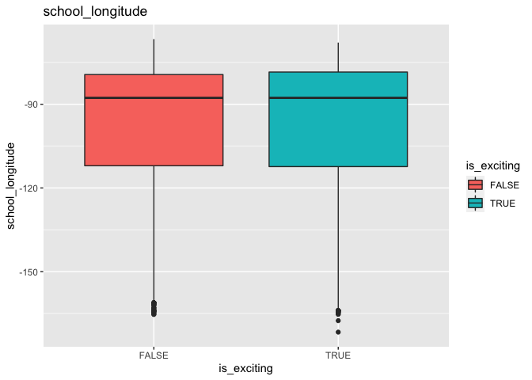
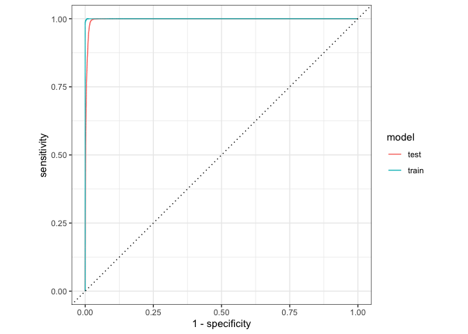

proj Choose - Final Project
================

## Load Libraries

``` r
#install.packages("C50")
#install.packages("writexl")
library(writexl)
library(C50)
library(tidyverse)
library(tidymodels)
library(janitor)
library(skimr)
library(kableExtra)
library(GGally)
library(kableExtra) # -- make nice looking resutls when we knitt 
library(vip)        # --  tidymodels variable importance
library(fastshap)   # -- shapley values for variable importance 
library(MASS)
library(rpart.plot) # -- plotting decision trees 
library(imputeMissings)
library(Hmisc)
```

# Load Data & Explore

## Import your data with read_csv()

``` r
proj <- read_csv("DonorMerge_Final.csv") %>%
  clean_names()
```

    ## Rows: 328018 Columns: 40
    ## ── Column specification ────────────────────────────────────────────────────────
    ## Delimiter: ","
    ## chr (17): projectid, teacher_acctid, schoolid, school_city, school_state, sc...
    ## dbl (11): school_ncesid, school_latitude, school_longitude, school_zip, grea...
    ## lgl (12): is_exciting, one_non_teacher_referred_donor_g, school_charter, sch...
    ## 
    ## ℹ Use `spec()` to retrieve the full column specification for this data.
    ## ℹ Specify the column types or set `show_col_types = FALSE` to quiet this message.

``` r
head(proj) 
```

    ## # A tibble: 6 × 40
    ##   projectid     teach…¹ schoo…² school…³ schoo…⁴ schoo…⁵ schoo…⁶ schoo…⁷ schoo…⁸
    ##   <chr>         <chr>   <chr>      <dbl>   <dbl>   <dbl> <chr>   <chr>     <dbl>
    ## 1 1a3aaeffc56d… f4c9ed… 9310d3…  3.3 e11    42.9   -71.3 Derry   NH         3038
    ## 2 33aa19ee4da4… 177680… 9ac70d…  5.1 e11    37.5   -77.5 Richmo… VA        23224
    ## 3 e31c0ea8b68f… 0f1bc5… cb9f68…  1.71e11    42.0   -87.7 Chicago IL        60613
    ## 4 c685c844476d… 4b1950… 34c650… NA          34.2   -79.8 Floren… SC        29501
    ## 5 a4b234feb2b7… 620982… da1985…  2.1 e11    38.2   -85.7 Louisv… KY        40206
    ## 6 0ff5dec32bf7… ec5b11… 72e2b0…  1.2 e11    30.5   -86.1 Freepo… FL        32439
    ## # … with 31 more variables: school_metro <chr>, school_district <chr>,
    ## #   is_exciting <lgl>, one_non_teacher_referred_donor_g <lgl>,
    ## #   great_messages_proportion <dbl>, teacher_referred_count <dbl>,
    ## #   non_teacher_referred_count <dbl>, school_county <chr>,
    ## #   school_charter <lgl>, school_magnet <lgl>, school_year_round <lgl>,
    ## #   school_nlns <lgl>, school_kipp <lgl>, school_charter_ready_promise <lgl>,
    ## #   teacher_prefix <chr>, teacher_teach_for_america <lgl>, …

## Profile data

``` r
proj %>%
  skim()
```

<table style="width: auto;" class="table table-condensed">
<caption>
Data summary
</caption>
<tbody>
<tr>
<td style="text-align:left;">
Name
</td>
<td style="text-align:left;">
Piped data
</td>
</tr>
<tr>
<td style="text-align:left;">
Number of rows
</td>
<td style="text-align:left;">
328018
</td>
</tr>
<tr>
<td style="text-align:left;">
Number of columns
</td>
<td style="text-align:left;">
40
</td>
</tr>
<tr>
<td style="text-align:left;">
\_\_\_\_\_\_\_\_\_\_\_\_\_\_\_\_\_\_\_\_\_\_\_
</td>
<td style="text-align:left;">
</td>
</tr>
<tr>
<td style="text-align:left;">
Column type frequency:
</td>
<td style="text-align:left;">
</td>
</tr>
<tr>
<td style="text-align:left;">
character
</td>
<td style="text-align:left;">
17
</td>
</tr>
<tr>
<td style="text-align:left;">
logical
</td>
<td style="text-align:left;">
12
</td>
</tr>
<tr>
<td style="text-align:left;">
numeric
</td>
<td style="text-align:left;">
11
</td>
</tr>
<tr>
<td style="text-align:left;">
\_\_\_\_\_\_\_\_\_\_\_\_\_\_\_\_\_\_\_\_\_\_\_\_
</td>
<td style="text-align:left;">
</td>
</tr>
<tr>
<td style="text-align:left;">
Group variables
</td>
<td style="text-align:left;">
None
</td>
</tr>
</tbody>
</table>

**Variable type: character**

<table>
<thead>
<tr>
<th style="text-align:left;">
skim_variable
</th>
<th style="text-align:right;">
n_missing
</th>
<th style="text-align:right;">
complete_rate
</th>
<th style="text-align:right;">
min
</th>
<th style="text-align:right;">
max
</th>
<th style="text-align:right;">
empty
</th>
<th style="text-align:right;">
n_unique
</th>
<th style="text-align:right;">
whitespace
</th>
</tr>
</thead>
<tbody>
<tr>
<td style="text-align:left;">
projectid
</td>
<td style="text-align:right;">
0
</td>
<td style="text-align:right;">
1.00
</td>
<td style="text-align:right;">
32
</td>
<td style="text-align:right;">
32
</td>
<td style="text-align:right;">
0
</td>
<td style="text-align:right;">
328018
</td>
<td style="text-align:right;">
0
</td>
</tr>
<tr>
<td style="text-align:left;">
teacher_acctid
</td>
<td style="text-align:right;">
0
</td>
<td style="text-align:right;">
1.00
</td>
<td style="text-align:right;">
32
</td>
<td style="text-align:right;">
32
</td>
<td style="text-align:right;">
0
</td>
<td style="text-align:right;">
160300
</td>
<td style="text-align:right;">
0
</td>
</tr>
<tr>
<td style="text-align:left;">
schoolid
</td>
<td style="text-align:right;">
0
</td>
<td style="text-align:right;">
1.00
</td>
<td style="text-align:right;">
32
</td>
<td style="text-align:right;">
32
</td>
<td style="text-align:right;">
0
</td>
<td style="text-align:right;">
46190
</td>
<td style="text-align:right;">
0
</td>
</tr>
<tr>
<td style="text-align:left;">
school_city
</td>
<td style="text-align:right;">
0
</td>
<td style="text-align:right;">
1.00
</td>
<td style="text-align:right;">
2
</td>
<td style="text-align:right;">
19
</td>
<td style="text-align:right;">
0
</td>
<td style="text-align:right;">
7820
</td>
<td style="text-align:right;">
0
</td>
</tr>
<tr>
<td style="text-align:left;">
school_state
</td>
<td style="text-align:right;">
0
</td>
<td style="text-align:right;">
1.00
</td>
<td style="text-align:right;">
2
</td>
<td style="text-align:right;">
2
</td>
<td style="text-align:right;">
0
</td>
<td style="text-align:right;">
52
</td>
<td style="text-align:right;">
0
</td>
</tr>
<tr>
<td style="text-align:left;">
school_metro
</td>
<td style="text-align:right;">
40019
</td>
<td style="text-align:right;">
0.88
</td>
<td style="text-align:right;">
5
</td>
<td style="text-align:right;">
8
</td>
<td style="text-align:right;">
0
</td>
<td style="text-align:right;">
3
</td>
<td style="text-align:right;">
0
</td>
</tr>
<tr>
<td style="text-align:left;">
school_district
</td>
<td style="text-align:right;">
501
</td>
<td style="text-align:right;">
1.00
</td>
<td style="text-align:right;">
5
</td>
<td style="text-align:right;">
74
</td>
<td style="text-align:right;">
0
</td>
<td style="text-align:right;">
7960
</td>
<td style="text-align:right;">
0
</td>
</tr>
<tr>
<td style="text-align:left;">
school_county
</td>
<td style="text-align:right;">
8
</td>
<td style="text-align:right;">
1.00
</td>
<td style="text-align:right;">
3
</td>
<td style="text-align:right;">
24
</td>
<td style="text-align:right;">
0
</td>
<td style="text-align:right;">
1625
</td>
<td style="text-align:right;">
0
</td>
</tr>
<tr>
<td style="text-align:left;">
teacher_prefix
</td>
<td style="text-align:right;">
0
</td>
<td style="text-align:right;">
1.00
</td>
<td style="text-align:right;">
3
</td>
<td style="text-align:right;">
4
</td>
<td style="text-align:right;">
0
</td>
<td style="text-align:right;">
4
</td>
<td style="text-align:right;">
0
</td>
</tr>
<tr>
<td style="text-align:left;">
primary_focus_subject
</td>
<td style="text-align:right;">
23
</td>
<td style="text-align:right;">
1.00
</td>
<td style="text-align:right;">
3
</td>
<td style="text-align:right;">
21
</td>
<td style="text-align:right;">
0
</td>
<td style="text-align:right;">
27
</td>
<td style="text-align:right;">
0
</td>
</tr>
<tr>
<td style="text-align:left;">
primary_focus_area
</td>
<td style="text-align:right;">
23
</td>
<td style="text-align:right;">
1.00
</td>
<td style="text-align:right;">
13
</td>
<td style="text-align:right;">
19
</td>
<td style="text-align:right;">
0
</td>
<td style="text-align:right;">
7
</td>
<td style="text-align:right;">
0
</td>
</tr>
<tr>
<td style="text-align:left;">
secondary_focus_subject
</td>
<td style="text-align:right;">
103265
</td>
<td style="text-align:right;">
0.69
</td>
<td style="text-align:right;">
3
</td>
<td style="text-align:right;">
21
</td>
<td style="text-align:right;">
0
</td>
<td style="text-align:right;">
27
</td>
<td style="text-align:right;">
0
</td>
</tr>
<tr>
<td style="text-align:left;">
secondary_focus_area
</td>
<td style="text-align:right;">
103265
</td>
<td style="text-align:right;">
0.69
</td>
<td style="text-align:right;">
13
</td>
<td style="text-align:right;">
19
</td>
<td style="text-align:right;">
0
</td>
<td style="text-align:right;">
7
</td>
<td style="text-align:right;">
0
</td>
</tr>
<tr>
<td style="text-align:left;">
resource_type
</td>
<td style="text-align:right;">
26
</td>
<td style="text-align:right;">
1.00
</td>
<td style="text-align:right;">
5
</td>
<td style="text-align:right;">
10
</td>
<td style="text-align:right;">
0
</td>
<td style="text-align:right;">
6
</td>
<td style="text-align:right;">
0
</td>
</tr>
<tr>
<td style="text-align:left;">
poverty_level
</td>
<td style="text-align:right;">
0
</td>
<td style="text-align:right;">
1.00
</td>
<td style="text-align:right;">
11
</td>
<td style="text-align:right;">
16
</td>
<td style="text-align:right;">
0
</td>
<td style="text-align:right;">
4
</td>
<td style="text-align:right;">
0
</td>
</tr>
<tr>
<td style="text-align:left;">
grade_level
</td>
<td style="text-align:right;">
3
</td>
<td style="text-align:right;">
1.00
</td>
<td style="text-align:right;">
10
</td>
<td style="text-align:right;">
13
</td>
<td style="text-align:right;">
0
</td>
<td style="text-align:right;">
4
</td>
<td style="text-align:right;">
0
</td>
</tr>
<tr>
<td style="text-align:left;">
date_posted
</td>
<td style="text-align:right;">
0
</td>
<td style="text-align:right;">
1.00
</td>
<td style="text-align:right;">
8
</td>
<td style="text-align:right;">
10
</td>
<td style="text-align:right;">
0
</td>
<td style="text-align:right;">
3815
</td>
<td style="text-align:right;">
0
</td>
</tr>
</tbody>
</table>

**Variable type: logical**

<table>
<thead>
<tr>
<th style="text-align:left;">
skim_variable
</th>
<th style="text-align:right;">
n_missing
</th>
<th style="text-align:right;">
complete_rate
</th>
<th style="text-align:right;">
mean
</th>
<th style="text-align:left;">
count
</th>
</tr>
</thead>
<tbody>
<tr>
<td style="text-align:left;">
is_exciting
</td>
<td style="text-align:right;">
0
</td>
<td style="text-align:right;">
1.00
</td>
<td style="text-align:right;">
0.11
</td>
<td style="text-align:left;">
FAL: 291308, TRU: 36710
</td>
</tr>
<tr>
<td style="text-align:left;">
one_non_teacher_referred_donor_g
</td>
<td style="text-align:right;">
47338
</td>
<td style="text-align:right;">
0.86
</td>
<td style="text-align:right;">
0.72
</td>
<td style="text-align:left;">
TRU: 202773, FAL: 77907
</td>
</tr>
<tr>
<td style="text-align:left;">
school_charter
</td>
<td style="text-align:right;">
0
</td>
<td style="text-align:right;">
1.00
</td>
<td style="text-align:right;">
0.09
</td>
<td style="text-align:left;">
FAL: 298820, TRU: 29198
</td>
</tr>
<tr>
<td style="text-align:left;">
school_magnet
</td>
<td style="text-align:right;">
0
</td>
<td style="text-align:right;">
1.00
</td>
<td style="text-align:right;">
0.09
</td>
<td style="text-align:left;">
FAL: 297022, TRU: 30996
</td>
</tr>
<tr>
<td style="text-align:left;">
school_year_round
</td>
<td style="text-align:right;">
0
</td>
<td style="text-align:right;">
1.00
</td>
<td style="text-align:right;">
0.05
</td>
<td style="text-align:left;">
FAL: 311592, TRU: 16426
</td>
</tr>
<tr>
<td style="text-align:left;">
school_nlns
</td>
<td style="text-align:right;">
0
</td>
<td style="text-align:right;">
1.00
</td>
<td style="text-align:right;">
0.02
</td>
<td style="text-align:left;">
FAL: 322847, TRU: 5171
</td>
</tr>
<tr>
<td style="text-align:left;">
school_kipp
</td>
<td style="text-align:right;">
0
</td>
<td style="text-align:right;">
1.00
</td>
<td style="text-align:right;">
0.01
</td>
<td style="text-align:left;">
FAL: 325684, TRU: 2334
</td>
</tr>
<tr>
<td style="text-align:left;">
school_charter_ready_promise
</td>
<td style="text-align:right;">
0
</td>
<td style="text-align:right;">
1.00
</td>
<td style="text-align:right;">
0.01
</td>
<td style="text-align:left;">
FAL: 326282, TRU: 1736
</td>
</tr>
<tr>
<td style="text-align:left;">
teacher_teach_for_america
</td>
<td style="text-align:right;">
0
</td>
<td style="text-align:right;">
1.00
</td>
<td style="text-align:right;">
0.06
</td>
<td style="text-align:left;">
FAL: 308069, TRU: 19949
</td>
</tr>
<tr>
<td style="text-align:left;">
teacher_ny_teaching_fellow
</td>
<td style="text-align:right;">
0
</td>
<td style="text-align:right;">
1.00
</td>
<td style="text-align:right;">
0.02
</td>
<td style="text-align:left;">
FAL: 322150, TRU: 5868
</td>
</tr>
<tr>
<td style="text-align:left;">
eligible_double_your_impact_matc
</td>
<td style="text-align:right;">
0
</td>
<td style="text-align:right;">
1.00
</td>
<td style="text-align:right;">
0.28
</td>
<td style="text-align:left;">
FAL: 237135, TRU: 90883
</td>
</tr>
<tr>
<td style="text-align:left;">
eligible_almost_home_match
</td>
<td style="text-align:right;">
0
</td>
<td style="text-align:right;">
1.00
</td>
<td style="text-align:right;">
0.06
</td>
<td style="text-align:left;">
FAL: 308053, TRU: 19965
</td>
</tr>
</tbody>
</table>

**Variable type: numeric**

<table>
<thead>
<tr>
<th style="text-align:left;">
skim_variable
</th>
<th style="text-align:right;">
n_missing
</th>
<th style="text-align:right;">
complete_rate
</th>
<th style="text-align:right;">
mean
</th>
<th style="text-align:right;">
sd
</th>
<th style="text-align:right;">
p0
</th>
<th style="text-align:right;">
p25
</th>
<th style="text-align:right;">
p50
</th>
<th style="text-align:right;">
p75
</th>
<th style="text-align:right;">
p100
</th>
<th style="text-align:left;">
hist
</th>
</tr>
</thead>
<tbody>
<tr>
<td style="text-align:left;">
school_ncesid
</td>
<td style="text-align:right;">
21067
</td>
<td style="text-align:right;">
0.94
</td>
<td style="text-align:right;">
2.606752e+11
</td>
<td style="text-align:right;">
1.590522e+11
</td>
<td style="text-align:right;">
1.00005e+10
</td>
<td style="text-align:right;">
9.0495e+10
</td>
<td style="text-align:right;">
2.6100e+11
</td>
<td style="text-align:right;">
3.7000e+11
</td>
<td style="text-align:right;">
6.100000e+11
</td>
<td style="text-align:left;">
▇▃▆▅▁
</td>
</tr>
<tr>
<td style="text-align:left;">
school_latitude
</td>
<td style="text-align:right;">
0
</td>
<td style="text-align:right;">
1.00
</td>
<td style="text-align:right;">
3.724000e+01
</td>
<td style="text-align:right;">
4.660000e+00
</td>
<td style="text-align:right;">
1.82500e+01
</td>
<td style="text-align:right;">
3.4040e+01
</td>
<td style="text-align:right;">
3.7670e+01
</td>
<td style="text-align:right;">
4.0760e+01
</td>
<td style="text-align:right;">
6.726000e+01
</td>
<td style="text-align:left;">
▁▇▇▁▁
</td>
</tr>
<tr>
<td style="text-align:left;">
school_longitude
</td>
<td style="text-align:right;">
0
</td>
<td style="text-align:right;">
1.00
</td>
<td style="text-align:right;">
-9.344000e+01
</td>
<td style="text-align:right;">
1.781000e+01
</td>
<td style="text-align:right;">
-1.71690e+02
</td>
<td style="text-align:right;">
-1.1205e+02
</td>
<td style="text-align:right;">
-8.7690e+01
</td>
<td style="text-align:right;">
-7.9150e+01
</td>
<td style="text-align:right;">
-6.663000e+01
</td>
<td style="text-align:left;">
▁▁▅▅▇
</td>
</tr>
<tr>
<td style="text-align:left;">
school_zip
</td>
<td style="text-align:right;">
2
</td>
<td style="text-align:right;">
1.00
</td>
<td style="text-align:right;">
5.310286e+04
</td>
<td style="text-align:right;">
3.123205e+04
</td>
<td style="text-align:right;">
4.10000e+02
</td>
<td style="text-align:right;">
2.7589e+04
</td>
<td style="text-align:right;">
5.3089e+04
</td>
<td style="text-align:right;">
8.5225e+04
</td>
<td style="text-align:right;">
9.995000e+04
</td>
<td style="text-align:left;">
▆▇▂▆▇
</td>
</tr>
<tr>
<td style="text-align:left;">
great_messages_proportion
</td>
<td style="text-align:right;">
89712
</td>
<td style="text-align:right;">
0.73
</td>
<td style="text-align:right;">
5.482000e+01
</td>
<td style="text-align:right;">
3.507000e+01
</td>
<td style="text-align:right;">
0.00000e+00
</td>
<td style="text-align:right;">
3.3000e+01
</td>
<td style="text-align:right;">
5.7000e+01
</td>
<td style="text-align:right;">
8.4000e+01
</td>
<td style="text-align:right;">
1.000000e+02
</td>
<td style="text-align:left;">
▆▃▆▆▇
</td>
</tr>
<tr>
<td style="text-align:left;">
teacher_referred_count
</td>
<td style="text-align:right;">
47338
</td>
<td style="text-align:right;">
0.86
</td>
<td style="text-align:right;">
9.300000e-01
</td>
<td style="text-align:right;">
2.350000e+00
</td>
<td style="text-align:right;">
0.00000e+00
</td>
<td style="text-align:right;">
0.0000e+00
</td>
<td style="text-align:right;">
0.0000e+00
</td>
<td style="text-align:right;">
1.0000e+00
</td>
<td style="text-align:right;">
1.250000e+02
</td>
<td style="text-align:left;">
▇▁▁▁▁
</td>
</tr>
<tr>
<td style="text-align:left;">
non_teacher_referred_count
</td>
<td style="text-align:right;">
47338
</td>
<td style="text-align:right;">
0.86
</td>
<td style="text-align:right;">
4.580000e+00
</td>
<td style="text-align:right;">
5.910000e+00
</td>
<td style="text-align:right;">
0.00000e+00
</td>
<td style="text-align:right;">
1.0000e+00
</td>
<td style="text-align:right;">
3.0000e+00
</td>
<td style="text-align:right;">
5.0000e+00
</td>
<td style="text-align:right;">
3.040000e+02
</td>
<td style="text-align:left;">
▇▁▁▁▁
</td>
</tr>
<tr>
<td style="text-align:left;">
fulfillment_labor_materials
</td>
<td style="text-align:right;">
17492
</td>
<td style="text-align:right;">
0.95
</td>
<td style="text-align:right;">
2.762000e+01
</td>
<td style="text-align:right;">
8.810000e+00
</td>
<td style="text-align:right;">
9.00000e+00
</td>
<td style="text-align:right;">
1.7000e+01
</td>
<td style="text-align:right;">
3.0000e+01
</td>
<td style="text-align:right;">
3.5000e+01
</td>
<td style="text-align:right;">
3.500000e+01
</td>
<td style="text-align:left;">
▁▂▁▁▇
</td>
</tr>
<tr>
<td style="text-align:left;">
total_price_excluding_optional_s
</td>
<td style="text-align:right;">
0
</td>
<td style="text-align:right;">
1.00
</td>
<td style="text-align:right;">
5.510900e+02
</td>
<td style="text-align:right;">
1.801938e+04
</td>
<td style="text-align:right;">
0.00000e+00
</td>
<td style="text-align:right;">
2.6817e+02
</td>
<td style="text-align:right;">
4.1058e+02
</td>
<td style="text-align:right;">
5.7910e+02
</td>
<td style="text-align:right;">
1.025002e+07
</td>
<td style="text-align:left;">
▇▁▁▁▁
</td>
</tr>
<tr>
<td style="text-align:left;">
total_price_including_optional_s
</td>
<td style="text-align:right;">
0
</td>
<td style="text-align:right;">
1.00
</td>
<td style="text-align:right;">
6.561900e+02
</td>
<td style="text-align:right;">
2.197364e+04
</td>
<td style="text-align:right;">
0.00000e+00
</td>
<td style="text-align:right;">
3.1902e+02
</td>
<td style="text-align:right;">
4.8750e+02
</td>
<td style="text-align:right;">
6.8816e+02
</td>
<td style="text-align:right;">
1.250002e+07
</td>
<td style="text-align:left;">
▇▁▁▁▁
</td>
</tr>
<tr>
<td style="text-align:left;">
students_reached
</td>
<td style="text-align:right;">
82
</td>
<td style="text-align:right;">
1.00
</td>
<td style="text-align:right;">
9.960000e+01
</td>
<td style="text-align:right;">
2.733940e+03
</td>
<td style="text-align:right;">
0.00000e+00
</td>
<td style="text-align:right;">
2.2000e+01
</td>
<td style="text-align:right;">
3.0000e+01
</td>
<td style="text-align:right;">
1.0000e+02
</td>
<td style="text-align:right;">
9.999990e+05
</td>
<td style="text-align:left;">
▇▁▁▁▁
</td>
</tr>
</tbody>
</table>

## Explore Target

``` r
#change target to factor
proj$is_exciting <- as.factor(proj$is_exciting) 

donor_target <- proj %>% 
  count(is_exciting) %>%
  mutate(pct = n/sum(n))

donor_target %>%
  ggplot(aes(x=is_exciting,y=pct)) +
  geom_col()  + 
  geom_text(aes(label = paste(round(pct*100,1),"%")), vjust = 1.2, colour = "white") +
  labs(title="How many projects are exciting projects?", x="Project Label", y="PCT")
```

<!-- -->

``` r
proj %>%
  group_by(is_exciting) %>%
  dplyr::summarize(n=n()) %>%
  ungroup() %>%
  mutate(pct = n/sum(n))
```

    ## # A tibble: 2 × 3
    ##   is_exciting      n   pct
    ##   <fct>        <int> <dbl>
    ## 1 FALSE       291308 0.888
    ## 2 TRUE         36710 0.112

## Explore Numerical

``` r
proj_vis <- proj %>% 
  mutate_if(is.character, factor) %>%
  mutate(across(where(is.logical),as.factor)) %>%
  mutate(date_posted = as.Date(date_posted,format="%m/%d/%Y"))

for (c in names(proj_vis %>% dplyr::select(!c(projectid, teacher_acctid, schoolid, school_ncesid, school_city, school_district, school_county, school_zip, is_exciting)))) {
  if (c == "date_posted") {
    print( proj_vis %>%
             ggplot(., aes(!!as.name(c))) + 
             geom_histogram(aes(bins=10,fill = is_exciting), position = "fill")  +labs(title = c, y = "pct exciting"))
      
  }else if (c %in% names(proj_vis %>% dplyr::select(where(is.factor)))) {
    # -- for each character column create a chart
    print( proj_vis %>%
             ggplot(., aes(!!as.name(c))) + 
             geom_bar(aes(fill = is_exciting), position = "fill")  + labs(title = c, y = "pct exciting"))
  } else {
    # -- comparative boxplots
    print(ggplot(proj_vis, aes(x=is_exciting, y=!!as.name(c), fill=is_exciting))+ geom_boxplot() +labs(title = c))
  }
}
```

<!-- --><!-- --><!-- --><!-- --><!-- -->

    ## Warning: Removed 89712 rows containing non-finite values (stat_boxplot).

<!-- -->

    ## Warning: Removed 47338 rows containing non-finite values (stat_boxplot).

<!-- -->

    ## Warning: Removed 47338 rows containing non-finite values (stat_boxplot).

<!-- --><!-- --><!-- --><!-- --><!-- --><!-- --><!-- --><!-- --><!-- --><!-- --><!-- --><!-- --><!-- --><!-- --><!-- --><!-- --><!-- -->

    ## Warning: Removed 17492 rows containing non-finite values (stat_boxplot).

<!-- --><!-- --><!-- -->

    ## Warning: Removed 82 rows containing non-finite values (stat_boxplot).

<!-- --><!-- -->

    ## Warning: Ignoring unknown aesthetics: bins

<!-- -->

    ## `stat_bin()` using `bins = 30`. Pick better value with `binwidth`.

<!-- -->

# PCA with Random Forest

## prepare data for clustering

``` r
#change logical to factor
proj1 <- proj %>% 
  mutate_if(is.character, as.factor) %>%
  mutate(across(where(is.logical),as.factor))

# impute missing values
proj2 <- imputeMissings::impute(proj1)

head(proj2)
```

    ##                          projectid                   teacher_acctid
    ## 1 1a3aaeffc56dd2a421e37d8298024c0a f4c9ed095b85458dcf858e25f203af00
    ## 2 33aa19ee4da4c5adf47d0dfb84fab5ef 17768031eb40de8d4497dbb54df48742
    ## 3 e31c0ea8b68f404699dfb0d39e9bc99b 0f1bc5b4700fd33383be104442660178
    ## 4 c685c844476d7ed75bf87699eeafd682 4b19500fb087a635c98061505f1e6c6f
    ## 5 a4b234feb2b72921ed59850d5c873d62 620982375045fa11d872702f26ab98bb
    ## 6 0ff5dec32bf793243a8b0b2c023a81f0 ec5b110df87bd511b508961676d08b6c
    ##                           schoolid school_ncesid school_latitude
    ## 1 9310d3eb447a4e46bc5fc31ed007ceac      3.30e+11        42.88824
    ## 2 9ac70da58322783f82152eecc140a812      5.10e+11        37.47616
    ## 3 cb9f688cf59e3ee22a087d616ca8f5d7      1.71e+11        41.95285
    ## 4 34c650f9f6d5c3e42b8e2169c280ecb7      2.61e+11        34.19363
    ## 5 da1985df161ba5c3842fc99579b6e4b1      2.10e+11        38.24992
    ## 6 72e2b0cb2eecfdc37e67e0eaf10da07b      1.20e+11        30.50798
    ##   school_longitude school_city school_state school_zip school_metro
    ## 1        -71.32022       Derry           NH       3038     suburban
    ## 2        -77.48840    Richmond           VA      23224        urban
    ## 3        -87.65023     Chicago           IL      60613        urban
    ## 4        -79.76906    Florence           SC      29501        urban
    ## 5        -85.72231  Louisville           KY      40206        urban
    ## 6        -86.13200    Freeport           FL      32439        rural
    ##                 school_district is_exciting one_non_teacher_referred_donor_g
    ## 1 School Administrative Unit 10       FALSE                            FALSE
    ## 2 Richmond City School District       FALSE                            FALSE
    ## 3 Ravenswood-ridge Elem Network       FALSE                             TRUE
    ## 4    Florence School District 1       FALSE                            FALSE
    ## 5  Jefferson Co School District       FALSE                             TRUE
    ## 6     Walton Co School District       FALSE                             TRUE
    ##   great_messages_proportion teacher_referred_count non_teacher_referred_count
    ## 1                        57                      0                          2
    ## 2                        57                      0                          1
    ## 3                        50                      0                          2
    ## 4                         0                      2                          0
    ## 5                        57                      0                          3
    ## 6                       100                      0                          3
    ##   school_county school_charter school_magnet school_year_round school_nlns
    ## 1    Rockingham          FALSE         FALSE             FALSE       FALSE
    ## 2 Richmond City          FALSE         FALSE             FALSE       FALSE
    ## 3          Cook          FALSE          TRUE             FALSE       FALSE
    ## 4      Florence          FALSE         FALSE             FALSE       FALSE
    ## 5     Jefferson          FALSE          TRUE              TRUE       FALSE
    ## 6        Walton          FALSE         FALSE             FALSE       FALSE
    ##   school_kipp school_charter_ready_promise teacher_prefix
    ## 1       FALSE                        FALSE           Mrs.
    ## 2       FALSE                        FALSE            Ms.
    ## 3       FALSE                        FALSE            Mr.
    ## 4       FALSE                        FALSE           Mrs.
    ## 5       FALSE                        FALSE           Mrs.
    ## 6       FALSE                        FALSE            Ms.
    ##   teacher_teach_for_america teacher_ny_teaching_fellow primary_focus_subject
    ## 1                     FALSE                      FALSE Environmental Science
    ## 2                     FALSE                      FALSE              Literacy
    ## 3                     FALSE                      FALSE Environmental Science
    ## 4                     FALSE                      FALSE  Literature & Writing
    ## 5                     FALSE                      FALSE  Literature & Writing
    ## 6                     FALSE                      FALSE              Literacy
    ##    primary_focus_area secondary_focus_subject secondary_focus_area
    ## 1      Math & Science        Applied Sciences       Math & Science
    ## 2 Literacy & Language    Literature & Writing  Literacy & Language
    ## 3      Math & Science    Literature & Writing  Literacy & Language
    ## 4 Literacy & Language             Mathematics       Math & Science
    ## 5 Literacy & Language             Mathematics       Math & Science
    ## 6 Literacy & Language             Mathematics       Math & Science
    ##   resource_type    poverty_level   grade_level fulfillment_labor_materials
    ## 1    Technology moderate poverty    Grades 6-8                          30
    ## 2         Other  highest poverty Grades PreK-2                          30
    ## 3      Supplies  highest poverty    Grades 6-8                          30
    ## 4      Supplies     high poverty Grades PreK-2                          30
    ## 5    Technology  highest poverty Grades PreK-2                          30
    ## 6    Technology  highest poverty Grades PreK-2                          30
    ##   total_price_excluding_optional_s total_price_including_optional_s
    ## 1                           285.09                           335.40
    ## 2                           232.94                           274.05
    ## 3                           513.41                           604.01
    ## 4                           688.11                           809.54
    ## 5                           935.16                          1100.19
    ## 6                           809.32                           952.14
    ##   students_reached eligible_double_your_impact_matc eligible_almost_home_match
    ## 1              230                            FALSE                      FALSE
    ## 2               18                            FALSE                      FALSE
    ## 3               70                             TRUE                      FALSE
    ## 4               22                            FALSE                      FALSE
    ## 5               25                             TRUE                      FALSE
    ## 6               17                            FALSE                      FALSE
    ##   date_posted
    ## 1  12/31/2013
    ## 2  12/31/2013
    ## 3  12/31/2013
    ## 4  12/31/2013
    ## 5  12/31/2013
    ## 6  12/31/2013

``` r
proj2 %>% skim()
```

<table style="width: auto;" class="table table-condensed">
<caption>
Data summary
</caption>
<tbody>
<tr>
<td style="text-align:left;">
Name
</td>
<td style="text-align:left;">
Piped data
</td>
</tr>
<tr>
<td style="text-align:left;">
Number of rows
</td>
<td style="text-align:left;">
328018
</td>
</tr>
<tr>
<td style="text-align:left;">
Number of columns
</td>
<td style="text-align:left;">
40
</td>
</tr>
<tr>
<td style="text-align:left;">
\_\_\_\_\_\_\_\_\_\_\_\_\_\_\_\_\_\_\_\_\_\_\_
</td>
<td style="text-align:left;">
</td>
</tr>
<tr>
<td style="text-align:left;">
Column type frequency:
</td>
<td style="text-align:left;">
</td>
</tr>
<tr>
<td style="text-align:left;">
factor
</td>
<td style="text-align:left;">
29
</td>
</tr>
<tr>
<td style="text-align:left;">
numeric
</td>
<td style="text-align:left;">
11
</td>
</tr>
<tr>
<td style="text-align:left;">
\_\_\_\_\_\_\_\_\_\_\_\_\_\_\_\_\_\_\_\_\_\_\_\_
</td>
<td style="text-align:left;">
</td>
</tr>
<tr>
<td style="text-align:left;">
Group variables
</td>
<td style="text-align:left;">
None
</td>
</tr>
</tbody>
</table>

**Variable type: factor**

<table>
<thead>
<tr>
<th style="text-align:left;">
skim_variable
</th>
<th style="text-align:right;">
n_missing
</th>
<th style="text-align:right;">
complete_rate
</th>
<th style="text-align:left;">
ordered
</th>
<th style="text-align:right;">
n_unique
</th>
<th style="text-align:left;">
top_counts
</th>
</tr>
</thead>
<tbody>
<tr>
<td style="text-align:left;">
projectid
</td>
<td style="text-align:right;">
0
</td>
<td style="text-align:right;">
1
</td>
<td style="text-align:left;">
FALSE
</td>
<td style="text-align:right;">
328018
</td>
<td style="text-align:left;">
000: 1, 000: 1, 000: 1, 000: 1
</td>
</tr>
<tr>
<td style="text-align:left;">
teacher_acctid
</td>
<td style="text-align:right;">
0
</td>
<td style="text-align:right;">
1
</td>
<td style="text-align:left;">
FALSE
</td>
<td style="text-align:right;">
160300
</td>
<td style="text-align:left;">
5a4: 128, 787: 127, 3a0: 118, 15d: 117
</td>
</tr>
<tr>
<td style="text-align:left;">
schoolid
</td>
<td style="text-align:right;">
0
</td>
<td style="text-align:right;">
1
</td>
<td style="text-align:left;">
FALSE
</td>
<td style="text-align:right;">
46190
</td>
<td style="text-align:left;">
923: 475, cf2: 434, 994: 361, 279: 329
</td>
</tr>
<tr>
<td style="text-align:left;">
school_city
</td>
<td style="text-align:right;">
0
</td>
<td style="text-align:right;">
1
</td>
<td style="text-align:left;">
FALSE
</td>
<td style="text-align:right;">
7820
</td>
<td style="text-align:left;">
Chi: 14344, Los: 11100, Bro: 10070, Bro: 9197
</td>
</tr>
<tr>
<td style="text-align:left;">
school_state
</td>
<td style="text-align:right;">
0
</td>
<td style="text-align:right;">
1
</td>
<td style="text-align:left;">
FALSE
</td>
<td style="text-align:right;">
52
</td>
<td style="text-align:left;">
CA: 63096, NY: 36289, NC: 21634, IL: 20071
</td>
</tr>
<tr>
<td style="text-align:left;">
school_metro
</td>
<td style="text-align:right;">
0
</td>
<td style="text-align:right;">
1
</td>
<td style="text-align:left;">
FALSE
</td>
<td style="text-align:right;">
3
</td>
<td style="text-align:left;">
urb: 214801, sub: 74475, rur: 38742
</td>
</tr>
<tr>
<td style="text-align:left;">
school_district
</td>
<td style="text-align:right;">
0
</td>
<td style="text-align:right;">
1
</td>
<td style="text-align:left;">
FALSE
</td>
<td style="text-align:right;">
7960
</td>
<td style="text-align:left;">
New: 28111, Los: 20161, Cha: 4374, Cla: 4000
</td>
</tr>
<tr>
<td style="text-align:left;">
is_exciting
</td>
<td style="text-align:right;">
0
</td>
<td style="text-align:right;">
1
</td>
<td style="text-align:left;">
FALSE
</td>
<td style="text-align:right;">
2
</td>
<td style="text-align:left;">
FAL: 291308, TRU: 36710
</td>
</tr>
<tr>
<td style="text-align:left;">
one_non_teacher_referred_donor_g
</td>
<td style="text-align:right;">
0
</td>
<td style="text-align:right;">
1
</td>
<td style="text-align:left;">
FALSE
</td>
<td style="text-align:right;">
2
</td>
<td style="text-align:left;">
TRU: 250111, FAL: 77907
</td>
</tr>
<tr>
<td style="text-align:left;">
school_county
</td>
<td style="text-align:right;">
0
</td>
<td style="text-align:right;">
1
</td>
<td style="text-align:left;">
FALSE
</td>
<td style="text-align:right;">
1625
</td>
<td style="text-align:left;">
Los: 25237, Coo: 15855, Kin: 9643, Bro: 9121
</td>
</tr>
<tr>
<td style="text-align:left;">
school_charter
</td>
<td style="text-align:right;">
0
</td>
<td style="text-align:right;">
1
</td>
<td style="text-align:left;">
FALSE
</td>
<td style="text-align:right;">
2
</td>
<td style="text-align:left;">
FAL: 298820, TRU: 29198
</td>
</tr>
<tr>
<td style="text-align:left;">
school_magnet
</td>
<td style="text-align:right;">
0
</td>
<td style="text-align:right;">
1
</td>
<td style="text-align:left;">
FALSE
</td>
<td style="text-align:right;">
2
</td>
<td style="text-align:left;">
FAL: 297022, TRU: 30996
</td>
</tr>
<tr>
<td style="text-align:left;">
school_year_round
</td>
<td style="text-align:right;">
0
</td>
<td style="text-align:right;">
1
</td>
<td style="text-align:left;">
FALSE
</td>
<td style="text-align:right;">
2
</td>
<td style="text-align:left;">
FAL: 311592, TRU: 16426
</td>
</tr>
<tr>
<td style="text-align:left;">
school_nlns
</td>
<td style="text-align:right;">
0
</td>
<td style="text-align:right;">
1
</td>
<td style="text-align:left;">
FALSE
</td>
<td style="text-align:right;">
2
</td>
<td style="text-align:left;">
FAL: 322847, TRU: 5171
</td>
</tr>
<tr>
<td style="text-align:left;">
school_kipp
</td>
<td style="text-align:right;">
0
</td>
<td style="text-align:right;">
1
</td>
<td style="text-align:left;">
FALSE
</td>
<td style="text-align:right;">
2
</td>
<td style="text-align:left;">
FAL: 325684, TRU: 2334
</td>
</tr>
<tr>
<td style="text-align:left;">
school_charter_ready_promise
</td>
<td style="text-align:right;">
0
</td>
<td style="text-align:right;">
1
</td>
<td style="text-align:left;">
FALSE
</td>
<td style="text-align:right;">
2
</td>
<td style="text-align:left;">
FAL: 326282, TRU: 1736
</td>
</tr>
<tr>
<td style="text-align:left;">
teacher_prefix
</td>
<td style="text-align:right;">
0
</td>
<td style="text-align:right;">
1
</td>
<td style="text-align:left;">
FALSE
</td>
<td style="text-align:right;">
4
</td>
<td style="text-align:left;">
Mrs: 155058, Ms.: 131006, Mr.: 41950, Dr.: 4
</td>
</tr>
<tr>
<td style="text-align:left;">
teacher_teach_for_america
</td>
<td style="text-align:right;">
0
</td>
<td style="text-align:right;">
1
</td>
<td style="text-align:left;">
FALSE
</td>
<td style="text-align:right;">
2
</td>
<td style="text-align:left;">
FAL: 308069, TRU: 19949
</td>
</tr>
<tr>
<td style="text-align:left;">
teacher_ny_teaching_fellow
</td>
<td style="text-align:right;">
0
</td>
<td style="text-align:right;">
1
</td>
<td style="text-align:left;">
FALSE
</td>
<td style="text-align:right;">
2
</td>
<td style="text-align:left;">
FAL: 322150, TRU: 5868
</td>
</tr>
<tr>
<td style="text-align:left;">
primary_focus_subject
</td>
<td style="text-align:right;">
0
</td>
<td style="text-align:right;">
1
</td>
<td style="text-align:left;">
FALSE
</td>
<td style="text-align:right;">
27
</td>
<td style="text-align:left;">
Lit: 100127, Lit: 41067, Mat: 39487, Spe: 20848
</td>
</tr>
<tr>
<td style="text-align:left;">
primary_focus_area
</td>
<td style="text-align:right;">
0
</td>
<td style="text-align:right;">
1
</td>
<td style="text-align:left;">
FALSE
</td>
<td style="text-align:right;">
7
</td>
<td style="text-align:left;">
Lit: 148708, Mat: 80172, Mus: 29609, App: 24594
</td>
</tr>
<tr>
<td style="text-align:left;">
secondary_focus_subject
</td>
<td style="text-align:right;">
0
</td>
<td style="text-align:right;">
1
</td>
<td style="text-align:left;">
FALSE
</td>
<td style="text-align:right;">
27
</td>
<td style="text-align:left;">
Lit: 137465, Lit: 32676, Mat: 27239, Spe: 14242
</td>
</tr>
<tr>
<td style="text-align:left;">
secondary_focus_area
</td>
<td style="text-align:right;">
0
</td>
<td style="text-align:right;">
1
</td>
<td style="text-align:left;">
FALSE
</td>
<td style="text-align:right;">
7
</td>
<td style="text-align:left;">
Lit: 183562, Mat: 53900, App: 33213, His: 17923
</td>
</tr>
<tr>
<td style="text-align:left;">
resource_type
</td>
<td style="text-align:right;">
0
</td>
<td style="text-align:right;">
1
</td>
<td style="text-align:left;">
FALSE
</td>
<td style="text-align:right;">
6
</td>
<td style="text-align:left;">
Sup: 113421, Tec: 105436, Boo: 71565, Oth: 34629
</td>
</tr>
<tr>
<td style="text-align:left;">
poverty_level
</td>
<td style="text-align:right;">
0
</td>
<td style="text-align:right;">
1
</td>
<td style="text-align:left;">
FALSE
</td>
<td style="text-align:right;">
4
</td>
<td style="text-align:left;">
hig: 189971, hig: 85759, mod: 44245, low: 8043
</td>
</tr>
<tr>
<td style="text-align:left;">
grade_level
</td>
<td style="text-align:right;">
0
</td>
<td style="text-align:right;">
1
</td>
<td style="text-align:left;">
FALSE
</td>
<td style="text-align:right;">
4
</td>
<td style="text-align:left;">
Gra: 121356, Gra: 100589, Gra: 56738, Gra: 49335
</td>
</tr>
<tr>
<td style="text-align:left;">
eligible_double_your_impact_matc
</td>
<td style="text-align:right;">
0
</td>
<td style="text-align:right;">
1
</td>
<td style="text-align:left;">
FALSE
</td>
<td style="text-align:right;">
2
</td>
<td style="text-align:left;">
FAL: 237135, TRU: 90883
</td>
</tr>
<tr>
<td style="text-align:left;">
eligible_almost_home_match
</td>
<td style="text-align:right;">
0
</td>
<td style="text-align:right;">
1
</td>
<td style="text-align:left;">
FALSE
</td>
<td style="text-align:right;">
2
</td>
<td style="text-align:left;">
FAL: 308053, TRU: 19965
</td>
</tr>
<tr>
<td style="text-align:left;">
date_posted
</td>
<td style="text-align:right;">
0
</td>
<td style="text-align:right;">
1
</td>
<td style="text-align:left;">
FALSE
</td>
<td style="text-align:right;">
3815
</td>
<td style="text-align:left;">
9/3: 792, 12/: 771, 9/1: 766, 9/3: 734
</td>
</tr>
</tbody>
</table>

**Variable type: numeric**

<table>
<thead>
<tr>
<th style="text-align:left;">
skim_variable
</th>
<th style="text-align:right;">
n_missing
</th>
<th style="text-align:right;">
complete_rate
</th>
<th style="text-align:right;">
mean
</th>
<th style="text-align:right;">
sd
</th>
<th style="text-align:right;">
p0
</th>
<th style="text-align:right;">
p25
</th>
<th style="text-align:right;">
p50
</th>
<th style="text-align:right;">
p75
</th>
<th style="text-align:right;">
p100
</th>
<th style="text-align:left;">
hist
</th>
</tr>
</thead>
<tbody>
<tr>
<td style="text-align:left;">
school_ncesid
</td>
<td style="text-align:right;">
0
</td>
<td style="text-align:right;">
1
</td>
<td style="text-align:right;">
2.606960e+11
</td>
<td style="text-align:right;">
1.538599e+11
</td>
<td style="text-align:right;">
1.00005e+10
</td>
<td style="text-align:right;">
1.2000e+11
</td>
<td style="text-align:right;">
2.6100e+11
</td>
<td style="text-align:right;">
3.7000e+11
</td>
<td style="text-align:right;">
6.100000e+11
</td>
<td style="text-align:left;">
▇▃▇▅▁
</td>
</tr>
<tr>
<td style="text-align:left;">
school_latitude
</td>
<td style="text-align:right;">
0
</td>
<td style="text-align:right;">
1
</td>
<td style="text-align:right;">
3.724000e+01
</td>
<td style="text-align:right;">
4.660000e+00
</td>
<td style="text-align:right;">
1.82500e+01
</td>
<td style="text-align:right;">
3.4040e+01
</td>
<td style="text-align:right;">
3.7670e+01
</td>
<td style="text-align:right;">
4.0760e+01
</td>
<td style="text-align:right;">
6.726000e+01
</td>
<td style="text-align:left;">
▁▇▇▁▁
</td>
</tr>
<tr>
<td style="text-align:left;">
school_longitude
</td>
<td style="text-align:right;">
0
</td>
<td style="text-align:right;">
1
</td>
<td style="text-align:right;">
-9.344000e+01
</td>
<td style="text-align:right;">
1.781000e+01
</td>
<td style="text-align:right;">
-1.71690e+02
</td>
<td style="text-align:right;">
-1.1205e+02
</td>
<td style="text-align:right;">
-8.7690e+01
</td>
<td style="text-align:right;">
-7.9150e+01
</td>
<td style="text-align:right;">
-6.663000e+01
</td>
<td style="text-align:left;">
▁▁▅▅▇
</td>
</tr>
<tr>
<td style="text-align:left;">
school_zip
</td>
<td style="text-align:right;">
0
</td>
<td style="text-align:right;">
1
</td>
<td style="text-align:right;">
5.310286e+04
</td>
<td style="text-align:right;">
3.123195e+04
</td>
<td style="text-align:right;">
4.10000e+02
</td>
<td style="text-align:right;">
2.7589e+04
</td>
<td style="text-align:right;">
5.3089e+04
</td>
<td style="text-align:right;">
8.5225e+04
</td>
<td style="text-align:right;">
9.995000e+04
</td>
<td style="text-align:left;">
▆▇▂▆▇
</td>
</tr>
<tr>
<td style="text-align:left;">
great_messages_proportion
</td>
<td style="text-align:right;">
0
</td>
<td style="text-align:right;">
1
</td>
<td style="text-align:right;">
5.542000e+01
</td>
<td style="text-align:right;">
2.991000e+01
</td>
<td style="text-align:right;">
0.00000e+00
</td>
<td style="text-align:right;">
4.7000e+01
</td>
<td style="text-align:right;">
5.7000e+01
</td>
<td style="text-align:right;">
7.4000e+01
</td>
<td style="text-align:right;">
1.000000e+02
</td>
<td style="text-align:left;">
▃▂▇▃▃
</td>
</tr>
<tr>
<td style="text-align:left;">
teacher_referred_count
</td>
<td style="text-align:right;">
0
</td>
<td style="text-align:right;">
1
</td>
<td style="text-align:right;">
7.900000e-01
</td>
<td style="text-align:right;">
2.200000e+00
</td>
<td style="text-align:right;">
0.00000e+00
</td>
<td style="text-align:right;">
0.0000e+00
</td>
<td style="text-align:right;">
0.0000e+00
</td>
<td style="text-align:right;">
0.0000e+00
</td>
<td style="text-align:right;">
1.250000e+02
</td>
<td style="text-align:left;">
▇▁▁▁▁
</td>
</tr>
<tr>
<td style="text-align:left;">
non_teacher_referred_count
</td>
<td style="text-align:right;">
0
</td>
<td style="text-align:right;">
1
</td>
<td style="text-align:right;">
4.350000e+00
</td>
<td style="text-align:right;">
5.490000e+00
</td>
<td style="text-align:right;">
0.00000e+00
</td>
<td style="text-align:right;">
2.0000e+00
</td>
<td style="text-align:right;">
3.0000e+00
</td>
<td style="text-align:right;">
5.0000e+00
</td>
<td style="text-align:right;">
3.040000e+02
</td>
<td style="text-align:left;">
▇▁▁▁▁
</td>
</tr>
<tr>
<td style="text-align:left;">
fulfillment_labor_materials
</td>
<td style="text-align:right;">
0
</td>
<td style="text-align:right;">
1
</td>
<td style="text-align:right;">
2.775000e+01
</td>
<td style="text-align:right;">
8.590000e+00
</td>
<td style="text-align:right;">
9.00000e+00
</td>
<td style="text-align:right;">
1.7000e+01
</td>
<td style="text-align:right;">
3.0000e+01
</td>
<td style="text-align:right;">
3.5000e+01
</td>
<td style="text-align:right;">
3.500000e+01
</td>
<td style="text-align:left;">
▁▂▁▁▇
</td>
</tr>
<tr>
<td style="text-align:left;">
total_price_excluding_optional_s
</td>
<td style="text-align:right;">
0
</td>
<td style="text-align:right;">
1
</td>
<td style="text-align:right;">
5.510900e+02
</td>
<td style="text-align:right;">
1.801938e+04
</td>
<td style="text-align:right;">
0.00000e+00
</td>
<td style="text-align:right;">
2.6817e+02
</td>
<td style="text-align:right;">
4.1058e+02
</td>
<td style="text-align:right;">
5.7910e+02
</td>
<td style="text-align:right;">
1.025002e+07
</td>
<td style="text-align:left;">
▇▁▁▁▁
</td>
</tr>
<tr>
<td style="text-align:left;">
total_price_including_optional_s
</td>
<td style="text-align:right;">
0
</td>
<td style="text-align:right;">
1
</td>
<td style="text-align:right;">
6.561900e+02
</td>
<td style="text-align:right;">
2.197364e+04
</td>
<td style="text-align:right;">
0.00000e+00
</td>
<td style="text-align:right;">
3.1902e+02
</td>
<td style="text-align:right;">
4.8750e+02
</td>
<td style="text-align:right;">
6.8816e+02
</td>
<td style="text-align:right;">
1.250002e+07
</td>
<td style="text-align:left;">
▇▁▁▁▁
</td>
</tr>
<tr>
<td style="text-align:left;">
students_reached
</td>
<td style="text-align:right;">
0
</td>
<td style="text-align:right;">
1
</td>
<td style="text-align:right;">
9.958000e+01
</td>
<td style="text-align:right;">
2.733600e+03
</td>
<td style="text-align:right;">
0.00000e+00
</td>
<td style="text-align:right;">
2.2000e+01
</td>
<td style="text-align:right;">
3.0000e+01
</td>
<td style="text-align:right;">
1.0000e+02
</td>
<td style="text-align:right;">
9.999990e+05
</td>
<td style="text-align:left;">
▇▁▁▁▁
</td>
</tr>
</tbody>
</table>

``` r
# remove variables
proj2_1 <-subset(proj2,select=-c(projectid, teacher_acctid, schoolid, school_ncesid, school_zip, school_latitude, school_longitude,date_posted))
```

## scale data

``` r
proj3 <- proj2_1 %>%
  select_if(is.numeric) %>%
  scale()

head(proj3)
```

    ##   great_messages_proportion teacher_referred_count non_teacher_referred_count
    ## 1                0.05291127             -0.3599683                 -0.4280387
    ## 2                0.05291127             -0.3599683                 -0.6100925
    ## 3               -0.18111761             -0.3599683                 -0.4280387
    ## 4               -1.85275244              0.5495756                 -0.7921462
    ## 5                0.05291127             -0.3599683                 -0.2459850
    ## 6                1.49051722             -0.3599683                 -0.2459850
    ##   fulfillment_labor_materials total_price_excluding_optional_s
    ## 1                    0.262289                     -0.014761771
    ## 2                    0.262289                     -0.017655877
    ## 3                    0.262289                     -0.002090967
    ## 4                    0.262289                      0.007604151
    ## 5                    0.262289                      0.021314391
    ## 6                    0.262289                      0.014330798
    ##   total_price_including_optional_s students_reached
    ## 1                     -0.014599065       0.04771052
    ## 2                     -0.017391047      -0.02984294
    ## 3                     -0.002374870      -0.01082039
    ## 4                      0.006978611      -0.02837967
    ## 5                      0.020205825      -0.02728222
    ## 6                      0.013468206      -0.03020876

## principal components

``` r
pca_proj <- prcomp(proj3)

primary_focus_area <-  proj %>%
  pull(primary_focus_area)

p_pca <- pca_proj$x %>% 
  as.data.frame() %>%
  ggplot(aes(x=PC3, y=PC7, color=primary_focus_area))+
  geom_point()+
  labs(subtitle="PCA")


print(p_pca)
```

<!-- -->
\## crete scree plot

``` r
#calculate total variance explained by each principal component
var_explained = pca_proj$sdev^2 / sum(pca_proj$sdev^2)

plot(var_explained, xlab = "Principal Component",
             ylab = "Proportion of Variance Explained",
             type = "b")
```

<!-- -->
\## append target to principal components

``` r
proj4 <- data.frame(proj2$is_exciting, pca_proj$x)

head(proj4)
```

    ##   proj2.is_exciting          PC1         PC2        PC3          PC4
    ## 1             FALSE  0.028028321 -0.31423817  0.1737262 -0.046584648
    ## 2             FALSE  0.034310318 -0.41205031  0.2279075  0.030967768
    ## 3             FALSE  0.010584501 -0.34154047  0.3768233  0.001344738
    ## 4             FALSE -0.002781606 -0.15675239  1.9380870 -0.063290260
    ## 5             FALSE -0.024257453 -0.21556332  0.1267089  0.028257763
    ## 6             FALSE -0.015308344 -0.04568614 -1.1039066  0.095941365
    ##           PC5        PC6           PC7
    ## 1 -0.40435464 -0.3028398  0.0001202614
    ## 2 -0.53753390 -0.2491659  0.0001815648
    ## 3 -0.29276037 -0.2646740 -0.0001903005
    ## 4  0.08973783  0.7994429 -0.0003203653
    ## 5 -0.26954700 -0.3559804 -0.0007686421
    ## 6 -0.95109746 -0.5891515 -0.0006290006

\#MODELS

## Build a random forest model using principal components

``` r
# -- set a random seed for repeatablity 
set.seed(43)

# -- performs our train / test split 
dn_split <- initial_split(proj4, prop = 0.7)

# -- extract the training data 
dn_train <- training(dn_split)
# -- extract the test data 
dn_test <- testing(dn_split)

sprintf("Train PCT : %1.2f%%", nrow(dn_train)/ nrow(proj4) * 100)
```

    ## [1] "Train PCT : 70.00%"

``` r
sprintf("Test  PCT : %1.2f%%", nrow(dn_test)/ nrow(proj4) * 100)
```

    ## [1] "Test  PCT : 30.00%"

``` r
head(dn_train)
```

    ##        proj2.is_exciting           PC1         PC2        PC3         PC4
    ## 256296             FALSE  0.0116977355 -1.22395747 -0.4263121  0.05149428
    ## 242837             FALSE -0.0037795487 -0.64050094 -1.3375481  0.09115482
    ## 101125             FALSE  0.0007787526 -0.32529596  2.1108085 -0.06918981
    ## 98744              FALSE -0.0004446608 -0.02963399  1.9589433 -0.06764547
    ## 82783              FALSE -0.0009743854  0.24866922  0.0677630 -0.11248449
    ## 57309              FALSE -0.0074156544  1.09698652 -0.2685710  0.03621284
    ##               PC5        PC6           PC7
    ## 256296  0.1511020  0.6053321  1.152616e-04
    ## 242837  0.4576524  0.2137145  1.491615e-04
    ## 101125  0.1007829 -0.2687652 -2.446660e-04
    ## 98744   0.5035230 -0.4288974 -1.161283e-04
    ## 82783   0.5111187 -0.5853827 -9.462562e-05
    ## 57309  -0.6406306  0.8870418 -5.063778e-05

### Recipe building

``` r
dn_recipe <- recipe(proj2.is_exciting ~ ., data = dn_train) %>%
   step_dummy(all_nominal(), -all_outcomes()) %>%
    prep()

dn_recipe
```

    ## Recipe
    ## 
    ## Inputs:
    ## 
    ##       role #variables
    ##    outcome          1
    ##  predictor          7
    ## 
    ## Training data contained 229612 data points and no missing data.
    ## 
    ## Operations:
    ## 
    ## Dummy variables from <none> [trained]

``` r
# -- apply the recipe 
bake_train <- bake(dn_recipe, new_data = dn_train)
bake_test  <- bake(dn_recipe, new_data = dn_test)

head(bake_train)
```

    ## # A tibble: 6 × 8
    ##         PC1     PC2     PC3     PC4    PC5    PC6        PC7 proj2.is_exciting
    ##       <dbl>   <dbl>   <dbl>   <dbl>  <dbl>  <dbl>      <dbl> <fct>            
    ## 1  0.0117   -1.22   -0.426   0.0515  0.151  0.605  0.000115  FALSE            
    ## 2 -0.00378  -0.641  -1.34    0.0912  0.458  0.214  0.000149  FALSE            
    ## 3  0.000779 -0.325   2.11   -0.0692  0.101 -0.269 -0.000245  FALSE            
    ## 4 -0.000445 -0.0296  1.96   -0.0676  0.504 -0.429 -0.000116  FALSE            
    ## 5 -0.000974  0.249   0.0678 -0.112   0.511 -0.585 -0.0000946 FALSE            
    ## 6 -0.00742   1.10   -0.269   0.0362 -0.641  0.887 -0.0000506 FALSE

### rf with PCA

``` r
rand1 <- rand_forest(mode = "classification") %>%
                      set_engine("ranger", importance="impurity") %>%
                      fit(proj2.is_exciting ~ ., data = bake_train)

rand1$fit
```

    ## Ranger result
    ## 
    ## Call:
    ##  ranger::ranger(x = maybe_data_frame(x), y = y, importance = ~"impurity",      num.threads = 1, verbose = FALSE, seed = sample.int(10^5,          1), probability = TRUE) 
    ## 
    ## Type:                             Probability estimation 
    ## Number of trees:                  500 
    ## Sample size:                      229612 
    ## Number of independent variables:  7 
    ## Mtry:                             2 
    ## Target node size:                 10 
    ## Variable importance mode:         impurity 
    ## Splitrule:                        gini 
    ## OOB prediction error (Brier s.):  0.01319509

### Prep for Evaluation

``` r
# -- training 
predict(rand1, bake_train, type = "prob") %>%
  bind_cols(.,predict(rand1, bake_train)) %>%
  bind_cols(.,bake_train) -> scored_train_rf

head(scored_train_rf)
```

    ## # A tibble: 6 × 11
    ##   .pred_FALSE .pred_TRUE .pred_…¹      PC1     PC2     PC3     PC4    PC5    PC6
    ##         <dbl>      <dbl> <fct>       <dbl>   <dbl>   <dbl>   <dbl>  <dbl>  <dbl>
    ## 1       1       0        FALSE     1.17e-2 -1.22   -0.426   0.0515  0.151  0.605
    ## 2       1.00    0.000222 FALSE    -3.78e-3 -0.641  -1.34    0.0912  0.458  0.214
    ## 3       1       0        FALSE     7.79e-4 -0.325   2.11   -0.0692  0.101 -0.269
    ## 4       1       0        FALSE    -4.45e-4 -0.0296  1.96   -0.0676  0.504 -0.429
    ## 5       1       0        FALSE    -9.74e-4  0.249   0.0678 -0.112   0.511 -0.585
    ## 6       0.429   0.571    TRUE     -7.42e-3  1.10   -0.269   0.0362 -0.641  0.887
    ## # … with 2 more variables: PC7 <dbl>, proj2.is_exciting <fct>, and abbreviated
    ## #   variable name ¹​.pred_class

``` r
# -- testing 
predict(rand1, bake_test, type = "prob") %>%
  bind_cols(.,predict(rand1, bake_test)) %>%
  bind_cols(.,bake_test) -> scored_test_rf

head(scored_test_rf)
```

    ## # A tibble: 6 × 11
    ##   .pred_FALSE .pred_TRUE .pred_…¹      PC1     PC2    PC3     PC4     PC5    PC6
    ##         <dbl>      <dbl> <fct>       <dbl>   <dbl>  <dbl>   <dbl>   <dbl>  <dbl>
    ## 1           1          0 FALSE     0.0280  -0.314   0.174 -0.0466 -0.404  -0.303
    ## 2           1          0 FALSE    -0.00278 -0.157   1.94  -0.0633  0.0897  0.799
    ## 3           1          0 FALSE    -0.0243  -0.216   0.127  0.0283 -0.270  -0.356
    ## 4           1          0 FALSE     0.0185  -0.0139 -0.668  0.0673 -0.547  -0.550
    ## 5           1          0 FALSE     0.0133  -0.215   0.127  0.0301 -0.269  -0.356
    ## 6           1          0 FALSE    -0.00235 -0.215   0.127  0.0293 -0.269  -0.356
    ## # … with 2 more variables: PC7 <dbl>, proj2.is_exciting <fct>, and abbreviated
    ## #   variable name ¹​.pred_class

### Evaluate

``` r
options(yardstick.event_first = FALSE)

# -- AUC: Train and Test 
scored_train_rf %>% 
  metrics(proj2.is_exciting, .pred_TRUE, estimate = .pred_class) %>%
  mutate(part="training") %>%
  bind_rows( scored_test_rf %>% 
               metrics(proj2.is_exciting, .pred_TRUE, estimate = .pred_class) %>%
               mutate(part="testing") 
  ) 
```

    ## Warning: The `yardstick.event_first` option has been deprecated as of yardstick 0.0.7 and will be completely ignored in a future version.
    ## Instead, set the following argument directly in the metric function:
    ## `options(yardstick.event_first = TRUE)`  -> `event_level = 'first'` (the default)
    ## `options(yardstick.event_first = FALSE)` -> `event_level = 'second'`
    ## This warning is displayed once per session.

    ## # A tibble: 8 × 4
    ##   .metric     .estimator .estimate part    
    ##   <chr>       <chr>          <dbl> <chr>   
    ## 1 accuracy    binary        0.996  training
    ## 2 kap         binary        0.979  training
    ## 3 mn_log_loss binary        0.0194 training
    ## 4 roc_auc     binary        1.00   training
    ## 5 accuracy    binary        0.983  testing 
    ## 6 kap         binary        0.917  testing 
    ## 7 mn_log_loss binary        0.0452 testing 
    ## 8 roc_auc     binary        0.996  testing

``` r
# -- ROC Charts 
scored_train_rf %>%
  mutate(model = "train") %>%
  bind_rows(scored_test_rf %>%
              mutate(model="test")) %>%
  group_by(model) %>%
  roc_curve(proj2.is_exciting, .pred_TRUE) %>%
  autoplot()
```

<!-- -->

``` r
# -- Confustion Matricies  
scored_train_rf %>%
  conf_mat(proj2.is_exciting, .pred_class) %>%
  autoplot( type = "heatmap") +
  labs(title="Train Confusion Matrix")
```

<!-- -->

``` r
scored_test_rf %>%
  conf_mat(proj2.is_exciting, .pred_class) %>%
  autoplot( type = "heatmap") +
  labs(title="Test Confusion Matrix")
```

<!-- -->

``` r
 # -- precision and recall
  scored_train_rf %>%
  yardstick::precision(proj2.is_exciting, .pred_class) %>%
  mutate(part="training") %>%
  bind_rows(
  scored_test_rf %>%
  yardstick::precision(proj2.is_exciting, .pred_class) %>%
    mutate(part="testing") 
  )
```

    ## # A tibble: 2 × 4
    ##   .metric   .estimator .estimate part    
    ##   <chr>     <chr>          <dbl> <chr>   
    ## 1 precision binary         0.967 training
    ## 2 precision binary         0.900 testing

``` r
  scored_train_rf %>%
  yardstick::recall(proj2.is_exciting, .pred_class) %>%
  mutate(part="training") %>%
  bind_rows(
  scored_test_rf %>%
  yardstick::recall(proj2.is_exciting, .pred_class) %>%
    mutate(part="testing") 
  )
```

    ## # A tibble: 2 × 4
    ##   .metric .estimator .estimate part    
    ##   <chr>   <chr>          <dbl> <chr>   
    ## 1 recall  binary         0.996 training
    ## 2 recall  binary         0.956 testing

## Build a random forest model using variable cluster

### Data preparation

``` r
proj5 <- proj2_1 %>%
  select_if(is.numeric)
head(proj5)
```

    ##   great_messages_proportion teacher_referred_count non_teacher_referred_count
    ## 1                        57                      0                          2
    ## 2                        57                      0                          1
    ## 3                        50                      0                          2
    ## 4                         0                      2                          0
    ## 5                        57                      0                          3
    ## 6                       100                      0                          3
    ##   fulfillment_labor_materials total_price_excluding_optional_s
    ## 1                          30                           285.09
    ## 2                          30                           232.94
    ## 3                          30                           513.41
    ## 4                          30                           688.11
    ## 5                          30                           935.16
    ## 6                          30                           809.32
    ##   total_price_including_optional_s students_reached
    ## 1                           335.40              230
    ## 2                           274.05               18
    ## 3                           604.01               70
    ## 4                           809.54               22
    ## 5                          1100.19               25
    ## 6                           952.14               17

``` r
proj6 <- data.matrix(proj5)
vres <- varclus(proj6, similarity="spear")
print(round(vres$sim,2))
```

    ##                                  great_messages_proportion
    ## great_messages_proportion                             1.00
    ## teacher_referred_count                                0.01
    ## non_teacher_referred_count                            0.02
    ## fulfillment_labor_materials                           0.00
    ## total_price_excluding_optional_s                      0.00
    ## total_price_including_optional_s                      0.00
    ## students_reached                                      0.00
    ##                                  teacher_referred_count
    ## great_messages_proportion                          0.01
    ## teacher_referred_count                             1.00
    ## non_teacher_referred_count                         0.05
    ## fulfillment_labor_materials                        0.06
    ## total_price_excluding_optional_s                   0.00
    ## total_price_including_optional_s                   0.00
    ## students_reached                                   0.00
    ##                                  non_teacher_referred_count
    ## great_messages_proportion                              0.02
    ## teacher_referred_count                                 0.05
    ## non_teacher_referred_count                             1.00
    ## fulfillment_labor_materials                            0.01
    ## total_price_excluding_optional_s                       0.00
    ## total_price_including_optional_s                       0.00
    ## students_reached                                       0.00
    ##                                  fulfillment_labor_materials
    ## great_messages_proportion                               0.00
    ## teacher_referred_count                                  0.06
    ## non_teacher_referred_count                              0.01
    ## fulfillment_labor_materials                             1.00
    ## total_price_excluding_optional_s                        0.00
    ## total_price_including_optional_s                        0.00
    ## students_reached                                        0.00
    ##                                  total_price_excluding_optional_s
    ## great_messages_proportion                                    0.00
    ## teacher_referred_count                                       0.00
    ## non_teacher_referred_count                                   0.00
    ## fulfillment_labor_materials                                  0.00
    ## total_price_excluding_optional_s                             1.00
    ## total_price_including_optional_s                             1.00
    ## students_reached                                             0.02
    ##                                  total_price_including_optional_s
    ## great_messages_proportion                                    0.00
    ## teacher_referred_count                                       0.00
    ## non_teacher_referred_count                                   0.00
    ## fulfillment_labor_materials                                  0.00
    ## total_price_excluding_optional_s                             1.00
    ## total_price_including_optional_s                             1.00
    ## students_reached                                             0.02
    ##                                  students_reached
    ## great_messages_proportion                    0.00
    ## teacher_referred_count                       0.00
    ## non_teacher_referred_count                   0.00
    ## fulfillment_labor_materials                  0.00
    ## total_price_excluding_optional_s             0.02
    ## total_price_including_optional_s             0.02
    ## students_reached                             1.00

``` r
plot(vres)
```

<!-- -->

### create model based on variable clustering

``` r
# -- set a random seed for repeatablity 
set.seed(1118)

# -- performs our train / test split 
dv_split <- initial_split(proj2_1, prop = 0.7)

# -- extract the training data 
dv_train <- training(dv_split)
# -- extract the test data 
dv_test <- testing(dv_split)

sprintf("Train PCT : %1.2f%%", nrow(dv_train)/ nrow(proj2_1) * 100)
```

    ## [1] "Train PCT : 70.00%"

``` r
sprintf("Test  PCT : %1.2f%%", nrow(dv_test)/ nrow(proj2_1) * 100)
```

    ## [1] "Test  PCT : 30.00%"

``` r
head(dv_train)
```

    ##         school_city school_state school_metro
    ## 159336 San Fernando           CA     suburban
    ## 223594   Palm Coast           FL        rural
    ## 179276  New Orleans           LA        urban
    ## 36015       Haleiwa           HI        urban
    ## 206158   Whitewater           WI        urban
    ## 186409   Saint Paul           MN        urban
    ##                             school_district is_exciting
    ## 159336            Los Angeles Unif Sch Dist       FALSE
    ## 223594           Flagler Co School District       FALSE
    ## 179276 New Orleans Recovery School District       FALSE
    ## 36015         Windward Oahu School District       FALSE
    ## 206158          Whitewater Unified Sch Dist       FALSE
    ## 186409          Minnesota Dept of Education       FALSE
    ##        one_non_teacher_referred_donor_g great_messages_proportion
    ## 159336                             TRUE                        33
    ## 223594                             TRUE                        57
    ## 179276                             TRUE                        70
    ## 36015                             FALSE                        40
    ## 206158                             TRUE                        57
    ## 186409                            FALSE                        70
    ##        teacher_referred_count non_teacher_referred_count school_county
    ## 159336                      0                          9   Los Angeles
    ## 223594                      0                          3       Flagler
    ## 179276                      0                         11       Orleans
    ## 36015                       4                          1      Honolulu
    ## 206158                      0                          3      Walworth
    ## 186409                      0                         20        Ramsey
    ##        school_charter school_magnet school_year_round school_nlns school_kipp
    ## 159336          FALSE         FALSE             FALSE       FALSE       FALSE
    ## 223594          FALSE         FALSE             FALSE       FALSE       FALSE
    ## 179276          FALSE         FALSE             FALSE       FALSE       FALSE
    ## 36015           FALSE         FALSE             FALSE       FALSE       FALSE
    ## 206158           TRUE         FALSE             FALSE       FALSE       FALSE
    ## 186409           TRUE         FALSE             FALSE       FALSE       FALSE
    ##        school_charter_ready_promise teacher_prefix teacher_teach_for_america
    ## 159336                        FALSE           Mrs.                     FALSE
    ## 223594                        FALSE           Mrs.                     FALSE
    ## 179276                        FALSE            Ms.                     FALSE
    ## 36015                         FALSE           Mrs.                     FALSE
    ## 206158                        FALSE            Mr.                     FALSE
    ## 186409                        FALSE           Mrs.                     FALSE
    ##        teacher_ny_teaching_fellow primary_focus_subject  primary_focus_area
    ## 159336                      FALSE  Literature & Writing Literacy & Language
    ## 223594                      FALSE   Character Education    Applied Learning
    ## 179276                      FALSE           Visual Arts    Music & The Arts
    ## 36015                       FALSE           Visual Arts    Music & The Arts
    ## 206158                      FALSE           Mathematics      Math & Science
    ## 186409                      FALSE Health & Life Science      Math & Science
    ##        secondary_focus_subject secondary_focus_area resource_type
    ## 159336                Literacy  Literacy & Language      Supplies
    ## 223594    Literature & Writing  Literacy & Language      Supplies
    ## 179276    Literature & Writing  Literacy & Language      Supplies
    ## 36015        Early Development     Applied Learning      Supplies
    ## 206158    Literature & Writing  Literacy & Language    Technology
    ## 186409   Environmental Science       Math & Science         Books
    ##           poverty_level   grade_level fulfillment_labor_materials
    ## 159336  highest poverty    Grades 3-5                          35
    ## 223594  highest poverty    Grades 3-5                          17
    ## 179276  highest poverty    Grades 6-8                          35
    ## 36015  moderate poverty Grades PreK-2                          30
    ## 206158 moderate poverty    Grades 3-5                           9
    ## 186409     high poverty    Grades 6-8                          35
    ##        total_price_excluding_optional_s total_price_including_optional_s
    ## 159336                           477.51                           561.78
    ## 223594                           690.95                           842.62
    ## 179276                           413.34                           486.28
    ## 36015                            390.55                           459.47
    ## 206158                           731.51                           892.09
    ## 186409                           429.63                           493.83
    ##        students_reached eligible_double_your_impact_matc
    ## 159336               28                            FALSE
    ## 223594             1500                            FALSE
    ## 179276               85                             TRUE
    ## 36015                23                            FALSE
    ## 206158               21                            FALSE
    ## 186409               20                            FALSE
    ##        eligible_almost_home_match
    ## 159336                       TRUE
    ## 223594                      FALSE
    ## 179276                      FALSE
    ## 36015                       FALSE
    ## 206158                      FALSE
    ## 186409                      FALSE

### Recipe Building

``` r
mv_recipe <- recipe(is_exciting ~., 
                    data = dv_train %>% dplyr::select(-c(school_city,school_state,school_district,school_county, total_price_excluding_optional_s,fulfillment_labor_materials,non_teacher_referred_count))) %>%
   step_dummy(all_nominal(), -all_outcomes(), one_hot = TRUE) %>%# one-hot encode
  step_novel(all_nominal_predictors()) %>%         # handle new levels 
  step_unknown(all_nominal_predictors()) %>% # replace category missing values
  #themis::step_downsample(event_label, under_ratio = 3) %>% 
  #step_nzv(all_predictors()) %>%
  step_other(all_nominal_predictors(),threshold = 0.01) %>%  # pool rarely occurring levels
  prep()
mv_recipe
```

    ## Recipe
    ## 
    ## Inputs:
    ## 
    ##       role #variables
    ##    outcome          1
    ##  predictor         24
    ## 
    ## Training data contained 229612 data points and no missing data.
    ## 
    ## Operations:
    ## 
    ## Dummy variables from school_metro, one_non_teacher_referred_donor_g, school_ch... [trained]
    ## Novel factor level assignment for <none> [trained]
    ## Unknown factor level assignment for <none> [trained]
    ## Collapsing factor levels for <none> [trained]

``` r
# -- apply the recipe 
bake_trainv <- bake(mv_recipe, new_data = dv_train)
bake_testv  <- bake(mv_recipe, new_data = dv_test)

head(bake_trainv)
```

    ## # A tibble: 6 × 116
    ##   great_messag…¹ teach…² total…³ stude…⁴ is_ex…⁵ schoo…⁶ schoo…⁷ schoo…⁸ one_n…⁹
    ##            <dbl>   <dbl>   <dbl>   <dbl> <fct>     <int>   <int>   <int>   <int>
    ## 1             33       0    562.      28 FALSE         0       1       0       0
    ## 2             57       0    843.    1500 FALSE         1       0       0       0
    ## 3             70       0    486.      85 FALSE         0       0       1       0
    ## 4             40       4    459.      23 FALSE         0       0       1       1
    ## 5             57       0    892.      21 FALSE         0       0       1       0
    ## 6             70       0    494.      20 FALSE         0       0       1       1
    ## # … with 107 more variables: one_non_teacher_referred_donor_g_TRUE. <int>,
    ## #   school_charter_FALSE. <int>, school_charter_TRUE. <int>,
    ## #   school_magnet_FALSE. <int>, school_magnet_TRUE. <int>,
    ## #   school_year_round_FALSE. <int>, school_year_round_TRUE. <int>,
    ## #   school_nlns_FALSE. <int>, school_nlns_TRUE. <int>,
    ## #   school_kipp_FALSE. <int>, school_kipp_TRUE. <int>,
    ## #   school_charter_ready_promise_FALSE. <int>, …

### rf after variable clustering

``` r
rand2 <- rand_forest(mode = "classification") %>%
                      set_engine("ranger", importance="impurity") %>%
                      fit(is_exciting ~ ., data = bake_trainv)
rand2$fit
```

    ## Ranger result
    ## 
    ## Call:
    ##  ranger::ranger(x = maybe_data_frame(x), y = y, importance = ~"impurity",      num.threads = 1, verbose = FALSE, seed = sample.int(10^5,          1), probability = TRUE) 
    ## 
    ## Type:                             Probability estimation 
    ## Number of trees:                  500 
    ## Sample size:                      229612 
    ## Number of independent variables:  115 
    ## Mtry:                             10 
    ## Target node size:                 10 
    ## Variable importance mode:         impurity 
    ## Splitrule:                        gini 
    ## OOB prediction error (Brier s.):  0.01344127

``` r
# -- Variable Importance top 10 features  
rand2 %>%
  vip(num_features = 10)
```

<!-- -->

### Prep for Evaluation

``` r
# -- training 
predict(rand2, bake_trainv, type = "prob") %>%
  bind_cols(.,predict(rand2, bake_trainv)) %>%
  bind_cols(.,bake_trainv) -> scored_train_rfv

head(scored_train_rfv)
```

    ## # A tibble: 6 × 119
    ##   .pred_FALSE .pred_TRUE .pred…¹ great…² teach…³ total…⁴ stude…⁵ is_ex…⁶ schoo…⁷
    ##         <dbl>      <dbl> <fct>     <dbl>   <dbl>   <dbl>   <dbl> <fct>     <int>
    ## 1       0.999    0.00141 FALSE        33       0    562.      28 FALSE         0
    ## 2       0.991    0.00872 FALSE        57       0    843.    1500 FALSE         1
    ## 3       0.968    0.0321  FALSE        70       0    486.      85 FALSE         0
    ## 4       0.964    0.0361  FALSE        40       4    459.      23 FALSE         0
    ## 5       0.996    0.00388 FALSE        57       0    892.      21 FALSE         0
    ## 6       0.966    0.0336  FALSE        70       0    494.      20 FALSE         0
    ## # … with 110 more variables: school_metro_suburban <int>,
    ## #   school_metro_urban <int>, one_non_teacher_referred_donor_g_FALSE. <int>,
    ## #   one_non_teacher_referred_donor_g_TRUE. <int>, school_charter_FALSE. <int>,
    ## #   school_charter_TRUE. <int>, school_magnet_FALSE. <int>,
    ## #   school_magnet_TRUE. <int>, school_year_round_FALSE. <int>,
    ## #   school_year_round_TRUE. <int>, school_nlns_FALSE. <int>,
    ## #   school_nlns_TRUE. <int>, school_kipp_FALSE. <int>, …

``` r
# -- testing 
predict(rand2, bake_testv, type = "prob") %>%
  bind_cols(.,predict(rand2, bake_testv)) %>%
  bind_cols(.,bake_testv) -> scored_test_rfv

head(scored_test_rfv)
```

    ## # A tibble: 6 × 119
    ##   .pred_FALSE .pred_TRUE .pred…¹ great…² teach…³ total…⁴ stude…⁵ is_ex…⁶ schoo…⁷
    ##         <dbl>      <dbl> <fct>     <dbl>   <dbl>   <dbl>   <dbl> <fct>     <int>
    ## 1       0.969   0.0310   FALSE         0       2    810.      22 FALSE         0
    ## 2       0.956   0.0439   FALSE       100       0    952.      17 FALSE         1
    ## 3       0.975   0.0249   FALSE        46       9    938.      24 FALSE         0
    ## 4       0.995   0.00495  FALSE       100       0    213.      23 FALSE         0
    ## 5       0.989   0.0113   FALSE       100       0    341.      17 FALSE         1
    ## 6       1.00    0.000353 FALSE        57       0    357.     125 FALSE         0
    ## # … with 110 more variables: school_metro_suburban <int>,
    ## #   school_metro_urban <int>, one_non_teacher_referred_donor_g_FALSE. <int>,
    ## #   one_non_teacher_referred_donor_g_TRUE. <int>, school_charter_FALSE. <int>,
    ## #   school_charter_TRUE. <int>, school_magnet_FALSE. <int>,
    ## #   school_magnet_TRUE. <int>, school_year_round_FALSE. <int>,
    ## #   school_year_round_TRUE. <int>, school_nlns_FALSE. <int>,
    ## #   school_nlns_TRUE. <int>, school_kipp_FALSE. <int>, …

### Evaluate

``` r
# -- AUC: Train and Test 
scored_train_rfv %>% 
  metrics(is_exciting, .pred_TRUE, estimate = .pred_class) %>%
  mutate(part="training") %>%
  bind_rows( scored_test_rfv %>% 
               metrics(is_exciting, .pred_TRUE, estimate = .pred_class) %>%
               mutate(part="testing") 
  ) 
```

    ## # A tibble: 8 × 4
    ##   .metric     .estimator .estimate part    
    ##   <chr>       <chr>          <dbl> <chr>   
    ## 1 accuracy    binary        0.995  training
    ## 2 kap         binary        0.977  training
    ## 3 mn_log_loss binary        0.0403 training
    ## 4 roc_auc     binary        1.00   training
    ## 5 accuracy    binary        0.987  testing 
    ## 6 kap         binary        0.936  testing 
    ## 7 mn_log_loss binary        0.0579 testing 
    ## 8 roc_auc     binary        0.998  testing

``` r
# -- ROC Charts 
scored_train_rfv %>%
  mutate(model = "train") %>%
  bind_rows(scored_test_rfv %>%
              mutate(model="test")) %>%
  group_by(model) %>%
  roc_curve(is_exciting, .pred_TRUE) %>%
  autoplot() +
  labs(title="ROC Chart")
```

<!-- -->

``` r
# -- Confustion Matricies  
scored_train_rfv %>%
  conf_mat(is_exciting, .pred_class) %>%
  autoplot( type = "heatmap") +
  labs(title="Train Confusion Matrix")
```

<!-- -->

``` r
scored_test_rfv %>%
  conf_mat(is_exciting, .pred_class) %>%
  autoplot( type = "heatmap") +
  labs(title="Test Confusion Matrix")
```

<!-- -->

``` r
 # -- precision and recall
  scored_train_rfv %>%
  yardstick::precision(is_exciting, .pred_class) %>%
  mutate(part="training") %>%
  bind_rows(
  scored_test_rfv %>%
  yardstick::precision(is_exciting, .pred_class) %>%
    mutate(part="testing") 
  )
```

    ## # A tibble: 2 × 4
    ##   .metric   .estimator .estimate part    
    ##   <chr>     <chr>          <dbl> <chr>   
    ## 1 precision binary         0.964 training
    ## 2 precision binary         0.923 testing

``` r
  scored_train_rfv %>%
  yardstick::recall(is_exciting, .pred_class) %>%
  mutate(part="training") %>%
  bind_rows(
  scored_test_rfv %>%
  yardstick::recall(is_exciting, .pred_class) %>%
    mutate(part="testing") 
  )
```

    ## # A tibble: 2 × 4
    ##   .metric .estimator .estimate part    
    ##   <chr>   <chr>          <dbl> <chr>   
    ## 1 recall  binary         0.995 training
    ## 2 recall  binary         0.965 testing

## Logistic with stepwise reduction

### Data preparation

``` r
proj_log <- proj %>% 
  mutate_if(is.character, as.factor) %>%
  mutate(across(where(is.logical),function(x) 1*x)) 

proj_log$is_exciting <- as.factor(proj_log$is_exciting)

# impute missing values
proj_log2 <- imputeMissings::impute(proj_log)

head(proj_log2)
```

    ##                          projectid                   teacher_acctid
    ## 1 1a3aaeffc56dd2a421e37d8298024c0a f4c9ed095b85458dcf858e25f203af00
    ## 2 33aa19ee4da4c5adf47d0dfb84fab5ef 17768031eb40de8d4497dbb54df48742
    ## 3 e31c0ea8b68f404699dfb0d39e9bc99b 0f1bc5b4700fd33383be104442660178
    ## 4 c685c844476d7ed75bf87699eeafd682 4b19500fb087a635c98061505f1e6c6f
    ## 5 a4b234feb2b72921ed59850d5c873d62 620982375045fa11d872702f26ab98bb
    ## 6 0ff5dec32bf793243a8b0b2c023a81f0 ec5b110df87bd511b508961676d08b6c
    ##                           schoolid school_ncesid school_latitude
    ## 1 9310d3eb447a4e46bc5fc31ed007ceac      3.30e+11        42.88824
    ## 2 9ac70da58322783f82152eecc140a812      5.10e+11        37.47616
    ## 3 cb9f688cf59e3ee22a087d616ca8f5d7      1.71e+11        41.95285
    ## 4 34c650f9f6d5c3e42b8e2169c280ecb7      2.61e+11        34.19363
    ## 5 da1985df161ba5c3842fc99579b6e4b1      2.10e+11        38.24992
    ## 6 72e2b0cb2eecfdc37e67e0eaf10da07b      1.20e+11        30.50798
    ##   school_longitude school_city school_state school_zip school_metro
    ## 1        -71.32022       Derry           NH       3038     suburban
    ## 2        -77.48840    Richmond           VA      23224        urban
    ## 3        -87.65023     Chicago           IL      60613        urban
    ## 4        -79.76906    Florence           SC      29501        urban
    ## 5        -85.72231  Louisville           KY      40206        urban
    ## 6        -86.13200    Freeport           FL      32439        rural
    ##                 school_district is_exciting one_non_teacher_referred_donor_g
    ## 1 School Administrative Unit 10       FALSE                                0
    ## 2 Richmond City School District       FALSE                                0
    ## 3 Ravenswood-ridge Elem Network       FALSE                                1
    ## 4    Florence School District 1       FALSE                                0
    ## 5  Jefferson Co School District       FALSE                                1
    ## 6     Walton Co School District       FALSE                                1
    ##   great_messages_proportion teacher_referred_count non_teacher_referred_count
    ## 1                        57                      0                          2
    ## 2                        57                      0                          1
    ## 3                        50                      0                          2
    ## 4                         0                      2                          0
    ## 5                        57                      0                          3
    ## 6                       100                      0                          3
    ##   school_county school_charter school_magnet school_year_round school_nlns
    ## 1    Rockingham              0             0                 0           0
    ## 2 Richmond City              0             0                 0           0
    ## 3          Cook              0             1                 0           0
    ## 4      Florence              0             0                 0           0
    ## 5     Jefferson              0             1                 1           0
    ## 6        Walton              0             0                 0           0
    ##   school_kipp school_charter_ready_promise teacher_prefix
    ## 1           0                            0           Mrs.
    ## 2           0                            0            Ms.
    ## 3           0                            0            Mr.
    ## 4           0                            0           Mrs.
    ## 5           0                            0           Mrs.
    ## 6           0                            0            Ms.
    ##   teacher_teach_for_america teacher_ny_teaching_fellow primary_focus_subject
    ## 1                         0                          0 Environmental Science
    ## 2                         0                          0              Literacy
    ## 3                         0                          0 Environmental Science
    ## 4                         0                          0  Literature & Writing
    ## 5                         0                          0  Literature & Writing
    ## 6                         0                          0              Literacy
    ##    primary_focus_area secondary_focus_subject secondary_focus_area
    ## 1      Math & Science        Applied Sciences       Math & Science
    ## 2 Literacy & Language    Literature & Writing  Literacy & Language
    ## 3      Math & Science    Literature & Writing  Literacy & Language
    ## 4 Literacy & Language             Mathematics       Math & Science
    ## 5 Literacy & Language             Mathematics       Math & Science
    ## 6 Literacy & Language             Mathematics       Math & Science
    ##   resource_type    poverty_level   grade_level fulfillment_labor_materials
    ## 1    Technology moderate poverty    Grades 6-8                          30
    ## 2         Other  highest poverty Grades PreK-2                          30
    ## 3      Supplies  highest poverty    Grades 6-8                          30
    ## 4      Supplies     high poverty Grades PreK-2                          30
    ## 5    Technology  highest poverty Grades PreK-2                          30
    ## 6    Technology  highest poverty Grades PreK-2                          30
    ##   total_price_excluding_optional_s total_price_including_optional_s
    ## 1                           285.09                           335.40
    ## 2                           232.94                           274.05
    ## 3                           513.41                           604.01
    ## 4                           688.11                           809.54
    ## 5                           935.16                          1100.19
    ## 6                           809.32                           952.14
    ##   students_reached eligible_double_your_impact_matc eligible_almost_home_match
    ## 1              230                                0                          0
    ## 2               18                                0                          0
    ## 3               70                                1                          0
    ## 4               22                                0                          0
    ## 5               25                                1                          0
    ## 6               17                                0                          0
    ##   date_posted
    ## 1  12/31/2013
    ## 2  12/31/2013
    ## 3  12/31/2013
    ## 4  12/31/2013
    ## 5  12/31/2013
    ## 6  12/31/2013

``` r
proj_log2 %>% skim()
```

<table style="width: auto;" class="table table-condensed">
<caption>
Data summary
</caption>
<tbody>
<tr>
<td style="text-align:left;">
Name
</td>
<td style="text-align:left;">
Piped data
</td>
</tr>
<tr>
<td style="text-align:left;">
Number of rows
</td>
<td style="text-align:left;">
328018
</td>
</tr>
<tr>
<td style="text-align:left;">
Number of columns
</td>
<td style="text-align:left;">
40
</td>
</tr>
<tr>
<td style="text-align:left;">
\_\_\_\_\_\_\_\_\_\_\_\_\_\_\_\_\_\_\_\_\_\_\_
</td>
<td style="text-align:left;">
</td>
</tr>
<tr>
<td style="text-align:left;">
Column type frequency:
</td>
<td style="text-align:left;">
</td>
</tr>
<tr>
<td style="text-align:left;">
factor
</td>
<td style="text-align:left;">
18
</td>
</tr>
<tr>
<td style="text-align:left;">
numeric
</td>
<td style="text-align:left;">
22
</td>
</tr>
<tr>
<td style="text-align:left;">
\_\_\_\_\_\_\_\_\_\_\_\_\_\_\_\_\_\_\_\_\_\_\_\_
</td>
<td style="text-align:left;">
</td>
</tr>
<tr>
<td style="text-align:left;">
Group variables
</td>
<td style="text-align:left;">
None
</td>
</tr>
</tbody>
</table>

**Variable type: factor**

<table>
<thead>
<tr>
<th style="text-align:left;">
skim_variable
</th>
<th style="text-align:right;">
n_missing
</th>
<th style="text-align:right;">
complete_rate
</th>
<th style="text-align:left;">
ordered
</th>
<th style="text-align:right;">
n_unique
</th>
<th style="text-align:left;">
top_counts
</th>
</tr>
</thead>
<tbody>
<tr>
<td style="text-align:left;">
projectid
</td>
<td style="text-align:right;">
0
</td>
<td style="text-align:right;">
1
</td>
<td style="text-align:left;">
FALSE
</td>
<td style="text-align:right;">
328018
</td>
<td style="text-align:left;">
000: 1, 000: 1, 000: 1, 000: 1
</td>
</tr>
<tr>
<td style="text-align:left;">
teacher_acctid
</td>
<td style="text-align:right;">
0
</td>
<td style="text-align:right;">
1
</td>
<td style="text-align:left;">
FALSE
</td>
<td style="text-align:right;">
160300
</td>
<td style="text-align:left;">
5a4: 128, 787: 127, 3a0: 118, 15d: 117
</td>
</tr>
<tr>
<td style="text-align:left;">
schoolid
</td>
<td style="text-align:right;">
0
</td>
<td style="text-align:right;">
1
</td>
<td style="text-align:left;">
FALSE
</td>
<td style="text-align:right;">
46190
</td>
<td style="text-align:left;">
923: 475, cf2: 434, 994: 361, 279: 329
</td>
</tr>
<tr>
<td style="text-align:left;">
school_city
</td>
<td style="text-align:right;">
0
</td>
<td style="text-align:right;">
1
</td>
<td style="text-align:left;">
FALSE
</td>
<td style="text-align:right;">
7820
</td>
<td style="text-align:left;">
Chi: 14344, Los: 11100, Bro: 10070, Bro: 9197
</td>
</tr>
<tr>
<td style="text-align:left;">
school_state
</td>
<td style="text-align:right;">
0
</td>
<td style="text-align:right;">
1
</td>
<td style="text-align:left;">
FALSE
</td>
<td style="text-align:right;">
52
</td>
<td style="text-align:left;">
CA: 63096, NY: 36289, NC: 21634, IL: 20071
</td>
</tr>
<tr>
<td style="text-align:left;">
school_metro
</td>
<td style="text-align:right;">
0
</td>
<td style="text-align:right;">
1
</td>
<td style="text-align:left;">
FALSE
</td>
<td style="text-align:right;">
3
</td>
<td style="text-align:left;">
urb: 214801, sub: 74475, rur: 38742
</td>
</tr>
<tr>
<td style="text-align:left;">
school_district
</td>
<td style="text-align:right;">
0
</td>
<td style="text-align:right;">
1
</td>
<td style="text-align:left;">
FALSE
</td>
<td style="text-align:right;">
7960
</td>
<td style="text-align:left;">
New: 28111, Los: 20161, Cha: 4374, Cla: 4000
</td>
</tr>
<tr>
<td style="text-align:left;">
is_exciting
</td>
<td style="text-align:right;">
0
</td>
<td style="text-align:right;">
1
</td>
<td style="text-align:left;">
FALSE
</td>
<td style="text-align:right;">
2
</td>
<td style="text-align:left;">
FAL: 291308, TRU: 36710
</td>
</tr>
<tr>
<td style="text-align:left;">
school_county
</td>
<td style="text-align:right;">
0
</td>
<td style="text-align:right;">
1
</td>
<td style="text-align:left;">
FALSE
</td>
<td style="text-align:right;">
1625
</td>
<td style="text-align:left;">
Los: 25237, Coo: 15855, Kin: 9643, Bro: 9121
</td>
</tr>
<tr>
<td style="text-align:left;">
teacher_prefix
</td>
<td style="text-align:right;">
0
</td>
<td style="text-align:right;">
1
</td>
<td style="text-align:left;">
FALSE
</td>
<td style="text-align:right;">
4
</td>
<td style="text-align:left;">
Mrs: 155058, Ms.: 131006, Mr.: 41950, Dr.: 4
</td>
</tr>
<tr>
<td style="text-align:left;">
primary_focus_subject
</td>
<td style="text-align:right;">
0
</td>
<td style="text-align:right;">
1
</td>
<td style="text-align:left;">
FALSE
</td>
<td style="text-align:right;">
27
</td>
<td style="text-align:left;">
Lit: 100127, Lit: 41067, Mat: 39487, Spe: 20848
</td>
</tr>
<tr>
<td style="text-align:left;">
primary_focus_area
</td>
<td style="text-align:right;">
0
</td>
<td style="text-align:right;">
1
</td>
<td style="text-align:left;">
FALSE
</td>
<td style="text-align:right;">
7
</td>
<td style="text-align:left;">
Lit: 148708, Mat: 80172, Mus: 29609, App: 24594
</td>
</tr>
<tr>
<td style="text-align:left;">
secondary_focus_subject
</td>
<td style="text-align:right;">
0
</td>
<td style="text-align:right;">
1
</td>
<td style="text-align:left;">
FALSE
</td>
<td style="text-align:right;">
27
</td>
<td style="text-align:left;">
Lit: 137465, Lit: 32676, Mat: 27239, Spe: 14242
</td>
</tr>
<tr>
<td style="text-align:left;">
secondary_focus_area
</td>
<td style="text-align:right;">
0
</td>
<td style="text-align:right;">
1
</td>
<td style="text-align:left;">
FALSE
</td>
<td style="text-align:right;">
7
</td>
<td style="text-align:left;">
Lit: 183562, Mat: 53900, App: 33213, His: 17923
</td>
</tr>
<tr>
<td style="text-align:left;">
resource_type
</td>
<td style="text-align:right;">
0
</td>
<td style="text-align:right;">
1
</td>
<td style="text-align:left;">
FALSE
</td>
<td style="text-align:right;">
6
</td>
<td style="text-align:left;">
Sup: 113421, Tec: 105436, Boo: 71565, Oth: 34629
</td>
</tr>
<tr>
<td style="text-align:left;">
poverty_level
</td>
<td style="text-align:right;">
0
</td>
<td style="text-align:right;">
1
</td>
<td style="text-align:left;">
FALSE
</td>
<td style="text-align:right;">
4
</td>
<td style="text-align:left;">
hig: 189971, hig: 85759, mod: 44245, low: 8043
</td>
</tr>
<tr>
<td style="text-align:left;">
grade_level
</td>
<td style="text-align:right;">
0
</td>
<td style="text-align:right;">
1
</td>
<td style="text-align:left;">
FALSE
</td>
<td style="text-align:right;">
4
</td>
<td style="text-align:left;">
Gra: 121356, Gra: 100589, Gra: 56738, Gra: 49335
</td>
</tr>
<tr>
<td style="text-align:left;">
date_posted
</td>
<td style="text-align:right;">
0
</td>
<td style="text-align:right;">
1
</td>
<td style="text-align:left;">
FALSE
</td>
<td style="text-align:right;">
3815
</td>
<td style="text-align:left;">
9/3: 792, 12/: 771, 9/1: 766, 9/3: 734
</td>
</tr>
</tbody>
</table>

**Variable type: numeric**

<table>
<thead>
<tr>
<th style="text-align:left;">
skim_variable
</th>
<th style="text-align:right;">
n_missing
</th>
<th style="text-align:right;">
complete_rate
</th>
<th style="text-align:right;">
mean
</th>
<th style="text-align:right;">
sd
</th>
<th style="text-align:right;">
p0
</th>
<th style="text-align:right;">
p25
</th>
<th style="text-align:right;">
p50
</th>
<th style="text-align:right;">
p75
</th>
<th style="text-align:right;">
p100
</th>
<th style="text-align:left;">
hist
</th>
</tr>
</thead>
<tbody>
<tr>
<td style="text-align:left;">
school_ncesid
</td>
<td style="text-align:right;">
0
</td>
<td style="text-align:right;">
1
</td>
<td style="text-align:right;">
2.606960e+11
</td>
<td style="text-align:right;">
1.538599e+11
</td>
<td style="text-align:right;">
1.00005e+10
</td>
<td style="text-align:right;">
1.2000e+11
</td>
<td style="text-align:right;">
2.6100e+11
</td>
<td style="text-align:right;">
3.7000e+11
</td>
<td style="text-align:right;">
6.100000e+11
</td>
<td style="text-align:left;">
▇▃▇▅▁
</td>
</tr>
<tr>
<td style="text-align:left;">
school_latitude
</td>
<td style="text-align:right;">
0
</td>
<td style="text-align:right;">
1
</td>
<td style="text-align:right;">
3.724000e+01
</td>
<td style="text-align:right;">
4.660000e+00
</td>
<td style="text-align:right;">
1.82500e+01
</td>
<td style="text-align:right;">
3.4040e+01
</td>
<td style="text-align:right;">
3.7670e+01
</td>
<td style="text-align:right;">
4.0760e+01
</td>
<td style="text-align:right;">
6.726000e+01
</td>
<td style="text-align:left;">
▁▇▇▁▁
</td>
</tr>
<tr>
<td style="text-align:left;">
school_longitude
</td>
<td style="text-align:right;">
0
</td>
<td style="text-align:right;">
1
</td>
<td style="text-align:right;">
-9.344000e+01
</td>
<td style="text-align:right;">
1.781000e+01
</td>
<td style="text-align:right;">
-1.71690e+02
</td>
<td style="text-align:right;">
-1.1205e+02
</td>
<td style="text-align:right;">
-8.7690e+01
</td>
<td style="text-align:right;">
-7.9150e+01
</td>
<td style="text-align:right;">
-6.663000e+01
</td>
<td style="text-align:left;">
▁▁▅▅▇
</td>
</tr>
<tr>
<td style="text-align:left;">
school_zip
</td>
<td style="text-align:right;">
0
</td>
<td style="text-align:right;">
1
</td>
<td style="text-align:right;">
5.310286e+04
</td>
<td style="text-align:right;">
3.123195e+04
</td>
<td style="text-align:right;">
4.10000e+02
</td>
<td style="text-align:right;">
2.7589e+04
</td>
<td style="text-align:right;">
5.3089e+04
</td>
<td style="text-align:right;">
8.5225e+04
</td>
<td style="text-align:right;">
9.995000e+04
</td>
<td style="text-align:left;">
▆▇▂▆▇
</td>
</tr>
<tr>
<td style="text-align:left;">
one_non_teacher_referred_donor_g
</td>
<td style="text-align:right;">
0
</td>
<td style="text-align:right;">
1
</td>
<td style="text-align:right;">
7.600000e-01
</td>
<td style="text-align:right;">
4.300000e-01
</td>
<td style="text-align:right;">
0.00000e+00
</td>
<td style="text-align:right;">
1.0000e+00
</td>
<td style="text-align:right;">
1.0000e+00
</td>
<td style="text-align:right;">
1.0000e+00
</td>
<td style="text-align:right;">
1.000000e+00
</td>
<td style="text-align:left;">
▂▁▁▁▇
</td>
</tr>
<tr>
<td style="text-align:left;">
great_messages_proportion
</td>
<td style="text-align:right;">
0
</td>
<td style="text-align:right;">
1
</td>
<td style="text-align:right;">
5.542000e+01
</td>
<td style="text-align:right;">
2.991000e+01
</td>
<td style="text-align:right;">
0.00000e+00
</td>
<td style="text-align:right;">
4.7000e+01
</td>
<td style="text-align:right;">
5.7000e+01
</td>
<td style="text-align:right;">
7.4000e+01
</td>
<td style="text-align:right;">
1.000000e+02
</td>
<td style="text-align:left;">
▃▂▇▃▃
</td>
</tr>
<tr>
<td style="text-align:left;">
teacher_referred_count
</td>
<td style="text-align:right;">
0
</td>
<td style="text-align:right;">
1
</td>
<td style="text-align:right;">
7.900000e-01
</td>
<td style="text-align:right;">
2.200000e+00
</td>
<td style="text-align:right;">
0.00000e+00
</td>
<td style="text-align:right;">
0.0000e+00
</td>
<td style="text-align:right;">
0.0000e+00
</td>
<td style="text-align:right;">
0.0000e+00
</td>
<td style="text-align:right;">
1.250000e+02
</td>
<td style="text-align:left;">
▇▁▁▁▁
</td>
</tr>
<tr>
<td style="text-align:left;">
non_teacher_referred_count
</td>
<td style="text-align:right;">
0
</td>
<td style="text-align:right;">
1
</td>
<td style="text-align:right;">
4.350000e+00
</td>
<td style="text-align:right;">
5.490000e+00
</td>
<td style="text-align:right;">
0.00000e+00
</td>
<td style="text-align:right;">
2.0000e+00
</td>
<td style="text-align:right;">
3.0000e+00
</td>
<td style="text-align:right;">
5.0000e+00
</td>
<td style="text-align:right;">
3.040000e+02
</td>
<td style="text-align:left;">
▇▁▁▁▁
</td>
</tr>
<tr>
<td style="text-align:left;">
school_charter
</td>
<td style="text-align:right;">
0
</td>
<td style="text-align:right;">
1
</td>
<td style="text-align:right;">
9.000000e-02
</td>
<td style="text-align:right;">
2.800000e-01
</td>
<td style="text-align:right;">
0.00000e+00
</td>
<td style="text-align:right;">
0.0000e+00
</td>
<td style="text-align:right;">
0.0000e+00
</td>
<td style="text-align:right;">
0.0000e+00
</td>
<td style="text-align:right;">
1.000000e+00
</td>
<td style="text-align:left;">
▇▁▁▁▁
</td>
</tr>
<tr>
<td style="text-align:left;">
school_magnet
</td>
<td style="text-align:right;">
0
</td>
<td style="text-align:right;">
1
</td>
<td style="text-align:right;">
9.000000e-02
</td>
<td style="text-align:right;">
2.900000e-01
</td>
<td style="text-align:right;">
0.00000e+00
</td>
<td style="text-align:right;">
0.0000e+00
</td>
<td style="text-align:right;">
0.0000e+00
</td>
<td style="text-align:right;">
0.0000e+00
</td>
<td style="text-align:right;">
1.000000e+00
</td>
<td style="text-align:left;">
▇▁▁▁▁
</td>
</tr>
<tr>
<td style="text-align:left;">
school_year_round
</td>
<td style="text-align:right;">
0
</td>
<td style="text-align:right;">
1
</td>
<td style="text-align:right;">
5.000000e-02
</td>
<td style="text-align:right;">
2.200000e-01
</td>
<td style="text-align:right;">
0.00000e+00
</td>
<td style="text-align:right;">
0.0000e+00
</td>
<td style="text-align:right;">
0.0000e+00
</td>
<td style="text-align:right;">
0.0000e+00
</td>
<td style="text-align:right;">
1.000000e+00
</td>
<td style="text-align:left;">
▇▁▁▁▁
</td>
</tr>
<tr>
<td style="text-align:left;">
school_nlns
</td>
<td style="text-align:right;">
0
</td>
<td style="text-align:right;">
1
</td>
<td style="text-align:right;">
2.000000e-02
</td>
<td style="text-align:right;">
1.200000e-01
</td>
<td style="text-align:right;">
0.00000e+00
</td>
<td style="text-align:right;">
0.0000e+00
</td>
<td style="text-align:right;">
0.0000e+00
</td>
<td style="text-align:right;">
0.0000e+00
</td>
<td style="text-align:right;">
1.000000e+00
</td>
<td style="text-align:left;">
▇▁▁▁▁
</td>
</tr>
<tr>
<td style="text-align:left;">
school_kipp
</td>
<td style="text-align:right;">
0
</td>
<td style="text-align:right;">
1
</td>
<td style="text-align:right;">
1.000000e-02
</td>
<td style="text-align:right;">
8.000000e-02
</td>
<td style="text-align:right;">
0.00000e+00
</td>
<td style="text-align:right;">
0.0000e+00
</td>
<td style="text-align:right;">
0.0000e+00
</td>
<td style="text-align:right;">
0.0000e+00
</td>
<td style="text-align:right;">
1.000000e+00
</td>
<td style="text-align:left;">
▇▁▁▁▁
</td>
</tr>
<tr>
<td style="text-align:left;">
school_charter_ready_promise
</td>
<td style="text-align:right;">
0
</td>
<td style="text-align:right;">
1
</td>
<td style="text-align:right;">
1.000000e-02
</td>
<td style="text-align:right;">
7.000000e-02
</td>
<td style="text-align:right;">
0.00000e+00
</td>
<td style="text-align:right;">
0.0000e+00
</td>
<td style="text-align:right;">
0.0000e+00
</td>
<td style="text-align:right;">
0.0000e+00
</td>
<td style="text-align:right;">
1.000000e+00
</td>
<td style="text-align:left;">
▇▁▁▁▁
</td>
</tr>
<tr>
<td style="text-align:left;">
teacher_teach_for_america
</td>
<td style="text-align:right;">
0
</td>
<td style="text-align:right;">
1
</td>
<td style="text-align:right;">
6.000000e-02
</td>
<td style="text-align:right;">
2.400000e-01
</td>
<td style="text-align:right;">
0.00000e+00
</td>
<td style="text-align:right;">
0.0000e+00
</td>
<td style="text-align:right;">
0.0000e+00
</td>
<td style="text-align:right;">
0.0000e+00
</td>
<td style="text-align:right;">
1.000000e+00
</td>
<td style="text-align:left;">
▇▁▁▁▁
</td>
</tr>
<tr>
<td style="text-align:left;">
teacher_ny_teaching_fellow
</td>
<td style="text-align:right;">
0
</td>
<td style="text-align:right;">
1
</td>
<td style="text-align:right;">
2.000000e-02
</td>
<td style="text-align:right;">
1.300000e-01
</td>
<td style="text-align:right;">
0.00000e+00
</td>
<td style="text-align:right;">
0.0000e+00
</td>
<td style="text-align:right;">
0.0000e+00
</td>
<td style="text-align:right;">
0.0000e+00
</td>
<td style="text-align:right;">
1.000000e+00
</td>
<td style="text-align:left;">
▇▁▁▁▁
</td>
</tr>
<tr>
<td style="text-align:left;">
fulfillment_labor_materials
</td>
<td style="text-align:right;">
0
</td>
<td style="text-align:right;">
1
</td>
<td style="text-align:right;">
2.775000e+01
</td>
<td style="text-align:right;">
8.590000e+00
</td>
<td style="text-align:right;">
9.00000e+00
</td>
<td style="text-align:right;">
1.7000e+01
</td>
<td style="text-align:right;">
3.0000e+01
</td>
<td style="text-align:right;">
3.5000e+01
</td>
<td style="text-align:right;">
3.500000e+01
</td>
<td style="text-align:left;">
▁▂▁▁▇
</td>
</tr>
<tr>
<td style="text-align:left;">
total_price_excluding_optional_s
</td>
<td style="text-align:right;">
0
</td>
<td style="text-align:right;">
1
</td>
<td style="text-align:right;">
5.510900e+02
</td>
<td style="text-align:right;">
1.801938e+04
</td>
<td style="text-align:right;">
0.00000e+00
</td>
<td style="text-align:right;">
2.6817e+02
</td>
<td style="text-align:right;">
4.1058e+02
</td>
<td style="text-align:right;">
5.7910e+02
</td>
<td style="text-align:right;">
1.025002e+07
</td>
<td style="text-align:left;">
▇▁▁▁▁
</td>
</tr>
<tr>
<td style="text-align:left;">
total_price_including_optional_s
</td>
<td style="text-align:right;">
0
</td>
<td style="text-align:right;">
1
</td>
<td style="text-align:right;">
6.561900e+02
</td>
<td style="text-align:right;">
2.197364e+04
</td>
<td style="text-align:right;">
0.00000e+00
</td>
<td style="text-align:right;">
3.1902e+02
</td>
<td style="text-align:right;">
4.8750e+02
</td>
<td style="text-align:right;">
6.8816e+02
</td>
<td style="text-align:right;">
1.250002e+07
</td>
<td style="text-align:left;">
▇▁▁▁▁
</td>
</tr>
<tr>
<td style="text-align:left;">
students_reached
</td>
<td style="text-align:right;">
0
</td>
<td style="text-align:right;">
1
</td>
<td style="text-align:right;">
9.958000e+01
</td>
<td style="text-align:right;">
2.733600e+03
</td>
<td style="text-align:right;">
0.00000e+00
</td>
<td style="text-align:right;">
2.2000e+01
</td>
<td style="text-align:right;">
3.0000e+01
</td>
<td style="text-align:right;">
1.0000e+02
</td>
<td style="text-align:right;">
9.999990e+05
</td>
<td style="text-align:left;">
▇▁▁▁▁
</td>
</tr>
<tr>
<td style="text-align:left;">
eligible_double_your_impact_matc
</td>
<td style="text-align:right;">
0
</td>
<td style="text-align:right;">
1
</td>
<td style="text-align:right;">
2.800000e-01
</td>
<td style="text-align:right;">
4.500000e-01
</td>
<td style="text-align:right;">
0.00000e+00
</td>
<td style="text-align:right;">
0.0000e+00
</td>
<td style="text-align:right;">
0.0000e+00
</td>
<td style="text-align:right;">
1.0000e+00
</td>
<td style="text-align:right;">
1.000000e+00
</td>
<td style="text-align:left;">
▇▁▁▁▃
</td>
</tr>
<tr>
<td style="text-align:left;">
eligible_almost_home_match
</td>
<td style="text-align:right;">
0
</td>
<td style="text-align:right;">
1
</td>
<td style="text-align:right;">
6.000000e-02
</td>
<td style="text-align:right;">
2.400000e-01
</td>
<td style="text-align:right;">
0.00000e+00
</td>
<td style="text-align:right;">
0.0000e+00
</td>
<td style="text-align:right;">
0.0000e+00
</td>
<td style="text-align:right;">
0.0000e+00
</td>
<td style="text-align:right;">
1.000000e+00
</td>
<td style="text-align:left;">
▇▁▁▁▁
</td>
</tr>
</tbody>
</table>

``` r
# remove variables
proj_log2_1 <-subset(proj_log2,select=-c(projectid, teacher_acctid, schoolid, school_ncesid, school_zip, school_latitude, school_longitude,date_posted))
```

### Data preparation

``` r
# -- set a random seed for repeatablity 
set.seed(43)

# -- performs our train / test split 
dl_split <- initial_split(proj_log2_1, prop = 0.7)

# -- extract the training data 
dl_train <- training(dl_split)
# -- extract the test data 
dl_test <- testing(dl_split)

sprintf("Train PCT : %1.2f%%", nrow(dl_train)/ nrow(proj_log2_1) * 100)
```

    ## [1] "Train PCT : 70.00%"

``` r
sprintf("Test  PCT : %1.2f%%", nrow(dl_test)/ nrow(proj_log2_1) * 100)
```

    ## [1] "Test  PCT : 30.00%"

``` r
head(dl_train)
```

    ##           school_city school_state school_metro              school_district
    ## 256296        Phoenix           AZ        urban   Washington Elem Sch Dist 6
    ## 242837   Indianapolis           IN        urban Indianapolis Public Sch Dist
    ## 101125 Foothill Ranch           CA        urban Saddleback Valley Unified SD
    ## 98744        Portland           OR        urban David Douglas School Dist 40
    ## 82783         Seattle           WA        urban    Seattle School District 1
    ## 57309           Manor           TX        rural    Manor Ind School District
    ##        is_exciting one_non_teacher_referred_donor_g great_messages_proportion
    ## 256296       FALSE                                1                        57
    ## 242837       FALSE                                1                        80
    ## 101125       FALSE                                1                         0
    ## 98744        FALSE                                1                         0
    ## 82783        FALSE                                1                        50
    ## 57309        FALSE                                0                        71
    ##        teacher_referred_count non_teacher_referred_count school_county
    ## 256296                      0                          1      Maricopa
    ## 242837                      0                          6        Marion
    ## 101125                      0                          1        Orange
    ## 98744                       0                          4     Multnomah
    ## 82783                       0                          8          King
    ## 57309                       4                          4        Travis
    ##        school_charter school_magnet school_year_round school_nlns school_kipp
    ## 256296              0             0                 0           0           0
    ## 242837              1             0                 0           0           0
    ## 101125              0             0                 0           0           0
    ## 98744               0             0                 0           0           0
    ## 82783               0             0                 0           0           0
    ## 57309               0             0                 0           0           0
    ##        school_charter_ready_promise teacher_prefix teacher_teach_for_america
    ## 256296                            0           Mrs.                         0
    ## 242837                            0            Ms.                         0
    ## 101125                            0           Mrs.                         0
    ## 98744                             0            Ms.                         1
    ## 82783                             0            Ms.                         0
    ## 57309                             0           Mrs.                         0
    ##        teacher_ny_teaching_fellow primary_focus_subject  primary_focus_area
    ## 256296                          0              Literacy Literacy & Language
    ## 242837                          0   Character Education    Applied Learning
    ## 101125                          0  Literature & Writing Literacy & Language
    ## 98744                           0              Literacy Literacy & Language
    ## 82783                           0 Environmental Science      Math & Science
    ## 57309                           0              Literacy Literacy & Language
    ##        secondary_focus_subject secondary_focus_area resource_type
    ## 256296        Applied Sciences       Math & Science         Books
    ## 242837    Literature & Writing  Literacy & Language      Supplies
    ## 101125             Mathematics       Math & Science    Technology
    ## 98744     Literature & Writing  Literacy & Language      Supplies
    ## 82783     Literature & Writing  Literacy & Language      Supplies
    ## 57309              Mathematics       Math & Science    Technology
    ##          poverty_level   grade_level fulfillment_labor_materials
    ## 256296 highest poverty    Grades 3-5                          17
    ## 242837 highest poverty   Grades 9-12                          17
    ## 101125     low poverty    Grades 3-5                          35
    ## 98744  highest poverty Grades PreK-2                          35
    ## 82783  highest poverty    Grades 3-5                          30
    ## 57309  highest poverty Grades PreK-2                          30
    ##        total_price_excluding_optional_s total_price_including_optional_s
    ## 256296                           513.00                           625.61
    ## 242837                           564.00                           687.80
    ## 101125                           682.36                           802.78
    ## 98744                            612.05                           720.06
    ## 82783                            490.07                           576.55
    ## 57309                            549.49                           646.46
    ##        students_reached eligible_double_your_impact_matc
    ## 256296               30                                0
    ## 242837               15                                1
    ## 101125               31                                0
    ## 98744                26                                0
    ## 82783               380                                1
    ## 57309                22                                0
    ##        eligible_almost_home_match
    ## 256296                          0
    ## 242837                          0
    ## 101125                          0
    ## 98744                           0
    ## 82783                           0
    ## 57309                           0

### Stepwise

``` r
## -- Use stepwise selection to reduce the model

steplog <- glm(is_exciting ~ ., data = dl_train %>% dplyr::select(-c(school_city,school_state,school_district,school_county, total_price_excluding_optional_s,fulfillment_labor_materials,non_teacher_referred_count)), family=binomial(link="logit"))
```

    ## Warning: glm.fit: fitted probabilities numerically 0 or 1 occurred

``` r
step <- stepAIC(steplog, direction="both")
```

    ## Start:  AIC=109809.3
    ## is_exciting ~ school_metro + one_non_teacher_referred_donor_g + 
    ##     great_messages_proportion + teacher_referred_count + school_charter + 
    ##     school_magnet + school_year_round + school_nlns + school_kipp + 
    ##     school_charter_ready_promise + teacher_prefix + teacher_teach_for_america + 
    ##     teacher_ny_teaching_fellow + primary_focus_subject + primary_focus_area + 
    ##     secondary_focus_subject + secondary_focus_area + resource_type + 
    ##     poverty_level + grade_level + total_price_including_optional_s + 
    ##     students_reached + eligible_double_your_impact_matc + eligible_almost_home_match

    ## Warning: glm.fit: fitted probabilities numerically 0 or 1 occurred

    ## Warning: glm.fit: fitted probabilities numerically 0 or 1 occurred

    ## Warning: glm.fit: fitted probabilities numerically 0 or 1 occurred

    ## Warning: glm.fit: fitted probabilities numerically 0 or 1 occurred

    ## Warning: glm.fit: fitted probabilities numerically 0 or 1 occurred

    ## Warning: glm.fit: fitted probabilities numerically 0 or 1 occurred

    ## Warning: glm.fit: fitted probabilities numerically 0 or 1 occurred

    ## Warning: glm.fit: fitted probabilities numerically 0 or 1 occurred

    ## Warning: glm.fit: fitted probabilities numerically 0 or 1 occurred

    ## Warning: glm.fit: fitted probabilities numerically 0 or 1 occurred

    ## Warning: glm.fit: fitted probabilities numerically 0 or 1 occurred

    ## Warning: glm.fit: fitted probabilities numerically 0 or 1 occurred

    ## Warning: glm.fit: fitted probabilities numerically 0 or 1 occurred

    ## Warning: glm.fit: fitted probabilities numerically 0 or 1 occurred

    ## Warning: glm.fit: fitted probabilities numerically 0 or 1 occurred

    ## Warning: glm.fit: fitted probabilities numerically 0 or 1 occurred

    ## Warning: glm.fit: fitted probabilities numerically 0 or 1 occurred

    ## Warning: glm.fit: fitted probabilities numerically 0 or 1 occurred

    ## Warning: glm.fit: fitted probabilities numerically 0 or 1 occurred

    ## Warning: glm.fit: fitted probabilities numerically 0 or 1 occurred

    ## Warning: glm.fit: fitted probabilities numerically 0 or 1 occurred

    ## Warning: glm.fit: fitted probabilities numerically 0 or 1 occurred

    ## Warning: glm.fit: fitted probabilities numerically 0 or 1 occurred

    ## Warning: glm.fit: fitted probabilities numerically 0 or 1 occurred

    ## Warning: glm.fit: fitted probabilities numerically 0 or 1 occurred

    ## 
    ## Step:  AIC=109809.3
    ## is_exciting ~ school_metro + one_non_teacher_referred_donor_g + 
    ##     great_messages_proportion + teacher_referred_count + school_charter + 
    ##     school_magnet + school_year_round + school_nlns + school_kipp + 
    ##     school_charter_ready_promise + teacher_prefix + teacher_teach_for_america + 
    ##     teacher_ny_teaching_fellow + primary_focus_subject + primary_focus_area + 
    ##     secondary_focus_subject + resource_type + poverty_level + 
    ##     grade_level + total_price_including_optional_s + students_reached + 
    ##     eligible_double_your_impact_matc + eligible_almost_home_match

    ## Warning: glm.fit: fitted probabilities numerically 0 or 1 occurred

    ## Warning: glm.fit: fitted probabilities numerically 0 or 1 occurred

    ## Warning: glm.fit: fitted probabilities numerically 0 or 1 occurred

    ## Warning: glm.fit: fitted probabilities numerically 0 or 1 occurred

    ## Warning: glm.fit: fitted probabilities numerically 0 or 1 occurred

    ## Warning: glm.fit: fitted probabilities numerically 0 or 1 occurred

    ## Warning: glm.fit: fitted probabilities numerically 0 or 1 occurred

    ## Warning: glm.fit: fitted probabilities numerically 0 or 1 occurred

    ## Warning: glm.fit: fitted probabilities numerically 0 or 1 occurred

    ## Warning: glm.fit: fitted probabilities numerically 0 or 1 occurred

    ## Warning: glm.fit: fitted probabilities numerically 0 or 1 occurred

    ## Warning: glm.fit: fitted probabilities numerically 0 or 1 occurred

    ## Warning: glm.fit: fitted probabilities numerically 0 or 1 occurred

    ## Warning: glm.fit: fitted probabilities numerically 0 or 1 occurred

    ## Warning: glm.fit: fitted probabilities numerically 0 or 1 occurred

    ## Warning: glm.fit: fitted probabilities numerically 0 or 1 occurred

    ## Warning: glm.fit: fitted probabilities numerically 0 or 1 occurred

    ## Warning: glm.fit: fitted probabilities numerically 0 or 1 occurred

    ## Warning: glm.fit: fitted probabilities numerically 0 or 1 occurred

    ## Warning: glm.fit: fitted probabilities numerically 0 or 1 occurred

    ## Warning: glm.fit: fitted probabilities numerically 0 or 1 occurred

    ## Warning: glm.fit: fitted probabilities numerically 0 or 1 occurred

    ## Warning: glm.fit: fitted probabilities numerically 0 or 1 occurred

    ## Warning: glm.fit: fitted probabilities numerically 0 or 1 occurred

    ## 
    ## Step:  AIC=109809.3
    ## is_exciting ~ school_metro + one_non_teacher_referred_donor_g + 
    ##     great_messages_proportion + teacher_referred_count + school_charter + 
    ##     school_magnet + school_year_round + school_nlns + school_kipp + 
    ##     school_charter_ready_promise + teacher_prefix + teacher_teach_for_america + 
    ##     teacher_ny_teaching_fellow + primary_focus_subject + secondary_focus_subject + 
    ##     resource_type + poverty_level + grade_level + total_price_including_optional_s + 
    ##     students_reached + eligible_double_your_impact_matc + eligible_almost_home_match

    ## Warning: glm.fit: fitted probabilities numerically 0 or 1 occurred

    ## Warning: glm.fit: fitted probabilities numerically 0 or 1 occurred

    ## Warning: glm.fit: fitted probabilities numerically 0 or 1 occurred

    ## Warning: glm.fit: fitted probabilities numerically 0 or 1 occurred

    ## Warning: glm.fit: fitted probabilities numerically 0 or 1 occurred

    ## Warning: glm.fit: fitted probabilities numerically 0 or 1 occurred

    ## Warning: glm.fit: fitted probabilities numerically 0 or 1 occurred

    ## Warning: glm.fit: fitted probabilities numerically 0 or 1 occurred

    ## Warning: glm.fit: fitted probabilities numerically 0 or 1 occurred

    ## Warning: glm.fit: fitted probabilities numerically 0 or 1 occurred

    ## Warning: glm.fit: fitted probabilities numerically 0 or 1 occurred

    ## Warning: glm.fit: fitted probabilities numerically 0 or 1 occurred

    ## Warning: glm.fit: fitted probabilities numerically 0 or 1 occurred

    ## Warning: glm.fit: fitted probabilities numerically 0 or 1 occurred

    ## Warning: glm.fit: fitted probabilities numerically 0 or 1 occurred

    ## Warning: glm.fit: fitted probabilities numerically 0 or 1 occurred

    ## Warning: glm.fit: fitted probabilities numerically 0 or 1 occurred

    ## Warning: glm.fit: fitted probabilities numerically 0 or 1 occurred

    ## Warning: glm.fit: fitted probabilities numerically 0 or 1 occurred

    ## Warning: glm.fit: fitted probabilities numerically 0 or 1 occurred

    ## Warning: glm.fit: fitted probabilities numerically 0 or 1 occurred

    ## Warning: glm.fit: fitted probabilities numerically 0 or 1 occurred

    ## Warning: glm.fit: fitted probabilities numerically 0 or 1 occurred

    ## Warning: glm.fit: fitted probabilities numerically 0 or 1 occurred

    ## Warning: glm.fit: fitted probabilities numerically 0 or 1 occurred

    ##                                    Df Deviance    AIC
    ## - school_charter_ready_promise      1   109642 109808
    ## - students_reached                  1   109642 109808
    ## - school_nlns                       1   109642 109808
    ## <none>                                  109641 109809
    ## - school_magnet                     1   109643 109809
    ## - teacher_ny_teaching_fellow        1   109649 109815
    ## - school_year_round                 1   109652 109818
    ## - school_kipp                       1   109653 109819
    ## - grade_level                       3   109660 109822
    ## - poverty_level                     3   109662 109824
    ## - school_metro                      2   109680 109844
    ## - teacher_prefix                    3   109696 109858
    ## - resource_type                     5   109727 109885
    ## - secondary_focus_subject          26   109770 109886
    ## - primary_focus_subject            26   109771 109887
    ## - school_charter                    1   109742 109908
    ## - teacher_teach_for_america         1   109770 109936
    ## - eligible_almost_home_match        1   109886 110052
    ## - eligible_double_your_impact_matc  1   110187 110353
    ## - total_price_including_optional_s  1   110200 110366
    ## - one_non_teacher_referred_donor_g  1   112014 112180
    ## - great_messages_proportion         1   135035 135201
    ## - teacher_referred_count            1   138734 138900

    ## Warning: glm.fit: fitted probabilities numerically 0 or 1 occurred

    ## 
    ## Step:  AIC=109807.5
    ## is_exciting ~ school_metro + one_non_teacher_referred_donor_g + 
    ##     great_messages_proportion + teacher_referred_count + school_charter + 
    ##     school_magnet + school_year_round + school_nlns + school_kipp + 
    ##     teacher_prefix + teacher_teach_for_america + teacher_ny_teaching_fellow + 
    ##     primary_focus_subject + secondary_focus_subject + resource_type + 
    ##     poverty_level + grade_level + total_price_including_optional_s + 
    ##     students_reached + eligible_double_your_impact_matc + eligible_almost_home_match

    ## Warning: glm.fit: fitted probabilities numerically 0 or 1 occurred

    ## Warning: glm.fit: fitted probabilities numerically 0 or 1 occurred

    ## Warning: glm.fit: fitted probabilities numerically 0 or 1 occurred

    ## Warning: glm.fit: fitted probabilities numerically 0 or 1 occurred

    ## Warning: glm.fit: fitted probabilities numerically 0 or 1 occurred

    ## Warning: glm.fit: fitted probabilities numerically 0 or 1 occurred

    ## Warning: glm.fit: fitted probabilities numerically 0 or 1 occurred

    ## Warning: glm.fit: fitted probabilities numerically 0 or 1 occurred

    ## Warning: glm.fit: fitted probabilities numerically 0 or 1 occurred

    ## Warning: glm.fit: fitted probabilities numerically 0 or 1 occurred

    ## Warning: glm.fit: fitted probabilities numerically 0 or 1 occurred

    ## Warning: glm.fit: fitted probabilities numerically 0 or 1 occurred

    ## Warning: glm.fit: fitted probabilities numerically 0 or 1 occurred

    ## Warning: glm.fit: fitted probabilities numerically 0 or 1 occurred

    ## Warning: glm.fit: fitted probabilities numerically 0 or 1 occurred

    ## Warning: glm.fit: fitted probabilities numerically 0 or 1 occurred

    ## Warning: glm.fit: fitted probabilities numerically 0 or 1 occurred

    ## Warning: glm.fit: fitted probabilities numerically 0 or 1 occurred

    ## Warning: glm.fit: fitted probabilities numerically 0 or 1 occurred

    ## Warning: glm.fit: fitted probabilities numerically 0 or 1 occurred

    ## Warning: glm.fit: fitted probabilities numerically 0 or 1 occurred

    ## Warning: glm.fit: fitted probabilities numerically 0 or 1 occurred

    ## Warning: glm.fit: fitted probabilities numerically 0 or 1 occurred

    ## Warning: glm.fit: fitted probabilities numerically 0 or 1 occurred

    ## Warning: glm.fit: fitted probabilities numerically 0 or 1 occurred

    ##                                    Df Deviance    AIC
    ## - students_reached                  1   109642 109806
    ## - school_nlns                       1   109642 109806
    ## <none>                                  109642 109808
    ## - school_magnet                     1   109644 109808
    ## + school_charter_ready_promise      1   109641 109809
    ## - teacher_ny_teaching_fellow        1   109649 109813
    ## - school_year_round                 1   109652 109816
    ## - school_kipp                       1   109653 109817
    ## - grade_level                       3   109660 109820
    ## - poverty_level                     3   109662 109822
    ## - school_metro                      2   109680 109842
    ## - teacher_prefix                    3   109696 109856
    ## - resource_type                     5   109727 109883
    ## - secondary_focus_subject          26   109770 109884
    ## - primary_focus_subject            26   109771 109885
    ## - school_charter                    1   109749 109913
    ## - teacher_teach_for_america         1   109771 109935
    ## - eligible_almost_home_match        1   109887 110051
    ## - eligible_double_your_impact_matc  1   110187 110351
    ## - total_price_including_optional_s  1   110200 110364
    ## - one_non_teacher_referred_donor_g  1   112014 112178
    ## - great_messages_proportion         1   135036 135200
    ## - teacher_referred_count            1   138734 138898

    ## Warning: glm.fit: fitted probabilities numerically 0 or 1 occurred

    ## 
    ## Step:  AIC=109805.9
    ## is_exciting ~ school_metro + one_non_teacher_referred_donor_g + 
    ##     great_messages_proportion + teacher_referred_count + school_charter + 
    ##     school_magnet + school_year_round + school_nlns + school_kipp + 
    ##     teacher_prefix + teacher_teach_for_america + teacher_ny_teaching_fellow + 
    ##     primary_focus_subject + secondary_focus_subject + resource_type + 
    ##     poverty_level + grade_level + total_price_including_optional_s + 
    ##     eligible_double_your_impact_matc + eligible_almost_home_match

    ## Warning: glm.fit: fitted probabilities numerically 0 or 1 occurred

    ## Warning: glm.fit: fitted probabilities numerically 0 or 1 occurred

    ## Warning: glm.fit: fitted probabilities numerically 0 or 1 occurred

    ## Warning: glm.fit: fitted probabilities numerically 0 or 1 occurred

    ## Warning: glm.fit: fitted probabilities numerically 0 or 1 occurred

    ## Warning: glm.fit: fitted probabilities numerically 0 or 1 occurred

    ## Warning: glm.fit: fitted probabilities numerically 0 or 1 occurred

    ## Warning: glm.fit: fitted probabilities numerically 0 or 1 occurred

    ## Warning: glm.fit: fitted probabilities numerically 0 or 1 occurred

    ## Warning: glm.fit: fitted probabilities numerically 0 or 1 occurred

    ## Warning: glm.fit: fitted probabilities numerically 0 or 1 occurred

    ## Warning: glm.fit: fitted probabilities numerically 0 or 1 occurred

    ## Warning: glm.fit: fitted probabilities numerically 0 or 1 occurred

    ## Warning: glm.fit: fitted probabilities numerically 0 or 1 occurred

    ## Warning: glm.fit: fitted probabilities numerically 0 or 1 occurred

    ## Warning: glm.fit: fitted probabilities numerically 0 or 1 occurred

    ## Warning: glm.fit: fitted probabilities numerically 0 or 1 occurred

    ## Warning: glm.fit: fitted probabilities numerically 0 or 1 occurred

    ## Warning: glm.fit: fitted probabilities numerically 0 or 1 occurred

    ## Warning: glm.fit: fitted probabilities numerically 0 or 1 occurred

    ## Warning: glm.fit: fitted probabilities numerically 0 or 1 occurred

    ## Warning: glm.fit: fitted probabilities numerically 0 or 1 occurred

    ## Warning: glm.fit: fitted probabilities numerically 0 or 1 occurred

    ## Warning: glm.fit: fitted probabilities numerically 0 or 1 occurred

    ## Warning: glm.fit: fitted probabilities numerically 0 or 1 occurred

    ##                                    Df Deviance    AIC
    ## - school_nlns                       1   109643 109805
    ## <none>                                  109642 109806
    ## - school_magnet                     1   109644 109806
    ## + students_reached                  1   109642 109808
    ## + school_charter_ready_promise      1   109642 109808
    ## - teacher_ny_teaching_fellow        1   109650 109812
    ## - school_year_round                 1   109653 109815
    ## - school_kipp                       1   109653 109815
    ## - grade_level                       3   109661 109819
    ## - poverty_level                     3   109662 109820
    ## - school_metro                      2   109681 109841
    ## - teacher_prefix                    3   109696 109854
    ## - resource_type                     5   109728 109882
    ## - secondary_focus_subject          26   109771 109883
    ## - primary_focus_subject            26   109771 109883
    ## - school_charter                    1   109749 109911
    ## - teacher_teach_for_america         1   109771 109933
    ## - eligible_almost_home_match        1   109887 110049
    ## - eligible_double_your_impact_matc  1   110187 110349
    ## - total_price_including_optional_s  1   110201 110363
    ## - one_non_teacher_referred_donor_g  1   112015 112177
    ## - great_messages_proportion         1   135036 135198
    ## - teacher_referred_count            1   138735 138897

    ## Warning: glm.fit: fitted probabilities numerically 0 or 1 occurred

    ## 
    ## Step:  AIC=109804.6
    ## is_exciting ~ school_metro + one_non_teacher_referred_donor_g + 
    ##     great_messages_proportion + teacher_referred_count + school_charter + 
    ##     school_magnet + school_year_round + school_kipp + teacher_prefix + 
    ##     teacher_teach_for_america + teacher_ny_teaching_fellow + 
    ##     primary_focus_subject + secondary_focus_subject + resource_type + 
    ##     poverty_level + grade_level + total_price_including_optional_s + 
    ##     eligible_double_your_impact_matc + eligible_almost_home_match

    ## Warning: glm.fit: fitted probabilities numerically 0 or 1 occurred

    ## Warning: glm.fit: fitted probabilities numerically 0 or 1 occurred

    ## Warning: glm.fit: fitted probabilities numerically 0 or 1 occurred

    ## Warning: glm.fit: fitted probabilities numerically 0 or 1 occurred

    ## Warning: glm.fit: fitted probabilities numerically 0 or 1 occurred

    ## Warning: glm.fit: fitted probabilities numerically 0 or 1 occurred

    ## Warning: glm.fit: fitted probabilities numerically 0 or 1 occurred

    ## Warning: glm.fit: fitted probabilities numerically 0 or 1 occurred

    ## Warning: glm.fit: fitted probabilities numerically 0 or 1 occurred

    ## Warning: glm.fit: fitted probabilities numerically 0 or 1 occurred

    ## Warning: glm.fit: fitted probabilities numerically 0 or 1 occurred

    ## Warning: glm.fit: fitted probabilities numerically 0 or 1 occurred

    ## Warning: glm.fit: fitted probabilities numerically 0 or 1 occurred

    ## Warning: glm.fit: fitted probabilities numerically 0 or 1 occurred

    ## Warning: glm.fit: fitted probabilities numerically 0 or 1 occurred

    ## Warning: glm.fit: fitted probabilities numerically 0 or 1 occurred

    ## Warning: glm.fit: fitted probabilities numerically 0 or 1 occurred

    ## Warning: glm.fit: fitted probabilities numerically 0 or 1 occurred

    ## Warning: glm.fit: fitted probabilities numerically 0 or 1 occurred

    ## Warning: glm.fit: fitted probabilities numerically 0 or 1 occurred

    ## Warning: glm.fit: fitted probabilities numerically 0 or 1 occurred

    ## Warning: glm.fit: fitted probabilities numerically 0 or 1 occurred

    ## Warning: glm.fit: fitted probabilities numerically 0 or 1 occurred

    ## Warning: glm.fit: fitted probabilities numerically 0 or 1 occurred

    ## Warning: glm.fit: fitted probabilities numerically 0 or 1 occurred

    ##                                    Df Deviance    AIC
    ## <none>                                  109643 109805
    ## - school_magnet                     1   109645 109805
    ## + school_nlns                       1   109642 109806
    ## + students_reached                  1   109642 109806
    ## + school_charter_ready_promise      1   109642 109806
    ## - teacher_ny_teaching_fellow        1   109650 109810
    ## - school_year_round                 1   109654 109814
    ## - school_kipp                       1   109654 109814
    ## - grade_level                       3   109662 109818
    ## - poverty_level                     3   109663 109819
    ## - school_metro                      2   109682 109840
    ## - teacher_prefix                    3   109698 109854
    ## - resource_type                     5   109728 109880
    ## - secondary_focus_subject          26   109772 109882
    ## - primary_focus_subject            26   109772 109882
    ## - school_charter                    1   109750 109910
    ## - teacher_teach_for_america         1   109772 109932
    ## - eligible_almost_home_match        1   109888 110048
    ## - eligible_double_your_impact_matc  1   110188 110348
    ## - total_price_including_optional_s  1   110201 110361
    ## - one_non_teacher_referred_donor_g  1   112017 112177
    ## - great_messages_proportion         1   135039 135199
    ## - teacher_referred_count            1   138738 138898

``` r
summary(step)
```

    ## 
    ## Call:
    ## glm(formula = is_exciting ~ school_metro + one_non_teacher_referred_donor_g + 
    ##     great_messages_proportion + teacher_referred_count + school_charter + 
    ##     school_magnet + school_year_round + school_kipp + teacher_prefix + 
    ##     teacher_teach_for_america + teacher_ny_teaching_fellow + 
    ##     primary_focus_subject + secondary_focus_subject + resource_type + 
    ##     poverty_level + grade_level + total_price_including_optional_s + 
    ##     eligible_double_your_impact_matc + eligible_almost_home_match, 
    ##     family = binomial(link = "logit"), data = dl_train %>% dplyr::select(-c(school_city, 
    ##         school_state, school_district, school_county, total_price_excluding_optional_s, 
    ##         fulfillment_labor_materials, non_teacher_referred_count)))
    ## 
    ## Deviance Residuals: 
    ##     Min       1Q   Median       3Q      Max  
    ## -8.4904  -0.3770  -0.2405  -0.0797   8.4904  
    ## 
    ## Coefficients:
    ##                                                Estimate Std. Error z value
    ## (Intercept)                                  -1.468e+01  8.322e+01  -0.176
    ## school_metrosuburban                          1.803e-01  3.035e-02   5.941
    ## school_metrourban                             1.585e-01  2.801e-02   5.660
    ## one_non_teacher_referred_donor_g              9.063e-01  1.952e-02  46.420
    ## great_messages_proportion                     5.501e-02  4.144e-04 132.745
    ## teacher_referred_count                        5.707e-01  4.074e-03 140.100
    ## school_charter                                2.585e-01  2.610e-02   9.906
    ## school_magnet                                -4.003e-02  2.770e-02  -1.445
    ## school_year_round                            -1.257e-01  3.838e-02  -3.274
    ## school_kipp                                   2.706e-01  7.909e-02   3.421
    ## teacher_prefixMr.                             7.183e+00  8.322e+01   0.086
    ## teacher_prefixMrs.                            7.141e+00  8.322e+01   0.086
    ## teacher_prefixMs.                             7.270e+00  8.322e+01   0.087
    ## teacher_teach_for_america                     3.272e-01  2.972e-02  11.007
    ## teacher_ny_teaching_fellow                   -1.729e-01  6.384e-02  -2.709
    ## primary_focus_subjectCharacter Education     -4.291e-02  8.067e-02  -0.532
    ## primary_focus_subjectCivics & Government     -2.242e-01  1.419e-01  -1.580
    ## primary_focus_subjectCollege & Career Prep   -3.570e-02  9.785e-02  -0.365
    ## primary_focus_subjectCommunity Service       -1.830e-02  1.750e-01  -0.105
    ## primary_focus_subjectEarly Development       -1.307e-01  6.984e-02  -1.871
    ## primary_focus_subjectEconomics                1.341e-01  1.853e-01   0.724
    ## primary_focus_subjectEnvironmental Science    5.427e-02  5.726e-02   0.948
    ## primary_focus_subjectESL                     -1.124e-01  7.938e-02  -1.416
    ## primary_focus_subjectExtracurricular          2.273e-02  1.266e-01   0.180
    ## primary_focus_subjectForeign Languages       -1.051e-01  9.712e-02  -1.082
    ## primary_focus_subjectGym & Fitness           -6.780e-02  1.045e-01  -0.649
    ## primary_focus_subjectHealth & Life Science   -1.093e-02  5.707e-02  -0.192
    ## primary_focus_subjectHealth & Wellness        1.071e-01  9.539e-02   1.122
    ## primary_focus_subjectHistory & Geography     -6.612e-02  6.506e-02  -1.016
    ## primary_focus_subjectLiteracy                -4.163e-02  4.327e-02  -0.962
    ## primary_focus_subjectLiterature & Writing     6.838e-02  4.496e-02   1.521
    ## primary_focus_subjectMathematics              1.436e-02  4.537e-02   0.316
    ## primary_focus_subjectMusic                    2.189e-01  6.205e-02   3.528
    ## primary_focus_subjectNutrition                2.702e-01  1.899e-01   1.423
    ## primary_focus_subjectOther                   -3.461e-01  7.814e-02  -4.429
    ## primary_focus_subjectParent Involvement      -3.688e-01  2.310e-01  -1.597
    ## primary_focus_subjectPerforming Arts          2.116e-01  8.434e-02   2.509
    ## primary_focus_subjectSocial Sciences         -2.244e-01  8.049e-02  -2.788
    ## primary_focus_subjectSpecial Needs            1.371e-01  4.992e-02   2.748
    ## primary_focus_subjectSports                  -1.472e-01  1.266e-01  -1.162
    ## primary_focus_subjectVisual Arts              7.087e-02  5.345e-02   1.326
    ## secondary_focus_subjectCharacter Education    5.707e-02  8.056e-02   0.708
    ## secondary_focus_subjectCivics & Government    2.815e-01  1.082e-01   2.601
    ## secondary_focus_subjectCollege & Career Prep  1.517e-01  8.531e-02   1.778
    ## secondary_focus_subjectCommunity Service      8.981e-02  1.275e-01   0.704
    ## secondary_focus_subjectEarly Development      2.426e-02  7.084e-02   0.342
    ## secondary_focus_subjectEconomics              7.805e-02  1.691e-01   0.462
    ## secondary_focus_subjectEnvironmental Science  1.953e-02  7.298e-02   0.268
    ## secondary_focus_subjectESL                    1.870e-01  6.611e-02   2.828
    ## secondary_focus_subjectExtracurricular       -2.787e-01  1.100e-01  -2.535
    ## secondary_focus_subjectForeign Languages      1.588e-01  1.339e-01   1.187
    ## secondary_focus_subjectGym & Fitness         -4.960e-02  1.332e-01  -0.372
    ## secondary_focus_subjectHealth & Life Science -6.168e-02  7.294e-02  -0.846
    ## secondary_focus_subjectHealth & Wellness      9.163e-02  9.857e-02   0.930
    ## secondary_focus_subjectHistory & Geography   -7.398e-02  7.392e-02  -1.001
    ## secondary_focus_subjectLiteracy               5.033e-02  5.881e-02   0.856
    ## secondary_focus_subjectLiterature & Writing   1.272e-01  5.429e-02   2.343
    ## secondary_focus_subjectMathematics            7.536e-02  6.034e-02   1.249
    ## secondary_focus_subjectMusic                 -3.107e-01  1.028e-01  -3.022
    ## secondary_focus_subjectNutrition              1.001e-01  1.756e-01   0.570
    ## secondary_focus_subjectOther                 -2.526e-01  8.999e-02  -2.807
    ## secondary_focus_subjectParent Involvement    -4.703e-02  1.159e-01  -0.406
    ## secondary_focus_subjectPerforming Arts       -1.785e-02  8.173e-02  -0.218
    ## secondary_focus_subjectSocial Sciences        1.601e-01  7.584e-02   2.111
    ## secondary_focus_subjectSpecial Needs          2.399e-02  6.523e-02   0.368
    ## secondary_focus_subjectSports                -5.174e-02  1.500e-01  -0.345
    ## secondary_focus_subjectVisual Arts            1.487e-02  7.706e-02   0.193
    ## resource_typeOther                            9.106e-02  2.993e-02   3.042
    ## resource_typeSupplies                        -6.965e-02  2.399e-02  -2.903
    ## resource_typeTechnology                      -1.484e-01  2.410e-02  -6.158
    ## resource_typeTrips                           -1.512e-01  1.130e-01  -1.338
    ## resource_typeVisitors                        -5.384e-01  2.471e-01  -2.179
    ## poverty_levelhighest poverty                  5.291e-02  1.946e-02   2.720
    ## poverty_levellow poverty                     -4.600e-03  5.344e-02  -0.086
    ## poverty_levelmoderate poverty                 1.160e-01  2.679e-02   4.329
    ## grade_levelGrades 6-8                         3.427e-02  2.431e-02   1.410
    ## grade_levelGrades 9-12                        9.934e-02  2.697e-02   3.684
    ## grade_levelGrades PreK-2                      6.628e-02  2.036e-02   3.256
    ## total_price_including_optional_s             -4.849e-04  2.318e-05 -20.915
    ## eligible_double_your_impact_matc              4.303e-01  1.822e-02  23.618
    ## eligible_almost_home_match                    5.459e-01  3.358e-02  16.255
    ##                                              Pr(>|z|)    
    ## (Intercept)                                  0.860009    
    ## school_metrosuburban                         2.84e-09 ***
    ## school_metrourban                            1.51e-08 ***
    ## one_non_teacher_referred_donor_g              < 2e-16 ***
    ## great_messages_proportion                     < 2e-16 ***
    ## teacher_referred_count                        < 2e-16 ***
    ## school_charter                                < 2e-16 ***
    ## school_magnet                                0.148334    
    ## school_year_round                            0.001060 ** 
    ## school_kipp                                  0.000624 ***
    ## teacher_prefixMr.                            0.931217    
    ## teacher_prefixMrs.                           0.931619    
    ## teacher_prefixMs.                            0.930391    
    ## teacher_teach_for_america                     < 2e-16 ***
    ## teacher_ny_teaching_fellow                   0.006754 ** 
    ## primary_focus_subjectCharacter Education     0.594753    
    ## primary_focus_subjectCivics & Government     0.114004    
    ## primary_focus_subjectCollege & Career Prep   0.715255    
    ## primary_focus_subjectCommunity Service       0.916714    
    ## primary_focus_subjectEarly Development       0.061309 .  
    ## primary_focus_subjectEconomics               0.469137    
    ## primary_focus_subjectEnvironmental Science   0.343285    
    ## primary_focus_subjectESL                     0.156784    
    ## primary_focus_subjectExtracurricular         0.857504    
    ## primary_focus_subjectForeign Languages       0.279241    
    ## primary_focus_subjectGym & Fitness           0.516388    
    ## primary_focus_subjectHealth & Life Science   0.848128    
    ## primary_focus_subjectHealth & Wellness       0.261777    
    ## primary_focus_subjectHistory & Geography     0.309473    
    ## primary_focus_subjectLiteracy                0.336039    
    ## primary_focus_subjectLiterature & Writing    0.128334    
    ## primary_focus_subjectMathematics             0.751664    
    ## primary_focus_subjectMusic                   0.000418 ***
    ## primary_focus_subjectNutrition               0.154705    
    ## primary_focus_subjectOther                   9.45e-06 ***
    ## primary_focus_subjectParent Involvement      0.110293    
    ## primary_focus_subjectPerforming Arts         0.012100 *  
    ## primary_focus_subjectSocial Sciences         0.005299 ** 
    ## primary_focus_subjectSpecial Needs           0.006005 ** 
    ## primary_focus_subjectSports                  0.245061    
    ## primary_focus_subjectVisual Arts             0.184877    
    ## secondary_focus_subjectCharacter Education   0.478715    
    ## secondary_focus_subjectCivics & Government   0.009298 ** 
    ## secondary_focus_subjectCollege & Career Prep 0.075362 .  
    ## secondary_focus_subjectCommunity Service     0.481191    
    ## secondary_focus_subjectEarly Development     0.731995    
    ## secondary_focus_subjectEconomics             0.644354    
    ## secondary_focus_subjectEnvironmental Science 0.788962    
    ## secondary_focus_subjectESL                   0.004681 ** 
    ## secondary_focus_subjectExtracurricular       0.011259 *  
    ## secondary_focus_subjectForeign Languages     0.235394    
    ## secondary_focus_subjectGym & Fitness         0.709556    
    ## secondary_focus_subjectHealth & Life Science 0.397751    
    ## secondary_focus_subjectHealth & Wellness     0.352601    
    ## secondary_focus_subjectHistory & Geography   0.316955    
    ## secondary_focus_subjectLiteracy              0.392095    
    ## secondary_focus_subjectLiterature & Writing  0.019149 *  
    ## secondary_focus_subjectMathematics           0.211661    
    ## secondary_focus_subjectMusic                 0.002513 ** 
    ## secondary_focus_subjectNutrition             0.568718    
    ## secondary_focus_subjectOther                 0.005001 ** 
    ## secondary_focus_subjectParent Involvement    0.684802    
    ## secondary_focus_subjectPerforming Arts       0.827119    
    ## secondary_focus_subjectSocial Sciences       0.034734 *  
    ## secondary_focus_subjectSpecial Needs         0.713091    
    ## secondary_focus_subjectSports                0.730058    
    ## secondary_focus_subjectVisual Arts           0.846954    
    ## resource_typeOther                           0.002348 ** 
    ## resource_typeSupplies                        0.003700 ** 
    ## resource_typeTechnology                      7.39e-10 ***
    ## resource_typeTrips                           0.180782    
    ## resource_typeVisitors                        0.029320 *  
    ## poverty_levelhighest poverty                 0.006534 ** 
    ## poverty_levellow poverty                     0.931399    
    ## poverty_levelmoderate poverty                1.50e-05 ***
    ## grade_levelGrades 6-8                        0.158593    
    ## grade_levelGrades 9-12                       0.000230 ***
    ## grade_levelGrades PreK-2                     0.001132 ** 
    ## total_price_including_optional_s              < 2e-16 ***
    ## eligible_double_your_impact_matc              < 2e-16 ***
    ## eligible_almost_home_match                    < 2e-16 ***
    ## ---
    ## Signif. codes:  0 '***' 0.001 '**' 0.01 '*' 0.05 '.' 0.1 ' ' 1
    ## 
    ## (Dispersion parameter for binomial family taken to be 1)
    ## 
    ##     Null deviance: 160966  on 229611  degrees of freedom
    ## Residual deviance: 109643  on 229531  degrees of freedom
    ## AIC: 109805
    ## 
    ## Number of Fisher Scoring iterations: 9

### Recipe Building & Preparation for Evaluation

``` r
## -- Use tidymodel framework to fit and evaulate stepwise model

proj_redrecipe <- recipe(is_exciting ~ school_metro + one_non_teacher_referred_donor_g + 
    great_messages_proportion + teacher_referred_count + school_charter + 
    school_year_round + school_kipp + teacher_teach_for_america + primary_focus_subject + primary_focus_area + poverty_level + total_price_including_optional_s + 
    eligible_double_your_impact_matc + eligible_almost_home_match + secondary_focus_subject+school_kipp, data = dl_train) %>%
   step_dummy(all_nominal(), -all_outcomes(), one_hot = TRUE) %>%# one-hot encode
  step_novel(all_nominal_predictors()) %>%         # handle new levels 
  step_unknown(all_nominal_predictors()) %>% # replace category missing values
  #themis::step_downsample(event_label, under_ratio = 3) %>% 
  #step_nzv(all_predictors()) %>%
  step_other(all_nominal_predictors(),threshold = 0.01) %>%  # pool rarely occurring levels
  prep()
proj_redrecipe
```

    ## Recipe
    ## 
    ## Inputs:
    ## 
    ##       role #variables
    ##    outcome          1
    ##  predictor         15
    ## 
    ## Training data contained 229612 data points and no missing data.
    ## 
    ## Operations:
    ## 
    ## Dummy variables from school_metro, primary_focus_subject, primary_focus_area, ... [trained]
    ## Novel factor level assignment for <none> [trained]
    ## Unknown factor level assignment for <none> [trained]
    ## Collapsing factor levels for <none> [trained]

``` r
# -- apply new recipe 
bake_redtrain <- bake(proj_redrecipe, new_data = dl_train)
bake_redtest  <- bake(proj_redrecipe, new_data = dl_test)
bake_redtrain
```

    ## # A tibble: 229,612 × 79
    ##    one_non_tea…¹ great…² teach…³ schoo…⁴ schoo…⁵ schoo…⁶ teach…⁷ total…⁸ eligi…⁹
    ##            <dbl>   <dbl>   <dbl>   <dbl>   <dbl>   <dbl>   <dbl>   <dbl>   <dbl>
    ##  1             1      57       0       0       0       0       0    626.       0
    ##  2             1      80       0       1       0       0       0    688.       1
    ##  3             1       0       0       0       0       0       0    803.       0
    ##  4             1       0       0       0       0       0       1    720.       0
    ##  5             1      50       0       0       0       0       0    577.       1
    ##  6             0      71       4       0       0       0       0    646.       0
    ##  7             1      50       0       0       1       0       0    200.       0
    ##  8             0      57       0       0       0       0       0    563.       0
    ##  9             1      50       0       0       0       0       0    510.       0
    ## 10             1      77       0       0       0       0       0   3238.       0
    ## # … with 229,602 more rows, 70 more variables:
    ## #   eligible_almost_home_match <dbl>, is_exciting <fct>,
    ## #   school_metro_rural <int>, school_metro_suburban <int>,
    ## #   school_metro_urban <int>, primary_focus_subject_Applied.Sciences <int>,
    ## #   primary_focus_subject_Character.Education <int>,
    ## #   primary_focus_subject_Civics...Government <int>,
    ## #   primary_focus_subject_College...Career.Prep <int>, …

``` r
logistic1 <-logistic_reg() %>%
  set_mode("classification") %>%
  set_engine("glm") %>%
  fit(is_exciting ~ ., data = bake_redtrain)
```

    ## Warning: glm.fit: fitted probabilities numerically 0 or 1 occurred

``` r
## -- check out your parameter estimates ... 
tidy(logistic1) %>%
  mutate_at(c("estimate", "std.error", "statistic", "p.value"),round, 4)
```

    ## # A tibble: 79 × 5
    ##    term                             estimate std.error statistic p.value
    ##    <chr>                               <dbl>     <dbl>     <dbl>   <dbl>
    ##  1 (Intercept)                       -7.19      0.0809    -88.8   0     
    ##  2 one_non_teacher_referred_donor_g   0.911     0.0195     46.7   0     
    ##  3 great_messages_proportion          0.0551    0.0004    133.    0     
    ##  4 teacher_referred_count             0.571     0.0041    140.    0     
    ##  5 school_charter                     0.281     0.0258     10.9   0     
    ##  6 school_year_round                 -0.134     0.0383     -3.49  0.0005
    ##  7 school_kipp                        0.270     0.0789      3.42  0.0006
    ##  8 teacher_teach_for_america          0.368     0.0291     12.7   0     
    ##  9 total_price_including_optional_s  -0.0005    0         -22.7   0     
    ## 10 eligible_double_your_impact_matc   0.428     0.0182     23.5   0     
    ## # … with 69 more rows

``` r
# -- training predictions from stepwise model
predict(logistic1, bake_redtrain, type = "prob") %>%
  bind_cols(.,predict(logistic1, bake_redtrain)) %>%
  bind_cols(.,bake_redtrain) -> scored_train1
```

    ## Warning in predict.lm(object, newdata, se.fit, scale = 1, type = if (type == :
    ## prediction from a rank-deficient fit may be misleading

    ## Warning in predict.lm(object, newdata, se.fit, scale = 1, type = if (type == :
    ## prediction from a rank-deficient fit may be misleading

``` r
head(scored_train1)
```

    ## # A tibble: 6 × 82
    ##   .pred_FALSE .pred_TRUE .pred…¹ one_n…² great…³ teach…⁴ schoo…⁵ schoo…⁶ schoo…⁷
    ##         <dbl>      <dbl> <fct>     <dbl>   <dbl>   <dbl>   <dbl>   <dbl>   <dbl>
    ## 1       0.973    0.0269  FALSE         1      57       0       0       0       0
    ## 2       0.819    0.181   FALSE         1      80       0       1       0       0
    ## 3       0.999    0.00118 FALSE         1       0       0       0       0       0
    ## 4       0.998    0.00191 FALSE         1       0       0       0       0       0
    ## 5       0.965    0.0352  FALSE         1      50       0       0       0       0
    ## 6       0.827    0.173   FALSE         0      71       4       0       0       0
    ## # … with 73 more variables: teacher_teach_for_america <dbl>,
    ## #   total_price_including_optional_s <dbl>,
    ## #   eligible_double_your_impact_matc <dbl>, eligible_almost_home_match <dbl>,
    ## #   is_exciting <fct>, school_metro_rural <int>, school_metro_suburban <int>,
    ## #   school_metro_urban <int>, primary_focus_subject_Applied.Sciences <int>,
    ## #   primary_focus_subject_Character.Education <int>,
    ## #   primary_focus_subject_Civics...Government <int>, …

``` r
# -- testing predictions from stepwise model
predict(logistic1, bake_redtest, type = "prob") %>%
  bind_cols(.,predict(logistic1, bake_redtest)) %>%
  bind_cols(.,bake_redtest) -> scored_test1
```

    ## Warning in predict.lm(object, newdata, se.fit, scale = 1, type = if (type == :
    ## prediction from a rank-deficient fit may be misleading

    ## Warning in predict.lm(object, newdata, se.fit, scale = 1, type = if (type == :
    ## prediction from a rank-deficient fit may be misleading

``` r
head(scored_test1)
```

    ## # A tibble: 6 × 82
    ##   .pred_FALSE .pred_TRUE .pred…¹ one_n…² great…³ teach…⁴ schoo…⁵ schoo…⁶ schoo…⁷
    ##         <dbl>      <dbl> <fct>     <dbl>   <dbl>   <dbl>   <dbl>   <dbl>   <dbl>
    ## 1       0.986    0.0144  FALSE         0      57       0       0       0       0
    ## 2       0.998    0.00150 FALSE         0       0       2       0       0       0
    ## 3       0.967    0.0328  FALSE         1      57       0       0       1       0
    ## 4       0.949    0.0512  FALSE         0      83       0       0       0       0
    ## 5       0.967    0.0330  FALSE         1      57       0       0       0       0
    ## 6       0.974    0.0264  FALSE         1      57       0       0       0       0
    ## # … with 73 more variables: teacher_teach_for_america <dbl>,
    ## #   total_price_including_optional_s <dbl>,
    ## #   eligible_double_your_impact_matc <dbl>, eligible_almost_home_match <dbl>,
    ## #   is_exciting <fct>, school_metro_rural <int>, school_metro_suburban <int>,
    ## #   school_metro_urban <int>, primary_focus_subject_Applied.Sciences <int>,
    ## #   primary_focus_subject_Character.Education <int>,
    ## #   primary_focus_subject_Civics...Government <int>, …

### Evaluate

``` r
# -- Evaluate Stepwise Model
# -- AUC: Train and Test 
scored_train1 %>% 
  metrics(is_exciting, .pred_TRUE, estimate = .pred_class) %>%
  mutate(part="training") %>%
  bind_rows( scored_test1 %>% 
               metrics(is_exciting, .pred_TRUE, estimate = .pred_class) %>%
               mutate(part="testing") 
  )
```

    ## # A tibble: 8 × 4
    ##   .metric     .estimator .estimate part    
    ##   <chr>       <chr>          <dbl> <chr>   
    ## 1 accuracy    binary         0.904 training
    ## 2 kap         binary         0.331 training
    ## 3 mn_log_loss binary         0.239 training
    ## 4 roc_auc     binary         0.907 training
    ## 5 accuracy    binary         0.904 testing 
    ## 6 kap         binary         0.330 testing 
    ## 7 mn_log_loss binary         0.241 testing 
    ## 8 roc_auc     binary         0.907 testing

``` r
# -- Variable Importance top 10 features  
logistic1 %>%
  vip(num_features = 10)
```

<!-- -->

``` r
# -- ROC Charts 
scored_train1 %>%
  mutate(model = "train") %>%
  bind_rows(scored_test1 %>%
              mutate(model="test")) %>%
  group_by(model) %>%
  roc_curve(is_exciting, .pred_TRUE) %>%
  autoplot()
```

<!-- -->

``` r
# -- Confustion Matricies  
scored_train1 %>%
  conf_mat(is_exciting, .pred_class) %>%
  autoplot( type = "heatmap") +
  labs(title="Train Confusion Matrix")
```

<!-- -->

``` r
scored_test1 %>%
  conf_mat(is_exciting, .pred_class) %>%
  autoplot( type = "heatmap") +
  labs(title="Test Confusion Matrix")
```

<!-- -->

``` r
# -- precision and recall
  scored_train1 %>%
  yardstick::precision(is_exciting, .pred_class) %>%
  mutate(part="training") %>%
  bind_rows(
  scored_test1 %>%
  yardstick::precision(is_exciting, .pred_class) %>%
    mutate(part="testing") 
  )
```

    ## # A tibble: 2 × 4
    ##   .metric   .estimator .estimate part    
    ##   <chr>     <chr>          <dbl> <chr>   
    ## 1 precision binary         0.696 training
    ## 2 precision binary         0.698 testing

``` r
  scored_train1 %>%
  yardstick::recall(is_exciting, .pred_class) %>%
  mutate(part="training") %>%
  bind_rows(
  scored_test1 %>%
  yardstick::recall(is_exciting, .pred_class) %>%
    mutate(part="testing") 
  )
```

    ## # A tibble: 2 × 4
    ##   .metric .estimator .estimate part    
    ##   <chr>   <chr>          <dbl> <chr>   
    ## 1 recall  binary         0.252 training
    ## 2 recall  binary         0.251 testing
